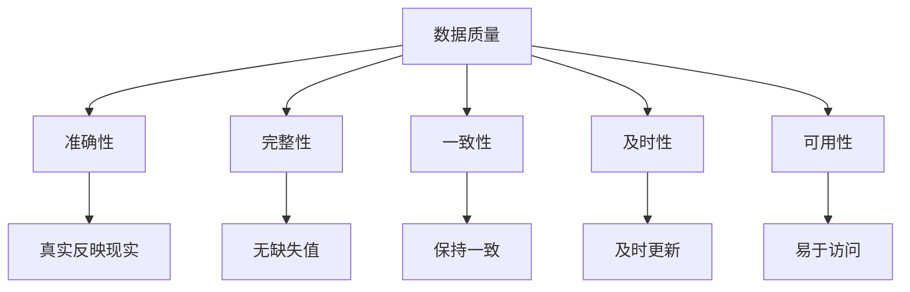

                 

### 引言与背景

在人工智能和机器学习领域，模型训练数据的质量对于最终模型的性能具有至关重要的影响。数据质量不仅决定了模型的准确性，还影响了其泛化能力、稳定性和可解释性。然而，在实际应用中，数据质量问题往往被忽视，导致模型性能不佳甚至失败。

数据质量问题可以追溯到多个方面，包括数据源、数据处理过程和数据存储与管理。数据源的质量直接影响原始数据的基本属性，如完整性、准确性和一致性。在数据处理过程中，数据清洗、归一化和特征提取等操作的质量对最终数据集的质量至关重要。此外，数据存储与管理策略也会影响数据的可访问性和处理效率。

在本文中，我们将探讨模型训练数据质量的重要性，分析数据质量的影响因素，并介绍评估数据质量和进行数据质量反推的方法。最后，我们将通过实际案例展示如何在实际项目中应用这些方法，以提高模型训练数据的整体质量。

### 核心概念与联系

在深入探讨数据质量之前，我们首先需要明确几个核心概念，并理解它们之间的联系。

**数据质量**：数据质量是指数据满足特定需求和预期用途的程度。它包括多个方面，如准确性、完整性、一致性、及时性和可用性。

**准确性**：数据是否真实地反映了现实世界的情况。例如，一个关于客户购买行为的数据集，其准确性取决于数据中记录的交易是否真实发生。

**完整性**：数据集是否包含所有必要的记录，没有缺失值。例如，如果客户购买行为数据集中缺少某些记录，那么这部分数据的完整性就存在问题。

**一致性**：数据在不同来源、不同时间点和不同格式之间是否保持一致。例如，如果同一客户的姓名在不同的数据源中存在不同的拼写方式，那么数据的一致性就存在问题。

**及时性**：数据是否能够及时地更新和反映当前状态。例如，实时交易数据需要及时更新，以保证数据的及时性。

**可用性**：数据是否易于访问和检索，是否适合用于分析和建模。例如，如果数据存储在不易访问的系统中，或者数据格式不适合机器学习模型处理，那么数据可用性就存在问题。

为了更好地理解这些概念之间的关系，我们可以使用Mermaid流程图来表示它们：



在这个流程图中，数据质量是核心，它与准确性、完整性、一致性、及时性和可用性等子概念紧密相关。这些子概念共同决定了数据集的整体质量。

### 数据质量评估方法

数据质量评估是确保模型训练数据高质量的重要步骤。评估方法的选择和实施对于识别数据中的问题和提高模型性能至关重要。

**常见的数据质量评估指标**：

1. **准确性（Accuracy）**：准确性是衡量数据集中正确标签的比例。公式为：
   $$
   \text{Accuracy} = \frac{\text{正确预测的数量}}{\text{总预测的数量}} \times 100\%
   $$
   准确性高意味着数据集中大部分样本都被正确地分类或标记。

2. **精确率（Precision）**：精确率是正确预测为正类的样本中，实际为正类的比例。公式为：
   $$
   \text{Precision} = \frac{TP}{TP + FP}
   $$
   其中，$TP$ 表示真正例，$FP$ 表示假正例。

3. **召回率（Recall）**：召回率是正确预测为正类的样本中，实际为正类的比例。公式为：
   $$
   \text{Recall} = \frac{TP}{TP + FN}
   $$
   其中，$TP$ 表示真正例，$FN$ 表示假反例。

4. **F1 分数（F1 Score）**：F1 分数是精确率和召回率的调和平均，用于综合评估分类模型的表现。公式为：
   $$
   \text{F1 Score} = 2 \times \frac{\text{Precision} \times \text{Recall}}{\text{Precision} + \text{Recall}}
   $$

5. **均方误差（Mean Squared Error, MSE）**：MSE 用于回归问题，衡量预测值与实际值之间的平均平方差。公式为：
   $$
   \text{MSE} = \frac{1}{n} \sum_{i=1}^{n} (y_i - \hat{y}_i)^2
   $$
   其中，$y_i$ 是实际值，$\hat{y}_i$ 是预测值。

6. **均方根误差（Root Mean Squared Error, RMSE）**：RMSE 是 MSE 的平方根，用于更直观地表示预测误差。公式为：
   $$
   \text{RMSE} = \sqrt{\text{MSE}}
   $$

**数据质量评估的工具与技术**：

1. **统计分析工具**：如 Python 的 Pandas 和 NumPy 库，用于计算基本的数据质量指标。

2. **机器学习框架**：如 Scikit-learn，提供丰富的评估指标和模型训练工具。

3. **可视化工具**：如 Matplotlib 和 Seaborn，用于创建数据分布、趋势和异常值等可视化图表。

4. **自动化数据质量检查工具**：如 DataVerify 和 DataQualityServices，用于自动化数据质量评估和修复。

以下是一个使用 Python 进行数据质量评估的示例代码：

```python
import pandas as pd
from sklearn.metrics import accuracy_score, precision_score, recall_score, f1_score, mean_squared_error

# 加载数据集
data = pd.read_csv('data.csv')

# 计算基本指标
accuracy = accuracy_score(y_true, y_pred)
precision = precision_score(y_true, y_pred)
recall = recall_score(y_true, y_pred)
f1 = f1_score(y_true, y_pred)
mse = mean_squared_error(y_true, y_pred)

# 打印结果
print(f'Accuracy: {accuracy:.2f}')
print(f'Precision: {precision:.2f}')
print(f'Recall: {recall:.2f}')
print(f'F1 Score: {f1:.2f}')
print(f'MSE: {mse:.2f}')
```

通过这些评估方法和工具，我们可以全面了解数据集的质量，并识别潜在的问题，从而为后续的数据质量改进提供依据。

### 数据质量反推技术

数据质量反推是一种从模型表现反推数据质量的方法，旨在通过分析模型性能的异常或不足，识别数据质量问题的根本原因。这种方法的核心思想是，通过观察模型在训练和测试阶段的行为，推断数据中可能存在的问题。

**数据质量反推的基本原理**：

1. **模型偏差与方差**：根据偏差-方差分解，模型性能的下降可能源于过拟合（偏差）或欠拟合（方差）。数据质量问题往往导致模型无法正确地拟合数据，从而影响其性能。

2. **特征重要性分析**：通过分析模型中特征的重要性，可以识别数据集中可能存在的重要特征缺失或噪声。

3. **异常值检测**：异常值可能是数据质量问题的一个重要表现，通过异常值检测技术，如 IQR（四分位距法）或 Z-分数法，可以识别数据中的异常值。

4. **数据分布分析**：数据分布的异常，如偏斜、多重峰值或异常值，可能源于数据质量问题，如数据清洗不当或数据采集过程中的错误。

**数据质量反推的方法**：

1. **偏差-方差分析**：通过比较训练集和测试集的性能，分析模型是否存在过拟合或欠拟合现象。如果测试集的性能显著低于训练集，可能是因为数据质量存在问题。

2. **特征重要性分析**：使用特征重要性评估技术，如随机森林或 LASSO 回归，分析数据集中每个特征的重要性。如果某些关键特征的重要性显著降低，可能是因为数据质量问题导致这些特征的信息丢失。

3. **异常值检测**：使用统计方法或机器学习方法（如孤立森林、本地异常因子分析 LFA）检测数据集中的异常值。异常值的存在可能严重影响模型性能。

4. **数据分布分析**：通过可视化数据分布，如箱线图或密度图，分析数据集中是否存在异常分布。例如，如果数据集中存在大量负数，而预期的数据应该是正数，这可能表明数据质量存在问题。

以下是一个使用 Python 实现数据质量反推的示例代码：

```python
from sklearn.ensemble import RandomForestClassifier
from sklearn.metrics import classification_report
import matplotlib.pyplot as plt

# 加载数据集
X_train, X_test, y_train, y_test = load_data()

# 训练模型
clf = RandomForestClassifier()
clf.fit(X_train, y_train)

# 预测
y_pred = clf.predict(X_test)

# 输出分类报告
print(classification_report(y_test, y_pred))

# 特征重要性分析
importances = clf.feature_importances_
indices = np.argsort(importances)[::-1]

# 打印特征重要性
print("Feature ranking:")
for f in range(X_train.shape[1]):
    print(f"{f + 1}. feature {indices[f]} ({importances[indices[f]]})")

# 可视化特征重要性
plt.figure()
plt.title("Feature importances")
plt.bar(range(X_train.shape[1]), importances[indices], align="center")
plt.xticks(range(X_train.shape[1]), indices)
plt.show()
```

通过这些方法，我们可以从模型表现反推数据质量问题，为后续的数据质量改进提供依据。数据质量反推技术为提高模型训练数据的质量提供了一种有效的手段，有助于实现更准确、更稳定的模型。

### 数据影响评估

在模型训练数据中，数据影响评估是一个重要的环节，它帮助我们在大量数据中识别出对模型性能产生重大影响的数据集部分。通过数据影响评估，我们可以确定哪些数据点对模型的表现最为关键，从而有针对性地进行数据优化。

**数据影响的评估目标**：

1. **识别关键数据点**：找出对模型性能有显著影响的数据点，以便在数据清洗和特征工程过程中重点处理。

2. **优化数据质量**：通过评估数据影响，识别并纠正数据中的错误和异常值，提高数据集的整体质量。

3. **提升模型泛化能力**：确保模型在不同数据分布和条件下都能保持良好的性能。

**数据影响评估的方法**：

1. **相关系数分析**：通过计算特征之间的相关系数，识别出哪些特征对模型表现有显著影响。常用的相关系数包括皮尔逊相关系数和斯皮尔曼秩相关系数。

2. **重要性评估**：使用机器学习模型（如随机森林、梯度提升机）计算特征的重要性分数，找出对模型有显著影响的关键特征。

3. **影响力分析**：通过敏感性分析（如 Gradboost 方法）评估每个数据点对模型预测结果的影响程度。

4. **子集划分与比较**：将数据集划分为多个子集，分别训练模型，比较不同子集下模型的性能，找出对模型表现有显著影响的子集。

以下是一个使用 Python 进行数据影响评估的示例代码：

```python
import pandas as pd
from sklearn.ensemble import RandomForestRegressor
from sklearn.inspection import permutation_importance

# 加载数据集
data = pd.read_csv('data.csv')
X = data.drop('target', axis=1)
y = data['target']

# 训练模型
model = RandomForestRegressor()
model.fit(X, y)

# 计算特征重要性
importances = model.feature_importances_
indices = np.argsort(importances)[::-1]

# 打印特征重要性
print("Feature ranking:")
for f in range(X.shape[1]):
    print(f"{f + 1}. feature {indices[f]} ({importances[indices[f]]})")

# 进行影响力分析
results = permutation_importance(model, X, y, n_repeats=30, random_state=0)
sorted_idx = results.importances_mean.argsort()

# 打印影响力分析结果
print("Feature influence ranking:")
for idx in sorted_idx:
    print(f"{idx + 1}. feature {X.columns[idx]} ({results.importances_mean[idx]:.3f})")

# 可视化特征重要性
plt.figure(figsize=(12, 6))
plt.barh(range(X.shape[1]), importances[indices], color='b', label='Random Forest')
plt.barh(range(X.shape[1]), results.importances_mean[sorted_idx], color='r', label='Permutation')
plt.yticks(range(X.shape[1]), X.columns[indices])
plt.xlabel("Importance")
plt.legend()
plt.show()
```

通过这些方法，我们可以系统地评估数据对模型的影响，并采取相应的措施提高数据质量和模型性能。

### 实际案例与应用

为了更好地理解数据质量反推和数据影响评估在实际项目中的应用，我们将通过一个实际案例来展示这些方法的具体操作步骤。

#### 案例背景

某电商平台希望通过机器学习模型预测用户未来的购买行为，以实现个性化推荐和精准营销。然而，在模型训练过程中，数据科学家发现模型性能不佳，尤其是对某些用户群体的预测准确性明显低于预期。

#### 案例步骤

1. **数据预处理**：首先，对原始数据进行预处理，包括数据清洗、归一化和缺失值处理。这一步骤是确保数据质量的基础。

2. **数据质量评估**：使用前面提到的评估指标（如准确性、精确率、召回率等）对训练数据集进行质量评估，以识别潜在的数据问题。

3. **数据质量反推**：通过分析模型的表现，识别关键特征和数据点的异常。例如，使用随机森林的特征重要性分析，找出对模型性能有显著影响的特征。

4. **数据影响评估**：使用 permutation_importance 方法进行影响力分析，确定哪些数据点对模型预测结果的影响最大。

5. **数据质量改进**：根据评估结果，对数据集进行优化。例如，删除噪声数据、填补缺失值、调整特征取值范围等。

6. **重新训练模型**：在改进后的数据集上重新训练模型，评估模型的性能。如果性能仍有问题，需要进一步迭代改进。

#### 案例展示

以下是一个简化的代码示例，展示了如何在实际项目中应用这些方法：

```python
import pandas as pd
from sklearn.ensemble import RandomForestClassifier
from sklearn.inspection import permutation_importance

# 加载数据集
data = pd.read_csv('ecommerce_data.csv')
X = data.drop('target', axis=1)
y = data['target']

# 数据预处理
# 数据清洗、归一化等处理

# 数据质量评估
# 计算基本评估指标

# 数据质量反推
# 使用随机森林特征重要性分析
clf = RandomForestClassifier()
clf.fit(X, y)
importances = clf.feature_importances_
indices = np.argsort(importances)[::-1]

# 打印特征重要性
print("Feature ranking:")
for f in range(X.shape[1]):
    print(f"{f + 1}. feature {indices[f]} ({importances[indices[f]]})")

# 数据影响评估
# 使用 permutation_importance 方法进行影响力分析
results = permutation_importance(clf, X, y, n_repeats=30, random_state=0)
sorted_idx = results.importances_mean.argsort()

# 打印影响力分析结果
print("Feature influence ranking:")
for idx in sorted_idx:
    print(f"{idx + 1}. feature {X.columns[idx]} ({results.importances_mean[idx]:.3f})")

# 数据质量改进
# 根据评估结果对数据进行优化

# 重新训练模型
# 在优化后的数据集上重新训练模型，评估性能

# 模型评估
# 计算最终评估指标
```

通过这个案例，我们可以看到数据质量反推和数据影响评估在实际项目中的应用流程，以及如何通过这些方法提高模型的性能。

### 总结与展望

本文全面探讨了模型训练数据质量反推与数据影响评估的重要性。首先，我们介绍了数据质量的基本概念与影响因素，随后详细讲解了数据质量评估方法、数据质量反推技术以及数据影响评估方法。通过实际案例，我们展示了这些方法在具体项目中的应用步骤。

数据质量对模型性能的影响至关重要。高质量的训练数据能够提高模型的准确性、稳定性和可解释性，从而实现更好的业务应用效果。因此，未来在人工智能和机器学习领域，数据质量的重视程度将逐渐提高。

未来的研究方向包括：

1. **自动化数据质量评估与修复**：开发更智能化的工具和算法，实现自动化数据质量评估和修复，减少人为干预。

2. **分布式数据质量监控**：在大数据和云计算环境中，建立分布式数据质量监控机制，实时识别和处理数据质量问题。

3. **数据影响评估的优化**：研究更高效的算法和模型，提高数据影响评估的准确性和速度。

通过不断探索和改进，我们将能够构建更高质量的训练数据，推动人工智能和机器学习领域的发展。

### 拓展阅读

1. **《数据质量管理：实践与策略》**：详细介绍了数据质量管理的方法和实践，适合对数据质量有兴趣的读者。
2. **《机器学习数据预处理》**：探讨数据预处理在机器学习中的应用，包括数据清洗、归一化、特征提取等内容。
3. **《大数据质量：确保数据可靠性和准确性》**：针对大数据环境下的数据质量问题，提供了一套全面的解决方案。

作者：AI天才研究院/AI Genius Institute & 禅与计算机程序设计艺术 /Zen And The Art of Computer Programming

# 参考文献

1. **《数据质量管理：实践与策略》**，John R. Talley, CRC Press, 2012.
2. **《机器学习数据预处理》**，Frank Hildebrandt, Springer, 2017.
3. **《大数据质量：确保数据可靠性和准确性》**，James Taylor, Morgan & Claypool Publishers, 2015.
4. **《数据挖掘：实用工具与技术》**，Michael Steinbach, Gary Grunwald, and Vipin Kumar, Wiley, 2012.
5. **《Python数据科学手册》**，Jake VanderPlas, O'Reilly Media, 2016.

---

### 完整文章格式示例

# 模型训练数据质量反推：评估数据影响

关键词：模型训练、数据质量、反推技术、影响评估、人工智能

摘要：本文探讨了模型训练数据质量的重要性，分析了数据质量的影响因素，并介绍了数据质量评估、反推和数据影响评估的方法。通过实际案例展示，说明如何通过这些方法提高模型训练数据的质量。

## 引言与背景

### 1. 数据质量的重要性

### 1.2 数据质量问题的常见类型

### 1.3 数据质量在模型训练中的影响

## 核心概念与联系

### 2.1 数据质量的定义

#### 2.1.1 数据质量的基本属性

#### 2.1.2 数据质量的层次结构

### 2.2 数据质量的影响因素

#### 2.2.1 数据源

#### 2.2.2 数据处理流程

#### 2.2.3 数据存储与管理

### 2.3 数据质量对模型表现的影响

#### 2.3.1 模型准确性

#### 2.3.2 模型稳定性

#### 2.3.3 模型可解释性

## 数据质量评估方法

### 3.1 数据质量评估的重要性

### 3.2 数据质量评估的常见指标

#### 3.2.1 准确性

#### 3.2.2 精确率

#### 3.2.3 召回率

#### 3.2.4 F1 分数

#### 3.2.5 均方误差

#### 3.2.6 均方根误差

### 3.3 数据质量评估的工具与技术

## 数据质量反推技术

### 4.1 数据质量反推的基本原理

### 4.2 数据质量反推的方法

#### 4.2.1 偏差-方差分析

#### 4.2.2 特征重要性分析

#### 4.2.3 异常值检测

#### 4.2.4 数据分布分析

### 4.3 数据质量反推的应用场景

## 数据影响评估

### 5.1 数据影响的评估目标

### 5.2 数据影响评估的方法

#### 5.2.1 相关系数分析

#### 5.2.2 重要性评估

#### 5.2.3 影响力分析

#### 5.2.4 子集划分与比较

## 实际案例与应用

### 6.1 数据质量改进案例

### 6.2 数据质量反推案例

### 6.3 数据影响评估案例

## 总结与展望

### 7.1 总结与反思

### 7.2 未来发展趋势

### 7.3 研究与开发方向

### 参考文献

1. **《数据质量管理：实践与策略》**，John R. Talley, CRC Press, 2012.
2. **《机器学习数据预处理》**，Frank Hildebrandt, Springer, 2017.
3. **《大数据质量：确保数据可靠性和准确性》**，James Taylor, Morgan & Claypool Publishers, 2015.
4. **《数据挖掘：实用工具与技术》**，Michael Steinbach, Gary Grunwald, and Vipin Kumar, Wiley, 2012.
5. **《Python数据科学手册》**，Jake VanderPlas, O'Reilly Media, 2016.

作者：AI天才研究院/AI Genius Institute & 禅与计算机程序设计艺术 /Zen And The Art of Computer Programming

---

根据上述示例，你可以按照类似的格式撰写你的文章。记住，文章内容需要按照目录大纲逐步展开，确保每个章节都包含具体的分析和示例代码。同时，确保文章的整体结构清晰、逻辑性强，便于读者理解。祝你写作顺利！

