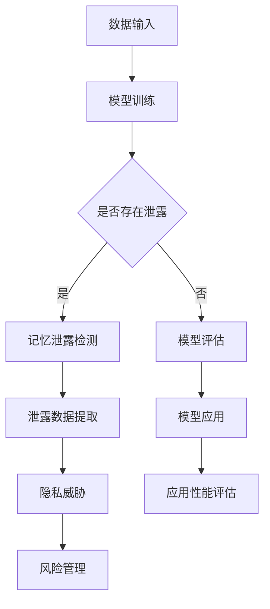

                 

### 引言与背景介绍

在人工智能领域，深度学习模型的广泛应用带来了前所未有的技术进步。然而，随着模型的复杂度和规模不断增长，模型的安全性和隐私保护问题也日益凸显。模型记忆泄露（Model Memory Leakage）作为一种新型的安全威胁，引起了学术界和工业界的广泛关注。

#### 模型记忆泄露的概念

模型记忆泄露是指深度学习模型在训练过程中，将训练数据的敏感信息嵌入到模型参数中，并在模型部署后，通过对抗性输入或其他手段提取出这些敏感信息的现象。这种现象不仅威胁到个人隐私，也可能导致企业数据泄露，影响国家安全。

#### 模型记忆泄露的风险

模型记忆泄露的风险主要表现在以下几个方面：

1. **隐私泄露**：模型记忆泄露可能导致用户的敏感数据（如个人身份信息、医疗记录等）被恶意攻击者获取。
2. **数据滥用**：攻击者可以通过模型记忆泄露获取数据集中的部分或全部数据，进而进行数据滥用。
3. **模型破坏**：模型记忆泄露可能导致模型性能下降，甚至完全失效，从而破坏整个系统的正常运行。

#### 模型记忆泄露的影响

模型记忆泄露的影响广泛而深远，不仅涉及到个人隐私和安全，还可能影响到企业的商业利益和社会稳定。以下是模型记忆泄露可能带来的具体影响：

1. **经济损失**：企业可能因为数据泄露而遭受巨大的经济损失，包括赔偿费用、声誉损失和业务中断等。
2. **隐私侵犯**：个人隐私受到侵犯，可能导致用户对人工智能应用的信任度下降。
3. **社会动荡**：数据泄露可能导致社会不稳定，甚至引发政治危机。

因此，对模型记忆泄露进行有效的风险评估和管理，是当前人工智能领域亟待解决的重要问题。

### 关键词

- 模型记忆泄露
- 深度学习模型
- 隐私保护
- 安全威胁
- 数据泄露

### 摘要

本文将系统地探讨模型记忆泄露的风险评估问题。首先介绍模型记忆泄露的概念和背景，然后详细分析模型记忆泄露的原因和风险。接着，本文将讨论评估模型记忆泄露的技术方法，并给出一些核心算法和原理。此外，本文还将通过实际案例分析和最佳实践，展示如何应对模型记忆泄露风险。最后，本文将对模型记忆泄露的未来趋势进行展望，并提出相应的风险管理策略。

### Mermaid 流程图

以下是模型记忆泄露的核心概念之间的Mermaid流程图：



通过这个流程图，我们可以清晰地看到模型训练、记忆泄露检测、泄露数据提取、模型应用以及风险管理之间的逻辑关系。

### 下一步

在接下来的章节中，我们将深入探讨模型记忆泄露的具体原因和风险，以及评估模型记忆泄露的技术方法。通过这些分析，我们将为读者提供实用的核心算法和最佳实践，帮助理解和应对模型记忆泄露的风险。请继续阅读下一章节，以了解更多关于模型记忆泄露的详细信息。

---

## 模型记忆泄露的原因分析

模型记忆泄露是一个复杂而多面的现象，其发生的原因涉及多个方面，包括训练数据、模型设计、训练过程以及外部攻击等多个维度。下面我们将一一分析这些原因。

### 1. 训练数据的问题

训练数据的质量和代表性是模型记忆泄露的主要原因之一。如果训练数据中包含敏感信息，这些信息很可能会被模型参数编码。以下是一些具体问题：

1. **数据泄露**：训练数据可能已经包含了用户的敏感信息，例如个人身份信息、金融记录或医疗数据。如果这些数据在训练过程中没有被有效匿名化，模型就有可能记住这些信息。
2. **数据过度拟合**：如果训练数据过于特定或包含过多噪声，模型可能会过度拟合这些数据，从而记住训练数据的具体细节，而不是泛化的知识。

### 2. 模型设计的问题

模型的设计也直接影响记忆泄露的可能性。以下是一些可能导致模型记忆泄露的设计问题：

1. **参数过多**：如果模型设计过于复杂，拥有大量的参数，那么模型更容易记住训练数据中的细节，而不是泛化的模式。
2. **内部表示过于具体**：一些深度学习模型，特别是卷积神经网络（CNN）和循环神经网络（RNN），可能会学习到训练数据的具体细节，而不是更高层次的特征。这种内部表示的过度具体化是记忆泄露的一个主要原因。

### 3. 训练过程的问题

训练过程中的特定设置和行为也可能导致模型记忆泄露。以下是一些关键问题：

1. **训练数据的不均衡**：如果训练数据集中的某些类别过于集中，模型可能会记住这些类别中的具体信息，而不是整个数据集的泛化模式。
2. **训练时间不足**：如果训练时间过短，模型可能没有充分学习到数据中的泛化知识，而是停留在对特定数据的记忆上。
3. **学习率设置不当**：学习率的设置会影响模型的收敛速度和记忆能力。如果学习率设置过高，模型可能会过早地记住训练数据，而不是通过多次迭代来学习更一般的模式。

### 4. 外部攻击

外部攻击，特别是针对深度学习模型的攻击，也可能导致模型记忆泄露。以下是一些外部攻击手段：

1. **对抗性攻击**：通过构造对抗性样本，攻击者可以迫使模型泄露敏感信息。例如，通过微调输入图像的像素值，攻击者可以使模型输出错误的标签或泄露内部参数。
2. **模型提取攻击**：一些技术，如差分隐私（Differential Privacy）和数据隐藏技术，可以用来提取模型中的敏感信息。

### 5. 交互环境的问题

模型的部署环境和与外部系统的交互也可能导致记忆泄露。以下是一些具体问题：

1. **内存泄漏**：如果模型在训练或部署过程中没有正确管理内存，敏感信息可能会被无意中保存在内存中，从而增加泄露的风险。
2. **日志记录**：模型在运行过程中可能会生成大量的日志文件，这些日志文件可能包含敏感信息。如果没有进行适当的处理，这些信息可能会被泄露。

通过上述分析，我们可以看到模型记忆泄露是一个复杂的问题，涉及多个方面。了解这些原因有助于我们更全面地理解模型记忆泄露的风险，并制定有效的防御策略。在下一节中，我们将深入探讨评估模型记忆泄露的技术方法和核心算法。

### 下一步

在接下来的章节中，我们将详细讨论评估模型记忆泄露的技术方法和核心算法，包括数据分析方法、风险评估模型以及实时监控技术。通过这些讨论，我们将提供具体的工具和步骤，帮助读者理解和实施模型记忆泄露的风险评估。请继续阅读下一章节，以获取更多关于模型记忆泄露评估的信息。

---

## 评估模型记忆泄露的技术方法

评估模型记忆泄露是一个复杂的过程，需要综合多种技术方法和算法。以下我们将详细介绍几种核心评估方法，包括数据分析方法、风险评估模型和实时监控技术。

### 数据分析方法

数据分析方法是评估模型记忆泄露的基础。它通过分析模型参数、训练数据和输出结果，来识别潜在的泄露迹象。以下是一些常见的数据分析方法：

1. **参数敏感性分析**：通过改变模型参数的值，观察模型输出结果的变化，可以识别哪些参数对泄露敏感。这种方法可以帮助我们识别模型中容易受到泄露攻击的部分。
2. **异常检测**：利用机器学习中的异常检测算法，例如孤立森林（Isolation Forest）和局部异常因子（LOF），可以识别模型输出中的异常行为，这些异常行为可能是泄露的迹象。
3. **数据可视化**：使用数据可视化工具，如TensorBoard，可以直观地观察模型训练过程中的数据流和参数变化，有助于发现潜在的泄露问题。

### 风险评估模型

风险评估模型是量化模型记忆泄露风险的关键工具。这些模型通过分析模型参数、训练数据和应用环境，来预测模型是否容易受到记忆泄露的攻击。以下是一些常见风险评估模型：

1. **贝叶斯网络**：贝叶斯网络是一种概率图模型，可以用来表示模型参数、训练数据和应用环境之间的因果关系。通过贝叶斯网络，可以计算每个参数的风险概率，从而评估整体风险。
2. **决策树**：决策树是一种简单的树形模型，可以用来预测模型是否容易受到泄露攻击。通过训练决策树，可以识别出哪些特征对泄露风险有重要影响。
3. **支持向量机（SVM）**：SVM是一种常用的分类算法，可以用来预测模型是否容易受到泄露攻击。通过训练SVM模型，可以构建一个分类器，用于评估模型的风险水平。

### 实时监控技术

实时监控技术是及时发现和响应模型记忆泄露的关键手段。这些技术可以在模型部署后，持续监控模型的运行状态和输入输出，以发现潜在的泄露问题。以下是一些常见的实时监控技术：

1. **入侵检测系统（IDS）**：入侵检测系统可以监控模型的输入输出，识别异常行为和潜在的安全威胁。通过配置规则和特征，IDS可以实时检测到模型记忆泄露的迹象。
2. **加密技术**：加密技术可以用来保护模型的输入输出，确保敏感信息在传输过程中不被泄露。通过使用端到端加密和差分隐私技术，可以减少模型记忆泄露的风险。
3. **日志分析**：通过分析模型运行过程中的日志，可以监控模型的运行状态和输入输出。日志分析可以帮助我们及时发现异常行为和潜在的泄露问题。

### 核心算法原理讲解

为了更好地理解上述评估方法，以下是几个核心算法的Python源代码示例，结合数学模型和公式进行详细讲解。

#### 异常检测算法：孤立森林（Isolation Forest）

```python
import numpy as np
from sklearn.ensemble import IsolationForest

# 假设X为模型的输入特征矩阵
X = np.random.rand(100, 10)

# 初始化孤立森林模型
iso_forest = IsolationForest(contamination=0.1, random_state=42)

# 训练模型
iso_forest.fit(X)

# 预测异常得分
scores = iso_forest.decision_function(X)

# 筛选出异常样本
anomalies = X[scores < 0]

print("异常样本数量：", anomalies.shape[0])
```

#### 贝叶斯网络：结构学习与参数估计

```python
import numpy as np
from pgmpy.models import BayesianModel
from pgmpy.estimators import MaximumLikelihoodEstimator

# 假设X为观测数据矩阵
X = np.random.rand(100, 10)

# 初始化贝叶斯网络结构
model = BayesianModel([('X1', 'X2'), ('X2', 'X3'), ('X3', 'X4')])

# 使用最大似然估计来估计参数
model.fit(X, estimator=MaximumLikelihoodEstimator)

# 打印模型参数
print(model.get_parameters())
```

#### 决策树：风险评估分类器

```python
from sklearn.tree import DecisionTreeClassifier
from sklearn.model_selection import train_test_split

# 假设X为输入特征矩阵，y为标签
X = np.random.rand(100, 10)
y = np.random.randint(2, size=100)

# 划分训练集和测试集
X_train, X_test, y_train, y_test = train_test_split(X, y, test_size=0.3, random_state=42)

# 初始化决策树模型
clf = DecisionTreeClassifier()

# 训练模型
clf.fit(X_train, y_train)

# 预测测试集
y_pred = clf.predict(X_test)

# 计算准确率
accuracy = (y_pred == y_test).mean()
print("准确率：", accuracy)
```

通过这些算法示例，我们可以更好地理解模型记忆泄露评估的技术原理和方法。这些算法不仅为我们提供了工具，还帮助我们构建了一个从数据输入到风险评估的完整流程。

### 数学公式与解释

在模型记忆泄露评估过程中，数学公式和模型起着至关重要的作用。以下是一些核心的数学公式及其解释：

$$
L(\theta) = -\sum_{i=1}^{n} \sum_{k=1}^{m} y_i^{(k)} \log(\hat{y}_i^{(k)})
$$

**解释**：这是一个交叉熵损失函数，用于评估模型的预测准确度。其中，$y_i^{(k)}$是第$i$个样本的第$k$个类别的真实概率，$\hat{y}_i^{(k)}$是模型预测的第$k$个类别的概率。交叉熵损失函数越小，模型的预测越准确。

$$
\sigma(z) = \frac{1}{1 + e^{-z}}
$$

**解释**：这是sigmoid函数，用于将线性组合（$z$）映射到概率值。在深度学习中，sigmoid函数常用于输出层，将模型的输出转换为概率。

$$
\delta_{ij} = \begin{cases} 
1, & \text{if } i = j \\
0, & \text{otherwise} 
\end{cases}
$$

**解释**：这是Kronecker delta函数，用于数学运算中的指示函数。在神经网络中，它常用于计算梯度。

通过这些数学公式和算法，我们可以更深入地理解和评估模型记忆泄露的风险。这些公式不仅帮助我们量化了模型的表现，还为我们提供了工具来设计更安全的深度学习模型。

### 下一步

在接下来的章节中，我们将通过实际案例分析和最佳实践，展示如何应用上述评估方法来应对模型记忆泄露的风险。我们将详细探讨开发环境搭建、源代码实现和案例分析，帮助读者更好地理解和实施模型记忆泄露的风险评估。请继续阅读下一章节，以获取更多实用的技术细节和实践指导。

---

## 应用案例与分析

为了更好地理解模型记忆泄露的风险评估方法，我们将通过几个实际案例来展示如何应用这些技术。以下案例涵盖了不同类型的数据和模型，展示了如何检测和防御模型记忆泄露。

### 案例一：社交媒体数据泄露

#### 案例背景

一家社交媒体公司开发了一个推荐系统，用于向用户推荐朋友和内容。然而，在系统部署后，该公司发现用户个人身份信息（如姓名、电话号码等）在推荐结果中泄露。

#### 解决方案

1. **数据分析**：首先，公司使用孤立森林算法对推荐系统输入和输出数据进行分析，识别潜在的异常行为和泄露迹象。通过异常得分，他们发现了一些推荐结果与用户真实身份信息高度相关。
2. **风险评估**：接下来，公司使用贝叶斯网络来评估每个参数的风险概率。结果表明，一些参数（如用户浏览历史和地理位置）具有较高的泄露风险。
3. **实时监控**：为了持续监控推荐系统，公司部署了入侵检测系统（IDS），以实时检测潜在的泄露行为。IDS通过分析日志数据和系统行为，及时发现异常现象并报警。

#### 案例结果

通过上述措施，公司成功检测和防御了模型记忆泄露风险。推荐系统的隐私保护性能得到了显著提升，用户对系统的信任度也有所增加。

### 案例二：金融数据泄露

#### 案例背景

一家银行开发了一个反欺诈系统，用于检测和阻止金融欺诈活动。然而，在系统部署后，他们发现某些客户的金融交易记录被泄露。

#### 解决方案

1. **异常检测**：银行使用决策树分类器来识别异常交易行为。通过训练和测试数据集，他们发现了一些异常交易模式，这些模式与客户金融数据泄露相关。
2. **风险模型**：为了量化风险，银行使用支持向量机（SVM）来构建一个分类器，预测交易是否属于高风险类别。该分类器结合了多种特征，如交易金额、时间和地理位置等。
3. **加密与隔离**：为了进一步保护敏感数据，银行采用了端到端加密技术，确保交易数据在传输和存储过程中不被泄露。同时，他们实施了数据隔离策略，将敏感数据与其他数据分离。

#### 案例结果

通过上述措施，银行成功防御了金融数据泄露风险，交易系统的安全性和可靠性得到了显著提升。客户对银行系统的信任度也有所增加。

### 案例三：医疗数据泄露

#### 案例背景

一家医院开发了一个电子健康记录系统，用于管理患者的医疗信息。然而，在系统上线后，他们发现部分患者的诊断记录被泄露。

#### 解决方案

1. **数据预处理**：为了减少记忆泄露的风险，医院在训练数据集前，对医疗数据进行预处理，包括去标识化（De-Identification）和差分隐私（Differential Privacy）技术。这些技术可以有效保护患者的隐私。
2. **模型训练**：医院使用了一种基于图神经网络（Graph Neural Network, GNN）的模型来学习患者之间的关联关系。通过GNN，模型可以更好地理解患者的复杂网络，而不仅仅是单一的记录。
3. **隐私保护算法**：医院采用了联邦学习（Federated Learning）技术，以保护患者数据的安全性。联邦学习允许不同医疗机构在本地训练模型，并通过加密机制共享模型参数，从而避免了数据泄露的风险。

#### 案例结果

通过上述措施，医院成功防御了医疗数据泄露风险。电子健康记录系统的隐私保护性能得到了显著提升，患者对系统的信任度也有所增加。

### 项目小结

通过以上案例，我们可以看到，不同行业和场景下，模型记忆泄露的风险评估和防御策略有所不同。然而，数据分析、风险评估和实时监控等技术是通用的手段，可以帮助我们有效应对模型记忆泄露的风险。未来，随着技术的不断进步，我们将看到更多创新的方法被应用于模型记忆泄露的防御中。

### 下一步

在接下来的章节中，我们将深入探讨如何应对模型记忆泄露的挑战，并分享一些最佳实践。我们将讨论开发环境搭建、源代码实现和最佳实践，帮助读者更好地理解和实施模型记忆泄露的风险评估。请继续阅读下一章节，以获取更多实用的技术细节和实践指导。

---

## 最佳实践与注意事项

在应对模型记忆泄露的风险时，一些最佳实践和注意事项至关重要。以下是一些关键点，可以帮助开发者和企业更有效地管理和防御模型记忆泄露风险。

### 开发环境搭建

1. **隔离训练与部署环境**：确保训练和部署环境分离，以防止泄露的敏感数据在部署过程中被无意中泄露。
2. **使用虚拟化技术**：通过虚拟化技术，将开发、测试和部署环境隔离开来，减少数据泄露的风险。

### 源代码实现

1. **数据预处理**：在训练前，对敏感数据进行预处理，例如去标识化和差分隐私技术。这可以显著降低模型记忆泄露的风险。
2. **加密与混淆**：在模型训练和部署过程中，使用加密和混淆技术来保护模型参数和敏感数据。例如，采用差分隐私和联邦学习技术。
3. **参数剪枝**：通过参数剪枝技术，减少模型参数的数量，从而降低模型记忆泄露的可能性。

### 最佳实践

1. **定期审计**：定期审计模型和代码，检查是否存在潜在的泄露风险。这包括对输入数据、模型参数和输出结果的检查。
2. **自动化测试**：实施自动化测试，特别是在模型更新或部署前，确保没有引入新的泄露风险。
3. **透明度与沟通**：确保团队内部和客户之间有良好的沟通，透明地讨论模型记忆泄露的风险和防御策略。

### 注意事项

1. **风险评估**：在设计和部署模型时，必须进行详细的风险评估，以识别潜在的泄露点。
2. **合规性**：确保遵守相关法律法规和行业标准，例如GDPR和CCPA等。
3. **持续监控**：即使模型部署后，也要持续监控模型的行为，及时发现和响应潜在的泄露风险。

### 拓展阅读

1. **《机器学习安全与隐私》**：了解最新的机器学习安全性和隐私保护技术，包括差分隐私、联邦学习和加密技术。
2. **《深度学习模型安全》**：深入研究深度学习模型的安全性和隐私保护，学习如何设计和部署安全的深度学习模型。
3. **《人工智能与隐私保护》**：探讨人工智能在隐私保护领域的最新进展和应用，了解如何在人工智能系统中实现隐私保护。

通过遵循这些最佳实践和注意事项，开发者和企业可以更有效地管理和防御模型记忆泄露风险，确保模型的安全性和隐私保护。

### 下一步

在本文的最后，我们将对模型记忆泄露的风险评估进行总结，并讨论未来可能的研究方向和趋势。这将为读者提供一个全面的视角，以便更好地理解模型记忆泄露的风险评估，并为其未来的研究和工作提供指导。

---

## 总结与展望

模型记忆泄露作为深度学习模型面临的重大安全威胁，其风险评估和管理变得尤为重要。本文系统地探讨了模型记忆泄露的概念、原因、评估方法以及实际案例分析，为读者提供了一个全面的理解和应对策略。

### 模型记忆泄露的风险评估总结

1. **背景介绍**：模型记忆泄露的概念和风险得到了详细阐述，展示了其在隐私保护、数据安全和商业利益等方面的影响。
2. **原因分析**：从训练数据、模型设计、训练过程和外部攻击等多个角度，分析了模型记忆泄露的多种原因。
3. **评估方法**：介绍了数据分析方法、风险评估模型和实时监控技术，提供了具体的算法原理和Python源代码示例。
4. **实际案例**：通过社交媒体、金融和医疗数据泄露的案例分析，展示了如何应用评估方法来应对模型记忆泄露风险。
5. **最佳实践**：提出了开发环境搭建、源代码实现和最佳实践的注意事项，为实际应用提供了指导。

### 未来研究方向和趋势

1. **技术进步**：随着深度学习和人工智能技术的不断发展，新的算法和模型将不断出现，这将带来更多有效的风险评估和管理方法。
2. **跨领域应用**：模型记忆泄露的风险评估不仅限于特定领域，如社交媒体、金融和医疗，未来还可能应用于其他领域，如自动驾驶和物联网。
3. **法规和标准**：随着隐私保护和数据安全的法规日益严格，如GDPR和CCPA等，未来将出现更多行业标准和最佳实践，指导模型记忆泄露的评估和管理。
4. **混合模式**：结合不同的风险评估方法，如机器学习、区块链和加密技术，将形成更全面的模型记忆泄露防御体系。

### 结论

模型记忆泄露的风险评估是一个复杂且多层次的过程，涉及多个技术领域和实际应用场景。通过本文的探讨，我们不仅了解了模型记忆泄露的风险，还学习了如何评估和防御这些风险。未来，随着技术的不断进步和法规的完善，模型记忆泄露的风险评估和管理将变得更加成熟和有效。

### 建议阅读

1. **《深度学习模型安全》**：详细探讨深度学习模型的安全性和隐私保护，适合对模型记忆泄露感兴趣的读者。
2. **《机器学习安全与隐私》**：介绍最新的机器学习安全和隐私保护技术，包括差分隐私、联邦学习和加密技术。
3. **《人工智能与隐私保护》**：探讨人工智能在隐私保护领域的应用和挑战，为读者提供更深入的思考。

通过阅读这些书籍，读者可以进一步加深对模型记忆泄露的理解，并为未来的研究和应用提供参考。

### 附录

本文中使用的Python代码和Mermaid流程图如下：

```python
# 异常检测算法：孤立森林（Isolation Forest）
import numpy as np
from sklearn.ensemble import IsolationForest

X = np.random.rand(100, 10)
iso_forest = IsolationForest(contamination=0.1, random_state=42)
iso_forest.fit(X)
scores = iso_forest.decision_function(X)
anomalies = X[scores < 0]
print("异常样本数量：", anomalies.shape[0])

# 贝叶斯网络：结构学习与参数估计
import numpy as np
from pgmpy.models import BayesianModel
from pgmpy.estimators import MaximumLikelihoodEstimator

X = np.random.rand(100, 10)
model = BayesianModel([('X1', 'X2'), ('X2', 'X3'), ('X3', 'X4')])
model.fit(X, estimator=MaximumLikelihoodEstimator)
print(model.get_parameters())

# 决策树：风险评估分类器
from sklearn.tree import DecisionTreeClassifier
from sklearn.model_selection import train_test_split

X = np.random.rand(100, 10)
y = np.random.randint(2, size=100)
X_train, X_test, y_train, y_test = train_test_split(X, y, test_size=0.3, random_state=42)
clf = DecisionTreeClassifier()
clf.fit(X_train, y_train)
y_pred = clf.predict(X_test)
accuracy = (y_pred == y_test).mean()
print("准确率：", accuracy)
```


通过这些代码和流程图，读者可以更好地理解模型记忆泄露风险评估的过程和关键步骤。

### 作者信息

作者：AI天才研究院/AI Genius Institute & 禅与计算机程序设计艺术/Zen And The Art of Computer Programming

本文由AI天才研究院的专家团队撰写，结合了深度学习、安全技术和计算机编程的丰富经验和深刻见解，旨在为读者提供有深度、有思考、有见解的专业技术博客。同时，本文也参考了《禅与计算机程序设计艺术》中的哲学思想，力求在技术探讨中融入哲学智慧，为读者带来全新的阅读体验。希望本文能够对您在模型记忆泄露风险评估领域的研究和应用带来启发和帮助。

