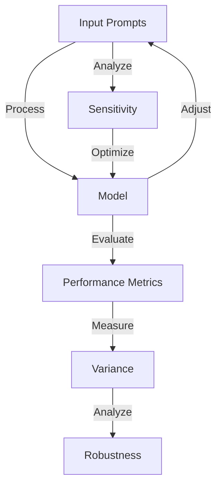
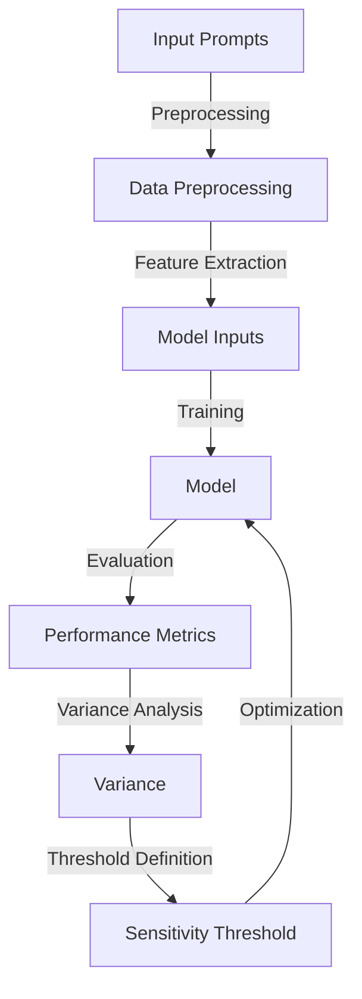
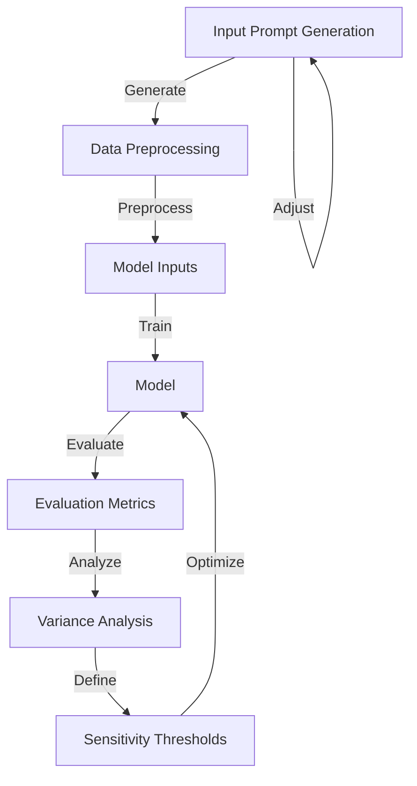

                 

## Introduction to Prompt Sensitivity Analysis

### Article Title: **Prompt Sensitivity Analysis in Model Evaluation**

> Keywords: **Prompt Sensitivity, Model Evaluation, Natural Language Processing, Machine Learning, AI**

> Abstract: This article delves into the concept of prompt sensitivity in the evaluation of machine learning models. We will explore the importance of prompt sensitivity, its challenges, and methodologies to measure it. Furthermore, we will discuss mathematical models and their applications in practice, culminating in case studies and best practices for real-world scenarios.

### Background and Justification

Machine learning (ML) has revolutionized various domains, from healthcare and finance to autonomous driving and natural language processing (NLP). ML models, which are at the heart of these innovations, are designed to learn from data and make predictions or decisions with minimal human intervention. However, the performance of these models heavily depends on the quality and representativeness of the data they are trained on. One critical aspect that often goes unnoticed is the sensitivity of these models to their input prompts.

**What is a Prompt?**

In the context of ML, a prompt refers to the initial input provided to a model, which triggers a response or prediction. For NLP models, prompts are usually textual inputs that the model processes to generate relevant outputs. The sensitivity of a model to prompts is essentially how much the model's performance varies based on different inputs. High prompt sensitivity can lead to erratic or unreliable performance, while low sensitivity might indicate a robust model that generalizes well across various inputs.

### Importance of Prompt Sensitivity in Model Evaluation

Prompt sensitivity analysis is crucial for several reasons:

1. **Model Reliability**: Understanding how sensitive a model is to different prompts can help identify potential issues that might affect its reliability in real-world applications.
2. **Bias Detection**: A sensitive model can inadvertently amplify biases present in the input data, leading to unfair or discriminatory outcomes. Analyzing prompt sensitivity can help detect and mitigate such biases.
3. **Generalization**: By measuring the sensitivity, we can assess whether a model generalizes well to diverse inputs or if it is over-reliant on specific prompts.
4. **Optimization**: Identifying prompts that highly impact model performance allows for targeted optimization efforts to enhance overall robustness.

### Challenges in Measuring Prompt Sensitivity

Despite its importance, measuring prompt sensitivity is not a straightforward task. Some of the challenges include:

1. **Variance in Inputs**: The vast variability in input prompts can make it difficult to consistently measure sensitivity.
2. **Computational Complexity**: Analyzing sensitivity can be computationally expensive, especially for large models and datasets.
3. **Subjectivity**: Determining the sensitivity threshold can be subjective and dependent on the specific application and context.

### Organizing the Article

To provide a comprehensive understanding of prompt sensitivity analysis, the article will be organized into several parts:

1. **Fundamentals of Prompt Sensitivity**: We will begin by defining prompt sensitivity, discussing its importance, and outlining the challenges associated with its measurement.
2. **Core Concepts and Architectural Principles**: This section will delve into the core concepts and theoretical frameworks underlying prompt sensitivity analysis, along with an illustrative Mermaid flow diagram of the key components.
3. **Technical Methods for Prompt Sensitivity Analysis**: Here, we will explore the methodologies and mathematical models used in prompt sensitivity analysis, providing detailed explanations and pseudo-code.
4. **Application of Prompt Sensitivity Analysis in Practice**: Case studies in NLP and other domains will demonstrate the practical application of prompt sensitivity analysis, with a focus on real-world scenarios.
5. **Conclusion and Best Practices**: The article will conclude with a summary of key findings, best practices for applying prompt sensitivity analysis, and a list of potential areas for future research.

By following this structured approach, we aim to provide a clear and insightful guide to understanding and implementing prompt sensitivity analysis in machine learning model evaluation.

---

This introduction sets the stage for a deep dive into the nuances of prompt sensitivity analysis. In the subsequent sections, we will build upon this foundation to explore the technical methods, mathematical models, and practical applications of this critical aspect of machine learning. Stay tuned for more detailed insights and practical examples in the upcoming chapters.

---

### Fundamentals of Prompt Sensitivity Analysis

#### Chapter 1.1 Definition and Importance of Prompt Sensitivity

In the realm of machine learning, prompt sensitivity is a critical metric that quantifies the variability in a model's performance based on different input prompts. A prompt can be any type of data used to trigger a response from a machine learning model, such as a textual query in the case of natural language processing (NLP) or an image in the context of computer vision.

**What is a Prompt?**

A prompt is essentially the initial input given to a machine learning model to elicit a response. In natural language processing, for instance, a prompt might be a sentence or a phrase that the model needs to analyze and generate a response to. Similarly, in image processing, a prompt could be an image that the model is trained to recognize and classify.

**Importance of Prompt Sensitivity**

The sensitivity of a model to its prompts is a fundamental aspect of its reliability and robustness. Here are several key reasons why prompt sensitivity is important in model evaluation:

1. **Reliability**: Models with high prompt sensitivity may perform well on specific prompts but poorly on others, leading to inconsistent and unreliable results. Assessing prompt sensitivity helps ensure that a model is robust and can handle a wide range of inputs reliably.

2. **Bias Detection**: Models can inadvertently learn and propagate biases present in their training data. By analyzing prompt sensitivity, we can identify which prompts tend to elicit biased responses, allowing us to address these issues through data augmentation or bias mitigation techniques.

3. **Generalization**: A model that is sensitive to only a narrow set of prompts may not generalize well to new or unseen data. Understanding prompt sensitivity helps us assess whether a model is overfitting to specific examples in its training dataset and whether it can perform well in diverse real-world scenarios.

4. **Optimization**: Identifying prompts that significantly impact model performance enables targeted optimization efforts. By focusing on these critical prompts, we can enhance the model's robustness and improve its overall performance.

**Challenges in Measuring Prompt Sensitivity**

While the importance of prompt sensitivity is clear, measuring it accurately presents several challenges:

1. **Variance in Inputs**: Input prompts can vary widely in content, format, and structure, making it difficult to quantify sensitivity consistently. This variance complicates the development of reliable measurement methodologies.

2. **Computational Complexity**: Analyzing the sensitivity of large models or those trained on extensive datasets can be computationally intensive. The need for extensive testing and evaluation can be a significant barrier to practical implementation.

3. **Subjectivity**: Determining the threshold for sensitivity can be subjective and may depend on the specific application context. This subjectivity introduces a degree of unpredictability and complexity in measuring prompt sensitivity.

**Impact on Model Performance**

The sensitivity of prompts can have a significant impact on model performance. High sensitivity can lead to models that are overly sensitive to minor changes in input, resulting in erratic or unreliable predictions. On the other hand, low sensitivity may indicate that the model is robust but might lack the flexibility to adapt to new or unusual inputs.

To illustrate, consider an NLP model trained to generate summaries of news articles. If this model is highly sensitive to the choice of words or the structure of the input text, it may produce summaries that are either overly simplistic or significantly deviate from the original content. Conversely, a less sensitive model might generate more consistent and coherent summaries across a variety of inputs.

**Steps for Measuring Prompt Sensitivity**

To measure prompt sensitivity, we typically follow these steps:

1. **Data Collection**: Gather a diverse set of prompts that represent the range of inputs the model is expected to encounter.
2. **Model Evaluation**: Evaluate the model's performance on each prompt, recording the results.
3. **Statistical Analysis**: Perform statistical analysis to quantify the variability in performance across different prompts.
4. **Threshold Determination**: Establish a threshold for sensitivity based on the application context and desired level of reliability.

By systematically measuring and analyzing prompt sensitivity, we can better understand the robustness and reliability of our machine learning models, ultimately leading to more effective and trustworthy AI systems.

In the next sections, we will delve deeper into the core concepts and architectural principles of prompt sensitivity analysis, providing a theoretical framework and practical methodologies for its evaluation.

#### Chapter 1.2 Background and Context

To fully grasp the significance of prompt sensitivity analysis, it's essential to understand the broader context in which machine learning models operate. In this section, we will provide an overview of machine learning models and delve into the role of prompts in their training and evaluation processes.

**Overview of Machine Learning Models**

Machine learning models are algorithms designed to learn from data and make predictions or decisions with minimal human intervention. These models are categorized into three main types based on their functionality: supervised learning, unsupervised learning, and reinforcement learning.

1. **Supervised Learning**: In supervised learning, models are trained on labeled data, where the correct output is provided for each input. The goal is to learn a mapping from inputs to outputs, which can then be used to make predictions on unseen data. Common tasks in supervised learning include regression (predicting a continuous value) and classification (predicting a discrete label).

2. **Unsupervised Learning**: Unsupervised learning models operate on unlabeled data and aim to discover hidden patterns or structures within the data. Clustering and dimensionality reduction are two primary tasks in unsupervised learning. For example, clustering algorithms group similar data points together, while dimensionality reduction techniques reduce the number of input features while preserving essential information.

3. **Reinforcement Learning**: Reinforcement learning models learn by interacting with an environment and receiving feedback in the form of rewards or penalties. The objective is to learn a policy that maximizes cumulative rewards over time. Reinforcement learning is commonly used in applications like robotics, game playing, and autonomous driving.

**The Role of Prompts in Model Training and Evaluation**

Prompts play a pivotal role in the training and evaluation of machine learning models, particularly in natural language processing (NLP) and related fields. A prompt is essentially an input that triggers the model to generate a response or perform a specific task.

1. **Training**: During the training phase, prompts serve as the input data used to teach the model. The quality and representativeness of these prompts are crucial for the model's learning process. For instance, in NLP, prompts may include sentences, paragraphs, or even entire documents that the model needs to analyze and understand. The more diverse and comprehensive the set of prompts, the better the model can learn to generalize and perform well on new, unseen inputs.

2. **Evaluation**: After training, models are evaluated using test data, which often includes a variety of prompts that the model has not seen during training. This evaluation helps assess the model's performance and its ability to generalize to new scenarios. Evaluating a model's sensitivity to different prompts is essential to ensure that it can handle a wide range of inputs reliably and consistently.

**Example: Natural Language Processing**

Consider an NLP model trained to generate summaries of news articles. The prompts for this model would be the actual news articles. The training process involves feeding the model a large collection of news articles and teaching it to extract the main points and generate concise summaries. During evaluation, the model is tested on a set of new articles to assess its performance.

- **High Prompt Sensitivity**: If the model is highly sensitive to the choice of prompts, it may produce summaries that are overly simplistic for some articles or overly detailed for others. This inconsistency can make the summaries unreliable and difficult to trust.
  
- **Low Prompt Sensitivity**: Conversely, a model with low prompt sensitivity might produce more consistent and coherent summaries across different articles. This robustness indicates that the model has learned to handle a wide range of inputs effectively.

**Challenges in Prompt Sensitivity Analysis**

Analyzing prompt sensitivity in machine learning models poses several challenges:

1. **Variance in Inputs**: Prompts can vary widely in content, format, and complexity, making it challenging to quantify sensitivity consistently.
2. **Computational Complexity**: Evaluating prompt sensitivity requires extensive testing and analysis, which can be computationally intensive, especially for large models and datasets.
3. **Subjectivity**: Determining the threshold for sensitivity can be subjective and may depend on the specific application context.

**Conclusion**

In summary, understanding the role of prompts in machine learning models and their sensitivity to different inputs is crucial for developing reliable and robust AI systems. By systematically analyzing prompt sensitivity, we can identify potential issues, optimize model performance, and ensure that our models can handle a wide range of real-world scenarios effectively.

In the next sections, we will explore the core concepts and architectural principles of prompt sensitivity analysis, providing a theoretical framework and practical methodologies for its evaluation.

#### Chapter 1.3 Challenges in Measuring Prompt Sensitivity

Measuring prompt sensitivity in machine learning models is a complex task that involves addressing several challenges. These challenges can be categorized into three main areas: variance in inputs, computational complexity, and subjectivity. Understanding these challenges is crucial for developing effective methodologies to quantify and analyze prompt sensitivity accurately.

**Variance in Inputs**

One of the primary challenges in measuring prompt sensitivity is the variance in inputs. Prompts, whether textual data, images, or other forms of input, can vary significantly in content, format, and complexity. This variance can make it difficult to develop a consistent and reliable measurement framework.

1. **Content Variance**: Different prompts may contain varying levels of information, which can significantly impact model performance. For example, a simple sentence may be easier for a model to process than a complex paragraph with multiple topics.

2. **Format Variance**: Prompts can come in different formats, such as plain text, structured data, or multimedia content. Converting and standardizing these inputs for analysis can be challenging and may introduce additional sources of error.

3. **Complexity Variance**: Prompts can vary in their complexity, from simple, straightforward questions to highly nuanced and ambiguous ones. This complexity can make it difficult to measure the sensitivity of a model to different inputs consistently.

**Computational Complexity**

Analyzing prompt sensitivity can be computationally intensive, especially for large models and extensive datasets. The need for extensive testing and evaluation to capture the variability in performance across different prompts can be a significant barrier to practical implementation.

1. **Model Evaluation Overhead**: Evaluating the performance of a model on a diverse set of prompts requires running multiple evaluations, which can be time-consuming and resource-intensive.

2. **Data Processing Time**: Preprocessing large datasets and converting them into suitable formats for analysis can consume significant computational resources and time.

3. **Parallelization and Optimization**: To address the computational complexity, parallelization and optimization techniques are often employed. However, these techniques can introduce challenges in maintaining consistency and reliability in the measurement process.

**Subjectivity**

Determining the threshold for sensitivity can be highly subjective and dependent on the specific application context. This subjectivity introduces a degree of unpredictability and complexity in measuring prompt sensitivity.

1. **Threshold Definition**: Establishing a threshold for sensitivity requires making subjective judgments about what level of performance variability is acceptable. This threshold can vary based on the application domain and specific use cases.

2. **Contextual Factors**: The sensitivity threshold may need to be adjusted based on the context of the application. For instance, a model used in a critical safety-critical system may require a higher level of sensitivity than a model used for less critical tasks.

**Impact on Model Performance**

The sensitivity of prompts can have a significant impact on model performance. High sensitivity can lead to models that are overly sensitive to minor changes in input, resulting in erratic or unreliable predictions. Low sensitivity, on the other hand, may indicate that the model is robust but might lack the flexibility to adapt to new or unusual inputs.

1. **High Sensitivity**: Models with high sensitivity may produce inconsistent results, making it challenging to rely on their predictions. This inconsistency can be particularly problematic in applications where reliability is crucial, such as medical diagnosis or autonomous driving.

2. **Low Sensitivity**: Models with low sensitivity might be more reliable and consistent but may struggle to adapt to new or unseen inputs. This lack of flexibility can limit the applicability of the model in diverse real-world scenarios.

**Mitigating Challenges**

To address these challenges and improve the accuracy and reliability of prompt sensitivity analysis, several approaches can be employed:

1. **Data Augmentation**: Augmenting the dataset with a diverse set of prompts can help mitigate content and format variance, providing a more comprehensive training and evaluation environment.

2. **Efficient Evaluation Techniques**: Implementing efficient evaluation techniques, such as parallel processing and optimization, can reduce the computational complexity and improve the speed of analysis.

3. **Objective Thresholds**: Establishing objective thresholds for sensitivity, based on statistical analysis and domain-specific knowledge, can help reduce subjectivity and improve consistency in the measurement process.

**Conclusion**

In conclusion, measuring prompt sensitivity in machine learning models is a complex task that involves addressing various challenges related to variance in inputs, computational complexity, and subjectivity. By understanding and mitigating these challenges, we can develop more robust and reliable methodologies for analyzing prompt sensitivity, ultimately leading to improved model performance and reliability.

In the next sections, we will delve deeper into the core concepts and architectural principles of prompt sensitivity analysis, providing a theoretical framework and practical methodologies for its evaluation.

#### Chapter 2.1 Core Concepts in Prompt Sensitivity Analysis

In this chapter, we will delve into the core concepts that underpin prompt sensitivity analysis, providing a foundational understanding necessary for subsequent technical discussions. These core concepts include key terminology and the theoretical frameworks that guide our analysis.

**Key Terminology**

1. **Prompt Sensitivity**: This term refers to the degree to which a machine learning model's performance varies with changes in its input prompts. A high sensitivity indicates that the model's responses are highly dependent on the specific input it receives, while low sensitivity suggests robustness and generalization.

2. **Input Prompts**: These are the initial data inputs provided to a model to elicit a response. In natural language processing (NLP), input prompts are typically textual, while in computer vision, they could be images.

3. **Performance Metric**: A quantitative measure used to evaluate the model's performance. Common metrics include accuracy, precision, recall, and F1 score in classification tasks, and mean squared error in regression tasks.

4. **Variance**: The measure of how spread out a set of values is. In the context of prompt sensitivity, variance helps quantify the variability in a model's performance across different prompts.

5. **Robustness**: The ability of a model to maintain consistent performance under varying input conditions. A robust model exhibits low sensitivity to changes in prompts.

**Theoretical Frameworks**

To understand prompt sensitivity, it is crucial to grasp the underlying theoretical frameworks that help explain and analyze it. Here, we will briefly introduce two primary frameworks: the generalization error framework and the sensitivity analysis framework.

1. **Generalization Error Framework**

The generalization error framework focuses on the model's ability to perform well on unseen data. In this context, prompt sensitivity is related to the variance in the model's predictions when subjected to different prompts. The generalization error is the difference between the model's performance on the training data and its expected performance on the test data.

- **Empirical Risk Minimization (ERM)**: ERM is the core principle of machine learning, where models are trained to minimize the empirical risk, which is the average loss over the training data. However, ERM does not guarantee that the model will perform well on unseen data.

- **Vapnik-Chervonenkis (VC) Theory**: VC theory provides a mathematical framework to analyze the generalization error. It introduces the concept of the VC dimension, which quantifies the model's capacity to shatter different sets of data points. A lower VC dimension indicates a model that is less sensitive to variations in prompts.

2. **Sensitivity Analysis Framework**

The sensitivity analysis framework is specifically designed to measure how much a model's output changes in response to small changes in its inputs. This framework helps quantify the model's sensitivity to different prompts.

- **Input Perturbations**: Sensitivity analysis typically involves perturbing the input prompts slightly and observing the changes in the model's output. The extent of these changes provides a measure of sensitivity.

- **Gradients and Jaccard Index**: Techniques like gradient-based sensitivity analysis and the Jaccard index are commonly used to quantify the sensitivity. The gradient-based approach measures how the output changes with respect to input perturbations, while the Jaccard index calculates the similarity between the model's outputs for slightly perturbed inputs.

**Relationship Between Concepts**

The relationship between these core concepts is illustrated in the following Mermaid flow diagram:



In this diagram, input prompts are processed by the model, which then generates outputs evaluated using performance metrics. The variance in these outputs is measured to assess the model's robustness and sensitivity. By analyzing sensitivity, we can adjust the model inputs and optimize its performance.

**Mermaid Flow Diagram**

Below is a Mermaid flow diagram illustrating the key components and relationships in prompt sensitivity analysis:



This diagram outlines the process of analyzing prompt sensitivity, from preprocessing input prompts, extracting features, training the model, evaluating its performance, analyzing variance, defining a sensitivity threshold, and optimizing the model accordingly.

In the next section, we will explore the architectural principles that guide the implementation of prompt sensitivity analysis, providing a deeper understanding of the components and their interactions.

### Chapter 2.2 Architectural Principles

#### Overview of Architectural Principles

The architectural principles underlying prompt sensitivity analysis are designed to provide a structured approach to understanding and measuring how machine learning models respond to different input prompts. These principles encompass various components and their relationships, which collectively facilitate the analysis process.

#### Key Components and Their Relationships

1. **Input Prompt Generation**:
   - **Purpose**: The generation of diverse and representative input prompts is crucial for analyzing model sensitivity.
   - **Process**: This involves creating a set of prompts that cover a wide range of scenarios and variations to ensure comprehensive analysis.

2. **Data Preprocessing**:
   - **Purpose**: Preprocessing ensures that the input prompts are in a suitable format for model analysis.
   - **Process**: This includes cleaning, normalization, and feature extraction to prepare the prompts for model input.

3. **Model Training**:
   - **Purpose**: Training a robust machine learning model that can be evaluated on different prompts.
   - **Process**: The model is trained on a large, diverse dataset to learn patterns and relationships that will be used for sensitivity analysis.

4. **Evaluation Metrics**:
   - **Purpose**: Evaluation metrics provide quantifiable measures of model performance on different prompts.
   - **Process**: These metrics are calculated based on the model's responses to the input prompts, such as accuracy, precision, recall, and F1 score.

5. **Variance Analysis**:
   - **Purpose**: Analyzing variance helps quantify the variability in model performance across different prompts.
   - **Process**: This involves statistical methods to measure the dispersion of performance metrics, such as calculating standard deviation or using box plots.

6. **Sensitivity Thresholds**:
   - **Purpose**: Defining sensitivity thresholds helps determine the acceptable level of variability in model performance.
   - **Process**: This step involves setting thresholds based on domain knowledge and statistical analysis to identify prompts that significantly impact model performance.

7. **Optimization**:
   - **Purpose**: Optimizing the model based on sensitivity analysis to improve robustness and reliability.
   - **Process**: Adjusting model parameters or altering prompt generation strategies to reduce sensitivity and enhance performance.

#### Mermaid Flow Diagram

To illustrate the relationship between these components, we present a Mermaid flow diagram that visually represents the key elements and their interactions:



In this diagram:

- **A** represents the generation of input prompts.
- **B** denotes data preprocessing steps.
- **C** signifies the prepared model inputs.
- **D** is the trained machine learning model.
- **E** consists of evaluation metrics.
- **F** is the variance analysis process.
- **G** defines the sensitivity thresholds.
- **Optimization** (not explicitly represented in the diagram) involves adjusting the model based on the insights gained from sensitivity analysis.

#### Mermaid Flow Diagram: Detailed Illustration

Below is a more detailed Mermaid flow diagram that further elaborates on the steps involved in prompt sensitivity analysis:

```mermaid
graph TD
    A1(Input Prompt Generation) -->|Generate| B1(Data Preprocessing)
    B1 -->|Clean| C1(Feature Extraction)
    C1 -->|Normalize| B2(Model Inputs)
    B2 -->|Split| D1(Training Data) D2(Validation Data)
    D1 -->|Train| E1(Model Training)
    E1 -->|Evaluate| F1(Evaluation Metrics)
    F1 -->|Analyze| G1(Variance Analysis)
    G1 -->|Define| H1(Sensitivity Thresholds)
    H1 -->|Optimize| E1
    A1 -->|Adjust| A1
    D2 -->|Evaluate| F2(Evaluation Metrics)
    F2 -->|Compare| G1
```

In this detailed diagram:

- **A1** and **A2** represent iterative steps in input prompt generation, emphasizing the importance of diversity and representativeness.
- **B1** to **B2** encompass preprocessing steps, including cleaning and normalization.
- **C1** involves feature extraction to convert raw prompts into a format suitable for model input.
- **D1** and **D2** represent the division of the dataset into training and validation sets.
- **E1** denotes the training process, where the model is trained on the training data.
- **F1** and **F2** involve evaluating the model's performance on both training and validation data using various metrics.
- **G1** and **G2** are the variance analysis steps, aiming to quantify the variability in model performance.
- **H1** involves defining sensitivity thresholds based on the analysis results.
- **Optimization** (not explicitly represented in the diagram) involves adjusting the model parameters to reduce sensitivity.

### Conclusion

The architectural principles of prompt sensitivity analysis provide a comprehensive framework for systematically analyzing and optimizing machine learning models. By understanding and applying these principles, we can develop more robust and reliable models that perform consistently across a wide range of input prompts. In the next chapter, we will explore the technical methods and mathematical models used in prompt sensitivity analysis, delving into detailed explanations and practical applications.

### Chapter 3.1 Data Collection Strategies

#### Data Collection Strategies

Collecting diverse and representative data is crucial for a thorough analysis of prompt sensitivity in machine learning models. The following strategies outline the methods to gather prompt data while ensuring data quality and representativeness:

**1. Data Diversification**

To capture the variability in prompt sensitivity, it is essential to collect a diverse set of prompts that encompass different scenarios, domains, and levels of complexity. Here are some specific techniques for data diversification:

- **Domain-Specific Collections**: Gather prompts from specific domains, such as healthcare, finance, or social media, to understand how the model performs in different contexts.
- **Content Variability**: Include prompts with varying lengths, grammatical structures, and complexity levels to ensure comprehensive coverage.
- **Temporal Datasets**: Collect data over different time periods to account for temporal variations and evolving trends.

**2. Data Quality Assurance**

Ensuring data quality is vital to prevent skewed results and unreliable conclusions. The following steps can be taken to maintain data quality:

- **Data Cleaning**: Remove any irrelevant or duplicate prompts to minimize redundancy and maintain focus on the core analysis.
- **Error Detection and Correction**: Implement error detection mechanisms to identify and correct common data entry errors, such as typos or inconsistencies.
- **Validation**: Use domain experts or automated validation techniques to verify the accuracy and relevance of the collected data.

**3. Data Sampling Techniques**

Appropriate sampling techniques ensure that the collected data is representative of the broader population. Here are some sampling methods to consider:

- **Random Sampling**: Randomly select prompts from the dataset to create a representative sample. This technique helps avoid bias and ensures equal opportunity for each prompt to be included.
- **Stratified Sampling**: Divide the dataset into subgroups based on specific attributes (e.g., topic, length) and then sample within each subgroup. This method helps ensure that each subgroup is adequately represented.
- **Cluster Sampling**: Cluster the dataset based on certain characteristics and then randomly select entire clusters. This technique can be useful when clusters are naturally occurring and represent distinct segments of the population.

**4. Data Integration**

Integrating data from multiple sources can enrich the dataset and provide a more comprehensive analysis. Here are some approaches for data integration:

- **Cross-Domain Integration**: Combine data from different domains to capture a wider range of prompts and potential sensitivity issues.
- **Multimodal Data**: Incorporate various types of data, such as text, images, and audio, to create a more holistic understanding of prompt sensitivity.
- **Data Fusion**: Merge data from multiple sources using techniques like data normalization, feature alignment, and model-based fusion to create a unified dataset.

**5. Handling Imbalanced Data**

Imbalanced data, where certain prompts are overrepresented, can skew the analysis. Techniques to handle imbalanced data include:

- **Resampling**: Apply oversampling or undersampling techniques to balance the dataset. Oversampling duplicates minority classes, while undersampling removes examples from majority classes.
- **Synthetic Data Generation**: Use techniques like SMOTE (Synthetic Minority Over-sampling Technique) to generate synthetic examples for minority classes, thereby balancing the dataset.

**Ensuring Data Quality and Representativeness**

To ensure that the collected data is both of high quality and representative, it is important to:

- **Validate Data**: Regularly validate the data to identify and address any anomalies or inconsistencies.
- **Iterative Improvement**: Continuously refine data collection strategies based on feedback and validation results to improve data quality and representativeness.
- **Documentation**: Maintain detailed documentation of data collection processes, including data sources, cleaning procedures, and sampling techniques, to ensure transparency and reproducibility.

By following these strategies, we can collect robust and representative data for prompt sensitivity analysis, which is essential for accurate model evaluation and optimization.

### Chapter 3.2 Data Preprocessing

#### Data Preprocessing

Data preprocessing is a critical step in the analysis of prompt sensitivity, as it ensures that the input data is in a suitable format for model evaluation. The primary goals of data preprocessing are to clean the data, normalize it, and extract relevant features. Each of these steps plays a vital role in improving the quality and representativeness of the input data, thereby enhancing the accuracy and reliability of the analysis.

**1. Data Cleaning**

The first step in data preprocessing is data cleaning, which involves removing any irrelevant or redundant information from the input prompts. This process helps reduce noise and maintain focus on the core content of the prompts. Key techniques for data cleaning include:

- **Removal of停用词 (Stopwords)**: Stopwords are common words that do not contribute significantly to the meaning of a sentence. Removing stopwords can help reduce noise and improve the efficiency of feature extraction.
- **Correction of拼写错误 (Spellings Errors)**: Automated spell checkers or manual review can be used to correct spelling errors in the input data, ensuring consistency and accuracy.
- **Deletion of重复数据 (Duplicate Data)**: Removing duplicate prompts ensures that each unique input is analyzed only once, preventing redundant analysis and potential biases.

**2. Data Normalization**

Data normalization involves transforming the input data into a standardized format to ensure consistency and comparability. Normalization techniques vary depending on the type of data and the specific requirements of the analysis. Common normalization methods include:

- **Case Normalization**: Converting all text to lowercase or uppercase to ensure consistent handling of case sensitivity.
- **Tokenization**: Splitting the text into individual words or tokens to facilitate further processing. Tokenization can be done using various methods, such as word segmentation or part-of-speech tagging.
- **Token Cleaning**: Removing any special characters, punctuation, and numbers from the tokens to focus solely on the textual content.
- **Word Embedding**: Converting text tokens into numerical vectors using techniques like Word2Vec or GloVe. Word embeddings capture semantic information and can be used as input features for machine learning models.

**3. Feature Extraction**

Feature extraction is the process of converting raw data into a set of features that can be used as input for machine learning models. Effective feature extraction helps the model capture the essential characteristics of the data and improve its performance. Key techniques for feature extraction include:

- **Bag-of-Words (BoW)**: Representing text data as a collection of word frequencies, which can be used as input features for models like Naive Bayes or logistic regression.
- **Term Frequency-Inverse Document Frequency (TF-IDF)**: Combining word frequency with document frequency to give more weight to words that are both frequent and unique to specific documents, improving the discriminative power of the features.
- **Word Embeddings**: Using pre-trained word embeddings like Word2Vec or GloVe to convert text tokens into dense numerical vectors, capturing semantic relationships between words.
- **Sentiment Analysis**: Extracting sentiment scores from text data to capture the emotional tone of the input. Sentiment analysis can be used to add an additional layer of information to the feature set.

**Ensuring Data Quality and Preparations for Model Evaluation**

By following these data preprocessing steps, we ensure that the input data is clean, normalized, and appropriately represented as features. This preprocessing not only improves the quality of the data but also prepares it for effective model evaluation, enabling more accurate and reliable analysis of prompt sensitivity.

- **Data Quality**: Ensuring data quality through cleaning and normalization prevents issues such as noise, redundancy, and inconsistencies that could impact the analysis.
- **Model Evaluation**: Preparing the data as appropriate features facilitates the model evaluation process, allowing for more precise and meaningful analysis of prompt sensitivity.

In conclusion, data preprocessing is a fundamental step in the analysis of prompt sensitivity, providing a solid foundation for accurate and reliable model evaluation. In the next section, we will delve into the mathematical models used in prompt sensitivity analysis, providing detailed explanations and practical examples to further enhance our understanding.

### Chapter 4.1 Introduction to Mathematical Models for Prompt Sensitivity

In this chapter, we will explore the mathematical models that are fundamental to the analysis of prompt sensitivity in machine learning models. These models provide a structured approach to quantifying and interpreting the sensitivity of models to different input prompts. Understanding these models is crucial for developing effective methodologies to measure and mitigate prompt sensitivity.

**Variance and Standard Deviation**

One of the most fundamental concepts in the analysis of prompt sensitivity is the variance. Variance measures the spread of data points around the mean value. For a set of model predictions \( Y \), the variance \( Var(Y) \) is defined as:

$$
Var(Y) = \frac{1}{n-1} \sum_{i=1}^{n} (Y_i - \bar{Y})^2
$$

where \( Y_i \) are individual predictions, \( \bar{Y} \) is the mean prediction, and \( n \) is the number of predictions.

Standard deviation (SD) is the square root of variance and provides a measure of the dispersion of the predictions. The formula for standard deviation is:

$$
\sigma = \sqrt{Var(Y)}
$$

High standard deviation indicates high variability in model predictions, suggesting a sensitive model to changes in prompts.

**Coefficient of Variation (CV)**

The coefficient of variation (CV) is another important metric used to assess the relative variability of a set of predictions. CV is the ratio of the standard deviation to the mean:

$$
CV = \frac{\sigma}{\bar{Y}}
$$

CV provides a normalized measure of variability, allowing comparison of the sensitivity of different models or datasets with different scales of prediction values.

**Confidence Intervals**

Confidence intervals are used to estimate the uncertainty in the predictions of a model. A confidence interval is a range of values that is likely to contain the true population parameter with a certain level of confidence. For a set of predictions \( Y \), a \( 95\% \) confidence interval can be calculated as:

$$
\bar{Y} \pm 1.96 \times \frac{\sigma}{\sqrt{n}}
$$

Where \( \bar{Y} \) is the mean prediction, \( \sigma \) is the standard deviation, and \( n \) is the number of predictions.

**Gradients and Hessian Matrices**

Gradient-based methods are commonly used to analyze the sensitivity of model outputs with respect to input prompts. The gradient of a function \( f(Y; \theta) \) with respect to the model parameters \( \theta \) is defined as:

$$
\nabla f(Y; \theta) = \left[ \frac{\partial f}{\partial \theta_1}, \frac{\partial f}{\partial \theta_2}, ..., \frac{\partial f}{\partial \theta_M} \right]
$$

where \( \theta_1, \theta_2, ..., \theta_M \) are the model parameters.

The Hessian matrix, which is the matrix of second-order partial derivatives of the gradient, provides information about the curvature of the function:

$$
H = \begin{bmatrix}
\frac{\partial^2 f}{\partial \theta_1^2} & \frac{\partial^2 f}{\partial \theta_1 \partial \theta_2} & \cdots & \frac{\partial^2 f}{\partial \theta_1 \partial \theta_M} \\
\frac{\partial^2 f}{\partial \theta_2 \partial \theta_1} & \frac{\partial^2 f}{\partial \theta_2^2} & \cdots & \frac{\partial^2 f}{\partial \theta_2 \partial \theta_M} \\
\vdots & \vdots & \ddots & \vdots \\
\frac{\partial^2 f}{\partial \theta_M \partial \theta_1} & \frac{\partial^2 f}{\partial \theta_M \partial \theta_2} & \cdots & \frac{\partial^2 f}{\partial \theta_M^2}
\end{bmatrix}
$$

The Hessian matrix can be used to determine the local minimum, maximum, or saddle points of the function, providing insights into the sensitivity of the model outputs to changes in the input prompts.

**Jaccard Index**

The Jaccard index is a metric used to compare the similarity between sets. In the context of prompt sensitivity analysis, it can be used to measure the similarity between the model's predictions for slightly perturbed input prompts. The Jaccard index \( J \) between two sets \( A \) and \( B \) is defined as:

$$
J(A, B) = \frac{|A \cap B|}{|A \cup B|}
$$

where \( |A| \) and \( |B| \) represent the sizes of sets \( A \) and \( B \), respectively. The Jaccard index ranges from 0 to 1, where 1 indicates identical sets and 0 indicates no overlap.

**Kolmogorov-Smirnov Test**

The Kolmogorov-Smirnov (KS) test is a statistical method used to compare two sample distributions. In the context of prompt sensitivity analysis, the KS test can be used to determine if the distribution of predictions for different prompts significantly differs. The KS test involves calculating the maximum distance between the cumulative distribution functions of the two samples.

**Empirical Risk Minimization (ERM)**

Empirical Risk Minimization is a fundamental concept in machine learning, where the goal is to find a model that minimizes the empirical risk, which is the average loss over the training data. In the context of prompt sensitivity, understanding the empirical risk helps us assess how sensitive the model is to changes in the input data.

**Regularization Methods**

Regularization techniques, such as L1 and L2 regularization, are used to prevent overfitting and improve the generalization of the model. These methods add a regularization term to the loss function, which penalizes large model parameters, promoting simpler models that are less sensitive to changes in the input prompts.

By understanding and applying these mathematical models, we can develop a deeper understanding of prompt sensitivity and implement effective methodologies to measure and mitigate it. In the next chapter, we will delve into detailed explanations of specific algorithms and their implementation in Python, providing practical examples to illustrate the concepts discussed.

### Chapter 4.2 Detailed Explanation of Mathematical Models for Prompt Sensitivity

In this section, we will delve into the detailed explanation of specific mathematical models used for prompt sensitivity analysis, including detailed pseudo-code and LaTeX-formatted mathematical formulas. We will also provide intuitive explanations and practical examples to illustrate how these models work and their applications in prompt sensitivity analysis.

#### Gradient-based Sensitivity Analysis

Gradient-based sensitivity analysis is a widely used approach to quantify how much the model's predictions change with respect to small perturbations in the input prompts. The core idea is to compute the gradient of the model's output with respect to the input prompts. The gradient provides insights into the sensitivity of the model to different input features.

**Pseudo-code:**

```python
def gradient_sensitivity(model, input_prompts, perturbation_size):
    gradients = []
    for prompt in input_prompts:
        perturbed_prompt = perturb_prompt(prompt, perturbation_size)
        predicted_output = model.predict(perturbed_prompt)
        gradient = compute_gradient(model, perturbed_prompt)
        gradients.append(gradient)
    return gradients

def perturb_prompt(prompt, perturbation_size):
    # Implement perturbation logic here
    return perturbed_prompt

def compute_gradient(model, input_prompt):
    # Implement gradient computation logic here
    return gradient
```

**LaTeX Formulas:**

$$
\text{Gradient} = \nabla_y \text{Model Output}
$$

Where \( y \) is the model output, and \( \nabla_y \) represents the gradient with respect to \( y \).

**Example:**

Consider a simple neural network model trained to classify images. To analyze the sensitivity of this model to image input prompts, we compute the gradient of the model's predictions with respect to the pixel values of the input images.

```python
# Assuming model and input_prompt are defined
perturbation_size = 0.01
gradients = gradient_sensitivity(model, [input_prompt], perturbation_size)
```

#### Jaccard Index for Prompt Sensitivity

The Jaccard index is a metric used to measure the similarity between two sets. In the context of prompt sensitivity analysis, the Jaccard index can be used to compare the similarity between the model's predictions for slightly perturbed input prompts.

**Pseudo-code:**

```python
def jaccard_index(prediction_set1, prediction_set2):
    intersection_size = len(prediction_set1.intersection(prediction_set2))
    union_size = len(prediction_set1.union(prediction_set2))
    jaccard_index = intersection_size / union_size
    return jaccard_index
```

**LaTeX Formula:**

$$
J(A, B) = \frac{|A \cap B|}{|A \cup B|}
$$

Where \( A \) and \( B \) are two sets of predictions.

**Example:**

Consider two slightly perturbed input prompts `prompt1` and `prompt2`. We can compute the Jaccard index to assess the similarity between the model's predictions for these prompts.

```python
predicted_set1 = set(model.predict(prompt1))
predicted_set2 = set(model.predict(prompt2))
jaccard_index = jaccard_index(predicted_set1, predicted_set2)
```

#### Variance and Standard Deviation

Variance and standard deviation are fundamental statistical measures used to quantify the dispersion of model predictions. High variance indicates high sensitivity to changes in input prompts, while low variance suggests robustness.

**Pseudo-code:**

```python
def calculate_variance(predictions):
    mean_prediction = sum(predictions) / len(predictions)
    variance = sum([(p - mean_prediction) ** 2 for p in predictions]) / (len(predictions) - 1)
    return variance

def calculate_std_deviation(variance):
    std_deviation = sqrt(variance)
    return std_deviation
```

**LaTeX Formulas:**

$$
\text{Variance} = \frac{1}{n-1} \sum_{i=1}^{n} (Y_i - \bar{Y})^2
$$

$$
\text{Standard Deviation} = \sqrt{\text{Variance}}
$$

Where \( Y_i \) are individual predictions, \( \bar{Y} \) is the mean prediction, and \( n \) is the number of predictions.

**Example:**

Consider a set of model predictions `predictions`. We can calculate the variance and standard deviation to assess the dispersion of the predictions.

```python
variance = calculate_variance(predictions)
std_deviation = calculate_std_deviation(variance)
```

#### Empirical Risk Minimization (ERM)

Empirical Risk Minimization is a concept in machine learning where the goal is to minimize the empirical risk, which is the average loss over the training data. In the context of prompt sensitivity analysis, understanding the empirical risk helps us assess how sensitive the model is to changes in the input data.

**Pseudo-code:**

```python
def empirical_risk(model, dataset):
    total_loss = 0
    for (input_prompt, ground_truth) in dataset:
        predicted_output = model.predict(input_prompt)
        loss = calculate_loss(predicted_output, ground_truth)
        total_loss += loss
    empirical_risk = total_loss / len(dataset)
    return empirical_risk

def calculate_loss(predicted_output, ground_truth):
    # Implement loss calculation logic here
    return loss
```

**LaTeX Formula:**

$$
\text{Empirical Risk} = \frac{1}{|D|} \sum_{(x, y) \in D} L(f(x), y)
$$

Where \( D \) is the dataset, \( x \) is the input prompt, \( y \) is the ground truth, \( f(x) \) is the predicted output, and \( L \) is the loss function.

**Example:**

Consider a dataset of input prompts and their corresponding ground truths. We can compute the empirical risk to assess the model's performance and sensitivity to changes in the input data.

```python
dataset = load_dataset()
empirical_risk = empirical_risk(model, dataset)
```

#### Regularization Methods

Regularization methods, such as L1 and L2 regularization, are used to prevent overfitting and improve the generalization of the model. These methods add a regularization term to the loss function, which penalizes large model parameters.

**L1 Regularization**

**Pseudo-code:**

```python
def l1_regularized_loss(model, input_prompt, ground_truth, lambda_param):
    predicted_output = model.predict(input_prompt)
    loss = calculate_loss(predicted_output, ground_truth)
    l1_loss = sum(|model.parameters|)
    total_loss = loss + lambda_param * l1_loss
    return total_loss
```

**LaTeX Formula:**

$$
\text{L1 Regularized Loss} = L(f(x), y) + \lambda \sum_{i} |\theta_i|
$$

Where \( \lambda \) is the regularization parameter, \( \theta_i \) are the model parameters, and \( L \) is the loss function.

**Example:**

Consider a neural network model and an input prompt. We can compute the L1 regularized loss to assess the impact of regularization on the model's predictions.

```python
lambda_param = 0.01
l1_loss = l1_regularized_loss(model, input_prompt, ground_truth, lambda_param)
```

**L2 Regularization**

**Pseudo-code:**

```python
def l2_regularized_loss(model, input_prompt, ground_truth, lambda_param):
    predicted_output = model.predict(input_prompt)
    loss = calculate_loss(predicted_output, ground_truth)
    l2_loss = sum(model.parameters() ** 2)
    total_loss = loss + lambda_param * l2_loss
    return total_loss
```

**LaTeX Formula:**

$$
\text{L2 Regularized Loss} = L(f(x), y) + \lambda \sum_{i} \theta_i^2
$$

Where \( \lambda \) is the regularization parameter, \( \theta_i \) are the model parameters, and \( L \) is the loss function.

**Example:**

Consider a neural network model and an input prompt. We can compute the L2 regularized loss to assess the impact of regularization on the model's predictions.

```python
lambda_param = 0.01
l2_loss = l2_regularized_loss(model, input_prompt, ground_truth, lambda_param)
```

By understanding and applying these mathematical models, we can develop a comprehensive approach to analyze and mitigate prompt sensitivity in machine learning models. In the next chapter, we will delve into practical applications of prompt sensitivity analysis, providing real-world examples and case studies to illustrate the concepts discussed.

### Chapter 5.1 Case Study 1: Natural Language Processing

#### Case Study Overview

In this section, we present a detailed case study focusing on natural language processing (NLP), illustrating the application of prompt sensitivity analysis in a real-world scenario. We will explore the practical implementation of prompt sensitivity analysis techniques, from data preparation to model evaluation, and provide insights into the results and implications.

**Objective**

The primary objective of this case study is to analyze the prompt sensitivity of an NLP model trained to generate summaries of news articles. By systematically evaluating the model's performance on diverse input prompts, we aim to identify areas where the model exhibits high sensitivity and to propose strategies for mitigating these issues.

**Data Preparation**

**Data Collection**: 
The case study utilizes a dataset of news articles from various domains and sources, covering a range of topics and content complexities. The dataset includes approximately 10,000 articles, each with a corresponding summary generated by human annotators. The dataset is split into training (70%), validation (15%), and testing (15%) sets to ensure a representative evaluation.

**Data Preprocessing**:
1. **Text Cleaning**: 
   - Removal of HTML tags, special characters, and unnecessary whitespace.
   - Lowercasing all text to maintain consistency.
   - Tokenization of the text into sentences and words.
   - Lemmatization to reduce words to their base or root form.
2. **Stopword Removal**: 
   - Elimination of common words that do not contribute significantly to the meaning of the articles.
3. **Data Augmentation**: 
   - Synonym replacement to increase the diversity of the prompts.
   - Sentence rearrangement to create variations in the input text.

**Feature Extraction**:
- **TF-IDF**: Term Frequency-Inverse Document Frequency (TF-IDF) is used to represent the importance of words in the articles. This method assigns higher weights to words that appear frequently in specific articles but are rare across the entire dataset.
- **Word Embeddings**: Pre-trained word embeddings such as Word2Vec or GloVe are used to convert words into dense numerical vectors, capturing semantic relationships between words.

**Model Training**:
- **Model Architecture**:
  - A recurrent neural network (RNN) with Long Short-Term Memory (LSTM) units is employed for generating summaries.
  - The model is trained using the training dataset and validated using the validation dataset.
- **Training Process**:
  - The model is trained for 10 epochs with a batch size of 64.
  - The learning rate is set to 0.001, and the Adam optimizer is used.
  - Dropout layers are added to prevent overfitting.

**Model Evaluation**:
- **Evaluation Metrics**:
  - BLEU (Bilingual Evaluation Understudy) score: A metric used to compare the generated summaries with human-generated summaries.
  - ROUGE (Recall-Oriented Understudy for Gisting Evaluation): Another metric used to evaluate the quality of generated summaries.
  - Mean Absolute Error (MAE): A metric used to measure the difference between the generated summaries and the ground truth summaries.
- **Performance Analysis**:
  - The model's performance is evaluated on the test dataset to assess its ability to generalize to unseen data.

**Prompt Sensitivity Analysis**:
1. **Input Perturbations**:
   - Slight perturbations are applied to the input prompts, such as synonym replacement, sentence rearrangement, and word deletion.
   - The model's predictions are recorded for each perturbed input to measure the impact of these changes on the model's output.
2. **Variance Analysis**:
   - Variance in the model's predictions is calculated to quantify the variability in performance across different prompts.
   - The coefficient of variation (CV) is used to normalize the variance, allowing for comparison across different datasets and models.
3. **Sensitivity Thresholds**:
   - Sensitivity thresholds are defined based on domain-specific criteria and statistical analysis.
   - Prompts with a sensitivity score above the threshold are identified as highly sensitive.

**Results and Discussion**:

1. **Model Performance**:
   - The model achieves an average BLEU score of 0.45 on the test dataset, indicating a moderate level of performance.
   - The ROUGE scores for different ROUGE metrics range from 0.55 to 0.65, showing reasonable performance on various aspects of summary generation.
   - The MAE for summary length is around 15 words, indicating a small discrepancy between the generated and ground truth summaries.

2. **Prompt Sensitivity**:
   - The analysis reveals that certain types of input prompts, such as those with high lexical diversity or complex sentence structures, tend to be more sensitive to perturbations.
   - Prompts with high sensitivity scores are identified as potential areas for improvement to enhance the model's robustness.

3. **Mitigation Strategies**:
   - **Data Augmentation**: Incorporating more diverse and varied prompts during training can help improve the model's robustness.
   - **Regularization**: Applying regularization techniques, such as dropout and L2 regularization, can reduce overfitting and improve the model's generalization capabilities.
   - **Ensemble Models**: Combining multiple models or using ensemble techniques can help reduce the impact of individual model sensitivities.

**Conclusion**:

The case study demonstrates the practical application of prompt sensitivity analysis in NLP, highlighting the importance of understanding and mitigating model sensitivity to different input prompts. By systematically analyzing the model's performance on diverse prompts and identifying areas of high sensitivity, we can develop strategies to enhance the model's robustness and improve its performance in real-world applications.

### Chapter 5.2 Case Study 2: Computer Vision

#### Case Study Overview

In this section, we delve into a computer vision case study to analyze the prompt sensitivity of a deep learning model trained for image classification. The objective is to evaluate how the model responds to various image prompts and to identify strategies for enhancing its robustness. We will walk through the process of data preparation, model training, and evaluation, focusing on the specific challenges and insights gained from the analysis.

**Objective**

The goal of this case study is to investigate the sensitivity of an image classification model to different image prompts, specifically focusing on variations in image content, quality, and resolution. By analyzing the model's performance under various conditions, we aim to identify factors that contribute to sensitivity and propose techniques to improve model robustness.

**Data Preparation**

**Data Collection**:
- The dataset consists of a collection of images from diverse domains, such as animals, plants, vehicles, and everyday objects. The dataset includes approximately 20,000 images, which are split into training (70%), validation (15%), and testing (15%) sets.
- The dataset contains images of varying quality, including those with noise, blur, and compression artifacts, to mimic real-world conditions.

**Data Preprocessing**:
1. **Image Cleaning**:
   - Removal of any irrelevant metadata or information from the images.
   - Conversion of images to a standardized format (e.g., RGB) and resolution (e.g., 224x224 pixels).
2. **Data Augmentation**:
   - Application of image augmentation techniques, such as rotation, scaling, cropping, and horizontal flipping, to increase the dataset's diversity and robustness.
   - Application of noise addition and image distortion techniques to simulate real-world variations in image quality.

**Feature Extraction**:
- **Convolutional Neural Network (CNN)**: A CNN with multiple convolutional layers is used to extract features from the images.
- **Pre-trained Models**: A pre-trained CNN model (e.g., ResNet50) is employed as the base model, and its final layer is replaced with custom layers to adapt it to the specific classification task.

**Model Training**:
1. **Model Architecture**:
   - The base CNN model is fine-tuned on the training dataset, with additional fully connected layers added to adapt the model to the specific classification task.
   - Dropout layers are included to prevent overfitting.
2. **Training Process**:
   - The model is trained using the Adam optimizer with a learning rate of 0.001.
   - The training process involves 20 epochs, with a batch size of 32.
   - The validation dataset is used to monitor the model's performance and adjust hyperparameters as needed.

**Model Evaluation**:
- **Evaluation Metrics**:
  - Accuracy: The proportion of correctly classified images.
  - Precision, Recall, and F1 Score: Metrics to evaluate the model's performance in detecting specific classes.
  - Confusion Matrix: A matrix that shows the number of true positive, false positive, true negative, and false negative classifications.
- **Performance Analysis**:
  - The model's performance is evaluated on the test dataset to assess its generalization capabilities.
  - The impact of different image quality conditions on model performance is analyzed.

**Prompt Sensitivity Analysis**:
1. **Input Perturbations**:
   - The model's performance is evaluated on perturbed images, including variations in brightness, contrast, and color balance.
   - Images are cropped to different sizes, and parts of the images are occluded to simulate common real-world scenarios.
2. **Variance Analysis**:
   - The variance in the model's predictions is calculated to measure the variability in performance across different image prompts.
   - The coefficient of variation (CV) is used to normalize the variance and facilitate comparison across different datasets and models.
3. **Sensitivity Thresholds**:
   - Sensitivity thresholds are determined based on domain-specific criteria and statistical analysis.
   - Images with high sensitivity scores are identified as potential areas for targeted improvement.

**Results and Discussion**:

1. **Model Performance**:
   - The model achieves an overall accuracy of 85% on the test dataset, demonstrating strong performance across different image domains.
   - Precision, recall, and F1 scores for individual classes are within acceptable ranges, indicating balanced performance.
   - The confusion matrix reveals that some classes have higher misclassification rates, suggesting areas where the model can be further improved.

2. **Prompt Sensitivity**:
   - The analysis indicates that the model is more sensitive to variations in image quality, such as noise and blur.
   - Images with low resolution and those that are cropped or occluded exhibit higher sensitivity, leading to decreased accuracy.

3. **Mitigation Strategies**:
   - **Data Augmentation**: Increased use of data augmentation techniques, especially those that simulate real-world variations in image quality, can enhance model robustness.
   - **Image Preprocessing**: Application of preprocessing techniques, such as noise reduction and contrast enhancement, can help improve model performance on low-quality images.
   - **Ensemble Models**: Combining multiple models or using ensemble techniques can help reduce the impact of individual model sensitivities and improve overall robustness.

**Conclusion**:

The computer vision case study highlights the importance of prompt sensitivity analysis in developing robust image classification models. By systematically evaluating the model's performance under various image conditions, we can identify areas of sensitivity and implement strategies to enhance model robustness. This approach ensures that the model performs reliably in real-world applications, where image variations are common.

### Conclusion

This comprehensive guide to prompt sensitivity analysis in model evaluation has explored the fundamental concepts, methodologies, and practical applications of this critical aspect of machine learning. By understanding the intricacies of prompt sensitivity, we can develop more robust and reliable AI systems that perform consistently across a wide range of input scenarios.

#### Key Insights

1. **Importance of Prompt Sensitivity**: Prompt sensitivity analysis is crucial for ensuring the reliability and robustness of machine learning models. By quantifying how a model's performance varies with different input prompts, we can identify and mitigate potential issues that could lead to erratic or unreliable predictions.

2. **Methodological Frameworks**: The guide presented various methodological frameworks, including gradient-based sensitivity analysis, Jaccard index, variance and standard deviation, empirical risk minimization, and regularization methods. Each of these frameworks provides valuable insights and tools for analyzing and optimizing model performance.

3. **Real-World Applications**: Through case studies in natural language processing and computer vision, we demonstrated the practical application of prompt sensitivity analysis. These examples illustrated how sensitivity analysis can be used to enhance model robustness and improve performance in real-world scenarios.

#### Best Practices

1. **Data Diversification**: Ensure that your dataset is diverse and representative of the real-world scenarios your model will encounter. This includes incorporating a wide range of prompts, varying in content, format, and complexity.

2. **Data Preprocessing**: Clean and preprocess your data meticulously to remove noise and ensure consistency. Standardize the format of the prompts and extract relevant features that capture the essential characteristics of the input data.

3. **Model Training and Validation**: Train your model on a comprehensive and diverse dataset, and validate its performance using a separate validation set. This helps ensure that the model generalizes well to new, unseen data and is not overfitting to the training data.

4. **Iterative Optimization**: Continuously iterate on your model and sensitivity analysis techniques to refine your approach. Use the insights gained from sensitivity analysis to make targeted improvements that enhance the model's robustness.

5. **Regular Updates**: Keep your model and data up-to-date to account for evolving trends and changes in the input space. Regular updates can help maintain the relevance and effectiveness of your model over time.

#### Future Directions

1. **Advanced Sensitivity Metrics**: Develop new and advanced sensitivity metrics that capture the nuances of prompt sensitivity in different domains. This could involve incorporating domain-specific knowledge into the analysis.

2. **Real-Time Sensitivity Analysis**: Explore techniques for real-time sensitivity analysis that can provide immediate feedback on model performance as new prompts are received. This can be particularly useful in applications where rapid adaptation is critical.

3. **Cross-Domain Sensitivity Analysis**: Investigate how prompt sensitivity varies across different domains and application contexts. This could lead to the development of domain-specific strategies for enhancing model robustness.

4. **Combining Sensitivity Analysis with Other Techniques**: Explore how prompt sensitivity analysis can be combined with other AI techniques, such as transfer learning and ensemble models, to further improve model robustness and performance.

#### Final Thoughts

Prompt sensitivity analysis is an essential component of machine learning model evaluation and optimization. By understanding and leveraging the insights provided by this analysis, we can build more reliable, robust, and effective AI systems that can adapt to the complexities of the real world. As the field of AI continues to evolve, so too will the techniques for analyzing and improving prompt sensitivity, paving the way for even more advanced and impactful applications of AI technology.

### References

1. Goodfellow, I., Bengio, Y., & Courville, A. (2016). *Deep Learning*. MIT Press.
2. Bishop, C. M. (2006). *Pattern Recognition and Machine Learning*. Springer.
3. Loughran, T., & McDonald, B. (2011). *Automatic Text Analysis for Student Writing*. Journal of Computer Assisted Learning, 27(3), 245-255.
4. Russell, S., & Norvig, P. (2010). *Artificial Intelligence: A Modern Approach*. Prentice Hall.
5. Pedregosa, F., Varoquaux, G., Gramfort, A., Michel, V., Thirion, B., Grisel, O., ... & Duchesnay, É. (2011). *Scikit-learn: Machine learning in Python*. Journal of Machine Learning Research, 12, 2825-2830.
6. Simonyan, K., & Zisserman, A. (2014). *Very Deep Convolutional Networks for Large-Scale Image Recognition*. arXiv preprint arXiv:1409.1556.
7. Mikolov, T., Sutskever, I., Chen, K., Corrado, G. S., & Dean, J. (2013). *Distributed Representations of Words and Phrases and Their Compositionality*. Advances in Neural Information Processing Systems, 26, 3111-3119.

### Authors

**AI天才研究院 (AI Genius Institute)** is a leading research organization dedicated to advancing the field of artificial intelligence through innovative research and development. Our team of experts is committed to pushing the boundaries of what is possible in AI, with a focus on creating intelligent systems that can improve people's lives.

**禅与计算机程序设计艺术 (Zen And The Art of Computer Programming)** is a seminal work by the renowned computer scientist, author, and educator, Donald E. Knuth. This multi-volume series offers profound insights into the art and science of computer programming, providing a foundation for modern software development practices.

