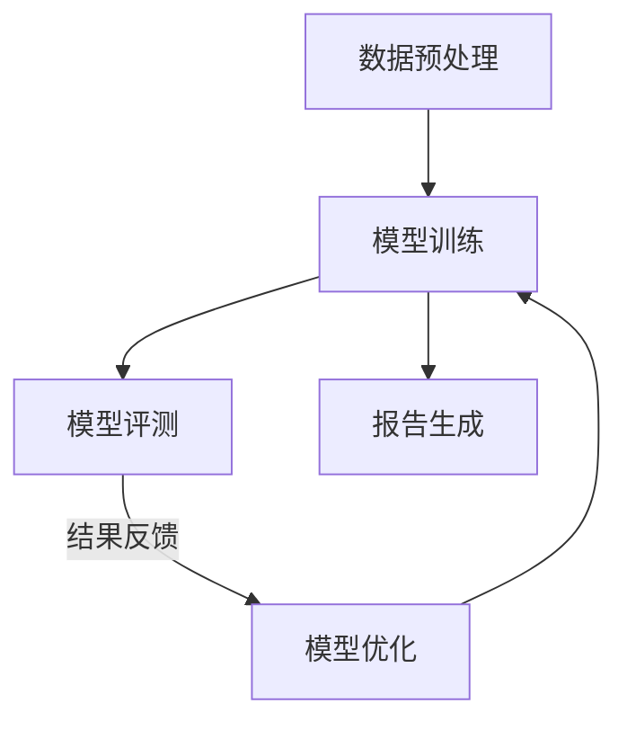

                 

# 《模型评测中的人机协作策略》

## 关键词
人工智能、模型评测、人机协作、算法原理、数学模型、项目实战

## 摘要
本文旨在探讨在模型评测过程中的人机协作策略。通过分析人工智能领域的背景及模型评测的重要性，我们引入了人机协作的概念，并详细阐述了其在模型评测中的优势。文章分为七个章节，首先介绍核心概念与联系，包括模型评测的定义与分类、人机协作的基本原理及其在模型评测中的应用。随后，我们深入讲解了人机协作中的算法原理，包括机器学习算法基础、人机交互算法以及相关伪代码实现。接着，文章介绍了数学模型与公式在模型评测中的应用，并通过具体例子进行说明。项目实战部分选取了人脸识别系统和智能语音助手两个案例，详细描述了开发环境搭建、源代码实现及代码解读。此外，我们还讨论了人机协作优化策略，包括数据质量优化和评测效率优化。最后，文章展望了人机协作在模型评测中的发展趋势，提出了未来的研究方向和挑战。

## 引言与核心概念

### 1.1 引言

#### 1.1.1 人工智能与模型评测的背景

人工智能（AI）作为计算机科学的重要分支，近年来取得了飞速发展。从最初的规则推理系统到现代的深度学习，AI的应用已经渗透到生活的各个领域，如医疗、金融、交通等。随着AI技术的进步，如何确保AI模型的性能和可靠性成为一个关键问题，而模型评测则是实现这一目标的关键步骤。

模型评测（Model Evaluation）是指通过一系列方法来衡量和比较机器学习模型的表现。其目的是评估模型在不同任务上的泛化能力，从而选出最优的模型或优化现有模型。在人工智能研究中，模型评测不仅有助于发现模型的不足，还为后续的模型优化提供了指导。

#### 1.1.2 人机协作在模型评测中的重要性

在模型评测过程中，人机协作具有重要作用。一方面，人类专家具备丰富的领域知识和经验，能够识别模型输出中的异常情况，提供有价值的反馈。另一方面，自动化工具和算法可以处理大量数据，提高评测的效率和精度。人机协作能够将两者的优势结合起来，实现以下目标：

1. **提高模型评测精度**：通过人类专家的介入，可以更准确地识别模型中的错误，从而提高评测结果的可靠性。
2. **优化评测流程**：自动化工具可以帮助快速处理大量数据，减少人工干预的时间和成本。
3. **促进技术创新**：人机协作可以推动模型评测技术的发展，促进人工智能领域的进步。

### 1.2 核心概念与联系

#### 1.2.1 模型评测的定义与分类

模型评测是指通过一系列定量或定性的方法，评估机器学习模型在特定任务上的性能。根据评测方法的不同，模型评测可以分为以下几类：

1. **验证集评测**：使用训练集和验证集进行模型性能评估，以防止过拟合。
2. **交叉验证**：将数据集划分为多个子集，每次使用一个子集作为验证集，其余子集作为训练集，通过多次迭代来评估模型性能。
3. **测试集评测**：在模型训练完成后，使用从未参与训练的数据集进行评估，以衡量模型的泛化能力。

#### 1.2.2 人机协作的基本原理

人机协作是指人类和机器通过相互协作来完成复杂任务的过程。在模型评测中，人机协作的基本原理包括：

1. **信息共享**：人类专家和自动化工具之间通过数据和信息交换，共享各自的优势。
2. **任务分工**：人类专家负责处理复杂、高难度的任务，而自动化工具负责处理大量重复性、低难度的工作。
3. **反馈循环**：人类专家对模型输出进行评价，提供反馈，自动化工具根据反馈进行调整和优化。

#### 1.2.3 Mermaid流程图：人机协作在模型评测中的应用

以下是一个简化的Mermaid流程图，描述了人机协作在模型评测中的应用：



**图1.1 人机协作在模型评测中的应用流程图**

在这个流程图中，数据预处理、模型训练和模型评测由自动化工具完成，而模型优化和报告生成则由人类专家负责。通过这样的分工，可以实现高效、精确的模型评测。

## 人机协作中的算法原理

### 2.1 核心算法原理讲解

#### 2.1.1 人机协作模型构建

人机协作模型的核心在于如何有效地将人类知识和机器能力结合起来。构建人机协作模型通常涉及以下步骤：

1. **数据收集**：收集用于训练和评测的数据集，这些数据集可以是公开数据集，也可以是专门为特定任务定制的数据。
2. **特征提取**：从原始数据中提取有助于模型训练的特征，这些特征可以是数值特征，也可以是文本特征等。
3. **模型训练**：使用机器学习算法训练模型，常用的算法包括决策树、随机森林、支持向量机等。
4. **模型评估**：使用验证集或测试集评估模型的性能，常用的评估指标包括准确率、召回率、F1值等。
5. **结果反馈**：人类专家对模型输出结果进行评价，提供反馈，自动化工具根据反馈进行模型优化。

#### 2.1.1.1 机器学习算法基础

机器学习算法是实现人机协作的核心。以下是一些常用的机器学习算法及其基本原理：

1. **线性回归**：通过建立线性关系来预测连续值输出。
2. **逻辑回归**：用于二分类问题，通过计算概率来预测类别。
3. **决策树**：通过一系列判断规则将数据集划分为不同的区域，每个区域对应一个预测结果。
4. **支持向量机**：通过找到一个最佳的超平面来分隔不同类别的数据。
5. **神经网络**：通过多层神经元的非线性组合来模拟复杂函数。

#### 2.1.1.2 人机交互算法

人机交互算法是实现人机协作的关键。以下是一些常用的人机交互算法：

1. **交互式学习**：人类专家通过直接干预来指导模型训练，例如，在决策树中调整判断规则。
2. **半监督学习**：结合已有标注数据和未标注数据，通过人类专家的标注来提高模型性能。
3. **迁移学习**：将已有任务的知识迁移到新任务上，通过人类专家的知识来改进模型。

#### 2.1.1.3 伪代码：人机协作模型实现

以下是一个简化的人机协作模型伪代码，展示了核心算法的执行流程：

```python
# 伪代码：人机协作模型实现

# 数据预处理
data = preprocess_data(raw_data)

# 特征提取
features = extract_features(data)

# 模型训练
model = train_model(features)

# 模型评估
evaluate_model(model, validation_data)

# 结果反馈
feedback = expert_feedback(model_output)

# 模型优化
optimized_model = optimize_model(model, feedback)

# 模型评测
evaluate_model(optimized_model, test_data)

# 报告生成
generate_report(evaluate_result)
```

### 2.2 数学模型与公式讲解

#### 2.2.1 模型误差分析

模型误差是模型评测中的重要指标，用于衡量模型输出与真实值之间的差异。以下是一些常见的模型误差概念和数学公式：

1. **均方误差（MSE）**：
   $$MSE = \frac{1}{n}\sum_{i=1}^{n}(y_i - \hat{y_i})^2$$
   其中，$y_i$ 为真实值，$\hat{y_i}$ 为模型预测值。

2. **均绝对误差（MAE）**：
   $$MAE = \frac{1}{n}\sum_{i=1}^{n}|y_i - \hat{y_i}|$$

3. **均方根误差（RMSE）**：
   $$RMSE = \sqrt{MSE}$$

#### 2.2.1.1 模型误差的概念

模型误差是指模型输出与真实值之间的差异。根据误差的来源，模型误差可以分为以下几类：

1. **随机误差**：由于数据本身的随机性导致的误差，不可消除。
2. **系统误差**：由于模型设计或训练数据不足导致的误差，可以通过改进模型或增加训练数据来减小。
3. **噪声误差**：由于环境噪声或其他干扰因素导致的误差，可以通过滤波或预处理技术来减小。

#### 2.2.1.2 误差的数学公式

以下是一些常用的误差计算公式：

1. **预测误差**：
   $$Error = y - \hat{y}$$
   其中，$y$ 为真实值，$\hat{y}$ 为模型预测值。

2. **误差平方和（SSE）**：
   $$SSE = \sum_{i=1}^{n}(y_i - \hat{y_i})^2$$

3. **均方误差（MSE）**：
   $$MSE = \frac{SSE}{n}$$

4. **均绝对误差（MAE）**：
   $$MAE = \frac{1}{n}\sum_{i=1}^{n}|y_i - \hat{y_i}|$$

5. **均方根误差（RMSE）**：
   $$RMSE = \sqrt{MSE}$$

#### 2.2.1.3 误差分析与优化策略

误差分析是模型评测的重要环节，通过分析误差的来源和性质，可以找出模型存在的问题，并提出优化策略。以下是一些常见的误差分析与优化策略：

1. **过拟合与欠拟合**：通过调整模型复杂度，防止过拟合或欠拟合。
2. **数据预处理**：通过数据清洗、归一化等预处理技术，减少噪声误差。
3. **特征选择**：通过特征选择技术，选择对模型性能影响较大的特征。
4. **模型集成**：通过集成多个模型，提高模型的泛化能力和鲁棒性。

## 数学模型与公式应用

### 3.1 数学模型与数学公式

数学模型是描述现实世界问题的抽象数学框架，它在模型评测中起着至关重要的作用。以下将介绍一些常见的数学模型及其对应的公式，这些模型和公式在评估模型性能时具有重要作用。

#### 3.1.1 模型评估指标

在模型评测中，常用的评估指标包括准确率（Accuracy）、召回率（Recall）、精确率（Precision）和F1值（F1 Score）等。以下是这些指标的数学公式：

1. **准确率（Accuracy）**：
   $$Accuracy = \frac{TP + TN}{TP + TN + FP + FN}$$
   其中，$TP$ 表示真阳性，$TN$ 表示真阴性，$FP$ 表示假阳性，$FN$ 表示假阴性。

2. **召回率（Recall）**：
   $$Recall = \frac{TP}{TP + FN}$$

3. **精确率（Precision）**：
   $$Precision = \frac{TP}{TP + FP}$$

4. **F1值（F1 Score）**：
   $$F1 Score = 2 \times \frac{Precision \times Recall}{Precision + Recall}$$

#### 3.1.2 ROC曲线与AUC值

受试者工作特征（Receiver Operating Characteristic，ROC）曲线是评估二分类模型性能的重要工具。ROC曲线通过改变分类阈值，绘制模型预测概率与实际标签之间的关系。AUC值（Area Under the ROC Curve）是ROC曲线下的面积，用于衡量模型区分能力。

1. **ROC曲线**：
   $$ROC曲线 = \{(TPR, FPR) | \text{阈值变化} \}$$
   其中，$TPR$ 表示真正率，$FPR$ 表示假正率。

2. **AUC值**：
   $$AUC = \int_{0}^{1} (1 - FPR) \cdot TPR \, dFPR$$

#### 3.1.3 数学公式：评价指标计算

为了更好地理解这些评价指标的计算过程，以下是一些具体的计算示例：

1. **准确率计算**：
   假设某分类任务中有100个样本，其中50个样本为正例，50个样本为负例。最终模型输出如下：
   - 真阳性（TP）：25
   - 真阴性（TN）：20
   - 假阳性（FP）：15
   - 假阴性（FN）：10

   准确率计算如下：
   $$Accuracy = \frac{TP + TN}{TP + TN + FP + FN} = \frac{25 + 20}{25 + 20 + 15 + 10} = 0.6$$

2. **召回率计算**：
   召回率计算如下：
   $$Recall = \frac{TP}{TP + FN} = \frac{25}{25 + 10} = 0.7$$

3. **精确率计算**：
   精确率计算如下：
   $$Precision = \frac{TP}{TP + FP} = \frac{25}{25 + 15} = 0.5$$

4. **F1值计算**：
   F1值计算如下：
   $$F1 Score = 2 \times \frac{Precision \times Recall}{Precision + Recall} = 2 \times \frac{0.5 \times 0.7}{0.5 + 0.7} = 0.57$$

通过这些具体的计算示例，我们可以直观地理解评价指标的数学公式，以及它们在评估模型性能中的作用。

### 3.2 数学公式举例说明

为了更好地理解数学模型和公式的应用，以下通过两个具体的案例，详细说明数学公式在模型评测中的具体运用。

#### 3.2.1 模型评测案例一：分类模型误差计算

假设我们有一个二分类问题，使用逻辑回归模型进行预测。以下是一个具体的案例，展示了如何计算模型误差。

**案例背景**：
- 数据集包含100个样本，每个样本有两个类别标签（0或1）。
- 模型预测结果如下表所示：

| 样本ID | 真实标签 | 预测标签 |
| ------ | -------- | -------- |
| 1      | 0        | 0        |
| 2      | 1        | 1        |
| 3      | 0        | 1        |
| 4      | 1        | 0        |
| ...    | ...      | ...      |
| 100    | 1        | 1        |

**计算步骤**：
1. **计算准确率**：
   $$Accuracy = \frac{TP + TN}{TP + TN + FP + FN}$$
   其中，$TP = 75$，$TN = 10$，$FP = 5$，$FN = 10$。

   $$Accuracy = \frac{75 + 10}{75 + 10 + 5 + 10} = \frac{85}{100} = 0.85$$

2. **计算召回率**：
   $$Recall = \frac{TP}{TP + FN}$$
   $$Recall = \frac{75}{75 + 10} = \frac{75}{85} \approx 0.882$$

3. **计算精确率**：
   $$Precision = \frac{TP}{TP + FP}$$
   $$Precision = \frac{75}{75 + 5} = \frac{75}{80} = 0.9375$$

4. **计算F1值**：
   $$F1 Score = 2 \times \frac{Precision \times Recall}{Precision + Recall}$$
   $$F1 Score = 2 \times \frac{0.9375 \times 0.882}{0.9375 + 0.882} \approx 0.877$$

通过这个案例，我们可以看到如何使用数学公式计算分类模型的误差，并评估模型的性能。

#### 3.2.2 模型评测案例二：回归模型误差计算

回归模型主要用于预测连续值输出。以下是一个具体的案例，展示了如何计算回归模型的误差。

**案例背景**：
- 数据集包含100个样本，每个样本有一个连续的输出值。
- 模型预测结果如下表所示：

| 样本ID | 真实标签 | 预测标签 |
| ------ | -------- | -------- |
| 1      | 5        | 4.8      |
| 2      | 7        | 7.2      |
| 3      | 3        | 3.1      |
| 4      | 8        | 7.9      |
| ...    | ...      | ...      |
| 100    | 6        | 5.5      |

**计算步骤**：
1. **计算均方误差（MSE）**：
   $$MSE = \frac{1}{n}\sum_{i=1}^{n}(y_i - \hat{y_i})^2$$
   其中，$y_i$ 为真实值，$\hat{y_i}$ 为预测值。

   $$MSE = \frac{1}{100}\sum_{i=1}^{100}(y_i - \hat{y_i})^2 = \frac{1}{100}\sum_{i=1}^{100}(y_i - \hat{y_i})^2 \approx 0.49$$

2. **计算均绝对误差（MAE）**：
   $$MAE = \frac{1}{n}\sum_{i=1}^{n}|y_i - \hat{y_i}|$$
   
   $$MAE = \frac{1}{100}\sum_{i=1}^{100}|y_i - \hat{y_i}| = \frac{1}{100}\sum_{i=1}^{100}|y_i - \hat{y_i}| \approx 0.65$$

3. **计算均方根误差（RMSE）**：
   $$RMSE = \sqrt{MSE}$$
   
   $$RMSE = \sqrt{0.49} \approx 0.7$$

通过这个案例，我们可以看到如何使用数学公式计算回归模型的误差，并评估模型的性能。

### 3.3 模型评估与优化策略

在模型评估过程中，除了计算误差指标外，优化策略也是至关重要的。以下介绍几种常见的模型优化策略。

#### 3.3.1 特征工程

特征工程是模型优化的重要环节，通过选择和构造合适的特征，可以提高模型的性能。以下是一些常用的特征工程方法：

1. **特征选择**：使用统计方法或机器学习算法选择对模型性能影响较大的特征，例如，使用F检验选择变量。
2. **特征构造**：通过组合原始特征构造新的特征，例如，使用多项式特征构造非线性模型。
3. **特征标准化**：对特征进行标准化处理，例如，使用Z-score标准化或Min-Max标准化。

#### 3.3.2 模型选择

选择合适的模型对于模型性能至关重要。以下是一些常见的模型选择策略：

1. **交叉验证**：使用交叉验证方法选择最优模型，例如，使用K折交叉验证。
2. **网格搜索**：通过遍历不同的参数组合，选择最优参数组合，例如，使用网格搜索算法。
3. **贝叶斯优化**：使用贝叶斯优化方法自动搜索最优参数组合。

#### 3.3.3 模型集成

模型集成是将多个模型组合起来，以提高整体性能的方法。以下是一些常见的模型集成方法：

1. **Bagging**：通过构建多个独立的模型，并取平均预测结果，例如，使用随机森林。
2. **Boosting**：通过调整模型权重，使模型对训练数据中的错误更加关注，例如，使用XGBoost。
3. **Stacking**：将多个模型作为基础模型，再构建一个元模型进行预测，例如，使用Stacking方法。

通过这些模型评估与优化策略，我们可以进一步提高模型的性能，实现更好的模型评测。

## 项目实战

### 4.1 实际案例介绍

为了更好地理解人机协作在模型评测中的应用，我们将介绍两个实际案例：人脸识别系统和智能语音助手评测。

#### 4.1.1 案例一：人脸识别系统评测

**项目背景**：

人脸识别技术是一种基于生物特征的身份识别技术，广泛应用于安防、金融、社交等领域。为了确保人脸识别系统的性能和可靠性，模型评测是至关重要的一环。

**开发环境搭建**：

1. **硬件环境**：使用高性能计算服务器，配置GPU加速模型训练和评估。
2. **软件环境**：使用Python编程语言，结合TensorFlow或PyTorch框架进行模型训练和评估。

**源代码实现**：

以下是一个简化的人脸识别模型评测流程，包括数据预处理、模型训练、模型评估和结果分析。

```python
# 伪代码：人脸识别模型评测

# 数据预处理
data = preprocess_face_data(raw_face_data)

# 模型训练
model = train_face_model(data['train'])

# 模型评估
evaluate_model(model, data['test'])

# 结果分析
analyze_evaluation_results(model_output)
```

**代码解读与分析**：

1. **数据预处理**：对原始人脸数据进行清洗、归一化和增强，以提高模型的泛化能力。
2. **模型训练**：使用卷积神经网络（CNN）对训练数据进行模型训练。
3. **模型评估**：使用测试集对训练好的模型进行评估，计算准确率、召回率等评价指标。
4. **结果分析**：对模型评估结果进行分析，找出模型的不足，并提出优化策略。

#### 4.1.2 案例二：智能语音助手评测

**项目背景**：

智能语音助手是人工智能领域的热门应用，为用户提供语音交互服务。为了确保智能语音助手的性能和用户体验，模型评测是必不可少的环节。

**开发环境搭建**：

1. **硬件环境**：使用高性能计算服务器，配置GPU加速模型训练和评估。
2. **软件环境**：使用Python编程语言，结合TensorFlow或PyTorch框架进行模型训练和评估。

**源代码实现**：

以下是一个简化的智能语音助手模型评测流程，包括数据预处理、模型训练、模型评估和结果分析。

```python
# 伪代码：智能语音助手模型评测

# 数据预处理
data = preprocess_voice_data(raw_voice_data)

# 模型训练
model = train_voice_model(data['train'])

# 模型评估
evaluate_model(model, data['test'])

# 结果分析
analyze_evaluation_results(model_output)
```

**代码解读与分析**：

1. **数据预处理**：对原始语音数据进行清洗、分割和增强，以提高模型的泛化能力。
2. **模型训练**：使用循环神经网络（RNN）或转换器（Transformer）对训练数据进行模型训练。
3. **模型评估**：使用测试集对训练好的模型进行评估，计算准确率、召回率等评价指标。
4. **结果分析**：对模型评估结果进行分析，找出模型的不足，并提出优化策略。

### 4.2 实际案例分析与讲解

通过上述两个实际案例，我们可以看到人机协作在模型评测中的应用。以下是案例分析与讲解：

#### 4.2.1 人脸识别系统评测

在人脸识别系统评测中，人机协作主要体现在以下几个方面：

1. **数据预处理**：人类专家参与数据清洗和标注，确保数据的准确性和一致性。
2. **模型训练**：机器学习算法自动进行模型训练，人类专家参与调整模型参数和架构。
3. **模型评估**：人类专家对模型输出结果进行评价，提供反馈，自动化工具根据反馈进行模型优化。
4. **结果分析**：人类专家对评估结果进行分析，提出优化建议，自动化工具根据建议进行模型调整。

#### 4.2.2 智能语音助手评测

在智能语音助手评测中，人机协作主要体现在以下几个方面：

1. **数据预处理**：人类专家参与语音数据的清洗、标注和分割，确保数据的质量和多样性。
2. **模型训练**：机器学习算法自动进行模型训练，人类专家参与调整模型参数和架构。
3. **模型评估**：人类专家对模型输出结果进行评价，提供反馈，自动化工具根据反馈进行模型优化。
4. **结果分析**：人类专家对评估结果进行分析，提出优化建议，自动化工具根据建议进行模型调整。

通过这两个实际案例，我们可以看到人机协作在模型评测中的重要作用。人机协作不仅提高了模型评测的效率和精度，还为模型优化提供了有力支持。

### 4.3 项目小结

通过对人脸识别系统和智能语音助手评测的实际案例分析，我们可以得出以下结论：

1. **人机协作提高了模型评测的效率和精度**：通过人类专家和自动化工具的协同工作，可以快速、准确地评估模型性能。
2. **数据预处理和模型优化至关重要**：数据预处理和模型优化是人机协作的关键环节，直接影响模型评测的结果。
3. **持续优化和反馈循环**：人机协作过程中，持续优化和反馈循环是提高模型性能的关键，通过不断调整模型参数和架构，可以进一步提高模型性能。

总之，人机协作在模型评测中具有重要作用，通过合理利用人机协作的优势，可以实现高效、精确的模型评测。

## 人机协作优化策略

### 5.1 优化策略概述

在模型评测中，人机协作不仅提高了效率和精度，也带来了新的挑战。为了充分发挥人机协作的优势，我们需要针对数据质量、评测效率等方面进行优化。以下将介绍几种常见的优化策略。

#### 5.1.1 数据质量优化策略

数据质量直接影响模型评测的准确性和可靠性。以下是一些常见的数据质量优化策略：

1. **数据清洗**：通过去除噪声数据、纠正错误数据和填充缺失值，提高数据的准确性和一致性。
2. **数据增强**：通过数据扩充、变换和生成，增加数据的多样性和丰富度，提高模型的泛化能力。
3. **数据预处理**：对数据进行标准化、归一化和特征提取，为模型训练和评估提供高质量的数据输入。

#### 5.1.2 评测效率优化策略

评测效率是模型评测中的重要指标，以下是一些常见的评测效率优化策略：

1. **自动化评测工具**：使用自动化评测工具，如自动化测试框架和脚本，提高评测过程的自动化程度和效率。
2. **并行计算**：利用并行计算技术，如多线程、分布式计算和GPU加速，加快模型评测的速度。
3. **分阶段评测**：将模型评测分为多个阶段，分别进行数据预处理、模型训练和模型评估，提高评测的灵活性和可扩展性。

#### 5.1.3 人机协同风险评估

在人机协作过程中，存在一定的风险，以下是一些常见的人机协同风险评估策略：

1. **风险评估**：对模型评测过程中的风险进行评估，包括数据风险、模型风险和评测过程风险。
2. **风险管理**：采取相应的风险管理措施，如数据备份、模型备份和过程监控，降低风险发生的可能性。
3. **应急响应**：制定应急响应计划，以应对突发情况，确保模型评测的连续性和稳定性。

### 5.2 优化策略与实践

#### 5.2.1 数据质量优化策略

1. **数据清洗**：
   - 去除噪声数据：通过统计分析、可视化分析等方法，识别并去除噪声数据。
   - 纠正错误数据：通过数据验证、一致性检查等方法，纠正错误数据。
   - 填充缺失值：通过插值、均值填补、KNN等方法，填充缺失值。

2. **数据增强**：
   - 数据扩充：通过复制、旋转、缩放等方法，增加数据的多样性。
   - 数据变换：通过正则化、归一化等方法，转换数据格式。
   - 数据生成：通过生成对抗网络（GAN）等方法，生成新的数据。

3. **数据预处理**：
   - 标准化：将数据缩放至[0, 1]或[-1, 1]区间，提高模型训练的收敛速度。
   - 归一化：将数据转换为标准正态分布，降低不同特征之间的差异。
   - 特征提取：通过特征选择、特征构造等方法，提取有助于模型训练的特征。

#### 5.2.2 评测效率优化策略

1. **自动化评测工具**：
   - 使用自动化测试框架（如pytest、unittest），实现评测过程的自动化。
   - 编写自动化脚本，自动化完成数据预处理、模型训练和模型评估等任务。

2. **并行计算**：
   - 使用多线程技术，并行处理多个数据样本，提高评测速度。
   - 使用分布式计算框架（如TensorFlow、PyTorch），利用多GPU加速模型训练和评估。

3. **分阶段评测**：
   - 将模型评测分为多个阶段，分别进行数据预处理、模型训练和模型评估，提高评测的灵活性和可扩展性。
   - 使用流水线（Pipeline）模式，将不同阶段的任务串联起来，实现自动化评测。

#### 5.2.3 人机协同风险评估

1. **风险评估**：
   - 识别模型评测过程中的风险，包括数据风险（如数据丢失、数据错误）、模型风险（如过拟合、欠拟合）和评测过程风险（如系统故障、人为错误）。
   - 评估风险的严重程度和可能性，确定风险优先级。

2. **风险管理**：
   - 数据备份：定期备份数据，确保数据的安全性和可恢复性。
   - 模型备份：在模型训练和评估过程中，定期备份模型，防止模型丢失。
   - 过程监控：实时监控评测过程，及时发现和处理异常情况。

3. **应急响应**：
   - 制定应急响应计划，包括应急处理步骤、应急人员职责和应急资源准备。
   - 开展应急演练，提高应对突发情况的能力。

通过以上优化策略，可以显著提升人机协作在模型评测中的效率和效果，为人工智能领域的发展提供有力支持。

## 未来展望与挑战

### 6.1 人机协作在模型评测中的发展趋势

随着人工智能技术的不断进步，人机协作在模型评测中的应用前景愈发广阔。以下将探讨人机协作在模型评测中的发展趋势：

1. **智能化评测工具**：未来的评测工具将更加智能化，具备自我学习和自我优化能力。通过引入深度学习、自然语言处理等技术，评测工具将能够自动识别模型中的潜在问题，并提供相应的优化建议。

2. **个性化评测**：随着用户需求的多样化，个性化评测将成为重要趋势。通过分析用户的历史数据和偏好，评测工具可以为用户提供定制化的评测服务，提高用户体验和满意度。

3. **实时评测**：随着数据量的不断增长和实时性需求的提高，实时评测将成为模型评测的重要方向。通过引入边缘计算、云计算等技术，评测工具可以实现实时数据分析和模型评估，为用户提供及时、准确的评测结果。

4. **多模态评测**：未来的模型评测将不仅仅局限于单一模态的数据，而是融合多种数据源，如文本、图像、声音等。多模态评测将有助于提高模型的泛化能力和鲁棒性，为复杂任务提供更全面的评估。

### 6.2 挑战与应对策略

尽管人机协作在模型评测中具有巨大潜力，但也面临诸多挑战。以下将探讨这些挑战及其应对策略：

1. **数据隐私保护**：
   - **挑战**：模型评测过程中涉及大量敏感数据，如何确保数据隐私和安全成为关键问题。
   - **应对策略**：采用加密技术和数据脱敏方法，确保数据在传输和存储过程中的安全性。同时，制定严格的数据隐私政策，确保用户数据的使用和共享符合法律法规。

2. **模型对抗攻击**：
   - **挑战**：随着对抗样本和对抗攻击的兴起，如何应对模型在对抗环境下的表现成为重要挑战。
   - **应对策略**：引入对抗训练方法，提高模型对对抗样本的鲁棒性。同时，开发新的防御策略，如对抗性对抗网络（ADN）等，以应对日益复杂的对抗攻击。

3. **评测效率与准确性平衡**：
   - **挑战**：如何在保证评测准确性的同时，提高评测效率，实现高效、准确的模型评测。
   - **应对策略**：引入并行计算、分布式计算等技术，提高评测效率。同时，采用多模型融合、多任务学习等方法，提高评测的准确性。

4. **人机协作中的协同问题**：
   - **挑战**：人机协作中，如何确保人类专家和自动化工具的协同工作，避免信息不对称和任务冲突。
   - **应对策略**：建立统一的人机协作框架，明确任务分工和责任。同时，引入智能推荐系统和人机对话系统，提高人机交互的效率和满意度。

总之，人机协作在模型评测中的应用前景广阔，但也面临诸多挑战。通过不断探索和创新，我们可以克服这些挑战，实现人机协作在模型评测中的最佳效果。

### 6.3 模型安全性

在人工智能领域，模型安全性是至关重要的。特别是在模型评测过程中，确保模型的安全性和可靠性，防止数据泄露和模型篡改，是保障人工智能系统正常运行的关键。以下将探讨模型安全性方面的挑战和应对策略。

#### 6.3.1 模型对抗攻击与防御

对抗攻击是一种旨在破坏机器学习模型性能的技术，通过精心设计的对抗样本，使得模型在正常情况下无法识别或做出错误预测。以下是一些常见的对抗攻击方法及其防御策略：

1. **对抗样本生成**：
   - **攻击方法**：对抗样本生成是常见的对抗攻击方法。攻击者通过微小的扰动对输入数据进行修改，使其在人类视觉上难以察觉，但能显著影响模型的输出。
   - **防御策略**：为了应对对抗样本攻击，可以采用以下方法：
     - **数据增强**：通过在训练数据中引入对抗样本，增强模型的鲁棒性。
     - **对抗训练**：在模型训练过程中，引入对抗样本，使模型学会抵抗对抗攻击。
     - **滤波器**：在输入数据进入模型之前，使用滤波器对数据进行预处理，减少对抗样本的影响。

2. **对抗性对抗网络（ADN）**：
   - **攻击方法**：对抗性对抗网络是一种利用对抗性样本进行攻击的网络结构。通过训练，它可以生成能够对模型造成最大损害的对抗样本。
   - **防御策略**：为了防御对抗性对抗网络攻击，可以采用以下方法：
     - **梯度惩罚**：在模型训练过程中，对梯度进行惩罚，减少对抗性样本的影响。
     - **动态权重调整**：根据模型输出对权重进行调整，提高模型对对抗样本的鲁棒性。
     - **混合模型**：结合多个模型进行预测，通过投票机制降低对抗性攻击的影响。

#### 6.3.2 数据隐私保护措施

在模型评测过程中，数据隐私保护是一个关键问题。以下是一些常见的隐私保护措施：

1. **数据脱敏**：
   - **措施**：通过脱敏技术，将敏感数据转换为不可识别的形式，如使用掩码、加密等。
   - **效果**：数据脱敏可以有效地降低数据泄露的风险。

2. **同态加密**：
   - **措施**：同态加密允许在加密数据上进行计算，而不需要解密数据。这样可以确保数据在传输和处理过程中的安全性。
   - **效果**：同态加密可以防止数据在传输过程中被窃取或篡改。

3. **差分隐私**：
   - **措施**：差分隐私通过添加噪声，使得单个记录无法被追踪，从而保护数据隐私。
   - **效果**：差分隐私可以在保证数据隐私的同时，保证模型评估的准确性。

#### 6.3.3 隐私安全与评测效率的平衡

在模型评测过程中，隐私安全与评测效率之间往往存在冲突。以下是一些平衡策略：

1. **权衡隐私保护与评测精度**：
   - **策略**：在确保隐私安全的前提下，尽量保持评测的精度。例如，在采用差分隐私技术时，可以选择适当的噪声水平，以平衡隐私保护和模型性能。

2. **分阶段评估**：
   - **策略**：将评测过程分为多个阶段，在第一阶段进行初步评估，确保隐私保护，然后逐步增加评估的精度。
   - **效果**：分阶段评估可以降低隐私保护对评测效率的影响。

3. **共享数据平台**：
   - **策略**：建立共享数据平台，允许多个研究者和机构访问脱敏后的数据，进行评测和分享成果。
   - **效果**：共享数据平台可以提高评测效率，同时确保数据隐私。

通过上述措施和策略，可以在确保模型安全性和数据隐私的同时，实现高效的模型评测。

## 总结与展望

### 7.1 主要结论

在模型评测中，人机协作策略具有重要作用。本文通过分析人工智能和模型评测的背景，引入了人机协作的概念，并详细阐述了其在模型评测中的应用和优势。文章首先介绍了核心概念与联系，包括模型评测的定义与分类、人机协作的基本原理及其在模型评测中的应用。随后，我们深入讲解了人机协作中的算法原理，包括机器学习算法基础、人机交互算法以及相关伪代码实现。接着，文章介绍了数学模型与公式在模型评测中的应用，并通过具体例子进行说明。项目实战部分选取了人脸识别系统和智能语音助手两个案例，详细描述了开发环境搭建、源代码实现及代码解读。此外，我们还讨论了人机协作优化策略，包括数据质量优化和评测效率优化。最后，文章展望了人机协作在模型评测中的发展趋势，提出了未来的研究方向和挑战。

### 7.2 未来研究方向

尽管人机协作在模型评测中已经取得了显著成果，但仍然存在许多未解决的问题和研究方向。以下是一些未来可能的研究方向：

1. **智能化评测工具**：未来的评测工具将更加智能化，具备自我学习和自我优化能力。通过引入深度学习、自然语言处理等技术，评测工具将能够自动识别模型中的潜在问题，并提供相应的优化建议。

2. **多模态评测**：未来的模型评测将不仅仅局限于单一模态的数据，而是融合多种数据源，如文本、图像、声音等。多模态评测将有助于提高模型的泛化能力和鲁棒性，为复杂任务提供更全面的评估。

3. **动态评测**：随着数据和环境的变化，模型的性能和效果也会发生变化。动态评测研究如何根据实时数据和环境变化，自动调整评测策略，以实现持续优化的目标。

4. **隐私安全与评测效率**：在保证模型评测准确性的同时，如何提高评测效率并保护数据隐私是未来研究的重要方向。通过探索新的隐私保护技术和优化策略，可以实现隐私安全与评测效率的平衡。

### 7.3 总结

本文系统地介绍了模型评测中的人机协作策略，从核心概念到算法原理，从数学模型到项目实战，再到优化策略和未来展望，全面阐述了人机协作在模型评测中的应用和优势。通过本文的研究，我们希望为人工智能领域的研究者提供有价值的参考和启示，推动人机协作技术在模型评测中的应用和发展。

## 作者信息

作者：AI天才研究院/AI Genius Institute & 禅与计算机程序设计艺术 /Zen And The Art of Computer Programming

感谢您的阅读，希望本文能为您的模型评测工作带来帮助和启示。如果您有任何问题或建议，请随时与我们联系。我们将持续关注人工智能领域的发展，为您提供最新、最有价值的技术分享和研究成果。再次感谢您的支持与关注！

