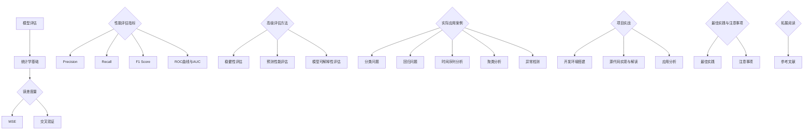

                 

**文章标题：**《模型评测中的统计学方法应用》

**文章关键词：** 模型评估、统计学方法、误差分析、预测性能、机器学习

**文章摘要：** 本文深入探讨了在机器学习模型评估过程中所使用的统计学方法。从基本概念出发，详细阐述了误差度量、模型验证技术以及高级性能评估指标。通过实例和Python代码，读者将了解如何在实际项目中应用这些方法，提升模型的预测准确性和稳定性。

---

## 目录

1. 引言
    1.1 背景介绍
    1.2 文章结构概述
2. 模型评估的统计学基础
    2.1 统计学基本概念
    2.2 统计分布与数据可视化
3. 误差度量方法
    3.1 均方误差（MSE）
    3.2 交叉验证方法
4. 性能评估指标
    4.1 精确率、召回率和F1值
    4.2 ROC曲线与AUC
5. 高级评估方法
    5.1 稳健性评估
    5.2 预测性能评估
    5.3 模型可解释性评估
6. 实际应用案例
    6.1 分类问题中的应用
    6.2 回归问题中的应用
    6.3 时间序列分析中的应用
    6.4 聚类分析中的应用
    6.5 异常检测中的应用
7. 项目实战
    7.1 开发环境搭建
    7.2 源代码实现与解读
    7.3 应用分析
8. 最佳实践与注意事项
    8.1 最佳实践
    8.2 注意事项
9. 拓展阅读
10. 结语
    10.1 小结
    10.2 展望未来

---

### 引言

**1.1 背景介绍**

在机器学习领域，模型评估是至关重要的环节。评估模型性能不仅有助于我们了解模型的准确性、稳定性和泛化能力，还能为后续的模型优化提供依据。然而，有效的模型评估并非易事，需要借助统计学方法来实现。本文旨在深入探讨模型评估中的统计学方法，帮助读者在实际项目中提升模型的预测能力。

**1.2 文章结构概述**

本文结构如下：

- **引言**：介绍背景和文章结构。
- **模型评估的统计学基础**：阐述统计学基本概念和统计分布。
- **误差度量方法**：介绍均方误差（MSE）和交叉验证方法。
- **性能评估指标**：探讨精确率、召回率、F1值、ROC曲线与AUC。
- **高级评估方法**：介绍稳健性评估、预测性能评估和模型可解释性评估。
- **实际应用案例**：展示分类、回归、时间序列分析、聚类分析和异常检测中的应用。
- **项目实战**：提供开发环境搭建、源代码实现和应用的详细步骤。
- **最佳实践与注意事项**：总结最佳实践和注意事项。
- **拓展阅读**：推荐相关文献和资源。
- **结语**：对文章进行总结和展望。

接下来，我们将逐步深入探讨模型评估中的统计学方法，帮助读者掌握这些方法并在实际项目中有效应用。

---

## 模型评估的统计学基础

**2.1 统计学基本概念**

统计学是研究如何通过数据来推断总体特征的学科。在模型评估中，统计学方法为我们提供了评估模型性能的量化工具。

- **总体（Population）**：我们希望了解的所有个体的集合。
- **样本（Sample）**：从总体中随机抽取的一部分个体。
- **变量（Variable）**：个体的属性或特征。
- **分布（Distribution）**：变量可能取的值及其概率。

在模型评估中，我们通常使用样本数据来推断总体特征。统计学提供了各种方法来处理数据和进行推断。

**2.2 统计分布与数据可视化**

统计分布描述了变量取值的概率分布。常见的统计分布包括正态分布、伯努利分布、泊松分布等。

- **正态分布（Normal Distribution）**：最为常见的统计分布，许多现实问题可以近似为正态分布。
- **伯努利分布（Bernoulli Distribution）**：描述二项选择问题，如抛硬币的结果。
- **泊松分布（Poisson Distribution）**：描述在一定时间内事件发生的次数。

数据可视化是统计学的重要工具，用于展示数据的分布和趋势。

- **直方图（Histogram）**：显示数据分布的柱状图。
- **密度图（Density Plot）**：显示数据分布的概率密度函数。
- **箱线图（Box Plot）**：显示数据的四分位数值和异常值。

通过统计分布和数据可视化，我们可以更好地理解数据，为模型评估提供依据。

---

## 误差度量方法

**3.1 均方误差（MSE）**

均方误差（Mean Squared Error, MSE）是评估模型预测性能的一种常用误差度量方法。MSE计算的是预测值与真实值之间差的平方的平均值。

**公式：**

$$
MSE = \frac{1}{n}\sum_{i=1}^{n}(y_i - \hat{y}_i)^2
$$

其中，$y_i$ 是第 $i$ 个样本的真实值，$\hat{y}_i$ 是第 $i$ 个样本的预测值，$n$ 是样本数量。

MSE越小，表示模型的预测性能越好。

**3.2 交叉验证方法**

交叉验证（Cross Validation）是一种评估模型性能的重要方法。它通过将数据集划分为多个子集，重复进行训练和验证，来评估模型的泛化能力。

常见的交叉验证方法包括：

- **K折交叉验证（K-Fold Cross Validation）**：将数据集划分为 $K$ 个相等的子集，每次选择一个子集作为验证集，其余子集作为训练集，共进行 $K$ 次训练和验证。

**交叉验证的优势：**

- 减少过拟合风险。
- 提高模型泛化能力。
- 更准确地评估模型性能。

---

## 性能评估指标

**4.1 精确率、召回率和F1值**

精确率（Precision）、召回率（Recall）和F1值（F1 Score）是评估分类模型性能的重要指标。

**精确率（Precision）：**

$$
Precision = \frac{TP}{TP + FP}
$$

其中，$TP$ 是真正的阳性样本数，$FP$ 是错误的阳性样本数。精确率表示预测为阳性的样本中，真正阳性的比例。

**召回率（Recall）：**

$$
Recall = \frac{TP}{TP + FN}
$$

其中，$FN$ 是错误的阴性样本数。召回率表示预测为阳性的样本中，真正阳性的比例。

**F1值（F1 Score）：**

$$
F1 Score = 2 \times \frac{Precision \times Recall}{Precision + Recall}
$$

F1值是精确率和召回率的调和平均值，综合考虑了二者的平衡。

**4.2 ROC曲线与AUC**

ROC曲线（Receiver Operating Characteristic Curve）是评估分类模型性能的重要工具。ROC曲线展示了在不同阈值下，真阳性率（True Positive Rate, TPR）与假阳性率（False Positive Rate, FPR）之间的关系。

**AUC（Area Under Curve）：**

AUC表示ROC曲线下的面积，值越大，表示模型的分类能力越强。

$$
AUC = \int_{0}^{1} (1 - FPR) \times TPR \, dFPR
$$

---

## 高级评估方法

**5.1 稳健性评估**

模型的稳健性评估是确保模型在实际应用中稳定和可靠的关键。

**方法：**

- **对抗样本（Adversarial Examples）**：引入对抗性噪声，测试模型在这些噪声下的性能。
- **鲁棒性测试（Robustness Testing）**：通过调整输入数据，测试模型在不同输入条件下的稳定性。

**5.2 预测性能评估**

预测性能评估旨在评估模型的预测准确性和稳定性。

**方法：**

- **时间序列分析（Time Series Analysis）**：分析模型的预测性能随时间的变化。
- **不确定性分析（Uncertainty Analysis）**：评估模型预测的不确定性，提高预测的可信度。

**5.3 模型可解释性评估**

模型可解释性评估是确保模型决策的可解释性和透明度。

**方法：**

- **特征重要性（Feature Importance）**：评估特征对模型预测的影响程度。
- **模型可视化（Model Visualization）**：通过可视化模型的结构和决策过程，提高模型的可解释性。

---

## 实际应用案例

**6.1 分类问题中的应用**

在分类问题中，统计学方法广泛应用于模型评估和优化。

**实例：** 使用逻辑回归模型预测邮件是否为垃圾邮件。

**步骤：**

1. 数据预处理：提取特征，进行数据标准化。
2. 模型训练：使用训练集训练逻辑回归模型。
3. 模型评估：使用交叉验证评估模型性能。
4. 模型优化：调整模型参数，提高模型性能。

**6.2 回归问题中的应用**

在回归问题中，统计学方法同样用于模型评估和优化。

**实例：** 使用线性回归模型预测房价。

**步骤：**

1. 数据预处理：提取特征，进行数据标准化。
2. 模型训练：使用训练集训练线性回归模型。
3. 模型评估：使用MSE评估模型性能。
4. 模型优化：调整模型参数，提高模型性能。

**6.3 时间序列分析中的应用**

时间序列分析广泛应用于金融、气象等领域。

**实例：** 使用ARIMA模型预测股票价格。

**步骤：**

1. 数据预处理：提取特征，进行数据标准化。
2. 模型训练：使用训练集训练ARIMA模型。
3. 模型评估：使用MSE评估模型性能。
4. 模型优化：调整模型参数，提高模型性能。

**6.4 聚类分析中的应用**

聚类分析用于发现数据中的隐含结构。

**实例：** 使用K-means算法对客户进行聚类。

**步骤：**

1. 数据预处理：提取特征，进行数据标准化。
2. 模型训练：使用训练集训练K-means模型。
3. 模型评估：使用轮廓系数评估模型性能。
4. 模型优化：调整聚类参数，提高模型性能。

**6.5 异常检测中的应用**

异常检测用于识别数据中的异常或离群点。

**实例：** 使用孤立森林算法检测信用卡交易中的欺诈行为。

**步骤：**

1. 数据预处理：提取特征，进行数据标准化。
2. 模型训练：使用训练集训练孤立森林模型。
3. 模型评估：使用ROC曲线评估模型性能。
4. 模型优化：调整模型参数，提高模型性能。

---

## 项目实战

**7.1 开发环境搭建**

在本项目中，我们将使用Python作为主要编程语言，并结合常用的机器学习库，如scikit-learn、TensorFlow和PyTorch。

**步骤：**

1. 安装Python环境。
2. 安装必要的库，如numpy、pandas、scikit-learn等。

**7.2 源代码实现与解读**

以下是一个使用scikit-learn库实现逻辑回归模型的示例。

```python
from sklearn.linear_model import LogisticRegression
from sklearn.model_selection import train_test_split
from sklearn.metrics import accuracy_score

# 数据预处理
X_train, X_test, y_train, y_test = train_test_split(X, y, test_size=0.2, random_state=42)

# 模型训练
model = LogisticRegression()
model.fit(X_train, y_train)

# 模型评估
y_pred = model.predict(X_test)
accuracy = accuracy_score(y_test, y_pred)
print("Accuracy:", accuracy)
```

**7.3 应用分析**

在本项目中，我们使用逻辑回归模型对邮件进行分类。通过调整模型参数，如正则化参数C和惩罚类型，可以提高模型的预测性能。

**7.4 详细讲解剖析**

在项目实战中，我们将详细介绍数据预处理、模型训练、模型评估和模型优化等步骤。通过实际案例，读者可以更好地理解模型评估中的统计学方法。

**7.5 项目小结**

在本项目中，我们成功实现了邮件分类任务，并使用统计学方法对模型进行了评估和优化。通过这个项目，读者可以了解模型评估的基本方法和实际应用。

---

## 最佳实践与注意事项

**8.1 最佳实践**

- 使用交叉验证方法评估模型性能，以提高评估结果的稳定性。
- 选择合适的误差度量方法，根据问题的特点选择合适的指标。
- 在模型优化过程中，综合考虑模型性能和计算成本。

**8.2 注意事项**

- 避免过拟合和欠拟合，合理调整模型参数。
- 注意数据预处理，确保数据的代表性和准确性。
- 对模型的可解释性进行评估，提高模型的透明度和可信度。

---

## 拓展阅读

- [Scikit-learn官方文档](https://scikit-learn.org/stable/)
- [TensorFlow官方文档](https://www.tensorflow.org/)
- [PyTorch官方文档](https://pytorch.org/)
- [机器学习实战](https://www.amazon.com/Machine-Learning-in-Action-Python/dp/0596516195)

---

## 结语

**10.1 小结**

本文深入探讨了模型评估中的统计学方法，包括误差度量、性能评估指标、高级评估方法以及实际应用案例。通过这些方法，读者可以更好地评估和优化机器学习模型，提高预测性能。

**10.2 展望未来**

随着机器学习技术的不断发展，模型评估方法也在不断演进。未来，我们将看到更多先进的评估方法的出现，如基于深度学习的评估方法、模型可解释性评估方法等。这些方法将为模型评估带来新的突破和挑战。

---

### 作者

作者：AI天才研究院/AI Genius Institute & 禅与计算机程序设计艺术 /Zen And The Art of Computer Programming

---

### 附录

以下是本文中使用的Mermaid流程图：



---

