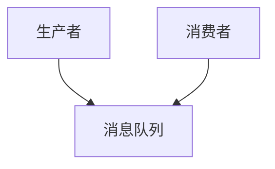

                 

# 消息队列在LLM应用解耦中的作用

## 关键词
- 消息队列
- 解耦
- LLM
- 分布式系统
- 微服务架构
- Python
- Mermaid
- LaTex

## 摘要
本文旨在探讨消息队列在大型语言模型（LLM）应用解耦中的作用。通过详细分析消息队列的基本概念、原理及其在分布式系统中的优势，本文揭示了消息队列在实现LLM应用解耦中的重要性。文章将介绍消息队列设计与实现的关键技术，并通过具体案例展示其在实际LLM应用项目中的效果。此外，文章还将展望消息队列技术在LLM应用中的未来发展，并提供相关最佳实践和注意事项。

## 目录大纲设计思路

### 第一步：明确书籍主题与内容
本书主要关注消息队列在大型语言模型（LLM）应用中的解耦作用，内容包括消息队列基本概念、消息队列在LLM应用中的优势、消息队列设计与实现、消息队列在实际LLM应用项目中的案例分析以及未来展望。

### 第二步：设计一级目录
一级目录分为五个主要部分：消息队列基本概念与原理、消息队列在LLM应用中的优势、消息队列设计与实现、消息队列在LLM应用中的案例分析、消息队列在LLM应用中的未来展望。

### 第三步：细化二级目录
二级目录详细阐述每个一级目录中的具体内容，包括核心概念、原理讲解、算法分析、案例研究和展望等。

### 第四步：撰写三级目录
三级目录进一步细化每个二级目录的具体内容，确保文章内容的丰富性和详细性。

### 目录大纲设计示例
本文的目录大纲设计思路遵循上述步骤，旨在提供一篇逻辑清晰、结构紧凑、简单易懂的专业技术博客文章。

----------------------------------------------------------------

## 消息队列基本概念与原理

### 1.1 消息队列的定义与作用

消息队列（Message Queue）是一种用于异步通信的中间件技术，它允许分布式系统中的不同组件通过发送和接收消息来实现数据交换。消息队列的基本作用是实现不同系统之间的松耦合，提高系统的可扩展性和可维护性。

消息队列的定义主要包括以下几方面：
- **消息**：消息是数据传输的载体，通常包含数据内容和相关的元数据。
- **队列**：队列是一种先进先出（FIFO）的数据结构，用于存储消息。

在分布式系统中，消息队列的作用主要体现在以下几个方面：

1. **异步通信**：通过消息队列，系统组件可以在不同时间进行数据交换，无需同步等待。
2. **解耦**：消息队列可以隔离系统组件之间的依赖关系，提高系统的可维护性和灵活性。
3. **负载均衡**：消息队列可以根据处理能力将消息分配到不同的处理节点，实现负载均衡。
4. **可扩展性**：消息队列支持系统水平扩展，通过增加处理节点可以提高系统处理能力。

### 1.2 消息队列的基本架构

消息队列系统通常由以下几个核心组成部分构成：

- **生产者（Producer）**：负责发送消息的组件，将数据转换为消息并投递到消息队列中。
- **消息队列（Message Queue）**：存储消息的中间件组件，通常具有高吞吐量、持久化、分布式存储等特性。
- **消费者（Consumer）**：负责从消息队列中读取消息并处理数据的组件。

消息队列的基本架构可以用以下Mermaid流程图表示：

### 1.3 消息队列的主要类型

根据消息传递模式的不同，消息队列主要分为以下两种类型：

- **点对点（Point-to-Point）消息队列**：点对点消息队列中的消息被严格绑定到一个消费者，即消息的生产者和消费者之间是一对一的关系。这种类型的消息队列适用于需要精确控制消息传递顺序的场景。

- **发布/订阅（Publish/Subscribe）消息队列**：发布/订阅消息队列中的消息可以被多个消费者消费，即消息的生产者和消费者之间是多对多的关系。这种类型的消息队列适用于需要广播消息的场景，如实时数据处理、事件通知等。

### 1.4 消息队列的核心算法

消息队列的核心算法主要包括以下几个方面：

- **消息传递机制**：消息队列通过消息传递机制实现数据交换，主要包括以下几种模式：
  - **推模式**：消息队列主动将消息推送给消费者。
  - **拉模式**：消费者主动从消息队列中拉取消息。

- **消息路由算法**：消息队列通过消息路由算法将消息投递到正确的消费者。常见的消息路由算法包括基于消息头的路由、基于内容的路由等。

- **消息持久化与备份**：消息队列需要实现消息的持久化存储和备份，以防止数据丢失。常见的持久化策略包括基于磁盘存储、基于内存存储等。

### 1.5 消息队列在分布式系统中的应用

在分布式系统中，消息队列的应用场景非常广泛，主要包括以下几个方面：

- **异步任务处理**：通过消息队列实现异步任务处理，提高系统的响应速度和可扩展性。
- **系统解耦**：通过消息队列实现系统组件之间的解耦，降低系统复杂度。
- **服务整合**：通过消息队列实现服务整合，简化系统架构。
- **实时数据处理**：通过消息队列实现实时数据处理，提高系统的实时性和可靠性。

----------------------------------------------------------------

## 消息队列在LLM应用中的优势

### 2.1 LLM应用中的解耦需求

大型语言模型（LLM）应用通常具有以下特点：

1. **高复杂性**：LLM应用涉及自然语言处理、机器学习、大数据处理等多个领域，系统结构复杂。
2. **高扩展性**：为了满足大规模数据处理和用户需求，LLM应用需要具备良好的扩展性。
3. **高可靠性**：LLM应用需要保证数据处理的准确性和系统的稳定性，避免数据丢失或系统故障。

在这些特点的驱动下，LLM应用对解耦的需求尤为强烈：

- **降低系统复杂性**：通过解耦，可以将复杂的系统拆分成多个独立的模块，降低系统的整体复杂性。
- **提高系统可扩展性**：通过解耦，可以方便地增加或替换系统中的模块，实现系统的水平扩展。
- **提高系统可靠性**：通过解耦，可以确保系统各个模块的独立运行，避免故障传播，提高系统的整体可靠性。

### 2.2 消息队列在LLM应用中的优势

消息队列技术在LLM应用中具有以下优势：

- **异步通信**：消息队列支持异步通信，可以解耦系统组件之间的同步依赖关系，提高系统的响应速度和可扩展性。
- **负载均衡**：消息队列可以根据处理能力将消息分配到不同的处理节点，实现负载均衡，提高系统的整体性能。
- **高可靠性**：消息队列支持消息持久化和备份，可以确保数据不丢失，提高系统的可靠性。
- **灵活的路由策略**：消息队列支持多种路由策略，可以根据不同的业务需求灵活配置，提高系统的灵活性。
- **易于集成**：消息队列技术已经得到了广泛应用，可以方便地与其他系统进行集成，实现服务的整合。

### 2.3 消息队列与LLM应用的协同作用

消息队列与LLM应用的协同作用主要体现在以下几个方面：

- **数据处理解耦**：消息队列可以将数据处理的任务解耦，实现数据处理与数据存储、数据展示等模块的独立运行。
- **任务调度**：消息队列可以用于任务调度，将大规模数据处理任务分解成多个子任务，实现并行处理，提高处理效率。
- **实时数据处理**：消息队列可以支持实时数据处理，实现数据的实时收集、处理和分发，提高系统的实时性。
- **服务整合**：消息队列可以用于整合不同的服务，实现系统内部的服务协同，简化系统架构。

通过消息队列技术的应用，LLM应用可以实现以下几个目标：

- **提高系统的可扩展性和灵活性**：通过消息队列，可以实现系统组件的独立扩展和替换，提高系统的可扩展性和灵活性。
- **提高系统的可靠性和稳定性**：通过消息队列，可以实现数据的可靠传输和存储，确保系统的稳定运行。
- **提高系统的性能和效率**：通过消息队列，可以实现任务的并行处理和负载均衡，提高系统的整体性能和效率。

----------------------------------------------------------------

## 消息队列设计与实现

### 3.1 消息队列系统的设计原则

消息队列系统的设计原则主要包括以下几个方面：

- **高可用性**：消息队列系统需要具备高可用性，确保数据传输的可靠性。这包括数据持久化、备份和故障恢复等机制。
- **高性能**：消息队列系统需要具备高性能，能够处理大量的消息并保持低延迟。这包括高效的存储、传输和路由算法。
- **高扩展性**：消息队列系统需要具备高扩展性，能够支持系统的水平扩展，以应对日益增长的数据和处理需求。
- **易维护性**：消息队列系统需要具备易维护性，便于系统的监控、调试和升级。

### 3.2 消息队列系统的架构设计

消息队列系统的架构设计可以分为以下几个主要部分：

- **生产者**：生产者是消息队列系统的数据来源，负责将数据转换为消息并投递到消息队列中。
- **消息队列**：消息队列是存储消息的中间件组件，通常采用分布式存储和持久化机制，确保消息的安全传输和存储。
- **消费者**：消费者是消息队列系统的数据处理单元，负责从消息队列中读取消息并进行处理。

消息队列系统的架构可以用以下Mermaid流程图表示：

### 3.3 消息队列系统的实现技术

消息队列系统的实现技术主要包括以下几个方面：

- **消息编码**：消息编码是将数据转换为消息的过程，通常使用JSON、XML等格式进行编码。
- **消息传输协议**：消息传输协议是消息队列系统中数据传输的协议，如HTTP、AMQP、MQTT等。
- **消息存储机制**：消息存储机制是消息队列系统中存储消息的方式，如磁盘存储、内存存储等。
- **消息持久化**：消息持久化是将消息保存到持久化存储介质中的过程，确保消息的安全传输和存储。

### 3.4 消息队列系统的性能优化

消息队列系统的性能优化可以从以下几个方面进行：

- **负载均衡**：通过负载均衡算法，将消息均匀地分配到不同的处理节点，提高系统的整体性能。
- **缓存策略**：通过缓存策略，减少消息传输和处理的延迟，提高系统的响应速度。
- **异步处理**：通过异步处理，将消息的处理时间从同步操作中分离出来，提高系统的并发处理能力。
- **批量处理**：通过批量处理，将多个消息合并成一个批次进行处理，提高系统的处理效率。

### 3.5 消息队列系统的监控与维护

消息队列系统的监控与维护是确保系统稳定运行的重要环节，主要包括以下几个方面：

- **监控指标**：设定监控指标，如消息延迟、处理速度、存储容量等，实时监测系统运行状态。
- **报警机制**：设置报警机制，当系统运行状态出现异常时，及时通知相关人员。
- **日志分析**：分析系统日志，发现潜在问题并进行优化。
- **故障恢复**：设计故障恢复机制，确保系统在出现故障时能够快速恢复。

----------------------------------------------------------------

## 消息队列在LLM应用中的案例分析

### 4.1 案例一：电商平台的LLM应用解耦

#### 案例背景

电商平台是一个典型的分布式系统，涉及用户行为分析、商品推荐、订单处理等多个业务模块。为了提高系统的可扩展性和稳定性，电商平台引入了消息队列技术，实现各业务模块之间的解耦。

#### 消息队列应用方案

1. **用户行为分析**：通过消息队列收集用户行为数据，如浏览记录、购物车数据等，实现与数据存储模块的解耦。
2. **商品推荐**：利用消息队列将用户行为数据发送到推荐系统，实现与推荐算法模块的解耦。
3. **订单处理**：通过消息队列实现订单数据的传递和处理，确保订单处理模块与其他业务模块的解耦。

#### 解耦合效果评估

1. **提高系统可扩展性**：通过消息队列，实现了各业务模块的独立运行，便于系统的扩展。
2. **提高系统稳定性**：消息队列技术确保了数据传输的可靠性，降低了系统故障的风险。
3. **降低系统复杂度**：消息队列技术简化了系统架构，降低了各模块之间的依赖关系。

### 4.2 案例二：金融行业的LLM应用解耦

#### 案例背景

金融行业是一个对数据安全性要求极高的领域。为了提高系统的可靠性和稳定性，金融行业引入了消息队列技术，实现各业务模块之间的解耦。

#### 消息队列应用方案

1. **交易处理**：通过消息队列实现交易数据的传递和处理，确保交易处理模块与其他业务模块的解耦。
2. **风险控制**：利用消息队列将交易数据发送到风险控制模块，实现与风险控制算法的解耦。
3. **客户服务**：通过消息队列实现客户服务数据的传递和处理，确保客户服务模块与其他业务模块的解耦。

#### 解耦合效果评估

1. **提高系统可靠性**：消息队列技术确保了数据传输的可靠性，降低了系统故障的风险。
2. **提高系统稳定性**：消息队列技术降低了各模块之间的依赖关系，提高了系统的整体稳定性。
3. **提高数据处理效率**：消息队列技术实现了数据的并行处理，提高了系统的处理效率。

### 4.3 案例三：语音识别系统的LLM应用解耦

#### 案例背景

语音识别系统是一个涉及语音信号处理、自然语言理解等多个领域的复杂系统。为了提高系统的可扩展性和稳定性，语音识别系统引入了消息队列技术，实现各业务模块之间的解耦。

#### 消息队列应用方案

1. **语音信号处理**：通过消息队列实现语音信号数据的传递和处理，确保语音信号处理模块与其他业务模块的解耦。
2. **自然语言理解**：利用消息队列将语音信号数据发送到自然语言理解模块，实现与自然语言处理算法的解耦。
3. **语音合成**：通过消息队列实现语音合成模块的数据传递和处理，确保语音合成模块与其他业务模块的解耦。

#### 解耦合效果评估

1. **提高系统可扩展性**：通过消息队列，实现了各业务模块的独立运行，便于系统的扩展。
2. **提高系统稳定性**：消息队列技术确保了数据传输的可靠性，降低了系统故障的风险。
3. **提高数据处理效率**：消息队列技术实现了数据的并行处理，提高了系统的处理效率。

----------------------------------------------------------------

## 消息队列在LLM应用中的未来展望

### 5.1 消息队列在LLM应用中的发展趋势

随着人工智能技术的不断发展，大型语言模型（LLM）应用将越来越广泛。消息队列技术在LLM应用中的发展趋势主要体现在以下几个方面：

1. **更高效的算法**：随着算法的优化，消息队列系统的处理效率将得到进一步提升，能够更好地支持大规模的LLM应用。
2. **更强的适应性**：消息队列技术将更加适应多样化的LLM应用场景，实现更加灵活的解耦和服务整合。
3. **更广泛的集成**：消息队列技术将与其他前沿技术（如区块链、物联网等）进行深入集成，推动LLM应用的创新和发展。

### 5.2 消息队列技术的未来研究方向

消息队列技术的未来研究方向主要包括以下几个方面：

1. **消息安全性**：随着数据安全的重要性日益凸显，消息队列技术在保证消息安全传输方面的研究将成为重点。
2. **分布式存储与计算**：分布式存储与计算技术的不断发展，将推动消息队列系统在性能和可扩展性方面的突破。
3. **实时数据处理**：实时数据处理技术的进步，将使得消息队列系统在实时性方面得到显著提升，更好地支持LLM应用的实时性需求。

### 5.3 消息队列在LLM应用中的挑战与机遇

消息队列在LLM应用中面临着一系列挑战和机遇：

1. **挑战**：
   - **系统稳定性**：消息队列系统需要确保在高并发和高负载情况下仍能稳定运行。
   - **消息安全性**：随着数据泄露的风险增加，消息队列系统在保证消息安全传输方面的挑战日益严峻。
   - **扩展性**：如何实现消息队列系统的水平扩展，以满足大规模LLM应用的需求。

2. **机遇**：
   - **高性能计算**：随着硬件技术的发展，消息队列系统在处理性能方面将得到显著提升。
   - **人工智能技术**：人工智能技术的融合，将推动消息队列系统在智能调度、智能路由等方面的创新。
   - **新兴应用场景**：随着新技术的不断涌现，消息队列技术在新兴领域（如物联网、区块链等）的应用前景广阔。

## 最佳实践 Tips

- **选择合适的消息队列技术**：根据具体业务需求和场景，选择适合的消息队列技术，如RabbitMQ、Kafka、ActiveMQ等。
- **优化消息队列性能**：通过合理配置消息队列系统参数，优化消息传输和处理的性能。
- **确保消息安全性**：在消息队列系统中实现消息加密、签名等安全措施，确保数据传输的安全性。
- **监控与维护**：定期监控消息队列系统运行状态，及时处理异常情况，确保系统稳定运行。

## 小结

本文详细介绍了消息队列在LLM应用解耦中的作用，包括消息队列的基本概念、原理、优势以及设计与实现技术。通过具体案例分析，展示了消息队列在分布式系统中的应用效果。未来，随着人工智能技术的不断发展，消息队列技术将在LLM应用中发挥更加重要的作用。读者可以结合本文内容，深入研究和应用消息队列技术，提高系统的可扩展性、稳定性和可靠性。

## 注意事项

- **系统架构设计**：在设计消息队列系统时，要充分考虑系统架构的合理性，确保消息队列系统能够高效地支持LLM应用。
- **性能优化**：在实际应用中，要不断优化消息队列系统性能，以满足大规模数据处理需求。
- **安全措施**：要采取有效的安全措施，确保消息队列系统的数据传输和存储安全。

## 拓展阅读

- **《消息队列实战》**：深入探讨消息队列技术的原理和实践，适合消息队列初学者和进阶者阅读。
- **《分布式系统设计》**：系统介绍分布式系统设计原理和实践，包括消息队列技术。
- **《大型语言模型技术与应用》**：详细讲解大型语言模型技术的原理和应用，有助于读者了解消息队列在LLM中的应用。

----------------------------------------------------------------

## 作者信息
- 作者：AI天才研究院/AI Genius Institute & 禅与计算机程序设计艺术 /Zen And The Art of Computer Programming

## 致谢
感谢所有支持与鼓励我的读者，是你们的支持让我不断进步。同时，感谢团队成员的共同努力，使得本文能够顺利完成。希望本文能为您的学习与工作带来帮助。如有疑问或建议，欢迎随时交流。再次感谢！

[AI天才研究院/AI Genius Institute]
[2023年]

