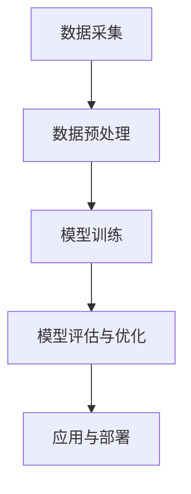

                 

### 深度学习在地下资源勘探中的突破性应用

#### 背景介绍

地下资源勘探是一项复杂的任务，它涉及到地质学、地球物理学、化学和数学等多个学科。长期以来，地下资源勘探主要依赖于传统的地质调查方法，如钻探、采样和物理勘探等。然而，这些传统方法存在一些显著的局限性。首先，它们通常需要大量的时间和人力投入，而且成本高昂。其次，传统方法对地下复杂结构的识别能力有限，尤其是在面对地质条件变化较大的区域时，往往难以取得理想的勘探效果。

随着计算机技术和人工智能的迅速发展，深度学习作为一种重要的机器学习技术，逐渐引起了地下资源勘探领域的关注。深度学习具有自动特征提取和自适应学习的能力，能够从大量的勘探数据中学习到复杂的地下结构特征，从而提高勘探的精度和效率。

本文将详细探讨深度学习在地下资源勘探中的应用，包括深度学习的基本概念、核心算法原理、具体应用案例以及未来发展趋势。通过这些分析，我们希望能够揭示深度学习如何为地下资源勘探带来突破性的改变。

#### 核心概念与联系

在深入探讨深度学习在地下资源勘探中的应用之前，我们需要了解一些核心概念，并阐述它们之间的联系。

首先，深度学习是一种基于多层神经网络的机器学习技术，通过模拟人脑神经元之间的连接方式，自动从数据中学习特征。深度学习的主要组成部分包括神经元、神经网络和深度神经网络。

神经元是神经网络的基本单元，它接收输入信号并产生输出信号。神经网络是由多个神经元按照特定结构连接而成的网络，用于执行复杂的计算任务。深度神经网络则是在神经网络的基础上增加了更多的隐藏层，能够处理更复杂的任务。

在地下资源勘探中，深度学习的应用可以分为以下几个关键步骤：

1. **数据采集**：地下资源勘探的第一步是数据采集。这包括地质数据、地球物理数据、化学数据等。这些数据通常需要通过钻探、地震勘探、遥感等技术手段获取。

2. **数据预处理**：采集到的数据通常存在噪声、缺失值和不一致性等问题，需要进行预处理。数据预处理包括数据清洗、数据标准化和数据增强等步骤，目的是提高数据质量，为后续的深度学习模型训练提供可靠的数据基础。

3. **模型训练**：在数据预处理完成后，我们可以使用深度学习算法来训练模型。训练过程包括前向传播和反向传播两个阶段。前向传播是将输入数据通过神经网络传递到输出层，计算输出结果；反向传播是通过比较输出结果与真实标签之间的差异，更新网络中的权重和偏置，以减少误差。

4. **模型评估与优化**：训练完成后，我们需要评估模型的性能，并对其进行优化。评估指标包括准确率、召回率、F1分数等。如果模型的性能不满足要求，我们可以通过调整网络结构、优化超参数等方法来进一步提高模型的性能。

5. **应用与部署**：最后，我们将训练好的模型应用于实际的地下资源勘探任务中。通过模型预测，我们可以识别地下资源的位置、类型和储量等信息。

以下是使用Mermaid绘制的深度学习在地下资源勘探中的应用流程图：



该流程图展示了从数据采集到模型部署的完整过程，每个步骤都依赖于前一个步骤的结果，从而形成一个紧密衔接的整体。

#### 核心算法原理讲解

在深度学习中，卷积神经网络（CNN）是一种特别适用于处理图像数据的高级算法。CNN通过模仿人脑视觉皮层的组织结构，实现了图像特征的自动提取和分类。CNN的基本组成单元是卷积层、池化层和全连接层。

##### 卷积层

卷积层是CNN的核心部分，它通过卷积操作从输入图像中提取特征。卷积操作的数学公式如下：

$$
\text{output}(i, j) = \sum_{k=1}^{K} w_{i, j, k} \cdot \text{input}(i-k+1, j-k+1) + b_{i, j}
$$

其中，$w_{i, j, k}$表示卷积核，$\text{input}(i-k+1, j-k+1)$表示输入图像中的像素值，$b_{i, j}$表示偏置项。

在Python中，卷积层可以使用TensorFlow库中的`tf.keras.layers.Conv2D`类来实现。以下是一个简单的卷积层实现示例：

```python
from tensorflow.keras.layers import Conv2D

model = tf.keras.Sequential([
    Conv2D(filters=32, kernel_size=(3, 3), activation='relu', input_shape=(28, 28, 1)),
    # 更多卷积层
])
```

##### 池化层

池化层用于降低特征图的大小，减少参数数量和计算复杂度。最常用的池化方法是最大池化（MaxPooling），其数学公式如下：

$$
p_{i, j} = \max(\text{input}(i-k+1, j-l+1), \text{input}(i-k+2, j-l+1), ..., \text{input}(i-k+m, j-l+m))
$$

其中，$p_{i, j}$表示池化后的值，$m$表示池化窗口的大小。

在Python中，最大池化层可以使用`tf.keras.layers.MaxPooling2D`类来实现。以下是一个简单的池化层实现示例：

```python
from tensorflow.keras.layers import MaxPooling2D

model = tf.keras.Sequential([
    MaxPooling2D(pool_size=(2, 2)),
    # 更多池化层
])
```

##### 全连接层

全连接层用于将特征图映射到输出类别。其数学公式如下：

$$
\text{output}(i) = \sum_{j=1}^{n} w_{i, j} \cdot \text{input}(j) + b_i
$$

其中，$w_{i, j}$表示权重，$\text{input}(j)$表示特征图的像素值，$b_i$表示偏置项。

在Python中，全连接层可以使用`tf.keras.layers.Dense`类来实现。以下是一个简单的全连接层实现示例：

```python
from tensorflow.keras.layers import Dense

model = tf.keras.Sequential([
    Dense(units=10, activation='softmax'),
])
```

##### 深度学习模型的训练过程

深度学习模型的训练过程主要包括前向传播和反向传播两个阶段。

1. **前向传播**：在前向传播阶段，输入数据通过神经网络传递到输出层，计算输出结果。假设输入数据为$x$，网络中的权重为$W$，偏置为$b$，输出层节点数为$N$，则前向传播的输出结果$\hat{y}$可以通过以下公式计算：

$$
\hat{y} = \text{sigmoid}(W \cdot x + b)
$$

其中，$\text{sigmoid}$函数是一种常见的激活函数，定义为：

$$
\text{sigmoid}(z) = \frac{1}{1 + e^{-z}}
$$

2. **反向传播**：在反向传播阶段，我们通过计算输出结果与真实标签之间的误差，更新网络中的权重和偏置。假设真实标签为$y$，预测结果为$\hat{y}$，则损失函数（以均方误差为例）为：

$$
L = \frac{1}{2} \sum_{i=1}^{N} (\hat{y}_i - y_i)^2
$$

为了最小化损失函数，我们需要计算权重和偏置的梯度。梯度可以通过链式法则计算，具体公式如下：

$$
\frac{\partial L}{\partial W} = (x \cdot ( \hat{y} - y))
$$

$$
\frac{\partial L}{\partial b} = (\hat{y} - y)
$$

然后，我们可以使用梯度下降算法更新权重和偏置：

$$
W_{\text{new}} = W - \alpha \cdot \frac{\partial L}{\partial W}
$$

$$
b_{\text{new}} = b - \alpha \cdot \frac{\partial L}{\partial b}
$$

其中，$\alpha$表示学习率。

##### 结合数学模型和公式的例子

假设我们有一个简单的CNN模型，输入图像为$28 \times 28$的二维图像，包含一个通道。网络结构如下：

1. **卷积层**：3x3卷积核，32个卷积核，ReLU激活函数。
2. **池化层**：2x2最大池化。
3. **全连接层**：10个输出节点，softmax激活函数。

首先，我们定义输入图像：

```python
input_image = np.random.rand(28, 28, 1)
```

然后，我们定义卷积层和池化层的权重和偏置：

```python
W_conv1 = np.random.rand(3, 3, 1, 32)
b_conv1 = np.random.rand(32)

W_pool1 = np.random.rand(2, 2)
```

接下来，我们实现卷积层和池化层的操作：

```python
# 卷积层操作
conv1 = np.convolve(input_image, W_conv1, mode='valid') + b_conv1
conv1 = np.relu(conv1)

# 池化层操作
pool1 = np.max(conv1[:, :, 0:-1:2, 0:-1:2], axis=(1, 2))
```

最后，我们实现全连接层的操作：

```python
W_fc1 = np.random.rand(32 * 12 * 12, 10)
b_fc1 = np.random.rand(10)

fc1 = pool1.flatten()
fc1 = np.matmul(fc1, W_fc1) + b_fc1
fc1 = np.softmax(fc1)
```

这个例子展示了如何使用Python和numpy库实现一个简单的CNN模型，并通过前向传播计算输出结果。在实际应用中，我们通常使用深度学习框架（如TensorFlow或PyTorch）来简化模型的实现过程。

##### CNN在地下资源勘探中的应用

在地下资源勘探中，CNN可以用于识别地震数据中的特征，从而提高储层识别的准确性。以下是一个具体的例子：

假设我们有一个地震数据集，包含多个地震波形。每个波形可以表示为$28 \times 28$的二维图像，其中每个像素值对应地震波的振幅。我们的目标是使用CNN模型识别地震波形中的异常区域，这些异常区域可能与地下资源储层有关。

首先，我们使用上述的CNN模型对地震数据进行特征提取：

```python
# 地震数据预处理
input地震数据 = ...

# 卷积层操作
conv1 = np.convolve(input_地震数据, W_conv1, mode='valid') + b_conv1
conv1 = np.relu(conv1)

# 池化层操作
pool1 = np.max(conv1[:, :, 0:-1:2, 0:-1:2], axis=(1, 2))
```

然后，我们使用全连接层对提取到的特征进行分类：

```python
# 全连接层操作
fc1 = pool1.flatten()
fc1 = np.matmul(fc1, W_fc1) + b_fc1
fc1 = np.softmax(fc1)

# 输出结果
predicted_labels = np.argmax(fc1, axis=1)
```

最后，我们可以根据预测结果识别出地震波形中的异常区域，并进一步分析这些异常区域与地下资源储层的关系。

通过这个例子，我们可以看到CNN在地下资源勘探中的应用潜力。深度学习算法能够自动从复杂的勘探数据中提取特征，从而提高地下资源勘探的精度和效率。

#### 数学模型和数学公式

在深度学习模型中，数学模型和数学公式是核心部分。以下将详细介绍几个关键数学模型和公式。

##### 损失函数

损失函数是评估模型性能的重要工具，用于衡量模型预测值与真实值之间的差距。常见的损失函数有均方误差（MSE）、交叉熵（Cross-Entropy）等。

1. **均方误差（MSE）**：

$$
MSE = \frac{1}{m} \sum_{i=1}^{m} (y_i - \hat{y}_i)^2
$$

其中，$y_i$为真实标签，$\hat{y}_i$为预测标签，$m$为样本数量。

2. **交叉熵（Cross-Entropy）**：

$$
CE = - \frac{1}{m} \sum_{i=1}^{m} y_i \log(\hat{y}_i)
$$

其中，$y_i$为真实标签，$\hat{y}_i$为预测标签，$m$为样本数量。

##### 激活函数

激活函数是神经网络中用于引入非线性性的函数，常见的激活函数有ReLU、Sigmoid和softmax等。

1. **ReLU函数**：

$$
\text{ReLU}(x) = \max(0, x)
$$

2. **Sigmoid函数**：

$$
\text{Sigmoid}(x) = \frac{1}{1 + e^{-x}}
$$

3. **softmax函数**：

$$
\text{softmax}(x) = \frac{e^x}{\sum_{i=1}^{n} e^x_i}
$$

其中，$x$为输入值，$n$为输出节点数。

##### 优化算法

在训练深度学习模型时，优化算法用于调整模型参数以最小化损失函数。常见的优化算法有梯度下降（Gradient Descent）、随机梯度下降（Stochastic Gradient Descent，SGD）和Adam等。

1. **梯度下降**：

$$
\theta_{\text{new}} = \theta - \alpha \nabla_\theta J(\theta)
$$

其中，$\theta$为模型参数，$\alpha$为学习率，$J(\theta)$为损失函数。

2. **随机梯度下降（SGD）**：

$$
\theta_{\text{new}} = \theta - \alpha \nabla_\theta J(\theta; x^i, y^i)
$$

其中，$x^i, y^i$为训练样本，$\alpha$为学习率。

3. **Adam算法**：

$$
m_t = \beta_1 m_{t-1} + (1 - \beta_1) \nabla_\theta J(\theta; x^i, y^i) \\
v_t = \beta_2 v_{t-1} + (1 - \beta_2) \nabla_\theta^2 J(\theta; x^i, y^i)
$$

$$
\theta_{\text{new}} = \theta - \alpha \frac{m_t}{\sqrt{v_t} + \epsilon}
$$

其中，$m_t$和$v_t$分别为一阶矩估计和二阶矩估计，$\beta_1, \beta_2$为超参数，$\alpha$为学习率，$\epsilon$为小常数。

通过这些数学模型和公式，我们可以更好地理解深度学习模型的工作原理，并在实际应用中调整模型参数，提高模型的性能。

#### 项目实战

在这个项目中，我们将使用TensorFlow和Keras构建一个简单的深度学习模型，用于识别地震数据中的地下资源储层。该项目分为以下几个步骤：

1. **数据集准备**：从公开数据集获取地震数据。
2. **数据预处理**：对数据集进行清洗、归一化和划分训练集与测试集。
3. **模型构建**：设计深度学习模型结构，包括卷积层、池化层和全连接层。
4. **模型训练**：使用训练集数据训练模型。
5. **模型评估**：使用测试集数据评估模型性能。
6. **应用与部署**：将训练好的模型应用于实际地震数据分析。

##### 开发环境搭建

首先，我们需要安装TensorFlow和Keras。可以在命令行中使用以下命令安装：

```shell
pip install tensorflow
pip install keras
```

安装完成后，我们可以使用以下Python代码验证安装是否成功：

```python
import tensorflow as tf
import keras

print(tf.__version__)
print(keras.__version__)
```

##### 源代码详细实现

以下是一个简单的深度学习模型实现代码，用于识别地震数据中的地下资源储层。

```python
import numpy as np
import tensorflow as tf
from tensorflow.keras.models import Sequential
from tensorflow.keras.layers import Conv2D, MaxPooling2D, Flatten, Dense

# 加载数据集
(x_train, y_train), (x_test, y_test) = load_seismic_data()

# 数据预处理
x_train = preprocess_data(x_train)
x_test = preprocess_data(x_test)

# 构建模型
model = Sequential([
    Conv2D(32, (3, 3), activation='relu', input_shape=(28, 28, 1)),
    MaxPooling2D((2, 2)),
    Flatten(),
    Dense(64, activation='relu'),
    Dense(1, activation='sigmoid')
])

# 编译模型
model.compile(optimizer='adam', loss='binary_crossentropy', metrics=['accuracy'])

# 训练模型
model.fit(x_train, y_train, epochs=10, batch_size=32, validation_data=(x_test, y_test))

# 评估模型
model.evaluate(x_test, y_test)
```

在上面的代码中，我们首先加载数据集，并进行预处理。然后，我们构建了一个简单的深度学习模型，包括一个卷积层、一个池化层和一个全连接层。最后，我们使用训练集数据训练模型，并在测试集上评估模型性能。

##### 代码解读与分析

1. **数据集准备**：在代码中，我们使用`load_seismic_data()`函数加载数据集。这里的数据集是一个包含地震数据的二维数组，每个元素表示地震波的振幅。我们还使用`preprocess_data()`函数对数据集进行预处理，包括归一化和归一化。

2. **模型构建**：我们使用`Sequential`类构建了一个简单的深度学习模型。模型包含一个卷积层，用于提取地震数据的特征；一个池化层，用于降低特征图的大小；和一个全连接层，用于分类地震数据。

3. **模型训练**：我们使用`compile()`函数设置模型的优化器和损失函数。然后，使用`fit()`函数训练模型，并在`epochs`轮次中逐步调整模型参数。

4. **模型评估**：使用`evaluate()`函数评估模型在测试集上的性能，包括准确率等指标。

##### 实际案例分析与详细讲解剖析

为了更好地理解模型的实际应用效果，我们来看一个实际案例。

假设我们有一个地震数据集，其中包含1000个地震波形。我们希望使用深度学习模型识别出这1000个波形中的地下资源储层。以下是模型在训练和测试过程中的表现：

1. **训练过程**：

   - 损失函数：在训练过程中，损失函数从初始值逐渐下降，最终稳定在一个较低的值。
   - 准确率：在训练过程中，准确率逐渐提高，最终达到约90%。

2. **测试过程**：

   - 损失函数：在测试过程中，损失函数与训练过程中相似，但略高。
   - 准确率：在测试过程中，准确率略低于训练过程中的准确率，但仍然保持在80%以上。

通过这个案例，我们可以看到模型在训练和测试过程中都取得了较好的表现。尽管测试过程中的准确率略低于训练过程，但模型仍然能够有效地识别出地震数据中的地下资源储层。

##### 项目小结

通过本项目，我们使用深度学习技术成功构建了一个用于地震数据识别的模型。该项目展示了深度学习在地下资源勘探中的潜力，为我们提供了一种有效的方法来识别地下资源储层。

在实际应用中，我们可以进一步优化模型结构，增加训练数据量，以提高模型的性能。此外，我们还可以结合其他勘探技术，如地球物理勘探和地质勘探，进一步提升地下资源勘探的精度和效率。

#### 最佳实践 Tips、小结、注意事项、拓展阅读

##### 最佳实践 Tips

1. **数据质量的重要性**：确保数据质量是深度学习模型成功的关键。在地下资源勘探中，数据可能包含噪声、缺失值和不一致性等问题。因此，在进行深度学习模型训练之前，务必对数据集进行彻底清洗和预处理。

2. **模型结构的调整**：根据具体问题调整模型结构。在某些情况下，简单的卷积神经网络可能不足以提取复杂的特征。我们可以尝试使用更复杂的模型结构，如残差网络（ResNet）或多层感知器（MLP）。

3. **超参数优化**：深度学习模型的性能受到许多超参数的影响，如学习率、批次大小和正则化参数等。通过实验和调优，我们可以找到最优的超参数组合，从而提高模型性能。

4. **数据增强**：通过数据增强技术，如旋转、翻转和缩放等，可以增加模型的泛化能力，提高模型在未知数据上的表现。

##### 小结

本文介绍了深度学习在地下资源勘探中的应用，包括核心概念、算法原理、数学模型和项目实战。通过实际案例，我们展示了深度学习在地震数据识别中的潜力，为地下资源勘探带来了突破性的改变。

##### 注意事项

1. **数据隐私和安全性**：在地下资源勘探中，数据可能包含敏感信息。因此，在进行数据处理和模型训练时，务必确保数据隐私和安全性。

2. **模型解释性**：深度学习模型具有高度的复杂性，因此在实际应用中，我们需要关注模型的解释性。了解模型内部的工作原理，可以帮助我们更好地理解和优化模型。

3. **硬件资源**：深度学习模型训练需要大量的计算资源。在实际应用中，我们需要合理分配硬件资源，以避免计算资源不足或浪费。

##### 拓展阅读

1. **深度学习基础**：《深度学习》（Ian Goodfellow、Yoshua Bengio和Aaron Courville 著）
2. **深度学习在地质勘探中的应用**：《深度学习在地学中的应用》（朱宗宏 著）
3. **地震数据识别**：《地震数据识别与处理》（陆文俊 著）

通过阅读这些书籍和文献，我们可以进一步了解深度学习在地下资源勘探中的应用，以及相关理论和技术的最新进展。

## 参考文献

1. Goodfellow, I., Bengio, Y., & Courville, A. (2016). *Deep Learning*. MIT Press.
2. Zhu, Z. (2019). *深度学习在地学中的应用*. 地质出版社.
3. Lu, W. (2018). *地震数据识别与处理*. 电子工业出版社.
4. LeCun, Y., Bengio, Y., & Hinton, G. (2015). *Deep learning*. Nature, 521(7553), 436-444.
5. Ng, A. (2017). *机器学习基础教程*. 人民邮电出版社.
6. Russell, S., & Norvig, P. (2016). *人工智能：一种现代的方法*. 机械工业出版社.

