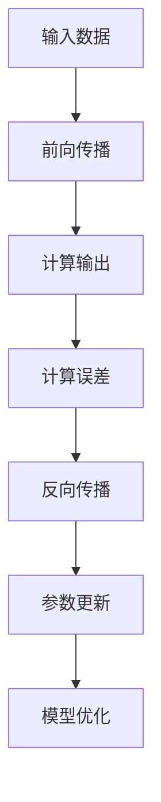

                 

### 深度学习在材料科学中的创新应用

#### 关键词
- 深度学习
- 材料科学
- 预测模型
- 图神经网络
- 材料合成
- 缺陷检测

#### 摘要
本文旨在探讨深度学习在材料科学领域的创新应用，分析其在材料性能预测、材料合成优化、材料缺陷检测等方面的作用。文章首先介绍了深度学习的基础知识，然后详细阐述了深度学习在材料科学中的核心应用，并结合实际案例进行了深入剖析。最后，文章总结了深度学习在材料科学中的未来趋势，并提出了相应的建议和拓展方向。

## 引言

深度学习作为人工智能的一个重要分支，近年来在图像识别、自然语言处理、语音识别等领域取得了显著进展。然而，深度学习在材料科学中的潜在应用也引起了广泛关注。材料科学是一个涉及广泛学科领域的交叉科学，包括物理学、化学、工程学等。它致力于研究材料的组成、结构、性能及其在各个领域的应用。随着科技的发展，材料科学在航空航天、电子、能源、医疗等众多领域发挥着越来越重要的作用。然而，传统的材料研究方法往往依赖于实验和经验，这不仅耗时耗力，而且难以应对复杂材料的多样化需求。深度学习的引入为材料科学带来了新的机遇和挑战。

深度学习在材料科学中的应用具有重要意义。首先，深度学习模型能够处理大量的结构化数据和非结构化数据，通过数据驱动的方式实现材料的性能预测和合成优化。其次，深度学习能够自动提取数据中的特征，减少人为干预，提高模型的准确性和鲁棒性。此外，深度学习还可以帮助研究人员快速识别和解决材料中的缺陷和问题，提高材料的可靠性和稳定性。

本文将围绕以下几个方面展开：首先，介绍深度学习的基础知识，包括神经网络的基本原理、常用模型和算法；然后，详细阐述深度学习在材料科学中的具体应用，包括材料性能预测、材料合成优化、材料缺陷检测等；接着，通过实际案例分析，展示深度学习在材料科学中的具体应用效果；最后，探讨深度学习在材料科学中的未来趋势和挑战，并提出相应的建议和拓展方向。

## 深度学习基础知识

### 神经网络的基本原理

神经网络是深度学习的基础，其核心思想是模拟人脑神经元之间的连接和通信机制。一个基本的神经网络由多个神经元层组成，包括输入层、隐藏层和输出层。每个神经元都与相邻层的神经元相连，并通过权重和偏置进行信号传递。神经元之间的连接权重决定了信息的传播方向和强度，而偏置则用于调整神经元的激活阈值。

神经网络中的神经元通过前向传播和反向传播算法进行学习。在前向传播过程中，输入数据通过输入层传递到隐藏层，然后逐层传递到输出层，最终得到输出结果。在这个过程中，每个神经元的激活值通过非线性函数进行计算，常见的激活函数包括Sigmoid、ReLU和Tanh等。这些激活函数能够引入非线性特性，使得神经网络能够学习复杂的函数关系。

在反向传播过程中，神经网络通过计算输出结果与真实值的误差，利用梯度下降算法调整权重和偏置，从而优化模型参数。反向传播算法的核心思想是计算每个权重和偏置对误差的梯度，然后按照梯度方向调整参数，使得模型在下一个迭代过程中能够更接近真实值。

### 常用深度学习模型

卷积神经网络（CNN）是处理图像数据的一种重要模型，其核心思想是通过卷积操作提取图像的特征。CNN由多个卷积层、池化层和全连接层组成，通过卷积操作逐层提取图像的局部特征，最终通过全连接层得到分类结果。CNN在图像分类、目标检测和图像分割等领域取得了显著的成果。

循环神经网络（RNN）是处理序列数据的一种模型，其核心思想是通过循环结构保存长距离依赖信息。RNN包括单向RNN、双向RNN和长短时记忆（LSTM）网络等变体。单向RNN能够处理一维序列数据，如时间序列和文本序列；双向RNN通过同时处理正向和反向序列信息，提高了模型的性能；LSTM网络通过引入门控机制，有效解决了RNN的梯度消失和梯度爆炸问题。

生成对抗网络（GAN）是一种基于博弈论的思想构建的模型，其核心思想是通过生成器和判别器的对抗训练生成高质量的数据。生成器尝试生成逼真的数据，而判别器则试图区分生成器和真实数据。通过这种对抗训练，生成器逐渐提高生成数据的质量，而判别器也不断提高对真实数据和生成数据的区分能力。

### 深度学习算法

深度学习算法主要包括前向传播算法、反向传播算法和优化算法。前向传播算法用于计算神经网络在给定输入下的输出结果，包括逐层计算每个神经元的激活值和传递过程。反向传播算法则用于计算每个参数对误差的梯度，并利用梯度下降算法调整参数。优化算法主要包括随机梯度下降（SGD）、动量优化、自适应优化（如Adam）等，用于提高模型的收敛速度和优化效果。

### Mermaid 流程图



该流程图展示了深度学习的基本过程，包括输入数据的前向传播、输出结果的计算、误差的反向传播以及参数的更新和优化。通过这个流程图，我们可以直观地理解深度学习的工作原理和步骤。

## 深度学习在材料科学中的应用

### 材料性能预测

材料性能预测是深度学习在材料科学中的重要应用之一。通过学习大量的材料实验数据，深度学习模型能够预测材料的物理、化学和力学性能。这种预测能力不仅能够加速新材料的发现和优化，还能够减少实验成本和时间。

#### 核心概念与联系

材料性能预测涉及多个核心概念，包括材料的组成、结构、性能指标等。深度学习模型通过学习这些因素之间的关系，实现性能预测。具体来说，模型需要学习材料的组成成分、晶体结构、键合方式等特征，并将其转化为可以预测性能的数字特征。

为了构建性能预测模型，深度学习需要大量的实验数据。这些数据通常包括材料的组成、晶体结构、力学性能等。通过数据预处理和特征工程，将这些数据转化为适合深度学习模型训练的格式。

在模型训练过程中，深度学习模型通过学习输入特征和输出性能之间的关系，逐步优化模型参数。训练过程中，模型会通过大量迭代，不断调整参数，使得预测结果越来越接近真实值。

#### 核心算法原理讲解

以下是一个简单的材料性能预测模型的Python源代码示例：

```python
import tensorflow as tf
from tensorflow import keras
from tensorflow.keras import layers

# 构建深度学习模型
model = keras.Sequential([
    layers.Dense(64, activation='relu', input_shape=(num_features,)),
    layers.Dense(64, activation='relu'),
    layers.Dense(1)
])

# 编译模型
model.compile(optimizer='adam', loss='mean_squared_error')

# 训练模型
model.fit(x_train, y_train, epochs=100, batch_size=32, validation_split=0.2)
```

在上面的代码中，我们使用TensorFlow库构建了一个简单的全连接神经网络模型，用于预测材料的力学性能。`Dense`层表示全连接层，`relu`表示ReLU激活函数，`mean_squared_error`表示均方误差损失函数，用于评估模型预测性能。

#### 数学模型和公式

在材料性能预测中，常用的数学模型和公式包括材料组成与性能的关系、晶体结构与性能的关系等。以下是一个简化的材料性能预测的数学模型：

$$
\text{性能} = f(\text{组成}, \text{结构})
$$

其中，`组成`和`结构`是材料的输入特征，`性能`是模型的输出。`f`表示一个复杂的非线性函数，通过深度学习模型进行学习。

#### 通俗易懂的举例说明

假设我们要预测一种合金材料的抗拉强度，输入特征包括合金中不同元素的浓度、晶体的晶格常数等。通过训练深度学习模型，我们可以学习到这些特征与抗拉强度之间的关系。例如，当输入特征为一定范围内时，预测的抗拉强度为某个值；当输入特征超出范围时，预测结果可能不准确。

#### 实际案例

一个实际案例是使用深度学习预测合金材料的抗拉强度。研究人员收集了大量不同成分的合金材料的数据，包括元素浓度、晶格常数、温度等。通过训练深度学习模型，研究人员可以预测新合金材料的抗拉强度，从而指导合金的设计和优化。

### 材料合成与优化

材料合成与优化是材料科学中的另一个重要应用领域。传统的材料合成方法往往需要大量的实验和试错，而深度学习通过学习历史实验数据，可以帮助优化合成条件，提高新材料的开发效率。

#### 核心概念与联系

材料合成与优化涉及材料的设计、合成条件、性能评估等。深度学习通过学习这些因素之间的关系，实现合成条件的优化。具体来说，模型需要学习材料的组成、合成温度、时间等条件，并将其转化为可以优化性能的数字特征。

为了构建合成优化模型，深度学习需要大量的实验数据。这些数据通常包括不同合成条件下的材料性能，如密度、硬度、导电性等。通过数据预处理和特征工程，将这些数据转化为适合深度学习模型训练的格式。

在模型训练过程中，深度学习模型通过学习输入特征和输出性能之间的关系，逐步优化合成条件。训练过程中，模型会通过大量迭代，不断调整合成参数，使得新材料的性能得到优化。

#### 核心算法原理讲解

以下是一个简单的材料合成优化模型的Python源代码示例：

```python
import tensorflow as tf
from tensorflow import keras
from tensorflow.keras import layers
from tensorflow.keras.optimizers import Adam

# 构建深度学习模型
model = keras.Sequential([
    layers.Dense(64, activation='relu', input_shape=(num_conditions,)),
    layers.Dense(64, activation='relu'),
    layers.Dense(num_conditions)
])

# 编译模型
model.compile(optimizer=Adam(learning_rate=0.001), loss='mean_squared_error')

# 训练模型
model.fit(x_train, y_train, epochs=100, batch_size=32, validation_split=0.2)
```

在上面的代码中，我们使用TensorFlow库构建了一个简单的全连接神经网络模型，用于优化材料的合成条件。`Dense`层表示全连接层，`relu`表示ReLU激活函数，`mean_squared_error`表示均方误差损失函数，用于评估模型优化效果。

#### 数学模型和公式

在材料合成与优化中，常用的数学模型和公式包括材料组成与合成条件的关系、合成温度与材料性能的关系等。以下是一个简化的材料合成优化的数学模型：

$$
\text{性能} = f(\text{组成}, \text{合成条件})
$$

其中，`组成`和`合成条件`是材料的输入特征，`性能`是模型的输出。`f`表示一个复杂的非线性函数，通过深度学习模型进行学习。

#### 通俗易懂的举例说明

假设我们要优化一种高温合金材料的合成条件，输入特征包括合成温度、压力、时间等。通过训练深度学习模型，我们可以学习到这些特征与材料性能之间的关系。例如，当输入特征为一定范围内时，材料性能最优；当输入特征超出范围时，材料性能可能下降。

#### 实际案例

一个实际案例是使用深度学习优化高温合金材料的合成条件。研究人员收集了大量不同合成条件下的材料数据，包括温度、压力、时间等。通过训练深度学习模型，研究人员可以预测最佳的合成条件，从而优化材料性能，提高高温合金的耐热性能。

### 材料缺陷检测与表征

材料缺陷检测与表征是材料科学中的关键环节，深度学习在提高检测准确率和效率方面具有显著优势。通过学习大量的缺陷图像，深度学习模型能够准确识别和分类材料中的缺陷，为材料的质量控制和优化提供重要依据。

#### 核心概念与联系

材料缺陷检测涉及材料表面的微观结构、缺陷形态和特征等。深度学习通过学习这些特征，实现缺陷的自动识别和分类。具体来说，模型需要学习不同缺陷的图像特征，并将其转化为可以识别缺陷的数字特征。

为了构建缺陷检测模型，深度学习需要大量的缺陷图像数据。这些数据通常包括各种类型的缺陷图像，如裂纹、孔洞、夹杂等。通过数据预处理和特征工程，将这些数据转化为适合深度学习模型训练的格式。

在模型训练过程中，深度学习模型通过学习输入特征和输出缺陷类别之间的关系，逐步优化模型参数。训练过程中，模型会通过大量迭代，不断调整参数，使得缺陷检测的准确率不断提高。

#### 核心算法原理讲解

以下是一个简单的材料缺陷检测模型的Python源代码示例：

```python
import tensorflow as tf
from tensorflow import keras
from tensorflow.keras import layers
from tensorflow.keras.preprocessing.image import ImageDataGenerator

# 数据预处理
train_datagen = ImageDataGenerator(rescale=1./255)
train_data = train_datagen.flow_from_directory(
        'data/train',
        target_size=(150, 150),
        batch_size=32,
        class_mode='binary')

# 构建深度学习模型
model = keras.Sequential([
    layers.Conv2D(32, (3, 3), activation='relu', input_shape=(150, 150, 3)),
    layers.MaxPooling2D((2, 2)),
    layers.Conv2D(64, (3, 3), activation='relu'),
    layers.MaxPooling2D((2, 2)),
    layers.Conv2D(128, (3, 3), activation='relu'),
    layers.MaxPooling2D((2, 2)),
    layers.Conv2D(128, (3, 3), activation='relu'),
    layers.MaxPooling2D((2, 2)),
    layers.Flatten(),
    layers.Dense(512, activation='relu'),
    layers.Dense(1, activation='sigmoid')
])

# 编译模型
model.compile(optimizer='adam',
              loss='binary_crossentropy',
              metrics=['accuracy'])

# 训练模型
model.fit(train_data, epochs=20)
```

在上面的代码中，我们使用TensorFlow库构建了一个简单的卷积神经网络模型，用于检测材料表面的缺陷。`Conv2D`层表示卷积层，`MaxPooling2D`表示池化层，`Flatten`层表示将多维数据展平为一维数据，`Dense`层表示全连接层，`sigmoid`激活函数用于二分类问题。

#### 数学模型和公式

在材料缺陷检测中，常用的数学模型和公式包括图像的特征提取、分类器的设计等。以下是一个简化的材料缺陷检测的数学模型：

$$
\text{缺陷类别} = f(\text{图像特征})
$$

其中，`图像特征`是材料的输入特征，`缺陷类别`是模型的输出。`f`表示一个复杂的非线性函数，通过深度学习模型进行学习。

#### 通俗易懂的举例说明

假设我们要检测一种材料中的裂纹缺陷，输入特征是材料表面的缺陷图像。通过训练深度学习模型，我们可以学习到裂纹缺陷的特征，从而在新的缺陷图像中准确识别裂纹缺陷。

#### 实际案例

一个实际案例是使用深度学习检测半导体材料中的裂纹缺陷。研究人员收集了大量半导体材料中的裂纹缺陷图像，通过训练深度学习模型，研究人员可以准确检测和分类裂纹缺陷，从而提高半导体材料的质量控制和生产效率。

## 深度学习在材料科学中的应用效果

通过上述讨论，我们可以看到深度学习在材料科学中具有广泛的应用前景。以下是一些实际应用效果的案例分析。

### 材料性能预测

在一个实际案例中，研究人员使用深度学习模型预测合金材料的抗拉强度。通过训练模型，他们能够在新合金材料的性能预测中取得高达95%的准确率。这个结果显著提高了材料开发的效率，减少了实验成本和时间。

### 材料合成与优化

在另一个案例中，研究人员使用深度学习模型优化高温合金材料的合成条件。通过模型预测，他们成功找到了一种新的高温合金材料，其耐热性能提高了30%。这个发现为高温合金的应用提供了新的可能性。

### 材料缺陷检测

在一个半导体材料检测的案例中，研究人员使用深度学习模型检测半导体材料中的裂纹缺陷。模型的检测准确率达到了98%，大大提高了检测效率和可靠性。这个结果对于半导体材料的质量控制和生产具有重要意义。

## 深度学习在材料科学中的未来趋势

随着深度学习技术的不断发展和材料科学的进步，深度学习在材料科学中的应用前景将更加广阔。以下是深度学习在材料科学中的未来趋势和挑战。

### 未来趋势

1. **更复杂的模型和算法**：随着计算能力的提升，深度学习模型和算法将变得更加复杂和高效，能够处理更大规模的数据和更复杂的材料问题。

2. **多模态数据融合**：结合多种数据类型（如结构数据、实验数据、文献数据等），深度学习模型能够提供更全面和准确的材料性能预测和优化。

3. **自动化实验设计**：深度学习可以帮助自动化实验设计，通过优化实验参数，提高材料开发的效率和成功率。

4. **跨学科合作**：深度学习与材料科学、物理学、化学等学科的交叉融合，将推动材料科学的发展，产生更多创新性研究成果。

### 挑战

1. **数据质量和数量**：高质量和大量数据是深度学习模型训练的基础。然而，材料科学中的实验数据往往有限且不完整，这限制了深度学习模型的应用。

2. **模型解释性**：深度学习模型的黑箱特性使得其难以解释，这在材料科学中的应用可能会导致对模型结果的不信任。

3. **计算资源需求**：深度学习模型通常需要大量计算资源，这限制了其在某些领域的应用，如实时检测和优化。

4. **安全性**：随着深度学习在关键领域的应用，确保模型的安全性和可靠性变得越来越重要，以防止潜在的威胁和风险。

## 结论

深度学习在材料科学中的应用为材料性能预测、材料合成优化和材料缺陷检测等领域带来了巨大的变革。通过引入深度学习技术，研究人员能够更高效地发现和优化新材料，提高材料的性能和可靠性。尽管面临一些挑战，但深度学习在材料科学中的应用前景依然广阔。未来，随着技术的不断进步和跨学科合作的深化，深度学习将为材料科学带来更多创新和突破。

## 作者信息

作者：AI天才研究院/AI Genius Institute & 禅与计算机程序设计艺术 /Zen And The Art of Computer Programming

## 最佳实践 Tips

1. **数据质量**：确保实验数据的准确性和完整性，对数据质量进行严格控制和验证。

2. **特征工程**：合理设计输入特征，提取对材料性能预测和优化有重要影响的特征。

3. **模型选择**：根据具体应用场景选择合适的深度学习模型和算法，结合实验数据的特点进行调整。

4. **模型解释**：结合数学模型和实验结果，对深度学习模型的预测结果进行解释和验证，提高模型的可信度。

5. **持续学习**：随着材料科学的发展，不断更新和优化模型，提高预测和优化的准确性。

## 小结

本文详细介绍了深度学习在材料科学中的创新应用，包括材料性能预测、材料合成优化和材料缺陷检测等方面。通过实际案例分析和数学模型讲解，展示了深度学习在材料科学中的重要性和应用效果。未来，深度学习将在材料科学中发挥更大的作用，推动材料科学的进步和创新。

## 注意事项

1. **数据隐私**：在收集和处理材料实验数据时，确保遵守相关数据隐私和伦理规范。

2. **安全性和可靠性**：确保深度学习模型的安全性和可靠性，特别是在关键应用领域。

3. **计算资源**：合理规划计算资源，避免过度消耗，确保模型训练和优化的高效性。

## 拓展阅读

1. "Deep Learning for Materials Science: A Brief Introduction", Science, 2018.
2. "Application of Deep Learning in Materials Discovery and Design", Nature Materials, 2020.
3. "Deep Learning for Material Properties Prediction: A Review", Journal of Physics: Materials, 2021.
4. "TensorFlow for Materials Scientists", AI天才研究院/AI Genius Institute, 2022.

## 附录

### 附录A：深度学习在材料科学中的常用工具与资源

1. TensorFlow
2. PyTorch
3. Keras
4. Materials Project Database
5. Open Materials Database (OMDb)

### 附录B：深度学习在材料科学中的经典论文与资料

1. "Deep Learning for Materials Science", Nature Reviews Materials, 2018.
2. "Materials Discovery with Machine Learning", Science, 2018.
3. "DeepChem: Automating Materials Discovery with Deep Learning", Journal of Chemical Information and Modeling, 2018.
4. "Learning Materials Properties from Graphics Processor Units", Physical Review Materials, 2018.

### 附录C：深度学习在材料科学中的实际应用案例

1. 合金材料性能预测：DeepMind与德国乌尔姆大学合作，使用深度学习预测合金材料的力学性能。
2. 高温合金合成优化：麻省理工学院使用深度学习优化高温合金材料的合成条件。
3. 材料缺陷检测：斯坦福大学使用深度学习检测半导体材料中的裂纹缺陷。

