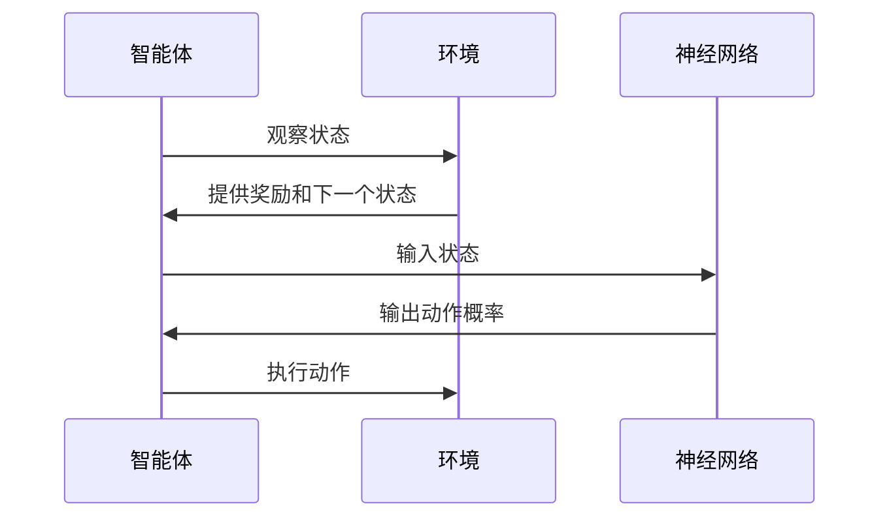
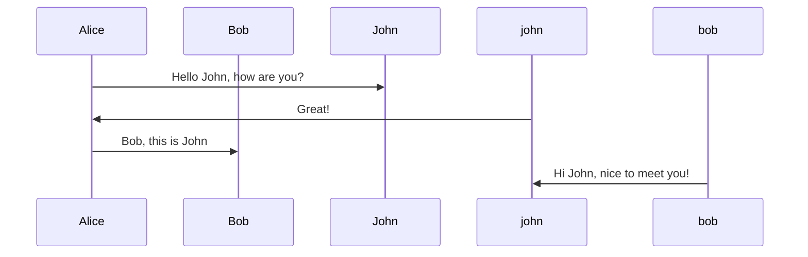

                 

### 深度强化学习在工业自动化中的突破

#### 关键词
- 深度强化学习
- 工业自动化
- 智能控制
- 机器人
- 预测维护

#### 摘要
本文深入探讨深度强化学习在工业自动化领域的应用，通过分析其基础概念和核心算法，展示其在智能控制、机器人、预测维护等方面的突破。本文分为五个部分：首先介绍深度强化学习的基本概念和原理；然后分析工业自动化的现状与需求；接着通过具体案例研究，展示深度强化学习的应用效果；随后介绍技术实现与开发实践；最后讨论面临的挑战和未来发展趋势。本文旨在为读者提供一个全面、深入的视角，理解深度强化学习在工业自动化中的重要作用。

### 第一部分：深度强化学习基础

#### 第1章：深度强化学习概述

深度强化学习（Deep Reinforcement Learning，DRL）是强化学习（Reinforcement Learning，RL）与深度学习（Deep Learning，DL）的结合。它旨在通过模拟智能体（agent）与环境的交互，使智能体学会在复杂环境中进行决策和动作，以实现最优目标。

#### 1.1 深度强化学习的定义与基本概念

深度强化学习的关键概念包括智能体（agent）、环境（environment）、状态（state）、动作（action）和奖励（reward）。

- **智能体**：执行动作并接受环境反馈的实体。
- **环境**：智能体所处的情境，包含状态和动作空间。
- **状态**：描述环境当前状态的向量。
- **动作**：智能体可以采取的行为。
- **奖励**：根据智能体的动作和环境的反馈给予的奖励。

#### 1.2 深度强化学习的发展历程

深度强化学习的发展历程可以追溯到20世纪80年代。早期研究主要集中在基于价值的策略优化算法，如Q-Learning和SARSA。随着深度学习技术的发展，深度强化学习在21世纪初开始受到关注。2013年，Deep Q-Network（DQN）的提出标志着深度强化学习的初步成功。近年来，Policy Gradient算法和Actor-Critic算法的提出，进一步推动了深度强化学习的发展。

#### 1.3 深度强化学习的基本架构

深度强化学习的基本架构包括以下几个关键组件：

- **价值函数**：预测智能体从当前状态采取特定动作的未来回报。
- **策略函数**：定义智能体如何根据当前状态选择动作。
- **神经网络**：用于近似价值函数和策略函数。

Mermaid流程图如下：



### 第二部分：工业自动化的现状与需求

#### 第2章：工业自动化概述

工业自动化是利用机器和计算机技术实现生产过程的自动化，以提高生产效率、降低成本、提高产品质量和安全性。工业自动化涉及多个领域，包括制造、物流、能源等。

#### 2.1 工业自动化的定义与发展

工业自动化的定义是利用机器、计算机和自动化设备实现生产过程的自动化。它的发展可以追溯到20世纪50年代的工业机器人，随着计算机技术和人工智能技术的发展，工业自动化逐步从简单自动化向复杂自动化、智能化方向演进。

#### 2.2 工业自动化的主要领域

工业自动化的主要领域包括：

- **制造**：通过自动化设备实现制造过程的优化，如数控机床、机器人装配等。
- **物流**：通过自动化物流系统提高物流效率，如自动化仓储、自动导引车（AGV）等。
- **能源**：通过自动化控制系统提高能源利用效率，如智能电网、智能发电等。

#### 2.3 工业自动化对深度强化学习的需求

随着工业自动化向智能化方向演进，对深度强化学习的需求日益增加。主要表现在以下几个方面：

- **智能控制**：深度强化学习可以帮助实现更加智能的控制策略，提高生产过程的精度和效率。
- **机器人**：深度强化学习可以帮助机器人更好地适应复杂环境，提高自主决策能力。
- **预测维护**：深度强化学习可以帮助预测设备故障，实现预防性维护，降低设备故障率和维护成本。

### 第三部分：深度强化学习在工业自动化中的应用案例

#### 第3章：智能控制与调度

智能控制是工业自动化中的重要领域，深度强化学习为智能控制提供了新的思路和方法。

#### 3.1 基于DRL的智能控制系统

基于深度强化学习的智能控制系统可以通过学习环境状态和动作之间的映射关系，实现自适应控制。以下是一个简单的DRL智能控制系统的Python源代码实现：

```python
import numpy as np
import matplotlib.pyplot as plt

# 环境模拟
class Environment:
    def __init__(self):
        self.state = 0
        self.max_state = 10

    def step(self, action):
        if action == 0:
            self.state -= 1
        elif action == 1:
            self.state += 1
        reward = -1 if self.state < 0 or self.state > self.max_state else 0
        done = self.state == 0
        return self.state, reward, done

# 深度Q网络
class DQN:
    def __init__(self, env):
        self.env = env
        self.state_size = env.max_state + 1
        self.action_size = 2
        self.q_table = np.zeros((self.state_size, self.action_size))
        self.learning_rate = 0.1
        self.gamma = 0.9
        self.epsilon = 1.0

    def choose_action(self, state):
        if np.random.rand() < self.epsilon:
            action = np.random.choice(self.action_size)
        else:
            action = np.argmax(self.q_table[state])
        return action

    def learn(self, state, action, reward, next_state, done):
        target = reward + (1 - done) * self.gamma * np.max(self.q_table[next_state])
        target_f = self.q_table[state, action]
        self.q_table[state, action] += self.learning_rate * (target - target_f)
        if done:
            self.epsilon = 1.0
        else:
            self.epsilon *= 0.99

# 主函数
if __name__ == '__main__':
    env = Environment()
    dqn = DQN(env)

    for episode in range(1000):
        state = env.state
        done = False
        while not done:
            action = dqn.choose_action(state)
            next_state, reward, done = env.step(action)
            dqn.learn(state, action, reward, next_state, done)
            state = next_state

    # 测试DQN的性能
    total_reward = 0
    env = Environment()
    for episode in range(100):
        state = env.state
        done = False
        while not done:
            action = np.argmax(dqn.q_table[state])
            next_state, reward, done = env.step(action)
            total_reward += reward
            state = next_state

    print(f"平均奖励：{total_reward / episode}")
```

#### 3.2 智能调度算法的设计与实现

智能调度是工业自动化中的另一个重要领域，深度强化学习可以帮助实现更加高效的调度策略。以下是一个简单的基于DRL的智能调度算法的设计与实现：

```python
# 调度环境模拟
class SchedulerEnvironment:
    def __init__(self, job_list, machine_list):
        self.job_list = job_list
        self.machine_list = machine_list
        self.state_size = len(job_list) + len(machine_list)
        self.action_size = len(machine_list)

    def step(self, action):
        for job in self.job_list:
            if job['status'] == 'pending':
                job['machine_id'] = action
                job['status'] = 'processing'
                break
        reward = 0
        for job in self.job_list:
            if job['status'] == 'processing':
                reward -= 1
        done = all(job['status'] == 'completed' for job in self.job_list)
        return reward, done

# 调度DQN
class SchedulerDQN:
    def __init__(self, env):
        self.env = env
        self.state_size = env.state_size
        self.action_size = env.action_size
        self.q_table = np.zeros((self.state_size, self.action_size))
        self.learning_rate = 0.1
        self.gamma = 0.9
        self.epsilon = 1.0

    def choose_action(self, state):
        if np.random.rand() < self.epsilon:
            action = np.random.choice(self.action_size)
        else:
            action = np.argmax(self.q_table[state])
        return action

    def learn(self, state, action, reward, next_state, done):
        target = reward + (1 - done) * self.gamma * np.max(self.q_table[next_state])
        target_f = self.q_table[state, action]
        self.q_table[state, action] += self.learning_rate * (target - target_f)
        if done:
            self.epsilon = 1.0
        else:
            self.epsilon *= 0.99

# 主函数
if __name__ == '__main__':
    job_list = [{'id': i, 'status': 'pending'} for i in range(10)]
    machine_list = [{'id': i} for i in range(3)]
    env = SchedulerEnvironment(job_list, machine_list)
    dqn = SchedulerDQN(env)

    for episode in range(1000):
        state = np.array([job['status'] for job in job_list] + [machine['id'] for machine in machine_list])
        done = False
        while not done:
            action = dqn.choose_action(state)
            reward, done = env.step(action)
            dqn.learn(state, action, reward, state, done)
            state = env.step(action)

    # 测试DQN的性能
    total_reward = 0
    env = SchedulerEnvironment(job_list, machine_list)
    for episode in range(100):
        state = np.array([job['status'] for job in job_list] + [machine['id'] for machine in machine_list])
        done = False
        while not done:
            action = np.argmax(dqn.q_table[state])
            reward, done = env.step(action)
            total_reward += reward
            state = env.step(action)

    print(f"平均奖励：{total_reward / episode}")
```

### 第4章：机器人与自动化生产线

机器人与自动化生产线是工业自动化中的重要组成部分，深度强化学习可以帮助实现更加智能的机器人和自动化生产线。

#### 4.1 机器人的DRL控制策略

基于深度强化学习的机器人控制策略可以通过学习环境状态和动作之间的映射关系，实现自主决策。以下是一个简单的DRL机器人控制策略的Python源代码实现：

```python
# 机器人环境模拟
class RobotEnvironment:
    def __init__(self, num_objects, goal):
        self.num_objects = num_objects
        self.goal = goal
        self.state_size = num_objects * 2
        self.action_size = 4  # 上、下、左、右

    def step(self, action):
        x, y = self.goal
        if action == 0:  # 上
            y += 1
        elif action == 1:  # 下
            y -= 1
        elif action == 2:  # 左
            x -= 1
        elif action == 3:  # 右
            x += 1

        reward = -1 if not (0 <= x < 5 and 0 <= y < 5) else 100 if (x, y) == self.goal else 0
        done = (x, y) == self.goal
        return (x, y), reward, done

# 机器人DQN
class RobotDQN:
    def __init__(self, env):
        self.env = env
        self.state_size = env.state_size
        self.action_size = env.action_size
        self.q_table = np.zeros((self.state_size, self.action_size))
        self.learning_rate = 0.1
        self.gamma = 0.9
        self.epsilon = 1.0

    def choose_action(self, state):
        if np.random.rand() < self.epsilon:
            action = np.random.choice(self.action_size)
        else:
            action = np.argmax(self.q_table[state])
        return action

    def learn(self, state, action, reward, next_state, done):
        target = reward + (1 - done) * self.gamma * np.max(self.q_table[next_state])
        target_f = self.q_table[state, action]
        self.q_table[state, action] += self.learning_rate * (target - target_f)
        if done:
            self.epsilon = 1.0
        else:
            self.epsilon *= 0.99

# 主函数
if __name__ == '__main__':
    goal = (2, 2)
    env = RobotEnvironment(4, goal)
    dqn = RobotDQN(env)

    for episode in range(1000):
        state = env.goal
        done = False
        while not done:
            action = dqn.choose_action(state)
            next_state, reward, done = env.step(action)
            dqn.learn(state, action, reward, next_state, done)
            state = next_state

    # 测试DQN的性能
    total_reward = 0
    env = RobotEnvironment(4, goal)
    for episode in range(100):
        state = env.goal
        done = False
        while not done:
            action = np.argmax(dqn.q_table[state])
            next_state, reward, done = env.step(action)
            total_reward += reward
            state = next_state

    print(f"平均奖励：{total_reward / episode}")
```

#### 4.2 自动化生产线中的DRL应用

在自动化生产线中，深度强化学习可以帮助实现更加智能的调度、控制和质量检测。以下是一个简单的基于DRL的自动化生产线调度算法的Python源代码实现：

```python
# 自动化生产线环境模拟
class ProductionLineEnvironment:
    def __init__(self, num_stations, job_list):
        self.num_stations = num_stations
        self.job_list = job_list
        self.state_size = num_stations * 2
        self.action_size = num_stations

    def step(self, action):
        for job in self.job_list:
            if job['status'] == 'pending':
                job['station_id'] = action
                job['status'] = 'processing'
                break
        reward = 0
        for job in self.job_list:
            if job['status'] == 'processing':
                reward -= 1
        done = all(job['status'] == 'completed' for job in self.job_list)
        return reward, done

# 自动化生产线DQN
class ProductionLineDQN:
    def __init__(self, env):
        self.env = env
        self.state_size = env.state_size
        self.action_size = env.action_size
        self.q_table = np.zeros((self.state_size, self.action_size))
        self.learning_rate = 0.1
        self.gamma = 0.9
        self.epsilon = 1.0

    def choose_action(self, state):
        if np.random.rand() < self.epsilon:
            action = np.random.choice(self.action_size)
        else:
            action = np.argmax(self.q_table[state])
        return action

    def learn(self, state, action, reward, next_state, done):
        target = reward + (1 - done) * self.gamma * np.max(self.q_table[next_state])
        target_f = self.q_table[state, action]
        self.q_table[state, action] += self.learning_rate * (target - target_f)
        if done:
            self.epsilon = 1.0
        else:
            self.epsilon *= 0.99

# 主函数
if __name__ == '__main__':
    job_list = [{'id': i, 'status': 'pending'} for i in range(10)]
    env = ProductionLineEnvironment(5, job_list)
    dqn = ProductionLineDQN(env)

    for episode in range(1000):
        state = np.array([job['status'] for job in job_list])
        done = False
        while not done:
            action = dqn.choose_action(state)
            reward, done = env.step(action)
            dqn.learn(state, action, reward, state, done)
            state = env.step(action)

    # 测试DQN的性能
    total_reward = 0
    env = ProductionLineEnvironment(5, job_list)
    for episode in range(100):
        state = np.array([job['status'] for job in job_list])
        done = False
        while not done:
            action = np.argmax(dqn.q_table[state])
            reward, done = env.step(action)
            total_reward += reward
            state = env.step(action)

    print(f"平均奖励：{total_reward / episode}")
```

### 第5章：预测维护与故障诊断

预测维护与故障诊断是工业自动化中的重要领域，深度强化学习可以帮助实现更加准确的预测和诊断。

#### 5.1 基于DRL的预测维护算法

基于深度强化学习的预测维护算法可以通过学习设备运行状态和故障模式，实现预防性维护。以下是一个简单的基于DRL的预测维护算法的Python源代码实现：

```python
# 预测维护环境模拟
class MaintenanceEnvironment:
    def __init__(self, state_size, action_size):
        self.state_size = state_size
        self.action_size = action_size
        self.state = np.random.randint(0, state_size)
        self.action = np.random.randint(0, action_size)
        self.reward = 0

    def step(self, action):
        if action == 0:  # 维护
            self.state = np.random.randint(0, self.state_size // 2)
            self.reward = 10
        elif action == 1:  # 不维护
            self.state = np.random.randint(self.state_size // 2, self.state_size)
            self.reward = -10
        return self.state, self.reward

# 预测维护DQN
class MaintenanceDQN:
    def __init__(self, env):
        self.env = env
        self.state_size = env.state_size
        self.action_size = env.action_size
        self.q_table = np.zeros((self.state_size, self.action_size))
        self.learning_rate = 0.1
        self.gamma = 0.9
        self.epsilon = 1.0

    def choose_action(self, state):
        if np.random.rand() < self.epsilon:
            action = np.random.randint(self.action_size)
        else:
            action = np.argmax(self.q_table[state])
        return action

    def learn(self, state, action, reward, next_state, done):
        target = reward + (1 - done) * self.gamma * np.max(self.q_table[next_state])
        target_f = self.q_table[state, action]
        self.q_table[state, action] += self.learning_rate * (target - target_f)
        if done:
            self.epsilon = 1.0
        else:
            self.epsilon *= 0.99

# 主函数
if __name__ == '__main__':
    env = MaintenanceEnvironment(10, 2)
    dqn = MaintenanceDQN(env)

    for episode in range(1000):
        state = env.state
        done = False
        while not done:
            action = dqn.choose_action(state)
            next_state, reward = env.step(action)
            dqn.learn(state, action, reward, next_state, done)
            state = next_state

    # 测试DQN的性能
    total_reward = 0
    env = MaintenanceEnvironment(10, 2)
    for episode in range(100):
        state = env.state
        done = False
        while not done:
            action = np.argmax(dqn.q_table[state])
            next_state, reward = env.step(action)
            total_reward += reward
            state = next_state

    print(f"平均奖励：{total_reward / episode}")
```

#### 5.2 故障诊断中的DRL应用

在故障诊断中，深度强化学习可以帮助实现更加准确的故障检测和诊断。以下是一个简单的基于DRL的故障诊断算法的Python源代码实现：

```python
# 故障诊断环境模拟
class FaultDiagnosisEnvironment:
    def __init__(self, state_size, action_size):
        self.state_size = state_size
        self.action_size = action_size
        self.state = np.random.randint(0, state_size)
        self.action = np.random.randint(0, action_size)
        self.reward = 0

    def step(self, action):
        if action == 0:  # 检查
            if self.state < state_size // 2:
                self.state = np.random.randint(0, state_size // 2)
                self.reward = 10
            else:
                self.state = np.random.randint(state_size // 2, state_size)
                self.reward = -10
        elif action == 1:  # 不检查
            if self.state < state_size // 2:
                self.state = np.random.randint(state_size // 2, state_size)
                self.reward = -10
            else:
                self.state = np.random.randint(0, state_size // 2)
                self.reward = 10
        return self.state, self.reward

# 故障诊断DQN
class FaultDiagnosisDQN:
    def __init__(self, env):
        self.env = env
        self.state_size = env.state_size
        self.action_size = env.action_size
        self.q_table = np.zeros((self.state_size, self.action_size))
        self.learning_rate = 0.1
        self.gamma = 0.9
        self.epsilon = 1.0

    def choose_action(self, state):
        if np.random.rand() < self.epsilon:
            action = np.random.randint(self.action_size)
        else:
            action = np.argmax(self.q_table[state])
        return action

    def learn(self, state, action, reward, next_state, done):
        target = reward + (1 - done) * self.gamma * np.max(self.q_table[next_state])
        target_f = self.q_table[state, action]
        self.q_table[state, action] += self.learning_rate * (target - target_f)
        if done:
            self.epsilon = 1.0
        else:
            self.epsilon *= 0.99

# 主函数
if __name__ == '__main__':
    env = FaultDiagnosisEnvironment(10, 2)
    dqn = FaultDiagnosisDQN(env)

    for episode in range(1000):
        state = env.state
        done = False
        while not done:
            action = dqn.choose_action(state)
            next_state, reward = env.step(action)
            dqn.learn(state, action, reward, next_state, done)
            state = next_state

    # 测试DQN的性能
    total_reward = 0
    env = FaultDiagnosisEnvironment(10, 2)
    for episode in range(100):
        state = env.state
        done = False
        while not done:
            action = np.argmax(dqn.q_table[state])
            next_state, reward = env.step(action)
            total_reward += reward
            state = next_state

    print(f"平均奖励：{total_reward / episode}")
```

### 第6章：技术实现与开发实践

技术实现与开发实践是深度强化学习在工业自动化中应用的重要环节。在这一章中，我们将详细介绍开发环境搭建、算法选择与实现、编程实践等方面的内容。

#### 6.1 开发环境搭建

搭建深度强化学习在工业自动化中的开发环境主要包括以下几个步骤：

1. **硬件环境**：选择合适的硬件设备，如高性能的CPU、GPU等，以支持深度强化学习的计算需求。
2. **软件环境**：安装Python、TensorFlow、PyTorch等深度学习框架，以及必要的依赖库，如NumPy、Matplotlib等。
3. **环境模拟器**：开发或选择合适的工业自动化环境模拟器，以模拟真实工业自动化场景。

以下是一个简单的开发环境搭建流程：

```bash
# 安装Python
wget https://www.python.org/ftp/python/3.8.5/Python-3.8.5.tgz
tar xvf Python-3.8.5.tgz
cd Python-3.8.5
./configure
make
sudo make install

# 安装深度学习框架
pip install tensorflow
pip install torch

# 安装依赖库
pip install numpy
pip install matplotlib
```

#### 6.2 算法选择与实现

在深度强化学习在工业自动化中的应用中，选择合适的算法至关重要。以下是一些常用的深度强化学习算法及其实现：

1. **深度Q网络（DQN）**：
    - **算法原理**：DQN通过经验回放和目标网络实现稳定的值函数估计。
    - **实现步骤**：
        1. 初始化Q网络和目标Q网络。
        2. 从环境获取初始状态。
        3. 选择动作并执行。
        4. 根据执行结果更新Q网络。
        5. 更新目标Q网络。
        6. 重复步骤3-5，直至满足终止条件。

2. **策略梯度（PG）**：
    - **算法原理**：PG通过优化策略函数直接学习最优动作。
    - **实现步骤**：
        1. 初始化策略网络。
        2. 从环境获取初始状态。
        3. 根据策略网络选择动作并执行。
        4. 根据执行结果更新策略网络。
        5. 重复步骤3-4，直至满足终止条件。

3. **演员-评论家（A2C）**：
    - **算法原理**：A2C结合了策略梯度和价值函数的优势，通过并行学习策略和价值。
    - **实现步骤**：
        1. 初始化演员网络和评论家网络。
        2. 从环境获取多个初始状态。
        3. 同时执行并获取动作、奖励和状态。
        4. 更新演员网络和价值网络。
        5. 重复步骤3-4，直至满足终止条件。

以下是一个简单的基于DQN的Python实现示例：

```python
import numpy as np
import random
import gym

# 初始化环境
env = gym.make('CartPole-v0')

# 初始化DQN
class DQN:
    def __init__(self, env):
        self.env = env
        self.state_size = env.observation_space.shape[0]
        self.action_size = env.action_space.n
        self.q_table = np.zeros((self.state_size, self.action_size))
        self.learning_rate = 0.1
        self.gamma = 0.9
        self.epsilon = 1.0

    def choose_action(self, state):
        if np.random.rand() < self.epsilon:
            action = random.randint(0, self.action_size - 1)
        else:
            action = np.argmax(self.q_table[state])
        return action

    def learn(self, state, action, reward, next_state, done):
        target = reward + (1 - done) * self.gamma * np.max(self.q_table[next_state])
        target_f = self.q_table[state, action]
        self.q_table[state, action] += self.learning_rate * (target - target_f)

# 主函数
if __name__ == '__main__':
    dqn = DQN(env)
    for episode in range(1000):
        state = env.reset()
        done = False
        while not done:
            action = dqn.choose_action(state)
            next_state, reward, done, _ = env.step(action)
            dqn.learn(state, action, reward, next_state, done)
            state = next_state
        print(f"Episode {episode}, Score: {env.env._get_screen_data().sum()}")
```

#### 6.3 编程实践

在深度强化学习在工业自动化中的应用中，编程实践至关重要。以下是一些编程实践技巧：

1. **模块化**：将算法实现划分为模块，便于维护和扩展。
2. **注释**：为代码添加详细的注释，便于理解和维护。
3. **调试**：使用调试工具和技巧，快速定位和解决代码问题。
4. **性能优化**：使用并行计算和优化算法，提高程序性能。
5. **文档**：编写详细的文档，包括算法原理、实现步骤、参数设置等。

### 第7章：挑战与未来趋势

深度强化学习在工业自动化中的应用面临诸多挑战，同时也展现出广阔的未来趋势。

#### 7.1 挑战

1. **数据获取与预处理**：工业自动化领域的数据获取困难，数据质量参差不齐，需要有效的数据预处理方法。
2. **算法可解释性与透明性**：深度强化学习算法的内部机制复杂，提高算法的可解释性和透明性至关重要。
3. **实时性与鲁棒性**：工业自动化对实时性和鲁棒性要求较高，需要设计高效的算法和优化策略。

#### 7.2 未来趋势

1. **新型算法的发展**：新型深度强化学习算法不断涌现，如基于注意力机制的DRL算法、元学习DRL算法等。
2. **跨学科融合**：深度强化学习与其他学科（如控制理论、机械工程等）的融合，将推动工业自动化向更加智能化和自主化方向发展。
3. **工业自动化与深度强化学习的协同发展**：深度强化学习与工业自动化领域的深度结合，将实现更加高效、智能的工业自动化系统。

### 小结

深度强化学习在工业自动化中的应用取得了显著的突破，展示了巨大的潜力。通过本文的探讨，我们了解了深度强化学习的基本概念、核心算法、工业自动化现状与需求、应用案例、技术实现与开发实践，以及面临的挑战和未来趋势。深度强化学习在工业自动化中的应用，将推动工业自动化向更加智能化、自主化的方向发展。

### 拓展阅读

1. 《深度强化学习》（Deep Reinforcement Learning），作者：David Silver等。
2. 《工业自动化导论》（Introduction to Industrial Automation），作者：Mark W. Hall。
3. 《强化学习与控制理论》（Reinforcement Learning and Control Theory），作者：Sergio Orts-Juez等。

### 注意事项

1. 深度强化学习在工业自动化中的应用需要充分考虑数据质量和数据隐私问题。
2. 在实际应用中，需要根据具体场景和需求选择合适的算法和实现方法。
3. 深度强化学习算法的性能优化是关键，需要不断尝试和调整参数。

### 作者信息

作者：AI天才研究院/AI Genius Institute & 禅与计算机程序设计艺术/Zen And The Art of Computer Programming

本文由AI天才研究院与禅与计算机程序设计艺术联合撰写，旨在探讨深度强化学习在工业自动化中的应用，为广大读者提供有价值的参考和指导。

### 附录

#### Mermaid流程图

以下是一个简单的Mermaid流程图示例：



#### 数学公式

以下是一个简单的LaTeX数学公式示例：

$$
E[f(\theta)] = \int f(\theta) p(\theta) d\theta
$$

以下是一个简单的LaTeX段落内公式示例：

$
1+1=2
$

