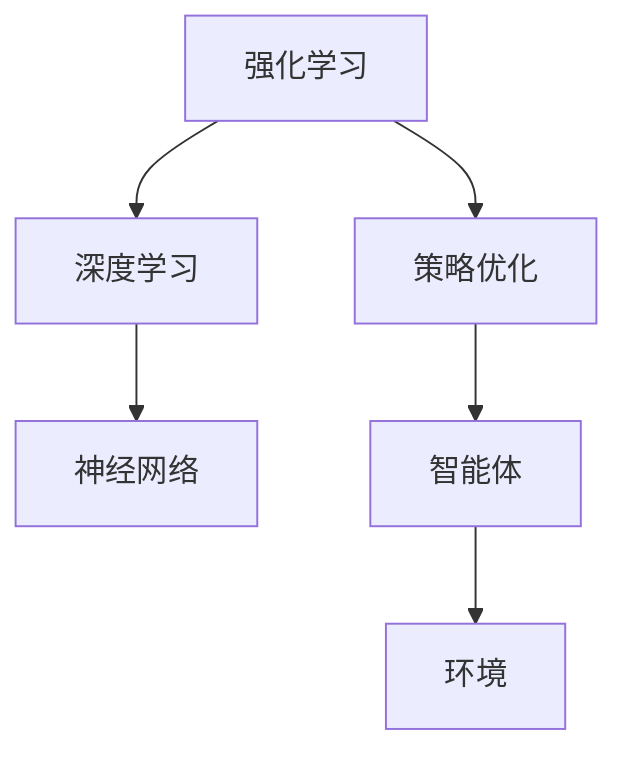

                 

### 关键词

- 深度强化学习
- 评测环境设计
- 强化学习算法
- DQN算法
- DDPG算法
- 机器人评测环境
- 游戏评测环境
- 策略梯度方法

### 摘要

本文旨在探讨深度强化学习在评测环境设计中的应用，通过对深度强化学习基础、评测环境设计原则以及强化学习算法在评测环境中的应用的详细分析，为读者呈现一个系统而全面的视角。文章首先介绍了深度强化学习的基本概念和主要算法，然后深入探讨了评测环境设计的基本原则和挑战，并展示了深度强化学习在评测环境中的应用案例，包括游戏评测环境和机器人评测环境。通过本文的阅读，读者将对深度强化学习在评测环境设计中的潜力有更深刻的理解，并为实际应用提供指导。文章结构清晰，内容丰富，适合对人工智能和评测环境设计感兴趣的读者。

---

# 深度强化学习在评测环境设计中的应用

## 引言

在现代人工智能领域，深度强化学习（Deep Reinforcement Learning, DRL）作为一种新兴的机器学习技术，因其高效性和灵活性受到了广泛的关注。强化学习通过智能体与环境的交互，不断学习并优化策略，以实现特定目标。而评测环境设计作为人工智能系统测试和评估的重要环节，直接影响着系统的性能和可靠性。本文将探讨深度强化学习在评测环境设计中的应用，旨在揭示其如何提升评测环境的有效性和智能性。

### 背景介绍

评测环境设计在人工智能研究中扮演着至关重要的角色。一个良好的评测环境不仅能准确地评估算法的性能，还能为算法的改进提供有价值的反馈。传统的评测环境设计往往依赖于预定义的规则和指标，缺乏自适应性和灵活性。随着深度强化学习的兴起，利用其自适应能力和学习优势来设计评测环境成为了一个新的研究方向。

### 核心概念与联系

深度强化学习涉及多个核心概念，包括强化学习、深度学习和策略优化等。强化学习通过奖励信号引导智能体学习最优策略；深度学习则通过神经网络建模复杂环境；策略优化则致力于寻找最大化奖励的策略。这三种技术的结合使得深度强化学习能够处理高度复杂的问题，如图游戏和机器人导航。以下是这些核心概念之间的关系架构，使用Mermaid流程图表示：



图1：深度强化学习的核心概念及其关系

### 强化学习算法

深度强化学习依赖于多种强化学习算法，其中一些算法因其独特的性能和适用性在评测环境设计中具有重要地位。以下是几种常见的强化学习算法及其基本原理：

#### 策略梯度方法

策略梯度方法是一类直接优化策略的算法，包括Q-Learning和SARSA。Q-Learning通过学习状态-动作值函数来选择最优动作，而SARSA则通过更新当前状态-动作值来改进策略。

##### Q-Learning算法

```python
def QLearning(states, actions, rewards, alpha, gamma):
    for state in states:
        Q_values = []
        for action in actions:
            Q_values.append(reward * (1 - done) + gamma * max(Q_values))
        new_Q_value = alpha * (reward + gamma * max(Q_values))
        return new_Q_value
```

##### SARSA算法

```python
def SARSA(states, actions, rewards, alpha, gamma):
    new_state, new_action = states, actions
    for state in states:
        new_Q_value = reward + gamma * Q_values[new_action]
        Q_values[state] = Q_values[state] + alpha * (new_Q_value - Q_values[state])
    return new_Q_value
```

#### 深度确定性策略梯度（DDPG）

DDPG是一种基于深度学习的策略优化算法，通过两个神经网络（评价网络和价值网络）来估计状态-动作值函数，并优化策略。

```python
def DDPG(state, action, reward, next_state, done, alpha, gamma):
    # Update value network
    target_value = reward + (1 - done) * target_value(next_state)
    value_loss = loss_function(value_network(state), target_value)
    optimizer.minimize(value_loss)

    # Update policy network
    action_loss = loss_function(policy_network(state), action)
    optimizer.minimize(action_loss)
```

#### 深度强化学习中的重要性采样

重要性采样是一种用于增强学习的方法，通过调整样本权重来改善学习效果。在深度强化学习中，重要性采样可以用于处理不稳定的奖励分布。

```python
def ImportanceSampling(states, actions, rewards, alpha, gamma):
    weights = 1 / (1 - gamma) * (1 / rewards)
    for state in states:
        new_Q_value = alpha * sum(weights[i] * rewards[i] * (1 - done[i]))
        return new_Q_value
```

### 评测环境设计的基本原则

评测环境设计应遵循以下基本原则：

- **适应性**：评测环境应能够适应不同类型和规模的测试任务。
- **可扩展性**：评测环境设计应易于扩展，以适应未来可能出现的新需求。
- **可复现性**：评测环境应确保测试结果的复现性，以便其他研究者验证和比较。
- **公平性**：评测环境应对所有参与测试的算法公平，不偏袒任何一方。

### 评测环境设计中的挑战

在设计评测环境时，会遇到以下挑战：

- **动态性**：现实环境是动态变化的，如何设计一个能够应对动态变化的环境是一个挑战。
- **不确定性**：现实环境中的不确定性因素增加了设计的复杂性。
- **计算资源**：高精度的评测环境设计往往需要大量的计算资源。

### 深度强化学习与评测环境设计的结合

深度强化学习与评测环境设计的结合具有以下优势：

- **自适应策略**：深度强化学习能够自动调整策略，以适应不同测试场景。
- **高效探索**：通过强化学习算法，评测环境可以在探索中高效地获取信息。
- **多样化测试**：深度强化学习可以帮助评测环境设计实现多样化的测试场景。

### 强化学习算法在评测环境中的应用案例

#### 游戏评测环境

在游戏评测环境中，深度强化学习可以用于训练智能体在游戏中的行为。以下是一个基于深度Q网络的（DQN）游戏评测环境的应用案例：

```python
def DQNGameEvaluation(game_env, state_size, action_size, epsilon, alpha, gamma):
    # 初始化Q网络
    Q_network = NeuralNetwork(state_size, action_size)
    # 训练Q网络
    for episode in range(epochs):
        state = game_env.reset()
        done = False
        while not done:
            action = Q_network.choose_action(state, epsilon)
            next_state, reward, done = game_env.step(action)
            Q_network.learn(state, action, reward, next_state, done, alpha, gamma)
            state = next_state
    return Q_network
```

#### 机器人评测环境

在机器人评测环境中，深度强化学习可以用于训练机器人执行复杂的任务，如路径规划和避障。以下是一个基于深度确定性策略梯度（DDPG）的机器人评测环境的应用案例：

```python
def DDPGRobotEvaluation(robot_env, state_size, action_size, alpha, beta, gamma):
    # 初始化评价网络和价值网络
    critic_network = NeuralNetwork(state_size + action_size, 1)
    actor_network = NeuralNetwork(state_size, action_size)
    # 训练评价网络和价值网络
    for episode in range(epochs):
        state = robot_env.reset()
        done = False
        while not done:
            action = actor_network.choose_action(state)
            next_state, reward, done = robot_env.step(action)
            critic_network.learn(state, action, reward, next_state, done, gamma)
            actor_network.learn(state, action, reward, next_state, done, beta, gamma)
            state = next_state
    return critic_network, actor_network
```

### 总结与展望

本文详细探讨了深度强化学习在评测环境设计中的应用，包括基础概念、算法原理、设计原则和实际应用案例。深度强化学习为评测环境设计提供了新的视角和方法，通过自适应策略和高效探索，能够显著提升评测环境的有效性和智能性。未来，随着深度强化学习技术的不断进步，其在评测环境设计中的应用前景将更加广阔。然而，如何解决动态性、不确定性和计算资源等问题，仍需进一步的研究和探索。

### 最佳实践 tips

- **小批量训练**：在资源有限的情况下，采用小批量训练可以减少计算资源的消耗。
- **分阶段评估**：将评测过程分为多个阶段，逐步提高难度，有助于评估算法在不同情境下的表现。
- **多样化测试**：设计多种类型的测试场景，以全面评估算法的适应性和鲁棒性。

### 注意事项

- **环境设计**：确保评测环境设计具有一致性和可复现性。
- **参数调整**：合理调整强化学习算法的参数，以获得最佳性能。

### 拓展阅读

- 《深度强化学习》（Deep Reinforcement Learning）—— David Silver等
- 《人工智能：一种现代方法》（Artificial Intelligence: A Modern Approach）—— Stuart Russell等
- 《强化学习手册》（Reinforcement Learning: An Introduction）—— Richard S. Sutton等

### 作者信息

- 作者：AI天才研究院/AI Genius Institute & 禅与计算机程序设计艺术 /Zen And The Art of Computer Programming

本文旨在提供一个关于深度强化学习在评测环境设计中的应用的全面分析，通过详细的算法解释、数学模型和实际案例，为读者提供了一个深入理解这一领域的窗口。希望本文能对人工智能研究和实践者有所启发。

