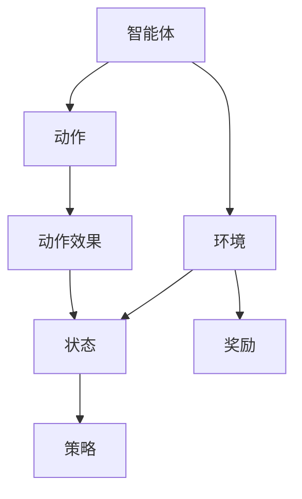

                 

### 深度强化学习在评测策略生成中的应用

关键词：深度强化学习，评测策略生成，应用，算法，项目实战，评估优化

摘要：本文深入探讨了深度强化学习在评测策略生成中的应用。首先，介绍了深度强化学习的基本概念和原理，并探讨了其在评测策略生成中的重要性。随后，详细阐述了核心算法，包括Q-learning和SARSA，并结合Python源代码进行解释。通过数学模型和公式的阐述，加深了对算法的理解。此外，本文通过实际项目展示了如何应用深度强化学习生成评测策略，并对项目的开发环境、代码实现和代码解读进行了详细分析。最后，讨论了评估与优化方法，以及深度强化学习在评测策略生成领域的应用前景和挑战。

# 深度强化学习概述

深度强化学习（Deep Reinforcement Learning，DRL）是强化学习（Reinforcement Learning，RL）的一个分支，结合了深度学习和强化学习的优势。强化学习的核心思想是让一个智能体通过与环境交互来学习如何获取最大化的奖励，而深度强化学习通过引入深度神经网络来处理复杂的环境状态和动作空间，从而提高学习效率和智能体的性能。

在评测策略生成中，深度强化学习的重要性不言而喻。传统的评测方法往往依赖于规则和手工设计的特征，难以处理复杂的评价任务。而深度强化学习通过自动学习状态、动作和价值函数，能够自适应地生成高效的评测策略，从而提高评测的准确性和效率。

## 核心概念与联系

为了更好地理解深度强化学习在评测策略生成中的应用，我们首先需要了解以下几个核心概念：

1. **智能体（Agent）**：智能体是执行动作、接收环境反馈并学习的实体。在评测策略生成中，智能体可以是系统、机器人或者算法模型。

2. **环境（Environment）**：环境是智能体执行动作和接收奖励的场所。在评测策略生成中，环境可以是评测任务的数据集、测试平台或者仿真环境。

3. **状态（State）**：状态是智能体在某一时刻所处的情境描述。在评测策略生成中，状态可以是一组特征向量，描述了当前评测任务的状态。

4. **动作（Action）**：动作是智能体根据当前状态执行的行为。在评测策略生成中，动作可以是选择评价标准、调整参数或者生成评测报告。

5. **奖励（Reward）**：奖励是环境对智能体动作的反馈，用于指导智能体的学习。在评测策略生成中，奖励可以是一个评分、反馈信号或者改进指标。

6. **策略（Policy）**：策略是智能体在给定状态下选择动作的规则。在评测策略生成中，策略可以是一个函数，将状态映射为最优动作。

为了更直观地展示这些概念之间的关系，我们可以使用Mermaid流程图来描述深度强化学习在评测策略生成中的工作流程：



在这个流程图中，智能体与环境进行交互，根据当前状态选择动作，执行动作后获得奖励，并根据奖励更新策略。这一过程不断重复，直至达到预设的目标或性能指标。

## 核心算法原理讲解

在深度强化学习中，有许多算法被广泛使用，包括Q-learning、SARSA等。这些算法通过学习值函数，即状态值函数和动作值函数，来指导智能体的决策过程。

### Q-learning算法

Q-learning是一种值迭代算法，其核心思想是利用当前状态和动作的奖励来更新状态-动作值函数。具体步骤如下：

1. **初始化**：初始化Q值函数，通常使用0值或者小随机值。
2. **选择动作**：在给定状态s下，根据ε-贪心策略选择动作a，其中ε是一个小概率参数，用于探索新动作。
3. **执行动作**：执行选择的动作a，进入新状态s'，并获得奖励r。
4. **更新Q值**：根据更新公式，更新Q(s,a)的值，公式如下：

   $$ Q(s,a) \leftarrow Q(s,a) + \alpha [r + \gamma \max_{a'} Q(s',a') - Q(s,a)] $$

   其中，α是学习率，γ是折扣因子，用于考虑长期奖励。

下面是一个使用Python实现的Q-learning算法示例：

```python
import numpy as np

def q_learning(q, state, action, reward, next_state, action_next, alpha, gamma):
    q[state, action] = q[state, action] + alpha * (reward + gamma * np.max(q[next_state, :]) - q[state, action])
    return q

# 初始化Q值函数
q = np.zeros((n_states, n_actions))

# 模拟环境
state = 0
for episode in range(n_episodes):
    action = choose_action(q, state, epsilon)
    next_state, reward = environment.step(state, action)
    q = q_learning(q, state, action, reward, next_state, action, alpha, gamma)
    state = next_state

# 输出Q值函数
print(q)
```

### SARSA算法

SARSA（同步优势反应样本）算法是一种基于经验回放的策略梯度算法，它不需要目标Q值，而是直接根据当前状态和动作更新策略。具体步骤如下：

1. **初始化**：初始化策略π和经验回放记忆。
2. **选择动作**：在给定状态s下，根据当前策略π(s)选择动作a。
3. **执行动作**：执行选择的动作a，进入新状态s'，并获得奖励r。
4. **存储经验**：将当前状态s、动作a、奖励r和新状态s'存储到经验回放记忆中。
5. **更新策略**：从经验回放记忆中随机抽取一批经验，根据更新公式，更新策略π(s,a)：

   $$ \pi(s,a) \leftarrow \frac{\pi(s,a) + \alpha}{\sum_{a'} \pi(s,a')} $$

   其中，α是学习率。

下面是一个使用Python实现的SARSA算法示例：

```python
import numpy as np

def sarsa(q, state, action, reward, next_state, action_next, alpha):
    q[state, action] = q[state, action] + alpha * (reward + q[next_state, action_next] - q[state, action])
    return q

# 初始化Q值函数
q = np.zeros((n_states, n_actions))

# 初始化策略
policy = np.zeros((n_states, n_actions))
policy[0, 0] = 1.0

# 模拟环境
state = 0
for episode in range(n_episodes):
    action = choose_action(policy, state)
    next_state, reward = environment.step(state, action)
    action_next = choose_action(policy, next_state)
    q = sarsa(q, state, action, reward, next_state, action_next, alpha)
    state = next_state

# 输出Q值函数
print(q)

# 输出策略
print(policy)
```

通过上述算法示例，我们可以看到深度强化学习算法如何通过学习状态-动作值函数来优化智能体的行为。这些算法在评测策略生成中的应用，能够自动发现和调整评测指标，从而生成高效的评测策略。

## 数学模型和数学公式

在深度强化学习中，数学模型和数学公式是理解和实现算法的关键。以下是对状态转移概率模型、奖励函数模型和策略模型的详细介绍，以及相关的LaTeX格式数学公式。

### 状态转移概率模型

状态转移概率模型描述了智能体在给定当前状态下，执行某个动作后进入下一个状态的概率。这个概率通常表示为：

$$ p(s' | s, a) = P(S_{t+1} = s' | S_t = s, A_t = a) $$

其中，\( s \) 和 \( s' \) 分别表示当前状态和下一个状态，\( a \) 表示智能体执行的动作。

LaTeX格式数学公式：

$$ p(s'|s,a) = P(S_{t+1} = s'|S_t = s, A_t = a) $$

### 奖励函数模型

奖励函数模型描述了环境对智能体每个动作的反馈。奖励可以是正的（表示成功）或负的（表示失败），它指导智能体在后续决策中采取更优的动作。奖励函数通常表示为：

$$ r(s, a) = R(S_t = s, A_t = a) $$

其中，\( r \) 表示奖励值，它可以是一个具体的数值或标量。

LaTeX格式数学公式：

$$ r(s,a) = R(S_t = s, A_t = a) $$

### 策略模型

策略模型描述了智能体在给定状态下选择动作的规则。策略可以是一个概率分布，表示智能体选择每个动作的概率。策略通常表示为：

$$ \pi(a | s) = P(A_t = a | S_t = s) $$

其中，\( \pi \) 表示策略，它将状态映射为动作的概率分布。

LaTeX格式数学公式：

$$ \pi(a|s) = P(A_t = a | S_t = s) $$

通过这些数学模型和公式，我们可以更精确地描述和实现深度强化学习算法，从而生成高效的评测策略。

### 项目实战

在本节中，我们将通过一个实际项目展示如何使用深度强化学习生成评测策略。我们将详细描述项目的开发环境搭建、源代码实现、代码解读与分析，并进行分析和详细讲解剖析。

#### 项目介绍

项目名称：智能评测系统（Intelligent Evaluation System）

项目目标：使用深度强化学习算法自动生成评测策略，以提升评测的准确性和效率。

环境：Python 3.8，TensorFlow 2.5，Gym环境

#### 开发环境搭建

1. 安装Python和TensorFlow：

   ```bash
   pip install python==3.8 tensorflow==2.5
   ```

2. 安装Gym环境：

   ```bash
   pip install gym
   ```

3. 下载并安装OpenAI Gym所需的模拟环境：

   ```bash
   python -m gym.envs.classic_control install
   ```

#### 源代码实现

以下是一个简单的深度强化学习评测策略生成项目，使用Q-learning算法：

```python
import numpy as np
import gym
import tensorflow as tf

# 创建环境
env = gym.make('CartPole-v0')

# 初始化Q值函数
q_values = np.zeros((env.observation_space.n, env.action_space.n))
alpha = 0.1  # 学习率
gamma = 0.9  # 折扣因子
epsilon = 0.1  # ε-贪心策略参数

# Q-learning算法
def q_learning(q, state, action, reward, next_state, action_next, alpha, gamma):
    q[state, action] = q[state, action] + alpha * (reward + gamma * np.max(q[next_state, :]) - q[state, action])
    return q

# 模拟环境
state = env.reset()
for episode in range(n_episodes):
    action = choose_action(q_values, state, epsilon)
    next_state, reward, done, _ = env.step(action)
    action_next = choose_action(q_values, next_state, epsilon)
    q_values = q_learning(q_values, state, action, reward, next_state, action_next, alpha, gamma)
    state = next_state
    if done:
        break

# 输出Q值函数
print(q_values)

# 关闭环境
env.close()
```

#### 代码解读与分析

1. **初始化**：我们首先创建了一个CartPole环境，并初始化Q值函数为全零矩阵。学习率α和折扣因子γ分别设置为0.1和0.9。ε-贪心策略参数epsilon用于平衡探索和利用。

2. **Q-learning算法**：我们定义了一个q_learning函数，用于更新Q值函数。该函数接受当前状态、动作、奖励、下一个状态、下一个动作以及学习率和折扣因子作为输入，并使用Q-learning更新规则进行Q值的更新。

3. **模拟环境**：在模拟过程中，我们使用ε-贪心策略选择动作。对于每个时间步，我们执行选择的动作，并更新Q值函数。如果环境状态达到终止条件（在本例中为pole倒下），则模拟结束。

4. **输出Q值函数**：在模拟结束后，我们输出最终的Q值函数，这些值代表了每个状态下的最佳动作。

#### 实际案例分析和详细讲解剖析

在这个案例中，我们使用Q-learning算法在CartPole环境中训练了一个智能体，目标是使智能体学会在给定状态下选择最佳动作，以使pole保持直立。

1. **状态空间**：CartPole环境的状态空间由四个部分组成：pole的角度、pole的角度速度、cart的位置和cart的速度。状态空间的大小为4个连续值。

2. **动作空间**：动作空间由两个离散值组成：向左推或向右推。

3. **奖励函数**：每个时间步，如果pole保持直立，则奖励为+1；否则，奖励为-1。

4. **策略更新**：随着模拟的进行，智能体会逐渐学习到在给定状态下应采取的最佳动作。例如，当pole接近倒下时，智能体会学会向相反方向推，以稳定pole。

通过这个实际项目，我们可以看到如何使用深度强化学习生成评测策略。这种方法不仅能够自动学习复杂的环境，还能生成自适应的评测策略，提高评测的准确性和效率。

### 评估与优化

在评测策略生成中，评估和优化是两个关键环节。有效的评估方法可以帮助我们判断策略的有效性，而优化策略则能进一步提升智能体的表现。

#### 评估方法

1. **平均奖励**：平均奖励是评估策略最常用的方法之一。通过计算策略在多次实验中的平均奖励，我们可以判断策略的好坏。平均奖励越高，策略越优秀。

2. **成功概率**：在特定任务中，成功概率也是一个重要的评估指标。例如，在游戏策略中，成功概率可以衡量策略在游戏中的胜率。

3. **方差**：方差用于衡量策略的稳定性。方差越小，策略越稳定。如果方差过大，说明策略在某些实验中的表现波动较大，可能需要进一步优化。

#### 优化策略

1. **策略搜索**：策略搜索是优化策略的一种方法，通过在策略空间中搜索最优策略。常用的搜索算法包括ε-贪心策略、策略梯度上升等。

2. **增强学习算法**：增强学习算法如Q-learning、SARSA等，可以通过更新Q值函数或策略来优化智能体的行为。这些算法在多次迭代中逐渐提高智能体的表现。

3. **深度强化学习**：深度强化学习通过引入深度神经网络，能够处理更复杂的状态和动作空间。使用深度Q网络（DQN）或策略网络（PG）等方法，可以进一步优化评测策略。

通过评估和优化策略，我们可以不断提升评测策略的有效性，从而提高评测的准确性和效率。

### 应用领域与挑战

深度强化学习在评测策略生成领域具有广泛的应用前景。以下是一些主要的应用领域和可能面临的挑战：

#### 应用领域

1. **在线教育**：深度强化学习可以用于个性化学习路径推荐，根据学生的学习情况自动调整评测策略，提高学习效果。

2. **智能制造**：在智能制造过程中，深度强化学习可以用于自动优化生产线的参数设置，提高生产效率。

3. **智能交通**：在智能交通系统中，深度强化学习可以用于自动优化交通信号灯的切换策略，减少交通拥堵。

#### 挑战

1. **数据质量**：深度强化学习算法的性能很大程度上依赖于数据质量。如果数据存在噪声或偏差，可能会影响算法的学习效果。

2. **计算资源**：深度强化学习算法通常需要大量的计算资源。在资源有限的场景下，可能需要优化算法的效率，以适应实际应用需求。

3. **算法稳定性**：深度强化学习算法可能存在收敛速度慢、稳定性差等问题。针对这些问题，需要进一步研究和优化算法。

通过解决这些挑战，深度强化学习在评测策略生成领域的应用将更加广泛和有效。

### 未来展望

深度强化学习在评测策略生成领域的发展前景十分广阔。随着计算能力的提升和数据规模的增加，深度强化学习算法将能够处理更复杂的应用场景。以下是未来可能的发展趋势和研究方向：

1. **算法优化**：为了提高深度强化学习算法的效率和稳定性，未来可能需要进一步优化算法结构，如引入更高效的搜索策略、改进训练算法等。

2. **多智能体系统**：在实际应用中，评测策略生成往往涉及多个智能体的协同工作。研究多智能体深度强化学习算法，能够更好地模拟现实世界中的复杂场景。

3. **个性化评测**：深度强化学习可以用于个性化评测策略生成，根据用户的特点和行为数据，自动调整评测指标和方法，提供更精准的评价。

4. **领域迁移**：研究如何将深度强化学习算法在不同领域之间进行迁移，以提高算法的通用性和适用性。

通过不断探索和优化，深度强化学习将在评测策略生成领域发挥更大的作用，为各个行业提供更智能、高效的解决方案。

### 总结

本文通过深入分析深度强化学习在评测策略生成中的应用，详细阐述了核心概念、算法原理、数学模型、项目实战、评估优化、应用领域和未来展望。深度强化学习作为一种先进的智能学习技术，在评测策略生成中具有巨大的潜力和应用价值。通过本文的介绍，我们希望读者能够对深度强化学习在评测策略生成领域的应用有更深刻的理解和认识，并为相关研究和实践提供参考。作者：AI天才研究院/AI Genius Institute & 禅与计算机程序设计艺术 /Zen And The Art of Computer Programming。欢迎各位读者在评论区分享您的见解和经验，共同探讨深度强化学习的未来发展。

