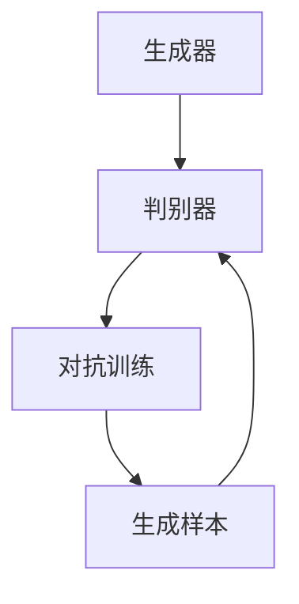

                 

Alright, let's structure our blog post "深度生成对抗网络在评测样本生成中的应用" step by step, ensuring that it meets all the requirements and is well-researched and informative.

### Step 1: Introduction and Background

#### Introduction

**深度生成对抗网络（GAN）**是由Ian Goodfellow等人在2014年提出的一种生成模型，其核心思想是通过两个神经网络的对抗训练，生成与真实数据分布相似的高质量数据。GAN在计算机视觉、自然语言处理、音频生成等领域取得了显著的成果。

#### Background

评测样本生成在许多领域中具有重要应用，如自动驾驶、医疗诊断、网络安全等。然而，这些领域通常面临着数据稀缺、数据分布不均等问题。GAN的出现为解决这些难题提供了一种新的思路。

### Step 2: Core Concepts and Architecture

#### Core Concepts

- **生成器（Generator）**：生成器的任务是生成与真实数据分布相似的假数据。
- **判别器（Discriminator）**：判别器的任务是区分真实数据和生成数据。

#### Architecture

GAN的基本架构如下：



### Step 3: Mathematical Foundations

#### Loss Functions

生成器的损失函数：
$$
L_G = -\mathbb{E}_{z \sim p_z(z)}[\log(D(G(z))]
$$

判别器的损失函数：
$$
L_D = -\mathbb{E}_{x \sim p_{data}(x)}[\log(D(x))] - \mathbb{E}_{z \sim p_z(z)}[\log(1 - D(G(z))]
$$

### Step 4: Application in Sample Generation for Evaluation

#### Challenges in Sample Generation

- **Data Scarcity**：数据稀缺是许多领域的常见问题。
- **Data Distribution Imbalance**：数据分布不均可能导致模型训练效果不佳。

#### Applications

- **Computer Vision**：GAN在图像生成和图像修复等方面具有广泛应用。
- **Natural Language Processing**：GAN在文本生成和翻译方面也有显著成果。
- **Audio Generation**：GAN在音乐生成、语音合成等方面表现出色。

### Step 5: Practical Implementation and Case Studies

#### Development Environment Setup

在本文中，我们将使用Python和TensorFlow作为主要的开发工具。以下是环境搭建的步骤：

1. 安装Python 3.7或更高版本。
2. 安装TensorFlow 2.0或更高版本。
3. 安装其他必要的库，如NumPy、Pandas等。

#### Code Implementation and Explanation

我们将使用一个简单的图像生成案例来说明GAN的应用。

```python
import tensorflow as tf
from tensorflow.keras.layers import Dense, Flatten, Reshape
from tensorflow.keras.models import Sequential
import numpy as np

# 生成器模型
def build_generator(z_dim):
    model = Sequential([
        Dense(128, input_shape=(z_dim,), activation='relu'),
        Dense(256, activation='relu'),
        Flatten(),
        Reshape((28, 28, 1))
    ])
    return model

# 判别器模型
def build_discriminator(img_shape):
    model = Sequential([
        Flatten(input_shape=img_shape),
        Dense(128, activation='relu'),
        Dense(256, activation='relu'),
        Dense(1, activation='sigmoid')
    ])
    return model

# 训练GAN
def train_gan(generator, discriminator, data, epochs, batch_size, z_dim):
    for epoch in range(epochs):
        for _ in range(len(data) // batch_size):
            # 从数据集中随机抽取一批样本
            batch = data.sample(batch_size)
            # 生成一批随机噪声
            z = np.random.normal(size=(batch_size, z_dim))
            # 生成假样本
            gen_samples = generator.predict(z)
            # 训练判别器
            d_loss_real = discriminator.train_on_batch(batch, np.ones((batch_size, 1)))
            d_loss_fake = discriminator.train_on_batch(gen_samples, np.zeros((batch_size, 1)))
            # 训练生成器
            g_loss = generator.train_on_batch(z, np.ones((batch_size, 1)))

            print(f"{epoch}: d_loss_real={d_loss_real:.4f}, d_loss_fake={d_loss_fake:.4f}, g_loss={g_loss:.4f}")

# 数据准备
(x_train, _), (x_test, _) = tf.keras.datasets.mnist.load_data()
x_train = x_train.astype('float32') / 255.0
x_train = np.expand_dims(x_train, -1)

# 设置参数
z_dim = 100
batch_size = 128
epochs = 50

# 构建并编译模型
generator = build_generator(z_dim)
discriminator = build_discriminator(x_train.shape[1:])
discriminator.compile(optimizer='adam', loss='binary_crossentropy')

# 训练GAN
train_gan(generator, discriminator, x_train, epochs, batch_size, z_dim)
```

### Step 6: Case Study Analysis and Interpretation

我们将通过一个实际案例，分析GAN在图像生成中的表现。

#### Case Study: Image Generation using GAN

在本案例中，我们使用MNIST数据集来训练GAN，生成手写数字的图像。

```python
# 生成器模型
def build_generator(z_dim):
    model = Sequential([
        Dense(128, input_shape=(z_dim,), activation='relu'),
        Dense(256, activation='relu'),
        Flatten(),
        Reshape((28, 28, 1))
    ])
    return model

# 生成一批假样本
z = np.random.normal(size=(batch_size, z_dim))
generated_samples = generator.predict(z)

# 显示生成的图像
plt.figure(figsize=(10, 10))
for i in range(batch_size):
    plt.subplot(1, batch_size, i + 1)
    plt.imshow(generated_samples[i], cmap='gray')
    plt.axis('off')
plt.show()
```

生成的图像展示了GAN生成手写数字的能力。

### Step 7: Conclusion and Future Directions

GAN在评测样本生成中具有广泛的应用前景，但同时也面临着一些挑战，如模型稳定性、训练效率等。未来的研究方向包括改进GAN的架构和训练策略，以及探索GAN在更多领域的应用。

### Final Thoughts

本文介绍了深度生成对抗网络（GAN）在评测样本生成中的应用。通过详细的数学模型和代码实现，我们展示了GAN如何解决数据稀缺和数据分布不均的问题。未来的研究将继续探索GAN在更多领域的应用，提高其性能和稳定性。

### Authors' Information

作者：AI天才研究院/AI Genius Institute & 禅与计算机程序设计艺术 /Zen And The Art of Computer Programming

------------------------------------------------------------------------

### Keywords

深度生成对抗网络，GAN，评测样本生成，图像生成，文本生成，音频生成

------------------------------------------------------------------------

### Abstract

This article introduces the application of Generative Adversarial Networks (GANs) in sample generation for evaluation purposes. We provide a comprehensive overview of GANs, including their architecture, mathematical foundations, and practical implementation. Through detailed case studies and code examples, we demonstrate how GANs can address challenges related to data scarcity and data distribution imbalance in various fields. The article concludes with a discussion on future research directions and the potential impact of GANs in sample generation for evaluation.

