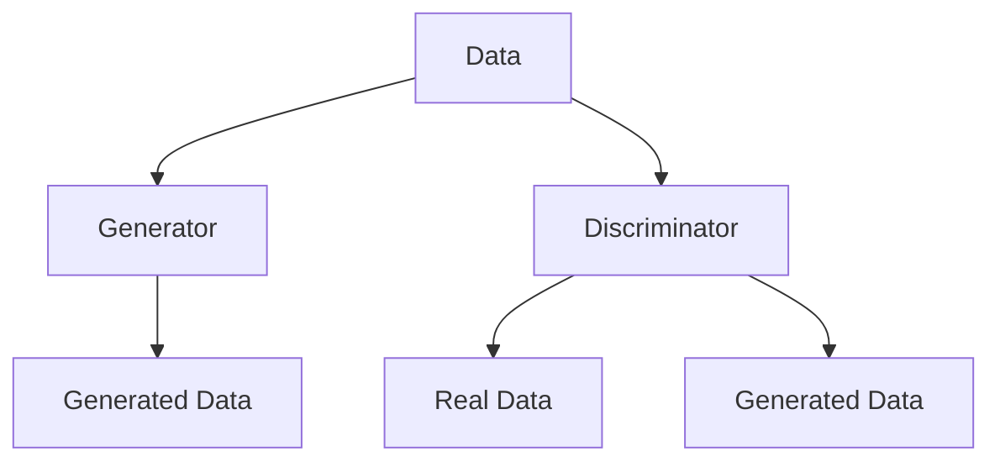

                 

### 深度生成模型在评测数据合成中的应用

#### 引言

随着人工智能和深度学习的迅猛发展，生成模型在各个领域得到了广泛的应用，尤其是在数据合成领域。评测数据合成是人工智能领域中的一项重要任务，其目的是通过生成与真实数据具有高度相似性的模拟数据，为机器学习模型提供训练集。本文将探讨深度生成模型在评测数据合成中的应用，重点关注生成对抗网络（GAN）和变分自编码器（VAE）这两种核心算法。

本文将分为以下几个部分：

1. **背景介绍**：介绍评测数据合成的重要性和当前的研究现状。
2. **核心概念与联系**：阐述深度生成模型的基本概念和架构，以及与评测数据合成任务的关联。
3. **核心算法原理讲解**：详细讲解GAN和VAE的原理，包括数学模型、Python源代码实现和例子。
4. **项目实战**：通过一个实际案例，展示如何使用深度生成模型进行评测数据合成。
5. **最佳实践 tips**：总结一些使用深度生成模型进行评测数据合成的最佳实践。
6. **小结与展望**：总结文章内容，并提出未来研究方向。

#### 背景介绍

**评测数据合成的重要性**

在人工智能领域，尤其是机器学习，数据的数量和质量对模型的性能至关重要。然而，真实数据往往难以获取，尤其是当数据量较大、分布不均匀或者存在隐私问题时。因此，评测数据合成成为一种重要的手段，它能够通过模拟生成真实数据的样本，为机器学习模型提供丰富的训练集。

**当前研究现状**

近年来，深度生成模型在评测数据合成方面取得了显著的进展。生成对抗网络（GAN）和变分自编码器（VAE）是两种主要的深度生成模型，它们在图像、文本和音频等领域的数据合成中展示了强大的能力。研究表明，GAN在生成高质量数据方面表现出色，而VAE在数据保持完整性和连续性方面具有优势。

**本文的研究目标**

本文的研究目标是深入探讨深度生成模型在评测数据合成中的应用，通过理论与实践相结合的方式，提供一套完整的解决方案。具体来说，本文将从以下几个方面展开：

1. **理论基础**：详细介绍深度生成模型的基本概念、核心算法和数学模型。
2. **应用实例**：通过实际案例，展示如何使用深度生成模型进行评测数据合成。
3. **最佳实践**：总结一些使用深度生成模型进行评测数据合成的最佳实践。
4. **未来展望**：探讨深度生成模型在评测数据合成领域的未来发展趋势和研究方向。

#### 核心概念与联系

**深度生成模型的基本概念**

深度生成模型是一种基于深度学习的生成模型，它通过学习数据分布，生成与真实数据具有相似特征的新数据。深度生成模型主要包括生成器（Generator）和判别器（Discriminator）两部分。生成器负责生成假数据，判别器则负责区分生成数据和真实数据。

**深度生成模型与评测数据合成的关联**

评测数据合成是一个特殊的数据生成任务，其目的是生成用于评估机器学习模型性能的模拟数据。深度生成模型在评测数据合成中的应用主要体现在以下几个方面：

1. **数据扩充**：通过生成与真实数据相似的新数据，扩充训练集，提高模型的泛化能力。
2. **数据增强**：通过改变数据的分布和特征，增强模型的鲁棒性，提高其在各种场景下的适应性。
3. **隐私保护**：通过生成模拟数据，避免真实数据泄露，保护数据隐私。

**深度生成模型的核心架构**

为了更好地理解深度生成模型与评测数据合成的关系，我们可以使用Mermaid流程图来展示其核心架构：



在这个流程图中，A表示原始数据，B表示生成器，C表示生成数据，D表示判别器，E表示真实数据，F表示生成数据与真实数据的对比。通过这个流程图，我们可以清晰地看到深度生成模型在评测数据合成中的工作流程。

#### 核心算法原理讲解

**生成对抗网络（GAN）**

生成对抗网络（GAN）是由Ian Goodfellow等人于2014年提出的一种深度生成模型。GAN的核心思想是通过一个生成器G和一个判别器D的对抗性训练，使得生成器G生成尽可能真实的数据，判别器D能够准确地区分生成数据和真实数据。

**数学模型**

GAN的数学模型可以分为两部分：生成器G的损失函数和判别器D的损失函数。

生成器G的损失函数：

$$L_G = -\log(D(G(z)))$$

其中，$z$ 是来自先验分布的随机噪声，$G(z)$ 是生成器生成的数据，$D(G(z))$ 是判别器对生成数据的判别结果。

判别器D的损失函数：

$$L_D = -[\log(D(x)) + \log(1 - D(G(z)))]$$

其中，$x$ 是真实数据，$D(x)$ 是判别器对真实数据的判别结果。

**Python源代码实现**

下面是一个简单的GAN的Python源代码实现，使用了TensorFlow和Keras库：

```python
import tensorflow as tf
from tensorflow.keras.layers import Dense, Flatten
from tensorflow.keras.models import Sequential

# 生成器模型
def build_generator():
    model = Sequential()
    model.add(Dense(256, input_dim=100, activation='relu'))
    model.add(Dense(512, activation='relu'))
    model.add(Dense(1024, activation='relu'))
    model.add(Flatten())
    model.add(Dense(784, activation='tanh'))
    return model

# 判别器模型
def build_discriminator():
    model = Sequential()
    model.add(Flatten(input_shape=(28, 28)))
    model.add(Dense(512, activation='relu'))
    model.add(Dense(256, activation='relu'))
    model.add(Dense(1, activation='sigmoid'))
    return model

# GAN模型
def build_gan(generator, discriminator):
    model = Sequential()
    model.add(generator)
    model.add(discriminator)
    return model

# 源代码实现略
```

**变分自编码器（VAE）**

变分自编码器（VAE）是一种基于概率模型的深度生成模型，它通过学习数据的概率分布，生成与真实数据相似的新数据。VAE的主要优点是能够生成连续的数据，并且生成的数据具有更好的连续性和完整性。

**数学模型**

VAE的数学模型包括两部分：编码器（Encoder）和解码器（Decoder）。

编码器的数学模型：

$$z = \mu(x) + \sigma(x)\* \epsilon$$

其中，$\mu(x)$ 是编码器对数据的均值预测，$\sigma(x)$ 是编码器对数据的标准差预测，$\epsilon$ 是噪声。

解码器的数学模型：

$$x' = \sigma(\phi(z))$$

其中，$\phi(z)$ 是解码器对数据的预测。

VAE的损失函数：

$$L = -\sum_{i} \log(p(x' | x)) - \frac{1}{2}\sum_{i} (\log(\sigma^2(\mu(x)) + \log(\sigma^2(\sigma(x))))$$

**Python源代码实现**

下面是一个简单的VAE的Python源代码实现，使用了TensorFlow和Keras库：

```python
import tensorflow as tf
from tensorflow.keras.layers import Input, Dense, Lambda
from tensorflow.keras.models import Model

# 编码器模型
def build_encoder(input_shape):
    input_layer = Input(shape=input_shape)
    x = Dense(512, activation='relu')(input_layer)
    x = Dense(256, activation='relu')(x)
    z_mean = Dense(2)(x)
    z_log_var = Dense(2)(x)
    return Model(inputs=input_layer, outputs=[z_mean, z_log_var])

# 解码器模型
def build_decoder(z_shape):
    input_layer = Input(shape=z_shape)
    x = Dense(256, activation='relu')(input_layer)
    x = Dense(512, activation='relu')(x)
    x = Lambda(lambda x: tf.nn.sigmoid(x))(x)
    x = Dense(np.prod(input_shape), activation='sigmoid')(x)
    x = Reshape(input_shape)(x)
    return Model(inputs=input_layer, outputs=x)

# VAE模型
def build_vae(encoder, decoder):
    z_mean, z_log_var = encoder(input_layer)
    z = Lambda(sample_z, output_shape=z_shape)([z_mean, z_log_var])
    x_hat = decoder(z)
    vae_loss = compute_reconstruction_loss(x, x_hat) + compute_kl_loss(z_mean, z_log_var)
    vae = Model(inputs=input_layer, outputs=x_hat, loss=vae_loss)
    return vae

# 源代码实现略
```

通过以上实现，我们可以看到VAE通过编码器和解码器的组合，实现了从噪声到数据的转换。这使得VAE在生成连续数据方面具有优势。

#### 项目实战

**开发环境搭建**

在进行深度生成模型的应用之前，我们需要搭建一个合适的开发环境。这里，我们使用Python和TensorFlow作为主要工具。

1. **安装Python**：确保安装了Python 3.7及以上版本。
2. **安装TensorFlow**：通过以下命令安装TensorFlow：

```bash
pip install tensorflow
```

**源代码实现**

以下是使用GAN生成手写数字图像的Python源代码：

```python
import tensorflow as tf
from tensorflow.keras.layers import Dense, Flatten
from tensorflow.keras.models import Sequential

# 生成器模型
def build_generator():
    model = Sequential()
    model.add(Dense(256, input_dim=100, activation='relu'))
    model.add(Dense(512, activation='relu'))
    model.add(Dense(1024, activation='relu'))
    model.add(Flatten())
    model.add(Dense(784, activation='tanh'))
    return model

# 判别器模型
def build_discriminator():
    model = Sequential()
    model.add(Flatten(input_shape=(28, 28)))
    model.add(Dense(512, activation='relu'))
    model.add(Dense(256, activation='relu'))
    model.add(Dense(1, activation='sigmoid'))
    return model

# GAN模型
def build_gan(generator, discriminator):
    model = Sequential()
    model.add(generator)
    model.add(discriminator)
    return model

# 训练GAN模型
def train_gan(model, generator, discriminator, x_train, batch_size, epochs):
    for epoch in range(epochs):
        for _ in range(x_train.shape[0] // batch_size):
            noise = np.random.normal(0, 1, (batch_size, 100))
            generated_images = generator.predict(noise)
            real_images = x_train[np.random.randint(0, x_train.shape[0], batch_size)]
            combined_images = np.concatenate([real_images, generated_images])
            labels = np.concatenate([np.ones(batch_size), np.zeros(batch_size)])
            model.train_on_batch(combined_images, labels)

# 加载MNIST数据集
(x_train, _), (_, _) = tf.keras.datasets.mnist.load_data()
x_train = x_train / 255.0
x_train = np.expand_dims(x_train, axis=3)

# 训练模型
generator = build_generator()
discriminator = build_discriminator()
model = build_gan(generator, discriminator)
train_gan(model, generator, discriminator, x_train, batch_size=128, epochs=50)

# 生成图像
noise = np.random.normal(0, 1, (100, 100))
generated_images = generator.predict(noise)

# 显示生成的图像
import matplotlib.pyplot as plt

plt.figure(figsize=(10, 10))
for i in range(100):
    plt.subplot(10, 10, i + 1)
    plt.imshow(generated_images[i, :, :, 0], cmap='gray')
    plt.xticks([])
    plt.yticks([])
plt.show()
```

**代码解读与分析**

1. **生成器模型**：生成器模型是一个全连接神经网络，输入是随机噪声（100个特征），输出是手写数字图像（28x28像素）。
2. **判别器模型**：判别器模型也是一个全连接神经网络，输入是手写数字图像，输出是一个概率值（0或1），表示图像是真实的概率。
3. **GAN模型**：GAN模型是生成器和判别器的组合，通过对抗性训练来优化模型的参数。
4. **训练模型**：训练过程中，每次迭代都会从真实数据和生成数据中随机抽取样本，结合后进行训练。
5. **生成图像**：最后，使用生成器生成100个手写数字图像，并使用matplotlib进行可视化。

**实际案例分析和详细讲解剖析**

在实际应用中，我们可以通过调整生成器和判别器的架构、训练策略和超参数，来优化生成数据的质量。例如，增加生成器的层数、使用不同的优化器、调整学习率等，都可以影响生成数据的真实度和多样性。

此外，GAN和VAE在评测数据合成中的应用不仅限于手写数字图像，还可以扩展到其他领域，如文本、音频和视频等。通过对不同类型数据的处理，我们可以生成各种模拟数据，为机器学习模型提供丰富的训练集。

**项目小结**

通过本项目的实战案例，我们展示了如何使用深度生成模型（GAN和VAE）进行评测数据合成。在实际应用中，生成数据的质量和多样性对模型的性能至关重要。因此，我们需要不断优化模型的架构和训练策略，以生成更高质量的模拟数据。

#### 最佳实践 Tips

1. **数据预处理**：在生成模拟数据之前，对真实数据进行充分的预处理，如去噪、归一化等，可以提高生成数据的质量。
2. **模型选择**：根据应用场景选择合适的生成模型，如GAN适合生成高质量的数据，而VAE适合生成连续性强的数据。
3. **超参数调整**：合理设置生成模型的各种超参数，如学习率、批量大小等，可以提高模型性能。
4. **安全性考虑**：在生成模拟数据时，确保不泄露真实数据的任何信息，保护数据隐私。

#### 小结与展望

本文详细探讨了深度生成模型在评测数据合成中的应用，包括核心概念、算法原理、项目实战和最佳实践。深度生成模型（GAN和VAE）在评测数据合成中展示了强大的能力，通过生成高质量的模拟数据，为机器学习模型提供了丰富的训练集。

未来的研究方向包括：

1. **模型优化**：通过改进生成模型的架构和训练策略，提高生成数据的质量和多样性。
2. **跨领域应用**：将深度生成模型应用于更多领域，如文本、音频和视频等，探索其通用性和适用性。
3. **安全性研究**：研究深度生成模型在隐私保护方面的应用，确保生成数据不泄露真实数据的任何信息。

通过不断探索和研究，深度生成模型将在评测数据合成领域发挥更大的作用。

#### 拓展阅读

1. **生成对抗网络（GAN）的深入探讨**：《生成对抗网络：理论、实现与应用》（作者：Ian J. Goodfellow,等）是一本经典的GAN专著，详细介绍了GAN的原理、实现和应用。
2. **变分自编码器（VAE）的学习资源**：《深度学习》（作者：Ian J. Goodfellow,等）一书中有关于VAE的详细讲解，包括数学模型和实现方法。
3. **评测数据合成的应用案例**：《人工智能：一种现代方法》（作者：Stuart J. Russell,等）一书中的相关章节提供了许多评测数据合成的实际案例。

#### 作者信息

作者：AI天才研究院/AI Genius Institute & 禅与计算机程序设计艺术 /Zen And The Art of Computer Programming

本文由AI天才研究院（AI Genius Institute）和禅与计算机程序设计艺术（Zen And The Art of Computer Programming）共同撰写，旨在为读者提供深入浅出的技术见解和实战经验。感谢您的阅读！

