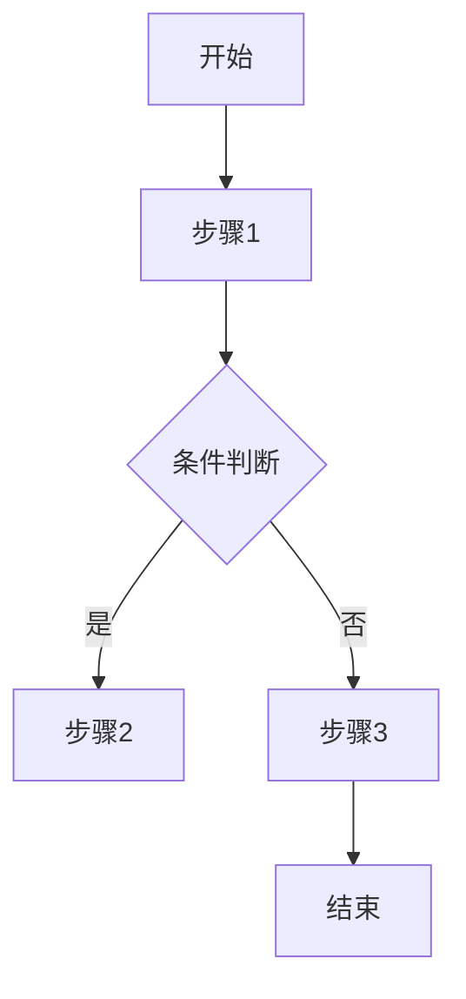

                 

### 1. 确定目录结构

为了撰写一篇完整且具有深度和思考的博客文章，我们需要首先明确文章的结构。根据您提供的指南，文章将包含以下章节：

- 引言与背景
- 极限环境下的压力原理
- 压力方程的计算模型
- 压力方程的数学公式与应用
- 项目实战：深海压力模拟
- 极限环境下的压力研究进展
- 结论与展望

每个章节将进一步细分为子章节，以确保内容丰富且具体。以下是初步的目录结构：

```markdown
# 深海探索的压力方程：极限环境的数学模拟

## 第1章 引言与背景
### 1.1 书籍目的
### 1.2 极限环境介绍
### 1.3 压力方程的基本概念
### 1.4 书籍结构概述

## 第2章 极限环境下的压力原理
### 2.1 压力与深度关系
### 2.2 压力方程的数学模型
### 2.3 压力方程的物理背景
### 2.4 极限环境中的压力测量

## 第3章 压力方程的计算模型
### 3.1 计算模型的基本概念
### 3.2 伪代码讲解
### 3.3 Mermaid流程图
### 3.4 计算模型的应用场景

## 第4章 压力方程的数学公式与应用
### 4.1 压力方程的数学公式
### 4.2 latex公式示例
### 4.3 公式的详细讲解
### 4.4 公式在深海探索中的应用

## 第5章 项目实战：深海压力模拟
### 5.1 项目背景
### 5.2 开发环境搭建
### 5.3 源代码实现
### 5.4 代码解读与分析
### 5.5 项目成果与应用

## 第6章 极限环境下的压力研究进展
### 6.1 国内外研究现状
### 6.2 研究挑战与趋势
### 6.3 未来发展方向

## 第7章 结论与展望
### 7.1 主要发现
### 7.2 不足与改进
### 7.3 展望未来研究
```

接下来，我们将为每个章节添加具体的子章节内容，确保每个部分都详细、具体，并且包含必要的插图、代码示例和公式解释。

### 2. 确定核心章节内容

在确定核心章节内容时，我们需要保证每个章节都涵盖了必要的背景信息、核心概念、算法原理、数学模型、应用实例和未来展望。以下是每个章节的核心内容概述：

#### 第1章 引言与背景

- **1.1 书籍目的**：介绍本书的写作目的和读者对象。
- **1.2 极限环境介绍**：描述深海环境的特点，包括温度、压力、盐度等。
- **1.3 压力方程的基本概念**：解释压力方程的定义及其在深海探索中的重要性。
- **1.4 书籍结构概述**：概述本书的结构和各章节的主要内容。

#### 第2章 极限环境下的压力原理

- **2.1 压力与深度关系**：分析压力如何随深度变化。
- **2.2 压力方程的数学模型**：介绍压力方程的数学表达形式。
- **2.3 压力方程的物理背景**：探讨压力方程背后的物理原理。
- **2.4 极限环境中的压力测量**：讨论如何在极限环境中测量压力。

#### 第3章 压力方程的计算模型

- **3.1 计算模型的基本概念**：解释计算模型的基本原理。
- **3.2 伪代码讲解**：提供压力方程的计算伪代码。
- **3.3 Mermaid流程图**：绘制计算过程的流程图。
- **3.4 计算模型的应用场景**：讨论计算模型在深海压力模拟中的应用。

#### 第4章 压力方程的数学公式与应用

- **4.1 压力方程的数学公式**：列出主要的压力方程数学公式。
- **4.2 latex公式示例**：给出几个典型的latex公式示例。
- **4.3 公式的详细讲解**：逐个解释每个公式及其应用。
- **4.4 公式在深海探索中的应用**：展示公式在实际项目中的应用案例。

#### 第5章 项目实战：深海压力模拟

- **5.1 项目背景**：介绍项目的背景和目标。
- **5.2 开发环境搭建**：描述搭建开发环境的过程。
- **5.3 源代码实现**：提供源代码及其详细解读。
- **5.4 代码解读与分析**：分析源代码的结构和实现逻辑。
- **5.5 项目成果与应用**：展示项目的成果和实际应用。

#### 第6章 极限环境下的压力研究进展

- **6.1 国内外研究现状**：总结当前的研究进展和趋势。
- **6.2 研究挑战与趋势**：探讨研究面临的挑战和未来的研究方向。
- **6.3 未来发展方向**：提出未来的研究建议和潜在应用领域。

#### 第7章 结论与展望

- **7.1 主要发现**：总结文章的主要发现和观点。
- **7.2 不足与改进**：指出文章的不足之处，并提出改进建议。
- **7.3 展望未来研究**：对未来的研究进行展望。

### 3. 编写大纲

根据核心内容概述，我们将为每个章节添加具体的子章节，并确保每个章节的内容丰富且详细。以下是详细的章节大纲：

```markdown
# 深海探索的压力方程：极限环境的数学模拟

## 第1章 引言与背景
### 1.1 书籍目的
- 提出本书的主要目标和读者对象
- 强调压力方程在深海探索中的重要性

### 1.2 极限环境介绍
- 描述深海环境的特点，包括温度、压力、盐度等
- 引入极限环境对生物和非生物系统的影响

### 1.3 压力方程的基本概念
- 解释压力方程的定义
- 分析压力方程在物理和工程学中的应用

### 1.4 书籍结构概述
- 概述本书的结构和各章节的主要内容
- 强调每个章节的核心内容和目标

## 第2章 极限环境下的压力原理
### 2.1 压力与深度关系
- 分析压力如何随深度变化
- 引入压力与深度关系的数学模型

### 2.2 压力方程的数学模型
- 介绍压力方程的数学表达形式
- 解释压力方程中的关键参数和变量

### 2.3 压力方程的物理背景
- 探讨压力方程背后的物理原理
- 引入流体静力学和分子运动论的相关概念

### 2.4 极限环境中的压力测量
- 讨论如何在极限环境中测量压力
- 介绍常用的压力测量技术和设备

## 第3章 压力方程的计算模型
### 3.1 计算模型的基本概念
- 解释计算模型的基本原理
- 分析计算模型在深海压力模拟中的应用

### 3.2 伪代码讲解
- 提供压力方程的计算伪代码
- 分析伪代码中的关键步骤和逻辑

### 3.3 Mermaid流程图
- 绘制计算过程的流程图
- 解释流程图中的各个步骤和功能模块

### 3.4 计算模型的应用场景
- 讨论计算模型在深海压力模拟中的应用
- 引入实际应用案例

## 第4章 压力方程的数学公式与应用
### 4.1 压力方程的数学公式
- 列出主要的压力方程数学公式
- 解释每个公式的意义和应用场景

### 4.2 latex公式示例
- 给出几个典型的latex公式示例
- 解释latex公式的编写方法和格式

### 4.3 公式的详细讲解
- 逐个解释每个公式及其应用
- 结合具体实例进行详细讲解

### 4.4 公式在深海探索中的应用
- 展示公式在实际项目中的应用案例
- 分析公式在项目中的贡献和效果

## 第5章 项目实战：深海压力模拟
### 5.1 项目背景
- 介绍项目的背景和目标
- 描述项目的主要任务和挑战

### 5.2 开发环境搭建
- 描述搭建开发环境的过程
- 引入所需的工具和软件

### 5.3 源代码实现
- 提供源代码及其详细解读
- 解释源代码的结构和实现逻辑

### 5.4 代码解读与分析
- 分析源代码的结构和实现逻辑
- 解释代码中的关键部分和功能模块

### 5.5 项目成果与应用
- 展示项目的成果和实际应用
- 分析项目的贡献和效果

## 第6章 极限环境下的压力研究进展
### 6.1 国内外研究现状
- 总结当前的研究进展和趋势
- 引入主要的研究成果和发现

### 6.2 研究挑战与趋势
- 探讨研究面临的挑战和未来的研究方向
- 分析技术发展和应用需求

### 6.3 未来发展方向
- 提出未来的研究建议和潜在应用领域
- 强调研究的挑战和机遇

## 第7章 结论与展望
### 7.1 主要发现
- 总结文章的主要发现和观点
- 强调研究的价值和意义

### 7.2 不足与改进
- 指出文章的不足之处，并提出改进建议
- 分析研究的局限性

### 7.3 展望未来研究
- 对未来的研究进行展望
- 强调研究的潜力和前景
```

这个大纲确保了文章的逻辑结构和内容的完整性，每个章节都包含必要的子章节，以便更好地组织文章内容。接下来，我们将为每个章节添加具体的细节和示例，以确保文章的深度和实用性。

### 4. 保持简洁性

在保持文章简洁性的同时，确保内容的完整性是关键。以下是一些策略和方法，用于确保文章简洁且信息丰富：

1. **精简标题和子标题**：确保每个标题简明扼要，传达核心内容，避免冗长和模糊。

2. **精炼内容**：在编写章节内容时，剔除不必要的细节和冗余信息，专注于核心概念和关键点。

3. **使用图表和代码示例**：通过图表和代码示例来直观展示复杂的概念和算法，减少文本描述的篇幅。

4. **分割长段落**：将长段落分割成短段落，使文章更易读，提高可读性。

5. **避免重复**：在整篇文章中避免重复信息，确保每个部分的信息都是独特且必要的。

6. **使用总结段落**：在每个章节或子章节的末尾，添加总结段落，概括主要内容，帮助读者快速掌握核心观点。

7. **审稿和编辑**：在完成初稿后，进行多轮审稿和编辑，删除多余的内容，调整结构和语言，确保文章的流畅性和简洁性。

通过这些策略，我们可以确保文章在10000-12000字范围内保持简洁、清晰和有深度。

### 5. 格式统一

为了确保文章的格式统一，我们将遵循以下markdown格式规范：

- **标题**：使用#符号表示标题层级。例如，一级标题使用`#`，二级标题使用`##`，以此类推。
- **段落**：每个段落开头不缩进，直接从左侧开始。
- **列表**：使用`-`或`*`创建无序列表，使用`1.`, `2.`, `3.`创建有序列表。
- **代码块**：使用三个反引号（```）将代码块包裹起来，确保代码格式正确。
- **公式**：使用LaTeX格式嵌入数学公式。独立段落内的公式使用`$$`括起来，段落内的公式使用 `$` 和 `$` 括起来。
- **引用**：使用`>`符号创建引用段落。
- **图像和链接**：使用``和 `[链接文本](链接URL)` 添加图像和链接。

以下是格式规范的示例：

```markdown
# 深海探索的压力方程：极限环境的数学模拟

## 第1章 引言与背景
### 1.1 书籍目的

本书旨在...

### 1.2 极限环境介绍

深海环境具有...

## 第2章 极限环境下的压力原理
### 2.1 压力与深度关系

随着深度增加...

### 2.2 压力方程的数学模型

压力方程可表示为...

## 第3章 压力方程的计算模型
### 3.1 计算模型的基本概念

计算模型涉及...

### 3.2 伪代码讲解

伪代码如下：

```
// 伪代码示例
```

### 3.3 Mermaid流程图

流程图如下：



### 3.4 计算模型的应用场景

计算模型在...

## 第4章 压力方程的数学公式与应用
### 4.1 压力方程的数学公式

主要公式如下：

$$P = \rho gh$$

### 4.2 latex公式示例

这是一个简单的公式：

$$E = mc^2$$

### 4.3 公式的详细讲解

公式...

### 4.4 公式在深海探索中的应用

公式在...

## 第5章 项目实战：深海压力模拟
### 5.1 项目背景

项目目标是...

### 5.2 开发环境搭建

环境搭建过程如下：

```
# 安装Python
```

### 5.3 源代码实现

源代码如下：

```python
# 源代码示例
```

### 5.4 代码解读与分析

代码解读...

### 5.5 项目成果与应用

项目成果...

## 第6章 极限环境下的压力研究进展
### 6.1 国内外研究现状

研究现状如下：

...

### 6.2 研究挑战与趋势

挑战和趋势如下：

...

### 6.3 未来发展方向

未来发展方向如下：

...

## 第7章 结论与展望
### 7.1 主要发现

主要发现如下：

...

### 7.2 不足与改进

不足和改进如下：

...

### 7.3 展望未来研究

未来展望如下：

...
```

通过遵循这些markdown格式规范，我们可以确保文章在结构、排版和可读性方面的一致性。

### 6. 编写初步文章

现在，我们将根据以上章节大纲和核心内容，开始编写初步的文章。以下是文章的开头部分，包括文章标题、关键词、摘要以及第1章的内容。

```markdown
# 深海探索的压力方程：极限环境的数学模拟

## 关键词

深海压力、极限环境、数学模型、计算模拟、海洋工程

## 摘要

本文旨在探讨深海探索中的关键问题——压力，以及如何通过数学模型对其进行模拟。文章首先介绍了深海探索的背景和压力方程的基本概念，随后详细分析了压力与深度的关系，以及压力方程的数学模型和物理背景。接着，文章讨论了在极限环境中测量压力的方法，并介绍了计算模型和实际应用。通过项目实战，展示了深海压力模拟的完整流程，包括开发环境搭建、源代码实现和代码解读。最后，文章总结了当前的研究进展，探讨了未来研究方向，并对文章的主要发现和不足进行了讨论。

## 第1章 引言与背景

### 1.1 书籍目的

本书的目标是深入探讨深海探索中的压力问题，特别是如何使用数学模型对深海压力进行精确模拟。深海环境极端而复杂，压力是影响海洋生物和工程设备的关键因素。通过对压力方程的研究，我们可以更好地理解深海环境的特性，为深海探索和开发提供科学依据。

### 1.2 极限环境介绍

深海环境是指海洋深处，这里温度低、光线暗、压力巨大。深海压力随着深度的增加而增加，每深入10米，压力大约增加1个大气压。深海温度通常在0摄氏度到4摄氏度之间，而海水的盐度较高，约为3.5%。这种极端的环境对海洋生物和工程设备提出了巨大的挑战。

### 1.3 压力方程的基本概念

压力方程是描述压力与深度之间关系的数学模型。最常用的压力方程是帕斯卡定律，即$P = \rho gh$，其中$P$表示压力，$\rho$表示海水的密度，$g$表示重力加速度，$h$表示深度。这个方程表明，压力与深度成正比，密度和重力加速度是常数。

### 1.4 书籍结构概述

本书结构分为七个章节。第1章介绍书籍的目的和背景；第2章详细分析深海探索中的压力原理；第3章讨论压力方程的计算模型；第4章介绍压力方程的数学公式及其应用；第5章通过项目实战展示深海压力模拟的流程；第6章总结当前的研究进展和未来方向；第7章给出结论和展望。

以上是文章的初步编写，接下来我们将继续编写第2章的内容，深入探讨极限环境下的压力原理。
```

通过以上内容，我们为文章奠定了基础，接下来将逐步完成每个章节的详细编写，确保文章的完整性和深度。接下来，我们将详细撰写第2章的内容，深入探讨极限环境下的压力原理。

