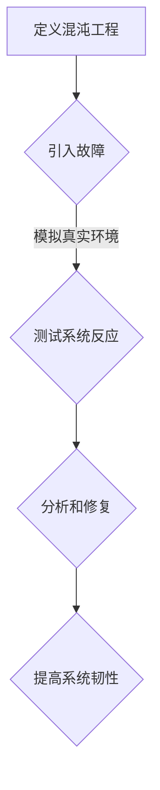
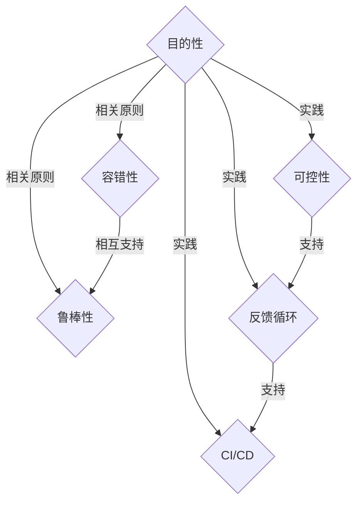
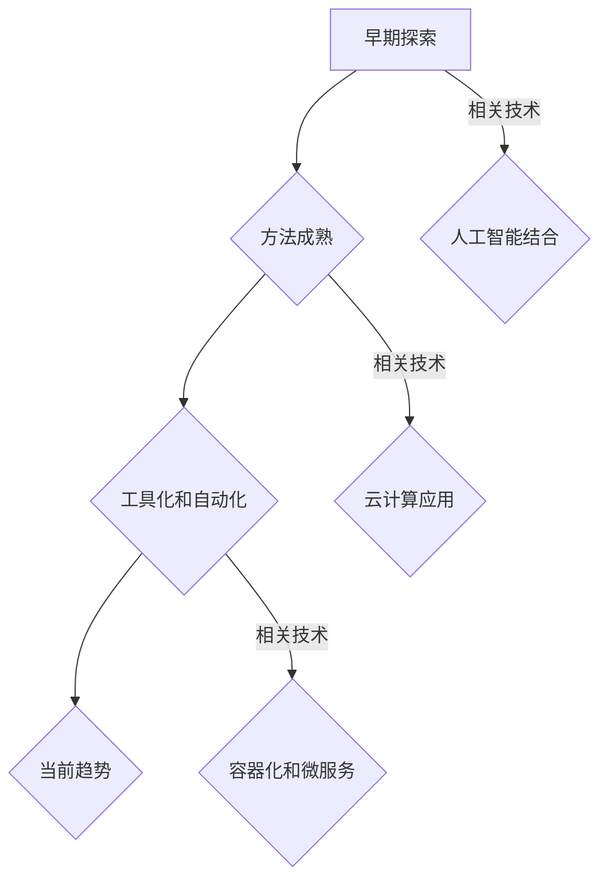

                 

### 关键词

- 混沌工程
- 大型语言模型（LLM）
- 应用可靠性
- 故障模式
- 实施策略
- 未来趋势

### 摘要

本文深入探讨了混沌工程在提高大型语言模型（LLM）应用可靠性方面的作用。首先，介绍了混沌工程的基本概念和原理，包括其定义、核心原则及其历史发展。接着，分析了LLM应用的常见故障模式和可靠性挑战。随后，详细阐述了混沌工程的方法和技术，包括混沌实验的设计与执行。在此基础上，本文提供了实施混沌工程的步骤和策略，并借助实际案例展示了其在提升LLM应用可靠性方面的具体应用。最后，本文探讨了混沌工程的未来发展趋势，包括与人工智能的结合、云计算环境中的应用以及标准化和规范化方向。通过本文的阅读，读者将能够全面理解混沌工程在提高LLM应用可靠性方面的价值，并掌握其实施方法和策略。

### 目录

- **第1章 混沌工程的基本概念和原理**
  - 1.1.1 混沌工程的定义
  - 1.1.2 混沌工程的核心原理
  - 1.1.3 混沌工程的历史发展
- **第2章 LLM应用的故障模式和挑战**
  - 2.1.1 LLM应用的常见故障模式
  - 2.1.2 LLM应用的可靠性挑战
  - 2.1.3 LLM应用的故障案例分析
- **第3章 混沌工程的方法和技术**
  - 3.1.1 混沌工程的关键技术
  - 3.1.2 混沌实验的设计和执行
  - 3.1.3 混沌工程工具和平台
- **第4章 实施混沌工程的步骤和策略**
  - 4.1.1 实施混沌工程的前期准备
  - 4.1.2 实施混沌工程的步骤
  - 4.1.3 混沌工程的策略选择
- **第5章 混沌工程的应用案例**
  - 5.1.1 案例一：提高LLM服务的弹性
  - 5.1.2 案例二：增强LLM的鲁棒性
  - 5.1.3 案例三：优化LLM的响应时间
- **第6章 混沌工程的未来发展趋势**
  - 6.1.1 混沌工程与人工智能的结合
  - 6.1.2 混沌工程在云计算环境中的应用
  - 6.1.3 混沌工程的标准化和规范化
- **附录**
  - 附录 A: 混沌工程相关工具和资源

## 第1章 混沌工程的基本概念和原理

### 1.1.1 混沌工程的定义

混沌工程是一种通过故意引入故障和异常情况来测试系统韧性和可靠性的方法。它的核心思想是，通过在开发环境中模拟真实世界的故障，提前发现和解决潜在的问题，从而提高系统在真实生产环境中的可靠性和鲁棒性。

混沌工程的定义可以概括为：一种系统性的、预定的方法，用于在可控的环境下故意引入故障，以评估和增强系统对意外的弹性和恢复能力。这种方法不同于传统的测试，它不仅仅是寻找系统中的缺陷，而是主动地设计并引入故障，以验证系统在极端条件下的表现。

混沌工程的定义与传统的系统测试和故障注入方法有显著区别。传统的测试方法通常是在系统设计和开发完成后进行，主要目的是验证系统的功能是否符合预期。而混沌工程则侧重于验证系统在面临真实故障时的弹性和恢复能力。混沌工程的核心是“故意”引入故障，这与故障注入方法相似，但混沌工程更强调系统整体性和对意外情况的适应性。

为了更好地理解混沌工程，我们可以用一个简化的Mermaid流程图来展示其核心概念和流程：

在这个流程图中，A节点表示混沌工程的定义，B节点表示引入故障，C节点表示在模拟真实环境中测试系统的反应，D节点表示对测试结果进行分析和修复，E节点表示通过不断迭代，提高系统的整体韧性。

### 1.1.2 混沌工程的核心原理

混沌工程的核心原理可以归结为以下几点：

1. **目的性**：混沌工程的目的不是简单地破坏系统，而是通过故意引入故障，提前发现并解决系统中的潜在问题。这种方法能够帮助开发团队更早地识别和解决系统中的弱点和缺陷。

2. **可控性**：混沌工程需要在可控的环境下进行，这意味着引入故障的过程必须是可预测的，并且不会对实际生产环境造成不可挽回的损害。为了实现这一目标，混沌工程通常在开发、测试或预生产环境中进行。

3. **反馈循环**：混沌工程强调反馈循环的重要性。通过引入故障并观察系统的反应，开发团队可以获得宝贵的反馈信息。这些信息可以帮助他们改进系统设计，提高系统的可靠性和韧性。

4. **持续集成和持续部署（CI/CD）**：混沌工程与持续集成和持续部署紧密相关。在CI/CD流程中，混沌工程可以通过自动化测试和故障注入，确保每个代码提交都能在稳定的环境中运行，从而提高整个系统的可靠性和健壮性。

混沌工程的核心原理与软件工程中的其他原则有紧密的联系。例如，它与容错性（fault tolerance）和鲁棒性（robustness）密切相关。容错性指的是系统能够在部分组件失效的情况下继续运行的能力，而鲁棒性则是指系统能够在面临各种异常情况时保持稳定运行的能力。

为了更好地展示混沌工程的核心原理，我们可以使用一个Mermaid流程图来描述它们之间的关系：

在这个流程图中，A节点表示混沌工程的核心原理，B和C节点分别表示与之相关的容错性和鲁棒性原则，D、E和F节点表示混沌工程在实际应用中的关键实践，包括可控性、反馈循环和与CI/CD的集成。

### 1.1.3 混沌工程的历史发展

混沌工程作为一个新兴的概念，其发展历程可以追溯到20世纪80年代。当时的计算机系统相对简单，但工程师们已经意识到，许多系统在面对真实世界的异常情况时，往往表现不佳。为了解决这一问题，他们开始探索一种新的测试方法，即故意引入故障来测试系统的韧性和可靠性。

混沌工程的发展历程可以分为以下几个阶段：

1. **早期探索（20世纪80年代）**：在这个阶段，工程师们开始尝试在开发环境中引入故障，以测试系统的反应。这个时期的研究主要集中在如何设计和执行故障注入，以及如何分析故障对系统的影响。

2. **方法成熟（20世纪90年代）**：随着计算机系统的复杂度不断增加，混沌工程的方法逐渐成熟。这个阶段的研究重点转向如何系统地引入故障，以及如何通过反馈循环来持续改进系统设计。

3. **工具化和自动化（21世纪初）**：21世纪初，混沌工程的工具化和自动化成为趋势。工程师们开始开发各种混沌工程工具，如Chaos Monkey、Chaos Gorilla等，这些工具可以帮助自动引入故障，并记录系统对故障的反应。

4. **当前趋势（近年）**：近年来，混沌工程的应用范围不断扩大，不仅局限于软件开发，还涉及到云计算、容器化、微服务等领域。同时，混沌工程与人工智能、机器学习等技术的结合，为系统测试和优化提供了新的思路。

混沌工程的历史发展可以归纳为从早期探索到方法成熟，再到工具化和自动化，直至当前的广泛应用和深入结合。这一过程反映了混沌工程在应对复杂系统挑战方面的不断进步和成熟。

为了更清晰地展示混沌工程的历史发展，我们可以使用一个Mermaid流程图来描述其主要阶段：

在这个流程图中，A节点表示混沌工程的早期探索阶段，B节点表示方法成熟阶段，C节点表示工具化和自动化阶段，D节点表示当前趋势阶段。E、F和G节点分别表示与混沌工程相关的技术趋势，包括人工智能结合、云计算应用和容器化/微服务。

通过以上对混沌工程的基本概念和原理的介绍，读者可以对混沌工程有更深入的理解。接下来的章节将探讨LLM应用的故障模式和挑战，以及混沌工程的具体方法和技术，帮助读者更好地掌握混沌工程在提高LLM应用可靠性方面的应用。

