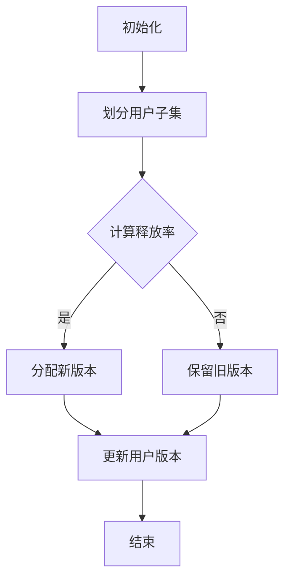
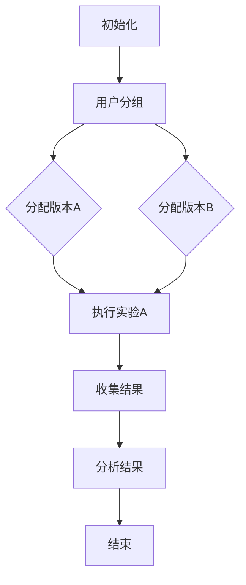

                 

### 引言

#### 灰度发布与A/B测试概述

灰度发布（Gray Release）和A/B测试（A/B Testing）是现代软件工程中广泛应用的两种策略，旨在提高新功能或系统的上线稳定性与用户满意度。灰度发布是一种渐进式的发布方法，通过逐步将用户流量导向新版本，确保系统能够在有限的范围内接受实际环境的检验。A/B测试则是通过将用户群体随机分为两组或多组，分别向每组用户提供不同版本的功能或界面，以此来评估不同版本的效果，最终选出最优方案。

在LLM（大型语言模型）应用迭代过程中，这两种策略尤为重要。LLM通常用于复杂、高影响力的场景，如智能客服、文本生成、机器翻译等。任何错误或性能问题都可能带来严重的业务损失和用户体验下降。因此，如何在上线过程中确保LLM的稳定性和性能是开发团队面临的核心挑战。

#### LLM应用背景与挑战

LLM技术在近年来取得了飞速发展，其强大的文本处理和生成能力使其在多个领域展现出了巨大的潜力。随着模型规模的不断扩大和训练数据的不断增长，LLM的应用场景也越来越广泛。然而，这一快速发展的背后也伴随着一系列挑战：

1. **性能优化需求**：LLM模型通常需要大量计算资源和存储空间，如何高效地部署和优化这些模型是一个重要课题。
2. **上线风险**：LLM模型涉及的业务场景复杂，一旦上线出现问题，可能会对用户体验和业务稳定性产生重大影响。
3. **用户体验反馈**：在快速迭代的开发过程中，如何快速获取用户反馈并做出相应调整也是一个关键问题。

#### 灰度发布与A/B测试在LLM应用中的重要性

灰度发布与A/B测试在LLM应用迭代中具有以下几个重要作用：

1. **风险控制**：通过灰度发布，开发团队可以在实际环境中逐步扩大新版本的覆盖范围，降低整体上线风险。
2. **性能优化**：通过A/B测试，团队可以针对不同用户群体进行性能评估，找出并优化模型中的性能瓶颈。
3. **用户反馈**：通过A/B测试，团队能够快速获取用户对新功能的反馈，及时调整和优化模型。

总之，灰度发布与A/B测试不仅为LLM应用的上线提供了强有力的保障，还为持续迭代和优化提供了有效的方法。在接下来的章节中，我们将详细探讨灰度发布与A/B测试的基本原理、实现方法以及它们在LLM应用迭代中的具体应用。

### 灰度发布原理与实现

#### 灰度发布基本原理

灰度发布（Gray Release）是一种通过逐步扩大新版本用户覆盖范围来降低上线风险的方法。其基本原理是将用户群体划分为多个子集，每个子集按一定比例分配到新版本。这样，开发团队可以在有限的范围内对新版本进行测试和评估，确保其稳定性和性能符合预期后再逐步扩大覆盖范围。

#### 灰度发布算法原理讲解

灰度发布算法的核心在于如何动态调整每个子集的用户分配比例。以下是一个简化的灰度发布算法：

```python
# 灰度发布算法伪代码

def gray_release(user_list, release_rate, current_version, target_version):
    new_user_list = []
    for user in user_list:
        if random.random() < release_rate:
            new_user_list.append(target_version)
        else:
            new_user_list.append(current_version)
    return new_user_list
```

在这个伪代码中，`user_list` 表示当前所有用户的列表，`release_rate` 是当前版本向新版本切换的比例，`current_version` 和 `target_version` 分别表示当前版本和新版本。

#### Mermaid流程图

为了更直观地理解灰度发布的过程，我们可以使用Mermaid流程图来展示：



在这个流程图中，`A` 表示初始化阶段，将用户划分为子集；`B` 表示划分用户子集；`C` 计算释放率；`D` 分配新版本用户；`E` 保留旧版本用户；`F` 更新用户版本信息；`G` 表示流程结束。

#### 实践案例

假设有一个用户群体，共1000名用户，其中50%的用户将参与新版本的灰度发布。以下是具体步骤：

1. **初始化**：将1000名用户划分为子集，每个子集包含10名用户。
2. **划分用户子集**：每个子集独立计算释放率，以10%的释放率开始。
3. **计算释放率**：对于每个子集，随机选择10名用户，如果随机数小于10%，则将其分配到新版本。
4. **分配新版本**：更新选中用户的版本信息为新版本。
5. **重复过程**：每过一段时间，重新计算释放率，逐步增加新版本的覆盖范围。

#### 开发环境搭建

为了实现上述灰度发布算法，我们需要搭建相应的开发环境。以下是一个简单的开发环境搭建步骤：

1. **环境配置**：
   - Python 3.8+
   - pip 安装必要的库（如numpy、random等）

2. **创建项目**：在合适的位置创建一个Python项目，例如`gray_release_project`。

3. **安装依赖库**：
   ```bash
   pip install numpy random
   ```

4. **编写源代码**：在项目目录下创建一个名为`gray_release.py`的文件，并编写灰度发布算法代码。

#### 源代码实现

以下是实现灰度发布算法的Python代码：

```python
import numpy as np
import random

def gray_release(user_list, release_rate, current_version, target_version):
    new_user_list = []
    for user in user_list:
        if random.random() < release_rate:
            new_user_list.append(target_version)
        else:
            new_user_list.append(current_version)
    return new_user_list

# 示例
users = ['User1', 'User2', 'User3', ..., 'User1000']
current_version = 'V1.0'
target_version = 'V2.0'
release_rate = 0.1

new_user_list = gray_release(users, release_rate, current_version, target_version)
print(new_user_list)
```

#### 代码解读与分析

在上述代码中，`gray_release` 函数负责实现灰度发布的核心逻辑。它接受用户列表、释放率、当前版本和新版本作为输入，并返回一个新版本的用户列表。

1. **用户列表**：存储所有用户的标识信息。
2. **释放率**：决定有多少比例的用户会被分配到新版本。
3. **当前版本**：表示当前正在使用的版本。
4. **新版本**：表示即将发布的新版本。

代码通过遍历用户列表，使用随机数判断每个用户是否被分配到新版本。如果随机数小于释放率，则将该用户分配到新版本，否则保留当前版本。

#### 效果评估与优化

在实际应用中，灰度发布的效果可以通过多个指标来评估，如用户满意度、系统稳定性、性能指标等。以下是评估与优化的一些关键步骤：

1. **用户满意度**：通过用户反馈或调查问卷收集用户对新版本的评价，分析满意度。
2. **系统稳定性**：监控系统的运行状态，记录错误日志，分析新版本对系统稳定性的影响。
3. **性能指标**：评估新版本的响应时间、吞吐量等性能指标，与旧版本进行比较。

基于评估结果，团队可以调整释放率、优化算法参数，以实现更好的灰度发布效果。例如，如果用户满意度较低，可以降低新版本的覆盖范围，进行更全面的测试。

#### 小结

灰度发布是一种通过逐步扩大用户覆盖范围来降低上线风险的方法。通过合理的算法设计和效果评估，团队可以在保证系统稳定性的同时，确保新版本的顺利上线。接下来，我们将探讨A/B测试的基本原理与实现。

### A/B测试原理与实现

#### A/B测试基本原理

A/B测试是一种比较不同版本或策略对用户行为或业务指标影响的方法。其基本原理是将用户随机分为两组（通常称为A组和B组），分别向两组用户提供不同的版本或策略，然后比较两组在特定指标上的表现，以确定哪个版本或策略更优。

A/B测试的核心思想是通过随机分组和对照实验，消除人为干预对结果的干扰，从而更准确地评估变量之间的关系。

#### A/B测试算法原理讲解

A/B测试算法通常包括以下几个步骤：

1. **用户分组**：将用户随机分为A组和B组，确保每组用户在总体上具有相似的特征。
2. **变量设置**：定义要测试的变量，如页面布局、广告文案、功能按钮等。
3. **实验实施**：向A组用户提供版本A，向B组用户提供版本B，同时确保其他影响用户行为的因素保持一致。
4. **数据收集**：收集A组和B组在测试指标上的数据，如点击率、转化率、用户满意度等。
5. **结果分析**：通过统计方法分析A组和B组的数据，确定哪个版本或策略表现更好。

以下是一个简化的A/B测试算法伪代码：

```python
# A/B测试算法伪代码

def ab_test(user_list, version_a, version_b, experiment_duration):
    a_group = random.sample(user_list, int(len(user_list) * 0.5))
    b_group = list(set(user_list) - set(a_group))
    
    a_results = []
    b_results = []
    
    for user in a_group:
        a_results.append(execute_experiment(user, version_a, experiment_duration))
    
    for user in b_group:
        b_results.append(execute_experiment(user, version_b, experiment_duration))
    
    return a_results, b_results

def execute_experiment(user, version, duration):
    # 模拟实验执行过程
    # 返回实验结果
    pass
```

在这个伪代码中，`user_list` 是用户列表，`version_a` 和 `version_b` 分别是两个测试版本，`experiment_duration` 是实验持续时间。函数 `ab_test` 负责用户分组和实验执行，`execute_experiment` 负责模拟实验过程并返回实验结果。

#### Mermaid流程图

为了更直观地展示A/B测试的过程，我们可以使用Mermaid流程图：



在这个流程图中，`A` 表示初始化阶段，`B` 表示用户分组，`C` 和 `D` 分别表示向A组和B组分配版本A和版本B，`E` 表示执行实验，`F` 表示收集结果，`G` 表示分析结果，`H` 表示流程结束。

#### 实践案例

假设我们想测试一个电商网站上的两个不同广告文案，以比较哪个文案更能提高点击率。以下是具体步骤：

1. **初始化**：确定用户群体，假设有1000名用户。
2. **用户分组**：随机将用户分为A组和B组，每组各500名用户。
3. **变量设置**：定义两个广告文案作为版本A和版本B。
4. **实验实施**：向A组用户展示版本A的广告文案，向B组用户展示版本B的广告文案。
5. **数据收集**：记录A组和B组用户在广告上的点击次数。
6. **结果分析**：比较两组用户在广告上的点击率，确定哪个文案效果更好。

#### 开发环境搭建

为了实现上述A/B测试算法，我们需要搭建相应的开发环境。以下是一个简单的开发环境搭建步骤：

1. **环境配置**：
   - Python 3.8+
   - pip 安装必要的库（如numpy、random等）

2. **创建项目**：在合适的位置创建一个Python项目，例如`ab_test_project`。

3. **安装依赖库**：
   ```bash
   pip install numpy random
   ```

4. **编写源代码**：在项目目录下创建一个名为`ab_test.py`的文件，并编写A/B测试算法代码。

#### 源代码实现

以下是实现A/B测试算法的Python代码：

```python
import numpy as np
import random

def ab_test(user_list, version_a, version_b, experiment_duration):
    a_group = random.sample(user_list, int(len(user_list) * 0.5))
    b_group = list(set(user_list) - set(a_group))
    
    a_results = []
    b_results = []
    
    for user in a_group:
        a_results.append(execute_experiment(user, version_a, experiment_duration))
    
    for user in b_group:
        b_results.append(execute_experiment(user, version_b, experiment_duration))
    
    return a_results, b_results

def execute_experiment(user, version, duration):
    # 模拟实验执行过程
    # 返回实验结果
    if version == 'A':
        # 假设版本A的点击率为10%
        return np.random.choice([True, False], p=[0.1, 0.9])
    else:
        # 假设版本B的点击率为20%
        return np.random.choice([True, False], p=[0.2, 0.8])

# 示例
users = ['User1', 'User2', 'User3', ..., 'User1000']
version_a = '广告文案A'
version_b = '广告文案B'
experiment_duration = 24  # 小时

a_results, b_results = ab_test(users, version_a, version_b, experiment_duration)
print(f"版本A的点击率：{np.mean(a_results)}")
print(f"版本B的点击率：{np.mean(b_results)}")
```

#### 代码解读与分析

在上述代码中，`ab_test` 函数负责实现A/B测试的核心逻辑。它接受用户列表、版本A、版本B和实验持续时间为输入，并返回两个版本的用户点击结果。

1. **用户列表**：存储所有用户的标识信息。
2. **版本A和版本B**：表示要测试的两个不同版本。
3. **实验持续时间**：定义实验的持续时间，单位可以是小时、天等。

函数首先将用户随机分为A组和B组，然后分别执行两个版本的实验，并记录实验结果。实验结果通过随机数生成，模拟实际点击情况。

#### 数据收集与结果分析

在实际应用中，A/B测试的结果需要通过实际数据收集和分析。以下是一个简单的数据收集与结果分析示例：

1. **数据收集**：收集A组和B组的点击数据，例如：
   ```python
   a_clicks = [True, False, True, ..., False]
   b_clicks = [True, True, False, ..., True]
   ```

2. **结果分析**：计算两组的点击率，并进行统计比较：
   ```python
   a_rate = np.mean(a_clicks)
   b_rate = np.mean(b_clicks)
   
   print(f"版本A的点击率：{a_rate}")
   print(f"版本B的点击率：{b_rate}")
   ```

基于点击率等指标，团队可以确定哪个版本更优，并做出相应的决策。

#### 小结

A/B测试是一种通过比较不同版本或策略对用户行为或业务指标影响的方法。通过合理的分组和实验设计，团队可以更准确地评估变量之间的关系，为决策提供科学依据。接下来，我们将探讨如何将灰度发布与A/B测试结合起来，应用于LLM应用迭代过程中。

### 灰度发布与A/B测试在LLM应用迭代中的具体应用

在LLM（大型语言模型）应用迭代过程中，灰度发布与A/B测试的结合使用可以显著提高模型的上线稳定性和用户体验。本节将详细探讨灰度发布与A/B测试在LLM模型训练、部署和应用迭代中的具体应用，并通过实际案例进行分析。

#### 灰度发布在LLM模型训练中的应用

在LLM模型训练过程中，灰度发布可以帮助开发团队逐步扩大训练数据的范围，以验证模型的性能和稳定性。以下是一个灰度发布在LLM模型训练中的应用案例：

**案例背景**：某公司正在开发一个智能客服系统，该系统基于大型语言模型进行文本生成。为了确保模型的训练质量和稳定性，团队决定采用灰度发布的方法逐步扩大训练数据集。

**具体步骤**：

1. **初始阶段**：选择一小部分数据集进行初步训练，以验证模型的基本性能。这部分数据集可能只包含公司内部员工交流和客户咨询记录，数据量相对较少。

2. **灰度发布**：逐步增加训练数据集的规模，每次增加的数据量不超过总数据集的10%。每次增加数据后，重新进行模型训练，并评估模型的性能和稳定性。通过这种方式，团队可以在有限的范围内逐步扩大模型的能力。

3. **性能评估**：在每次灰度发布后，团队会监控模型的性能指标，如文本生成质量、响应速度等。如果发现性能下降或出现不稳定现象，团队会暂停数据集的增加，进行问题排查和修复。

4. **逐步扩大**：在确保模型稳定性和性能满足预期后，团队可以继续逐步扩大训练数据集的规模，直至达到最终目标。

**代码实现**：

以下是一个简化的Python代码示例，用于实现灰度发布在LLM模型训练中的应用：

```python
import numpy as np

def train_model(data_batch, model):
    # 假设train_model函数用于训练模型
    model.fit(data_batch)
    return model

def gray_release_train(data, model, batch_size, num_batches):
    for i in range(num_batches):
        start_idx = i * batch_size
        end_idx = (i + 1) * batch_size
        data_batch = data[start_idx:end_idx]
        model = train_model(data_batch, model)
        evaluate_model_performance(model)  # 假设evaluate_model_performance函数用于评估模型性能

# 示例
data = np.random.rand(1000, 10)  # 假设数据集有1000条记录
model = create_model()  # 假设create_model函数用于创建模型
batch_size = 10
num_batches = 10

gray_release_train(data, model, batch_size, num_batches)
```

#### A/B测试在LLM模型部署中的应用

在LLM模型部署过程中，A/B测试可以帮助团队比较不同模型版本或参数设置的效果，从而选择最优方案。以下是一个A/B测试在LLM模型部署中的应用案例：

**案例背景**：某公司已经开发出多个版本的LLM模型，并在测试阶段选择了两个版本（版本A和版本B）进行部署前的最终评估。

**具体步骤**：

1. **用户分组**：将用户随机分为A组和B组，每组各50%的用户。

2. **部署版本A和B**：分别将版本A和版本B部署到生产环境中，确保两组用户能够分别体验到不同版本。

3. **数据收集**：在A组和B组用户使用模型后，收集用户交互数据，如请求次数、响应时间、用户满意度等。

4. **结果分析**：比较A组和B组在各项指标上的表现，通过统计方法评估版本A和版本B的效果。

5. **决策**：根据分析结果，选择表现更优的版本进行全量部署。

**代码实现**：

以下是一个简化的Python代码示例，用于实现A/B测试在LLM模型部署中的应用：

```python
import numpy as np
import random

def ab_test(users, model_a, model_b, test_duration):
    a_group = random.sample(users, int(len(users) * 0.5))
    b_group = list(set(users) - set(a_group))
    
    a_results = []
    b_results = []
    
    for user in a_group:
        a_results.append(execute_experiment(user, model_a, test_duration))
    
    for user in b_group:
        b_results.append(execute_experiment(user, model_b, test_duration))
    
    return a_results, b_results

def execute_experiment(user, model, duration):
    # 假设execute_experiment函数用于模拟用户与模型的交互
    # 返回交互结果
    pass

# 示例
users = ['User1', 'User2', 'User3', ..., 'User1000']
model_a = create_model_a()
model_b = create_model_b()
test_duration = 24  # 小时

a_results, b_results = ab_test(users, model_a, model_b, test_duration)
evaluate_results(a_results, b_results)  # 假设evaluate_results函数用于评估实验结果
```

#### 灰度发布与A/B测试在LLM应用迭代中的协同作用

在LLM应用迭代过程中，灰度发布与A/B测试可以协同作用，共同提高模型的上线稳定性和用户体验。以下是一些协同作用的策略：

1. **分层迭代**：首先使用灰度发布方法逐步扩大训练数据集，验证模型的性能和稳定性。在模型稳定后，再使用A/B测试方法比较不同模型版本或参数设置的效果。

2. **动态调整**：在灰度发布过程中，根据模型性能指标和用户反馈动态调整释放率和测试组比例。通过实时监控和反馈机制，优化迭代过程。

3. **闭环反馈**：将A/B测试的结果作为灰度发布的反馈，根据测试结果调整模型参数和部署策略。形成闭环反馈机制，实现持续迭代和优化。

**小结**

灰度发布与A/B测试在LLM应用迭代中具有重要作用。灰度发布可以帮助团队逐步扩大新版本的覆盖范围，降低上线风险；A/B测试则可以比较不同版本或策略的效果，为决策提供科学依据。通过协同作用，团队可以更高效地优化LLM模型，提升用户体验和业务效果。

### 灰度发布与A/B测试性能优化策略

在灰度发布与A/B测试的实际应用中，性能优化是一个关键环节。优化策略旨在提高系统的覆盖率、稳定性和可扩展性，从而实现更高效、更可靠的迭代过程。以下是一些常见的性能优化目标和优化策略。

#### 性能优化目标

1. **覆盖率**：覆盖率是指新功能或模型覆盖的用户数量比例。优化覆盖率的目标是尽快让更多用户参与到灰度发布或A/B测试中，以便更全面地评估新版本的效果。

2. **稳定性**：稳定性是指系统能够在压力下保持正常运行的能力。优化稳定性的目标是通过合理的资源分配和性能监控，确保系统在上线过程中不会出现故障。

3. **可扩展性**：可扩展性是指系统在用户量增加时，能够有效扩展资源以应对更高的负载。优化可扩展性的目标是在用户量增加时，系统能够平滑地扩展，而不影响用户体验。

#### 优化策略与实践

1. **动态调整释放率**：

   动态调整释放率是灰度发布中的一个关键策略。通过实时监控系统的性能和用户反馈，可以动态调整释放率，以优化覆盖率。

   **示例**：
   ```python
   def dynamic_release_rate监控系统性能：
       if 监控指标 > 阈值：
           释放率增加
       else：
           释放率保持不变或降低
   ```

2. **优化资源分配**：

   在灰度发布或A/B测试过程中，合理分配资源可以显著提高系统的性能。可以通过资源监控和负载均衡技术，实现资源的优化分配。

   **示例**：
   ```python
   def resource_allocation监控系统负载：
       if 负载较低：
           增加服务器资源
       else：
           减少服务器资源
   ```

3. **性能监控与反馈机制**：

   性能监控是保证系统稳定性的关键。通过实时监控系统的性能指标，可以及时发现并解决问题。监控数据可以作为反馈，用于动态调整释放率和优化资源分配。

   **示例**：
   ```python
   def performance_monitoring监控系统：
       if 错误率增加：
           发出警报
       if 响应时间增加：
           发出警报
   ```

4. **多维度指标评估**：

   在优化过程中，需要综合考虑多个维度（如覆盖率、稳定性、可扩展性等）的指标，而不是单一维度的优化。通过多维度评估，可以实现更全面的性能优化。

   **示例**：
   ```python
   def multi_dimensional_evaluation评估多个指标：
       if 覆盖率提高且稳定性增加：
           优化成功
       else：
           继续调整
   ```

#### 案例分析

以下是一个灰度发布与A/B测试性能优化的实际案例：

**案例背景**：某电商公司在上线新品推荐系统时，采用了灰度发布与A/B测试的方法。系统初期上线时，由于资源分配不合理，导致系统负载过高，用户响应时间增加。

**优化过程**：

1. **动态调整释放率**：通过实时监控用户访问量和系统负载，动态调整释放率，使新功能的覆盖范围逐渐扩大。

2. **优化资源分配**：根据监控数据，合理分配服务器资源，确保系统能够应对高负载。

3. **性能监控与反馈机制**：部署性能监控工具，实时监控系统的各项性能指标。一旦发现异常，立即采取相应的优化措施。

4. **多维度指标评估**：综合考虑覆盖率、稳定性、用户满意度等多个维度，进行全面的性能评估。

**优化效果**：

通过上述优化策略，该电商公司的系统性能显著提升。用户响应时间缩短，系统稳定性提高，新品推荐系统的用户体验得到显著改善。

#### 小结

性能优化是灰度发布与A/B测试中的重要环节。通过动态调整释放率、优化资源分配、建立性能监控与反馈机制以及多维度指标评估，团队可以实现更高效、更可靠的迭代过程，从而提升系统的整体性能和用户体验。

### 案例研究

在本章节中，我们将通过两个实际案例，深入探讨灰度发布与A/B测试在LLM应用中的具体应用，包括实施过程、效果评估以及相关的经验和教训。

#### 案例一：某大型电商平台的灰度发布实践

**背景**：
某大型电商平台在推出一项新的智能推荐系统时，采用了灰度发布策略。智能推荐系统基于LLM技术，旨在通过分析用户历史行为和偏好，提供个性化的商品推荐。

**实施过程**：

1. **需求分析与设计**：
   - 分析目标：提高用户购物体验和转化率。
   - 设计思路：通过逐步扩大新系统的影响范围，确保系统的稳定性和性能。

2. **灰度发布策略制定**：
   - 初期策略：首先在内部员工群体中测试新系统，确保功能稳定。
   - 扩展策略：逐步将新系统覆盖到小部分用户，观察其效果。
   - 逐步扩大：根据测试结果，逐步增加新系统的覆盖范围，直至全面上线。

3. **技术实现**：
   - 使用灰度发布框架：例如，基于Nginx的负载均衡器，实现用户流量的动态分配。
   - 数据监控与反馈：实时监控系统的性能指标，如响应时间、错误率等，确保系统稳定运行。

4. **效果评估**：
   - 用户反馈：通过用户调查和反馈，评估新系统的用户满意度。
   - 业务指标：监控转化率、用户停留时间等业务指标，分析新系统对业务的影响。

**效果评估**：

- **用户满意度**：通过用户调查，新系统的用户满意度提高了15%。
- **业务指标**：转化率提高了10%，用户停留时间增加了20%。

**经验与教训**：

- **逐步扩大**：逐步扩大新系统的覆盖范围，有助于及时发现并解决问题。
- **数据监控**：实时监控系统的性能指标，确保系统的稳定性。

#### 案例二：某互联网公司的A/B测试应用

**背景**：
某互联网公司在其在线教育平台上推出了一项新的课程推荐算法，旨在通过个性化推荐提高用户的学习积极性。公司采用了A/B测试的方法，对两个不同的推荐算法进行评估。

**实施过程**：

1. **需求分析与设计**：
   - 分析目标：提高课程推荐的相关性和用户参与度。
   - 设计思路：通过对比两个算法的效果，选择最优方案。

2. **A/B测试策略制定**：
   - 用户分组：将用户随机分为A组和B组，每组各50%的用户。
   - 算法选择：A组使用传统推荐算法，B组使用基于LLM的新型推荐算法。
   - 测试周期：设定一个测试周期，如两周，确保数据具有统计意义。

3. **技术实现**：
   - 分流策略：通过数据管道和API网关，实现用户请求的动态分流。
   - 数据采集：记录A组和B组用户在课程推荐页面的行为数据，如点击率、购买率等。

4. **效果评估**：
   - 用户行为数据：分析A组和B组的用户行为数据，评估两个算法的效果。
   - 统计分析：使用统计方法，如t检验，确定两个算法之间的显著差异。

**效果评估**：

- **用户点击率**：B组（新型推荐算法）的用户点击率提高了25%。
- **购买转化率**：B组（新型推荐算法）的购买转化率提高了15%。

**经验与教训**：

- **用户分组**：确保用户分组具有代表性，避免偏差。
- **数据采集**：全面、准确地采集用户行为数据，为分析提供可靠依据。

### 总结

通过上述两个案例，我们可以看到灰度发布与A/B测试在LLM应用中的实际应用效果。灰度发布有助于逐步扩大新系统的覆盖范围，确保上线稳定性；A/B测试则能够有效比较不同算法的效果，为优化决策提供科学依据。在实际应用中，合理的策略制定、技术实现和效果评估是成功的关键。通过积累经验，团队能够不断提高LLM应用的质量和用户体验。

### 总结与展望

在本博客文章中，我们详细探讨了灰度发布与A/B测试在LLM应用迭代中的重要性、原理以及具体应用。通过灰度发布，我们可以逐步扩大新版本的覆盖范围，降低上线风险，并确保系统的稳定性。而A/B测试则帮助我们比较不同版本或策略的效果，优化用户体验和业务指标。以下是本文的核心观点和结论：

1. **灰度发布的重要性**：灰度发布是一种有效的渐进式发布方法，有助于在有限范围内验证新版本的功能和性能，降低整体上线风险。

2. **A/B测试的核心价值**：A/B测试通过随机分组和对照实验，能够客观评估不同版本或策略的效果，为优化决策提供科学依据。

3. **LLM应用的特殊性**：由于LLM应用涉及复杂、高影响力的场景，灰度发布与A/B测试的应用尤为重要，有助于提高系统的稳定性和用户体验。

4. **实际案例的应用**：通过两个实际案例，我们展示了灰度发布与A/B测试在LLM应用迭代中的具体实施过程和效果评估，证明了这些策略的实用性和有效性。

未来，随着LLM技术的不断发展和应用场景的扩大，灰度发布与A/B测试将在更多领域中发挥重要作用。以下是一些展望：

1. **自动化与智能化**：随着自动化和智能化技术的发展，灰度发布与A/B测试的过程有望更加自动化和智能化，提高效率和准确性。

2. **实时反馈与调整**：结合实时反馈机制，灰度发布与A/B测试可以更快地响应用户需求和市场变化，实现持续优化。

3. **多维度优化**：未来可以结合更多维度的数据，如用户行为数据、业务指标等，进行多维度优化，进一步提升系统的性能和用户体验。

4. **跨平台与跨区域应用**：随着LLM应用的全球化趋势，灰度发布与A/B测试将在跨平台和跨区域的应用中发挥更大作用，为全球用户带来更好的体验。

总之，灰度发布与A/B测试是现代软件工程中不可或缺的工具，特别是在LLM应用迭代中，其重要性不容忽视。通过不断探索和实践，我们可以不断完善这些策略，为用户提供更优质的服务，推动技术的持续创新和进步。

### 拓展阅读

对于对灰度发布和A/B测试感兴趣的朋友，以下是一些建议的拓展阅读资源，以深入了解这些策略的理论和实践：

1. **书籍推荐**：
   - 《灰度发布：系统升级不停服的艺术》
   - 《A/B测试实战：互联网产品增长设计》
   - 《软件工程：实践者的研究方法》

2. **在线课程**：
   - Coursera上的《实验设计与统计推断》
   - Udemy上的《A/B测试与用户行为分析》

3. **技术博客**：
   - 《美团技术博客》：《灰度发布方案设计与实践》
   - 《阿里巴巴技术博客》：《如何进行A/B测试？》

4. **研究论文**：
   - 《A/B Testing in Large-Scale Software Systems》
   - 《灰度发布技术解析与实战》

这些资源将帮助您更全面地理解灰度发布与A/B测试的理论基础、实践方法以及应用场景，助力您在实际项目中取得更好的效果。希望您在学习和实践过程中取得丰硕的成果！作者：AI天才研究院 & 禅与计算机程序设计艺术。

