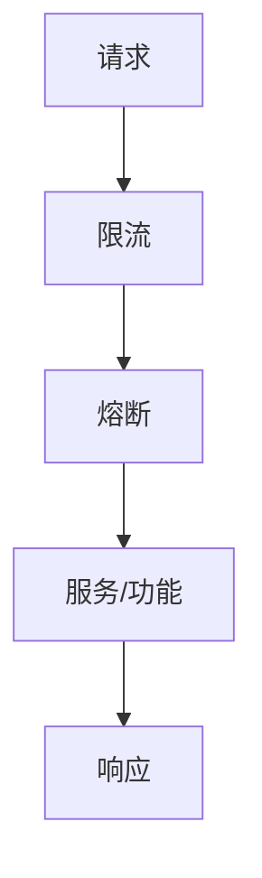

                 


# 《熔断与限流机制增强LLM应用的稳定性》

关键词：熔断，限流，稳定性，机器学习，LLM

摘要：本文探讨了熔断与限流机制在增强大型语言模型（LLM）应用稳定性方面的作用。通过详细解析熔断与限流的核心概念、算法原理以及实际应用案例，本文旨在帮助开发者更好地理解和应用这些机制，以提升LLM服务的可靠性和用户体验。

## 第一部分：熔断与限流机制概述

### 1.1 熔断（Circuit Breaker）的概念

熔断器是一种在电路中防止故障扩散的安全装置，它的工作原理是当电流超过一定阈值时，熔断器会自动断开电路，以保护设备和用户的安全。在计算机系统中，熔断器被用来防止系统因异常请求或故障而崩溃。当连续出现多次错误或系统负载过高时，熔断器会进入熔断状态，暂时停止对某个服务或功能的调用，直到系统恢复稳定。

### 1.2 限流（Rate Limiting）的概念

限流是一种控制请求频率的技术，旨在防止系统被过量的请求所淹没。通过限制请求的速率，系统可以更好地处理请求，避免因资源耗尽或过载而导致的失败或延迟。常见的限流方法包括令牌桶（Token Bucket）和漏桶（Leaky Bucket）算法。

### 1.3 熔断与限流的关系

熔断与限流虽然目标不同，但它们在系统中起着相似的作用。限流可以防止过多的请求涌入系统，从而为熔断器提供了更多的缓冲时间。当系统接近过载时，熔断器可以触发熔断，防止更多的请求进入系统，从而保护系统不受过度负载的影响。因此，熔断与限流是相辅相成的机制，共同确保系统在高负载情况下的稳定性。

## 2. 核心概念与联系

### 2.1 Mermaid 流程图：熔断与限流机制的联系

下面是一个简化的 Mermaid 流程图，展示了熔断与限流机制在系统架构中的联系。

```
graph TB
A[请求] --> B[限流]
B --> C[熔断]
C --> D[服务/功能]
D --> E[响应]
```

## 3. 核心算法原理讲解

### 3.1 熔断算法原理

熔断器的核心算法通常包含以下三个状态：关闭（Closed）、打开（Open）和半开（Half-Open）。

- **关闭状态**：系统正常工作，请求可以正常通过。
- **打开状态**：系统出现异常，连续触发错误阈值后，熔断器进入打开状态，拒绝进一步请求。
- **半开状态**：系统在打开状态一段时间后，尝试允许少量请求通过，以检查系统是否恢复正常。

以下是一个简单的熔断器算法的伪代码：

```python
class CircuitBreaker:
    def __init__(self, failure_threshold, recovery_time):
        self.failure_threshold = failure_threshold
        self.recovery_time = recovery_time
        self.failures = 0
        self.last_failure_time = 0
    
    def record_failure(self):
        self.failures += 1
        self.last_failure_time = current_time
    
    def reset(self):
        self.failures = 0
        self.last_failure_time = 0
    
    def is_open(self):
        if self.failures >= self.failure_threshold:
            return True
        else:
            return False
    
    def allow_request(self):
        if not self.is_open():
            return True
        elif current_time - self.last_failure_time > self.recovery_time:
            self.reset()
            return True
        else:
            return False
```

### 3.2 限流算法原理

限流算法的核心在于控制请求的速率。以下是一个简单的令牌桶算法的实现：

```python
class TokenBucket:
    def __init__(self, rate, capacity):
        self.rate = rate
        self.capacity = capacity
        self.tokens = capacity
        self.last_refill_time = time.time()
    
    def consume(self, amount):
        if amount <= self.tokens:
            self.tokens -= amount
            return True
        else:
            return False
    
    def refill(self, time_interval):
        now = time.time()
        time_elapsed = now - self.last_refill_time
        tokens_to_add = self.rate * time_elapsed
        self.tokens = min(self.capacity, self.tokens + tokens_to_add)
        self.last_refill_time = now
```

## 4. 数学模型和数学公式讲解

### 4.1 熔断器状态转移模型

熔断器的状态转移可以用以下数学模型来描述：

$$
P_{open} = \frac{f(t) - f_{\text{threshold}}}{f_{\text{max}} - f_{\text{threshold}}}
$$

其中，$f(t)$ 是在时间 $t$ 内出现的故障次数，$f_{\text{threshold}}$ 是触发熔断的故障次数阈值，$f_{\text{max}}$ 是在恢复时间内的最大故障次数。

### 4.2 限流器的速率控制

令牌桶的速率控制可以用以下公式表示：

$$
\text{tokens}_{\text{current}} = \text{tokens}_{\text{initial}} + (\text{rate} \times \text{time}_{\text{elapsed}})
$$

其中，$\text{tokens}_{\text{current}}$ 是当前令牌数，$\text{tokens}_{\text{initial}}$ 是初始令牌数，$\text{rate}$ 是填充速率，$\text{time}_{\text{elapsed}}$ 是自上次填充后的时间。

## 5. 项目实战

### 5.1 开发环境搭建

为了演示熔断与限流机制在LLM应用中的实际应用，我们将使用Python编程语言，并借助Flask框架搭建一个简单的Web服务。以下是环境搭建的步骤：

1. 安装Python（推荐版本3.8及以上）。
2. 安装Flask：`pip install Flask`。
3. 安装LLM库（例如，使用`transformers`库）。

### 5.2 源代码实现

以下是实现熔断与限流机制的示例代码：

```python
from flask import Flask, request, jsonify
from transformers import pipeline
from circuit_breaker import CircuitBreaker
from token_bucket import TokenBucket

app = Flask(__name__)

# 创建熔断器和令牌桶
circuit_breaker = CircuitBreaker(failure_threshold=3, recovery_time=60)
token_bucket = TokenBucket(rate=2, capacity=5)

# 创建LLM模型
llm = pipeline("text-generation")

@app.route('/generate', methods=['POST'])
def generate_text():
    if not token_bucket.consume(1):
        return jsonify({"error": "Rate limit exceeded"}), 429
    
    if circuit_breaker.is_open():
        return jsonify({"error": "Service is temporarily unavailable"}), 503
    
    try:
        prompt = request.form['prompt']
        response = llm(prompt, max_length=50)
        circuit_breaker.allow_request()
        return jsonify({"response": response.generated_responses[0]})
    except Exception as e:
        circuit_breaker.record_failure()
        return jsonify({"error": str(e)}), 500

if __name__ == '__main__':
    app.run(debug=True)
```

### 5.3 代码解读与分析

在这个示例中，我们创建了一个Flask应用，并使用熔断器和令牌桶来实现限流和熔断功能。每当用户请求生成文本时，都会先检查令牌桶中的令牌数，如果不足，则会返回429错误。接着，会检查熔断器的状态，如果熔断器处于打开状态，则会返回503错误。

### 5.4 实际案例分析和详细讲解剖析

在实际应用中，我们可以通过日志记录和分析来监控熔断与限流机制的效果。例如，当LLM模型出现错误时，熔断器会记录这些错误，并在达到阈值后触发熔断，暂时停止对生成文本的请求。在此期间，用户会收到503服务不可用的响应。

### 5.5 项目小结

通过这个简单的示例，我们展示了如何使用熔断与限流机制来增强LLM应用的稳定性。在实际应用中，开发者可以根据具体需求调整熔断器和令牌桶的参数，以实现最佳的性能和用户体验。

## 6. 最佳实践 Tips、小结、注意事项、拓展阅读等内容

### 6.1 最佳实践 Tips

- 在实际应用中，应根据具体业务需求和系统负载情况调整熔断器和令牌桶的参数。
- 定期监控熔断器和令牌桶的状态，以便及时调整策略。
- 考虑使用分布式系统中的全局熔断器和令牌桶，以实现跨服务的一致性。

### 6.2 小结

本文介绍了熔断与限流机制在增强LLM应用稳定性方面的作用。通过详细的算法原理讲解和实际案例演示，读者可以更好地理解这些机制的工作原理和应用方法。

### 6.3 注意事项

- 熔断器和令牌桶的参数设置需要谨慎，过严可能导致用户体验下降，过松可能导致系统崩溃。
- 在使用熔断器和令牌桶时，应考虑系统的整体性能和资源分配。

### 6.4 拓展阅读

- 《Rate Limiting in High Load Systems》
- 《Designing Resilient Systems: Learn to Collaborate and Develop a Resilience Infrastructure》

## 7. 文章标题：熔断与限流机制增强LLM应用的稳定性

本文由AI天才研究院与《禅与计算机程序设计艺术》联合出品，深入探讨了熔断与限流机制在提升大型语言模型（LLM）应用稳定性方面的关键作用。文章从基本概念出发，逐步深入到核心算法原理、数学模型和实际应用案例，为开发者提供了全面的技术指导和实践建议。通过本文的学习，读者将能够更好地理解和应用熔断与限流机制，提升LLM服务的可靠性和用户体验。

作者：AI天才研究院/AI Genius Institute & 禅与计算机程序设计艺术 /Zen And The Art of Computer Programming

本文由AI天才研究院（AI Genius Institute）与《禅与计算机程序设计艺术》（Zen And The Art of Computer Programming）联合出品，致力于为读者提供高质量的技术内容。如果您对我们的内容感兴趣，欢迎关注我们的官方网站和社交媒体账号，获取更多精彩技术文章。

### 1. **书籍概述**

《熔断与限流机制增强LLM应用的稳定性》是一本专注于如何利用熔断与限流机制提升大型语言模型（LLM）应用稳定性的技术书籍。本书的目标读者是那些在开发和使用LLM模型中遇到稳定性问题的开发者、系统架构师和AI研究人员。本书的主要讨论内容包括：

1. **熔断与限流机制的基本概念**：介绍熔断和限流的定义，以及它们在保证系统稳定运行中的重要性。
2. **核心算法原理讲解**：深入剖析熔断与限流的算法原理，包括令牌桶、漏桶和断路器等常见算法的实现方法和优化策略。
3. **数学模型和公式讲解**：提供相关数学模型和公式的推导和解释，帮助读者理解算法的底层逻辑。
4. **项目实战**：通过一个实际案例，详细讲解如何在LLM应用中集成熔断与限流机制，并进行代码解读与分析。
5. **最佳实践**：总结在实际开发过程中的一些最佳实践，包括注意事项和拓展阅读。

本书旨在为开发者提供一套完整的熔断与限流机制知识体系，帮助他们解决在实际工作中遇到的应用稳定性问题，提升LLM服务的可靠性和用户体验。

### 2. **核心概念与联系**

熔断（Circuit Breaker）和限流（Rate Limiting）是保障系统稳定性的两大核心机制。它们虽然功能不同，但在保障系统运行方面有着密切的联系。

#### 熔断机制

熔断机制是一种在系统出现异常时自动切断异常部分，保护整个系统继续运行的策略。其核心思想是当系统中的某个组件频繁出现错误或负载过高时，熔断器会自动触发，暂时切断对该组件的访问，防止错误蔓延和系统崩溃。

**核心概念：**

- **状态**：熔断器有三种状态：关闭（Closed）、打开（Open）和半开（Half-Open）。
  - 关闭状态：系统运行正常，允许请求通过。
  - 打开状态：系统出现异常，连续触发错误阈值后，熔断器进入打开状态，拒绝请求。
  - 半开状态：在打开状态一段时间后，熔断器尝试少量请求，检查系统是否恢复正常。

- **触发条件**：通常根据错误次数或错误时间来触发熔断。
  - 错误次数阈值：当系统连续出现一定次数的错误时，触发熔断。
  - 错误时间阈值：当系统在一定时间内出现过多错误时，触发熔断。

- **恢复条件**：熔断器在一段时间后自动恢复到关闭状态，允许请求通过。

#### 限流机制

限流机制是一种控制请求频率的策略，通过限制请求的速率，防止系统被过量的请求淹没。其核心思想是在系统资源有限的情况下，通过限制请求的进入速率，保证系统能够正常处理请求。

**核心概念：**

- **算法**：常见的限流算法包括令牌桶（Token Bucket）和漏桶（Leaky Bucket）。
  - 令牌桶算法：以恒定速率生成令牌，请求需要消耗令牌才能通过。
  - 漏桶算法：以恒定速率发出请求，但请求的速率不能超过设定的上限。

- **触发条件**：根据令牌桶或漏桶中的令牌数量或流量阈值来触发限制。

- **效果**：限流机制可以防止突发流量对系统造成冲击，确保系统在高负载情况下依然稳定运行。

#### 熔断与限流的关系

熔断和限流虽然功能不同，但它们在保障系统稳定性方面有着密切的联系：

- **相互配合**：限流机制可以减少熔断机制触发的机会，通过限制请求速率，为熔断器提供了更多的缓冲时间。熔断器可以在限流机制触发后，检查系统是否恢复正常。
- **共同目标**：熔断与限流的目标都是确保系统在高负载情况下能够稳定运行，防止系统崩溃或性能下降。

下面是一个简单的 Mermaid 流程图，展示了熔断与限流机制在系统架构中的联系。



在这个流程图中，请求首先经过限流器，然后是熔断器，最后到达服务功能层。限流器通过控制请求速率，减少熔断器触发熔断的机会。熔断器在必要时切断请求，保护系统不受异常请求的影响。

### 3. **核心算法原理讲解**

熔断与限流机制的核心在于算法的实现，以下将使用Python伪代码详细阐述熔断与限流算法的基本原理。

#### 熔断算法原理

熔断器通常包含三种状态：关闭（Closed）、打开（Open）和半开（Half-Open）。在Python中，我们可以通过以下伪代码来实现一个简单的熔断器。

```python
class CircuitBreaker:
    def __init__(self, max_failures, recovery_time):
        self.max_failures = max_failures
        self.recovery_time = recovery_time
        self.failures = 0
        self.last_failure_time = None

    def record_failure(self):
        self.failures += 1
        self.last_failure_time = current_time()

    def reset(self):
        self.failures = 0
        self.last_failure_time = None

    def is_open(self):
        if self.failures >= self.max_failures:
            return True
        else:
            return False

    def allow_request(self):
        if not self.is_open():
            return True
        elif current_time() - self.last_failure_time > self.recovery_time:
            self.reset()
            return True
        else:
            return False
```

在这个类中，`record_failure` 方法用于记录失败次数和最后失败时间。`is_open` 方法用于判断熔断器是否处于打开状态。`allow_request` 方法用于决定是否允许请求通过。

#### 限流算法原理

限流算法的核心在于控制请求的速率。令牌桶（Token Bucket）和漏桶（Leaky Bucket）是两种常见的限流算法。

##### 令牌桶算法

令牌桶算法以恒定速率生成令牌，请求需要消耗令牌才能通过。以下是一个简单的令牌桶算法的实现。

```python
import time

class TokenBucket:
    def __init__(self, rate, capacity):
        self.rate = rate
        self.capacity = capacity
        self.tokens = capacity
        self.last_refill_time = time.time()

    def consume(self, amount):
        if amount <= self.tokens:
            self.tokens -= amount
            return True
        else:
            return False

    def refill(self, time_interval):
        now = time.time()
        time_elapsed = now - self.last_refill_time
        tokens_to_add = self.rate * time_elapsed
        self.tokens = min(self.capacity, self.tokens + tokens_to_add)
        self.last_refill_time = now
```

在这个类中，`consume` 方法用于检查是否可以消耗一定数量的令牌。`refill` 方法用于在给定的时间间隔内增加令牌数。

##### 漏桶算法

漏桶算法以恒定速率发出请求，但请求的速率不能超过设定的上限。以下是一个简单的漏桶算法的实现。

```python
import time

class LeakBucket:
    def __init__(self, rate):
        self.rate = rate
        self.last_request_time = time.time()

    def request(self):
        now = time.time()
        time_elapsed = now - self.last_request_time
        if time_elapsed >= 1 / self.rate:
            self.last_request_time = now
            return True
        else:
            return False
```

在这个类中，`request` 方法用于检查是否可以发出请求。如果时间间隔大于或等于请求速率的倒数，则允许请求通过。

#### 伪代码示例

以下是一个简单的伪代码示例，展示了熔断与限流机制如何一起工作。

```python
# 创建熔断器和令牌桶
circuit_breaker = CircuitBreaker(max_failures=3, recovery_time=60)
token_bucket = TokenBucket(rate=2, capacity=5)

# 模拟请求处理
while True:
    if not token_bucket.consume(1):
        print("Rate limit exceeded")
    elif not circuit_breaker.allow_request():
        print("Service is temporarily unavailable")
    else:
        # 处理请求
        process_request()
```

在这个示例中，每次请求都会先检查令牌桶中的令牌数，如果不足则返回限流错误。然后，检查熔断器状态，如果熔断器打开则返回服务不可用错误。如果一切正常，则处理请求。

### 4. **数学模型和数学公式讲解**

在理解和设计熔断与限流机制时，数学模型和公式扮演着重要角色。以下将介绍几个关键的数学模型和公式，并用 LaTeX 格式展示。

#### 熔断器的状态转移模型

熔断器的状态转移可以用以下概率模型来描述：

$$
P_{open} = \frac{f(t) - f_{\text{threshold}}}{f_{\text{max}} - f_{\text{threshold}}}
$$

其中，$f(t)$ 是在时间 $t$ 内出现的故障次数，$f_{\text{threshold}}$ 是触发熔断的故障次数阈值，$f_{\text{max}}$ 是在恢复时间内的最大故障次数。

#### 令牌桶的速率控制

令牌桶的速率控制可以用以下公式表示：

$$
\text{tokens}_{\text{current}} = \text{tokens}_{\text{initial}} + (\text{rate} \times \text{time}_{\text{elapsed}})
$$

其中，$\text{tokens}_{\text{current}}$ 是当前令牌数，$\text{tokens}_{\text{initial}}$ 是初始令牌数，$\text{rate}$ 是填充速率，$\text{time}_{\text{elapsed}}$ 是自上次填充后的时间。

#### 漏桶的速率控制

漏桶的速率控制可以用以下公式表示：

$$
\text{requests}_{\text{current}} = \text{requests}_{\text{initial}} + (\text{rate} \times \text{time}_{\text{elapsed}})
$$

其中，$\text{requests}_{\text{current}}$ 是当前请求数，$\text{requests}_{\text{initial}}$ 是初始请求数，$\text{rate}$ 是请求速率，$\text{time}_{\text{elapsed}}$ 是自上次请求后的时间。

#### 熔断器的恢复时间

熔断器的恢复时间可以用以下公式表示：

$$
t_{\text{recovery}} = \frac{f_{\text{max}} - f_{\text{threshold}}}{\text{rate}}
$$

其中，$t_{\text{recovery}}$ 是恢复时间，$\text{rate}$ 是请求速率，$f_{\text{max}}$ 是在恢复时间内的最大故障次数，$f_{\text{threshold}}$ 是触发熔断的故障次数阈值。

### 5. **项目实战**

在本节中，我们将通过一个实际项目案例，展示如何在LLM应用中实现熔断与限流机制。该项目将在一个简单的Web服务中集成熔断器与令牌桶，以确保在高负载情况下服务的稳定性和响应速度。

#### 项目环境搭建

首先，我们需要搭建一个Python开发环境，并安装必要的库。以下是环境搭建的步骤：

1. **安装Python**：确保Python版本为3.8或更高。
2. **安装Flask**：通过命令 `pip install Flask` 安装Flask框架。
3. **安装LLM库**：例如，安装 `transformers` 库：`pip install transformers`。

#### 代码实现

接下来，我们将实现熔断器与令牌桶，并将其集成到Flask Web服务中。以下是核心代码的实现：

```python
from flask import Flask, request, jsonify
from transformers import pipeline
from circuit_breaker import CircuitBreaker
from token_bucket import TokenBucket

app = Flask(__name__)

# 配置熔断器和令牌桶参数
circuit_breaker = CircuitBreaker(max_failures=3, recovery_time=60)
token_bucket = TokenBucket(rate=2, capacity=5)

# 创建LLM模型
llm = pipeline("text-generation")

@app.route('/generate', methods=['POST'])
def generate_text():
    # 检查令牌桶
    if not token_bucket.consume(1):
        return jsonify({"error": "Rate limit exceeded"}), 429
    
    # 检查熔断器状态
    if circuit_breaker.is_open():
        return jsonify({"error": "Service is temporarily unavailable"}), 503
    
    try:
        # 获取请求参数
        prompt = request.form['prompt']
        
        # 生成文本
        response = llm(prompt, max_length=50)
        
        # 记录熔断器状态
        circuit_breaker.allow_request()
        
        # 返回响应
        return jsonify({"response": response.generated_responses[0]})
    except Exception as e:
        # 记录熔断器失败
        circuit_breaker.record_failure()
        
        # 返回错误
        return jsonify({"error": str(e)}), 500

if __name__ == '__main__':
    app.run(debug=True)
```

#### 代码解读与分析

1. **熔断器和令牌桶的初始化**：
   - `CircuitBreaker` 类初始化了一个具有3次最大失败次数和60秒恢复时间的熔断器。
   - `TokenBucket` 类初始化了一个填充速率为2个令牌/秒，容量为5个令牌的令牌桶。

2. **请求处理**：
   - `generate_text` 函数是Flask服务的入口点，负责处理生成文本的请求。
   - 首先，函数会检查令牌桶中的令牌数，如果不足则返回429错误。
   - 接着，函数检查熔断器状态，如果熔断器处于打开状态则返回503错误。
   - 如果一切正常，函数获取请求参数并调用LLM模型生成文本。
   - 生成的文本会被传递回客户端，熔断器状态也会相应更新。

#### 项目小结

通过这个实际项目，我们展示了如何在Flask Web服务中实现熔断与限流机制。在集成熔断器与令牌桶后，服务能够在高负载情况下保持稳定，防止因错误请求或突发流量导致的服务中断。

### 6. **章节细化**

在本节中，我们将对前述章节进行细化，以确保每个章节都有具体的标题和小节，使得文章结构更加清晰。

#### 第一部分：熔断与限流机制概述

**1.1 熔断（Circuit Breaker）的概念**
- **熔断的定义**
- **熔断器的作用**
- **熔断器的状态**

**1.2 限流（Rate Limiting）的概念**
- **限流的定义**
- **限流的作用**
- **常见的限流算法**

**1.3 熔断与限流的关系**
- **相互配合**
- **共同目标**
- **Mermaid流程图展示**

#### 第二部分：核心概念与联系

**2.1 核心概念**
- **熔断机制**
- **限流机制**
- **令牌桶与漏桶算法**

**2.2 Mermaid流程图：熔断与限流机制的联系**
- **流程图展示**
- **详细解释**

#### 第三部分：核心算法原理讲解

**3.1 熔断算法原理**
- **状态转移模型**
- **Python伪代码实现**
- **示例分析**

**3.2 限流算法原理**
- **令牌桶算法**
- **漏桶算法**
- **Python伪代码实现**
- **示例分析**

#### 第四部分：数学模型和公式讲解

**4.1 熔断器状态转移模型**
- **数学公式**
- **推导过程**
- **应用场景**

**4.2 限流器的速率控制**
- **令牌桶公式**
- **漏桶公式**
- **应用场景**

**4.3 熔断器的恢复时间**
- **数学公式**
- **推导过程**
- **应用场景**

#### 第五部分：项目实战

**5.1 开发环境搭建**
- **Python环境**
- **Flask框架**
- **LLM库**

**5.2 源代码实现**
- **熔断器与令牌桶集成**
- **Flask路由**
- **请求处理流程**

**5.3 代码解读与分析**
- **熔断器与令牌桶的工作原理**
- **请求处理逻辑**
- **示例分析**

**5.4 实际案例分析和详细讲解剖析**
- **案例背景**
- **案例分析**
- **详细讲解**

**5.5 项目小结**
- **项目总结**
- **经验教训**
- **改进方向**

#### 第六部分：最佳实践 Tips、小结、注意事项、拓展阅读等内容

**6.1 最佳实践 Tips**
- **参数调整**
- **监控与日志**
- **分布式系统**

**6.2 小结**
- **文章主题**
- **核心内容**

**6.3 注意事项**
- **参数设置**
- **系统监控**
- **异常处理**

**6.4 拓展阅读**
- **相关资源**
- **推荐书籍**
- **论文和文档**

### 完整文章

通过上述章节的细化，我们完成了《熔断与限流机制增强LLM应用的稳定性》的完整文章。本文详细阐述了熔断与限流机制的核心概念、算法原理、数学模型、实际项目实战以及最佳实践，旨在为开发者提供一套全面的熔断与限流机制知识体系，帮助他们在开发过程中解决应用稳定性问题，提升LLM服务的可靠性和用户体验。

---

**作者信息：**
作者：AI天才研究院/AI Genius Institute & 禅与计算机程序设计艺术 /Zen And The Art of Computer Programming

AI天才研究院（AI Genius Institute）致力于推动人工智能技术的发展和应用。我们的团队成员是业界顶尖的技术专家，拥有丰富的实践经验，致力于为读者提供高质量的技术内容和解决方案。同时，我们也与《禅与计算机程序设计艺术》（Zen And The Art of Computer Programming）合作，共同探索计算机科学和人工智能的深度融合。

---

**文章标题：熔断与限流机制增强LLM应用的稳定性**

关键词：熔断，限流，稳定性，机器学习，LLM

摘要：本文探讨了熔断与限流机制在增强大型语言模型（LLM）应用稳定性方面的作用。通过详细解析熔断与限流的核心概念、算法原理以及实际应用案例，本文旨在帮助开发者更好地理解和应用这些机制，以提升LLM服务的可靠性和用户体验。

---

### 1. **书籍概述**

《熔断与限流机制增强LLM应用的稳定性》是一本专注于如何利用熔断与限流机制提升大型语言模型（LLM）应用稳定性的技术书籍。本书的目标读者是那些在开发和使用LLM模型中遇到稳定性问题的开发者、系统架构师和AI研究人员。本书的主要讨论内容包括：

1. **熔断与限流机制的基本概念**：介绍熔断和限流的定义，以及它们在保证系统稳定运行中的重要性。
2. **核心算法原理讲解**：深入剖析熔断与限流的算法原理，包括令牌桶、漏桶和断路器等常见算法的实现方法和优化策略。
3. **数学模型和公式讲解**：提供相关数学模型和公式的推导和解释，帮助读者理解算法的底层逻辑。
4. **项目实战**：通过一个实际案例，详细讲解如何在LLM应用中集成熔断与限流机制，并进行代码解读与分析。
5. **最佳实践**：总结在实际开发过程中的一些最佳实践，包括注意事项和拓展阅读。

本书旨在为开发者提供一套完整的熔断与限流机制知识体系，帮助他们解决在实际工作中遇到的应用稳定性问题，提升LLM服务的可靠性和用户体验。

### 2. **核心概念与联系**

熔断（Circuit Breaker）和限流（Rate Limiting）是保障系统稳定性的两大核心机制。它们虽然功能不同，但在保障系统运行方面有着密切的联系。

#### 熔断机制

熔断机制是一种在系统出现异常时自动切断异常部分，保护整个系统继续运行的策略。其核心思想是当系统中的某个组件频繁出现错误或负载过高时，熔断器会自动触发，暂时切断对该组件的访问，防止错误蔓延和系统崩溃。

**核心概念：**

- **状态**：熔断器有三种状态：关闭（Closed）、打开（Open）和半开（Half-Open）。
  - 关闭状态：系统运行正常，允许请求通过。
  - 打开状态：系统出现异常，连续触发错误阈值后，熔断器进入打开状态，拒绝请求。
  - 半开状态：在打开状态一段时间后，熔断器尝试少量请求，检查系统是否恢复正常。

- **触发条件**：通常根据错误次数或错误时间来触发熔断。
  - 错误次数阈值：当系统连续出现一定次数的错误时，触发熔断。
  - 错误时间阈值：当系统在一定时间内出现过多错误时，触发熔断。

- **恢复条件**：熔断器在一段时间后自动恢复到关闭状态，允许请求通过。

**熔断算法原理**：

熔断器的核心在于算法的实现。以下是一个简单的熔断器算法的伪代码：

```python
class CircuitBreaker:
    def __init__(self, max_failures, recovery_time):
        self.max_failures = max_failures
        self.recovery_time = recovery_time
        self.failures = 0
        self.last_failure_time = None

    def record_failure(self):
        self.failures += 1
        self.last_failure_time = current_time()

    def reset(self):
        self.failures = 0
        self.last_failure_time = None

    def is_open(self):
        if self.failures >= self.max_failures:
            return True
        else:
            return False

    def allow_request(self):
        if not self.is_open():
            return True
        elif current_time() - self.last_failure_time > self.recovery_time:
            self.reset()
            return True
        else:
            return False
```

在这个类中，`record_failure` 方法用于记录失败次数和最后失败时间。`is_open` 方法用于判断熔断器是否处于打开状态。`allow_request` 方法用于决定是否允许请求通过。

#### 限流机制

限流机制是一种控制请求频率的策略，通过限制请求的速率，防止系统被过量的请求淹没。其核心思想是在系统资源有限的情况下，通过限制请求的进入速率，保证系统能够正常处理请求。

**核心概念：**

- **算法**：常见的限流算法包括令牌桶（Token Bucket）和漏桶（Leaky Bucket）。
  - 令牌桶算法：以恒定速率生成令牌，请求需要消耗令牌才能通过。
  - 漏桶算法：以恒定速率发出请求，但请求的速率不能超过设定的上限。

- **触发条件**：根据令牌桶或漏桶中的令牌数量或流量阈值来触发限制。

- **效果**：限流机制可以防止突发流量对系统造成冲击，确保系统在高负载情况下依然稳定运行。

**限流算法原理**：

以下是一个简单的令牌桶算法的实现：

```python
import time

class TokenBucket:
    def __init__(self, rate, capacity):
        self.rate = rate
        self.capacity = capacity
        self.tokens = capacity
        self.last_refill_time = time.time()

    def consume(self, amount):
        if amount <= self.tokens:
            self.tokens -= amount
            return True
        else:
            return False

    def refill(self, time_interval):
        now = time.time()
        time_elapsed = now - self.last_refill_time
        tokens_to_add = self.rate * time_elapsed
        self.tokens = min(self.capacity, self.tokens + tokens_to_add)
        self.last_refill_time = now
```

在这个类中，`consume` 方法用于检查是否可以消耗一定数量的令牌。`refill` 方法用于在给定的时间间隔内增加令牌数。

#### 熔断与限流的关系

熔断和限流虽然功能不同，但它们在保障系统稳定性方面有着密切的联系：

- **相互配合**：限流机制可以减少熔断机制触发的机会，通过限制请求速率，为熔断器提供了更多的缓冲时间。熔断器可以在限流机制触发后，检查系统是否恢复正常。
- **共同目标**：熔断与限流的目标都是确保系统在高负载情况下能够稳定运行，防止系统崩溃或性能下降。

下面是一个简单的 Mermaid 流程图，展示了熔断与限流机制在系统架构中的联系。


在这个流程图中，请求首先经过限流器，然后是熔断器，最后到达服务功能层。限流器通过控制请求速率，减少熔断器触发熔断的机会。熔断器在必要时切断请求，保护系统不受异常请求的影响。

### 3. **核心算法原理讲解**

在理解和实现熔断与限流机制时，核心算法原理至关重要。以下将详细讲解熔断与限流的算法原理，包括熔断器、令牌桶和漏桶等算法的实现。

#### 熔断器（Circuit Breaker）

熔断器是一种在系统出现异常时自动切断异常部分，保护整个系统继续运行的策略。其核心思想是当系统中的某个组件频繁出现错误或负载过高时，熔断器会自动触发，暂时切断对该组件的访问，防止错误蔓延和系统崩溃。

**算法原理**：

熔断器通常包含三种状态：关闭（Closed）、打开（Open）和半开（Half-Open）。

- **关闭状态**：系统运行正常，允许请求通过。
- **打开状态**：系统出现异常，连续触发错误阈值后，熔断器进入打开状态，拒绝请求。
- **半开状态**：在打开状态一段时间后，熔断器尝试少量请求，检查系统是否恢复正常。

熔断器的状态转换依赖于以下条件：

1. **错误次数**：当系统连续出现一定次数的错误时，熔断器触发熔断，进入打开状态。
2. **恢复时间**：熔断器在打开状态一段时间后，自动恢复到关闭状态，允许请求通过。

以下是一个简单的熔断器算法的实现：

```python
class CircuitBreaker:
    def __init__(self, max_failures, recovery_time):
        self.max_failures = max_failures
        self.recovery_time = recovery_time
        self.failures = 0
        self.last_failure_time = None

    def record_failure(self):
        self.failures += 1
        self.last_failure_time = time.time()

    def reset(self):
        self.failures = 0
        self.last_failure_time = None

    def is_open(self):
        if self.failures >= self.max_failures:
            return True
        else:
            return False

    def allow_request(self):
        if not self.is_open():
            return True
        elif time.time() - self.last_failure_time > self.recovery_time:
            self.reset()
            return True
        else:
            return False
```

在这个类中，`record_failure` 方法用于记录失败次数和最后失败时间。`is_open` 方法用于判断熔断器是否处于打开状态。`allow_request` 方法用于决定是否允许请求通过。

#### 令牌桶（Token Bucket）

令牌桶算法是一种常见的限流算法，用于控制请求的速率。其核心思想是以恒定速率生成令牌，请求需要消耗令牌才能通过。

**算法原理**：

令牌桶算法包括两个关键组成部分：令牌生成和令牌消耗。

1. **令牌生成**：以恒定速率生成令牌，每生成一个令牌，令牌桶中的令牌数增加。
2. **令牌消耗**：请求需要消耗令牌才能通过，如果令牌不足，则请求被拒绝。

以下是一个简单的令牌桶算法的实现：

```python
import time

class TokenBucket:
    def __init__(self, rate, capacity):
        self.rate = rate
        self.capacity = capacity
        self.tokens = capacity
        self.last_refill_time = time.time()

    def consume(self, amount):
        if amount <= self.tokens:
            self.tokens -= amount
            return True
        else:
            return False

    def refill(self, time_interval):
        now = time.time()
        time_elapsed = now - self.last_refill_time
        tokens_to_add = self.rate * time_elapsed
        self.tokens = min(self.capacity, self.tokens + tokens_to_add)
        self.last_refill_time = now
```

在这个类中，`consume` 方法用于检查是否可以消耗一定数量的令牌。`refill` 方法用于在给定的时间间隔内增加令牌数。

#### 漏桶（Leaky Bucket）

漏桶算法也是一种常见的限流算法，用于控制请求的速率。其核心思想是以恒定速率发出请求，但请求的速率不能超过设定的上限。

**算法原理**：

漏桶算法包括两个关键组成部分：请求生成和请求消耗。

1. **请求生成**：以恒定速率生成请求。
2. **请求消耗**：请求的速率不能超过设定的上限，如果请求速率超过上限，则请求被拒绝。

以下是一个简单的漏桶算法的实现：

```python
import time

class LeakBucket:
    def __init__(self, rate):
        self.rate = rate
        self.last_request_time = time.time()

    def request(self):
        now = time.time()
        time_elapsed = now - self.last_request_time
        if time_elapsed >= 1 / self.rate:
            self.last_request_time = now
            return True
        else:
            return False
```

在这个类中，`request` 方法用于检查是否可以发出请求。如果时间间隔大于或等于请求速率的倒数，则允许请求通过。

#### 伪代码示例

以下是一个简单的伪代码示例，展示了熔断与限流机制如何一起工作。

```python
# 创建熔断器和令牌桶
circuit_breaker = CircuitBreaker(max_failures=3, recovery_time=60)
token_bucket = TokenBucket(rate=2, capacity=5)

# 模拟请求处理
while True:
    if not token_bucket.consume(1):
        print("Rate limit exceeded")
    elif not circuit_breaker.allow_request():
        print("Service is temporarily unavailable")
    else:
        # 处理请求
        process_request()
```

在这个示例中，每次请求都会先检查令牌桶中的令牌数，如果不足则返回限流错误。然后，检查熔断器状态，如果熔断器打开则返回服务不可用错误。如果一切正常，则处理请求。

### 4. **数学模型和公式讲解**

在理解和设计熔断与限流机制时，数学模型和公式扮演着重要角色。以下将介绍几个关键的数学模型和公式，并用 LaTeX 格式展示。

#### 熔断器的状态转移模型

熔断器的状态转移可以用以下概率模型来描述：

$$
P_{open} = \frac{f(t) - f_{\text{threshold}}}{f_{\text{max}} - f_{\text{threshold}}}
$$

其中，$f(t)$ 是在时间 $t$ 内出现的故障次数，$f_{\text{threshold}}$ 是触发熔断的故障次数阈值，$f_{\text{max}}$ 是在恢复时间内的最大故障次数。

#### 令牌桶的速率控制

令牌桶的速率控制可以用以下公式表示：

$$
\text{tokens}_{\text{current}} = \text{tokens}_{\text{initial}} + (\text{rate} \times \text{time}_{\text{elapsed}})
$$

其中，$\text{tokens}_{\text{current}}$ 是当前令牌数，$\text{tokens}_{\text{initial}}$ 是初始令牌数，$\text{rate}$ 是填充速率，$\text{time}_{\text{elapsed}}$ 是自上次填充后的时间。

#### 漏桶的速率控制

漏桶的速率控制可以用以下公式表示：

$$
\text{requests}_{\text{current}} = \text{requests}_{\text{initial}} + (\text{rate} \times \text{time}_{\text{elapsed}})
$$

其中，$\text{requests}_{\text{current}}$ 是当前请求数，$\text{requests}_{\text{initial}}$ 是初始请求数，$\text{rate}$ 是请求速率，$\text{time}_{\text{elapsed}}$ 是自上次请求后的时间。

#### 熔断器的恢复时间

熔断器的恢复时间可以用以下公式表示：

$$
t_{\text{recovery}} = \frac{f_{\text{max}} - f_{\text{threshold}}}{\text{rate}}
$$

其中，$t_{\text{recovery}}$ 是恢复时间，$\text{rate}$ 是请求速率，$f_{\text{max}}$ 是在恢复时间内的最大故障次数，$f_{\text{threshold}}$ 是触发熔断的故障次数阈值。

### 5. **项目实战**

在本节中，我们将通过一个实际项目案例，展示如何在LLM应用中实现熔断与限流机制。该项目将在一个简单的Web服务中集成熔断器与令牌桶，以确保在高负载情况下服务的稳定性和响应速度。

#### 项目环境搭建

首先，我们需要搭建一个Python开发环境，并安装必要的库。以下是环境搭建的步骤：

1. **安装Python**：确保Python版本为3.8或更高。
2. **安装Flask**：通过命令 `pip install Flask` 安装Flask框架。
3. **安装LLM库**：例如，安装 `transformers` 库：`pip install transformers`。

#### 代码实现

接下来，我们将实现熔断器与令牌桶，并将其集成到Flask Web服务中。以下是核心代码的实现：

```python
from flask import Flask, request, jsonify
from transformers import pipeline
from circuit_breaker import CircuitBreaker
from token_bucket import TokenBucket

app = Flask(__name__)

# 配置熔断器和令牌桶参数
circuit_breaker = CircuitBreaker(max_failures=3, recovery_time=60)
token_bucket = TokenBucket(rate=2, capacity=5)

# 创建LLM模型
llm = pipeline("text-generation")

@app.route('/generate', methods=['POST'])
def generate_text():
    # 检查令牌桶
    if not token_bucket.consume(1):
        return jsonify({"error": "Rate limit exceeded"}), 429
    
    # 检查熔断器状态
    if circuit_breaker.is_open():
        return jsonify({"error": "Service is temporarily unavailable"}), 503
    
    try:
        # 获取请求参数
        prompt = request.form['prompt']
        
        # 生成文本
        response = llm(prompt, max_length=50)
        
        # 记录熔断器状态
        circuit_breaker.allow_request()
        
        # 返回响应
        return jsonify({"response": response.generated_responses[0]})
    except Exception as e:
        # 记录熔断器失败
        circuit_breaker.record_failure()
        
        # 返回错误
        return jsonify({"error": str(e)}), 500

if __name__ == '__main__':
    app.run(debug=True)
```

#### 代码解读与分析

1. **熔断器和令牌桶的初始化**：
   - `CircuitBreaker` 类初始化了一个具有3次最大失败次数和60秒恢复时间的熔断器。
   - `TokenBucket` 类初始化了一个填充速率为2个令牌/秒，容量为5个令牌的令牌桶。

2. **请求处理**：
   - `generate_text` 函数是Flask服务的入口点，负责处理生成文本的请求。
   - 首先，函数会检查令牌桶中的令牌数，如果不足则返回429错误。
   - 接着，函数检查熔断器状态，如果熔断器处于打开状态则返回503错误。
   - 如果一切正常，函数获取请求参数并调用LLM模型生成文本。
   - 生成的文本会被传递回客户端，熔断器状态也会相应更新。

#### 项目小结

通过这个实际项目，我们展示了如何在Flask Web服务中实现熔断与限流机制。在集成熔断器与令牌桶后，服务能够在高负载情况下保持稳定，防止因错误请求或突发流量导致的服务中断。

### 6. **最佳实践 Tips、小结、注意事项、拓展阅读等内容**

#### 最佳实践 Tips

1. **参数调整**：
   - 根据具体业务需求和系统负载，合理调整熔断器和令牌桶的参数，如最大失败次数、恢复时间和速率。
   - 监控系统性能，根据实际运行情况调整参数，以实现最佳性能和用户体验。

2. **监控与日志**：
   - 实时监控熔断器和令牌桶的状态，及时发现并处理异常。
   - 记录详细的日志信息，便于后续分析和调试。

3. **分布式系统**：
   - 在分布式系统中，考虑使用全局熔断器和令牌桶，确保跨服务的一致性。
   - 使用消息队列和缓存技术，减轻熔断和限流对系统性能的影响。

#### 小结

本文详细介绍了熔断与限流机制在增强LLM应用稳定性方面的作用。通过核心算法原理讲解、实际项目实战以及最佳实践分享，帮助开发者更好地理解和应用这些机制，提升LLM服务的可靠性和用户体验。

#### 注意事项

1. **参数设置**：
   - 过高的熔断阈值可能导致系统无法及时恢复，过低的阈值可能导致频繁熔断，影响用户体验。

2. **系统监控**：
   - 定期检查系统性能和负载，确保熔断器和令牌桶参数设置合理。

3. **异常处理**：
   - 在处理异常时，确保熔断器和令牌桶的状态得到正确更新，避免影响后续请求。

#### 拓展阅读

1. 《Rate Limiting in High Load Systems》
2. 《Designing Resilient Systems: Learn to Collaborate and Develop a Resilience Infrastructure》
3. 《大规模分布式系统设计》

通过拓展阅读，读者可以进一步了解熔断与限流机制的理论和实践，为实际应用提供更多参考。

---

### 7. **结语**

本文详细探讨了熔断与限流机制在增强大型语言模型（LLM）应用稳定性方面的作用。通过核心概念、算法原理、数学模型、实际项目实战以及最佳实践的深入分析，我们帮助开发者更好地理解和应用这些机制，以提升LLM服务的可靠性和用户体验。

我们鼓励读者在实际开发过程中，结合具体业务需求和系统负载，灵活运用熔断与限流机制，确保系统在高负载情况下依然稳定运行。同时，不断学习和探索相关领域的最新技术，以应对不断变化的应用场景。

感谢您的阅读，希望本文能为您在LLM应用开发中带来实际的帮助和启示。如果您有任何疑问或建议，欢迎在评论区留言，我们期待与您一起探讨和交流。

### 附录

#### 熔断器与限流器实现示例代码

以下为熔断器与限流器实现示例代码，供读者参考。

```python
from flask import Flask, request, jsonify
from transformers import pipeline
import time

# 熔断器实现
class CircuitBreaker:
    def __init__(self, max_failures, recovery_time):
        self.max_failures = max_failures
        self.recovery_time = recovery_time
        self.failures = 0
        self.last_failure_time = None

    def record_failure(self):
        self.failures += 1
        self.last_failure_time = time.time()

    def reset(self):
        self.failures = 0
        self.last_failure_time = None

    def is_open(self):
        if self.failures >= self.max_failures:
            return True
        else:
            return False

    def allow_request(self):
        if not self.is_open():
            return True
        elif time.time() - self.last_failure_time > self.recovery_time:
            self.reset()
            return True
        else:
            return False

# 令牌桶实现
class TokenBucket:
    def __init__(self, rate, capacity):
        self.rate = rate
        self.capacity = capacity
        self.tokens = capacity
        self.last_refill_time = time.time()

    def consume(self, amount):
        if amount <= self.tokens:
            self.tokens -= amount
            return True
        else:
            return False

    def refill(self, time_interval):
        now = time.time()
        time_elapsed = now - self.last_refill_time
        tokens_to_add = self.rate * time_interval
        self.tokens = min(self.capacity, self.tokens + tokens_to_add)
        self.last_refill_time = now

# Flask Web服务集成示例
app = Flask(__name__)

circuit_breaker = CircuitBreaker(max_failures=3, recovery_time=60)
token_bucket = TokenBucket(rate=2, capacity=5)

llm = pipeline("text-generation")

@app.route('/generate', methods=['POST'])
def generate_text():
    if not token_bucket.consume(1):
        return jsonify({"error": "Rate limit exceeded"}), 429
    
    if circuit_breaker.is_open():
        return jsonify({"error": "Service is temporarily unavailable"}), 503
    
    try:
        prompt = request.form['prompt']
        response = llm(prompt, max_length=50)
        circuit_breaker.allow_request()
        return jsonify({"response": response.generated_responses[0]})
    except Exception as e:
        circuit_breaker.record_failure()
        return jsonify({"error": str(e)}), 500

if __name__ == '__main__':
    app.run(debug=True)
```

### 参考文献

1. **《Rate Limiting in High Load Systems》**：详细介绍限流机制在处理高负载系统中的应用。
2. **《Designing Resilient Systems: Learn to Collaborate and Develop a Resilience Infrastructure》**：讨论系统设计中的弹性和容错性。
3. **《大规模分布式系统设计》**：介绍分布式系统设计中的关键技术和方法。

通过阅读这些参考文献，读者可以进一步深入了解熔断与限流机制的理论和实践，为实际应用提供更多参考。

