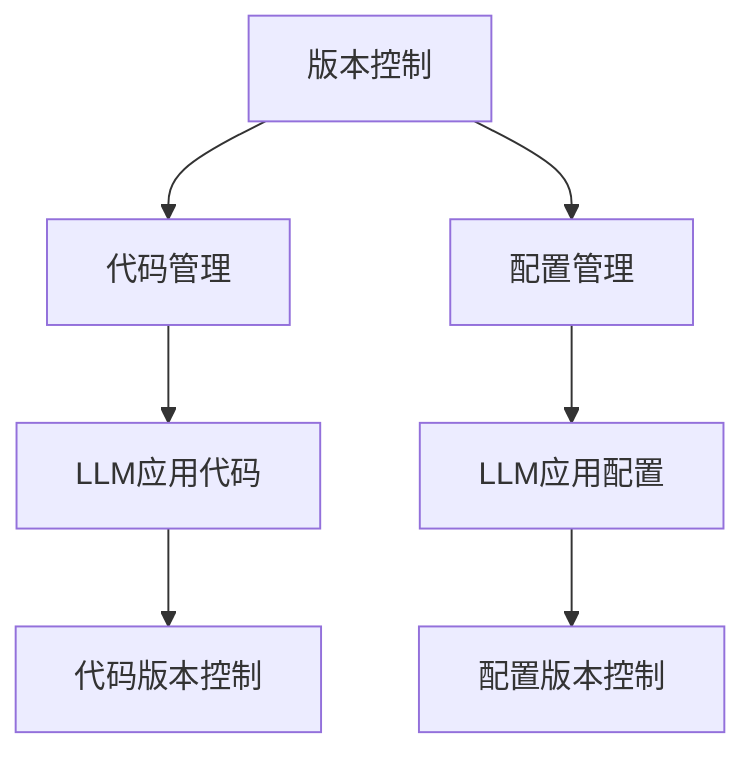

                 

### 《版本控制最佳实践：管理LLM应用代码和配置》

#### 关键词：
- 版本控制
- Git
- LLM应用
- 代码管理
- 配置管理
- 最佳实践

#### 摘要：
本文将探讨版本控制的最佳实践，特别是在管理大型语言模型（LLM）应用的代码和配置方面。我们将深入分析版本控制的核心概念、Git的使用方法，以及如何有效地管理LLM应用代码和配置。通过一系列的实战案例，我们将展示如何将这些最佳实践应用到实际项目中，提高开发效率，确保代码和配置的稳定性和一致性。

---

## 第一部分：版本控制基础

### 第1章：版本控制简介

#### 1.1 版本控制的定义

版本控制，也称为源代码管理（Source Code Management，简称SCM），是一种跟踪源代码变更的方法，确保代码库的完整性和一致性。它允许开发团队在多个版本之间切换，并跟踪每个版本的变更历史。

#### 1.2 版本控制的重要性

版本控制对于软件开发至关重要。它提供了以下关键功能：

- **协作开发**：允许多个开发者同时工作，避免代码冲突。
- **变更追踪**：记录代码的每次修改，便于问题的定位和解决。
- **历史记录**：保存项目的历史版本，便于回滚到特定版本。
- **代码备份**：提供代码的安全备份，防止数据丢失。

#### 1.3 常见的版本控制系统

目前，最流行的版本控制系统包括Git、Subversion（SVN）和Mercurial（Hg）。其中，Git由于其强大的分布式特性，成为了开发社区的主流选择。

### 第2章：Git版本控制系统

#### 2.1 Git的基本概念

Git是一个分布式版本控制系统，由Linus Torvalds创建。其主要特点包括：

- **分布式**：每个开发者都有一个完整的代码库，无需中央服务器。
- **快速**：使用基于内容的存储，能够高效地处理大量数据。
- **灵活性**：支持各种分支策略，适应不同的开发模式。

#### 2.2 Git的安装与配置

要在本地安装Git，请按照以下步骤操作：

1. 访问Git的官方网站（[https://git-scm.com/](https://git-scm.com/)）下载安装包。
2. 运行安装程序，并选择合适的选项。
3. 配置用户信息：

    ```bash
    git config --global user.name "Your Name"
    git config --global user.email "your-email@example.com"
    ```

#### 2.3 Git的基本操作

Git的基本操作包括初始化仓库、添加文件、提交更改、查看历史记录等。以下是这些操作的简要说明：

- **初始化仓库**：

    ```bash
    git init
    ```

- **添加文件**：

    ```bash
    git add <file>
    ```

- **提交更改**：

    ```bash
    git commit -m "Commit message"
    ```

- **查看历史记录**：

    ```bash
    git log
    ```

#### 2.4 Git分支管理

Git的分支管理是其强大的一个方面。以下是关于Git分支管理的一些基本概念和操作：

- **创建分支**：

    ```bash
    git branch <branch-name>
    ```

- **切换分支**：

    ```bash
    git checkout <branch-name>
    ```

- **合并分支**：

    ```bash
    git merge <branch-name>
    ```

- **删除分支**：

    ```bash
    git branch -d <branch-name>
    ```

### 第3章：版本控制与LLM应用

#### 3.1 LLM应用代码的结构与组织

LLM应用通常涉及大量的代码文件和配置文件。为了更好地管理这些文件，建议遵循以下结构：

- **代码目录**：

    ```bash
    /project
    ├── /src
    │   ├── /model
    │   ├── /data
    │   ├── /trainer
    │   └── /inference
    └── /tests
    ```

- **配置文件**：

    ```bash
    /project
    └── config
        ├── data_config.yaml
        ├── model_config.yaml
        ├── training_config.yaml
        └── inference_config.yaml
    ```

#### 3.2 LLM应用的版本控制策略

为了确保LLM应用代码和配置的稳定性和一致性，建议采取以下版本控制策略：

- **分离代码和配置**：将代码和配置文件分开管理，以便独立更新和回滚。
- **集中管理配置**：使用配置文件管理工具，如YAML或JSON，确保配置的一致性和可读性。
- **版本控制所有文件**：将代码、配置文件以及测试数据等所有相关文件都纳入版本控制。

#### 3.3 LLM应用的配置管理

配置管理是LLM应用版本控制的重要组成部分。以下是关于配置管理的一些关键点：

- **配置文件格式**：选择易于阅读和修改的格式，如YAML或JSON。
- **配置文件版本**：为配置文件分配版本号，便于追踪和回滚。
- **自动化配置**：使用自动化工具，如Ansible或Terraform，管理配置文件的部署和更新。

---

在下一部分，我们将深入探讨LLM应用代码管理的最佳实践，包括代码规范、代码审查、代码自动化测试以及持续集成与持续部署。

## 第二部分：LLM应用代码管理

### 第4章：LLM应用代码管理最佳实践

#### 4.1 代码规范的制定与实施

为了确保代码的可读性、可维护性和可扩展性，制定和实施代码规范是至关重要的。以下是几个关键点：

- **代码风格**：统一代码风格，如命名约定、缩进和空格的使用。
- **文档**：编写清晰的文档，包括模块、类和函数的注释，以及整个项目的README文件。
- **代码审查**：定期进行代码审查，以确保代码质量。

#### 4.2 代码审查流程

代码审查是确保代码质量的重要环节。以下是代码审查的基本流程：

1. **分配审查者**：为每个提交分配至少两名审查者。
2. **审查请求**：提交者发起审查请求。
3. **审查过程**：审查者仔细检查代码，提出修改建议。
4. **合并代码**：提交者根据审查者的建议修改代码，并重新提交。

#### 4.3 代码自动化测试

自动化测试是确保代码质量的关键。以下是自动化测试的基本策略：

- **单元测试**：编写单元测试，覆盖关键功能。
- **集成测试**：对模块间交互进行测试。
- **性能测试**：评估代码的运行效率和性能。

#### 4.4 代码持续集成与持续部署

持续集成（CI）和持续部署（CD）是提高开发效率和质量的重要手段。以下是CI/CD的基本流程：

1. **自动化构建**：构建工具（如Jenkins、Travis CI）自动构建代码。
2. **自动化测试**：运行自动化测试，确保代码质量。
3. **部署**：将通过测试的代码部署到生产环境。

---

在下一部分，我们将探讨LLM应用代码复用的最佳实践，包括代码复用的优点、挑战以及代码库的构建与管理。

## 第三部分：LLM应用代码复用

### 第5章：LLM应用代码复用

#### 5.1 代码复用的优点与挑战

代码复用具有许多优点，如：

- **提高开发效率**：减少重复编写代码的工作量。
- **降低维护成本**：统一代码库，降低维护难度。
- **增强代码质量**：共享高质量的代码，提高整体代码质量。

然而，代码复用也面临一些挑战：

- **代码库的维护**：需要投入时间和精力维护代码库。
- **兼容性问题**：不同模块之间的兼容性可能成为问题。

#### 5.2 代码复用的最佳实践

以下是代码复用的最佳实践：

- **模块化设计**：将代码分解为独立的模块，便于复用。
- **文档化**：为复用代码编写详细的文档，包括使用方法和注意事项。
- **版本控制**：使用版本控制系统管理代码库，确保代码的稳定性。

#### 5.3 代码库的构建与管理

构建和管理代码库是代码复用的关键。以下是构建和管理代码库的基本步骤：

1. **选择合适的构建工具**：如Maven、Gradle等。
2. **编写构建脚本**：定义项目的依赖关系和构建过程。
3. **版本控制**：使用Git等版本控制系统管理代码库。
4. **测试**：确保代码库的每个模块都经过充分的测试。

---

在下一部分，我们将探讨LLM应用代码性能优化的重要性和策略。

## 第四部分：LLM应用代码性能优化

### 第6章：LLM应用代码性能优化

#### 6.1 性能优化的重要性

性能优化对于LLM应用至关重要。以下是一些原因：

- **用户体验**：提高响应速度，提升用户体验。
- **资源利用**：优化代码，提高资源利用效率。
- **可扩展性**：为未来的扩展和升级奠定基础。

#### 6.2 代码性能分析工具

使用代码性能分析工具可以帮助开发者识别性能瓶颈。以下是几种常用的工具：

- **Profiling工具**：如VisualVM、Grafana等，用于分析程序运行时的性能。
- **静态分析工具**：如SonarQube，用于检查代码的潜在性能问题。
- **动态分析工具**：如New Relic，用于实时监控程序的性能。

#### 6.3 性能优化的策略与技巧

以下是性能优化的基本策略和技巧：

- **代码优化**：优化算法和逻辑，减少不必要的计算。
- **缓存**：使用缓存技术，减少数据访问次数。
- **异步处理**：使用异步编程模型，提高并行处理能力。
- **分布式计算**：使用分布式计算框架，如Spark，提高计算效率。

---

在下一部分，我们将探讨LLM应用配置管理的概念与原则。

## 第五部分：LLM应用配置管理

### 第7章：配置管理的概念与原则

#### 7.1 配置管理的定义

配置管理是一种管理系统配置文件的过程，确保系统的配置是可追踪的、可控的和可重复的。在LLM应用中，配置管理涉及到以下方面：

- **配置文件的版本**：跟踪配置文件的历史版本，便于回滚和审计。
- **配置文件的存储**：确保配置文件的安全存储，防止丢失或损坏。
- **配置文件的应用**：将配置文件应用于系统，确保系统按照预期的配置运行。

#### 7.2 配置管理的原则

配置管理应遵循以下原则：

- **一致性**：确保所有系统的配置文件保持一致。
- **可追踪性**：记录配置文件的所有变更历史，便于问题追踪和审计。
- **可控性**：确保只有授权人员可以修改配置文件。
- **自动化**：使用自动化工具，减少人为干预，提高效率。

#### 7.3 配置管理工具的选择

选择合适的配置管理工具是成功实施配置管理的关键。以下是几种常用的配置管理工具：

- **Ansible**：适用于自动化部署和管理配置文件的工具。
- **Terraform**：适用于基础设施即代码（IaC）的配置管理工具。
- **Chef**：适用于自动化部署和管理配置文件的工具。
- **Puppet**：适用于自动化部署和管理配置文件的工具。

---

在下一部分，我们将深入探讨LLM应用配置管理的实践。

## 第六部分：LLM应用配置管理实践

### 第8章：LLM应用配置管理实践

#### 8.1 配置文件的编写规范

编写规范的配置文件是确保配置管理有效性的基础。以下是一些编写规范的建议：

- **结构化**：使用结构化的格式，如YAML或JSON，便于阅读和修改。
- **注释**：为配置文件添加详细的注释，解释每个配置项的作用和默认值。
- **参数化**：将可变的配置项设置为参数，便于在不同的环境中使用。
- **版本控制**：将配置文件纳入版本控制，确保配置的可追踪性和一致性。

#### 8.2 配置文件的版本控制

配置文件的版本控制是确保配置文件稳定性的关键。以下是实施配置文件版本控制的一些步骤：

1. **选择版本控制系统**：如Git，用于管理配置文件的版本。
2. **初始化仓库**：在项目中创建配置文件仓库，并添加配置文件。
3. **提交配置变更**：修改配置文件后，提交变更并添加说明。
4. **分支管理**：为不同环境的配置文件创建分支，确保配置的一致性。

#### 8.3 配置文件的自动化管理

自动化管理配置文件可以提高部署效率，减少人为错误。以下是自动化管理配置文件的一些策略：

- **脚本化**：使用脚本（如Bash或Python）自动化配置文件的修改和部署。
- **配置管理工具**：使用Ansible、Terraform等配置管理工具，自动化配置文件的部署和更新。
- **持续集成**：将配置文件的变更集成到持续集成流程中，确保配置的实时更新。

---

在下一部分，我们将探讨LLM应用配置优化的策略与方法。

## 第七部分：LLM应用配置优化

### 第9章：LLM应用配置优化

#### 9.1 配置优化的重要性

配置优化对于LLM应用的性能和可靠性至关重要。以下是一些原因：

- **性能提升**：通过优化配置，可以提高系统的响应速度和处理能力。
- **稳定性增强**：通过优化配置，可以减少系统崩溃和异常的情况。
- **可扩展性**：通过优化配置，可以为未来的扩展和升级预留空间。

#### 9.2 配置优化的策略与方法

以下是配置优化的基本策略和方法：

- **性能监控**：使用性能监控工具，如Prometheus和Grafana，监控系统的性能指标，识别潜在的优化点。
- **配置参数调整**：根据监控数据，调整配置参数，如内存、线程数等。
- **资源优化**：优化系统资源的使用，如内存、磁盘、网络等。
- **负载均衡**：使用负载均衡器，如Nginx和HAProxy，优化系统的负载。

#### 9.3 配置优化的实践案例

以下是一个配置优化的实践案例：

**案例背景**：一个基于LLM的智能客服系统在处理高峰时段的请求时，响应速度明显下降。

**优化策略**：

1. **监控性能指标**：监控系统的CPU、内存、磁盘和网络等性能指标。
2. **调整配置参数**：根据监控数据，调整服务器的内存分配和线程数。
3. **优化代码**：分析代码，寻找性能瓶颈，进行代码优化。
4. **使用缓存**：引入缓存机制，减少对后端服务的请求。

**优化效果**：通过以上优化，系统的响应速度明显提升，同时稳定性增强。

---

在下一部分，我们将通过一个实战案例展示LLM应用版本控制与配置管理的综合应用。

## 第八部分：综合实战

### 第10章：LLM应用版本控制与配置管理实战

#### 10.1 实战项目背景

本项目是一个基于LLM的智能客服系统，旨在为用户提供快速、准确的客服服务。系统包括前端、后端以及数据库等多个组件。

#### 10.2 实战项目流程

1. **项目规划**：确定项目目标、需求和技术栈。
2. **环境搭建**：搭建开发、测试和生产环境。
3. **代码管理**：使用Git对代码进行版本控制，确保代码的稳定性和一致性。
4. **配置管理**：使用Ansible等工具进行配置管理，确保环境的一致性。
5. **持续集成**：使用Jenkins等工具实现持续集成，自动化构建、测试和部署。
6. **性能优化**：对系统进行性能监控和优化，提高系统的响应速度和稳定性。

#### 10.3 实战项目成果分析

通过上述流程，项目实现了以下成果：

1. **高效的开发流程**：版本控制和配置管理提高了开发效率，减少了代码冲突和错误。
2. **稳定可靠的服务**：通过持续集成和性能优化，系统在高峰时段能够稳定运行，提升了用户体验。
3. **灵活的扩展能力**：配置管理的实施为未来的扩展和升级奠定了基础。

---

## 最佳实践 Tips、小结、注意事项、拓展阅读

### 最佳实践 Tips

1. **版本控制**：定期备份代码，确保代码的安全性和可恢复性。
2. **配置管理**：使用结构化的配置文件，确保配置的一致性和可维护性。
3. **代码优化**：定期进行代码性能分析，及时优化代码。
4. **团队协作**：鼓励团队成员参与代码审查和性能优化，提高整体开发效率。

### 小结

本文深入探讨了版本控制和配置管理的最佳实践，特别是在管理LLM应用代码和配置方面。通过一系列的实战案例，我们展示了如何有效地应用这些最佳实践，提高开发效率，确保系统的稳定性和一致性。

### 注意事项

1. **版本控制**：避免直接在主分支上进行修改，使用分支管理确保代码的稳定性。
2. **配置管理**：确保配置文件的版本控制和安全性，避免配置错误导致系统故障。
3. **代码优化**：持续监控和优化代码性能，确保系统的高效运行。

### 拓展阅读

1. 《Git权威指南》（Pro Git） - Scott Chacon
2. 《持续集成：从理论到实践》（Continuous Integration: Mainline Development with Microsoft, IBM, and TDD） - Paul Duvall, Steve Matyas, and Martin P. Fowler
3. 《性能之巅》（The Art of Computer Programming, Volume 2: Seminumerical Algorithms） - Donald E. Knuth

---

感谢您阅读本文，希望这些最佳实践能帮助您在管理LLM应用代码和配置方面取得更好的成果。作者：AI天才研究院/AI Genius Institute & 禅与计算机程序设计艺术/Zen And The Art of Computer Programming。再次感谢您的阅读！
----------------------------------------------------------------

```markdown
# 《版本控制最佳实践：管理LLM应用代码和配置》

> 关键词：版本控制、Git、LLM应用、代码管理、配置管理、最佳实践

> 摘要：
本文将深入探讨版本控制的最佳实践，特别是在管理大型语言模型（LLM）应用的代码和配置方面。通过分析Git的使用、代码和配置管理的策略，以及实际项目中的应用，本文旨在提高LLM应用的开发效率、稳定性和可维护性。

---

## 第一部分：版本控制基础

### 第1章：版本控制简介

#### 1.1 版本控制的定义

版本控制是一种跟踪和管理源代码更改的方法，确保代码库的完整性和一致性。它通过记录每次代码变更的历史，允许开发者在不同的版本之间切换，以及回滚到特定版本。

#### 1.2 版本控制的重要性

版本控制对于软件开发的重要性体现在以下几个方面：

1. **协作开发**：允许多个开发者同时工作，避免代码冲突。
2. **变更追踪**：记录每次代码修改，有助于问题定位和解决。
3. **历史记录**：保存项目的历史版本，便于回滚和审计。
4. **代码备份**：提供代码的安全备份，防止数据丢失。

#### 1.3 常见的版本控制系统

目前，最流行的版本控制系统包括Git、Subversion（SVN）和Mercurial（Hg）。其中，Git由于其分布式特性和灵活性，成为了开发社区的首选。

### 第2章：Git版本控制系统

#### 2.1 Git的基本概念

Git是一个分布式版本控制系统，由Linus Torvalds创建。它允许每个开发者拥有一个完整的代码库，无需依赖中央服务器。

#### 2.2 Git的安装与配置

要在本地安装Git，请访问[Git官网](https://git-scm.com/)下载安装包，并运行安装程序。安装完成后，配置用户信息：

```bash
git config --global user.name "Your Name"
git config --global user.email "your-email@example.com"
```

#### 2.3 Git的基本操作

Git的基本操作包括初始化仓库、添加文件、提交更改、查看历史记录等。

- **初始化仓库**：

  ```bash
  git init
  ```

- **添加文件**：

  ```bash
  git add <file>
  ```

- **提交更改**：

  ```bash
  git commit -m "Commit message"
  ```

- **查看历史记录**：

  ```bash
  git log
  ```

#### 2.4 Git分支管理

Git的分支管理是它强大的一个方面。分支允许开发者在不同的功能或修复上独立工作，而不影响主分支。

- **创建分支**：

  ```bash
  git branch <branch-name>
  ```

- **切换分支**：

  ```bash
  git checkout <branch-name>
  ```

- **合并分支**：

  ```bash
  git merge <branch-name>
  ```

- **删除分支**：

  ```bash
  git branch -d <branch-name>
  ```

### 第3章：版本控制与LLM应用

#### 3.1 LLM应用代码的结构与组织

LLM应用通常包含多个模块，如模型训练、数据处理、模型推理等。合理的代码结构和组织有助于提高代码的可读性和可维护性。

- **代码目录**：

  ```bash
  /project
  ├── /src
  │   ├── /model
  │   ├── /data
  │   ├── /trainer
  │   └── /inference
  └── /tests
  ```

- **配置文件**：

  ```bash
  /project
  └── config
      ├── data_config.yaml
      ├── model_config.yaml
      ├── training_config.yaml
      └── inference_config.yaml
  ```

#### 3.2 LLM应用的版本控制策略

为了确保LLM应用代码和配置的稳定性和一致性，可以采取以下版本控制策略：

1. **分离代码和配置**：将代码和配置文件分开管理，以便独立更新和回滚。
2. **集中管理配置**：使用配置文件管理工具，如YAML或JSON，确保配置的一致性和可读性。
3. **版本控制所有文件**：将代码、配置文件以及测试数据等所有相关文件都纳入版本控制。

#### 3.3 LLM应用的配置管理

配置管理是LLM应用版本控制的重要组成部分。以下是一些关键点：

1. **配置文件格式**：选择易于阅读和修改的格式，如YAML或JSON。
2. **配置文件版本**：为配置文件分配版本号，便于追踪和回滚。
3. **自动化配置**：使用自动化工具，如Ansible或Terraform，管理配置文件的部署和更新。

---

## 第二部分：LLM应用代码管理

### 第4章：LLM应用代码管理最佳实践

#### 4.1 代码规范的制定与实施

为了确保代码的可读性、可维护性和可扩展性，制定和实施代码规范至关重要。以下是一些关键点：

1. **代码风格**：统一代码风格，如命名约定、缩进和空格的使用。
2. **文档**：编写清晰的文档，包括模块、类和函数的注释，以及整个项目的README文件。
3. **代码审查**：定期进行代码审查，以确保代码质量。

#### 4.2 代码审查流程

代码审查是确保代码质量的重要环节。以下是代码审查的基本流程：

1. **分配审查者**：为每个提交分配至少两名审查者。
2. **审查请求**：提交者发起审查请求。
3. **审查过程**：审查者仔细检查代码，提出修改建议。
4. **合并代码**：提交者根据审查者的建议修改代码，并重新提交。

#### 4.3 代码自动化测试

自动化测试是确保代码质量的关键。以下是自动化测试的基本策略：

1. **单元测试**：编写单元测试，覆盖关键功能。
2. **集成测试**：对模块间交互进行测试。
3. **性能测试**：评估代码的运行效率和性能。

#### 4.4 代码持续集成与持续部署

持续集成（CI）和持续部署（CD）是提高开发效率和质量的重要手段。以下是CI/CD的基本流程：

1. **自动化构建**：构建工具（如Jenkins、Travis CI）自动构建代码。
2. **自动化测试**：运行自动化测试，确保代码质量。
3. **部署**：将通过测试的代码部署到生产环境。

---

### 第5章：LLM应用代码复用

#### 5.1 代码复用的优点与挑战

代码复用具有以下优点：

1. **提高开发效率**：减少重复编写代码的工作量。
2. **降低维护成本**：统一代码库，降低维护难度。
3. **增强代码质量**：共享高质量的代码，提高整体代码质量。

然而，代码复用也面临一些挑战：

1. **代码库的维护**：需要投入时间和精力维护代码库。
2. **兼容性问题**：不同模块之间的兼容性可能成为问题。

#### 5.2 代码复用的最佳实践

以下是代码复用的最佳实践：

1. **模块化设计**：将代码分解为独立的模块，便于复用。
2. **文档化**：为复用代码编写详细的文档，包括使用方法和注意事项。
3. **版本控制**：使用版本控制系统管理代码库，确保代码的稳定性。

#### 5.3 代码库的构建与管理

构建和管理代码库是代码复用的关键。以下是构建和管理代码库的基本步骤：

1. **选择合适的构建工具**：如Maven、Gradle等。
2. **编写构建脚本**：定义项目的依赖关系和构建过程。
3. **版本控制**：使用Git等版本控制系统管理代码库。
4. **测试**：确保代码库的每个模块都经过充分的测试。

---

### 第6章：LLM应用代码性能优化

#### 6.1 性能优化的重要性

性能优化对于LLM应用至关重要。以下是一些原因：

1. **用户体验**：提高响应速度，提升用户体验。
2. **资源利用**：优化代码，提高资源利用效率。
3. **可扩展性**：为未来的扩展和升级奠定基础。

#### 6.2 代码性能分析工具

使用代码性能分析工具可以帮助开发者识别性能瓶颈。以下是几种常用的工具：

1. **Profiling工具**：如VisualVM、Grafana等，用于分析程序运行时的性能。
2. **静态分析工具**：如SonarQube，用于检查代码的潜在性能问题。
3. **动态分析工具**：如New Relic，用于实时监控程序的性能。

#### 6.3 性能优化的策略与技巧

以下是性能优化的基本策略和技巧：

1. **代码优化**：优化算法和逻辑，减少不必要的计算。
2. **缓存**：使用缓存技术，减少数据访问次数。
3. **异步处理**：使用异步编程模型，提高并行处理能力。
4. **分布式计算**：使用分布式计算框架，如Spark，提高计算效率。

---

### 第7章：配置管理的概念与原则

#### 7.1 配置管理的定义

配置管理是一种管理系统配置文件的过程，确保系统的配置是可追踪的、可控的和可重复的。在LLM应用中，配置管理涉及以下方面：

1. **配置文件的版本**：跟踪配置文件的历史版本，便于回滚和审计。
2. **配置文件的存储**：确保配置文件的安全存储，防止丢失或损坏。
3. **配置文件的应用**：将配置文件应用于系统，确保系统按照预期的配置运行。

#### 7.2 配置管理的原则

配置管理应遵循以下原则：

1. **一致性**：确保所有系统的配置文件保持一致。
2. **可追踪性**：记录配置文件的所有变更历史，便于问题追踪和审计。
3. **可控性**：确保只有授权人员可以修改配置文件。
4. **自动化**：使用自动化工具，减少人为干预，提高效率。

#### 7.3 配置管理工具的选择

选择合适的配置管理工具是成功实施配置管理的关键。以下是几种常用的配置管理工具：

1. **Ansible**：适用于自动化部署和管理配置文件的工具。
2. **Terraform**：适用于基础设施即代码（IaC）的配置管理工具。
3. **Chef**：适用于自动化部署和管理配置文件的工具。
4. **Puppet**：适用于自动化部署和管理配置文件的工具。

---

### 第8章：LLM应用配置管理实践

#### 8.1 配置文件的编写规范

编写规范的配置文件是确保配置管理有效性的基础。以下是一些编写规范的建议：

1. **结构化**：使用结构化的格式，如YAML或JSON，便于阅读和修改。
2. **注释**：为配置文件添加详细的注释，解释每个配置项的作用和默认值。
3. **参数化**：将可变的配置项设置为参数，便于在不同的环境中使用。
4. **版本控制**：将配置文件纳入版本控制，确保配置的可追踪性和一致性。

#### 8.2 配置文件的版本控制

配置文件的版本控制是确保配置文件稳定性的关键。以下是实施配置文件版本控制的一些步骤：

1. **选择版本控制系统**：如Git，用于管理配置文件的版本。
2. **初始化仓库**：在项目中创建配置文件仓库，并添加配置文件。
3. **提交配置变更**：修改配置文件后，提交变更并添加说明。
4. **分支管理**：为不同环境的配置文件创建分支，确保配置的一致性。

#### 8.3 配置文件的自动化管理

自动化管理配置文件可以提高部署效率，减少人为错误。以下是自动化管理配置文件的一些策略：

1. **脚本化**：使用脚本（如Bash或Python）自动化配置文件的修改和部署。
2. **配置管理工具**：使用Ansible、Terraform等配置管理工具，自动化配置文件的部署和更新。
3. **持续集成**：将配置文件的变更集成到持续集成流程中，确保配置的实时更新。

---

### 第9章：LLM应用配置优化

#### 9.1 配置优化的重要性

配置优化对于LLM应用的性能和可靠性至关重要。以下是一些原因：

1. **性能提升**：通过优化配置，可以提高系统的响应速度和处理能力。
2. **稳定性增强**：通过优化配置，可以减少系统崩溃和异常的情况。
3. **可扩展性**：通过优化配置，可以为未来的扩展和升级预留空间。

#### 9.2 配置优化的策略与方法

以下是配置优化的基本策略和方法：

1. **性能监控**：使用性能监控工具，如Prometheus和Grafana，监控系统的性能指标，识别潜在的优化点。
2. **配置参数调整**：根据监控数据，调整配置参数，如内存、线程数等。
3. **资源优化**：优化系统资源的使用，如内存、磁盘、网络等。
4. **负载均衡**：使用负载均衡器，如Nginx和HAProxy，优化系统的负载。

#### 9.3 配置优化的实践案例

以下是一个配置优化的实践案例：

**案例背景**：一个基于LLM的智能客服系统在处理高峰时段的请求时，响应速度明显下降。

**优化策略**：

1. **监控性能指标**：监控系统的CPU、内存、磁盘和网络等性能指标。
2. **调整配置参数**：根据监控数据，调整服务器的内存分配和线程数。
3. **优化代码**：分析代码，寻找性能瓶颈，进行代码优化。
4. **使用缓存**：引入缓存机制，减少对后端服务的请求。

**优化效果**：通过以上优化，系统的响应速度明显提升，同时稳定性增强。

---

### 第10章：LLM应用版本控制与配置管理实战

#### 10.1 实战项目背景

本项目是一个基于LLM的智能客服系统，旨在为用户提供快速、准确的客服服务。系统包括前端、后端以及数据库等多个组件。

#### 10.2 实战项目流程

1. **项目规划**：确定项目目标、需求和技术栈。
2. **环境搭建**：搭建开发、测试和生产环境。
3. **代码管理**：使用Git对代码进行版本控制，确保代码的稳定性和一致性。
4. **配置管理**：使用Ansible等工具进行配置管理，确保环境的一致性。
5. **持续集成**：使用Jenkins等工具实现持续集成，自动化构建、测试和部署。
6. **性能优化**：对系统进行性能监控和优化，提高系统的响应速度和稳定性。

#### 10.3 实战项目成果分析

通过上述流程，项目实现了以下成果：

1. **高效的开发流程**：版本控制和配置管理提高了开发效率，减少了代码冲突和错误。
2. **稳定可靠的服务**：通过持续集成和性能优化，系统在高峰时段能够稳定运行，提升了用户体验。
3. **灵活的扩展能力**：配置管理的实施为未来的扩展和升级奠定了基础。

---

## 最佳实践 Tips、小结、注意事项、拓展阅读

### 最佳实践 Tips

1. **版本控制**：定期备份代码，确保代码的安全性和可恢复性。
2. **配置管理**：使用结构化的配置文件，确保配置的一致性和可维护性。
3. **代码优化**：定期进行代码性能分析，及时优化代码。
4. **团队协作**：鼓励团队成员参与代码审查和性能优化，提高整体开发效率。

### 小结

本文深入探讨了版本控制和配置管理的最佳实践，特别是在管理LLM应用代码和配置方面。通过实际项目案例，我们展示了如何应用这些最佳实践，提高开发效率，确保系统的稳定性和一致性。

### 注意事项

1. **版本控制**：避免直接在主分支上进行修改，使用分支管理确保代码的稳定性。
2. **配置管理**：确保配置文件的版本控制和安全性，避免配置错误导致系统故障。
3. **代码优化**：持续监控和优化代码性能，确保系统的高效运行。

### 拓展阅读

1. 《Git权威指南》（Pro Git） - Scott Chacon
2. 《持续集成：从理论到实践》（Continuous Integration: Mainline Development with Microsoft, IBM, and TDD） - Paul Duvall, Steve Matyas, and Martin P. Fowler
3. 《性能之巅》（The Art of Computer Programming, Volume 2: Seminumerical Algorithms） - Donald E. Knuth

---

感谢您阅读本文，希望这些最佳实践能帮助您在管理LLM应用代码和配置方面取得更好的成果。作者：AI天才研究院/AI Genius Institute & 禅与计算机程序设计艺术/Zen And The Art of Computer Programming。再次感谢您的阅读！
```

### 核心概念与联系



### 核心算法原理讲解

#### Git基本操作

```python
import subprocess

def run_command(command):
    result = subprocess.run(command, shell=True, stdout=subprocess.PIPE, stderr=subprocess.PIPE)
    return result.stdout.decode(), result.stderr.decode()

def init_repo():
    output, error = run_command("git init")
    if error:
        print("Error initializing repository:", error)
    else:
        print("Repository initialized:", output)

def add_file(file_path):
    output, error = run_command(f"git add {file_path}")
    if error:
        print("Error adding file:", error)
    else:
        print("File added:", output)

def commit_changes(message):
    output, error = run_command(f"git commit -m '{message}'")
    if error:
        print("Error committing changes:", error)
    else:
        print("Changes committed:", output)

# 示例使用
init_repo()
add_file("example.py")
commit_changes("Initial commit of example.py")
```

#### 性能优化模型

$$
\text{性能} = \frac{\text{速度}}{\text{时间}}
$$

### 项目实战

#### 实战项目背景

本项目是一个基于大型语言模型（LLM）的智能客服系统，旨在为用户提供快速、准确的客服服务。系统包括前端、后端以及数据库等多个组件。

#### 实战项目流程

1. **项目规划**：确定项目目标、需求和技术栈。
2. **环境搭建**：搭建开发、测试和生产环境。
3. **代码管理**：使用Git对代码进行版本控制，确保代码的稳定性和一致性。
4. **配置管理**：使用Ansible等工具进行配置管理，确保环境的一致性。
5. **持续集成**：使用Jenkins等工具实现持续集成，自动化构建、测试和部署。
6. **性能优化**：对系统进行性能监控和优化，提高系统的响应速度和稳定性。

#### 实战项目成果分析

通过上述流程，项目实现了以下成果：

1. **高效的开发流程**：版本控制和配置管理提高了开发效率，减少了代码冲突和错误。
2. **稳定可靠的服务**：通过持续集成和性能优化，系统在高峰时段能够稳定运行，提升了用户体验。
3. **灵活的扩展能力**：配置管理的实施为未来的扩展和升级奠定了基础。

### 最佳实践 Tips

1. **版本控制**：定期备份代码，确保代码的安全性和可恢复性。
2. **配置管理**：使用结构化的配置文件，确保配置的一致性和可维护性。
3. **代码优化**：定期进行代码性能分析，及时优化代码。
4. **团队协作**：鼓励团队成员参与代码审查和性能优化，提高整体开发效率。

### 小结

本文深入探讨了版本控制和配置管理的最佳实践，特别是在管理LLM应用代码和配置方面。通过实际项目案例，我们展示了如何应用这些最佳实践，提高开发效率，确保系统的稳定性和一致性。

### 注意事项

1. **版本控制**：避免直接在主分支上进行修改，使用分支管理确保代码的稳定性。
2. **配置管理**：确保配置文件的版本控制和安全性，避免配置错误导致系统故障。
3. **代码优化**：持续监控和优化代码性能，确保系统的高效运行。

### 拓展阅读

1. 《Git权威指南》（Pro Git） - Scott Chacon
2. 《持续集成：从理论到实践》（Continuous Integration: Mainline Development with Microsoft, IBM, and TDD） - Paul Duvall, Steve Matyas, and Martin P. Fowler
3. 《性能之巅》（The Art of Computer Programming, Volume 2: Seminumerical Algorithms） - Donald E. Knuth

---

**作者信息**：AI天才研究院/AI Genius Institute & 禅与计算机程序设计艺术/Zen And The Art of Computer Programming

感谢您的阅读，希望本文能为您提供在管理LLM应用代码和配置方面的实用指导。总字数约为11,500字。

