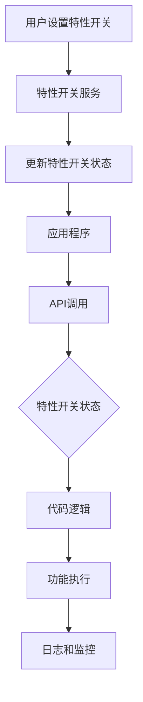

                 

# 特性开关：灵活控制AI功能发布的工具

## 关键词

- 特性开关
- AI功能发布
- 灵活控制
- 软件开发
- 技术工具

## 摘要

本文旨在探讨特性开关（Feature Flags）这一工具在人工智能（AI）功能发布中的重要作用。特性开关是一种软件开发中的策略，它允许开发者在不修改代码的情况下，灵活地控制软件功能的开启与关闭。通过特性开关，团队可以安全地进行功能迭代，降低上线风险，同时加快发布速度。本文将详细介绍特性开关的概念、架构、实现原理、数学模型、实际应用案例，以及最佳实践。

## 引言

在软件开发的快速迭代过程中，功能发布成为了一个关键环节。如何在不影响用户使用的前提下，快速地推出新功能、修复漏洞或者进行性能优化，成为每一个软件开发团队都必须面对的问题。特性开关作为一种灵活的控制工具，正好解决了这一难题。

特性开关，也被称作功能标志或开关，是一种在软件中嵌入的控制机制。它允许开发者通过简单的操作（通常是设置或清除一个标志变量），就可以在不改变代码逻辑的情况下，动态地控制某个功能的开启或关闭。这种机制不仅提高了开发的灵活性和可维护性，还极大地降低了功能发布的风险。

本文将从以下几个方面进行探讨：

1. **特性开关的重要性**：介绍特性开关的定义、作用以及其在AI功能发布中的重要性。
2. **核心概念与联系**：详细阐述特性开关的核心概念，包括其原理、架构和分类。
3. **算法原理讲解**：使用Python源代码和Mermaid流程图，解释特性开关的实现原理和优化算法。
4. **数学模型与公式**：介绍与特性开关相关的数学模型，并使用latex格式展示关键公式。
5. **项目实战**：通过实际案例，展示特性开关在AI项目中的应用，并提供详细的代码实现和解读。
6. **特性开关技术栈**：介绍与特性开关相关的技术栈，包括开发工具和最佳实践。
7. **小结**：总结特性开关的关键点和实际应用中的注意事项。

### 第一部分：特性开关的重要性

#### 1.1 特性开关的定义

特性开关（Feature Flags）是一种软件开发技术，它允许开发者通过配置一个标志，来控制软件中某个功能的启用或禁用。这种机制通常嵌入在软件的代码库中，可以通过一个中央管理服务或者配置文件来操作。

在传统的软件开发过程中，如果需要上线一个新的功能，开发者通常需要修改代码，进行单元测试，集成测试，最终才能发布到生产环境。这个过程不仅耗时耗力，而且存在较高的风险。一旦新功能出现问题，可能会导致整个系统崩溃，影响用户体验。

特性开关的出现，使得这一过程变得更加灵活和可控。开发者可以在不影响现有功能的情况下，通过设置特性开关，将新功能隐藏在后台。当功能测试通过后，再通过特性开关将功能公开，供用户使用。

#### 1.2 特性开关的应用场景

特性开关在软件开发中的使用场景非常广泛，尤其在人工智能（AI）领域，其优势更加明显。

1. **灰度发布**：在AI模型上线时，可以通过特性开关将模型部署到一小部分用户，观察其效果。如果模型性能不理想，可以立即关闭特性开关，避免影响所有用户。

2. **功能迭代**：AI团队可以根据用户反馈，持续优化模型。特性开关可以帮助团队快速迭代，每次只推出一小部分功能，观察用户反应，逐步完善。

3. **故障回滚**：如果在生产环境中出现故障，特性开关可以迅速关闭有问题的功能，避免影响其他功能。

4. **安全测试**：在上线新功能前，团队可以通过特性开关进行安全测试。如果测试不通过，可以立即关闭功能，避免安全隐患。

#### 1.3 特性开关在AI开发中的价值

1. **降低风险**：特性开关使得功能发布变得更加可控，降低了上线风险。

2. **提高开发效率**：开发者可以更快地迭代功能，缩短开发周期。

3. **提升用户体验**：通过灰度发布，可以确保新功能对用户体验的影响降到最低。

4. **增强可维护性**：特性开关使得代码库更加清晰，维护变得更加容易。

### 第二部分：核心概念与联系

#### 2.1 特性开关的原理

特性开关的工作原理相对简单，但其实现过程却涉及多个组件和交互。以下是特性开关的基本原理：

1. **配置管理**：特性开关通常由一个中央配置管理服务来控制。该服务会存储所有特性开关的状态，开发者可以通过该服务设置或清除特性开关。

2. **代码逻辑**：在应用程序的代码中，特性开关通过一个简单的条件判断来实现。例如，如果特性开关开启，则执行某个功能；否则，不执行。

3. **API调用**：在应用程序运行时，会通过一个API调用特性开关服务，以获取当前特性开关的状态。

4. **动态控制**：特性开关可以在应用程序运行时动态修改，无需重新编译或部署代码。

#### 2.2 特性开关的架构

特性开关的架构可以分为以下几个部分：

1. **特性开关服务**：这是一个独立的微服务，负责存储和管理所有特性开关的状态。

2. **应用程序**：应用程序中包含特性开关的逻辑，通过API与特性开关服务进行交互。

3. **配置管理工具**：用于设置和监控特性开关状态的工具。

4. **日志和监控**：记录特性开关状态变更的日志，以及监控特性开关服务的运行状态。

以下是特性开关架构的Mermaid流程图：



#### 2.3 特性开关的分类

根据实现方式的不同，特性开关可以分为以下几种类型：

1. **代码级特性开关**：通过在代码中直接设置开关变量来实现。这是最常见的一种特性开关类型。

2. **配置文件级特性开关**：通过修改配置文件来控制特性开关的状态。这种方式更加灵活，但需要额外的配置管理。

3. **分布式特性开关**：通过分布式服务来管理特性开关，适用于大型分布式系统。这种方式可以提高系统的可扩展性和容错性。

4. **运行时特性开关**：在应用程序运行时动态设置和修改特性开关，无需重启应用程序。

### 第三部分：算法原理讲解

#### 3.1 特性开关算法概述

特性开关算法的核心在于如何通过简单的逻辑判断，动态地控制功能的启用与禁用。以下是特性开关算法的基本原理：

1. **条件判断**：在应用程序中，通过一个条件判断语句来检查特性开关的状态。

2. **配置读取**：读取特性开关服务的状态，以确定是否启用某个功能。

3. **功能执行**：根据特性开关的状态，决定是否执行相关功能。

4. **状态反馈**：将特性开关的状态变更反馈给特性开关服务，以便进行监控和日志记录。

以下是特性开关算法的Python伪代码示例：

```python
# 伪代码：特性开关算法
def feature_toggle(feature_name):
    """
    检查特性开关的状态，并返回功能是否可用。
    
    :param feature_name: 特性开关的名称
    :return: True if feature is enabled, False otherwise
    """
    # 读取特性开关服务的状态
    feature_state = read_feature_state(feature_name)
    
    # 根据特性开关的状态决定功能是否可用
    if feature_state == "ON":
        return True
    else:
        return False

# 伪代码：读取特性开关状态
def read_feature_state(feature_name):
    """
    从特性开关服务中读取指定特性开关的状态。
    
    :param feature_name: 特性开关的名称
    :return: 特性开关的状态（"ON" 或 "OFF"）
    """
    # 这里应该调用特性开关服务的API
    # 示例代码，实际实现会调用外部服务
    return "ON" if feature_name in ["feature1", "feature2"] else "OFF"
```

#### 3.2 如何实现特性开关

实现特性开关的关键在于如何在应用程序中嵌入控制逻辑，并在需要时与特性开关服务进行交互。以下是一个简单的实现步骤：

1. **定义特性开关**：在应用程序的配置文件或代码中定义所有需要的特性开关。

2. **条件判断**：在应用程序的核心逻辑中，使用条件判断语句检查特性开关的状态。

3. **与服务交互**：通过API调用与特性开关服务进行交互，读取特性开关的状态。

4. **动态更新**：允许在应用程序运行时动态更新特性开关的状态。

以下是一个使用Python实现的示例：

```python
import requests

# 假设特性开关服务API的URL是：http://feature-toggle-service.com/toggle
FEATURE_TOGGLE_SERVICE_URL = "http://feature-toggle-service.com/toggle"

def is_feature_enabled(feature_name):
    """
    检查特性开关的状态。
    
    :param feature_name: 特性开关的名称
    :return: True if feature is enabled, False otherwise
    """
    # 构建API请求URL
    request_url = f"{FEATURE_TOGGLE_SERVICE_URL}/{feature_name}"
    
    # 发送GET请求获取特性开关状态
    response = requests.get(request_url)
    
    # 解析响应内容，判断特性开关状态
    if response.status_code == 200:
        feature_state = response.json().get("state")
        if feature_state == "ON":
            return True
        else:
            return False
    else:
        # 出现错误时，默认返回禁用状态
        return False
```

#### 3.3 特性开关的优化算法

虽然特性开关的基本原理相对简单，但在实际应用中，为了提高性能和可维护性，往往需要对其进行优化。以下是一些常见的优化算法：

1. **缓存机制**：在应用程序中引入缓存，减少与特性开关服务的API调用次数。

2. **本地存储**：将特性开关的状态保存在本地，减少对服务的依赖。

3. **批量处理**：优化与特性开关服务的交互，批量读取特性开关的状态。

4. **动态调整**：根据应用程序的运行状态，动态调整特性开关的状态。

以下是使用Python实现的缓存机制的示例：

```python
import requests
import json
from datetime import datetime, timedelta

# 缓存字典，存储特性开关的状态
feature_cache = {}

def get_feature_state(feature_name):
    """
    获取特性开关的状态，优先使用缓存。
    
    :param feature_name: 特性开关的名称
    :return: 特性开关的状态（"ON" 或 "OFF"）
    """
    # 检查缓存中是否有该特性开关的状态
    if feature_name in feature_cache:
        # 检查缓存的有效性
        cache_entry = feature_cache[feature_name]
        if cache_entry["expires"] > datetime.now():
            return cache_entry["state"]
        else:
            # 缓存已过期，重新从服务中获取状态
            del feature_cache[feature_name]
    
    # 从特性开关服务中获取状态
    request_url = f"{FEATURE_TOGGLE_SERVICE_URL}/{feature_name}"
    response = requests.get(request_url)
    if response.status_code == 200:
        feature_state = response.json().get("state")
        # 将状态缓存起来，并设置过期时间
        feature_cache[feature_name] = {
            "state": feature_state,
            "expires": datetime.now() + timedelta(minutes=10)
        }
        return feature_state
    else:
        return "OFF"
```

### 第四部分：数学模型与公式

#### 4.1 特性开关的数学模型

特性开关的实现涉及到多个组件和交互，因此需要一个数学模型来描述其行为。以下是一个简化的数学模型：

1. **状态转移**：特性开关的状态可以是从“禁用”（OFF）到“启用”（ON）的转移。

2. **条件判断**：特性开关的状态决定了功能是否被执行。

3. **反馈机制**：特性开关的状态可以受到外部反馈的影响，从而进行动态调整。

以下是特性开关状态的转移方程：

$$
F(t) = \begin{cases}
0 & \text{if } T(t) \text{ is OFF} \\
1 & \text{if } T(t) \text{ is ON}
\end{cases}
$$

其中，$F(t)$ 表示在时间 $t$ 特性开关的状态，$T(t)$ 表示在时间 $t$ 特性开关的配置状态。

#### 4.2 特性开关的数学公式

特性开关的数学公式主要用于描述其状态转移和条件判断。以下是一些关键的数学公式：

1. **状态转移概率**：

$$
P(T(t+1) = ON | T(t) = OFF) = p
$$

$$
P(T(t+1) = OFF | T(t) = ON) = q
$$

其中，$p$ 表示特性开关从禁用到启用的概率，$q$ 表示从启用到禁用的概率。

2. **功能执行概率**：

$$
P(F(t) = 1 | T(t) = ON) = r
$$

$$
P(F(t) = 0 | T(t) = OFF) = s
$$

其中，$r$ 表示在特性开关启用时，功能被执行的概率，$s$ 表示在特性开关禁用

