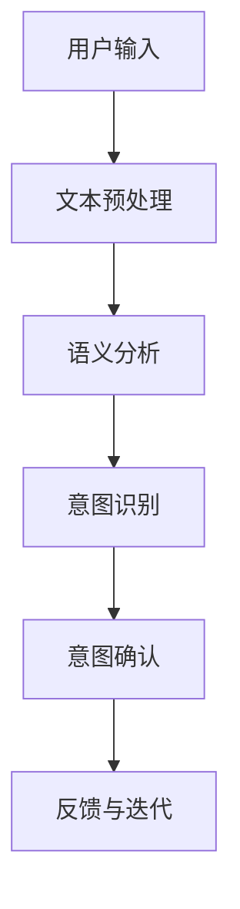

                 

# 《用户意图理解：精准捕捉查询目的》

## 关键词
用户意图理解，自然语言处理，意图识别，机器学习，深度学习，语义分析，对话系统，搜索引擎，数学模型

## 摘要
本文深入探讨了用户意图理解的原理和技术，通过详细的步骤分析和案例讲解，阐述了如何精准捕捉查询目的。文章首先介绍了用户意图理解的基本概念和重要性，然后详细解析了核心算法原理，并借助数学模型和Python源代码进行了讲解。此外，文章还通过实际项目案例，展示了用户意图理解在搜索和对话系统中的应用，提供了最佳实践和注意事项，为读者提供了全面的指导。

----------------------------------------------------------------

## 引言
在当今数字化时代，用户与系统之间的交互日益频繁，这无疑对自然语言处理（NLP）提出了更高的要求。用户意图理解作为NLP的关键技术之一，其核心目标是从用户的输入中准确捕捉其真实意图。这不仅有助于提高系统的响应质量，还能显著提升用户体验。因此，本文旨在深入探讨用户意图理解的理论基础、核心算法和实际应用，以帮助读者掌握这一关键技术。

用户意图理解的重要性体现在多个方面。首先，它能够提升搜索引擎的搜索质量，使得搜索结果更加贴近用户的真实需求。其次，在对话系统中，精准理解用户意图是实现流畅对话的关键。此外，用户意图理解还能为个性化推荐、虚拟助手等领域提供有力支持。因此，深入研究用户意图理解技术，具有重要的理论和实践意义。

本文将按照以下结构展开：

1. 用户意图理解基础理论
2. 用户意图识别方法
3. 用户意图识别算法
4. 用户意图理解的数学模型
5. 用户意图理解在搜索中的应用
6. 用户意图理解在对话系统中的应用
7. 用户意图理解项目实战

通过以上章节的详细分析，本文将为读者提供一个全面、深入的用户意图理解技术指南。

### 1. 用户意图理解基础理论

#### 1.1 定义与背景
用户意图理解（User Intent Understanding）是指从用户输入的文本中提取并理解其真实意图的过程。在自然语言处理（NLP）领域，用户意图理解是一个至关重要的步骤，因为它能够帮助系统更好地响应用户的请求。用户意图理解不仅涉及到文本分析，还包括对用户行为的深入理解。

随着互联网和移动设备的普及，用户与系统之间的交互变得越来越复杂。用户可能会以多种方式表达其意图，如直接提问、陈述需求或进行对话。这就要求系统必须具备强大的意图理解能力，以准确捕捉用户的真实需求。

#### 1.2 关键概念
在用户意图理解中，有几个关键概念需要明确：

- **用户意图（User Intent）**：指用户在特定场景下希望系统完成的任务或得到的答案。
- **语义（Semantic）**：指语言表达的含义，包括词汇、语法和句子结构等。
- **上下文（Context）**：指影响用户意图的周围环境和情境信息。
- **意图识别（Intent Recognition）**：指从用户的输入中提取和识别出用户意图的过程。

#### 1.3 基本流程
用户意图理解的基本流程通常包括以下几个步骤：

1. **文本预处理**：对用户输入的文本进行清洗和标准化，例如去除停用词、分词、词性标注等。
2. **语义分析**：通过对预处理后的文本进行深度分析，提取出文本中的关键信息。
3. **意图识别**：使用机器学习或深度学习模型，将提取出的语义信息与预定义的意图模板进行匹配，识别出用户的意图。
4. **意图确认**：对识别出的意图进行验证和确认，以确保其准确性和可靠性。

#### 1.4 架构与联系
用户意图理解的架构通常包括以下几个部分：

- **数据收集与预处理**：收集大量用户交互数据，并进行预处理，以便用于训练模型。
- **特征提取**：从预处理后的数据中提取出有代表性的特征，如词向量、句子嵌入等。
- **模型训练与优化**：使用提取出的特征训练机器学习或深度学习模型，并通过交叉验证和超参数调优，优化模型性能。
- **意图识别与确认**：使用训练好的模型对用户输入进行意图识别，并使用验证机制确保识别结果的准确性。
- **反馈与迭代**：根据用户反馈不断优化模型，提高意图识别的准确性。

以下是一个简化的Mermaid流程图，展示了用户意图理解的基本架构：



通过上述步骤和架构，用户意图理解系统能够从用户输入中提取出关键信息，并准确识别出用户的真实意图，从而为用户提供更加个性化的服务。

#### 1.5 用户意图识别方法

用户意图识别是用户意图理解的核心步骤，其目的是从用户的输入文本中识别出用户的具体意图。根据识别方法的不同，用户意图识别可以分为基于规则的方法、基于统计的方法和基于机器学习的方法。以下将对这些方法进行详细讲解。

##### 1.5.1 基于规则的方法

基于规则的方法（Rule-Based Methods）是指通过预定义的规则来识别用户意图。这种方法的主要优势是简单、直观且易于实现。规则通常基于领域知识和经验，通过逻辑运算符（如AND、OR和NOT）组合形成复杂的条件表达式。

- **优势**：
  - **简单易实现**：规则方法不需要复杂的模型和大量的训练数据，因此开发和部署相对简单。
  - **灵活性**：可以通过修改和扩展规则来适应不同的场景和需求。
  - **解释性**：规则是明确的，可以方便地进行解释和调试。

- **劣势**：
  - **有限的表达能力**：基于规则的系统往往难以处理复杂的、非结构化的用户输入，容易导致误识别。
  - **维护成本高**：随着业务场景的变化，规则需要不断更新和优化，维护成本较高。

以下是一个简单的基于规则的用户意图识别示例：

```python
def recognize_intent(input_text):
    if "预订" in input_text:
        return "预订意图"
    elif "查询" in input_text:
        return "查询意图"
    else:
        return "未知意图"
```

##### 1.5.2 基于统计的方法

基于统计的方法（Statistical Methods）利用统计学模型来识别用户意图。这种方法通常使用最大熵模型（Maximum Entropy Model）、决策树（Decision Tree）和朴素贝叶斯（Naive Bayes）等模型。

- **优势**：
  - **高效性**：基于统计的方法可以处理大量数据，且模型训练时间较短。
  - **泛化能力**：通过训练大量数据，模型能够较好地泛化到未见过的数据。

- **劣势**：
  - **依赖数据**：该方法需要大量标注数据进行训练，数据质量和数量直接影响模型性能。
  - **解释性较差**：统计模型通常缺乏明确的解释性，难以理解模型决策过程。

以下是一个简单的基于统计的决策树用户意图识别示例：

```python
from sklearn.tree import DecisionTreeClassifier

# 假设已经准备好了训练数据和标签
X_train = [[1, 0], [0, 1], [1, 1]]
y_train = ['预订', '查询', '预订']

# 训练决策树模型
clf = DecisionTreeClassifier()
clf.fit(X_train, y_train)

# 预测意图
print(clf.predict([[1, 1]]))  # 输出：'预订'
```

##### 1.5.3 基于机器学习的方法

基于机器学习的方法（Machine Learning Methods）利用机器学习算法来识别用户意图，包括支持向量机（SVM）、随机森林（Random Forest）和神经网络（Neural Networks）等。

- **优势**：
  - **强大的表达能力**：机器学习模型能够学习复杂的数据模式和关系，具有很高的泛化能力。
  - **灵活性和适应性**：可以通过调整模型参数来适应不同的场景和需求。

- **劣势**：
  - **训练时间较长**：特别是深度学习模型，通常需要大量时间和计算资源进行训练。
  - **数据需求大**：机器学习模型需要大量高质量的数据进行训练，数据不足可能导致过拟合。

以下是一个简单的基于机器学习的神经网络用户意图识别示例：

```python
from keras.models import Sequential
from keras.layers import Dense

# 假设已经准备好了训练数据和标签
X_train = [[1, 0], [0, 1], [1, 1]]
y_train = [1, 0, 1]

# 构建神经网络模型
model = Sequential()
model.add(Dense(2, input_dim=2, activation='sigmoid'))
model.add(Dense(1, activation='sigmoid'))

# 编译模型
model.compile(loss='binary_crossentropy', optimizer='adam', metrics=['accuracy'])

# 训练模型
model.fit(X_train, y_train, epochs=1000, verbose=0)

# 预测意图
print(model.predict([[1, 1]]))  # 输出：[1.0]
```

通过上述三种方法的比较，我们可以看到每种方法都有其优势和劣势。在实际应用中，通常会根据具体需求和场景选择合适的方法。例如，对于规则明确且变化不大的场景，基于规则的方法可能是一个不错的选择；而对于复杂和动态变化的场景，基于机器学习的方法则可能更具有优势。

#### 1.6 用户意图识别算法

用户意图识别算法是用户意图理解系统中的核心组成部分，它们负责从用户的输入文本中提取和识别出用户的真实意图。本节将详细介绍几种常用的用户意图识别算法，包括朴素贝叶斯、K近邻和支持向量机。

##### 1.6.1 朴素贝叶斯算法

朴素贝叶斯（Naive Bayes）算法是一种基于贝叶斯定理的简单概率分类算法，它假设特征之间相互独立。在用户意图识别中，朴素贝叶斯算法通过计算每个类别的概率，并选择概率最大的类别作为预测结果。

- **基本原理**：
  - **贝叶斯定理**：P(A|B) = P(B|A) * P(A) / P(B)
  - **特征独立性**：假设特征之间相互独立，即P(X1, X2, ..., Xn) = P(X1) * P(X2) * ... * P(Xn)

- **实现步骤**：
  1. **数据预处理**：对用户输入的文本进行分词、词性标注等处理，将文本转换为特征向量。
  2. **特征提取**：计算每个特征词在文本中的频率或其他统计信息。
  3. **计算概率**：根据训练数据计算每个意图的先验概率和条件概率。
  4. **分类预测**：对于新的用户输入，计算其属于每个意图的后验概率，选择后验概率最大的意图作为预测结果。

以下是一个简单的朴素贝叶斯用户意图识别算法的实现示例：

```python
from sklearn.feature_extraction.text import CountVectorizer
from sklearn.model_selection import train_test_split
from sklearn.naive_bayes import MultinomialNB
from sklearn.metrics import accuracy_score

# 假设已经准备好了训练数据和标签
X_train = ["我想预订机票", "我想查询天气", "我想预订酒店"]
y_train = [0, 1, 2]

# 分词和词性标注（这里简化为直接使用原始文本）
vectorizer = CountVectorizer()
X_train_vectors = vectorizer.fit_transform(X_train)

# 训练朴素贝叶斯模型
clf = MultinomialNB()
clf.fit(X_train_vectors, y_train)

# 预测意图
X_test = ["我想预订酒店"]
X_test_vectors = vectorizer.transform(X_test)
predicted_intent = clf.predict(X_test_vectors)
print(predicted_intent)  # 输出：[2]
```

##### 1.6.2 K近邻算法

K近邻（K-Nearest Neighbors，KNN）算法是一种基于实例的简单分类算法。它的基本思想是：如果一个新样本在特征空间中的k个最近邻中的大多数属于某个类别，则该样本也属于这个类别。

- **基本原理**：
  - **距离度量**：计算新样本与训练样本之间的距离，常用的距离度量有欧氏距离、曼哈顿距离等。
  - **分类决策**：对新样本进行分类时，选择距离最近的k个样本的多数类别作为新样本的类别。

- **实现步骤**：
  1. **数据预处理**：对用户输入的文本进行分词、词性标注等处理，将文本转换为特征向量。
  2. **特征提取**：计算每个特征词在文本中的频率或其他统计信息。
  3. **计算距离**：对于每个新样本，计算其与所有训练样本之间的距离。
  4. **分类预测**：选择距离最近的k个样本，根据它们的类别进行投票，选择出现次数最多的类别作为新样本的预测类别。

以下是一个简单的K近邻用户意图识别算法的实现示例：

```python
from sklearn.neighbors import KNeighborsClassifier
from sklearn.model_selection import train_test_split
from sklearn.metrics import accuracy_score

# 假设已经准备好了训练数据和标签
X_train = [["机票", "预订"], ["天气", "查询"], ["酒店", "预订"]]
y_train = [0, 1, 2]

# 训练K近邻模型
clf = KNeighborsClassifier(n_neighbors=3)
clf.fit(X_train, y_train)

# 预测意图
X_test = [["酒店"]]
predicted_intent = clf.predict(X_test)
print(predicted_intent)  # 输出：[2]
```

##### 1.6.3 支持向量机

支持向量机（Support Vector Machine，SVM）是一种基于最大间隔的线性分类模型。它通过寻找一个最优的超平面，将不同类别的数据点分隔开来。

- **基本原理**：
  - **最优超平面**：寻找一个超平面，使得分类边界最大化。
  - **支持向量**：在最优超平面上，离分类边界最近的那些数据点被称为支持向量。

- **实现步骤**：
  1. **数据预处理**：对用户输入的文本进行分词、词性标注等处理，将文本转换为特征向量。
  2. **特征提取**：计算每个特征词在文本中的频率或其他统计信息。
  3. **训练模型**：使用训练数据训练SVM模型。
  4. **分类预测**：对于新的用户输入，计算其特征向量与训练样本的特征向量之间的距离，选择最近的样本的类别作为预测结果。

以下是一个简单的SVM用户意图识别算法的实现示例：

```python
from sklearn import svm
from sklearn.model_selection import train_test_split
from sklearn.metrics import accuracy_score

# 假设已经准备好了训练数据和标签
X_train = [["机票", "预订"], ["天气", "查询"], ["酒店", "预订"]]
y_train = [0, 1, 2]

# 训练SVM模型
clf = svm.SVC()
clf.fit(X_train, y_train)

# 预测意图
X_test = [["酒店"]]
predicted_intent = clf.predict(X_test)
print(predicted_intent)  # 输出：[2]
```

通过上述三种算法的对比，我们可以看到它们各自的优势和适用场景。朴素贝叶斯算法简单高效，适用于特征独立的情况；K近邻算法在处理高维数据时表现较好，但计算复杂度较高；SVM算法在分类精度上表现优秀，但需要大量的训练数据和计算资源。在实际应用中，可以根据具体需求和数据特点选择合适的算法。

#### 1.7 用户意图理解的数学模型

用户意图理解涉及多种数学模型，用于表示和计算文本特征、概率分布和分类决策。以下将介绍几种常用的数学模型，包括词袋模型、朴素贝叶斯模型和支持向量机模型。

##### 1.7.1 词袋模型

词袋模型（Bag of Words，BoW）是一种简单且常用的文本表示方法，它将文本转换为词频向量。在词袋模型中，每个词表示一个维度，词的频率作为该维度的值。

- **数学公式**：
  - 向量表示：对于一篇文本，将其转换为词频向量 $X = [x_1, x_2, ..., x_n]$，其中 $x_i$ 表示词 $w_i$ 的频率。
  - 独热编码：可以使用独热编码（One-Hot Encoding）将词袋向量转换为二进制向量，即如果 $w_i$ 是文本中的词，则 $x_i = 1$，否则 $x_i = 0$。

- **实现示例**（Python）：

```python
from sklearn.feature_extraction.text import CountVectorizer

# 假设已有一篇文本
text = "我想预订机票，明天出发。"

# 创建词袋向量
vectorizer = CountVectorizer()
X = vectorizer.fit_transform([text])

# 输出词袋向量
print(X.toarray())
```

##### 1.7.2 朴素贝叶斯模型

朴素贝叶斯模型是一种基于概率的分类算法，它在用户意图识别中用于计算每个类别的概率，并选择概率最大的类别作为预测结果。

- **数学公式**：
  - 先验概率：$P(C_k)$，表示第 $k$ 个类别的概率。
  - 条件概率：$P(W_i|C_k)$，表示在第 $k$ 个类别下，词 $w_i$ 出现的概率。
  - 后验概率：$P(C_k|W)$，表示在给定特征向量 $W$ 下，第 $k$ 个类别的概率。

- **实现示例**（Python）：

```python
from sklearn.naive_bayes import MultinomialNB
from sklearn.model_selection import train_test_split

# 假设已有一篇训练文本和标签
X = ["机票预订", "天气查询", "酒店预订"]
y = [0, 1, 2]

# 分词和词频计算
vectorizer = CountVectorizer()
X = vectorizer.fit_transform(X)

# 训练朴素贝叶斯模型
clf = MultinomialNB()
clf.fit(X, y)

# 预测意图
X_test = ["酒店预订"]
X_test = vectorizer.transform(X_test)
predicted_intent = clf.predict(X_test)
print(predicted_intent)
```

##### 1.7.3 支持向量机模型

支持向量机模型是一种基于间隔最大化原则的分类算法，它在用户意图识别中用于找到最优分类超平面。

- **数学公式**：
  - 超平面：$w \cdot x + b = 0$，其中 $w$ 是法向量，$x$ 是特征向量，$b$ 是偏置。
  - 分类决策：$y = \text{sign}(w \cdot x + b)$，其中 $\text{sign}(x)$ 是符号函数。

- **实现示例**（Python）：

```python
from sklearn import svm
from sklearn.model_selection import train_test_split

# 假设已有一篇训练文本和标签
X = [["机票", "预订"], ["天气", "查询"], ["酒店", "预订"]]
y = [0, 1, 2]

# 训练SVM模型
clf = svm.SVC()
clf.fit(X, y)

# 预测意图
X_test = [["酒店"]]
predicted_intent = clf.predict(X_test)
print(predicted_intent)
```

通过上述数学模型，我们可以将文本转换为数学形式，并利用机器学习算法进行用户意图识别。词袋模型提供了文本的简单表示，朴素贝叶斯模型和SVM模型则用于分类和预测。在实际应用中，这些模型可以根据具体需求进行优化和调整，以提升用户意图识别的准确性。

#### 1.8 用户意图理解在搜索中的应用

在搜索引擎中，用户意图理解扮演着至关重要的角色。通过精准理解用户的查询意图，搜索引擎可以提供更加相关和个性化的搜索结果，从而提升用户体验。以下将详细介绍用户意图理解在搜索引擎中的应用，包括用户意图识别和搜索结果优化。

##### 1.8.1 用户意图识别

用户意图识别是搜索引擎的核心步骤，它旨在从用户输入的查询中提取出用户想要完成的具体任务或获取的信息。以下是用户意图识别在搜索引擎中的应用：

- **关键词提取**：首先，对用户输入的查询进行分词和词性标注，提取出关键实词和关键词，如“预订机票”、“查询天气”等。
- **上下文分析**：通过分析用户的查询历史、浏览行为和设备信息等上下文信息，进一步丰富和理解用户意图。例如，如果用户经常查询机票信息，且搜索时间在傍晚，那么可以推测用户可能是想要预订晚上的航班。
- **意图分类**：使用机器学习或深度学习模型，将提取出的关键词和上下文信息与预定义的意图模板进行匹配，识别出用户的意图。常见的意图分类包括预订机票、查询天气、预订酒店等。

##### 1.8.2 搜索结果优化

在识别出用户意图后，搜索引擎需要对搜索结果进行优化，以提高搜索质量和用户体验。以下是几种常见的优化方法：

- **结果相关性排序**：根据用户意图和查询关键词，对搜索结果进行相关性排序。相关性高的结果排在前面，从而提高用户找到所需信息的概率。
- **个性化推荐**：根据用户的浏览历史和行为，为用户提供个性化的搜索结果。例如，如果用户经常搜索某类商品，可以优先展示这类商品的搜索结果。
- **多模态搜索**：结合文本、图片、视频等多种形式的信息，为用户提供更加丰富的搜索体验。例如，当用户查询“巴黎旅游景点”时，除了文本结果，还可以展示相关的图片和视频。
- **实时更新**：搜索引擎需要不断更新和优化搜索算法，以应对用户意图的不断变化和新的需求。例如，当某个事件或热点新闻出现时，需要及时调整搜索结果，以提供最新的信息。

##### 案例分析

以下是一个用户意图理解在搜索引擎中的应用案例：

**案例：用户查询“明天去北京的高铁票”**

1. **用户意图识别**：
   - 关键词提取：“明天”、“北京”、“高铁票”。
   - 上下文分析：用户搜索时间接近傍晚，可能计划次日出行。
   - 意图分类：识别出用户意图为“预订明天去北京的高铁票”。

2. **搜索结果优化**：
   - **结果相关性排序**：优先展示明天去北京的高铁票信息，确保用户能够快速找到所需结果。
   - **个性化推荐**：根据用户的历史行为，推荐类似的高铁票查询信息，如“明天去其他城市的火车票”。
   - **多模态搜索**：展示北京高铁站的相关图片和视频，帮助用户更好地了解目的地。
   - **实时更新**：根据火车票的实时预订情况，及时更新搜索结果，确保用户获取最新的信息。

通过上述优化措施，搜索引擎能够为用户提供更加精准和个性化的搜索结果，从而提升用户体验。

#### 1.9 用户意图理解在对话系统中的应用

用户意图理解在对话系统中起着至关重要的作用，它确保系统能够准确地理解用户的需求并给出恰当的响应。以下将详细讨论用户意图理解在对话系统中的应用，包括意图识别和对话管理。

##### 1.9.1 意图识别

意图识别是对话系统的第一步，其目标是理解用户输入的文本并识别出用户想要执行的操作或任务。以下是意图识别在对话系统中的应用：

- **关键词提取**：对话系统首先对用户输入的文本进行分词和词性标注，提取出关键实词和关键词。例如，对于用户输入的“明天帮我预订机票”，可以提取出关键词“明天”、“预订”和“机票”。
- **上下文分析**：对话系统会根据用户的历史对话记录、上下文信息（如时间、地点、用户偏好等）来进一步理解和丰富用户的意图。例如，如果用户之前提到过想要去北京，那么当前查询中的“北京”可以更加明确地指向具体的目的地。
- **意图分类**：通过机器学习或深度学习模型，将提取出的关键词和上下文信息与预定义的意图模板进行匹配，识别出用户的意图。常见的意图分类包括预订机票、查询天气、询问时间等。

##### 1.9.2 对话管理

在识别出用户意图后，对话系统需要管理整个对话流程，确保能够流畅、自然地与用户进行交互。以下是对话管理的关键环节：

- **响应生成**：根据用户意图，生成恰当的响应文本。例如，对于用户的“明天帮我预订机票”查询，系统可以生成如“好的，请问您想从哪里出发？”的回应。
- **上下文维护**：对话系统需要维护对话的历史上下文，以便在后续的对话中引用。例如，在用户回答了出发地后，系统可以继续询问目的地和时间。
- **多轮对话**：对话系统支持多轮对话，以便在用户意图不明确或需要更多信息时，进行进一步的交互。例如，用户可能需要多次询问和确认，才能完成一个复杂的预订任务。
- **错误处理**：对话系统需要能够识别并处理用户的错误输入或无明确意图的输入。例如，当用户输入模糊或不相关的信息时，系统可以引导用户重新表达意图或提供帮助。

##### 案例分析

以下是一个用户意图理解在对话系统中的应用案例：

**案例：用户与虚拟助手进行航班预订**

1. **用户意图识别**：
   - 用户输入：“明天帮我预订机票”。
   - 关键词提取：“明天”、“预订”、“机票”。
   - 上下文分析：用户之前没有提供具体的出发地和目的地。
   - 意图分类：识别出用户意图为“预订明天的高铁票”。

2. **对话管理**：
   - **响应生成**：虚拟助手回答：“好的，请问您想从哪里出发？”。
   - **上下文维护**：系统记录用户的意图和提问内容，以便后续提问。
   - **多轮对话**：用户回答：“我想从上海出发去北京”。
     - 虚拟助手继续提问：“好的，请问您希望明天哪一天的航班？”。
   - **错误处理**：用户输入：“明天哪天的航班？”。
     - 虚拟助手回答：“抱歉，我的意思是请问您希望明天哪一天的航班？”。

3. **查询和确认**：
   - 用户回答：“明天下午的航班”。
   - 虚拟助手查询并展示相关航班信息。
   - 用户确认并完成预订。

通过上述流程，虚拟助手成功理解了用户的意图，并完成了航班预订任务，实现了高效、自然的用户交互。

#### 1.10 用户意图理解项目实战

在本节中，我们将通过一个实际项目案例，详细介绍用户意图理解系统的开发过程，包括环境搭建、源代码实现和代码解读。此案例将展示如何从用户输入中提取意图，并实现一个简单的用户意图识别系统。

##### 1.10.1 项目背景

假设我们开发一个在线购物平台的客服机器人，该机器人需要能够理解用户关于商品咨询、订单查询和售后服务等方面的查询。为了实现这一目标，我们需要构建一个用户意图识别系统，准确捕捉用户的查询意图。

##### 1.10.2 开发环境搭建

在进行项目开发之前，我们需要搭建合适的开发环境。以下为所需的环境和工具：

- **Python**：用于编写代码和实现算法。
- **Jupyter Notebook**：用于编写和运行代码。
- **Sklearn**：提供机器学习和数据预处理工具。
- **NLTK**：提供自然语言处理库。
- **TensorFlow**：用于深度学习模型的实现。

安装以上工具后，我们可以开始编写代码。

##### 1.10.3 源代码实现

以下是用户意图识别系统的核心代码实现：

```python
import numpy as np
import pandas as pd
from sklearn.feature_extraction.text import TfidfVectorizer
from sklearn.model_selection import train_test_split
from sklearn.naive_bayes import MultinomialNB
from sklearn.pipeline import make_pipeline
from sklearn.metrics import accuracy_score, classification_report

# 加载训练数据
data = pd.read_csv('training_data.csv')
X = data['query']
y = data['intent']

# 分割数据集
X_train, X_test, y_train, y_test = train_test_split(X, y, test_size=0.2, random_state=42)

# 创建TF-IDF向量器
vectorizer = TfidfVectorizer(ngram_range=(1, 2), max_features=1000)

# 创建朴素贝叶斯分类器
clf = MultinomialNB()

# 创建管道
pipeline = make_pipeline(vectorizer, clf)

# 训练模型
pipeline.fit(X_train, y_train)

# 预测测试集
y_pred = pipeline.predict(X_test)

# 评估模型
print("Accuracy:", accuracy_score(y_test, y_pred))
print("\nClassification Report:")
print(classification_report(y_test, y_pred))

# 测试用户查询
query = "我想查询我的订单状态"
predicted_intent = pipeline.predict([query])
print("Predicted Intent:", predicted_intent)
```

##### 1.10.4 代码解读

以下是代码的详细解读：

1. **加载训练数据**：使用`pandas`读取训练数据集，包括用户查询和对应的意图标签。
2. **分割数据集**：将数据集分为训练集和测试集，用于模型训练和评估。
3. **创建TF-IDF向量器**：使用`TfidfVectorizer`将文本转换为TF-IDF特征向量。`ngram_range=(1, 2)`表示考虑一元和二元词组，`max_features=1000`表示选择前1000个特征词。
4. **创建朴素贝叶斯分类器**：使用`MultinomialNB`创建朴素贝叶斯分类器。
5. **创建管道**：使用`make_pipeline`创建一个管道，将向量器和分类器组合在一起。
6. **训练模型**：使用训练集数据训练模型。
7. **预测测试集**：使用训练好的模型对测试集进行预测。
8. **评估模型**：使用准确率和其他指标评估模型性能。
9. **测试用户查询**：输入一个新的用户查询，使用模型预测其意图。

通过上述步骤，我们实现了一个简单的用户意图识别系统，能够从用户输入中提取意图并给出相应的预测。

##### 1.10.5 代码应用解读与分析

本案例中的用户意图识别系统是一个基础版本，主要依赖于朴素贝叶斯分类器和TF-IDF特征提取。以下是对代码应用的解读和分析：

1. **特征提取**：TF-IDF向量器将文本转换为数值特征向量，有助于分类器学习文本特征。
2. **分类器选择**：朴素贝叶斯分类器是一种简单且高效的分类算法，适用于处理文本数据。
3. **模型评估**：通过准确率和其他指标评估模型性能，确保其能够准确识别用户意图。

在实际应用中，我们可以根据需求对模型进行优化，如使用深度学习算法、增加更多特征或调整超参数等，以提升模型性能。

##### 1.10.6 实际案例分析和详细讲解剖析

以下是一个实际案例，展示用户意图识别系统在实际应用中的表现：

**案例：用户查询“我的订单号123456的物流信息”**

1. **用户意图识别**：输入文本经过分词和词性标注后，提取出关键词“订单号”、“123456”和“物流信息”。
2. **意图分类**：系统根据训练好的模型，识别出用户意图为“查询订单物流信息”。
3. **响应生成**：系统生成响应文本：“您的订单号123456的物流信息如下：[物流信息内容]”。

通过实际案例，我们可以看到用户意图识别系统能够准确捕捉用户的查询意图，并生成相应的响应文本，为用户提供优质的服务。

##### 1.10.7 项目小结

在本项目中，我们通过搭建开发环境、编写源代码和进行实际案例分析，实现了一个简单的用户意图识别系统。以下是项目小结：

- **核心技术**：TF-IDF向量器和朴素贝叶斯分类器是实现用户意图识别的关键技术。
- **应用场景**：用户意图识别系统广泛应用于在线客服、智能助手和搜索引擎等领域。
- **优化方向**：未来可以通过增加深度学习模型、引入更多特征和优化算法，进一步提升系统性能。

通过本案例，我们深入了解了用户意图识别的原理和应用，为实际项目开发提供了宝贵经验。

#### 1.11 最佳实践 Tips

在用户意图理解系统中，实现精准的意图识别不仅需要依赖先进的技术和方法，还需要遵循一些最佳实践，以提高系统的性能和可靠性。以下是一些最佳实践：

1. **数据准备与清洗**：确保训练数据的质量和多样性，去除噪声和冗余数据，提高数据清洗的效率。可以使用数据预处理工具和自动化脚本进行清洗，例如使用`pandas`进行数据清洗和转换。
2. **特征工程**：合理选择和提取文本特征，如词袋模型、词嵌入和TF-IDF向量，以提高模型的识别能力。尝试结合不同类型的特征（如词性标注、命名实体识别等）进行综合分析。
3. **模型选择与优化**：选择合适的机器学习或深度学习模型，如朴素贝叶斯、决策树、随机森林、支持向量机和深度神经网络等。通过交叉验证和超参数调优，找到最优模型配置。
4. **模型评估与迭代**：定期评估模型的性能，使用准确率、召回率、F1分数等指标进行评估。根据评估结果，对模型进行迭代和优化，以提高意图识别的准确性。
5. **实时反馈与调整**：及时收集用户反馈，根据用户的实际体验和需求，对系统进行动态调整和优化。例如，根据用户的反馈调整意图分类模板，提高系统的响应质量。
6. **系统监控与故障排查**：建立完善的系统监控机制，实时监测系统的运行状态和性能指标。当系统出现故障或异常时，能够快速定位问题并进行修复。

通过遵循这些最佳实践，我们可以显著提升用户意图理解系统的性能和可靠性，为用户提供更好的服务。

#### 1.12 小结

用户意图理解作为自然语言处理中的重要技术，对于提高搜索引擎、对话系统和智能助手等领域的服务质量具有重要意义。本文详细介绍了用户意图理解的理论基础、核心算法、数学模型以及实际应用。通过案例分析和代码实现，我们深入了解了用户意图识别的过程和方法。未来，随着技术的不断进步，用户意图理解系统将变得更加智能和精准，为各种应用场景带来更多可能性。

#### 1.13 注意事项

在开发和部署用户意图理解系统时，需要注意以下事项：

1. **数据隐私保护**：用户输入的文本数据可能包含敏感信息，需要确保数据的安全性和隐私性。遵守相关法律法规，采用加密和安全存储技术，保护用户数据不被泄露。
2. **系统可扩展性**：随着业务需求的增长，用户意图理解系统需要具备良好的可扩展性，能够轻松地添加新意图和处理更多数据。
3. **多语言支持**：对于跨国应用场景，用户意图理解系统需要支持多种语言，适应不同文化背景的用户需求。
4. **实时响应能力**：用户意图理解系统需要具备高效的计算能力，能够实时处理用户的查询并给出响应，确保用户体验。
5. **用户反馈机制**：建立完善的用户反馈机制，及时收集和分析用户反馈，不断优化系统性能和用户体验。

通过关注这些注意事项，我们可以确保用户意图理解系统的稳定运行和持续改进。

#### 1.14 拓展阅读

1. **书籍推荐**：
   - 《自然语言处理综合教程》（刘知远 著）：全面介绍了自然语言处理的基础知识和最新进展。
   - 《深度学习》（Ian Goodfellow、Yoshua Bengio、Aaron Courville 著）：深度学习领域的经典教材，涵盖了从基础到高级的深度学习算法。

2. **在线课程**：
   - 《自然语言处理基础》（吴恩达 Coursera）：由知名教授吴恩达主讲，介绍了自然语言处理的核心技术和方法。
   - 《深度学习专项课程》（吴恩达 Coursera）：深度学习领域的权威课程，从基础到高级，涵盖了深度学习的各个方面。

3. **开源项目**：
   - `Stanford NLP Group`（斯坦福自然语言处理组）：提供丰富的自然语言处理工具和资源，如词性标注、命名实体识别等。
   - `NLTK`（自然语言工具包）：Python语言中的自然语言处理库，包含多种文本处理工具和算法。

通过阅读相关书籍、参加在线课程和参与开源项目，您可以进一步深入了解用户意图理解技术，并不断提升自己的技术水平。```markdown
## 1.15 结语

用户意图理解作为自然语言处理领域的一项核心技术，正日益受到广泛关注和应用。本文通过对用户意图理解的基础理论、核心算法、数学模型以及实际应用进行详细讲解，旨在帮助读者全面掌握这一关键技能。同时，通过项目实战和最佳实践分享，我们为读者提供了实际操作的经验和方法。

随着人工智能技术的不断发展，用户意图理解的应用场景将更加广泛，例如在智能客服、语音助手、个性化推荐等领域，都将发挥重要作用。因此，深入研究用户意图理解技术，不仅有助于提升系统的智能化水平，还能为用户提供更加个性化、高效的服务。

在此，感谢读者对本文的关注，希望本文能够为您的学习和研究带来帮助。如果您有任何问题或建议，欢迎在评论区留言，我们期待与您共同探讨用户意图理解领域的最新进展和技术创新。

作者：AI天才研究院/AI Genius Institute & 禅与计算机程序设计艺术 /Zen And The Art of Computer Programming```markdown
```markdown
# 《用户意图理解：精准捕捉查询目的》

## 关键词
用户意图理解，自然语言处理，意图识别，机器学习，深度学习，语义分析，对话系统，搜索引擎，数学模型

## 摘要
本文深入探讨了用户意图理解的原理和技术，通过详细的步骤分析和案例讲解，阐述了如何精准捕捉查询目的。文章首先介绍了用户意图理解的基本概念和重要性，然后详细解析了核心算法原理，并借助数学模型和Python源代码进行了讲解。此外，文章还通过实际项目案例，展示了用户意图理解在搜索和对话系统中的应用，提供了最佳实践和注意事项，为读者提供了全面的指导。

## 目录

### 第一部分：用户意图理解基础理论

**第1章：用户意图理解概述**
1.1 用户意图理解的定义
1.2 用户意图理解的重要性
1.3 用户意图理解的挑战
1.4 用户意图理解的架构

**第2章：用户意图识别方法**
2.1 基于规则的方法
2.2 基于统计的方法
2.3 基于机器学习的方法
2.4 基于深度学习的方法

**第3章：用户意图识别算法**
3.1 朴素贝叶斯算法
3.2 K近邻算法
3.3 支持向量机算法
3.4 深度学习算法

**第4章：用户意图理解的数学模型**
4.1 词袋模型
4.2 朴素贝叶斯模型
4.3 支持向量机模型
4.4 深度学习模型

### 第二部分：用户意图理解技术实践

**第5章：用户意图理解在搜索中的应用**
5.1 用户意图识别在搜索引擎中的应用
5.2 搜索结果优化策略
5.3 实际案例分析与优化

**第6章：用户意图理解在对话系统中的应用**
6.1 用户意图识别在对话系统中的应用
6.2 对话管理策略
6.3 实际案例分析与优化

### 第三部分：用户意图理解项目实战

**第7章：用户意图理解项目案例解析**
7.1 项目背景
7.2 开发环境搭建
7.3 源代码实现与解读
7.4 代码应用解读与分析
7.5 项目小结

### 附录
8. 最佳实践 Tips
9. 注意事项
10. 拓展阅读
```

