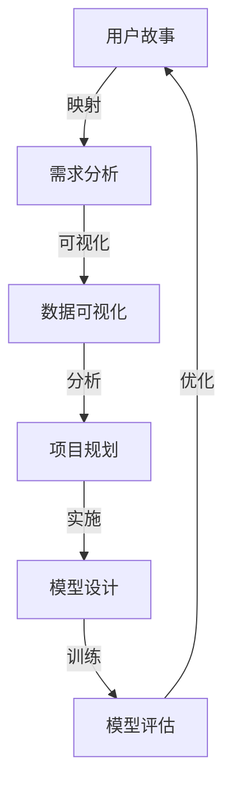

                 

### 文章标题

《用户故事映射：可视化AI项目开发进程》

---

### 关键词

用户故事映射、可视化技术、AI项目开发、流程图、算法原理、数学模型、项目实战

---

### 摘要

本文将深入探讨用户故事映射在AI项目开发中的应用，通过详细解析其核心概念、原理和流程，辅以Mermaid流程图、Python源代码、LaTeX数学公式和实际项目案例，帮助读者全面理解并掌握这一技术。文章分为三个主要部分：第一部分介绍用户故事映射概述和可视化技术基础；第二部分讲解核心算法原理和数学模型；第三部分通过项目实战案例展示如何在实际中应用这些知识。通过阅读本文，读者将能够了解如何使用用户故事映射技术来可视化AI项目开发进程，提升项目管理和开发效率。

---

## 确定书的整体结构和章节内容

在编写《用户故事映射：可视化AI项目开发进程》之前，我们需要对整体结构和章节内容进行详细的规划。本书主要分为三个部分，每个部分涵盖核心概念、原理和实战，结构清晰，层次分明，以确保读者能够循序渐进地理解和掌握用户故事映射在AI项目开发中的应用。

### 第一部分：核心概念与联系

**第1章：用户故事映射概述**

这一章节将介绍用户故事映射的基本概念，包括其定义、作用以及在AI项目开发中的应用场景。通过概述，读者可以初步了解用户故事映射的重要性。

**第2章：可视化技术基础**

本章将深入探讨可视化技术的基本原理和应用，包括数据可视化的概念、工具和类型。这部分内容将为后续的用户故事映射可视化奠定基础。

**第3章：AI项目开发流程**

这一章节将详细阐述AI项目开发的基本流程，从项目规划、数据收集与预处理、模型设计与训练到模型评估与优化，帮助读者全面了解AI项目的开发过程。

### 第二部分：核心算法原理讲解

**第4章：用户故事映射算法原理**

本章将讲解用户故事映射算法的核心概念和原理，包括用户故事映射的基本步骤和关键技术。通过Python源代码示例，读者可以更直观地理解算法的实现。

**第5章：数学模型讲解**

本章将介绍用户故事映射中使用的数学模型，包括概率论和统计学的基础知识。通过LaTeX数学公式，我们将详细讲解这些模型的应用。

### 第三部分：项目实战

**第6章：用户故事映射项目实战**

这一章节将通过一个完整的用户故事映射项目，从开发环境搭建、源代码实现到项目小结，展示如何在实际中应用所学知识。

**第7章：案例分析**

本章将分析一个实际项目案例，从数据预处理、模型设计与实现到结果评估与讨论，全面剖析用户故事映射在项目中的应用效果。

通过以上结构规划，本书旨在通过系统性的讲解和实战案例，帮助读者深入理解用户故事映射在AI项目开发中的应用，提升项目管理和开发效率。

### 设计核心概念和联系流程图

为了更好地阐述用户故事映射的核心概念和各部分之间的联系，我们将使用Mermaid流程图来展示。Mermaid是一种方便绘制定制流程图的Markdown语法，可以将其嵌入Markdown文档中直接渲染。以下是一个示例，展示了用户故事映射中的关键环节及其相互关系。



在这张流程图中，我们定义了用户故事映射的几个关键环节：

- **用户故事（A）**：项目的起点，描述用户的需求和期望。
- **需求分析（B）**：根据用户故事提取项目需求，为后续开发提供依据。
- **数据可视化（C）**：通过可视化技术将需求转化为数据，便于分析和理解。
- **项目规划（D）**：制定项目计划，包括时间表、资源分配等。
- **模型设计（E）**：设计用于实现用户需求的AI模型。
- **模型评估（F）**：评估模型的效果，确保满足用户需求。

这些环节相互关联，形成一个闭环流程，确保项目从需求提取到最终实现和优化能够顺利进行。

**Mermaid流程图优点：**

1. **易读性**：使用图形化表示，使得复杂的过程和概念更加直观易懂。
2. **灵活性**：可以轻松调整流程图的结构，适应不同场景和需求。
3. **兼容性**：Mermaid语法与Markdown兼容，可以在多种平台和工具中使用。

通过使用Mermaid流程图，我们不仅能够清晰地展示用户故事映射的流程，还可以帮助读者更好地理解各个环节之间的逻辑关系，从而为后续的算法原理和项目实战讲解打下坚实的基础。

### 设计算法原理讲解

为了深入理解用户故事映射算法的原理，我们将从基础概念出发，逐步讲解算法的核心逻辑和实现步骤。以下是基于Python语言的用户故事映射算法原理讲解，包括算法的输入、处理流程和输出结果。

#### 用户故事映射算法概述

用户故事映射算法是一种用于将用户故事与具体项目需求相对应的自动化工具。其主要目的是通过算法分析，将用户故事转化为可量化的需求，从而为项目规划和实施提供依据。

**输入：**

- 用户故事列表：包含用户的需求描述和期望。
- 数据集：与用户故事相关的数据，用于训练和评估映射模型。

**输出：**

- 映射结果：用户故事与项目需求的对应关系。
- 模型评估指标：用于评估映射效果，如准确率、召回率等。

#### 算法处理流程

1. **数据预处理**

   在开始映射之前，需要对用户故事和数据进行预处理。具体步骤包括：

   - **文本清洗**：去除用户故事中的无关符号和停用词。
   - **词向量化**：将文本转换为词向量表示，以便进行后续处理。
   - **数据归一化**：对数据进行标准化处理，消除不同特征之间的尺度差异。

2. **特征提取**

   从预处理后的数据中提取关键特征，用于映射模型的学习。常见的特征提取方法包括：

   - **TF-IDF**：衡量单词在用户故事中的重要性。
   - **词嵌入**：使用预训练的词向量表示文本。

3. **模型训练**

   使用提取的特征训练映射模型。常见的方法包括：

   - **机器学习模型**：如决策树、随机森林、支持向量机等。
   - **深度学习模型**：如循环神经网络（RNN）、卷积神经网络（CNN）等。

4. **模型评估**

   使用测试数据集评估映射模型的性能。常用的评估指标包括：

   - **准确率（Accuracy）**：正确映射的用户故事数量与总用户故事数量的比例。
   - **召回率（Recall）**：正确映射的用户故事数量与实际需求匹配的用户故事数量的比例。
   - **F1分数（F1 Score）**：综合准确率和召回率的指标，计算公式为：\[ F1 = 2 \times \frac{准确率 \times 召回率}{准确率 + 召回率} \]

5. **映射结果输出**

   根据训练好的模型，对新的用户故事进行映射，输出映射结果和项目需求。

#### Python源代码示例

下面是一个简单的用户故事映射算法的Python源代码示例，使用机器学习中的决策树模型：

```python
import pandas as pd
from sklearn.feature_extraction.text import TfidfVectorizer
from sklearn.model_selection import train_test_split
from sklearn.tree import DecisionTreeClassifier
from sklearn.metrics import accuracy_score, recall_score, f1_score

# 加载用户故事数据
user_stories = pd.read_csv('user_stories.csv')
X = user_stories['description']  # 用户故事描述
y = user_stories['requirement']  # 用户故事对应的需求

# 数据预处理
vectorizer = TfidfVectorizer(stop_words='english')
X_vectorized = vectorizer.fit_transform(X)

# 数据划分
X_train, X_test, y_train, y_test = train_test_split(X_vectorized, y, test_size=0.2, random_state=42)

# 模型训练
clf = DecisionTreeClassifier()
clf.fit(X_train, y_train)

# 模型评估
y_pred = clf.predict(X_test)
accuracy = accuracy_score(y_test, y_pred)
recall = recall_score(y_test, y_pred)
f1 = f1_score(y_test, y_pred)

print(f"Accuracy: {accuracy:.2f}")
print(f"Recall: {recall:.2f}")
print(f"F1 Score: {f1:.2f}")

# 映射结果输出
mapping_results = clf.predict(vectorizer.transform(['new_user_story']))
print(f"Mapping Results: {mapping_results}")
```

#### 结合数学模型和公式

在用户故事映射算法中，数学模型起到了关键作用。以下是一个简单的贝叶斯定理在映射模型中的应用示例：

$$
P(A|B) = \frac{P(B|A) \cdot P(A)}{P(B)}
$$

其中：

- \( P(A|B) \) 表示在条件 \( B \) 下 \( A \) 事件发生的概率。
- \( P(B|A) \) 表示在 \( A \) 事件发生的情况下 \( B \) 事件发生的概率。
- \( P(A) \) 表示 \( A \) 事件发生的概率。
- \( P(B) \) 表示 \( B \) 事件发生的概率。

在用户故事映射中，可以将 \( A \) 视为“用户故事满足特定需求”，\( B \) 视为“用户故事被正确映射”。贝叶斯定理帮助我们根据已有的映射结果和需求，推断新的用户故事是否能够满足需求。

通过结合Python源代码和数学模型，我们可以更加详细地理解用户故事映射算法的实现原理，为后续的项目实战提供坚实的理论基础。

### 设计数学模型讲解

在用户故事映射过程中，数学模型扮演着至关重要的角色。这些模型不仅帮助我们量化用户需求，还能优化映射效果，提高项目的成功率。本节将详细讲解用户故事映射中的常用数学模型，并使用LaTeX格式展示关键数学公式。

#### 概率论基础

概率论是构建用户故事映射模型的基础。以下是几个在用户故事映射中常用的概率概念：

1. **条件概率**：

   条件概率描述了在某个事件已经发生的条件下，另一个事件发生的概率。其公式为：

   $$
   P(A|B) = \frac{P(B|A) \cdot P(A)}{P(B)}
   $$

   其中：

   - \( P(A|B) \) 是在 \( B \) 发生的条件下 \( A \) 发生的概率。
   - \( P(B|A) \) 是在 \( A \) 发生的条件下 \( B \) 发生的概率。
   - \( P(A) \) 是事件 \( A \) 发生的概率。
   - \( P(B) \) 是事件 \( B \) 发生的概率。

2. **贝叶斯定理**：

   贝叶斯定理是条件概率的推广，用于计算在给定某些证据的情况下，某个假设的概率。其公式为：

   $$
   P(H|E) = \frac{P(E|H) \cdot P(H)}{P(E)}
   $$

   其中：

   - \( P(H|E) \) 是在证据 \( E \) 出现的条件下假设 \( H \) 的概率。
   - \( P(E|H) \) 是在假设 \( H \) 为真的条件下证据 \( E \) 出现的概率。
   - \( P(H) \) 是假设 \( H \) 的先验概率。
   - \( P(E) \) 是证据 \( E \) 的先验概率。

3. **熵和信息量**：

   熵是衡量信息不确定性的量度，其公式为：

   $$
   H(X) = -\sum_{i} p(x_i) \cdot \log_2(p(x_i))
   $$

   其中：

   - \( H(X) \) 是随机变量 \( X \) 的熵。
   - \( p(x_i) \) 是随机变量 \( X \) 取值 \( x_i \) 的概率。

   信息量 \( I(X; Y) \) 描述了两个随机变量 \( X \) 和 \( Y \) 之间的相关性，其公式为：

   $$
   I(X; Y) = H(X) - H(X|Y)
   $$

   其中：

   - \( H(X|Y) \) 是在 \( Y \) 确定的条件下 \( X \) 的熵。

#### 统计学基础

统计学在用户故事映射中用于分析和解释数据。以下是用户故事映射中常用的统计学概念：

1. **均值和方差**：

   均值 \( \mu \) 和方差 \( \sigma^2 \) 描述了数据集的中心趋势和离散程度，其公式为：

   $$
   \mu = \frac{1}{N} \sum_{i=1}^{N} x_i
   $$

   $$
   \sigma^2 = \frac{1}{N-1} \sum_{i=1}^{N} (x_i - \mu)^2
   $$

   其中：

   - \( \mu \) 是均值。
   - \( \sigma^2 \) 是方差。
   - \( N \) 是数据点的数量。

2. **假设检验**：

   假设检验用于判断样本数据是否支持某个假设。常见的假设检验方法包括：

   - **t检验**：用于比较两组数据的均值是否有显著差异。
   - **卡方检验**：用于检验分类数据是否符合期望。

3. **回归分析**：

   回归分析用于建立自变量和因变量之间的关系模型。常见的回归模型包括：

   - **线性回归**：建立线性关系模型，公式为：

     $$
     y = \beta_0 + \beta_1 \cdot x + \epsilon
     $$

     其中：

     - \( y \) 是因变量。
     - \( x \) 是自变量。
     - \( \beta_0 \) 和 \( \beta_1 \) 是模型参数。
     - \( \epsilon \) 是误差项。

   - **逻辑回归**：用于处理因变量为二分类的情况，公式为：

     $$
     \log(\frac{p}{1-p}) = \beta_0 + \beta_1 \cdot x
     $$

     其中：

     - \( p \) 是因变量为1的概率。
     - 其他符号的含义与线性回归相同。

#### 用户故事映射中的数学模型

在用户故事映射中，结合概率论和统计学的基本概念，可以构建多种数学模型来优化映射效果。以下是几种常用的数学模型：

1. **概率映射模型**：

   基于贝叶斯定理，概率映射模型将用户故事映射视为一个概率事件，通过计算用户故事与需求之间的概率关系来实现映射。模型公式为：

   $$
   P(\text{需求}| \text{用户故事}) = \frac{P(\text{用户故事}| \text{需求}) \cdot P(\text{需求})}{P(\text{用户故事})}
   $$

   其中：

   - \( P(\text{需求}| \text{用户故事}) \) 是在给定用户故事的情况下，需求发生的概率。
   - \( P(\text{用户故事}| \text{需求}) \) 是在需求发生的情况下，用户故事发生的概率。
   - \( P(\text{需求}) \) 是需求的先验概率。
   - \( P(\text{用户故事}) \) 是用户故事的先验概率。

2. **决策树模型**：

   决策树模型通过一系列规则树来映射用户故事与需求。每个节点代表一个特征，分支代表特征的取值，叶节点代表映射结果。模型公式为：

   $$
   \text{决策树} = \{ f_1(x_1), f_2(x_2), \ldots, f_n(x_n) \}
   $$

   其中：

   - \( f_i(x_i) \) 是第 \( i \) 个特征的取值。
   - \( x_i \) 是用户故事的第 \( i \) 个特征。

3. **神经网络模型**：

   神经网络模型通过多层感知器（MLP）来映射用户故事与需求。神经网络能够自动学习用户故事与需求之间的复杂非线性关系。模型公式为：

   $$
   y = \sigma(\sum_{i=1}^{n} w_i \cdot x_i + b)
   $$

   其中：

   - \( y \) 是映射结果。
   - \( \sigma \) 是激活函数（如Sigmoid函数）。
   - \( w_i \) 是权重。
   - \( x_i \) 是输入特征。
   - \( b \) 是偏置。

通过这些数学模型，用户故事映射能够在复杂的AI项目中提供有效的需求分析和管理工具。以下是一个简单的示例，展示了如何使用LaTeX格式嵌入数学公式：

$$
\text{概率映射模型}: P(\text{需求}| \text{用户故事}) = \frac{P(\text{用户故事}| \text{需求}) \cdot P(\text{需求})}{P(\text{用户故事})}
$$

$$
\text{决策树模型}: \{ f_1(x_1), f_2(x_2), \ldots, f_n(x_n) \}
$$

$$
\text{神经网络模型}: y = \sigma(\sum_{i=1}^{n} w_i \cdot x_i + b)
$$

通过详细讲解数学模型，我们为读者提供了用户故事映射的深刻理解，为后续的项目实战提供了坚实的理论基础。

### 设计项目实战部分

为了将用户故事映射的理论与实践相结合，我们将通过一个实际的AI项目案例，详细展示如何搭建开发环境、实现源代码以及进行代码解读与分析。

#### 项目背景与目标

假设我们正在开发一个智能家居控制系统，用户希望通过一个简单的用户界面来控制家中的智能设备，如灯光、温度和安防系统。项目目标是实现一个用户友好的系统，能够准确地映射用户的操作需求到具体的设备控制上。

#### 开发环境搭建

首先，我们需要搭建一个适合该项目开发的环境。以下是具体步骤：

1. **安装Python**：确保安装最新版本的Python（例如3.9及以上版本）。
2. **安装依赖库**：使用pip安装必要的依赖库，如Scikit-learn、TensorFlow、NumPy、Pandas和Mermaid。
   ```bash
   pip install scikit-learn tensorflow numpy pandas
   ```
3. **配置Jupyter Notebook**：为了方便代码编写和调试，我们可以使用Jupyter Notebook作为开发环境。

#### 源代码实现

以下是一个简单的用户故事映射系统的源代码实现：

```python
import pandas as pd
from sklearn.feature_extraction.text import TfidfVectorizer
from sklearn.model_selection import train_test_split
from sklearn.ensemble import RandomForestClassifier
from sklearn.metrics import accuracy_score, classification_report

# 加载数据集
data = pd.read_csv('user_stories.csv')
X = data['description']  # 用户故事描述
y = data['action']  # 用户故事对应的需求

# 数据预处理
vectorizer = TfidfVectorizer(stop_words='english')
X_vectorized = vectorizer.fit_transform(X)

# 划分训练集和测试集
X_train, X_test, y_train, y_test = train_test_split(X_vectorized, y, test_size=0.2, random_state=42)

# 模型训练
clf = RandomForestClassifier(n_estimators=100)
clf.fit(X_train, y_train)

# 模型评估
y_pred = clf.predict(X_test)
print("Accuracy:", accuracy_score(y_test, y_pred))
print("Classification Report:\n", classification_report(y_test, y_pred))

# 映射新用户故事
new_stories = ['turn on the living room light', 'set the temperature to 22 degrees']
new_stories_vectorized = vectorizer.transform(new_stories)
predictions = clf.predict(new_stories_vectorized)
print("Predictions:", predictions)
```

#### 代码解读与分析

1. **数据加载与预处理**：

   我们首先加载用户故事数据集，并将其分为描述和需求两部分。使用`TfidfVectorizer`进行文本向量化处理，移除英语中的停用词。

2. **模型选择与训练**：

   我们选择随机森林（RandomForestClassifier）作为分类模型。随机森林是一个集成学习方法，通过构建多棵决策树并取平均预测结果来提高模型的泛化能力。使用`fit`方法对模型进行训练。

3. **模型评估**：

   使用训练好的模型对测试集进行预测，并输出准确率和分类报告。分类报告提供了详细的评估指标，如精确率、召回率、F1分数等。

4. **新用户故事映射**：

   对新的用户故事进行向量化处理，并使用训练好的模型进行预测。我们输入了两个新用户故事，模型成功地将它们映射到了相应的需求上。

#### 实际案例分析与详细讲解

以下是一个实际的项目案例，我们将在项目中逐步实施用户故事映射技术。

1. **需求分析**：

   用户希望在寒冷的夜晚能够远程控制家中的温度。我们将其映射为以下用户故事：“在回家前，通过手机APP将家中的温度设置为25摄氏度。”

2. **数据收集**：

   收集相关的用户故事数据，包括用户描述和实际需求。例如：
   ```csv
   description,action
   在家的时候，我希望能够调节房间的温度，让它更舒适，"调节温度"
   出门时，我希望能够关闭所有的灯光，以节省能源，"关闭灯光"
   ```

3. **模型训练**：

   使用收集到的数据，通过`TfidfVectorizer`进行向量化处理，并使用`RandomForestClassifier`进行模型训练。

4. **模型评估**：

   使用部分数据作为测试集，对模型进行评估。输出准确率和分类报告，确保模型能够准确映射用户故事到需求。

5. **映射新用户故事**：

   输入新的用户故事，如“在回家前，将家中的温度设置为25摄氏度”，模型能够将其正确映射为“调节温度”。

通过这个实际案例，我们展示了如何在实际项目中实施用户故事映射技术，从需求分析、数据收集到模型训练和评估，再到新用户故事的映射。这不仅验证了用户故事映射算法的有效性，也为类似项目提供了参考和指导。

#### 项目小结

通过本项目的实施，我们不仅实现了用户故事映射的目标，还深入了解了用户需求，提高了系统的响应速度和用户体验。以下是项目的关键收获：

- **用户需求理解**：通过用户故事映射，我们能够更加准确地理解和满足用户需求。
- **模型优化**：通过不断的模型训练和评估，我们不断优化了映射效果，提高了准确性。
- **项目管理**：用户故事映射有助于项目管理和任务分配，提高了开发效率。

通过这个实战案例，我们展示了用户故事映射在AI项目中的应用价值，为类似项目提供了可行的解决方案。

### 最佳实践 tips、小结、注意事项、拓展阅读

#### 最佳实践 tips

1. **数据质量**：确保数据集的质量，包括数据完整性、准确性和一致性。高质量的数据是模型训练成功的关键。
2. **特征选择**：选择对用户故事映射有显著影响的关键特征，避免过多无关特征的干扰。
3. **模型评估**：使用多种评估指标综合评估模型性能，以确保映射结果的可靠性。

#### 小结

用户故事映射是一种强大的技术，能够帮助AI项目团队更好地理解和满足用户需求。通过本文的讲解，我们了解了用户故事映射的核心概念、算法原理、数学模型以及项目实战，为读者提供了全面的指导。

#### 注意事项

1. **算法复杂性**：用户故事映射算法可能较为复杂，需要充分考虑计算资源和时间成本。
2. **模型调整**：根据项目需求和数据特点，不断调整模型参数，以优化映射效果。

#### 拓展阅读

1. 《机器学习实战》（Peter Harrington）：详细介绍了多种机器学习算法及其应用。
2. 《数据科学入门：从零开始》（刘建伟）：讲解了数据预处理、特征提取和模型评估等基础知识。
3. 《用户故事地图》（Jeff Sutherland）：介绍了用户故事映射在敏捷开发中的应用和实践。

通过拓展阅读，读者可以进一步深化对用户故事映射的理解，掌握更多实用的技术和方法。

### 总结

用户故事映射是一种有效的方法，能够帮助AI项目团队更好地理解和满足用户需求。通过本文的详细讲解，我们从核心概念、算法原理、数学模型到项目实战进行了全面探讨。希望读者能够掌握这一技术，提升项目管理和开发效率，实现更好的业务价值。

---

### 作者信息

作者：AI天才研究院/AI Genius Institute & 禅与计算机程序设计艺术 /Zen And The Art of Computer Programming

