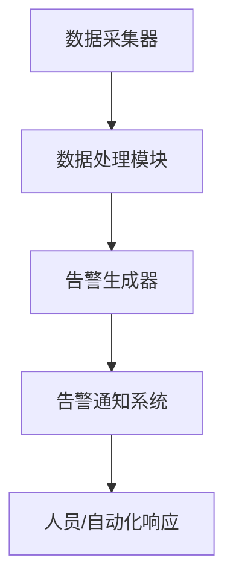

                 

### 监控告警：保障AI服务稳定性的必要措施

#### 关键词：
- AI服务稳定性
- 监控告警
- 基础知识
- 实施策略
- 工具与技术

> 在当今高度依赖人工智能（AI）技术的世界中，AI服务的稳定性变得尤为重要。任何性能下降或故障都可能对业务造成重大影响。本文将深入探讨监控告警在保障AI服务稳定性方面的必要性和关键措施，旨在为读者提供全面的指导。

#### 摘要：
本文旨在详细阐述监控告警系统在维护AI服务稳定性中的核心作用。通过分析AI服务的独特挑战，介绍监控告警的基础知识，阐述设计有效的监控告警策略的方法，以及探讨实用的监控工具和技术，本文旨在为读者提供一个完整的框架，以帮助他们在实际项目中实施有效的监控告警系统。

### 第一部分：监控告警的基础知识

#### 1.1 监控告警概述

监控告警是指通过系统、工具和流程实时监测IT服务或系统状态，并在检测到异常或性能问题时自动触发告警。监控告警系统不仅能够及时发现故障，还能预防潜在的稳定性问题。

#### 1.2 AI服务稳定性挑战

AI服务与传统IT系统相比，具有更高的复杂性和不确定性。以下是AI服务稳定性面临的几个主要挑战：

- **动态性和不确定性**：AI模型和算法通常是基于大量数据训练的，其性能会受到数据分布、噪声等因素的影响。
- **依赖性**：AI服务往往依赖于多个底层系统和资源，如数据存储、计算资源和网络等。
- **性能波动**：AI服务性能可能因训练数据、模型版本和系统负载等因素而波动。

#### 1.3 监控告警体系架构

监控告警体系通常包括以下几个关键组件：

1. **数据采集器**：负责收集系统、应用和网络等不同层面的数据。
2. **数据处理模块**：对采集到的数据进行处理、过滤和分析。
3. **告警生成器**：根据预设的规则和阈值生成告警。
4. **告警通知系统**：将告警通知发送给相关人员或自动化系统。

#### 1.4 Mermaid流程图：监控告警体系架构

以下是监控告警体系架构的Mermaid流程图：

### 第二部分：设计有效的监控告警策略

#### 2.1 监控目标与指标

监控目标是指监控系统的预期效果和目的，如检测故障、性能优化、容量规划等。监控指标（KPI）是实现监控目标的具体度量，常见的监控指标包括：

- **响应时间**：请求从接收至完成的时间。
- **错误率**：请求处理过程中发生错误的百分比。
- **吞吐量**：单位时间内处理的请求数量。

#### 2.2 告警策略制定

告警策略包括告警级别划分、触发条件和响应流程。以下是一个简化的告警策略示例：

- **告警级别**：低级、中级、高级。
- **触发条件**：响应时间超过阈值、错误率超过阈值、CPU利用率超过阈值等。
- **响应流程**：低级告警通知值班人员，中级告警通知技术团队，高级告警触发紧急响应流程。

#### 2.3 告警系统优化

告警系统优化旨在减少误报、漏报和告警疲劳。以下是一些优化策略：

- **阈值动态调整**：根据实际业务需求和数据分布动态调整监控阈值。
- **告警聚合**：合并多个相同或类似的告警，避免频繁触发。
- **告警分级**：根据告警严重程度和影响范围进行分级处理。

### 第三部分：监控工具与技术

#### 3.1 监控工具选型

在选型监控工具时，需要考虑以下因素：

- **功能需求**：如数据采集、数据处理、告警生成和通知等。
- **扩展性**：工具能否适应未来的业务需求。
- **集成能力**：工具与其他系统和服务的集成能力。

#### 3.2 数据采集与处理

数据采集是监控系统的核心，常见的数据采集方法包括：

- **Agent-based**：在目标系统上安装代理程序，收集数据。
- **Pull-based**：通过定期轮询的方式从目标系统获取数据。
- **Push-based**：目标系统主动推送数据。

数据处理包括数据预处理、分析、存储和可视化等步骤。常用的数据处理技术包括：

- **ETL（Extract, Transform, Load）**：数据提取、转换和加载。
- **流处理**：实时处理和分析大量数据。
- **时间序列分析**：分析时间序列数据，识别趋势和异常。

#### 3.3 告警通知与响应

告警通知系统负责将告警信息发送给相关人员或系统。常见的通知方式包括：

- **邮件**：发送告警通知到相关人员的邮箱。
- **短信**：发送告警通知到相关人员手机。
- **即时通讯工具**：如Slack、钉钉等。
- **自动化响应**：触发自动化脚本或流程，进行故障恢复或问题排查。

### 第四部分：AI服务监控案例分析

#### 4.1 案例研究一：电商平台AI服务稳定性监控

**案例背景**：某大型电商平台在其核心业务中引入了AI服务，如个性化推荐、智能客服等，以保证用户满意度。然而，AI服务的稳定性对其业务至关重要。

**监控体系设计**：平台采用了一套全面的监控体系，包括数据采集、数据处理、告警生成和通知等多个模块。

**监控告警实施与效果**：通过监控体系，平台能够实时监测AI服务的性能和稳定性，及时处理故障，有效提高了业务连续性。

#### 4.2 案例研究二：金融行业AI风险管理

**案例背景**：金融行业对AI服务的依赖日益增加，如风险管理、信用评分等。然而，AI服务的稳定性对金融市场的稳定具有重要影响。

**监控策略制定**：金融公司制定了一套严格的监控策略，包括监控指标、告警级别和响应流程等。

**监控告警实践**：通过监控体系，金融公司能够及时发现AI服务的异常，迅速采取措施，降低风险，确保业务稳定运行。

### 第五部分：总结与展望

#### 5.1 监控告警在AI服务稳定性中的作用

监控告警在保障AI服务稳定性中起着至关重要的作用。通过实时监测和快速响应，监控告警系统能够发现潜在问题，减少故障影响，提高业务连续性。

#### 5.2 未来监控告警技术的发展方向

随着AI和大数据技术的发展，监控告警系统也将不断演进。未来监控告警技术的发展方向包括：

- **智能化**：利用机器学习和数据挖掘技术，实现自动化的故障检测和预测。
- **可扩展性**：支持大规模分布式系统的监控需求。
- **用户体验**：提供更直观、易用的监控界面和告警通知方式。

#### 5.3 最佳实践 tips、小结、注意事项、拓展阅读

**最佳实践 tips**：

1. 确定合理的监控目标和指标。
2. 建立有效的告警策略，避免误报和漏报。
3. 选择适合的监控工具，确保其扩展性和集成能力。

**小结**：监控告警系统是保障AI服务稳定性的关键。通过设计有效的监控策略和选用合适的工具，企业可以确保AI服务的稳定性和可靠性。

**注意事项**：

1. 监控系统需要定期维护和优化，以适应业务需求的变化。
2. 告警通知方式应根据团队成员的工作时间和地点进行灵活调整。

**拓展阅读**：

1. 《监控告警实战：从入门到精通》
2. 《AI监控与故障管理》

---

作者：AI天才研究院/AI Genius Institute & 禅与计算机程序设计艺术 /Zen And The Art of Computer Programming

---

本文详细介绍了监控告警在保障AI服务稳定性中的重要作用，包括基础知识、设计策略、工具技术以及实际案例分析。通过本文的阅读，读者可以全面了解监控告警系统的核心概念和实践方法，为实际项目的实施提供有力指导。在未来的发展中，随着技术的不断进步，监控告警系统将更加智能化和高效化，为企业和个人提供更加可靠的保障。希望本文对您在AI服务稳定性监控方面有所启发和帮助。

