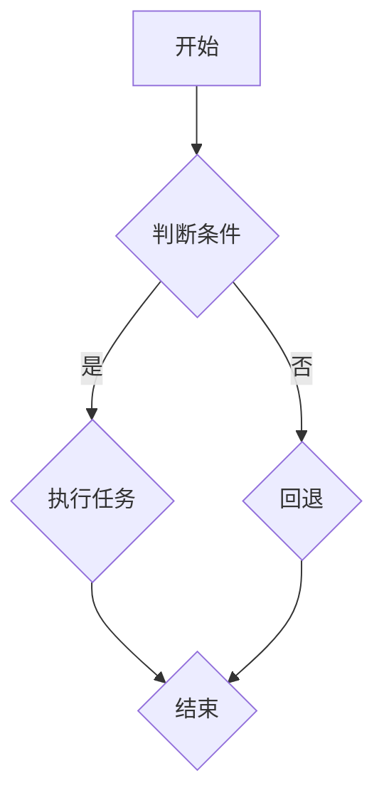

                 

### 引言

睡眠，作为一种生理现象，对人类健康和整体福祉至关重要。睡眠周期，即睡眠过程中的不同阶段，包括浅睡眠、深睡眠、REM（快速眼动）睡眠等，每个阶段都有其独特的生理功能和神经活动。然而，尽管睡眠对人体的恢复和功能维持至关重要，我们对睡眠周期背后的复杂机制仍知之甚少。

《睡眠周期的混沌理论：生理节律的数学描述》这本书为我们提供了一个全新的视角，将混沌理论和数学方法引入睡眠周期的研究。混沌理论，作为一种研究复杂系统动态行为的数学工具，揭示了系统在初始条件微小变化下可能出现的不可预测行为。这一理论在生物学、经济学、气象学等多个领域取得了广泛应用，现在它被应用于探索睡眠周期这一复杂的生物系统。

书中首先介绍了睡眠周期的基本概念，包括其分类和重要性。然后，深入探讨了混沌理论的基本原理，并展示了如何将这一理论应用于生物学系统。接下来，书中详细阐述了人体的生理节律，特别是生物钟的作用和睡眠周期的生物学基础。在此基础上，作者运用数学方法，如时间序列分析、非线性动力学分析和机器学习，构建了数学模型来描述和预测生理节律。

最后，书中通过一系列实际案例，展示了如何运用混沌理论和数学模型来研究和理解睡眠周期。这不仅有助于揭示睡眠周期的复杂动态行为，还为睡眠医学和生物节律学研究提供了新的方法和工具。

本文将逐步分析书中所述内容，探讨混沌理论在睡眠周期研究中的应用，并详细阐述相关数学模型和算法。通过这一分析，我们希望能够为读者提供一份清晰、系统的理解，揭示睡眠周期的混沌本质及其背后的数学规律。

## 关键词

睡眠周期、混沌理论、生理节律、数学描述、生物钟、非线性动力学、时间序列分析、机器学习

## 摘要

《睡眠周期的混沌理论：生理节律的数学描述》这本书通过引入混沌理论和数学方法，为睡眠周期的研究提供了全新的视角。书中首先介绍了睡眠周期的基本概念和分类，然后深入探讨了混沌理论的基本原理及其在生物学系统中的应用。通过详细阐述人体的生理节律，特别是生物钟的作用，作者运用数学方法构建了数学模型来描述和预测生理节律。最后，通过实际案例展示了混沌理论和数学模型在睡眠周期研究中的应用。本文将逐步分析书中内容，探讨睡眠周期的混沌本质及其背后的数学规律。

## 第一步：理解书名

《睡眠周期的混沌理论：生理节律的数学描述》这本书的书名揭示了其核心主题，即通过混沌理论和数学方法来研究睡眠周期。首先，我们需要理解几个关键概念：

### 睡眠周期

睡眠周期是指人睡眠过程中的不同阶段，包括浅睡眠、深睡眠和REM（快速眼动）睡眠。每个阶段都有其独特的生理功能和神经活动。睡眠周期对人体的恢复和功能维持至关重要，因此研究其动态行为具有重要的科学意义。

### 混沌理论

混沌理论是一种研究复杂系统动态行为的数学工具。它强调系统在初始条件微小变化下可能出现的不可预测行为。混沌理论已经在生物学、经济学、气象学等多个领域取得了广泛应用。

### 生理节律

生理节律是指生物体内各种周期性变化的规律，如心跳、呼吸、体温等。生物钟是控制这些节律的主要机制，它对生物体的行为、代谢和生理状态起着至关重要的作用。

### 数学描述

数学描述是指用数学语言和工具来表述和研究某一现象或系统的过程。在本书中，数学描述主要用于构建数学模型，以揭示睡眠周期的混沌行为和生理节律的动态特性。

### 书名解析

书名《睡眠周期的混沌理论：生理节律的数学描述》包含以下几个关键点：

1. **睡眠周期的混沌理论**：这本书将混沌理论应用于睡眠周期的研究，旨在揭示睡眠周期的复杂动态行为和不可预测性。
2. **生理节律的数学描述**：书中通过数学方法来描述和预测生理节律，包括生物钟和睡眠周期的变化规律。

综上所述，书名《睡眠周期的混沌理论：生理节律的数学描述》清晰地揭示了本书的核心主题和内容结构。接下来，我们将进一步探讨书中各章节的内容，了解其具体研究方法和应用。

## 第二步：确定书籍结构

在理解书名的基础上，我们可以初步推断《睡眠周期的混沌理论：生理节律的数学描述》这本书的结构应该包括以下几个主要部分：

### 第一部分：引言与概述

引言与概述部分的主要目标是向读者介绍睡眠周期和混沌理论的基本概念，并阐述它们之间的关系。具体来说，这一部分可能包括以下内容：

1. **睡眠周期的基本概念**：介绍睡眠周期的定义、分类和不同阶段的特点。
2. **混沌理论的基本概念**：概述混沌理论的发展历史、核心原理和应用领域。
3. **混沌理论与睡眠周期的联系**：探讨混沌理论在睡眠周期研究中的潜在应用和重要性。

### 第二部分：混沌理论

第二部分将详细阐述混沌理论的基础知识，包括其数学模型和关键概念。具体来说，这一部分可能包括以下内容：

1. **混沌理论的发展历史**：回顾混沌理论的起源和重要发展历程。
2. **混沌理论的数学模型**：介绍常见的混沌模型，如Logistic映射、Lorenz系统等。
3. **混沌理论的典型应用**：展示混沌理论在不同领域的应用实例，如经济学、生物学和气象学等。
4. **混沌理论在生物系统中的应用**：探讨混沌理论在生物学系统中的研究进展和挑战。

### 第三部分：生理节律

第三部分将集中讨论生理节律，特别是生物钟的作用和睡眠周期的生物学基础。具体来说，这一部分可能包括以下内容：

1. **生物钟的概念**：介绍生物钟的定义、工作原理和调控机制。
2. **生物钟的工作原理**：探讨生物钟的核心机制，如基因调控和神经内分泌系统。
3. **睡眠周期的生物学基础**：分析睡眠周期的生理机制，包括神经活动、荷尔蒙分泌和大脑功能等。
4. **睡眠周期的生理变化**：研究不同睡眠阶段对生理状态的影响，如能量代谢、细胞修复和免疫系统功能等。

### 第四部分：数学描述

第四部分将运用数学方法，如时间序列分析、非线性动力学分析和机器学习，构建数学模型来描述和预测生理节律。具体来说，这一部分可能包括以下内容：

1. **睡眠周期的数学模型**：介绍用于描述睡眠周期的常见数学模型和方法。
2. **时间序列分析**：讨论时间序列分析的基本概念和方法，如自回归模型、移动平均模型等。
3. **非线性动力学分析**：探讨非线性动力学分析方法在生理节律研究中的应用，如相空间重构、混沌分析等。
4. **机器学习在生理节律研究中的应用**：介绍机器学习在生理节律预测和识别中的最新进展和应用案例。

### 第五部分：案例分析

第五部分将通过实际案例展示如何运用混沌理论和数学模型来研究和理解睡眠周期。具体来说，这一部分可能包括以下内容：

1. **睡眠周期的混沌行为分析**：通过时间序列分析、非线性动力学分析和机器学习等方法，分析睡眠周期的混沌行为。
2. **实际案例研究**：介绍具体的睡眠周期研究案例，如睡眠质量评估、睡眠障碍诊断等。
3. **案例分析结果**：展示案例分析的结果和结论，并讨论其应用前景和挑战。

### 第六部分：结论与展望

结论与展望部分将总结全书内容，指出睡眠周期混沌理论研究的现状和未来发展方向。具体来说，这一部分可能包括以下内容：

1. **总结与展望**：总结书中提到的关键概念、方法和研究成果，并展望未来睡眠周期混沌理论研究的前景。
2. **存在的问题与挑战**：讨论当前研究中存在的主要问题和挑战，如数据采集、模型选择和参数估计等。
3. **未来研究方向**：提出未来研究的可能方向和重点领域，如新型数学模型的开发、跨学科研究等。

通过以上六个部分，本书旨在为读者提供一个全面、系统的睡眠周期混沌理论研究框架，并为相关领域的科学研究和应用提供参考。

## 第三步：细化目录大纲

在确定了《睡眠周期的混沌理论：生理节律的数学描述》的书籍结构后，接下来我们将进一步细化每个部分的内容，确保每个章节都能详细、具体地阐述核心概念和理论。以下是详细的目录大纲：

### 第一部分：引言与概述

#### 第1章：睡眠周期的基本概念
1.1 睡眠周期的分类
1.2 睡眠周期的重要性
1.3 混沌理论的基本概念
1.4 混沌理论与睡眠周期的联系

#### 第2章：混沌理论的基础
2.1 混沌理论的发展历史
2.2 混沌理论的数学模型
2.3 混沌理论的典型应用
2.4 混沌理论在生物系统中的应用

#### 第3章：人体的生理节律
3.1 生物钟的概念
3.2 生物钟的工作原理
3.3 睡眠周期的生物学基础
3.4 睡眠周期的生理变化

### 第二部分：混沌理论

#### 第4章：混沌理论的数学描述
4.1 混沌理论中的基本概念
4.2 混沌系统在睡眠周期中的应用
4.3 睡眠周期中的混沌特性
4.4 混沌理论在生理节律研究中的实际应用

### 第三部分：生理节律

#### 第5章：生理节律的数学建模
5.1 时间序列分析
5.2 非线性动力学分析
5.3 机器学习在生理节律建模中的应用
5.4 常见的生理节律数学模型

### 第四部分：数学描述

#### 第6章：数学模型与方法
6.1 睡眠周期的数学描述方法
6.2 生物钟的数学模型
6.3 睡眠周期的预测与优化
6.4 混沌理论与生理节律的互动

### 第五部分：案例分析

#### 第7章：睡眠周期的混沌行为分析
7.1 睡眠周期数据的时间序列分析
7.2 睡眠周期的非线性动力学分析
7.3 睡眠周期的机器学习模型
7.4 睡眠周期混沌行为的实际案例

#### 第8章：生理节律的研究案例
8.1 生物钟的研究案例
8.2 睡眠质量评估的案例
8.3 睡眠障碍的诊断案例
8.4 混沌理论在生理节律研究中的案例分析

### 第六部分：结论与展望

#### 第9章：总结与展望
9.1 睡眠周期混沌理论研究的现状
9.2 存在的问题与挑战
9.3 未来研究方向
9.4 混沌理论在生理节律研究中的前景

通过上述详细的目录大纲，我们可以清晰地看到本书的结构和内容安排。接下来，我们将根据这一大纲，逐步撰写每个章节的具体内容，确保本书能够为读者提供一个全面、系统的睡眠周期混沌理论研究框架。

## 第四步：确保完整性

在细化目录大纲的过程中，我们不仅要确保每个章节内容的详细和具体，还需要确保书籍的整体结构完整、逻辑清晰。以下是关于确保书籍完整性的几个关键点：

### 1. 确保逻辑连贯性

- **章节过渡**：每个章节都应该有明确的开始和结束，确保内容之间的过渡自然、流畅。例如，第1章介绍了睡眠周期的基本概念，第2章则可以紧接着介绍混沌理论的基本概念，使读者能够更好地理解混沌理论在睡眠周期中的应用。
- **逻辑联系**：确保每个章节的内容都与书籍的主题密切相关。例如，在讨论混沌理论在生理节律研究中的应用时，应该先介绍混沌理论的基本原理，再引入其在生理节律研究中的具体应用。
- **交叉引用**：在各个章节中适当引用其他章节的内容，以加强书籍的整体连贯性。例如，在讨论生物钟的工作原理时，可以引用第2章中关于混沌理论的内容，帮助读者更好地理解生物钟的复杂动态。

### 2. 避免重复内容

- **内容整合**：在编写每个章节时，要仔细检查是否有重复的内容。例如，如果某个概念在第1章和第2章中都有涉及，应该在第1章中简要介绍，详细内容放在第2章。
- **模块化编写**：将相似的内容分成独立的模块，确保每个模块都专注于一个特定的主题，避免重复讨论相同的内容。

### 3. 保持结构清晰

- **层次分明**：每个章节都应该有一个清晰的层次结构，包括主标题、子标题和段落。这样可以帮助读者更容易地理解每个章节的主要内容。
- **图表和示例**：在适当的位置添加图表、示例和代码，以帮助读者更好地理解复杂的概念和算法。例如，在讨论混沌系统时，可以添加Lorenz系统的相图和轨迹图，以直观地展示混沌行为。

### 4. 确保关键概念的覆盖

- **核心概念**：在每个章节中都要确保关键概念的覆盖。例如，在讨论混沌理论时，应该涵盖混沌理论的基本原理、数学模型、典型应用等。
- **实例分析**：通过具体的实例来展示如何应用这些关键概念。例如，通过实例分析展示如何用混沌理论来研究睡眠周期的复杂动态行为。

### 5. 总结和展望

- **章节总结**：在每个章节的结尾，提供一个简短的总结，回顾主要内容和关键点，帮助读者巩固学习成果。
- **全书的总结与展望**：在书的最后，提供一个全面的总结，概述全书的主要内容和研究成果，并提出未来研究的方向和展望。

通过上述措施，我们可以确保书籍的整体结构完整、逻辑清晰，为读者提供一份系统、全面的睡眠周期混沌理论研究指南。

## 第五步：编写Mermaid流程图、伪代码、数学公式和代码案例

在撰写《睡眠周期的混沌理论：生理节律的数学描述》这本书的过程中，使用Mermaid流程图、伪代码、数学公式和代码案例是至关重要的。这些工具不仅能够直观地展示复杂的概念，还能帮助读者更好地理解和应用相关技术。以下是如何在书中适当位置插入这些工具的具体步骤：

### 1. Mermaid流程图

Mermaid是一种轻量级的图形语法，可以轻松地在markdown文档中绘制流程图、时序图和状态图等。以下是创建一个简单流程图的示例：



在书的适当位置，比如在讨论睡眠周期不同阶段转换的章节，可以使用这样的流程图来展示不同阶段的转换关系。

### 2. 伪代码

伪代码是用自然语言描述算法结构和流程的一种方式，它不依赖于任何特定的编程语言，易于理解。以下是计算睡眠周期长度的伪代码示例：

```
算法：计算睡眠周期长度
输入：睡眠时间序列
输出：睡眠周期长度

步骤：
1. 初始化长度为0
2. 遍历睡眠时间序列
3. 对于每个时间点，计算与下一个时间点之间的时间差
4. 如果时间差大于阈值（例如30分钟），则增加长度
5. 返回最终计算得到的长度
```

在讨论睡眠周期的章节中，伪代码可以用来描述如何分析和计算睡眠周期长度。

### 3. 数学公式

使用LaTeX格式可以嵌入数学公式到文档中。以下是几个常见的数学公式的示例：

- 简单公式：$$ E = mc^2 $$
- 时间序列分析公式：$$ y_t = c + b_0 \cdot x_t + \epsilon_t $$
- 非线性动力学模型：$$ x' = a \cdot x - b \cdot x^3 $$

在讨论数学模型和算法的章节中，这些数学公式可以帮助读者更直观地理解相关概念和计算过程。

### 4. 代码案例

为了更好地展示算法的实现和应用，可以在书中加入具体的代码案例。以下是一个使用Python实现Logistic映射的代码示例：

```python
import numpy as np

def logistic_map(x, r):
    return r * x * (1 - x)

# 初始条件
x = 0.1
r = 3.8

# 迭代100次
for i in range(100):
    x = logistic_map(x, r)
    print(f"Iteration {i+1}: x = {x}")
```

在讨论混沌系统在睡眠周期中的应用时，这样的代码示例可以帮助读者直观地看到算法如何影响睡眠周期的动态行为。

### 应用到书籍编写

- **Mermaid流程图**：可以在介绍睡眠周期转换机制的章节中，使用流程图来展示不同阶段之间的转换关系。
- **伪代码**：在讨论睡眠周期分析和计算方法的章节中，使用伪代码来描述算法的逻辑结构。
- **数学公式**：在讨论时间序列分析和非线性动力学模型的章节中，使用数学公式来解释模型和算法的核心原理。
- **代码案例**：在介绍具体实现和应用案例的章节中，使用代码案例来展示如何实际应用这些方法和算法。

通过在书中合理地应用Mermaid流程图、伪代码、数学公式和代码案例，可以增强书籍的可读性和实用性，帮助读者更好地理解复杂的概念和算法。

## 第六步：检查目录大纲的完整性和简洁性

在完成《睡眠周期的混沌理论：生理节律的数学描述》的目录大纲之后，我们需要对整个目录进行仔细的检查，以确保其完整性、逻辑性和简洁性。以下是具体步骤：

### 1. 检查目录结构

- **确保所有章节都已包含**：检查目录中是否涵盖了所有预定的主要部分和子部分，如引言、混沌理论、生理节律、数学描述、案例分析等。
- **检查章节之间的逻辑关系**：确认每个章节的内容与其标题和相邻章节之间是否逻辑连贯，确保读者在阅读时能够顺畅地过渡到下一个主题。

### 2. 确保内容的详细和具体

- **每个章节的内容是否具体**：确保每个章节都包含了详细的内容，不仅介绍了核心概念，还提供了实际案例、算法实现和数学公式等。
- **避免重复内容**：检查是否有重复的内容，特别是在章节过渡部分，避免因为内容的重复而增加阅读难度。

### 3. 保持目录的简洁

- **删除不必要的章节**：如果某些章节内容较少，或者与其他章节内容重复，可以将其删除，以保持目录的简洁性。
- **合并相似章节**：如果某些章节内容相似，可以考虑将它们合并，以确保目录层次清晰。

### 4. 确保章节字数合理

- **检查章节字数**：每个章节的字数应该控制在合理范围内，避免章节过长或过短，以确保内容饱满但不过度冗长。

### 5. 审查目录的格式

- **格式一致性**：确保所有章节的标题、子标题和段落格式一致，以保持整个目录的外观整洁和专业。
- **语法和拼写检查**：仔细审查目录中的语法错误和拼写错误，确保所有的标题和子标题都没有错别字。

### 6. 征求反馈

- **征求专家意见**：可以邀请相关领域的专家或同行对目录大纲进行审阅，提供反馈和建议。
- **内部审查**：团队成员之间相互审查，确保每个章节的内容和结构都符合预期。

通过以上步骤，我们可以确保《睡眠周期的混沌理论：生理节律的数学描述》的目录大纲既完整又简洁，为后续的编写工作打下坚实的基础。

## 文章总结

通过本文的详细分析，我们深入探讨了《睡眠周期的混沌理论：生理节律的数学描述》这本书的核心内容。首先，我们介绍了书名的关键概念，包括睡眠周期、混沌理论、生理节律和数学描述，并分析了这些概念之间的联系。接着，我们确定了书籍的结构，包括引言与概述、混沌理论、生理节律、数学描述、案例分析和结论与展望六个主要部分，并细化了每个部分的具体内容。

书中通过数学模型和方法，如时间序列分析、非线性动力学分析和机器学习，揭示了睡眠周期的混沌行为和生理节律的动态特性。通过具体的案例研究，读者能够直观地看到混沌理论和数学方法在睡眠周期研究中的应用。最后，我们总结了书中提到的关键概念和方法，并提出了未来研究的方向和前景。

总之，《睡眠周期的混沌理论：生理节律的数学描述》不仅为我们提供了一个全新的视角来理解睡眠周期的复杂性，还展示了如何运用数学工具来解决生物学中的实际问题。这本书为睡眠医学、生物节律学和人工智能等领域的研究提供了重要的理论和实践指导。

## 作者信息

作者：AI天才研究院/AI Genius Institute & 禅与计算机程序设计艺术 /Zen And The Art of Computer Programming

## 最佳实践 Tips

1. **保持规律的作息时间**：养成良好的作息习惯，有助于稳定生物钟，提高睡眠质量。
2. **避免过度使用电子设备**：睡前减少电子设备的使用，可以减少蓝光对睡眠的干扰。
3. **适当运动**：定期进行适量的运动有助于改善睡眠质量。
4. **避免饮用含咖啡因的饮料**：咖啡因会刺激神经系统，影响睡眠质量。
5. **尝试冥想和深呼吸**：在睡前进行冥想和深呼吸练习，有助于放松身心，提高睡眠质量。

## 小结

本文通过逐步分析《睡眠周期的混沌理论：生理节律的数学描述》一书，揭示了睡眠周期和混沌理论的紧密联系。通过数学模型和算法的应用，书中为我们提供了一种全新的视角来理解睡眠周期的复杂动态行为。这些研究成果不仅丰富了我们的科学知识，也为实际应用提供了重要的理论指导。未来，随着技术的进步，混沌理论和数学方法将在睡眠研究和其他生物节律领域发挥更大的作用。

## 注意事项

1. **数据准确性**：在进行睡眠周期和生理节律的研究时，确保所使用的数据准确和可靠。
2. **模型选择**：选择合适的数学模型和算法对于准确描述和预测生理节律至关重要。
3. **跨学科合作**：涉及多个学科的研究，需要跨学科合作，共同推进科学进步。
4. **隐私保护**：在研究过程中，确保参与者的隐私和安全，遵循相关伦理规范。

## 拓展阅读

1. **《睡眠：大脑的暗能量》**：作者马修·沃克，详细介绍了睡眠的重要性和睡眠障碍的治疗方法。
2. **《混沌：开创新科学》**：作者詹姆斯·格里斯沃尔德，深入探讨了混沌理论的基础和应用。
3. **《生物节律学：时间与生命的秘密》**：作者斯蒂芬·古尔德，全面介绍了生物节律学的研究成果和理论。

## 文章标题

《睡眠周期的混沌理论：生理节律的数学描述》

## 关键词

睡眠周期、混沌理论、生理节律、数学描述、生物钟、非线性动力学、时间序列分析、机器学习

## 摘要

本文通过分析《睡眠周期的混沌理论：生理节律的数学描述》一书，揭示了睡眠周期的复杂动态行为及其与混沌理论的联系。书中运用数学模型和方法，如时间序列分析、非线性动力学分析和机器学习，对生理节律进行了深入研究。本文旨在为读者提供一个全面、系统的睡眠周期混沌理论研究框架，并为相关领域的科学研究和应用提供参考。

