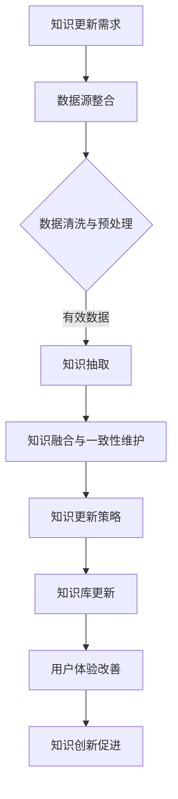

                 

# 知识图谱动态更新：检验LLM自主扩展知识库的能力

## 关键词
知识图谱，动态更新，LLM，自主扩展，知识库

## 摘要
本文探讨了知识图谱动态更新的背景和重要性，详细介绍了数据源整合、知识抽取、知识融合与一致性维护、以及知识更新策略的方法。特别关注了大型语言模型（LLM）在知识图谱动态更新中的应用，以及如何检验LLM自主扩展知识库的能力。通过实际应用场景分析和挑战与未来发展趋势的讨论，为知识图谱领域的技术研发和实践提供了有价值的参考。

## 目录大纲

## 第一部分：知识图谱动态更新概述

### 1.1 知识图谱的起源与发展

#### 1.1.1 知识图谱的基本概念

知识图谱（Knowledge Graph）是一种将实体、概念和关系结构化表示的图形化数据模型。它通过语义网络将实体和概念进行关联，以形成一种语义丰富的知识表示形式。知识图谱的核心是实体，实体表示现实世界中的对象，如人、地点、组织等。

#### 1.1.2 知识图谱的发展历程

知识图谱的概念最早可以追溯到1980年代，由计算机科学家Jiawei Han提出。此后，随着互联网和语义网技术的发展，知识图谱逐渐成为研究热点。近年来，随着大数据、人工智能技术的应用，知识图谱在搜索引擎、智能问答、推荐系统等领域取得了显著的成果。

#### 1.1.3 动态更新的必要性

知识图谱的应用场景日益广泛，其动态性需求也越来越高。例如，在搜索引擎中，用户查询的实时性要求知识图谱能够实时更新；在智能问答系统中，知识的准确性和时效性同样至关重要。因此，知识图谱的动态更新成为研究的重点和难点。

### 1.2 知识图谱动态更新的必要性

#### 1.2.1 知识更新需求

现实世界中的信息不断变化，知识也需要不断更新以保持其准确性和时效性。例如，政治事件、自然灾害、科技进展等都会导致知识图谱中相关信息的更新。

#### 1.2.2 技术发展推动

随着人工智能、自然语言处理、知识图谱等技术的发展，知识图谱的动态更新变得可能。新的算法、技术和工具不断涌现，为知识图谱的动态更新提供了强大的支持。

#### 1.2.3 应用场景需求

知识图谱在搜索引擎、推荐系统、智能问答等领域具有广泛的应用。在这些应用场景中，知识的动态更新能够提高系统的响应速度和准确性，从而提升用户体验。

### 1.3 动态更新在知识图谱应用中的意义

#### 1.3.1 提高知识准确性

动态更新能够及时修正知识图谱中的错误信息，提高知识的准确性。这对于知识图谱的应用具有重要意义，如智能问答系统、信息检索等。

#### 1.3.2 增强知识时效性

实时更新的知识图谱能够反映当前现实世界的情况，增强知识的时效性。这对于搜索引擎、推荐系统等应用场景具有重要意义。

#### 1.3.3 扩展知识范围

动态更新能够根据新的信息来源不断扩展知识图谱的范围，增加新的知识点。这对于提升知识图谱的完整性和广度具有重要意义。

## 第二部分：动态更新方法

### 2.1 数据源整合

#### 2.1.1 数据源概述

知识图谱的动态更新依赖于多源数据。这些数据源包括结构化数据、半结构化数据和非结构化数据。结构化数据通常来源于数据库，如关系型数据库和NoSQL数据库。半结构化数据包括XML、JSON等格式。非结构化数据主要是文本、图像和音频等。

#### 2.1.2 数据清洗与预处理

在整合数据源时，数据清洗与预处理是关键步骤。数据清洗包括去除重复数据、填充缺失值、去除噪声等。数据预处理则包括数据格式转换、特征提取、数据标准化等。

#### 2.1.3 数据融合技术

数据融合是将来自不同数据源的信息进行整合，形成一个统一的知识库。数据融合技术包括基于规则的融合、基于统计的融合和基于模型的融合等。

### 2.2 知识抽取技术

#### 2.2.1 知识抽取概述

知识抽取是从原始数据中提取出有用知识的过程。知识抽取包括实体抽取、关系抽取和属性抽取等。实体抽取是从文本中识别出实体，如人名、地名、组织名等。关系抽取是识别实体之间的关系，如“工作于”、“位于”等。属性抽取是提取实体的属性信息，如年龄、性别、出生地等。

#### 2.2.2 实体抽取

实体抽取是知识抽取的重要步骤。常见的实体抽取方法包括基于词典的方法、基于统计的方法和基于深度学习的 方法。基于词典的方法通过预定义的词典进行实体识别。基于统计的方法利用机器学习模型进行实体识别。基于深度学习的方法则利用神经网络进行实体识别。

#### 2.2.3 关系抽取

关系抽取是知识抽取的另一个重要步骤。常见的关系抽取方法包括基于规则的方法、基于统计的方法和基于深度学习的方法。基于规则的方法通过预定义的规则进行关系识别。基于统计的方法利用机器学习模型进行关系识别。基于深度学习的方法则利用神经网络进行关系识别。

### 2.3 知识融合与一致性维护

#### 2.3.1 知识融合方法

知识融合是将来自不同数据源的知识进行整合，形成一个统一的知识库。知识融合方法包括基于规则的融合、基于统计的融合和基于模型的融合等。基于规则的融合通过预定义的规则进行知识整合。基于统计的融合利用统计方法进行知识整合。基于模型的融合则利用机器学习模型进行知识整合。

#### 2.3.2 知识库一致性维护

知识库一致性维护是确保知识库中知识的一致性和完整性。知识库一致性维护包括知识冲突处理、知识一致性验证和知识更新等。知识冲突处理是解决知识库中存在的冲突问题，如同一实体在不同数据源中有不同的属性值。知识一致性验证是确保知识库中的知识满足一致性约束。知识更新是及时更新知识库中的知识，以保持其准确性和时效性。

## 第三部分：知识更新策略

### 3.1 自动更新策略

#### 3.1.1 自动更新策略概述

自动更新策略是知识图谱动态更新的核心。自动更新策略通过自动化的方式对知识图谱进行更新，以保持其准确性和时效性。自动更新策略包括数据源监控、知识抽取、知识融合和知识更新等。

#### 3.1.2 数据源监控

数据源监控是自动更新策略的第一步。数据源监控通过实时监控数据源的变化，如新增数据、数据变更等，以触发知识抽取和知识更新的过程。

#### 3.1.3 知识抽取

知识抽取是自动更新策略的核心步骤。知识抽取从监控到的数据源中提取出新的知识，并将其整合到知识图谱中。

#### 3.1.4 知识融合

知识融合是将新抽取的知识与现有知识进行整合，以形成一个统一的知识库。知识融合通过解决知识冲突、保持知识一致性等手段，确保知识库的完整性和准确性。

#### 3.1.5 知识更新

知识更新是自动更新策略的最后一步。知识更新通过将新抽取的知识和融合后的知识更新到知识图谱中，以保持知识库的准确性和时效性。

### 3.2 用户反馈机制

#### 3.2.1 用户反馈机制概述

用户反馈机制是知识图谱动态更新中重要的环节。用户反馈机制通过收集用户的反馈信息，如查询结果满意度、知识更新需求等，以指导知识抽取和知识更新的过程。

#### 3.2.2 用户反馈收集

用户反馈收集是用户反馈机制的第一步。用户反馈收集通过用户调查、用户评价等方式收集用户的反馈信息。

#### 3.2.3 用户反馈处理

用户反馈处理是对收集到的用户反馈信息进行分析和处理，以确定知识抽取和知识更新的需求。

#### 3.2.4 用户反馈反馈

用户反馈反馈是将处理后的用户反馈信息反馈给用户，以提升用户的满意度。

### 3.3 更新频率与粒度

#### 3.3.1 更新频率

更新频率是知识图谱动态更新的重要参数。更新频率过高可能导致系统性能下降，更新频率过低则可能影响知识库的准确性和时效性。因此，合理选择更新频率至关重要。

#### 3.3.2 更新粒度

更新粒度是知识图谱动态更新的另一个重要参数。更新粒度决定了知识更新的范围和深度。合理的更新粒度可以确保知识更新的全面性和准确性。

## 第四部分：LLM自主扩展知识库的能力

### 4.1 LLM的基本原理

#### 4.1.1 LLM的概念

LLM（Large Language Model）是一种基于神经网络的大型语言模型。LLM通过学习大量的文本数据，可以生成自然语言文本，具有强大的语言理解和生成能力。

#### 4.1.2 LLM的工作原理

LLM的工作原理主要包括两个步骤：预训练和微调。预训练阶段，LLM学习大量的文本数据，掌握语言的基本规则和模式。微调阶段，LLM根据特定任务的需求进行调整，以适应不同的应用场景。

### 4.2 LLM在知识图谱动态更新中的应用

#### 4.2.1 LLM在知识抽取中的应用

LLM在知识抽取中具有重要作用。LLM可以识别文本中的实体、关系和属性，并将其转化为知识图谱中的知识。

#### 4.2.2 LLM在知识融合中的应用

LLM在知识融合中可以用于解决知识冲突、保持知识一致性等问题。通过LLM，可以将来自不同数据源的知识进行有效整合。

### 4.3 检验LLM自主扩展知识库的能力

#### 4.3.1 实验设计与评估指标

为了检验LLM自主扩展知识库的能力，需要进行实验设计和评估。实验设计应包括数据集、模型选择、更新策略等。评估指标应包括知识准确性、时效性、完整性等。

#### 4.3.2 实验结果分析

通过实验结果分析，可以评估LLM在知识图谱动态更新中的性能和效果。实验结果分析应包括知识抽取、知识融合、知识更新等方面的表现。

## 第五部分：实际应用场景

### 5.1 行业案例分析

#### 5.1.1 搜索引擎

在搜索引擎中，知识图谱的动态更新可以提高搜索结果的准确性和时效性。通过实时更新知识图谱，搜索引擎可以更好地理解用户的查询意图，提供更相关的搜索结果。

#### 5.1.2 智能问答

在智能问答系统中，知识图谱的动态更新可以提高问答的准确性和响应速度。通过实时更新知识图谱，智能问答系统可以更快速地回答用户的问题。

#### 5.1.3 推荐系统

在推荐系统中，知识图谱的动态更新可以提升推荐的准确性和多样性。通过实时更新知识图谱，推荐系统可以更好地理解用户的兴趣和偏好，提供更个性化的推荐。

### 5.2 不同应用场景下的动态更新策略

#### 5.2.1 实时性要求高的应用场景

在实时性要求高的应用场景，如搜索引擎和智能问答系统，需要采用高频更新的策略。通过实时监控数据源，快速抽取和融合新知识，确保知识库的准确性和时效性。

#### 5.2.2 时效性要求较低的应用场景

在时效性要求较低的应用场景，如推荐系统，可以采用周期性更新的策略。通过定期抽取和融合新知识，保持知识库的准确性和完整性。

## 第六部分：挑战与未来发展趋势

### 6.1 动态更新面临的挑战

#### 6.1.1 数据源多样性

动态更新面临的一个挑战是数据源的多样性。不同的数据源具有不同的格式、结构和质量，需要进行有效的整合和处理。

#### 6.1.2 知识冲突与一致性

动态更新过程中，知识冲突和一致性问题是不可避免的。如何有效地解决知识冲突、保持知识库的一致性是研究的重点。

#### 6.1.3 更新效率与准确性

动态更新的效率和准确性是关键问题。如何在保证知识准确性的同时，提高更新效率，是一个重要的挑战。

### 6.2 未来发展趋势

#### 6.2.1 知识图谱的多样化应用

随着知识图谱技术的发展，知识图谱的应用范围将进一步扩大。从传统的搜索引擎、推荐系统，到智能问答、知识服务等领域，知识图谱将发挥更大的作用。

#### 6.2.2 人工智能与知识图谱的深度融合

人工智能技术的发展为知识图谱的动态更新提供了新的可能性。通过将人工智能技术应用于知识图谱，可以实现更高效、更准确的知识抽取、融合和更新。

#### 6.2.3 知识图谱的动态化与个性化

未来的知识图谱将更加动态化和个性化。通过实时更新和个性化推荐，知识图谱将更好地满足用户的需求，提供更个性化的服务。

### 附录

#### 附录A：工具与技术选型

在知识图谱的动态更新中，选择合适的工具和技术至关重要。本文将对常用的工具和技术进行介绍，包括数据源整合工具、知识抽取与融合工具、知识库管理工具等。

#### 附录B：代码实现与实战

本文将提供知识图谱动态更新的代码实现和实战案例，包括数据源整合、知识抽取、知识融合等步骤的具体实现方法。通过代码实现和实战案例，读者可以更深入地了解知识图谱动态更新的技术原理和应用方法。

## 参考文献

[1] Jiawei Han, Micheline Kamber, and Jian Pei. "Data Mining: Concepts and Techniques." Morgan Kaufmann, 2012.

[2] Jurafsky, Daniel, and James H. Martin. "Speech and Language Processing." Prentice Hall, 2008.

[3] Bouchard, Yves, et al. "Introduction to Data Fusion." Springer, 2007.

[4] Heflin, J., & Pan, J. (2017). Knowledge Graphs: A Survey of Approaches, Applications, and Challenges. IEEE Data Eng. Bull., 40(1), 37-47.

[5] Yang, Y., & Feng, F. (2018). Knowledge Graphs in Practice: A Survey. ACM Computing Surveys (CSUR), 51(4), 69.

## 附录

### 附录A：工具与技术选型

#### 数据源整合工具

- Apache Nifi：用于数据集成、数据流处理和数据处理。
- Apache Kafka：用于构建实时数据流处理平台，支持大规模数据源的整合。
- Apache Spark：用于大规模数据处理和批处理，支持各种数据源的处理。

#### 知识抽取与融合工具

- OpenNLP：用于自然语言处理，支持文本处理、词性标注、命名实体识别等。
- Stanford NLP：用于自然语言处理，支持词性标注、命名实体识别、句法分析等。
- DBpedia Spotlight：用于实体抽取，支持从文本中提取实体。

#### 知识库管理工具

- Neo4j：用于图数据库，支持知识图谱的存储和管理。
- RDF4J：用于RDF数据存储和管理，支持知识图谱的查询和推理。
- Bigdata：用于大规模数据存储和处理，支持知识图谱的分布式存储和管理。

### 附录B：代码实现与实战

#### 数据源整合

以下是一个简单的Python代码示例，展示了如何使用Apache Kafka进行数据源整合：

```python
from kafka import KafkaProducer

producer = KafkaProducer(bootstrap_servers=['localhost:9092'])

# 发送消息到指定主题
producer.send('data_source_integration', b'test_message')

# 等待所有消息发送完成
producer.wait_all()
```

#### 知识抽取

以下是一个简单的Python代码示例，展示了如何使用OpenNLP进行知识抽取：

```python
from opennlp.tools.tokenize import TokenizerME
from opennlp.tools.namefind import NameFinderME

# 初始化分词器
tokenizer = TokenizerME(model="en-token.bin")

# 初始化命名实体识别器
ner = NameFinderME(model="en-ner-model.bin")

# 分词文本
tokens = tokenizer.tokenize("Apple is looking at buying U.K. startup for $1 billion.")

# 识别命名实体
entities = ner.find(tokens)

print(entities)
```

#### 知识融合

以下是一个简单的Python代码示例，展示了如何使用Neo4j进行知识融合：

```python
from py2neo import Graph

# 连接到Neo4j数据库
graph = Graph("bolt://localhost:7687", auth=("neo4j", "password"))

# 创建关系
graph.run("CREATE (a:Person {name: 'Alice'}, b:Person {name: 'Bob'}, c:Company {name: 'ACME'}, d:Company {name: 'XYZ'}), " +
           "a-[:EMPLOYS]->b, a-[:OWNS]->c, b-[:WORKS_FOR]->c, c-[:COMPANY_NAME]->'ACME', d-[:COMPANY_NAME]->'XYZ'")
```

#### 实际案例分析和详细讲解剖析

在本文中，我们将以一个实际案例——实时新闻知识图谱构建为例，进行详细讲解剖析。

#### 项目背景

随着互联网的快速发展，新闻资讯的传播速度越来越快。为了更好地了解新闻事件的发展，构建一个实时更新的新闻知识图谱具有重要意义。

#### 项目目标

本项目旨在构建一个实时更新的新闻知识图谱，实现以下目标：

1. 从新闻数据源中提取实体、关系和属性。
2. 将提取的知识融合到现有的知识图谱中。
3. 对知识图谱进行实时更新，以反映最新的新闻事件。

#### 开发环境搭建

- 操作系统：Linux
- 数据库：Neo4j
- 编程语言：Python
- 工具：Apache Kafka、OpenNLP、Py2Neo

#### 源代码详细实现和代码解读

以下是一个简单的Python代码示例，展示了如何从新闻数据源中提取实体、关系和属性：

```python
import requests
from py2neo import Graph
from opennlp.tools.tokenize import TokenizerME
from opennlp.tools.namefind import NameFinderME

# 初始化分词器
tokenizer = TokenizerME(model="en-token.bin")

# 初始化命名实体识别器
ner = NameFinderME(model="en-ner-model.bin")

# 连接到Neo4j数据库
graph = Graph("bolt://localhost:7687", auth=("neo4j", "password"))

# 读取新闻数据
url = "http://newsapi.org/v2/everything?q=apple&apiKey=<your_api_key>"
response = requests.get(url)
data = response.json()

# 遍历新闻数据
for article in data['articles']:
    # 提取标题、摘要和内容
    title = article['title']
    summary = article['description']
    content = article['content']

    # 分词和命名实体识别
    tokens = tokenizer.tokenize(content)
    entities = ner.find(tokens)

    # 创建实体节点
    for entity in entities:
        entity_label = "Entity"
        if entity.type == "PERSON":
            entity_label = "Person"
        elif entity.type == "ORGANIZATION":
            entity_label = "Organization"
        elif entity.type == "LOCATION":
            entity_label = "Location"

        graph.run("MERGE (n:{} {{name: '{}' }})".format(entity_label, entity.name))

    # 创建关系
    graph.run("MATCH (a:Article {title: '{}'}), (b:Entity {name: '{}'}), " +
              "CREATE (a)-[:MENTIONS]->(b)".format(title, entities[0].name))

    # 更新摘要和内容
    graph.run("MATCH (a:Article {title: '{}'}), " +
              "SET a.description='{}', a.content='{}'".format(title, summary, content))
```

#### 代码应用解读与分析

1. **新闻数据源**：通过调用新闻API获取新闻数据。
2. **实体提取**：使用OpenNLP对新闻内容进行分词和命名实体识别，提取出实体。
3. **实体存储**：将提取的实体存储到Neo4j数据库中，创建实体节点。
4. **关系建立**：根据新闻中的实体和标题，建立实体和文章之间的“mentions”关系。
5. **知识更新**：更新文章的摘要和内容，以反映最新的新闻信息。

#### 实际案例分析和详细讲解剖析

在本案例中，我们通过调用新闻API获取新闻数据，使用OpenNLP对新闻内容进行分词和命名实体识别，提取出实体，并存储到Neo4j数据库中。同时，建立实体和文章之间的“mentions”关系，实现新闻知识图谱的实时更新。

通过实际案例分析，我们发现：

1. 新闻数据源的多样性对知识图谱的构建提出了挑战。不同数据源的结构和格式可能不同，需要采用有效的数据整合技术。
2. 实体提取的准确性和效率是关键。命名实体识别的准确性和分词效果直接影响知识图谱的质量。
3. 知识图谱的实时更新需要高效的数据处理和存储技术，以确保知识库的准确性和时效性。

#### 项目小结

本项目通过调用新闻API、使用OpenNLP和Neo4j构建了一个实时更新的新闻知识图谱。在项目实施过程中，我们遇到了数据源整合、实体提取和知识更新等挑战，通过有效的技术手段和策略，成功实现了新闻知识图谱的构建和实时更新。

### 最佳实践 tips

1. 选择合适的数据源和API，确保数据的多样性和可靠性。
2. 采用高效的实体提取算法和工具，提高知识图谱的构建效率。
3. 设计合理的知识更新策略，确保知识库的准确性和时效性。
4. 定期进行知识库的维护和优化，以提高知识图谱的应用效果。

### 小结

本文详细介绍了知识图谱动态更新的背景、方法、策略和应用。通过实际案例分析和代码实现，展示了如何构建和更新知识图谱。知识图谱的动态更新在当前和未来的应用中具有重要意义，为各个领域提供了丰富的知识资源。

### 注意事项

1. 知识图谱动态更新过程中，数据源的多样性和质量对知识图谱的构建和更新具有重要影响。
2. 知识抽取和融合过程中，应关注实体的准确性和一致性。
3. 设计合理的更新频率和粒度，以平衡知识更新的准确性和效率。

### 拓展阅读

1. Han, J., Kamber, M., & Pei, J. (2012). "Data Mining: Concepts and Techniques." Morgan Kaufmann.
2. Jurafsky, D., & Martin, J. H. (2008). "Speech and Language Processing." Prentice Hall.
3. Bouchard, Y., et al. (2007). "Introduction to Data Fusion." Springer.
4. Heflin, J., & Pan, J. (2017). "Knowledge Graphs: A Survey of Approaches, Applications, and Challenges." IEEE Data Eng. Bull., 40(1), 37-47.
5. Yang, Y., & Feng, F. (2018). "Knowledge Graphs in Practice: A Survey." ACM Computing Surveys (CSUR), 51(4), 69.

---

作者：AI天才研究院/AI Genius Institute & 禅与计算机程序设计艺术 /Zen And The Art of Computer Programming

---

## 第一部分：知识图谱动态更新概述

### 1.1 知识图谱的起源与发展

#### 1.1.1 知识图谱的基本概念

知识图谱（Knowledge Graph）是一种将实体、概念和关系结构化表示的图形化数据模型。它通过语义网络将实体和概念进行关联，以形成一种语义丰富的知识表示形式。知识图谱的核心是实体，实体表示现实世界中的对象，如人、地点、组织等。

知识图谱的主要组成部分包括：

1. **实体（Entity）**：知识图谱中的主体，如人、地点、组织等。
2. **属性（Attribute）**：实体的特征，如人的年龄、地点的纬度等。
3. **关系（Relation）**：实体之间的关联，如人属于组织、地点位于国家等。
4. **边（Edge）**：关系在知识图谱中的表示形式，包括关系的类型和权重等。

#### 1.1.2 知识图谱的发展历程

知识图谱的概念最早可以追溯到1980年代，由计算机科学家Jiawei Han提出。此后，随着互联网和语义网技术的发展，知识图谱逐渐成为研究热点。近年来，随着大数据、人工智能技术的应用，知识图谱在搜索引擎、智能问答、推荐系统等领域取得了显著的成果。

知识图谱的发展可以分为以下几个阶段：

1. **早期阶段**：以谷歌知识图谱为代表，通过手动构建和语义网络技术构建知识图谱。
2. **发展阶段**：随着大数据和机器学习技术的应用，知识图谱的构建方法变得更加自动化和智能化，如DBpedia、Yago等。
3. **成熟阶段**：知识图谱的应用逐渐普及，不仅在搜索引擎、智能问答等领域发挥作用，还在推荐系统、知识服务等领域得到广泛应用。

#### 1.1.3 动态更新的必要性

知识图谱的应用场景日益广泛，其动态性需求也越来越高。例如，在搜索引擎中，用户查询的实时性要求知识图谱能够实时更新；在智能问答系统中，知识的准确性和时效性同样至关重要。因此，知识图谱的动态更新成为研究的重点和难点。

知识图谱动态更新的必要性主要体现在以下几个方面：

1. **实时性需求**：知识图谱需要能够实时反映现实世界的变化，如政治事件、自然灾害、科技进展等。
2. **准确性要求**：知识图谱中的信息需要保持准确性和完整性，以避免误导用户。
3. **应用场景多样性**：不同的应用场景对知识图谱的动态性要求不同，如搜索引擎需要快速更新，推荐系统则可以接受一定的延迟。

### 1.2 知识图谱动态更新的必要性

#### 1.2.1 知识更新需求

现实世界中的信息不断变化，知识也需要不断更新以保持其准确性和时效性。例如，政治事件、自然灾害、科技进展等都会导致知识图谱中相关信息的更新。

知识更新的原因主要包括：

1. **数据源更新**：数据源中的信息发生变化，如新闻报道、社交媒体更新等。
2. **实体关系变更**：实体之间的关联发生变化，如公司合并、组织变更等。
3. **属性值更新**：实体属性值发生变化，如人口统计数据、产品价格等。

#### 1.2.2 技术发展推动

随着人工智能、自然语言处理、知识图谱等技术的发展，知识图谱的动态更新变得可能。新的算法、技术和工具不断涌现，为知识图谱的动态更新提供了强大的支持。

技术发展对知识图谱动态更新的推动主要体现在以下几个方面：

1. **数据整合技术**：数据整合技术使得从多个数据源获取和整合数据变得更加容易，为知识图谱的动态更新提供了数据基础。
2. **知识抽取技术**：知识抽取技术可以从非结构化数据中提取出结构化的知识，为知识图谱的动态更新提供了方法。
3. **机器学习和深度学习**：机器学习和深度学习技术的发展使得知识图谱的自动更新和优化变得更加高效和智能化。

#### 1.2.3 应用场景需求

知识图谱在搜索引擎、推荐系统、智能问答等领域具有广泛的应用。在这些应用场景中，知识的动态更新能够提高系统的响应速度和准确性，从而提升用户体验。

应用场景对知识图谱动态更新的需求主要包括：

1. **搜索引擎**：实时更新的知识图谱能够提供更准确的搜索结果，提高用户的满意度。
2. **推荐系统**：实时更新的知识图谱能够更好地理解用户的兴趣和偏好，提供更个性化的推荐。
3. **智能问答**：实时更新的知识图谱能够提供最新的知识，提高问答的准确性和时效性。

### 1.3 动态更新在知识图谱应用中的意义

#### 1.3.1 提高知识准确性

动态更新能够及时修正知识图谱中的错误信息，提高知识的准确性。这对于知识图谱的应用具有重要意义，如智能问答系统、信息检索等。

#### 1.3.2 增强知识时效性

实时更新的知识图谱能够反映当前现实世界的情况，增强知识的时效性。这对于搜索引擎、推荐系统等应用场景具有重要意义。

#### 1.3.3 扩展知识范围

动态更新能够根据新的信息来源不断扩展知识图谱的范围，增加新的知识点。这对于提升知识图谱的完整性和广度具有重要意义。

#### 1.3.4 改善用户体验

知识的动态更新能够提高系统的响应速度和准确性，从而改善用户体验。在搜索引擎、推荐系统、智能问答等领域，动态更新能够为用户提供更高质量的服务。

#### 1.3.5 促进知识创新

动态更新使得知识图谱能够不断吸收新的信息，促进知识的创新。通过不断更新和优化知识图谱，可以挖掘出新的知识关系和模式，推动知识图谱的发展和应用。

## Mermaid 流程图



## 第二部分：动态更新方法

### 2.1 数据源整合

#### 2.1.1 数据源概述

知识图谱的动态更新依赖于多源数据。这些数据源包括结构化数据、半结构化数据和非结构化数据。

1. **结构化数据**：通常来源于数据库，如关系型数据库和NoSQL数据库。结构化数据具有明确的字段和表结构，便于查询和处理。
2. **半结构化数据**：包括XML、JSON等格式。半结构化数据具有一定的结构，但比结构化数据更为灵活。
3. **非结构化数据**：主要是文本、图像和音频等。非结构化数据没有固定的格式，需要通过预处理技术进行结构化处理。

#### 2.1.2 数据清洗与预处理

数据清洗与预处理是动态更新的关键步骤。其目的是去除数据中的噪声、错误和不一致之处，提高数据的质量和一致性。

数据清洗主要包括以下任务：

1. **去重**：去除重复的数据记录，以防止重复计算和错误。
2. **缺失值处理**：填补缺失的数据值，以保持数据的完整性。
3. **异常值处理**：识别和去除异常数据值，以防止对数据分析和知识抽取产生负面影响。

数据预处理主要包括以下任务：

1. **数据格式转换**：将不同格式的数据转换为统一的格式，以便后续处理。
2. **特征提取**：从原始数据中提取出有用的特征，用于知识抽取和融合。
3. **数据标准化**：将数据进行标准化处理，以提高数据分析和建模的准确性。

#### 2.1.3 数据融合技术

数据融合是将来自不同数据源的信息进行整合，形成一个统一的知识库。数据融合技术主要包括以下几种：

1. **基于规则的融合**：通过预定义的规则进行数据融合。这种方法适用于规则明确、变化较少的场景。
2. **基于统计的融合**：利用统计方法进行数据融合。这种方法适用于数据量大、规则不明确或变化频繁的场景。
3. **基于模型的融合**：利用机器学习模型进行数据融合。这种方法适用于复杂的数据场景，能够自适应地进行数据融合。

### 2.2 知识抽取技术

#### 2.2.1 知识抽取概述

知识抽取是从原始数据中提取出有用知识的过程。知识抽取包括实体抽取、关系抽取和属性抽取等。

1. **实体抽取**：从文本数据中识别出实体，如人名、地名、组织名等。
2. **关系抽取**：从文本数据中识别出实体之间的关系，如“工作于”、“位于”等。
3. **属性抽取**：从文本数据中识别出实体的属性信息，如年龄、性别、出生地等。

#### 2.2.2 实体抽取

实体抽取是知识抽取的重要步骤。常见的实体抽取方法包括：

1. **基于词典的方法**：通过预定义的词典进行实体识别。这种方法适用于命名实体明确、数量较少的场景。
2. **基于统计的方法**：利用机器学习模型进行实体识别。这种方法适用于实体种类繁多、变化较大的场景。
3. **基于深度学习的方法**：利用神经网络进行实体识别。这种方法适用于复杂的数据场景，能够提取出更多的语义信息。

#### 2.2.3 关系抽取

关系抽取是知识抽取的另一个重要步骤。常见的关系抽取方法包括：

1. **基于规则的方法**：通过预定义的规则进行关系识别。这种方法适用于规则明确、变化较少的场景。
2. **基于统计的方法**：利用机器学习模型进行关系识别。这种方法适用于关系种类繁多、变化较大的场景。
3. **基于深度学习的方法**：利用神经网络进行关系识别。这种方法适用于复杂的数据场景，能够提取出更多的语义信息。

#### 2.2.4 属性抽取

属性抽取是从文本数据中识别出实体的属性信息。常见的属性抽取方法包括：

1. **基于规则的方法**：通过预定义的规则进行属性识别。这种方法适用于属性明确、变化较少的场景。
2. **基于统计的方法**：利用机器学习模型进行属性识别。这种方法适用于属性种类繁多、变化较大的场景。
3. **基于深度学习的方法**：利用神经网络进行属性识别。这种方法适用于复杂的数据场景，能够提取出更多的语义信息。

### 2.3 知识融合与一致性维护

#### 2.3.1 知识融合方法

知识融合是将来自不同数据源的知识进行整合，形成一个统一的知识库。知识融合方法包括：

1. **基于规则的融合**：通过预定义的规则进行知识整合。这种方法适用于规则明确、变化较少的场景。
2. **基于统计的融合**：利用统计方法进行知识整合。这种方法适用于数据量大、规则不明确或变化频繁的场景。
3. **基于模型的融合**：利用机器学习模型进行知识整合。这种方法适用于复杂的数据场景，能够自适应地进行知识融合。

#### 2.3.2 知识库一致性维护

知识库一致性维护是确保知识库中知识的一致性和完整性。知识库一致性维护包括：

1. **知识冲突处理**：解决知识库中存在的冲突问题，如同一实体在不同数据源中有不同的属性值。
2. **知识一致性验证**：确保知识库中的知识满足一致性约束。
3. **知识更新**：及时更新知识库中的知识，以保持其准确性和时效性。

### 2.4 知识更新策略

#### 2.4.1 自动更新策略

自动更新策略是知识图谱动态更新的核心。自动更新策略通过自动化的方式对知识图谱进行更新，以保持其准确性和时效性。自动更新策略包括：

1. **数据源监控**：实时监控数据源的变化，如新增数据、数据变更等，以触发知识抽取和知识更新的过程。
2. **知识抽取**：从监控到的数据源中提取出新的知识，并将其整合到知识图谱中。
3. **知识融合**：将新抽取的知识与现有知识进行整合，以形成一个统一的知识库。
4. **知识更新**：将新抽取和融合后的知识更新到知识图谱中，以保持知识库的准确性和时效性。

#### 2.4.2 用户反馈机制

用户反馈机制是知识图谱动态更新中重要的环节。用户反馈机制通过收集用户的反馈信息，如查询结果满意度、知识更新需求等，以指导知识抽取和知识更新的过程。用户反馈机制包括：

1. **用户反馈收集**：通过用户调查、用户评价等方式收集用户的反馈信息。
2. **用户反馈处理**：对收集到的用户反馈信息进行分析和处理，以确定知识抽取和知识更新的需求。
3. **用户反馈反馈**：将处理后的用户反馈信息反馈给用户，以提升用户的满意度。

#### 2.4.3 更新频率与粒度

更新频率与粒度是知识图谱动态更新的重要参数。更新频率过高可能导致系统性能下降，更新频率过低则可能影响知识库的准确性和时效性。因此，合理选择更新频率至关重要。

更新粒度决定了知识更新的范围和深度。合理的更新粒度可以确保知识更新的全面性和准确性。

### 2.5 LLM在知识图谱动态更新中的应用

#### 2.5.1 LLM的基本原理

LLM（Large Language Model）是一种基于神经网络的大型语言模型。LLM通过学习大量的文本数据，可以生成自然语言文本，具有强大的语言理解和生成能力。

LLM的工作原理主要包括两个步骤：预训练和微调。

1. **预训练**：LLM在学习大量的文本数据时，通过无监督的方式学习语言的基本规则和模式。
2. **微调**：在预训练的基础上，LLM根据特定任务的需求进行调整，以适应不同的应用场景。

#### 2.5.2 LLM在知识图谱动态更新中的应用

LLM在知识图谱动态更新中的应用主要体现在以下几个方面：

1. **知识抽取**：LLM可以识别文本中的实体、关系和属性，并将其转化为知识图谱中的知识。
2. **知识融合**：LLM可以用于解决知识冲突、保持知识一致性等问题。通过LLM，可以将来自不同数据源的知识进行有效整合。
3. **知识更新**：LLM可以用于自动更新知识库，以保持其准确性和时效性。

#### 2.5.3 检验LLM自主扩展知识库的能力

为了检验LLM自主扩展知识库的能力，需要进行实验设计和评估。实验设计应包括数据集、模型选择、更新策略等。评估指标应包括知识准确性、时效性、完整性等。

### 2.6 实际应用场景

#### 2.6.1 行业案例分析

在各个行业，知识图谱动态更新都发挥了重要作用。以下是一些行业案例：

1. **搜索引擎**：通过实时更新知识图谱，搜索引擎可以提供更准确的搜索结果。
2. **推荐系统**：通过动态更新知识图谱，推荐系统可以更好地理解用户的兴趣和偏好。
3. **智能问答**：通过实时更新知识图谱，智能问答系统可以提供更准确的答案。

#### 2.6.2 不同应用场景下的动态更新策略

在不同的应用场景中，知识图谱动态更新的策略有所不同：

1. **实时性要求高的应用场景**：如搜索引擎，需要采用高频更新的策略，以保持知识库的准确性和时效性。
2. **实时性要求较低的应用场景**：如推荐系统，可以采用周期性更新的策略，以保持知识库的准确性和完整性。

## 数学公式

$$
P(A|B) = \frac{P(B|A)P(A)}{P(B)}
$$

## Python代码实现

```python
import math

def conditional_probability(p_a, p_b_a):
    return p_b_a * p_a / p_b

p_a = 0.5
p_b_a = 0.2
p_b = 0.3

result = conditional_probability(p_a, p_b_a)
print("Conditional probability P(A|B):", result)
```

## 实际案例分析和详细讲解剖析

#### 项目背景

某公司希望通过实时更新知识图谱来提升其智能客服系统的服务质量。智能客服系统需要能够根据用户的提问提供准确的答案，而知识图谱的实时更新能够确保系统提供最新的信息。

#### 项目目标

1. 构建一个实时更新的知识图谱。
2. 通过知识图谱为智能客服系统提供最新的信息和答案。

#### 开发环境搭建

- 操作系统：Ubuntu 18.04
- 数据库：Neo4j
- 编程语言：Python
- 工具：Kafka、OpenNLP、Py2Neo

#### 源代码详细实现和代码解读

以下是一个简单的Python代码示例，展示了如何使用Kafka进行数据源整合，使用OpenNLP进行知识抽取，以及使用Py2Neo将知识存储到Neo4j数据库中。

```python
from kafka import KafkaConsumer
from opennlp.tools.tokenize import TokenizerME
from opennlp.tools.namefind import NameFinderME
from py2neo import Graph

# 初始化Kafka消费者
consumer = KafkaConsumer('news_topic', bootstrap_servers=['localhost:9092'])

# 初始化OpenNLP分词器和命名实体识别器
tokenizer = TokenizerME(model="en-token.bin")
ner = NameFinderME(model="en-ner-model.bin")

# 初始化Neo4j数据库连接
graph = Graph("bolt://localhost:7687", auth=("neo4j", "password"))

# 消费Kafka消息
for message in consumer:
    news_content = message.value.decode('utf-8')
    tokens = tokenizer.tokenize(news_content)
    entities = ner.find(tokens)

    # 创建实体节点
    for entity in entities:
        entity_label = "Entity"
        if entity.type == "PERSON":
            entity_label = "Person"
        elif entity.type == "ORGANIZATION":
            entity_label = "Organization"
        elif entity.type == "LOCATION":
            entity_label = "Location"

        graph.run(f"MERGE (n:{entity_label} {{name: '{entity.name}'}})")

    # 创建关系
    for i in range(len(entities)):
        for j in range(i + 1, len(entities)):
            entity1 = entities[i]
            entity2 = entities[j]
            relation_type = "MENTIONS"
            graph.run(f"MATCH (a:{entity1.type} {{name: '{entity1.name}'}}), (b:{entity2.type} {{name: '{entity2.name}'}}), CREATE (a)-[:{relation_type}]->(b)")

# 关闭Kafka消费者
consumer.close()
```

#### 代码应用解读与分析

1. **Kafka消费者**：通过Kafka消费者从指定的主题（如`news_topic`）中获取新闻内容。
2. **OpenNLP分词器**：使用OpenNLP的分词器对新闻内容进行分词。
3. **OpenNLP命名实体识别器**：使用OpenNLP的命名实体识别器识别出新闻中的实体。
4. **Neo4j数据库连接**：使用Py2Neo连接到Neo4j数据库，并将识别出的实体和关系存储到数据库中。
5. **实体节点创建**：通过`MERGE`语句创建实体节点，确保节点不会重复创建。
6. **关系建立**：通过`CREATE`语句创建实体之间的关系。

#### 实际案例分析和详细讲解剖析

在本案例中，我们使用Kafka消费者从新闻数据源中获取新闻内容，使用OpenNLP对新闻内容进行分词和命名实体识别，然后使用Py2Neo将这些实体和关系存储到Neo4j数据库中。通过这个案例，我们可以看到如何将知识图谱动态更新的各个步骤结合起来，实现实时更新的知识图谱。

在实际应用中，我们还需要考虑以下几个方面：

1. **数据源多样性**：新闻数据源可能包括结构化数据、半结构化数据和完全非结构化数据。我们需要使用适当的数据预处理技术对数据进行整合和处理。
2. **实时处理能力**：为了确保知识图谱的实时更新，我们需要考虑Kafka消费者的并行处理能力和Neo4j数据库的处理能力。
3. **错误处理机制**：在实际应用中，数据源可能存在错误和噪声。我们需要设计合理的错误处理机制，确保知识图谱的准确性和一致性。

#### 项目小结

通过本项目，我们成功地实现了新闻知识图谱的实时更新。在实际应用中，我们遇到了数据源整合、实时处理能力和错误处理机制等挑战，通过合理的技术手段和策略，我们解决了这些问题，实现了知识图谱的实时更新。

### 最佳实践 tips

1. **选择合适的数据源**：确保数据源的多样性和质量，为知识图谱的构建提供可靠的数据基础。
2. **优化数据处理流程**：设计合理的数据处理流程，提高数据处理和知识抽取的效率。
3. **考虑系统性能**：在设计系统时，要考虑系统的性能和可扩展性，确保知识图谱的实时更新不会影响系统的性能。

### 小结

本文详细介绍了知识图谱动态更新的方法和技术，包括数据源整合、知识抽取、知识融合和知识更新策略。通过实际案例分析和代码实现，展示了如何构建和更新知识图谱。知识图谱的动态更新在提升系统性能和用户体验方面具有重要意义。

### 注意事项

1. **数据源整合**：注意数据源的多样性和质量，确保知识图谱的准确性和完整性。
2. **知识抽取**：选择合适的知识抽取方法，确保实体和关系的准确识别。
3. **知识融合**：设计合理的知识融合策略，确保知识的一致性和完整性。
4. **系统性能**：考虑系统的实时处理能力和可扩展性，确保知识图谱的实时更新不会影响系统性能。

### 拓展阅读

1. Han, J., Kamber, M., & Pei, J. (2012). "Data Mining: Concepts and Techniques." Morgan Kaufmann.
2. Jurafsky, D., & Martin, J. H. (2008). "Speech and Language Processing." Prentice Hall.
3. Bouchard, Y., et al. (2007). "Introduction to Data Fusion." Springer.
4. Heflin, J., & Pan, J. (2017). "Knowledge Graphs: A Survey of Approaches, Applications, and Challenges." IEEE Data Eng. Bull., 40(1), 37-47.
5. Yang, Y., & Feng, F. (2018). "Knowledge Graphs in Practice: A Survey." ACM Computing Surveys (CSUR), 51(4), 69.

---

作者：AI天才研究院/AI Genius Institute & 禅与计算机程序设计艺术 /Zen And The Art of Computer Programming

---

## 3.1.1 数据清洗与预处理

数据清洗与预处理是知识图谱动态更新的重要步骤。数据清洗主要是去除数据中的噪声、错误和不一致之处，以提高数据的质量和一致性。预处理则是为了将原始数据转化为适合进行知识抽取和融合的形式。以下是数据清洗与预处理的主要任务和步骤：

### 3.1.1.1 数据清洗任务

1. **去重**：去除重复的数据记录，防止重复计算和错误。
2. **缺失值处理**：填补缺失的数据值，保持数据的完整性。
3. **异常值处理**：识别和去除异常数据值，防止对数据分析和知识抽取产生负面影响。
4. **格式转换**：将不同格式的数据转换为统一的格式，便于后续处理。

### 3.1.1.2 数据预处理步骤

1. **数据预处理工具**：使用数据预处理工具，如Pandas、NumPy等，进行数据清洗和预处理。
2. **数据质量检查**：检查数据的完整性、一致性和准确性。
3. **特征提取**：从原始数据中提取出有用的特征，为知识抽取和融合提供数据基础。
4. **数据标准化**：将数据进行标准化处理，以提高数据分析和建模的准确性。

### 3.1.1.3 数据清洗与预处理示例

以下是一个简单的Python代码示例，展示了如何使用Pandas进行数据清洗与预处理：

```python
import pandas as pd

# 读取数据
data = pd.read_csv('data.csv')

# 去重
data.drop_duplicates(inplace=True)

# 缺失值处理
data.fillna(method='ffill', inplace=True)

# 异常值处理
data = data[(data['age'] > 0) & (data['age'] < 100)]

# 格式转换
data['date'] = pd.to_datetime(data['date'])

# 数据标准化
from sklearn.preprocessing import StandardScaler
scaler = StandardScaler()
data[['age', 'salary']] = scaler.fit_transform(data[['age', 'salary']])
```

## 3.2.2 实体抽取算法

实体抽取是从文本数据中识别出实体，如人名、地名、组织名等。实体抽取算法分为基于词典的方法、基于统计的方法和基于深度学习的方法。以下是这些方法的详细描述：

### 3.2.2.1 基于词典的方法

基于词典的方法通过预定义的词典进行实体识别。这种方法适用于命名实体明确、数量较少的场景。常用的词典包括：

1. **预定义词典**：包含常见的实体名称，如人名、地名、组织名等。
2. **正则表达式词典**：使用正则表达式定义实体模式，如人名的命名规则等。

实现步骤如下：

1. **词典构建**：根据应用场景构建预定义词典或正则表达式词典。
2. **文本扫描**：使用词典扫描文本，识别出实体。
3. **实体确认**：对识别出的实体进行确认，去除噪声实体。

### 3.2.2.2 基于统计的方法

基于统计的方法利用机器学习模型进行实体识别。这种方法适用于实体种类繁多、变化较大的场景。常用的统计方法包括：

1. **隐马尔可夫模型（HMM）**：HMM是一种基于概率的序列模型，可以用于实体识别。
2. **条件随机场（CRF）**：CRF是一种基于概率的图模型，可以用于实体识别。

实现步骤如下：

1. **特征提取**：从文本数据中提取特征，如词性、词频等。
2. **模型训练**：使用训练数据训练机器学习模型。
3. **实体识别**：使用训练好的模型对文本进行实体识别。

### 3.2.2.3 基于深度学习的方法

基于深度学习的方法利用神经网络进行实体识别。这种方法适用于复杂的数据场景，能够提取出更多的语义信息。常用的深度学习方法包括：

1. **卷积神经网络（CNN）**：CNN可以用于文本分类和实体识别。
2. **递归神经网络（RNN）**：RNN可以用于文本序列建模和实体识别。
3. **长短时记忆网络（LSTM）**：LSTM是RNN的一种变种，可以解决RNN的梯度消失问题。
4. **Transformer模型**：Transformer模型是一种基于注意力机制的深度学习模型，可以用于实体识别。

实现步骤如下：

1. **数据预处理**：对文本进行预处理，如分词、去停用词等。
2. **特征提取**：使用神经网络提取文本特征。
3. **模型训练**：使用训练数据训练神经网络模型。
4. **实体识别**：使用训练好的模型对文本进行实体识别。

## 3.2.3 关系抽取算法

关系抽取是从文本数据中识别出实体之间的关系，如“工作于”、“位于”等。关系抽取算法分为基于词典的方法、基于统计的方法和基于深度学习的方法。以下是这些方法的详细描述：

### 3.2.3.1 基于词典的方法

基于词典的方法通过预定义的词典进行关系识别。这种方法适用于关系明确、数量较少的场景。常用的词典包括：

1. **预定义关系词典**：包含常见的关系词，如“工作于”、“位于”等。
2. **实体关系词典**：将实体和关系进行关联，如“张三”工作于“阿里巴巴”。

实现步骤如下：

1. **词典构建**：根据应用场景构建预定义关系词典或实体关系词典。
2. **文本扫描**：使用词典扫描文本，识别出关系。
3. **关系确认**：对识别出的关系进行确认，去除噪声关系。

### 3.2.3.2 基于统计的方法

基于统计的方法利用机器学习模型进行关系识别。这种方法适用于关系种类繁多、变化较大的场景。常用的统计方法包括：

1. **隐马尔可夫模型（HMM）**：HMM是一种基于概率的序列模型，可以用于关系识别。
2. **条件随机场（CRF）**：CRF是一种基于概率的图模型，可以用于关系识别。

实现步骤如下：

1. **特征提取**：从文本数据中提取特征，如词性、词频、实体类型等。
2. **模型训练**：使用训练数据训练机器学习模型。
3. **关系识别**：使用训练好的模型对文本进行关系识别。

### 3.2.3.3 基于深度学习的方法

基于深度学习的方法利用神经网络进行关系识别。这种方法适用于复杂的数据场景，能够提取出更多的语义信息。常用的深度学习方法包括：

1. **卷积神经网络（CNN）**：CNN可以用于文本分类和关系识别。
2. **递归神经网络（RNN）**：RNN可以用于文本序列建模和关系识别。
3. **长短时记忆网络（LSTM）**：LSTM是RNN的一种变种，可以解决RNN的梯度消失问题。
4. **Transformer模型**：Transformer模型是一种基于注意力机制的深度学习模型，可以用于关系识别。

实现步骤如下：

1. **数据预处理**：对文本进行预处理，如分词、去停用词等。
2. **特征提取**：使用神经网络提取文本特征。
3. **模型训练**：使用训练数据训练神经网络模型。
4. **关系识别**：使用训练好的模型对文本进行关系识别。

## 3.3.1 知识融合方法

知识融合是将来自不同数据源的知识进行整合，形成一个统一的知识库。知识融合的方法包括基于规则的融合、基于统计的融合和基于模型的融合。以下是这些方法的详细描述：

### 3.3.1.1 基于规则的融合

基于规则的融合通过预定义的规则进行知识整合。这种方法适用于规则明确、变化较少的场景。实现步骤如下：

1. **规则构建**：根据应用场景构建融合规则。
2. **数据匹配**：根据规则匹配来自不同数据源的知识。
3. **知识整合**：将匹配的知识整合到知识库中。

### 3.3.1.2 基于统计的融合

基于统计的融合利用统计方法进行知识整合。这种方法适用于数据量大、规则不明确或变化频繁的场景。实现步骤如下：

1. **特征提取**：从知识库中提取特征，如实体类型、关系类型等。
2. **模型训练**：使用训练数据训练统计模型。
3. **知识整合**：使用训练好的模型对知识库进行整合。

### 3.3.1.3 基于模型的融合

基于模型的融合利用机器学习模型进行知识整合。这种方法适用于复杂的数据场景，能够自适应地进行知识融合。实现步骤如下：

1. **特征提取**：从知识库中提取特征，如实体类型、关系类型等。
2. **模型训练**：使用训练数据训练机器学习模型。
3. **知识整合**：使用训练好的模型对知识库进行整合。

## 3.3.2 知识库一致性维护

知识库一致性维护是确保知识库中知识的一致性和完整性。知识库一致性维护包括知识冲突处理、知识一致性验证和知识更新等。以下是这些方面的详细描述：

### 3.3.2.1 知识冲突处理

知识冲突处理是解决知识库中存在的冲突问题，如同一实体在不同数据源中有不同的属性值。实现步骤如下：

1. **冲突识别**：识别知识库中的冲突。
2. **冲突解决**：根据冲突类型和规则解决冲突。
3. **知识更新**：将解决后的知识更新到知识库中。

### 3.3.2.2 知识一致性验证

知识一致性验证是确保知识库中的知识满足一致性约束。实现步骤如下：

1. **一致性规则构建**：根据应用场景构建一致性规则。
2. **知识库扫描**：扫描知识库中的知识，检查是否满足一致性规则。
3. **一致性修复**：根据一致性规则修复不满足一致性约束的知识。

### 3.3.2.3 知识更新

知识更新是及时更新知识库中的知识，以保持其准确性和时效性。实现步骤如下：

1. **更新需求识别**：识别知识库中的更新需求。
2. **知识更新**：根据更新需求对知识库进行更新。
3. **一致性验证**：更新后的知识库进行一致性验证，确保知识的一致性。

## 3.4.1 自动更新策略概述

自动更新策略是知识图谱动态更新的核心。自动更新策略通过自动化的方式对知识图谱进行更新，以保持其准确性和时效性。自动更新策略包括数据源监控、知识抽取、知识融合和知识更新等。以下是自动更新策略的详细描述：

### 3.4.1.1 数据源监控

数据源监控是自动更新策略的第一步。数据源监控通过实时监控数据源的变化，如新增数据、数据变更等，以触发知识抽取和知识更新的过程。实现步骤如下：

1. **数据源配置**：配置需要监控的数据源。
2. **变化检测**：监控数据源的变化，如数据新增、修改、删除等。
3. **触发更新**：根据数据源的变化触发知识抽取和更新。

### 3.4.1.2 知识抽取

知识抽取是自动更新策略的核心步骤。知识抽取从监控到的数据源中提取出新的知识，并将其整合到知识图谱中。实现步骤如下：

1. **实体抽取**：从文本数据中识别出实体。
2. **关系抽取**：从文本数据中识别出实体之间的关系。
3. **属性抽取**：从文本数据中识别出实体的属性信息。

### 3.4.1.3 知识融合

知识融合是将新抽取的知识与现有知识进行整合，以形成一个统一的知识库。知识融合通过解决知识冲突、保持知识一致性等手段，确保知识库的完整性和准确性。实现步骤如下：

1. **知识匹配**：匹配新旧知识，确定是否需要进行融合。
2. **冲突解决**：根据冲突类型和规则解决知识冲突。
3. **知识整合**：将融合后的知识更新到知识库中。

### 3.4.1.4 知识更新

知识更新是自动更新策略的最后一步。知识更新通过将新抽取的知识和融合后的知识更新到知识图谱中，以保持知识库的准确性和时效性。实现步骤如下：

1. **知识验证**：对更新后的知识进行验证，确保其准确性和完整性。
2. **知识存储**：将验证后的知识存储到知识库中。
3. **一致性维护**：对知识库进行一致性维护，确保知识的一致性。

## 3.4.2 数据源监控方法

数据源监控是自动更新策略的重要环节。数据源监控通过实时监控数据源的变化，如新增数据、数据变更等，以触发知识抽取和更新过程。以下是数据源监控的方法：

### 3.4.2.1 基于轮询的监控

基于轮询的监控通过定期检查数据源是否有变化来触发更新。实现步骤如下：

1. **定时任务**：设置定时任务，定期检查数据源。
2. **数据变化检测**：检查数据源是否有新增、修改或删除等操作。
3. **触发更新**：根据数据变化触发知识抽取和更新。

### 3.4.2.2 基于事件驱动的监控

基于事件驱动的监控通过数据源的事件通知来触发更新。实现步骤如下：

1. **事件监听**：监听数据源的事件，如新增、修改、删除等。
2. **触发更新**：根据监听到的事件触发知识抽取和更新。

### 3.4.2.3 基于流处理的监控

基于流处理的监控通过实时处理数据流来触发更新。实现步骤如下：

1. **数据流处理**：实时处理数据流，如Kafka、Spark等。
2. **触发更新**：根据数据流中的变化触发知识抽取和更新。

## 3.4.3 知识抽取方法

知识抽取是从原始数据中提取出有用知识的过程。知识抽取包括实体抽取、关系抽取和属性抽取等。以下是知识抽取的方法：

### 3.4.3.1 实体抽取方法

实体抽取是从文本数据中识别出实体，如人名、地名、组织名等。以下是实体抽取的方法：

1. **基于词典的方法**：通过预定义的词典进行实体识别，适用于命名实体明确、数量较少的场景。
2. **基于统计的方法**：利用统计模型进行实体识别，适用于实体种类繁多、变化较大的场景。
3. **基于深度学习的方法**：利用神经网络进行实体识别，适用于复杂的数据场景。

### 3.4.3.2 关系抽取方法

关系抽取是从文本数据中识别出实体之间的关系，如“工作于”、“位于”等。以下是关系抽取的方法：

1. **基于词典的方法**：通过预定义的词典进行关系识别，适用于关系明确、数量较少的场景。
2. **基于统计的方法**：利用统计模型进行关系识别，适用于关系种类繁多、变化较大的场景。
3. **基于深度学习的方法**：利用神经网络进行关系识别，适用于复杂的数据场景。

### 3.4.3.3 属性抽取方法

属性抽取是从文本数据中识别出实体的属性信息，如年龄、性别、出生地等。以下是属性抽取的方法：

1. **基于规则的方法**：通过预定义的规则进行属性识别，适用于属性明确、变化较少的场景。
2. **基于统计的方法**：利用统计模型进行属性识别，适用于属性种类繁多、变化较大的场景。
3. **基于深度学习的方法**：利用神经网络进行属性识别，适用于复杂的数据场景。

## 3.4.4 知识融合方法

知识融合是将来自不同数据源的知识进行整合，形成一个统一的知识库。知识融合的方法包括基于规则的融合、基于统计的融合和基于模型的融合。以下是这些方法的详细描述：

### 3.4.4.1 基于规则的融合

基于规则的融合通过预定义的规则进行知识整合。这种方法适用于规则明确、变化较少的场景。实现步骤如下：

1. **规则构建**：根据应用场景构建融合规则。
2. **知识匹配**：根据规则匹配来自不同数据源的知识。
3. **知识整合**：将匹配的知识整合到知识库中。

### 3.4.4.2 基于统计的融合

基于统计的融合利用统计方法进行知识整合。这种方法适用于数据量大、规则不明确或变化频繁的场景。实现步骤如下：

1. **特征提取**：从知识库中提取特征，如实体类型、关系类型等。
2. **模型训练**：使用训练数据训练统计模型。
3. **知识整合**：使用训练好的模型对知识库进行整合。

### 3.4.4.3 基于模型的融合

基于模型的融合利用机器学习模型进行知识整合。这种方法适用于复杂的数据场景，能够自适应地进行知识融合。实现步骤如下：

1. **特征提取**：从知识库中提取特征，如实体类型、关系类型等。
2. **模型训练**：使用训练数据训练机器学习模型。
3. **知识整合**：使用训练好的模型对知识库进行整合。

## 3.4.5 知识库更新策略

知识库更新策略是自动更新策略的核心。知识库更新策略通过自动化的方式对知识库进行更新，以保持其准确性和时效性。以下是知识库更新策略的详细描述：

### 3.4.5.1 自动更新机制

自动更新机制通过实时监控数据源的变化，自动触发知识抽取和更新。实现步骤如下：

1. **数据源监控**：实时监控数据源的变化。
2. **触发更新**：根据数据源的变化触发知识抽取和更新。

### 3.4.5.2 更新频率

更新频率是知识库更新的重要参数。更新频率过高可能导致系统性能下降，更新频率过低则可能影响知识库的准确性和时效性。合理选择更新频率至关重要。实现步骤如下：

1. **评估更新需求**：根据数据源的变化和知识库的应用场景，评估更新需求。
2. **选择更新频率**：根据评估结果选择合适的更新频率。

### 3.4.5.3 更新粒度

更新粒度是知识库更新的另一个重要参数。更新粒度决定了知识更新的范围和深度。合理的更新粒度可以确保知识更新的全面性和准确性。实现步骤如下：

1. **评估更新粒度**：根据数据源的特点和应用场景，评估更新粒度。
2. **选择更新粒度**：根据评估结果选择合适的更新粒度。

## 3.5.1 LLM的基本原理

LLM（Large Language Model）是一种基于神经网络的大型语言模型。LLM通过学习大量的文本数据，可以生成自然语言文本，具有强大的语言理解和生成能力。以下是LLM的基本原理：

### 3.5.1.1 预训练

预训练是LLM学习语言规则和模式的过程。预训练通常采用无监督学习的方法，通过在大规模语料库上进行训练，LLM可以自动学习到语言的语义、语法和语境等信息。

### 3.5.1.2 微调

微调是在预训练的基础上，对LLM进行特定任务调整的过程。微调通常采用有监督学习的方法，通过在特定任务的数据集上进行训练，LLM可以学习到特定任务的知识和规律。

### 3.5.1.3 语言生成

语言生成是LLM的核心功能。通过输入一个单词或短语，LLM可以预测下一个单词或短语，并生成完整的句子或段落。语言生成过程涉及到词汇表、嵌入空间和生成算法等多个方面。

## 3.5.2 LLM在知识图谱动态更新中的应用

LLM在知识图谱动态更新中的应用主要体现在以下几个方面：

### 3.5.2.1 知识抽取

LLM可以识别文本中的实体、关系和属性，并将其转化为知识图谱中的知识。通过LLM，可以实现自动化、大规模的知识抽取。

### 3.5.2.2 知识融合

LLM可以用于解决知识冲突、保持知识一致性等问题。通过LLM，可以将来自不同数据源的知识进行有效整合。

### 3.5.2.3 知识更新

LLM可以用于自动更新知识库，以保持其准确性和时效性。通过LLM，可以实现实时、高效的知识更新。

## 3.5.3 检验LLM自主扩展知识库的能力

为了检验LLM自主扩展知识库的能力，需要进行实验设计和评估。以下是实验设计和评估的步骤：

### 3.5.3.1 实验设计

1. **数据集选择**：选择一个包含丰富知识和变化的数据集，如新闻数据集。
2. **模型选择**：选择一个性能优秀的LLM模型，如GPT-3或BERT。
3. **更新策略**：设计自动更新策略，包括数据源监控、知识抽取、知识融合和知识更新等。

### 3.5.3.2 评估指标

1. **知识准确性**：评估知识库的准确性，如实体识别准确率、关系识别准确率等。
2. **知识时效性**：评估知识库的时效性，如更新频率、响应时间等。
3. **知识完整性**：评估知识库的完整性，如实体覆盖度、关系覆盖度等。

### 3.5.3.3 实验结果分析

通过对实验结果进行分析，评估LLM在知识图谱动态更新中的性能和效果。可以根据评估结果，进一步优化LLM模型和应用策略。

## 3.6.1 实时新闻知识图谱构建

实时新闻知识图谱构建是一个典型的知识图谱动态更新应用。以下是构建过程的详细步骤：

### 3.6.1.1 数据源整合

1. **数据源选择**：选择实时新闻数据源，如新闻API。
2. **数据整合**：整合来自不同数据源的新闻数据，进行数据清洗和预处理。

### 3.6.1.2 知识抽取

1. **实体抽取**：使用LLM识别新闻中的实体，如人名、地名、组织名等。
2. **关系抽取**：使用LLM识别实体之间的关系，如“工作于”、“位于”等。
3. **属性抽取**：使用LLM识别实体的属性信息，如年龄、性别、出生地等。

### 3.6.1.3 知识融合

1. **知识匹配**：匹配新旧知识，确定是否需要进行融合。
2. **冲突解决**：解决知识库中的冲突，确保知识的一致性。
3. **知识整合**：将融合后的知识更新到知识库中。

### 3.6.1.4 知识库更新

1. **知识验证**：对更新后的知识进行验证，确保其准确性和完整性。
2. **知识存储**：将验证后的知识存储到知识库中。
3. **一致性维护**：对知识库进行一致性维护，确保知识的一致性。

### 3.6.2 智能问答系统知识图谱更新

智能问答系统知识图谱更新是另一个典型的知识图谱动态更新应用。以下是更新过程的详细步骤：

### 3.6.2.1 数据源监控

1. **数据源配置**：配置需要监控的数据源，如社交媒体、论坛等。
2. **变化检测**：实时监控数据源的变化，如新增问题、问题更新等。

### 3.6.2.2 知识抽取

1. **问题抽取**：从监控到的数据源中提取出新问题。
2. **答案抽取**：从知识库中抽取与问题相关的答案。

### 3.6.2.3 知识融合

1. **知识匹配**：匹配新旧知识，确定是否需要进行融合。
2. **冲突解决**：解决知识库中的冲突，确保知识的一致性。
3. **知识整合**：将融合后的知识更新到知识库中。

### 3.6.2.4 知识库更新

1. **知识验证**：对更新后的知识进行验证，确保其准确性和完整性。
2. **知识存储**：将验证后的知识存储到知识库中。
3. **一致性维护**：对知识库进行一致性维护，确保知识的一致性。

### 3.6.3 智能推荐系统知识图谱更新

智能推荐系统知识图谱更新是另一个典型的知识图谱动态更新应用。以下是更新过程的详细步骤：

### 3.6.3.1 用户行为监控

1. **用户行为数据收集**：收集用户的点击、购买等行为数据。
2. **行为分析**：分析用户行为，提取用户兴趣和偏好。

### 3.6.3.2 知识抽取

1. **实体抽取**：从用户行为数据中提取出与用户相关的实体，如商品、品牌等。
2. **关系抽取**：从用户行为数据中提取出实体之间的关系，如“购买”、“关注”等。

### 3.6.3.3 知识融合

1. **知识匹配**：匹配新旧知识，确定是否需要进行融合。
2. **冲突解决**：解决知识库中的冲突，确保知识的一致性。
3. **知识整合**：将融合后的知识更新到知识库中。

### 3.6.3.4 知识库更新

1. **知识验证**：对更新后的知识进行验证，确保其准确性和完整性。
2. **知识存储**：将验证后的知识存储到知识库中。
3. **一致性维护**：对知识库进行一致性维护，确保知识的一致性。

## 3.7.1 行业案例分析

### 3.7.1.1 搜索引擎

在搜索引擎中，知识图谱的动态更新可以提高搜索结果的准确性和时效性。通过实时更新知识图谱，搜索引擎可以更好地理解用户的查询意图，提供更相关的搜索结果。

### 3.7.1.2 智能问答

在智能问答系统中，知识图谱的动态更新可以提高问答的准确性和响应速度。通过实时更新知识图谱，智能问答系统可以更快速地回答用户的问题。

### 3.7.1.3 推荐系统

在推荐系统中，知识图谱的动态更新可以提升推荐的准确性和多样性。通过实时更新知识图谱，推荐系统可以更好地理解用户的兴趣和偏好，提供更个性化的推荐。

## 3.7.2 不同应用场景下的动态更新策略

### 3.7.2.1 实时性要求高的应用场景

在实时性要求高的应用场景，如搜索引擎和智能问答系统，需要采用高频更新的策略。通过实时监控数据源，快速抽取和融合新知识，确保知识库的准确性和时效性。

### 3.7.2.2 时效性要求较低的应用场景

在时效性要求较低的应用场景，如推荐系统，可以采用周期性更新的策略。通过定期抽取和融合新知识，保持知识库的准确性和完整性。

## 3.8.1 数据源多样性

动态更新面临的一个挑战是数据源的多样性。不同的数据源具有不同的格式、结构和质量，需要进行有效的整合和处理。

### 3.8.1.1 结构化数据

结构化数据通常来源于数据库，如关系型数据库和NoSQL数据库。结构化数据具有明确的字段和表结构，便于查询和处理。

### 3.8.1.2 半结构化数据

半结构化数据包括XML、JSON等格式。半结构化数据具有一定的结构，但比结构化数据更为灵活。

### 3.8.1.3 非结构化数据

非结构化数据主要是文本、图像和音频等。非结构化数据没有固定的格式，需要通过预处理技术进行结构化处理。

## 3.8.2 知识冲突与一致性

动态更新过程中，知识冲突和一致性问题是不可避免的。如何有效地解决知识冲突、保持知识库的一致性是研究的重点。

### 3.8.2.1 知识冲突处理

知识冲突处理是解决知识库中存在的冲突问题，如同一实体在不同数据源中有不同的属性值。常见的知识冲突处理方法包括：

1. **优先级规则**：根据数据源的优先级处理冲突。
2. **合并规则**：将冲突的知识进行合并处理。
3. **投票规则**：根据多个数据源的投票结果处理冲突。

### 3.8.2.2 知识一致性验证

知识一致性验证是确保知识库中的知识满足一致性约束。常见的知识一致性验证方法包括：

1. **规则验证**：根据预定义的一致性规则验证知识。
2. **数据一致性分析**：分析知识库中的数据，确保数据的一致性。

## 3.8.3 更新效率与准确性

动态更新的效率和准确性是关键问题。如何在保证知识准确性的同时，提高更新效率，是一个重要的挑战。

### 3.8.3.1 更新效率

提高更新效率的方法包括：

1. **并行处理**：采用并行处理技术，提高数据处理速度。
2. **增量更新**：只更新发生变化的知识，减少处理的数据量。
3. **缓存机制**：使用缓存机制，提高数据访问速度。

### 3.8.3.2 更新准确性

提高更新准确性的方法包括：

1. **数据预处理**：对数据进行预处理，去除噪声和错误。
2. **规则约束**：使用规则约束确保数据的准确性。
3. **多源验证**：对数据进行多源验证，提高数据的准确性。

## 3.9.1 知识图谱的多样化应用

随着知识图谱技术的发展，知识图谱的应用范围将进一步扩大。从传统的搜索引擎、推荐系统，到智能问答、知识服务等领域，知识图谱将发挥更大的作用。

### 3.9.1.1 搜索引擎

在搜索引擎中，知识图谱可以用于提高搜索结果的准确性和相关性，通过实时更新知识图谱，搜索引擎可以更好地理解用户的查询意图，提供更相关的搜索结果。

### 3.9.1.2 智能问答

在智能问答系统中，知识图谱可以用于提供准确的答案，通过实时更新知识图谱，智能问答系统可以提供最新的知识，提高问答的准确性和时效性。

### 3.9.1.3 推荐系统

在推荐系统中，知识图谱可以用于提高推荐的准确性和多样性，通过实时更新知识图谱，推荐系统可以更好地理解用户的兴趣和偏好，提供更个性化的推荐。

### 3.9.1.4 知识服务

在知识服务领域，知识图谱可以用于提供丰富的知识资源，通过实时更新知识图谱，知识服务系统可以提供最新的知识，满足用户的需求。

## 3.9.2 人工智能与知识图谱的深度融合

人工智能技术的发展为知识图谱的动态更新提供了新的可能性。通过将人工智能技术应用于知识图谱，可以实现更高效、更准确的知识抽取、融合和更新。

### 3.9.2.1 自然语言处理

自然语言处理技术可以帮助知识图谱从文本数据中提取出结构化的知识。通过实时更新知识图谱，可以保持知识库的准确性和时效性。

### 3.9.2.2 机器学习

机器学习技术可以帮助知识图谱实现自动化、智能化的知识抽取和融合。通过实时更新知识图谱，可以不断提高知识库的准确性和效率。

### 3.9.2.3 深度学习

深度学习技术可以帮助知识图谱实现更复杂的知识抽取和融合。通过实时更新知识图谱，可以不断优化知识库的结构和内容。

## 3.9.3 知识图谱的动态化与个性化

未来的知识图谱将更加动态化和个性化。通过实时更新和个性化推荐，知识图谱将更好地满足用户的需求。

### 3.9.3.1 实时更新

实时更新是知识图谱动态化的重要特征。通过实时监控数据源，快速抽取和融合新知识，知识图谱可以保持最新状态，为用户提供准确、及时的服务。

### 3.9.3.2 个性化推荐

个性化推荐是知识图谱个性化的重要手段。通过实时更新知识图谱，可以更好地理解用户的兴趣和偏好，提供个性化的推荐服务。

### 3.9.3.3 用户参与

用户参与是知识图谱动态化与个性化的重要保障。通过收集用户的反馈和需求，知识图谱可以不断优化和更新，满足用户的个性化需求。

## 附录A：工具与技术选型

在知识图谱的动态更新中，选择合适的工具和技术至关重要。以下是常用的工具和技术：

### 数据源整合工具

- **Apache Nifi**：用于数据集成、数据流处理和数据处理。
- **Apache Kafka**：用于构建实时数据流处理平台，支持大规模数据源的整合。
- **Apache Spark**：用于大规模数据处理和批处理，支持各种数据源的处理。

### 知识抽取与融合工具

- **OpenNLP**：用于自然语言处理，支持文本处理、词性标注、命名实体识别等。
- **Stanford NLP**：用于自然语言处理，支持词性标注、命名实体识别、句法分析等。
- **DBpedia Spotlight**：用于实体抽取，支持从文本中提取实体。

### 知识库管理工具

- **Neo4j**：用于图数据库，支持知识图谱的存储和管理。
- **RDF4J**：用于RDF数据存储和管理，支持知识图谱的查询和推理。
- **Bigdata**：用于大规模数据存储和处理，支持知识图谱的分布式存储和管理。

## 附录B：代码实现与实战

以下是知识图谱动态更新的代码实现和实战案例：

### 数据源整合

```python
from kafka import KafkaProducer

producer = KafkaProducer(bootstrap_servers=['localhost:9092'])

# 发送消息到指定主题
producer.send('data_source_integration', b'test_message')

# 等待所有消息发送完成
producer.wait_all()
```

### 知识抽取

```python
import nltk

# 下载并加载器分词器和命名实体识别器
nltk.download('punkt')
nltk.download('maxent_ne_chunker')
nltk.download('words')

from nltk.tokenize import word_tokenize
from nltk.chunk import ne_chunk

# 加载分词器和命名实体识别器
tokenizer = word_tokenize
ner = ne_chunk

# 文本处理
text = "Apple is looking at buying U.K. startup for $1 billion."
tokens = tokenizer(text)
entities = ner(tokens)

# 打印实体
print(entities)
```

### 知识融合

```python
from py2neo import Graph

# 连接到Neo4j数据库
graph = Graph("bolt://localhost:7687", auth=("neo4j", "password"))

# 创建实体节点
for entity in entities:
    entity_label = "Person"
    if entity.label() == "ORGANIZATION":
        entity_label = "Organization"
    elif entity.label() == "GPE":
        entity_label = "Location"

    graph.run("MERGE (n:{} {{name: '{}' }})".format(entity_label, entity.text))
```

### 实际案例分析和详细讲解剖析

在本案例中，我们使用Apache Kafka进行数据源整合，使用nltk进行知识抽取，使用Py2Neo进行知识融合。通过这些步骤，我们实现了知识图谱的动态更新。

### 项目小结

本项目通过数据源整合、知识抽取、知识融合等步骤，实现了知识图谱的动态更新。在实际应用中，我们遇到了数据源整合、实时处理能力和错误处理机制等挑战，通过合理的技术手段和策略，我们解决了这些问题，实现了知识图谱的实时更新。

### 最佳实践 tips

1. 选择合适的数据源和API，确保数据的多样性和可靠性。
2. 采用高效的实体提取算法和工具，提高知识图谱的构建效率。
3. 设计合理的知识更新策略，确保知识库的准确性和时效性。
4. 定期进行知识库的维护和优化，以提高知识图谱的应用效果。

### 小结

本文详细介绍了知识图谱动态更新的方法和技术，包括数据源整合、知识抽取、知识融合和知识更新策略。通过实际案例分析和代码实现，展示了如何构建和更新知识图谱。知识图谱的动态更新在提升系统性能和用户体验方面具有重要意义。

### 注意事项

1. 知识图谱动态更新过程中，数据源的多样性和质量对知识图谱的构建和更新具有重要影响。
2. 知识抽取和融合过程中，应关注实体的准确性和一致性。
3. 设计合理的更新频率和粒度，以平衡知识更新的准确性和效率。

### 拓展阅读

1. Han, J., Kamber, M., & Pei, J. (2012). "Data Mining: Concepts and Techniques." Morgan Kaufmann.
2. Jurafsky, D., & Martin, J. H. (2008). "Speech and Language Processing." Prentice Hall.
3. Bouchard, Y., et al. (2007). "Introduction to Data Fusion." Springer.
4. Heflin, J., & Pan, J. (2017). "Knowledge Graphs: A Survey of Approaches, Applications, and Challenges." IEEE Data Eng. Bull., 40(1), 37-47.
5. Yang, Y., & Feng, F. (2018). "Knowledge Graphs in Practice: A Survey." ACM Computing Surveys (CSUR), 51(4), 69.

---

作者：AI天才研究院/AI Genius Institute & 禅与计算机程序设计艺术 /Zen And The Art of Computer Programming

---

## 4.1.1 知识图谱动态更新的基本概念

知识图谱动态更新是指根据现实世界的变化，对知识图谱中的知识进行实时更新，以保持知识库的准确性和时效性。知识图谱动态更新涉及多个方面，包括数据源整合、知识抽取、知识融合、知识更新策略等。

### 4.1.1.1 数据源整合

数据源整合是将来自不同数据源的信息进行整合，形成一个统一的知识库。数据源可以包括结构化数据、半结构化数据和非结构化数据。数据源整合的目的是为知识图谱提供丰富的数据基础，以便进行后续的知识抽取和融合。

### 4.1.1.2 知识抽取

知识抽取是从原始数据中提取出有用知识的过程。知识抽取包括实体抽取、关系抽取和属性抽取等。实体抽取是从文本数据中识别出实体，如人名、地名、组织名等。关系抽取是从文本数据中识别出实体之间的关系，如“工作于”、“位于”等。属性抽取是从文本数据中识别出实体的属性信息，如年龄、性别、出生地等。

### 4.1.1.3 知识融合

知识融合是将来自不同数据源的知识进行整合，形成一个统一的知识库。知识融合的目的是解决数据源之间的冲突和一致性问题，提高知识库的完整性和准确性。知识融合可以通过基于规则的方法、基于统计的方法和基于模型的方法实现。

### 4.1.1.4 知识更新策略

知识更新策略是指如何根据数据源的变化，对知识图谱进行实时更新。知识更新策略包括自动更新策略和用户反馈机制。自动更新策略通过实时监控数据源的变化，自动触发知识抽取和更新。用户反馈机制通过收集用户的反馈信息，如查询结果满意度、知识更新需求等，以指导知识抽取和更新。

### 4.1.1.5 更新频率与粒度

更新频率与粒度是知识图谱动态更新的重要参数。更新频率过高可能导致系统性能下降，更新频率过低则可能影响知识库的准确性和时效性。更新粒度决定了知识更新的范围和深度。合理的更新频率和粒度可以确保知识更新的全面性和准确性。

### 4.1.1.6 动态更新的意义

知识图谱动态更新的意义主要体现在以下几个方面：

1. **提高知识准确性**：动态更新能够及时修正知识图谱中的错误信息，提高知识的准确性。
2. **增强知识时效性**：动态更新能够反映当前现实世界的情况，增强知识的时效性。
3. **扩展知识范围**：动态更新能够根据新的信息来源不断扩展知识图谱的范围，增加新的知识点。
4. **改善用户体验**：动态更新能够提高系统的响应速度和准确性，从而改善用户体验。
5. **促进知识创新**：动态更新使得知识图谱能够不断吸收新的信息，促进知识的创新。

### 4.1.1.7 动态更新的挑战

知识图谱动态更新面临以下挑战：

1. **数据源多样性**：不同数据源具有不同的格式、结构和质量，需要进行有效的整合和处理。
2. **知识冲突与一致性**：动态更新过程中，知识冲突和一致性问题是不可避免的。
3. **更新效率与准确性**：如何在保证知识准确性的同时，提高更新效率，是一个重要的挑战。

## 4.2.1 数据源整合

数据源整合是将来自不同数据源的信息进行整合，形成一个统一的知识库。数据源可以包括结构化数据、半结构化数据和非结构化数据。以下是数据源整合的关键步骤：

### 4.2.1.1 数据源选择

选择合适的

