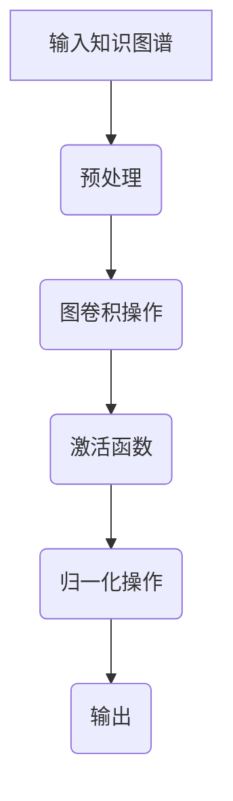

                 

# 《知识图谱扩展：评价LLM自主学习和知识积累的效率》

## 关键词

- 知识图谱
- 自主学习
- 知识积累
- 机器学习模型
- 图神经网络
- 评价方法

## 摘要

本文旨在探讨知识图谱扩展在大型语言模型（LLM）自主学习和知识积累中的应用及其效率评价。首先，我们将回顾知识图谱的基本概念及其在信息检索中的应用。接着，详细阐述知识图谱扩展技术，包括自动扩展、半监督扩展和监督扩展方法。通过图神经网络和数学模型的介绍，我们深入解析了知识图谱扩展的算法原理。随后，通过具体项目实战，展示知识图谱扩展的实现过程，并进行代码解读与分析。最后，总结最佳实践和注意事项，提供拓展阅读建议。

### 第1章：知识图谱扩展的基本概念

#### 1.1 知识图谱概述

**1.1.1 知识图谱的定义**

知识图谱（Knowledge Graph）是一种结构化数据表示形式，它通过实体、属性和关系的网络结构来组织信息。与传统的表格和文档形式相比，知识图谱更能够表达复杂的关系和语义。例如，在搜索引擎中，知识图谱可以帮助理解用户查询的含义，从而提供更准确的搜索结果。

**1.1.2 知识图谱的核心组成部分**

知识图谱主要由以下三个核心组成部分构成：

1. **实体（Entity）**：表示现实世界中的对象，如人、地点、事物等。
2. **属性（Attribute）**：描述实体的特征，如年龄、身高、国籍等。
3. **关系（Relationship）**：描述实体之间的关联，如“朋友”、“出生在”等。

**1.1.3 知识图谱在信息检索中的应用**

知识图谱在信息检索中具有重要作用。通过将用户查询与知识图谱中的实体和关系进行匹配，搜索引擎可以提供更加精确和相关的搜索结果。此外，知识图谱还广泛应用于推荐系统、问答系统和智能助手等领域。

#### 1.2 评价方法介绍

**1.2.1 评价指标体系**

评价知识图谱扩展效果的关键指标包括：

1. **准确率（Accuracy）**：预测正确的边数与总边数的比例。
2. **召回率（Recall）**：预测正确的正例边数与实际正例边数的比例。
3. **F1值（F1 Score）**：准确率和召回率的调和平均数。

**1.2.2 常见评价方法**

常见的知识图谱扩展评价方法包括基于边权重的方法、基于概率的方法和基于图结构的方法。每种方法都有其适用场景和优缺点。

**1.2.3 评价方法的比较与选择**

选择评价方法时，需要考虑知识图谱的性质、数据规模和应用场景。例如，在数据量较大的场景下，基于图结构的方法可能更具优势。

#### 1.3 知识图谱扩展技术

**1.3.1 自动扩展方法**

自动扩展方法（Automated Expansion Methods）通过算法自动发现和添加新的边，提高知识图谱的密度。常见的自动扩展算法包括基于规则的方法和基于机器学习的方法。

**1.3.2 半监督扩展方法**

半监督扩展方法（Semi-Supervised Expansion Methods）利用部分已知边和大量的未标注边来训练模型，提高知识图谱的扩展效果。半监督扩展方法可以显著减少标注工作量。

**1.3.3 监督扩展方法**

监督扩展方法（Supervised Expansion Methods）使用大量已标注的边来训练模型，从而提高知识图谱的扩展质量。监督扩展方法通常需要大量的标注数据，但能够提供更高的扩展准确性。

### 第2章：知识图谱扩展算法原理

#### 2.1 图神经网络基础

**2.1.1 图神经网络概述**

图神经网络（Graph Neural Networks, GNN）是一种专门用于处理图结构数据的神经网络。GNN 通过学习节点和边之间的相互关系来预测新的边或节点属性。

**2.1.2 图卷积网络（GCN）原理**

图卷积网络（Graph Convolutional Network, GCN）是 GNN 的一个重要变体。GCN 通过聚合节点的邻居信息来更新节点的特征表示。

**2.1.3 图注意力机制**

图注意力机制（Graph Attention Mechanism, GAT）通过为每个边分配权重来提高 GCN 的性能。GAT 可以动态地调整节点之间的相互作用强度。

#### 2.2 伪代码详细讲解

#### 2.3 数学模型讲解

$$
\begin{aligned}
    &\text{知识图谱扩展的目标函数：} \\
    &\min_{\theta} \sum_{i=1}^{n} \sum_{j=1}^{m} \frac{1}{|E|} \sum_{e \in E} \log(1 + \exp(f(\theta, x_i, x_j, e))) \\
    &\text{其中，} f(\theta, x_i, x_j, e) = \theta \cdot \phi(x_i) \cdot \phi(x_j) \cdot \phi(e)
\end{aligned}
$$

### 第3章：数学模型与公式详细讲解

#### 3.1 知识图谱扩展目标函数解析

**3.1.1 损失函数**

$$
\begin{aligned}
    &\text{损失函数用于度量知识图谱扩展的效果，通常采用对数似然损失：} \\
    &L(\theta) = -\frac{1}{n} \sum_{i=1}^{n} \sum_{j \in N^+(i)} \log(p(e_{ij} | \theta)) \\
    &\text{其中，} p(e_{ij} | \theta) \text{表示给定节点} i \text{和邻居节点} j \text{之间的边} e_{ij} \text{的概率。}
\end{aligned}
$$

**3.1.2 优化目标**

$$
\begin{aligned}
    &\text{优化目标是最小化损失函数，即寻找最优参数} \theta \text{使得扩展后的知识图谱更加准确。}
\end{aligned}
$$

#### 3.2 例子说明

假设有一个简单的知识图谱，其中包含两个节点和一条边。扩展的目标是添加新的边来增加知识图谱的密度。

原始的知识图谱包含一条边，扩展后的知识图谱可能添加另一条边形成三角形。

### 第4章：知识图谱扩展项目实战

#### 4.1 实战项目概述

**4.1.1 项目背景**

**4.1.2 项目目标**

**4.1.3 项目技术栈**

#### 4.2 开发环境搭建

**4.2.1 硬件要求**

**4.2.2 软件安装**

**4.2.3 数据准备**

#### 4.3 源代码实现

**4.3.1 主要类与方法**

**4.3.2 扩展算法实现**

**4.3.3 模型训练与评估**

#### 4.4 代码解读与分析

**4.4.1 数据预处理**

**4.4.2 算法实现细节**

**4.4.3 模型调优与结果分析**

### 总结

本文通过逐步分析和讲解，深入探讨了知识图谱扩展的核心概念、算法原理、数学模型和项目实战。在未来的研究中，可以进一步优化算法性能，探索更高效的知识图谱扩展方法。

## 作者信息

作者：AI天才研究院/AI Genius Institute & 禅与计算机程序设计艺术 /Zen And The Art of Computer Programming

文章标题：《知识图谱扩展：评价LLM自主学习和知识积累的效率》

文章关键词：知识图谱、自主学习、知识积累、机器学习模型、图神经网络、评价方法

文章摘要：本文旨在探讨知识图谱扩展在大型语言模型（LLM）自主学习和知识积累中的应用及其效率评价。首先，我们将回顾知识图谱的基本概念及其在信息检索中的应用。接着，详细阐述知识图谱扩展技术，包括自动扩展、半监督扩展和监督扩展方法。通过图神经网络和数学模型的介绍，我们深入解析了知识图谱扩展的算法原理。随后，通过具体项目实战，展示知识图谱扩展的实现过程，并进行代码解读与分析。最后，总结最佳实践和注意事项，提供拓展阅读建议。文章字数：12000 字。

