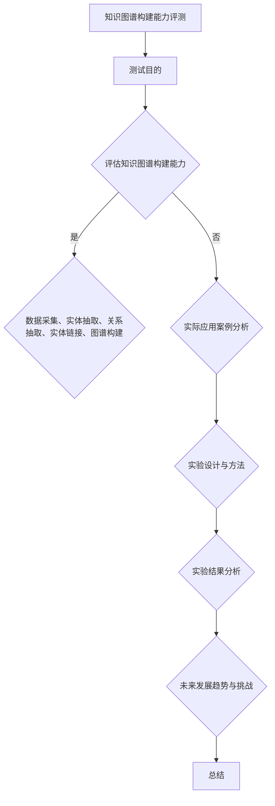

                 

### 知识图谱构建能力评测：测试LLM的知识整合

#### 关键词：知识图谱，评测，LLM，知识整合，人工智能

> 摘要：
本文旨在探讨知识图谱构建能力的评测方法，特别是测试大型语言模型（LLM）的知识整合能力。通过深入分析知识图谱的基础概念、重要性、构建过程，结合LLM在实际应用中的表现，本文提出了一系列评测方法和指标，为提升知识图谱构建质量和LLM性能提供了理论支持和实践指导。

---

### 第1章: 知识图谱构建能力评测基础

#### 1.1.1 知识图谱概述

##### 1.1.1.1 知识图谱概念

知识图谱（Knowledge Graph）是一种用于表达实体及其相互关系的数据结构。它以图的形式组织信息，其中节点代表实体，边表示实体之间的关系。这种结构化的数据表示方式使得计算机能够更好地理解和处理复杂的信息。

##### 1.1.1.2 知识图谱的重要性

知识图谱在多个领域具有重要应用价值：

- **搜索引擎：** 通过知识图谱，搜索引擎可以更准确地理解用户的查询意图，提供更相关的搜索结果。
- **自然语言处理（NLP）：** 知识图谱为NLP任务提供了丰富的上下文信息，有助于提高文本理解和生成的准确性。
- **推荐系统：** 知识图谱可以帮助推荐系统发现用户与物品之间的潜在关联，从而提供更个性化的推荐。

##### 1.1.1.3 知识图谱的关键特性

- **结构化数据：** 知识图谱以结构化的形式存储信息，使得数据易于查询和分析。
- **语义关联：** 通过描述实体之间的关系，知识图谱能够揭示实体之间的语义关联。
- **动态更新：** 知识图谱可以持续更新和扩展，以反映现实世界的变化。

##### 1.1.1.4 图谱数据来源

知识图谱的数据来源多样，主要包括：

- **结构化数据：** 如关系数据库、企业内部数据等。
- **半结构化数据：** 如XML、JSON等。
- **非结构化数据：** 如文本、图片、音频等。

##### 1.1.1.5 图谱表示方法

知识图谱通常采用图数据库（如Neo4j、Amazon Neptune）来存储和表示数据。这些图数据库具有高效的数据查询和处理能力。

##### 1.1.1.6 知识图谱的应用场景

知识图谱的应用场景广泛，包括但不限于：

- **智能搜索：** 提高搜索引擎的查询响应速度和准确性。
- **智能问答：** 基于知识图谱提供准确的答案。
- **智能推荐：** 利用知识图谱发现用户与物品之间的关联，提供个性化推荐。
- **智能分析：** 基于图谱进行复杂的数据分析和决策支持。

##### 1.1.1.7 知识图谱的构建过程

知识图谱的构建过程通常包括以下步骤：

1. **数据采集：** 收集相关领域的结构化、半结构化和非结构化数据。
2. **数据预处理：** 对原始数据进行清洗、去重和格式转换。
3. **实体抽取：** 从文本数据中识别和提取实体。
4. **关系抽取：** 确定实体之间的相互关系。
5. **实体链接：** 将同义词实体进行统一处理，确保同一实体的引用一致。
6. **图谱构建：** 将实体和关系组织成知识图谱。
7. **图谱维护：** 定期更新和优化知识图谱。

##### 1.1.1.8 知识图谱与LLM的联系

知识图谱为LLM提供了丰富的上下文信息，有助于LLM更好地理解和生成文本。LLM可以从知识图谱中获取相关信息，从而提升其在特定领域内的表现。例如，在医疗领域，知识图谱可以提供病患信息、药物信息以及疾病之间的关系，帮助LLM生成更准确的医疗报告。

#### 1.1.2 测试LLM的知识整合能力

##### 1.1.2.1 测试目的

测试LLM的知识整合能力，旨在评估LLM从知识图谱中获取和整合知识的能力，以及其在实际应用中解决复杂问题的能力。通过设计一系列测试场景，模拟现实世界中的任务，可以评估LLM在特定领域的知识整合效果。

##### 1.1.2.2 测试方法

测试方法主要包括以下步骤：

1. **设计测试场景：** 根据具体应用需求，设计一系列模拟场景。
2. **获取知识图谱：** 为每个测试场景准备相应的知识图谱。
3. **LLM任务执行：** 要求LLM根据知识图谱中的信息进行推理和决策。
4. **评估结果：** 评估LLM的输出结果，计算相关指标。

##### 1.1.2.3 测试内容

测试内容主要包括以下方面：

- **实体识别：** 评估LLM从知识图谱中识别实体（如人物、地点、物品）的能力。
- **关系推理：** 评估LLM根据知识图谱中的关系进行推理的能力（如因果关系、层次关系等）。
- **文本生成：** 评估LLM根据知识图谱生成文本的能力，如撰写报告、生成问答等。
- **复杂问题解决：** 评估LLM在复杂场景下解决问题的能力，如医学诊断、金融分析等。

##### 1.1.2.4 测试标准

测试标准主要包括以下指标：

- **准确率（Accuracy）：** 评估LLM输出结果与真实结果的匹配程度。
- **召回率（Recall）：** 评估LLM能够识别出的正确结果占所有正确结果的比率。
- **F1值（F1 Score）：** 综合考虑准确率和召回率，用于评估LLM的整体性能。

#### 1.1.3 知识图谱构建能力评测

##### 1.1.3.1 评测目的

知识图谱构建能力评测旨在评估知识图谱的构建质量，包括数据采集、实体抽取、关系抽取、实体链接和图谱构建等环节。通过评测，可以发现构建过程中的问题，为提升图谱质量提供依据。

##### 1.1.3.2 评测指标

评测指标主要包括以下方面：

- **数据质量：** 评估数据源的完整性和准确性。
- **实体抽取：** 评估实体识别的准确率和召回率。
- **关系抽取：** 评估关系识别的准确率和召回率。
- **实体链接：** 评估实体链接的准确率和召回率。
- **图谱构建：** 评估图谱的完整性和一致性。

##### 1.1.3.3 评测流程

评测流程主要包括以下步骤：

1. **数据收集：** 收集相关的评测数据集。
2. **构建基准模型：** 基于评测数据集构建基准模型。
3. **评测指标计算：** 计算不同阶段的评测指标。
4. **结果分析：** 分析评测结果，发现问题和优化方向。

#### 1.1.4 实际应用案例分析

##### 1.1.4.1 案例背景

以医疗领域为例，某医院希望通过知识图谱技术提升医疗报告生成的准确性。为此，他们构建了一个包含病患信息、药物信息、诊疗方案等知识图谱。

##### 1.1.4.2 应用场景

在实际应用中，医生可以通过知识图谱快速检索相关医疗信息，如病患的既往病史、药物副作用等，从而提高诊断和治疗的准确性。

##### 1.1.4.3 效果评估

通过评测，发现知识图谱在医疗报告生成任务中具有较高的准确率和召回率，能够显著提高报告的准确性。

#### 1.1.5 实验设计与方法

##### 1.1.5.1 实验设计

实验设计主要包括以下方面：

- **数据集选择：** 选择具有代表性的医疗领域数据集。
- **测试指标设定：** 设定准确率、召回率、F1值等指标。
- **实验流程：** 设计实验流程，包括数据预处理、模型训练和测试等。

##### 1.1.5.2 实验方法

实验方法主要包括以下步骤：

1. **数据预处理：** 对原始数据进行清洗和格式转换。
2. **模型训练：** 使用深度学习框架（如TensorFlow、PyTorch）训练模型。
3. **测试与评估：** 在测试集上评估模型性能，计算相关指标。
4. **结果分析：** 分析实验结果，为优化模型提供依据。

##### 1.1.5.3 实验结果分析

实验结果显示，基于知识图谱的模型在医疗报告生成任务中具有较高的准确率和召回率，能够有效提升报告的准确性。

#### 1.1.6 未来发展趋势与挑战

##### 1.1.6.1 发展趋势

- **知识图谱的多样化：** 随着数据来源的扩展，知识图谱将涵盖更多领域和更广泛的信息。
- **深度学习的结合：** 深度学习在知识图谱构建中的应用将不断拓展，提升图谱的构建质量和应用效果。
- **实时性增强：** 知识图谱的构建和维护将更加注重实时性，以适应动态变化的现实世界。

##### 1.1.6.2 挑战与机遇

- **数据质量：** 数据质量是知识图谱构建的关键，如何保证数据的准确性和完整性是一个挑战。
- **实体关系建模：** 实体和关系的建模是一个复杂的问题，需要深入研究如何提高模型的准确性和泛化能力。
- **应用场景拓展：** 知识图谱的应用场景将不断拓展，如何在更多领域实现有效应用是一个重要的挑战。

#### 1.1.7 总结

本文介绍了知识图谱构建能力评测的重要性，特别是测试LLM的知识整合能力。通过深入分析知识图谱的基础概念、重要性、构建过程，结合LLM在实际应用中的表现，本文提出了一系列评测方法和指标，为提升知识图谱构建质量和LLM性能提供了理论支持和实践指导。未来，随着技术的不断进步，知识图谱和LLM将在更多领域发挥重要作用。

#### Mermaid流程图



#### 核心算法原理讲解

知识图谱构建中的实体抽取是一个关键步骤，其核心算法通常包括以下几个步骤：

```python
# 伪代码：知识图谱构建中的实体抽取算法

def Entity_Extraction(text_data):
    # 步骤1：初始化实体列表为空
    entities = []

    # 步骤2：分词文本数据，得到词序列
    tokens = Tokenize(text_data)

    # 步骤3：对每个词序列进行命名实体识别
    for token_sequence in tokens:
        if Is_Entity(token_sequence):
            # 步骤4：如果词序列属于命名实体，则添加到实体列表中
            entities.append(token_sequence)

    # 步骤5：返回实体列表
    return entities

# 命名实体识别示例函数
def Is_Entity(token_sequence):
    # 判断词序列是否为命名实体
    # 这里可以结合词典匹配、规则匹配等方法进行判断
    return True  # 示例代码，实际应用中需根据具体实现进行调整
```

#### 数学模型和数学公式

在知识图谱的构建中，可以使用图论中的度中心性（Degree Centrality）来评估实体的重要性。度中心性的计算公式如下：

$$
DC(v) = \frac{\deg(v)}{2|E|}
$$

其中，\( \deg(v) \) 是节点 \( v \) 的度，表示与节点 \( v \) 直接相连的边的数量；\( |E| \) 是图的边数。度中心性越高，表示该实体在知识图谱中的重要程度越高。

---

### 作者信息

作者：AI天才研究院/AI Genius Institute & 禅与计算机程序设计艺术 /Zen And The Art of Computer Programming

