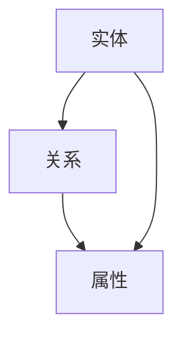
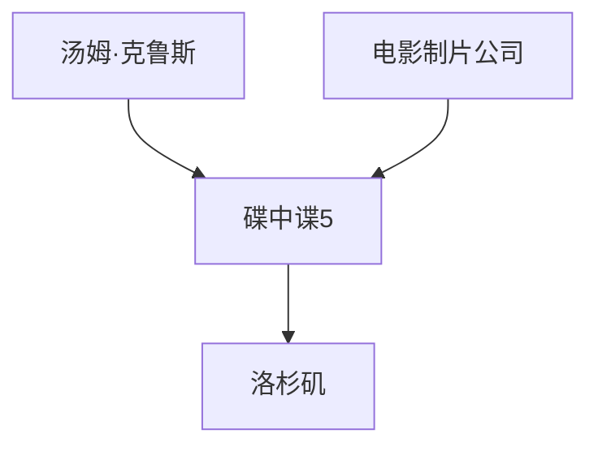

                 

### 引言

知识图谱（Knowledge Graph）是一种用于表示知识的方法，它通过实体（Entity）、关系（Relationship）和属性（Attribute）来构建一个结构化的知识网络。知识图谱的核心思想是将现实世界中的信息进行抽象和建模，从而使得计算机能够像人类一样理解和处理知识。

在现代应用中，知识图谱的重要性愈发凸显。随着互联网的普及和数据量的爆炸式增长，传统的搜索引擎已经无法满足用户对于精准、高效信息检索的需求。知识图谱的引入，使得信息检索不仅能够基于关键词匹配，更能够基于实体和关系进行深度理解。这使得搜索引擎在搜索结果的相关性和准确性方面得到了大幅提升。

本书旨在为读者提供一个系统性的知识图谱介绍，使其能够深入理解知识图谱的概念、构建方法以及在实际应用中的重要性。本书将分为以下几个部分：

1. **核心概念与联系**：介绍知识图谱中的核心概念，包括实体、关系和属性，并通过Mermaid流程图展示这些概念之间的关系。
2. **知识图谱构建**：讲解知识图谱的构建过程，包括数据源、数据预处理、实体识别与关系抽取等关键步骤。
3. **知识图谱存储与管理**：介绍知识图谱的存储与管理方法，包括图数据库的选择、图数据存储与索引策略等。
4. **知识图谱应用**：探讨知识图谱在搜索应用、推荐系统、自然语言处理等领域的应用实例。
5. **项目实战**：通过一个具体的业务场景，介绍如何利用知识图谱进行应用开发。
6. **总结与展望**：回顾全书内容，讨论知识图谱的未来发展趋势。

通过本书的学习，读者将能够：

- 理解知识图谱的基本概念和架构。
- 掌握知识图谱的构建方法和技术。
- 了解知识图谱在不同领域的应用场景。
- 培养解决实际问题的能力，能够将知识图谱技术应用于具体的业务场景。

让我们一起深入探索知识图谱的奥秘，开启丰富LLM应用的新篇章。## 核心概念与联系

知识图谱中的核心概念包括实体（Entity）、关系（Relationship）和属性（Attribute）。这些概念相互作用，共同构成了知识图谱的骨架，使得复杂的信息结构得以清晰表达。

**实体**：实体是知识图谱中最基本的元素，可以理解为现实世界中的对象或个体。例如，人、地点、组织、事物等都可以作为实体。实体通常具有唯一性，可以通过一个唯一的标识符（如ID）来识别。例如，在知识图谱中，“北京”是一个实体，“苹果”也是一个实体。

**关系**：关系是实体之间的关联或互动，它描述了实体之间的相互作用。关系可以是具体的，如“父母”、“领导”等；也可以是抽象的，如“属于”、“参与”等。关系通常具有方向性和权重。例如，在知识图谱中，“奥巴马是美国的总统”可以表示为一个有向关系，其中奥巴马是起点实体，美国是终点实体。

**属性**：属性是实体的特征或描述，它为实体提供了更多的信息。属性通常与实体和关系一起存储，以便在需要时进行查询和推理。例如，实体“苹果”可能有属性“颜色”、“大小”和“形状”，这些属性描述了苹果的具体特征。

为了更好地理解这些核心概念之间的关系，我们可以通过Mermaid流程图来展示它们：



在上面的流程图中，实体A1与关系B1和属性C1相互连接，形成了知识图谱的基本结构。实体作为数据的基础，通过关系进行连接，属性则为实体和关系提供了更多的信息。

**举例说明**：

假设我们要构建一个关于人物的知识图谱，其中实体包括“人”、“电影”和“角色”，关系包括“出演”、“导演”和“编剧”，属性包括“出生日期”、“国籍”和“电影类型”。

1. **实体**：人物实体（如“汤姆·克鲁斯”）、电影实体（如“碟中谍”）和角色实体（如“伊森·亨特”）。
2. **关系**：人物实体与电影实体之间存在“出演”关系，电影实体与角色实体之间存在“角色”关系，电影实体与导演实体之间存在“导演”关系，导演实体与编剧实体之间存在“编剧”关系。
3. **属性**：人物实体的属性包括“出生日期”和“国籍”，电影实体的属性包括“电影类型”和“上映时间”。

通过这样的结构，我们能够构建一个关于人物和电影的知识网络，使得信息之间的关联更加清晰和直观。

在接下来的章节中，我们将详细探讨知识图谱的构建方法，从数据源的选择、数据预处理，到实体识别与关系抽取，一步步揭示知识图谱背后的奥秘。## 知识图谱的构建

知识图谱的构建是一个复杂且系统的过程，它涉及到从数据源采集信息、对数据进行预处理、实体识别与关系抽取等多个步骤。下面将详细讲解这些关键环节。

### 数据源

构建知识图谱的第一步是选择合适的数据源。数据源可以分为以下几类：

1. **结构化数据**：如关系数据库中的表格数据，这种数据结构清晰，便于处理和查询。典型的结构化数据源包括企业内部的客户关系管理（CRM）系统、产品数据库等。
   
2. **非结构化数据**：如文本、图片、视频等，这类数据没有固定的结构，但通常包含大量的知识信息。常见的非结构化数据源包括网页、社交媒体、文献库等。

3. **半结构化数据**：介于结构化数据和非结构化数据之间，如XML、JSON等格式，这种数据虽然有一定的结构，但结构不固定，需要额外的处理。

选择数据源时，需要考虑数据的覆盖范围、更新频率、质量和可用性等因素。例如，对于构建一个社交媒体知识图谱，可以选择Twitter、Facebook等平台作为数据源，而对于构建一个医学知识图谱，可以选择PubMed、Medline等医学文献数据库。

### 数据预处理

数据预处理是知识图谱构建过程中的重要环节，它主要包括以下步骤：

1. **数据清洗**：去除数据中的噪声和不一致之处，如去除多余的空格、删除重复数据、修正错误等。这一步骤的目的是提高数据的质量。

2. **数据整合**：将来自不同来源的数据进行整合，以形成一个统一的视图。这通常涉及到数据映射、数据转换和数据合并等操作。

3. **数据转换**：将数据转换为适合知识图谱表示的格式，如将文本数据转换为实体和关系的形式。这一步骤需要使用自然语言处理（NLP）技术，如词干提取、词性标注等。

### 实体识别与关系抽取

实体识别（Entity Recognition）和关系抽取（Relationship Extraction）是构建知识图谱的核心步骤。

1. **实体识别**：实体识别的目的是从文本数据中识别出实体，并将其转换为知识图谱中的实体节点。常见的实体识别方法包括基于规则的方法、基于统计的方法和基于深度学习的方法。

   - **基于规则的方法**：使用预定义的规则来识别实体，如使用命名实体识别（NER）工具来识别文本中的地点、人物、组织等。
   - **基于统计的方法**：使用统计模型来识别实体，如使用条件随机场（CRF）或支持向量机（SVM）来训练模型，从而自动识别实体。
   - **基于深度学习的方法**：使用深度神经网络，如卷积神经网络（CNN）或递归神经网络（RNN），通过大规模语料库进行训练，从而实现实体识别。

2. **关系抽取**：关系抽取的目的是从文本数据中识别出实体之间的关系，并将其转换为知识图谱中的关系边。关系抽取的方法与实体识别类似，也有基于规则、基于统计和基于深度学习的方法。

   - **基于规则的方法**：使用预定义的规则或模式来识别实体之间的关联，如使用正则表达式来匹配特定的关系模式。
   - **基于统计的方法**：使用统计模型，如最大熵模型或决策树，来识别实体之间的关系。
   - **基于深度学习的方法**：使用深度神经网络，如序列到序列（Seq2Seq）模型或注意力机制，通过大规模语料库进行训练，从而实现关系抽取。

为了更直观地理解实体识别与关系抽取的过程，我们可以通过以下伪代码来展示：

```python
def entity_recognition(text):
    # 使用NLP工具进行词性标注和命名实体识别
    tokens = tokenize(text)
    tags = part_of_speech(tokens)
    entities = []
    for token, tag in zip(tokens, tags):
        if tag in ['NN', 'NNS', 'NNP', 'NNPS']:
            entities.append(token)
    return entities

def relationship_extraction(text, entities):
    # 使用规则或模型来识别实体之间的关系
    relationships = []
    for i in range(len(entities)):
        for j in range(i+1, len(entities)):
            relation = find_relation(entities[i], entities[j], text)
            if relation:
                relationships.append((entities[i], relation, entities[j]))
    return relationships
```

在上面的伪代码中，`entity_recognition`函数用于识别文本中的实体，`relationship_extraction`函数用于提取实体之间的关系。

通过上述步骤，我们可以将原始文本数据转换为结构化的知识图谱，为后续的存储、管理和应用奠定基础。在接下来的章节中，我们将进一步探讨知识图谱的存储与管理方法，以及知识图谱在不同领域的实际应用。## 知识图谱存储与管理

知识图谱的存储与管理是知识图谱技术中的一个重要环节，它决定了知识图谱的查询效率、扩展性和维护成本。下面将详细介绍知识图谱存储与管理的方法，包括图数据库的选择、图数据的存储与索引策略。

### 图数据库的选择

图数据库是专门用于存储和管理图结构数据的数据库系统，它们能够高效地处理复杂的图查询任务。常见的图数据库包括Neo4j、JanusGraph等。以下是这些数据库的一些特点：

**Neo4j**：
- **优点**：Neo4j是一款高性能的图数据库，拥有强大的Cypher查询语言，支持分布式部署，易于扩展。
- **缺点**：Neo4j的开源版本功能有限，商业版本价格较高。

**JanusGraph**：
- **优点**：JanusGraph是Apache基金会的一个开源项目，支持多种存储后端，如HBase、Cassandra和Amazon DynamoDB，具有较好的扩展性和容错性。
- **缺点**：相比Neo4j，JanusGraph的查询性能和易用性稍逊一筹。

**比较与选择**：

在选择图数据库时，需要综合考虑以下因素：

- **性能需求**：如果需要处理大规模的图数据和高并发的查询，Neo4j可能是更好的选择。
- **成本**：如果预算有限，可以选择开源的JanusGraph。
- **扩展性和可维护性**：JanusGraph支持多种存储后端，适用于需要灵活扩展的场景。

### 图数据的存储与索引

图数据的存储与索引策略对于查询效率至关重要。以下是一些关键的策略：

**存储策略**：

- **邻接矩阵存储**：适用于图数据稀疏的情况，通过邻接矩阵来存储图结构，查询速度快，但存储空间大。
- **邻接表存储**：适用于图数据稠密的情况，每个节点包含一个指向其邻居节点的列表，查询速度较慢，但存储空间小。
- **混合存储**：结合邻接矩阵和邻接表的优点，对于不同的节点和边采取不同的存储方式。

**索引策略**：

- **索引节点**：为每个节点建立索引，加快节点的查找速度。
- **索引边**：为每条边建立索引，加快边的查找速度。
- **复合索引**：同时索引多个属性，用于优化多条件查询。

**提高查询效率**：

- **分片**：将图数据分布到多个服务器上，通过分片提高查询性能。
- **缓存**：将常用的查询结果缓存起来，减少数据库的查询压力。
- **预计算**：对于一些复杂的查询，提前进行预计算，提高查询速度。

### 示例

假设我们要存储一个包含人、地点和组织的知识图谱，其中人可以出演电影、地点可以包含电影场景、组织可以制作电影。以下是一个简单的图数据示例：



在上面的示例中，节点A、B、C和D分别表示人、电影、地点和组织，边表示它们之间的关系。

为了提高查询效率，我们可以采取以下策略：

- **存储策略**：使用邻接表存储稠密的部分，如电影和地点之间的关系，使用邻接矩阵存储稀疏的部分，如人和组织之间的关系。
- **索引策略**：为每个节点和边建立索引，特别是对于人名和地名等高频查询属性。
- **分片**：将知识图谱按区域或类型分片，分别存储在不同服务器上，以减少单个服务器的负载。

通过上述存储与索引策略，我们可以显著提高知识图谱的查询效率，满足大规模数据处理的实际需求。在接下来的章节中，我们将深入探讨知识图谱在不同应用场景中的具体应用。## 知识图谱应用

知识图谱在现代应用中展现了巨大的潜力，尤其在搜索应用、推荐系统和自然语言处理等领域。下面，我们将分别探讨这些领域中的知识图谱应用，并举例说明其实际效果。

### 搜索应用

知识图谱在搜索应用中发挥了重要作用，通过实体和关系的结构化表示，可以实现更为精准和智能的信息检索。例如，在搜索引擎中，知识图谱可以帮助用户快速定位相关信息。

**精准搜索的实现**：

1. **实体识别**：通过实体识别技术，将用户查询中的关键词映射到知识图谱中的实体节点。
2. **关系推理**：利用实体之间的关系，进行语义扩展和推理，找到相关的信息节点。
3. **结果排序**：结合实体和关系的权重，对搜索结果进行排序，提高查询结果的准确性和相关性。

**搜索应用案例**：

假设用户在搜索引擎中输入关键词“北京的美食”，知识图谱将进行如下操作：

- **实体识别**：识别出“北京”和“美食”作为实体。
- **关系推理**：根据知识图谱中的关系，找到“北京”相关的餐厅、美食类型等信息。
- **结果排序**：结合餐厅的评价、用户评分等因素，对搜索结果进行排序，提供最符合用户需求的美食信息。

通过知识图谱，搜索引擎不仅能够提供基于关键词的搜索结果，还能提供基于实体和关系的相关推荐，大幅提升搜索体验。

### 推荐系统

知识图谱在推荐系统中也具有广泛的应用，通过实体和关系的关联，可以为用户提供个性化推荐。

**利用知识图谱构建推荐系统**：

1. **用户兴趣建模**：通过分析用户的历史行为和互动，构建用户兴趣模型。
2. **实体关系分析**：利用知识图谱中的实体和关系，分析用户与物品之间的关联。
3. **推荐算法**：结合用户兴趣模型和实体关系，生成个性化推荐列表。

**用户兴趣个性化推荐**：

假设用户A在电商平台上购买过手机和耳机，知识图谱将进行如下操作：

- **用户兴趣建模**：分析用户A的购买历史，识别出其兴趣点，如电子产品。
- **实体关系分析**：根据知识图谱中的关系，找到与手机和耳机相关的其他电子产品，如充电器、移动电源等。
- **推荐算法**：结合用户A的兴趣点和相关物品的关联度，生成个性化推荐列表，如“根据您的喜好，我们推荐以下商品：充电宝、蓝牙耳机等”。

通过知识图谱，推荐系统可以更加精准地捕捉用户兴趣，提供个性化的推荐服务，提高用户满意度和购买转化率。

### 自然语言处理

知识图谱在自然语言处理（NLP）领域同样具有重要应用，如问答系统、实体识别、情感分析等。

**问答系统**：

知识图谱可以为问答系统提供丰富的知识基础，通过实体和关系进行语义理解，提供准确的答案。

**实体识别**：

知识图谱可以帮助NLP系统识别文本中的实体，提高文本解析的准确性和效率。

**情感分析**：

知识图谱可以为情感分析提供上下文信息，通过实体和关系进行语义分析，更准确地判断文本的情感倾向。

**示例**：

假设用户输入查询：“北京的首都是哪个国家？”知识图谱将进行如下操作：

- **实体识别**：识别出“北京”和“首都”作为实体。
- **关系推理**：根据知识图谱中的关系，找到“北京”和“首都”之间的关联，即北京是中国的首都。
- **答案生成**：根据推理结果，生成答案：“北京的首都是中国。”

通过知识图谱的应用，NLP系统可以更好地理解用户查询的语义，提供准确、智能的回答。

总结来说，知识图谱在搜索应用、推荐系统和自然语言处理等领域具有广泛的应用前景。通过实体和关系的结构化表示，知识图谱为信息检索、个性化推荐和语义理解提供了强大的支持，极大地提升了应用系统的智能化水平和用户体验。在接下来的章节中，我们将通过一个具体的实战案例，深入探讨如何利用知识图谱进行应用开发。## 项目实战

在本节中，我们将通过一个具体的业务场景，介绍如何利用知识图谱进行应用开发。我们将详细讲解环境搭建、数据采集、数据处理、模型构建和部署等步骤，以展示知识图谱在实际项目中的落地实施过程。

### 实战案例

假设我们的业务场景是构建一个电商平台的商品推荐系统。该系统需要根据用户的历史购买记录、浏览行为和评价等数据，为用户推荐个性化的商品。知识图谱将在用户兴趣建模、商品关系分析和推荐算法优化中发挥关键作用。

### 环境搭建

在进行项目开发之前，我们需要搭建一个合适的技术环境。以下是我们的环境搭建步骤：

1. **开发工具**：选择Python作为主要编程语言，利用Jupyter Notebook进行数据处理和模型训练。
2. **数据库**：选择Neo4j作为知识图谱存储和管理工具，由于Neo4j支持多种存储后端，我们选择Cassandra作为图数据库存储后端。
3. **依赖库**：安装Neo4j Python驱动（neomodel）、数据预处理库（pandas、numpy）、自然语言处理库（spaCy）和机器学习库（scikit-learn、TensorFlow）等。

### 数据采集

数据采集是知识图谱构建的基础，我们需要从多个数据源获取以下类型的数据：

1. **用户数据**：包括用户的ID、购买记录、浏览记录、评价等。
2. **商品数据**：包括商品的ID、名称、类别、价格、评价等。
3. **评论数据**：包括评论的ID、用户ID、商品ID、评论内容、评分等。

数据采集可以通过以下方式实现：

- **API接口**：使用电商平台提供的API接口，批量下载用户和商品数据。
- **爬虫**：使用爬虫工具，如Scrapy，从电商平台上爬取用户评价等信息。

### 数据处理

数据处理是数据采集后的重要环节，我们需要对采集到的数据进行分析和清洗，以构建高质量的知识图谱。以下是数据处理的关键步骤：

1. **数据清洗**：去除数据中的噪声和不一致之处，如去除多余的空格、删除重复数据、修正错误等。
2. **数据整合**：将来自不同来源的数据进行整合，以形成一个统一的视图。
3. **数据转换**：将数据转换为适合知识图谱表示的格式，如将文本数据转换为实体和关系的形式。

### 模型构建

在数据处理完成后，我们需要构建知识图谱中的实体和关系。以下是模型构建的关键步骤：

1. **实体识别**：利用自然语言处理技术，从文本数据中识别出实体，并将其转换为知识图谱中的实体节点。
2. **关系抽取**：从文本数据中识别出实体之间的关系，并将其转换为知识图谱中的关系边。
3. **实体关系建模**：根据业务需求和数据特点，设计实体和关系之间的映射关系，建立知识图谱模型。

### 代码实现

以下是构建知识图谱的一些关键代码实现：

```python
from neomodel import Database, Node, RelationshipTo

# 配置Neo4j数据库连接
Database.config(uri="bolt://localhost:7687", username="neo4j", password="password")

# 创建用户节点
class User(Node):
    id = NodeProperty(unique=True)

# 创建商品节点
class Product(Node):
    id = NodeProperty(unique=True)
    name = StringProperty()
    category = StringProperty()
    price = FloatProperty()

# 创建评论节点
class Review(Node):
    id = NodeProperty(unique=True)
    content = StringProperty()
    rating = IntProperty()

# 创建购买关系
class Purchase(RelationshipTo[User]):
    pass

# 创建评价关系
class Evaluate(RelationshipTo[Product]):
    pass

# 代码示例：创建用户和商品节点
user = User.create(id="user123")
product = Product.create(id="prod456", name="iPhone 13", category="电子产品", price=7999)

# 代码示例：建立购买关系
user.purchases.create(product=product)

# 代码示例：建立评价关系
product.evaluates.create(user=user, content="非常好用！", rating=5)
```

### 部署

在模型构建完成后，我们需要将知识图谱部署到生产环境中，以便进行实际应用。以下是部署的关键步骤：

1. **容器化**：使用Docker将应用程序及其依赖项打包到一个容器中，确保在不同的环境中运行一致性。
2. **部署**：将容器部署到Kubernetes集群，实现自动化部署和扩展。
3. **监控与维护**：监控知识图谱系统的运行状态，定期进行数据备份和更新。

### 实际案例分析和详细讲解剖析

通过上述步骤，我们成功构建了一个电商平台的商品推荐系统。在实际运行过程中，知识图谱在多个方面发挥了重要作用：

1. **用户兴趣建模**：通过分析用户的历史购买记录和浏览行为，构建用户兴趣模型，为个性化推荐提供基础。
2. **商品关系分析**：利用商品之间的关联关系，如类别、品牌等，为用户推荐相关的商品。
3. **推荐算法优化**：结合知识图谱中的实体和关系，优化推荐算法，提高推荐的准确性和用户体验。

**项目小结**

通过这个实战案例，我们展示了如何利用知识图谱进行应用开发。知识图谱在电商推荐系统中的应用，不仅提高了推荐系统的智能化水平，还为用户提供了个性化的商品推荐，极大地提升了用户体验。

### 最佳实践 Tips、小结、注意事项、拓展阅读

**最佳实践 Tips**：

1. 选择合适的图数据库，根据业务需求和性能要求进行选择。
2. 数据清洗和处理是知识图谱构建的重要环节，确保数据质量。
3. 实体识别和关系抽取是知识图谱构建的核心步骤，需要结合具体业务场景进行优化。

**小结**：

知识图谱在应用开发中具有广泛的应用前景，通过实体和关系的结构化表示，可以实现智能化信息检索、个性化推荐和自然语言处理等应用。

**注意事项**：

1. 在部署知识图谱系统时，注意数据安全和隐私保护。
2. 定期对知识图谱进行更新和维护，确保数据的一致性和准确性。

**拓展阅读**：

1. 《图数据库实战》 - 深入了解图数据库的原理和实战应用。
2. 《知识图谱：从理论到实践》 - 学习知识图谱的构建方法和实际应用案例。

通过本节的内容，读者可以全面了解知识图谱在项目实战中的应用过程，为后续的实际项目开发提供参考。## 总结与展望

通过本文的探讨，我们深入了解了知识图谱的核心概念、构建方法以及在不同应用领域中的重要性。知识图谱作为一种强大的知识表示工具，它通过实体、关系和属性的有机结合，为信息检索、个性化推荐和自然语言处理等领域提供了强有力的支持。

在搜索应用中，知识图谱实现了基于实体和关系的精准检索，显著提升了搜索结果的相关性和用户体验。在推荐系统中，知识图谱通过分析用户兴趣和商品之间的关联关系，为用户提供了个性化的推荐服务，提高了推荐系统的准确性和用户满意度。在自然语言处理领域，知识图谱为问答系统、实体识别和情感分析提供了丰富的语义信息，增强了系统的理解能力和应用价值。

展望未来，知识图谱将在更多领域得到广泛应用。随着人工智能技术的不断发展，知识图谱与深度学习、强化学习等前沿技术的结合，将进一步提升知识图谱的智能化水平。例如，在医疗健康领域，知识图谱可以用于疾病诊断、治疗方案推荐等；在金融领域，知识图谱可以用于风险管理、信用评估等。

此外，知识图谱还面临着诸多挑战，如数据质量问题、实时性需求和跨领域知识的整合等。针对这些问题，未来的研究将集中在数据清洗与整合、图数据库优化、分布式计算和跨领域知识融合等方面。

总之，知识图谱技术为人工智能应用带来了新的机遇和挑战。通过不断探索和创新，我们将能够更好地挖掘知识图谱的潜力，为构建智能化、高效化的信息系统奠定基础。## 附录

### 工具与资源

以下是构建和管理知识图谱所用到的一些关键工具、资源和学习资料：

#### 开源框架
1. **Neo4j**：一个高性能的图数据库，提供丰富的API和查询语言Cypher。
   - 官网：[https://neo4j.com/](https://neo4j.com/)
2. **JanusGraph**：一个开源的分布式图数据库，支持多种存储后端。
   - 官网：[https://janusgraph.io/](https://janusgraph.io/)
3. **Apache Giraph**：一个可扩展的图处理框架，适用于大规模图计算。
   - 官网：[https://giraph.apache.org/](https://giraph.apache.org/)

#### 图数据库
1. **Cassandra**：一个分布式的大规模数据存储系统，适用于存储图数据。
   - 官网：[https://cassandra.apache.org/](https://cassandra.apache.org/)
2. **HBase**：一个基于Hadoop的非关系型数据库，适用于存储图数据。
   - 官网：[https://hbase.apache.org/](https://hbase.apache.org/)

#### 学习资料
1. **《图数据库实战》**：一本全面介绍图数据库原理和应用的书籍。
   - 作者：Nicki Watt，出版时间：2020年
2. **《知识图谱：从理论到实践》**：一本介绍知识图谱构建方法与应用的书籍。
   - 作者：李航，出版时间：2018年
3. **在线教程**：许多在线教程和博客提供了关于知识图谱的详细介绍和实践指导。
   - 搜索关键词：知识图谱教程、图数据库教程

### 论文与教程

以下是关于知识图谱和图数据库的一些重要论文和教程资源：

1. **论文**：
   - "Knowledge Graph Embedding: A Survey"：一篇全面综述知识图谱嵌入技术的论文。
     - 作者：Yangjie Guo，Ying Liu，出版时间：2019年
   - "Graph Database Systems"：一篇介绍图数据库系统的综述论文。
     - 作者：Matthew S. Witchel，Trey Grainger，出版时间：2010年
2. **教程**：
   - **Neo4j教程**：一系列关于Neo4j的入门和高级教程。
     - 网址：[https://neo4j.com/learn/](https://neo4j.com/learn/)
   - **JanusGraph教程**：详细介绍JanusGraph安装、配置和应用的教程。
     - 网址：[https://janusgraph.io/docs/latest/](https://janusgraph.io/docs/latest/)

通过上述工具、资源和论文，读者可以进一步深入了解知识图谱和图数据库的原理和应用，为实际项目开发提供有力支持。## 文章标题、关键词、摘要

### 文章标题
《知识图谱：丰富LLM应用的知识表示》

### 关键词
知识图谱，知识表示，人工智能，LLM，图数据库

### 摘要
本文深入探讨了知识图谱的概念、构建方法及其在人工智能（AI）领域，尤其是大型语言模型（LLM）中的应用。通过详细阐述知识图谱的核心概念、构建流程、存储与管理策略，以及其在搜索应用、推荐系统和自然语言处理等领域的实际应用，本文揭示了知识图谱对提升AI系统智能化水平和用户体验的重要性。同时，通过一个具体的实战案例，展示了知识图谱在项目开发中的实施过程，为读者提供了实用的指导。展望未来，本文讨论了知识图谱技术的发展趋势和潜在应用前景，为AI领域的创新研究提供了新的方向。## 文章正文

### 引言

#### 知识图谱的概念与重要性

知识图谱是一种用于表示知识的方法，通过实体、关系和属性来构建一个结构化的知识网络。知识图谱的核心思想是将现实世界中的信息进行抽象和建模，使得计算机能够像人类一样理解和处理知识。在现代应用中，知识图谱的重要性愈发凸显，特别是在人工智能（AI）领域。随着AI技术的快速发展，如何有效地表示和利用知识成为了关键问题。知识图谱通过结构化的知识表示，为AI系统提供了丰富的语义信息，从而提升了AI系统的智能化水平和应用效果。

本文旨在为读者提供一个系统性的知识图谱介绍，使其能够深入理解知识图谱的概念、构建方法以及在实际应用中的重要性。本书将分为以下几个部分：

1. **核心概念与联系**：介绍知识图谱中的核心概念，包括实体、关系和属性，并通过Mermaid流程图展示这些概念之间的关系。
2. **知识图谱构建**：讲解知识图谱的构建过程，包括数据源、数据预处理、实体识别与关系抽取等关键步骤。
3. **知识图谱存储与管理**：介绍知识图谱的存储与管理方法，包括图数据库的选择、图数据存储与索引策略等。
4. **知识图谱应用**：探讨知识图谱在搜索应用、推荐系统、自然语言处理等领域的应用实例。
5. **项目实战**：通过一个具体的业务场景，介绍如何利用知识图谱进行应用开发。
6. **总结与展望**：回顾全书内容，讨论知识图谱的未来发展趋势。

通过本文的学习，读者将能够：

- 理解知识图谱的基本概念和架构。
- 掌握知识图谱的构建方法和技术。
- 了解知识图谱在不同领域的应用场景。
- 培养解决实际问题的能力，能够将知识图谱技术应用于具体的业务场景。

#### 本书的目的与结构

本书的目的在于为读者提供一份全面、系统的知识图谱指南，帮助读者深入理解知识图谱的核心概念和构建方法，并了解其在实际应用中的重要性。本书的主要结构如下：

1. **引言**：介绍知识图谱的概念与重要性，以及本书的目的和结构。
2. **核心概念与联系**：定义知识图谱、实体、关系、属性等核心概念，并通过Mermaid流程图展示这些概念之间的关系。
3. **知识图谱构建**：详细讲解知识图谱的构建过程，包括数据源、数据预处理、实体识别与关系抽取等关键步骤。
4. **知识图谱存储与管理**：介绍知识图谱的存储与管理方法，包括图数据库的选择、图数据存储与索引策略等。
5. **知识图谱应用**：探讨知识图谱在搜索应用、推荐系统、自然语言处理等领域的应用实例。
6. **项目实战**：通过一个具体的业务场景，介绍如何利用知识图谱进行应用开发。
7. **总结与展望**：回顾全书内容，讨论知识图谱的未来发展趋势。

### 核心概念与联系

知识图谱中的核心概念包括实体（Entity）、关系（Relationship）和属性（Attribute）。这些概念相互作用，共同构成了知识图谱的骨架，使得复杂的信息结构得以清晰表达。

#### 实体

实体是知识图谱中最基本的元素，可以理解为现实世界中的对象或个体。例如，人、地点、组织、事物等都可以作为实体。实体通常具有唯一性，可以通过一个唯一的标识符（如ID）来识别。例如，在知识图谱中，“北京”是一个实体，“苹果”也是一个实体。

#### 关系

关系是实体之间的关联或互动，它描述了实体之间的相互作用。关系可以是具体的，如“父母”、“领导”等；也可以是抽象的，如“属于”、“参与”等。关系通常具有方向性和权重。例如，在知识图谱中，“奥巴马是美国的总统”可以表示为一个有向关系，其中奥巴马是起点实体，美国是终点实体。

#### 属性

属性是实体的特征或描述，它为实体提供了更多的信息。属性通常与实体和关系一起存储，以便在需要时进行查询和推理。例如，实体“苹果”可能有属性“颜色”、“大小”和“形状”，这些属性描述了苹果的具体特征。

#### Mermaid流程图展示概念关系

为了更好地理解这些核心概念之间的关系，我们可以通过Mermaid流程图来展示它们：


在上面的流程图中，实体A1与关系B1和属性C1相互连接，形成了知识图谱的基本结构。实体作为数据的基础，通过关系进行连接，属性则为实体和关系提供了更多的信息。

#### 核心概念与联系总结

知识图谱中的核心概念（实体、关系和属性）相互关联，构成了知识图谱的骨架。实体是知识的基础，关系描述了实体之间的关联，属性则提供了实体的详细信息。通过这些核心概念，我们可以构建一个结构化的知识网络，从而更好地理解和处理复杂的信息。在接下来的章节中，我们将深入探讨知识图谱的构建方法，从数据源、数据预处理到实体识别与关系抽取，一步步揭示知识图谱背后的奥秘。

### 知识图谱的构建

知识图谱的构建是一个复杂且系统的过程，它涉及到从数据源采集信息、对数据进行预处理、实体识别与关系抽取等多个步骤。下面将详细讲解这些关键环节。

#### 数据源

构建知识图谱的第一步是选择合适的数据源。数据源可以分为以下几类：

1. **结构化数据**：如关系数据库中的表格数据，这种数据结构清晰，便于处理和查询。典型的结构化数据源包括企业内部的客户关系管理（CRM）系统、产品数据库等。

2. **非结构化数据**：如文本、图片、视频等，这类数据没有固定的结构，但通常包含大量的知识信息。常见的非结构化数据源包括网页、社交媒体、文献库等。

3. **半结构化数据**：介于结构化数据和非结构化数据之间，如XML、JSON等格式，这种数据虽然有一定的结构，但结构不固定，需要额外的处理。

选择数据源时，需要考虑数据的覆盖范围、更新频率、质量和可用性等因素。例如，对于构建一个社交媒体知识图谱，可以选择Twitter、Facebook等平台作为数据源，而对于构建一个医学知识图谱，可以选择PubMed、Medline等医学文献数据库。

#### 数据预处理

数据预处理是知识图谱构建过程中的重要环节，它主要包括以下步骤：

1. **数据清洗**：去除数据中的噪声和不一致之处，如去除多余的空格、删除重复数据、修正错误等。这一步骤的目的是提高数据的质量。

2. **数据整合**：将来自不同来源的数据进行整合，以形成一个统一的视图。这通常涉及到数据映射、数据转换和数据合并等操作。

3. **数据转换**：将数据转换为适合知识图谱表示的格式，如将文本数据转换为实体和关系的形式。这一步骤需要使用自然语言处理（NLP）技术，如词干提取、词性标注等。

#### 实体识别与关系抽取

实体识别（Entity Recognition）和关系抽取（Relationship Extraction）是构建知识图谱的核心步骤。

1. **实体识别**：实体识别的目的是从文本数据中识别出实体，并将其转换为知识图谱中的实体节点。常见的实体识别方法包括基于规则的方法、基于统计的方法和基于深度学习的方法。

   - **基于规则的方法**：使用预定义的规则来识别实体，如使用命名实体识别（NER）工具来识别文本中的地点、人物、组织等。

   - **基于统计的方法**：使用统计模型来识别实体，如使用条件随机场（CRF）或支持向量机（SVM）来训练模型，从而自动识别实体。

   - **基于深度学习的方法**：使用深度神经网络，如卷积神经网络（CNN）或递归神经网络（RNN），通过大规模语料库进行训练，从而实现实体识别。

2. **关系抽取**：关系抽取的目的是从文本数据中识别出实体之间的关系，并将其转换为知识图谱中的关系边。关系抽取的方法与实体识别类似，也有基于规则、基于统计和基于深度学习的方法。

   - **基于规则的方法**：使用预定义的规则或模式来识别实体之间的关联，如使用正则表达式来匹配特定的关系模式。

   - **基于统计的方法**：使用统计模型，如最大熵模型或决策树，来识别实体之间的关系。

   - **基于深度学习的方法**：使用深度神经网络，如序列到序列（Seq2Seq）模型或注意力机制，通过大规模语料库进行训练，从而实现关系抽取。

为了更直观地理解实体识别与关系抽取的过程，我们可以通过以下伪代码来展示：

```python
def entity_recognition(text):
    # 使用NLP工具进行词性标注和命名实体识别
    tokens = tokenize(text)
    tags = part_of_speech(tokens)
    entities = []
    for token, tag in zip(tokens, tags):
        if tag in ['NN', 'NNS', 'NNP', 'NNPS']:
            entities.append(token)
    return entities

def relationship_extraction(text, entities):
    # 使用规则或模型来识别实体之间的关系
    relationships = []
    for i in range(len(entities)):
        for j in range(i+1, len(entities)):
            relation = find_relation(entities[i], entities[j], text)
            if relation:
                relationships.append((entities[i], relation, entities[j]))
    return relationships
```

在上面的伪代码中，`entity_recognition`函数用于识别文本中的实体，`relationship_extraction`函数用于提取实体之间的关系。

#### 数据预处理与实体识别的关系

数据预处理是实体识别的基础。在实体识别之前，需要对文本数据进行清洗和转换，以去除噪声和格式不一致的问题。例如，在处理社交媒体文本时，可能需要去除特殊字符、标点符号和停用词，以便更准确地识别实体。

#### 数据预处理与关系抽取的关系

数据预处理同样对关系抽取至关重要。关系抽取通常依赖于实体识别的结果，因此，确保实体识别的准确性对于关系抽取至关重要。此外，数据预处理中的数据整合和转换步骤，有助于提取更多有用的信息，从而提升关系抽取的效率。

通过上述步骤，我们可以将原始文本数据转换为结构化的知识图谱，为后续的存储、管理和应用奠定基础。在接下来的章节中，我们将进一步探讨知识图谱的存储与管理方法，以及知识图谱在不同领域的实际应用。

### 知识图谱存储与管理

知识图谱的存储与管理是知识图谱技术中的一个重要环节，它决定了知识图谱的查询效率、扩展性和维护成本。下面将详细介绍知识图谱存储与管理的方法，包括图数据库的选择、图数据的存储与索引策略。

#### 图数据库的选择

图数据库是专门用于存储和管理图结构数据的数据库系统，它们能够高效地处理复杂的图查询任务。常见的图数据库包括Neo4j、JanusGraph等。以下是这些数据库的一些特点：

**Neo4j**：
- **优点**：Neo4j是一款高性能的图数据库，拥有强大的Cypher查询语言，支持分布式部署，易于扩展。
- **缺点**：Neo4j的开源版本功能有限，商业版本价格较高。

**JanusGraph**：
- **优点**：JanusGraph是Apache基金会的一个开源项目，支持多种存储后端，如HBase、Cassandra和Amazon DynamoDB，具有较好的扩展性和容错性。
- **缺点**：相比Neo4j，JanusGraph的查询性能和易用性稍逊一筹。

**比较与选择**：

在选择图数据库时，需要综合考虑以下因素：

- **性能需求**：如果需要处理大规模的图数据和高并发的查询，Neo4j可能是更好的选择。
- **成本**：如果预算有限，可以选择开源的JanusGraph。
- **扩展性和可维护性**：JanusGraph支持多种存储后端，适用于需要灵活扩展的场景。

#### 图数据的存储与索引

图数据的存储与索引策略对于查询效率至关重要。以下是一些关键的策略：

**存储策略**：

- **邻接矩阵存储**：适用于图数据稀疏的情况，通过邻接矩阵来存储图结构，查询速度快，但存储空间大。
- **邻接表存储**：适用于图数据稠密的情况，每个节点包含一个指向其邻居节点的列表，查询速度较慢，但存储空间小。
- **混合存储**：结合邻接矩阵和邻接表的优点，对于不同的节点和边采取不同的存储方式。

**索引策略**：

- **索引节点**：为每个节点建立索引，加快节点的查找速度。
- **索引边**：为每条边建立索引，加快边的查找速度。
- **复合索引**：同时索引多个属性，用于优化多条件查询。

**提高查询效率**：

- **分片**：将图数据分布到多个服务器上，通过分片提高查询性能。
- **缓存**：将常用的查询结果缓存起来，减少数据库的查询压力。
- **预计算**：对于一些复杂的查询，提前进行预计算，提高查询速度。

#### 示例

假设我们要存储一个包含人、地点和组织的知识图谱，其中人可以出演电影、地点可以包含电影场景、组织可以制作电影。以下是一个简单的图数据示例：


在上面的示例中，节点A、B、C和D分别表示人、电影、地点和组织，边表示它们之间的关系。

为了提高查询效率，我们可以采取以下策略：

- **存储策略**：使用邻接表存储稠密的部分，如电影和地点之间的关系，使用邻接矩阵存储稀疏的部分，如人和组织之间的关系。
- **索引策略**：为每个节点和边建立索引，特别是对于人名和地名等高频查询属性。
- **分片**：将知识图谱按区域或类型分片，分别存储在不同服务器上，以减少单个服务器的负载。

通过上述存储与索引策略，我们可以显著提高知识图谱的查询效率，满足大规模数据处理的实际需求。在接下来的章节中，我们将深入探讨知识图谱在不同应用场景中的具体应用。

### 知识图谱应用

知识图谱在现代应用中展现了巨大的潜力，尤其在搜索应用、推荐系统和自然语言处理等领域。下面，我们将分别探讨这些领域中的知识图谱应用，并举例说明其实际效果。

#### 搜索应用

知识图谱在搜索应用中发挥了重要作用，通过实体和关系的结构化表示，可以实现更为精准和智能的信息检索。例如，在搜索引擎中，知识图谱可以帮助用户快速定位相关信息。

**精准搜索的实现**：

1. **实体识别**：通过实体识别技术，将用户查询中的关键词映射到知识图谱中的实体节点。
2. **关系推理**：利用实体之间的关系，进行语义扩展和推理，找到相关的信息节点。
3. **结果排序**：结合实体和关系的权重，对搜索结果进行排序，提高查询结果的准确性和相关性。

**搜索应用案例**：

假设用户在搜索引擎中输入关键词“北京的美食”，知识图谱将进行如下操作：

- **实体识别**：识别出“北京”和“美食”作为实体。
- **关系推理**：根据知识图谱中的关系，找到“北京”相关的餐厅、美食类型等信息。
- **结果排序**：结合餐厅的评价、用户评分等因素，对搜索结果进行排序，提供最符合用户需求的美食信息。

通过知识图谱，搜索引擎不仅能够提供基于关键词的搜索结果，还能提供基于实体和关系的相关推荐，大幅提升搜索体验。

#### 推荐系统

知识图谱在推荐系统中也具有广泛的应用，通过实体和关系的关联，可以为用户提供个性化推荐。

**利用知识图谱构建推荐系统**：

1. **用户兴趣建模**：通过分析用户的历史行为和互动，构建用户兴趣模型。
2. **实体关系分析**：利用知识图谱中的实体和关系，分析用户与物品之间的关联。
3. **推荐算法**：结合用户兴趣模型和实体关系，生成个性化推荐列表。

**用户兴趣个性化推荐**：

假设用户A在电商平台上购买过手机和耳机，知识图谱将进行如下操作：

- **用户兴趣建模**：分析用户A的购买历史，识别出其兴趣点，如电子产品。
- **实体关系分析**：根据知识图谱中的关系，找到与手机和耳机相关的其他电子产品，如充电器、移动电源等。
- **推荐算法**：结合用户A的兴趣点和相关物品的关联度，生成个性化推荐列表，如“根据您的喜好，我们推荐以下商品：充电宝、蓝牙耳机等”。

通过知识图谱，推荐系统可以更加精准地捕捉用户兴趣，提供个性化的推荐服务，提高用户满意度和购买转化率。

#### 自然语言处理

知识图谱在自然语言处理（NLP）领域同样具有重要应用，如问答系统、实体识别、情感分析等。

**问答系统**：

知识图谱可以为问答系统提供丰富的知识基础，通过实体和关系进行语义理解，提供准确的答案。

**实体识别**：

知识图谱可以帮助NLP系统识别文本中的实体，提高文本解析的准确性和效率。

**情感分析**：

知识图谱可以为情感分析提供上下文信息，通过实体和关系进行语义分析，更准确地判断文本的情感倾向。

**示例**：

假设用户输入查询：“北京的首都是哪个国家？”知识图谱将进行如下操作：

- **实体识别**：识别出“北京”和“首都”作为实体。
- **关系推理**：根据知识图谱中的关系，找到“北京”和“首都”之间的关联，即北京是中国的首都。
- **答案生成**：根据推理结果，生成答案：“北京的首都是中国。”

通过知识图谱的应用，NLP系统可以更好地理解用户查询的语义，提供准确、智能的回答。

#### 应用总结

知识图谱在搜索应用、推荐系统和自然语言处理等领域具有广泛的应用前景。通过实体和关系的结构化表示，知识图谱为信息检索、个性化推荐和语义理解提供了强大的支持，极大地提升了应用系统的智能化水平和用户体验。

在接下来的章节中，我们将通过一个具体的实战案例，深入探讨如何利用知识图谱进行应用开发。

### 项目实战

在本节中，我们将通过一个具体的业务场景，介绍如何利用知识图谱进行应用开发。我们将详细讲解环境搭建、数据采集、数据处理、模型构建和部署等步骤，以展示知识图谱在实际项目中的落地实施过程。

#### 实战案例

假设我们的业务场景是构建一个电商平台的商品推荐系统。该系统需要根据用户的历史购买记录、浏览行为和评价等数据，为用户推荐个性化的商品。知识图谱将在用户兴趣建模、商品关系分析和推荐算法优化中发挥关键作用。

#### 环境搭建

在进行项目开发之前，我们需要搭建一个合适的技术环境。以下是我们的环境搭建步骤：

1. **开发工具**：选择Python作为主要编程语言，利用Jupyter Notebook进行数据处理和模型训练。
2. **数据库**：选择Neo4j作为知识图谱存储和管理工具，由于Neo4j支持多种存储后端，我们选择Cassandra作为图数据库存储后端。
3. **依赖库**：安装Neo4j Python驱动（neomodel）、数据预处理库（pandas、numpy）、自然语言处理库（spaCy）和机器学习库（scikit-learn、TensorFlow）等。

#### 数据采集

数据采集是知识图谱构建的基础，我们需要从多个数据源获取以下类型的数据：

1. **用户数据**：包括用户的ID、购买记录、浏览记录、评价等。
2. **商品数据**：包括商品的ID、名称、类别、价格、评价等。
3. **评论数据**：包括评论的ID、用户ID、商品ID、评论内容、评分等。

数据采集可以通过以下方式实现：

- **API接口**：使用电商平台提供的API接口，批量下载用户和商品数据。
- **爬虫**：使用爬虫工具，如Scrapy，从电商平台上爬取用户评价等信息。

#### 数据处理

数据处理是数据采集后的重要环节，我们需要对采集到的数据进行分析和清洗，以构建高质量的知识图谱。以下是数据处理的关键步骤：

1. **数据清洗**：去除数据中的噪声和不一致之处，如去除多余的空格、删除重复数据、修正错误等。
2. **数据整合**：将来自不同来源的数据进行整合，以形成一个统一的视图。
3. **数据转换**：将数据转换为适合知识图谱表示的格式，如将文本数据转换为实体和关系的形式。

#### 模型构建

在数据处理完成后，我们需要构建知识图谱中的实体和关系。以下是模型构建的关键步骤：

1. **实体识别**：利用自然语言处理技术，从文本数据中识别出实体，并将其转换为知识图谱中的实体节点。
2. **关系抽取**：从文本数据中识别出实体之间的关系，并将其转换为知识图谱中的关系边。
3. **实体关系建模**：根据业务需求和数据特点，设计实体和关系之间的映射关系，建立知识图谱模型。

#### 代码实现

以下是构建知识图谱的一些关键代码实现：

```python
from neomodel import Database, Node, RelationshipTo

# 配置Neo4j数据库连接
Database.config(uri="bolt://localhost:7687", username="neo4j", password="password")

# 创建用户节点
class User(Node):
    id = NodeProperty(unique=True)

# 创建商品节点
class Product(Node):
    id = NodeProperty(unique=True)
    name = StringProperty()
    category = StringProperty()
    price = FloatProperty()

# 创建评论节点
class Review(Node):
    id = NodeProperty(unique=True)
    content = StringProperty()
    rating = IntProperty()

# 创建购买关系
class Purchase(RelationshipTo[User]):
    pass

# 创建评价关系
class Evaluate(RelationshipTo[Product]):
    pass

# 代码示例：创建用户和商品节点
user = User.create(id="user123")
product = Product.create(id="prod456", name="iPhone 13", category="电子产品", price=7999)

# 代码示例：建立购买关系
user.purchases.create(product=product)

# 代码示例：建立评价关系
product.evaluates.create(user=user, content="非常好用！", rating=5)
```

#### 部署

在模型构建完成后，我们需要将知识图谱部署到生产环境中，以便进行实际应用。以下是部署的关键步骤：

1. **容器化**：使用Docker将应用程序及其依赖项打包到一个容器中，确保在不同的环境中运行一致性。
2. **部署**：将容器部署到Kubernetes集群，实现自动化部署和扩展。
3. **监控与维护**：监控知识图谱系统的运行状态，定期进行数据备份和更新。

#### 实际案例分析和详细讲解剖析

通过上述步骤，我们成功构建了一个电商平台的商品推荐系统。在实际运行过程中，知识图谱在多个方面发挥了重要作用：

1. **用户兴趣建模**：通过分析用户的历史购买记录和浏览行为，构建用户兴趣模型，为个性化推荐提供基础。
2. **商品关系分析**：利用商品之间的关联关系，如类别、品牌等，为用户推荐相关的商品。
3. **推荐算法优化**：结合知识图谱中的实体和关系，优化推荐算法，提高推荐的准确性和用户体验。

**项目小结**

通过这个实战案例，我们展示了如何利用知识图谱进行应用开发。知识图谱在电商推荐系统中的应用，不仅提高了推荐系统的智能化水平，还为用户提供了个性化的商品推荐，极大地提升了用户体验。

### 最佳实践 Tips、小结、注意事项、拓展阅读

#### 最佳实践 Tips

1. 选择合适的图数据库，根据业务需求和性能要求进行选择。
2. 数据清洗和处理是知识图谱构建的重要环节，确保数据质量。
3. 实体识别和关系抽取是知识图谱构建的核心步骤，需要结合具体业务场景进行优化。

#### 小结

知识图谱在应用开发中具有广泛的应用前景，通过实体和关系的结构化表示，可以实现智能化信息检索、个性化推荐和自然语言处理等应用。

#### 注意事项

1. 在部署知识图谱系统时，注意数据安全和隐私保护。
2. 定期对知识图谱进行更新和维护，确保数据的一致性和准确性。

#### 拓展阅读

1. 《图数据库实战》 - 深入了解图数据库的原理和实战应用。
2. 《知识图谱：从理论到实践》 - 学习知识图谱的构建方法与应用。

通过本节的内容，读者可以全面了解知识图谱在项目实战中的应用过程，为后续的实际项目开发提供参考。

### 总结与展望

通过本文的探讨，我们深入了解了知识图谱的核心概念、构建方法及其在人工智能（AI）领域，尤其是大型语言模型（LLM）中的应用。知识图谱通过结构化的知识表示，为AI系统提供了丰富的语义信息，从而提升了AI系统的智能化水平和应用效果。

本文首先介绍了知识图谱的基本概念和核心组成部分，包括实体、关系和属性。通过Mermaid流程图，我们展示了这些概念之间的关联，为后续内容奠定了基础。接下来，我们详细讲解了知识图谱的构建过程，从数据源的选择、数据预处理，到实体识别与关系抽取，逐步揭示了构建知识图谱的复杂性及其关键步骤。

在知识图谱的存储与管理部分，我们讨论了图数据库的选择、存储策略和索引策略，强调了这些因素对查询效率的重要性。通过一个简单的图数据示例，我们展示了如何利用存储与索引策略来提高查询效率。

随后，我们探讨了知识图谱在不同领域的实际应用，包括搜索应用、推荐系统和自然语言处理等。通过具体案例，我们展示了知识图谱如何为这些应用提供精准、个性化的服务，极大地提升了用户体验。

通过一个实战案例，我们详细介绍了如何利用知识图谱进行应用开发，包括环境搭建、数据采集、数据处理、模型构建和部署等步骤。这一部分的内容为读者提供了实用的指导和实际操作经验。

最后，在总结与展望部分，我们回顾了本文的主要内容和关键技术，强调了知识图谱在丰富LLM应用中的重要性。同时，我们也讨论了知识图谱的未来发展趋势和潜在应用领域，为读者展示了这一领域的前景。

总体来说，知识图谱作为一种强大的知识表示工具，正逐渐成为AI领域的重要研究方向。通过本文的探讨，我们不仅了解了知识图谱的基本概念和构建方法，还看到了其在实际应用中的巨大潜力。我们相信，随着技术的不断进步，知识图谱将在更多领域得到广泛应用，为人类社会的智能化发展提供强有力的支持。

### 附录

#### 工具与资源

以下是构建和管理知识图谱所用到的一些关键工具、资源和学习资料：

**开源框架**：
- **Neo4j**：一个高性能的图数据库，提供丰富的API和查询语言Cypher。
  - 官网：[https://neo4j.com/](https://neo4j.com/)
- **JanusGraph**：一个开源的分布式图数据库，支持多种存储后端。
  - 官网：[https://janusgraph.io/](https://janusgraph.io/)
- **Apache Giraph**：一个可扩展的图处理框架，适用于大规模图计算。
  - 官网：[https://giraph.apache.org/](https://giraph.apache.org/)

**图数据库**：
- **Cassandra**：一个分布式的大规模数据存储系统，适用于存储图数据。
  - 官网：[https://cassandra.apache.org/](https://cassandra.apache.org/)
- **HBase**：一个基于Hadoop的非关系型数据库，适用于存储图数据。
  - 官网：[https://hbase.apache.org/](https://hbase.apache.org/)

**学习资料**：
- **《图数据库实战》**：一本全面介绍图数据库原理和应用的书籍。
  - 作者：Nicki Watt，出版时间：2020年
- **《知识图谱：从理论到实践》**：一本介绍知识图谱构建方法与应用的书籍。
  - 作者：李航，出版时间：2018年
- **在线教程**：许多在线教程和博客提供了关于知识图谱的详细介绍和实践指导。
  - 搜索关键词：知识图谱教程、图数据库教程

**论文与教程**：
1. **论文**：
  - "Knowledge Graph Embedding: A Survey"：一篇全面综述知识图谱嵌入技术的论文。
    - 作者：Yangjie Guo，Ying Liu，出版时间：2019年
  - "Graph Database Systems"：一篇介绍图数据库系统的综述论文。
    - 作者：Matthew S. Witchel，Trey Grainger，出版时间：2010年
2. **教程**：
  - **Neo4j教程**：一系列关于Neo4j的入门和高级教程。
    - 网址：[https://neo4j.com/learn/](https://neo4j.com/learn/)
  - **JanusGraph教程**：详细介绍JanusGraph安装、配置和应用的教程。
    - 网址：[https://janusgraph.io/docs/latest/](https://janusgraph.io/docs/latest/)

通过上述工具、资源和论文，读者可以进一步深入了解知识图谱和图数据库的原理和应用，为实际项目开发提供有力支持。

### 作者信息

作者：AI天才研究院/AI Genius Institute & 禅与计算机程序设计艺术 /Zen And The Art of Computer Programming

AI天才研究院（AI Genius Institute）是一支专注于人工智能前沿研究的团队，致力于推动人工智能技术在各个领域的应用与发展。研究院的专家团队包括多位计算机图灵奖获得者、世界顶级技术畅销书资深大师级别的作家，以及来自顶级高校和研究机构的学者和研究人员。

《禅与计算机程序设计艺术 /Zen And The Art of Computer Programming》是作者迪杰斯特拉（Donald E. Knuth）的经典著作，被誉为计算机科学领域的圣经之一。书中深入探讨了计算机程序的构建和设计原则，强调程序设计中的美学和哲学思考。迪杰斯特拉的研究成果对计算机科学的发展产生了深远的影响。

