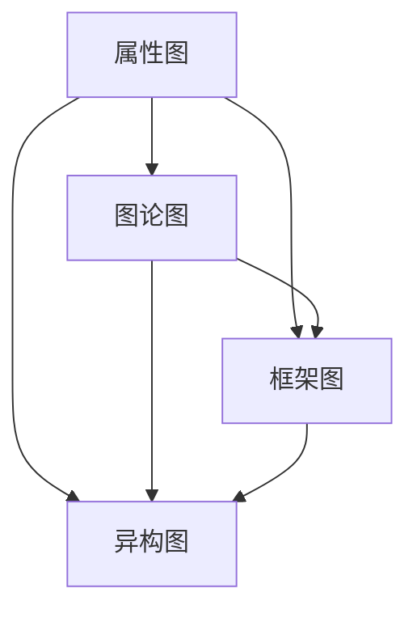
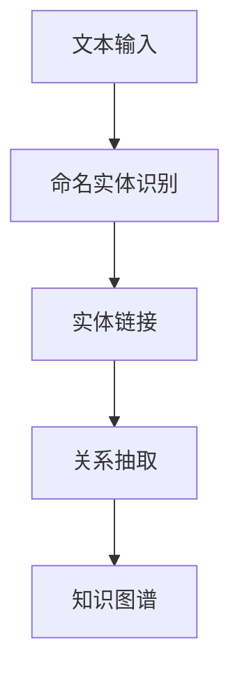
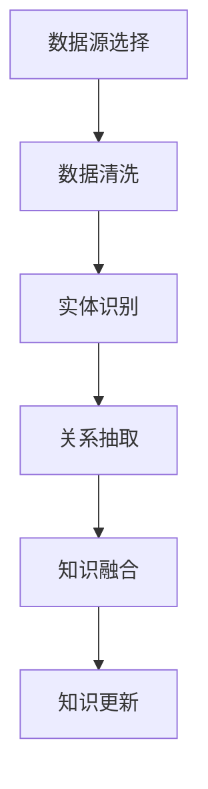

                 

### 引言

随着人工智能技术的飞速发展，语言模型（LLM，Language Model）在自然语言处理（NLP，Natural Language Processing）领域取得了显著成就。然而，尽管LLM在文本生成、翻译、问答等任务上表现出色，但它们通常缺乏背景知识和上下文理解能力，导致在处理复杂任务时表现出一定的局限性。为了解决这一问题，知识图谱（Knowledge Graph）应运而生，并逐渐成为增强LLM应用的重要手段。

知识图谱是一种结构化数据模型，通过节点（实体）和边（关系）来表示现实世界中的知识，提供了一种直观、高效的知识表示和推理方式。近年来，知识图谱在问答系统、推荐系统、实体关系挖掘等领域展现出了巨大的潜力。本文将围绕知识图谱如何增强LLM应用，从基础概念、构建方法、推理算法、应用实例等多个方面进行深入探讨。

首先，我们将介绍知识图谱的基本概念和结构，阐述其在增强LLM应用中的重要性。接着，详细讲解知识图谱的构建过程，包括数据源选择、实体识别、关系抽取以及知识融合等关键步骤。随后，介绍知识图谱推理算法及其原理，并通过Python代码和数学模型进行详细解释。在应用部分，我们将探讨知识图谱在问答系统、推荐系统和自然语言处理中的应用实例，并分析其实际效果。最后，讨论知识图谱在LLM应用开发中的挑战与解决方案，并提出未来发展的方向。

通过本文的深入探讨，希望能够为读者提供一个全面、系统的知识图谱增强LLM应用的技术框架，助力人工智能领域的研究和应用发展。

### 关键词

知识图谱，语言模型（LLM），自然语言处理（NLP），问答系统，推荐系统，实体关系挖掘，知识表示，推理算法，数学模型，Python代码。

### 摘要

本文旨在探讨知识图谱如何增强语言模型（LLM）的应用。首先，介绍了知识图谱的基本概念、结构和重要性，阐述了其在提升LLM背景知识和上下文理解能力方面的作用。接着，详细讲解了知识图谱的构建方法，包括数据源选择、实体识别、关系抽取和知识融合。随后，介绍了知识图谱的推理算法及其原理，并通过Python代码和数学模型进行阐述。最后，通过具体应用实例，展示了知识图谱在问答系统、推荐系统和自然语言处理中的实际效果，并讨论了相关挑战与解决方案。本文为读者提供了一个系统化的知识图谱增强LLM应用的技术框架，有助于推动人工智能领域的发展。

### 知识图谱概述

知识图谱（Knowledge Graph）是一种用于表示和存储知识的图形结构模型，通过节点（Node）和边（Edge）来组织信息，将现实世界中的实体及其关系结构化地表示出来。这种图形结构使得知识图谱在表示复杂关系和进行知识推理方面具有显著优势。知识图谱的起源可以追溯到20世纪80年代，随着语义网（Semantic Web）概念的提出，知识图谱开始成为学术界和工业界的研究热点。近年来，随着人工智能和大数据技术的迅猛发展，知识图谱的应用范围不断扩大，其在增强语言模型（LLM）应用方面也展现出巨大的潜力。

知识图谱的重要性主要体现在以下几个方面：

1. **知识表示**：知识图谱提供了一种直观且结构化的方式来表示复杂知识。通过节点和边，知识图谱能够清晰地表示实体及其相互关系，使信息更具可读性和可理解性。
2. **知识推理**：知识图谱中的关系和属性可以用于推理，从而揭示新的知识和规律。这种推理能力是传统数据模型所不具备的，为智能系统的自主学习和决策提供了重要支持。
3. **上下文理解**：知识图谱能够提供丰富的上下文信息，帮助语言模型更好地理解文本中的隐含意义。通过结合知识图谱中的背景知识，LLM可以在回答问题时更加准确和全面。
4. **信息检索和推荐**：知识图谱可以作为信息检索和推荐系统的基础，通过图搜索算法，可以高效地找到相关实体和关系，从而提高检索和推荐的精度和效率。

知识图谱的发展历程可以分为几个重要阶段：

- **早期阶段**：从语义网的概念到OWL（Web Ontology Language）和RDF（Resource Description Framework）的提出，知识图谱开始从理论走向实践。
- **中期阶段**：随着图数据库和图处理技术的成熟，知识图谱的应用范围逐渐扩大，如Facebook的Knowledge Graph和Google的Knowledge Graph。
- **近期阶段**：随着深度学习和图神经网络（GNN）的发展，知识图谱在增强机器学习和自然语言处理领域中的作用越来越受到重视。

知识图谱的类型与结构多种多样，主要包括以下几种：

- **属性图**：这是最常见的一种知识图谱类型，通过属性来描述节点和边。例如，在一个包含人、地点、事件的知识图谱中，人的属性可能包括姓名、年龄、性别等，地点的属性可能包括名称、类型、坐标等。
- **图论图**：这种类型的知识图谱强调节点和边之间的逻辑关系，常用图论中的概念和算法来表示知识。例如，图中的连通性、路径长度、圈数等都是图论图中的重要属性。
- **框架图**：框架图通过框架元素（如角色、槽、值）来表示知识。这种类型的知识图谱常用于知识表示和推理，例如在医疗知识图谱中，框架图可以用来表示疾病、症状、治疗方法等。
- **异构图**：异构图是包含不同类型节点的知识图谱，这些节点具有不同的属性和关系。例如，一个包含人、地点、组织、事件等多类型实体的知识图谱，可以被视为一个异构图。

综上所述，知识图谱作为一种重要的知识表示和推理工具，在人工智能领域尤其是增强LLM应用方面具有巨大潜力。通过深入了解知识图谱的基本概念、结构和类型，可以为后续的构建和应用提供坚实的基础。

### 知识图谱的类型与结构

知识图谱的类型和结构多种多样，每一种类型都有其独特的特点和适用场景。以下是几种常见的知识图谱类型及其结构：

1. **属性图**：
   - **定义**：属性图是最常见的一种知识图谱类型，通过节点（实体）和边（关系）来表示知识，每个节点和边都有属性。
   - **结构特点**：属性图中的节点代表实体，边代表实体之间的关系，属性则用于描述节点和边的特征。例如，在一个包含人、地点、事件的知识图谱中，人的节点可能有姓名、年龄、性别等属性，事件的节点可能有时间、地点、参与者等属性。
   - **应用场景**：属性图适用于信息检索、推荐系统、问答系统等领域，能够直观地表示实体和关系，便于处理复杂的实体属性。

2. **图论图**：
   - **定义**：图论图是一种基于图论理论的知识图谱，强调节点和边之间的逻辑关系，常用图论中的概念和算法来表示知识。
   - **结构特点**：图论图中的节点和边都可以带权，表示节点和边之间的距离或重要性。图中的连通性、路径长度、圈数等属性都是图论图中的重要概念。
   - **应用场景**：图论图适用于社交网络分析、网络路由、复杂系统的拓扑分析等领域，能够有效地揭示节点之间的关系和路径。

3. **框架图**：
   - **定义**：框架图通过框架元素（如角色、槽、值）来表示知识。框架图通常用于知识表示和推理。
   - **结构特点**：框架图中的每个实体都可以被视为一个框架，框架由多个角色和对应的槽组成，槽中填入具体的值。例如，在医疗知识图谱中，一个疾病的框架可能包含症状、治疗方法、并发症等角色和槽。
   - **应用场景**：框架图适用于医疗诊断、法律咨询、自然语言处理等领域，能够提供结构化的知识表示，便于推理和决策。

4. **异构图**：
   - **定义**：异构图是包含不同类型节点的知识图谱，这些节点具有不同的属性和关系。
   - **结构特点**：异构图中的节点分为不同类型，每种类型节点具有特定的属性和关系。例如，一个包含人、地点、组织、事件等多类型实体的知识图谱，就是异构图。
   - **应用场景**：异构图适用于多领域知识融合、推荐系统、问答系统等领域，能够处理复杂且多样化的实体和关系。

为了更好地理解这些知识图谱类型之间的关系和联系，我们可以使用Mermaid流程图来展示它们的基本结构和关系：



在这个Mermaid流程图中，属性图、图论图、框架图和异构图相互关联，它们在知识表示和推理方面各有优势，但在某些情况下可以相互融合和扩展。

- **属性图**为知识图谱提供了基础的实体和关系表示，是其他类型知识图谱的基础。
- **图论图**提供了节点和边之间的逻辑关系和计算方法，能够揭示节点之间的复杂关系。
- **框架图**通过结构化的方式表示知识，便于推理和决策。
- **异构图**则结合了多种类型的实体和关系，能够处理更加复杂和多样化的知识场景。

综上所述，知识图谱的类型和结构多种多样，每种类型都有其独特的特点和适用场景。通过结合不同类型的知识图谱，可以构建出更加丰富和实用的知识图谱系统，为增强语言模型（LLM）应用提供有力支持。

### 知识表示

知识表示是知识图谱构建中的核心环节，它涉及如何将现实世界中的知识转化为结构化的数据模型，以便于计算机理解和处理。在知识图谱中，常见的知识表示方法主要包括命名实体识别、实体链接和关系抽取。这些方法共同作用，为知识图谱提供了丰富的结构化信息。

1. **命名实体识别（Named Entity Recognition, NER）**
   - **定义**：命名实体识别是一种自然语言处理技术，用于从文本中识别出具有特定意义的实体，如人名、地名、组织名、产品名等。
   - **方法**：命名实体识别通常采用机器学习方法，如条件随机场（CRF）、深度学习模型（如BiLSTM-CRF）等。近年来，基于Transformer的模型（如BERT、RoBERTa等）也在NER任务中表现出色。
   - **应用**：命名实体识别是构建知识图谱的基础步骤，通过识别文本中的关键实体，可以为后续的实体链接和关系抽取提供重要的信息源。

2. **实体链接（Entity Linking）**
   - **定义**：实体链接是一种将文本中的命名实体与其在知识图谱中的对应实体进行匹配的过程。其目的是将同一实体的不同表述形式（如全称、简称、同义词等）统一为一个唯一的实体标识。
   - **方法**：实体链接通常结合词向量模型（如Word2Vec、BERT等）和图神经网络（GNN）来实现。词向量模型用于捕捉实体之间的语义相似性，而GNN则用于在图结构中找到对应实体。
   - **应用**：实体链接是知识图谱构建中的关键步骤，通过将文本中的实体与知识图谱中的实体进行匹配，可以实现文本与知识图谱的无缝连接，为后续的知识抽取和推理提供基础。

3. **关系抽取（Relationship Extraction）**
   - **定义**：关系抽取是一种从文本中抽取实体之间关系的任务。其目的是建立实体之间的关联，丰富知识图谱的结构。
   - **方法**：关系抽取的方法主要包括基于规则的方法、基于统计的方法和基于深度学习的方法。基于规则的方法利用预定义的规则进行关系识别，基于统计的方法通过模式匹配和机器学习模型进行关系抽取，基于深度学习的方法（如BERT、T5等）能够直接从文本中预测实体之间的关系。
   - **应用**：关系抽取是构建知识图谱的重要步骤，通过识别和抽取实体之间的关系，可以建立知识图谱中的复杂关系网络，提高知识图谱的完整性和准确性。

为了更直观地理解这些知识表示方法及其相互关系，我们可以使用Mermaid流程图来展示其基本流程：



在这个流程图中，文本输入首先通过命名实体识别步骤，识别出文本中的关键实体；然后，这些实体通过实体链接步骤与知识图谱中的实体进行匹配；最后，通过关系抽取步骤，建立实体之间的关联关系，形成完整的知识图谱。

综上所述，知识表示是知识图谱构建中的关键步骤，通过命名实体识别、实体链接和关系抽取等方法，可以将现实世界中的知识结构化为计算机可以理解和处理的形式，为增强语言模型（LLM）应用提供重要的数据支持。

### 知识图谱的构建方法

知识图谱的构建是一个复杂的过程，它涉及到数据源的选择、数据清洗、实体识别、关系抽取、知识融合和知识更新等多个步骤。以下是知识图谱构建的详细方法及其关键步骤：

1. **数据源选择**

   - **定义**：数据源选择是指从海量的数据中挑选出对构建知识图谱有用的数据源。
   - **步骤**：
     1. 数据识别：根据知识图谱的应用领域，确定需要收集的数据类型，如文本数据、结构化数据或非结构化数据。
     2. 数据评估：评估数据的质量和可用性，确保数据源的准确性和完整性。
     3. 数据收集：通过网络爬虫、API接口、数据库等方式收集所需数据。
     - **挑战**：数据源的多样性和质量参差不齐，需要过滤和筛选高质量的数据源。

2. **数据清洗**

   - **定义**：数据清洗是指对收集到的原始数据进行处理，以去除错误、冗余和噪声，提高数据质量。
   - **步骤**：
     1. 数据预处理：去除无关数据，如HTML标签、特殊字符等。
     2. 数据标准化：统一数据的格式和单位，如日期、货币等。
     3. 数据去重：识别和去除重复的数据条目。
     4. 数据修复：修复数据中的错误和缺失值。
     - **挑战**：数据清洗过程复杂，需要处理大量的数据，同时确保数据的准确性和一致性。

3. **实体识别**

   - **定义**：实体识别是从文本数据中识别出重要的实体，如人、地点、组织等。
   - **步骤**：
     1. 命名实体识别（NER）：使用NER技术从文本中提取命名实体。
     2. 实体分类：对提取出的命名实体进行分类，确定其类型。
     3. 实体去重：识别和去除重复的实体。
     - **挑战**：文本中的实体多样且复杂，需要精确地识别和分类。

4. **关系抽取**

   - **定义**：关系抽取是从文本数据中提取实体之间的关系。
   - **步骤**：
     1. 关系分类：确定实体之间的关系类型，如“工作于”、“位于”等。
     2. 关系识别：从文本中抽取实体之间的关系。
     3. 关系去重：识别和去除重复的关系。
     - **挑战**：关系抽取需要处理复杂的文本结构和多样的关系类型。

5. **知识融合**

   - **定义**：知识融合是将不同来源和格式的知识整合到一个统一的框架中。
   - **步骤**：
     1. 数据对齐：将不同来源的数据对齐到同一个实体和关系框架。
     2. 矛盾检测：检测和解决数据中的矛盾和冲突。
     3. 知识整合：将不同来源的知识整合到知识图谱中。
     - **挑战**：不同数据源之间存在差异，需要处理数据的一致性和完整性。

6. **知识更新**

   - **定义**：知识更新是指定期对知识图谱进行维护和更新，以保持其时效性和准确性。
   - **步骤**：
     1. 数据监测：监测数据源中的新数据，识别数据变化。
     2. 数据更新：将新数据整合到知识图谱中，更新实体和关系。
     3. 质量控制：确保更新后的知识图谱质量。
     - **挑战**：知识更新需要处理大量数据，同时确保数据的一致性和准确性。

为了更好地理解知识图谱构建的流程，我们可以使用Mermaid流程图来展示：



在这个流程图中，数据源选择、数据清洗、实体识别、关系抽取、知识融合和知识更新构成了知识图谱构建的核心步骤，每一步都需要精确执行，以确保最终的知识图谱质量。

通过以上详细的构建方法，我们可以看到知识图谱构建的复杂性。然而，随着人工智能和大数据技术的发展，这些挑战正在逐步被克服。知识图谱作为一种重要的知识表示和推理工具，将在未来继续发挥其重要作用，特别是在增强语言模型（LLM）应用方面。

### 知识图谱推理算法

知识图谱推理（Knowledge Graph Reasoning）是知识图谱技术中的一个重要组成部分，它通过利用知识图谱中的节点和关系来发现新的知识或验证已有知识。知识图谱推理算法可以分为基于规则推理和基于图神经网络（GNN）的推理。在本节中，我们将分别介绍这些算法的基本原理，并通过Python代码和数学模型进行详细阐述。

#### 基于规则推理

基于规则推理是一种传统的推理方法，它通过定义一系列规则，利用知识图谱中的节点和关系进行逻辑推理。这种方法的特点是规则简单明了，易于理解和实现。

1. **基本原理**
   - **定义**：基于规则推理通过前件（条件）和后件（结论）之间的匹配来推导出新的知识。例如，如果一个节点A与另一个节点B有直接关系，并且节点B与节点C有直接关系，那么可以推断出节点A与节点C也有关系。
   - **原理公式**：
     $$ R(A, B) \land R(B, C) \Rightarrow R(A, C) $$

2. **Python代码示例**

```python
def rule_based_reasoning(graph, rule):
    for node_a, node_b, relation in graph.edges():
        for node_c in graph.neighbors(node_b):
            if rule(node_a, node_b, node_c):
                graph.add_edge(node_a, node_c)
```

3. **应用场景**
   - **推理任务**：这种推理方法适用于简单的逻辑推理和规则匹配，如路径查找、子图同构等。

#### 基于图神经网络（GNN）的推理

基于图神经网络（GNN）的推理是一种利用深度学习技术进行推理的方法，它通过学习知识图谱中的节点和关系的嵌入表示，从而进行复杂的推理任务。

1. **基本原理**
   - **定义**：GNN通过多层神经网络来学习节点的嵌入表示，节点之间的交互通过图卷积操作实现。通过这些嵌入表示，GNN能够捕捉到节点和关系之间的复杂关系，从而进行推理。
   - **原理公式**：
     $$ h^{(k)}_v = \sigma(\sum_{u \in \mathcal{N}(v)} \alpha(u, v) \cdot W^{(k-1)} h^{(k-1)}_u) $$
     其中，$h^{(k)}_v$表示第$k$层节点$v$的嵌入表示，$\mathcal{N}(v)$表示节点$v$的邻居节点集合，$\alpha(u, v)$是节点之间的相似度，$W^{(k-1)}$是权重矩阵。

2. **Python代码示例**

```python
import tensorflow as tf
from tensorflow.keras.layers import Layer

class GraphConvLayer(Layer):
    def __init__(self, output_dim):
        super().__init__()
        self.output_dim = output_dim
        self.kernel = self.add_weight(shape=(self.input_shape[2], output_dim),
                                      initializer='glorot_uniform',
                                      trainable=True)

    def call(self, inputs, training=False):
        A = inputs[0]
        X = inputs[1]
        support = tf.matmul(A, X)
        output = tf.matmul(support, self.kernel)
        return output

# 假设我们有一个图和节点特征数据
A = ...  # adjacency matrix
X = ...  # node features

# 构建GNN模型
gcn_layer = GraphConvLayer(output_dim=16)
output = gcn_layer([A, X])

# 训练模型
model = tf.keras.Model(inputs=[A, X], outputs=output)
model.compile(optimizer='adam', loss='categorical_crossentropy', metrics=['accuracy'])
model.fit([A, X], y, epochs=10)
```

3. **应用场景**
   - **推理任务**：GNN推理适用于复杂的图结构推理任务，如节点分类、链接预测、图分类等。

#### 比较与适用场景

- **基于规则推理**适用于简单的规则匹配任务，其优点是规则直观、易于理解，但缺点是难以处理复杂的关系和网络结构。
- **基于图神经网络（GNN）的推理**适用于复杂的图结构任务，其优点是能够学习到节点和关系的复杂嵌入表示，但缺点是模型复杂、计算成本高。

综上所述，知识图谱推理算法的选择取决于具体的应用场景和任务需求。在实际应用中，可以根据任务的特点和计算资源来选择合适的推理算法，从而最大化推理效果。

### 知识图谱与LLM的关系

语言模型（LLM，Language Model）和知识图谱（Knowledge Graph）的结合，为人工智能（AI）领域带来了新的机遇和挑战。LLM通过学习大量的语言数据，生成自然流畅的语言输出，而知识图谱则通过结构化地表示和存储知识，为LLM提供了丰富的背景知识和上下文信息。两者结合能够显著提升LLM在特定任务中的性能和可靠性。

#### 知识图谱对LLM的增强作用

1. **背景知识补充**

   语言模型在生成文本时，往往缺乏背景知识和上下文理解。知识图谱通过结构化地表示实体和关系，为LLM提供了丰富的背景知识。例如，当LLM需要生成关于某个历史事件的文本时，知识图谱可以提供该事件相关的背景信息，如时间、地点、参与者等，从而帮助LLM生成更准确和丰富的内容。

2. **上下文理解增强**

   知识图谱能够提供上下文信息，帮助LLM更好地理解输入文本的隐含意义。例如，在问答系统中，知识图谱可以提供问题的背景信息，从而帮助LLM生成更准确和相关的答案。通过结合知识图谱中的关系和属性，LLM可以更准确地理解问题中的关键词和句子之间的关系。

3. **推理能力提升**

   知识图谱中的关系和属性可以用于推理，从而揭示新的知识和规律。例如，通过知识图谱中的关系，LLM可以推断出某个实体与其他实体之间的潜在联系。这种推理能力是传统数据模型所不具备的，为LLM在复杂任务中的表现提供了重要支持。

#### 知识图谱与LLM结合的挑战与解决方案

1. **数据一致性和完整性**

   知识图谱的数据来源于多种数据源，不同数据源之间的数据可能存在不一致性和完整性问题。这需要设计有效的数据清洗和融合机制，确保知识图谱中的数据一致性。

2. **推理效率与复杂度**

   知识图谱中的推理通常涉及复杂的图结构，推理过程可能需要较高的计算资源。为了提升推理效率，可以采用高效的图处理算法和分布式计算技术，如图卷积网络（GCN）和分布式图数据库。

3. **模型融合与优化**

   将知识图谱与LLM进行有效融合，需要解决模型之间的交互和协同优化问题。可以通过模型融合技术，如多任务学习（Multi-Task Learning）和迁移学习（Transfer Learning），实现LLM和知识图谱的协同优化。

4. **知识图谱更新与维护**

   知识图谱需要定期更新和维护，以保持其时效性和准确性。可以设计自动化的知识图谱更新机制，利用实时数据流和机器学习技术，实现知识图谱的动态更新和维护。

综上所述，知识图谱与LLM的结合为人工智能领域带来了新的发展机遇。通过有效利用知识图谱提供的背景知识和上下文信息，可以显著提升LLM在多种任务中的表现。同时，也面临着数据一致性、推理效率、模型融合和知识更新等挑战，需要通过技术创新和优化策略来解决。

### 知识图谱在问答系统中的应用

问答系统（Question Answering System）是一种智能交互系统，旨在通过理解和回答用户提出的问题，提供有针对性的信息和解决方案。知识图谱作为一种结构化的知识表示方法，能够为问答系统提供丰富的背景知识和上下文信息，从而显著提升问答系统的性能和准确性。

#### 知识图谱在问答系统中的应用架构

1. **问题解析**：
   - **定义**：问题解析是将用户输入的自然语言问题转化为计算机可以处理的结构化查询。
   - **步骤**：
     1. 命名实体识别（NER）：从问题中识别出关键实体，如人名、地名、组织名等。
     2. 关键词提取：提取问题中的关键词和短语，用于后续的语义匹配和查询生成。

2. **知识检索**：
   - **定义**：知识检索是在知识图谱中查找与问题相关的知识点和关系。
   - **步骤**：
     1. 语义匹配：将问题中的关键词与知识图谱中的实体和关系进行匹配，找到相关的知识点。
     2. 查询生成：根据匹配结果，生成查询语句，以获取完整的答案信息。

3. **答案生成**：
   - **定义**：答案生成是从知识图谱中提取答案，并通过自然语言生成技术进行文本化输出。
   - **步骤**：
     1. 答案提取：从知识图谱中提取与问题相关的答案信息。
     2. 文本化：将提取的信息转化为自然语言文本，进行格式化和润色。

#### 知识图谱在问答系统中的具体应用实例

1. **实例一：企业知识库问答系统**
   - **应用场景**：企业内部的知识库问答系统，旨在为员工提供快速、准确的内部知识和信息查询。
   - **架构**：
     1. 问题解析：利用命名实体识别和关键词提取技术，将用户的问题转化为结构化查询。
     2. 知识检索：通过知识图谱进行语义匹配和查询生成，找到与问题相关的知识点。
     3. 答案生成：从知识图谱中提取答案，并通过自然语言生成技术进行文本化输出。
   - **效果**：通过结合知识图谱和LLM技术，企业知识库问答系统能够准确回答用户的问题，并提供详细的背景信息，显著提升了员工的工作效率。

2. **实例二：智能客服系统**
   - **应用场景**：智能客服系统通过自动回答用户的问题，提供在线客服服务。
   - **架构**：
     1. 问题解析：利用命名实体识别和关键词提取技术，将用户的问题转化为结构化查询。
     2. 知识检索：通过知识图谱进行语义匹配和查询生成，找到与问题相关的知识点。
     3. 答案生成：从知识图谱中提取答案，并通过自然语言生成技术进行文本化输出。
   - **效果**：通过结合知识图谱和LLM技术，智能客服系统能够准确回答用户的问题，提供个性化的解决方案，提升了用户体验和客户满意度。

#### 实际案例分析

以一个实际案例——“企业知识库问答系统”为例，分析其架构和效果。

- **架构**：
  1. **问题解析**：系统首先利用BERT模型对用户的问题进行命名实体识别和关键词提取，将自然语言问题转化为结构化查询。
  2. **知识检索**：通过将提取的关键词与知识图谱中的实体和关系进行匹配，找到相关的知识点。知识图谱中的数据来源于企业内部的知识库、文档和报告。
  3. **答案生成**：系统利用GPT-3模型从知识图谱中提取答案信息，并进行文本化输出。答案生成过程包括文本抽取、信息整合和语言润色等步骤。

- **效果**：
  1. **准确性**：通过结合知识图谱和LLM技术，问答系统的准确性显著提升。系统能够准确识别用户的问题，并从知识图谱中提取相关答案。
  2. **丰富性**：知识图谱提供了丰富的背景信息和上下文，使得问答系统能够生成更详细、更全面的答案，为用户提供了更有价值的信息。
  3. **用户体验**：通过快速、准确的问题回答和详细的背景信息，用户满意度显著提升，企业内部的知识共享和知识传递效率也得到大幅提高。

综上所述，知识图谱在问答系统中发挥了重要作用，通过提供结构化的背景知识和上下文信息，显著提升了问答系统的性能和用户体验。在实际应用中，结合知识图谱和LLM技术，可以构建出更加智能和高效的问答系统，为各种场景提供有效的解决方案。

### 知识图谱在推荐系统中的应用

推荐系统（Recommendation System）是一种通过分析用户行为和历史数据，向用户推荐其可能感兴趣的产品、服务或内容的技术。知识图谱在推荐系统中的应用，可以通过构建用户、商品和上下文之间的关系网络，增强推荐系统的准确性和个性化推荐能力。

#### 知识图谱在推荐系统中的架构

1. **用户-商品关系网络构建**
   - **定义**：通过知识图谱表示用户和商品之间的关系，如用户购买、评价、收藏等行为。
   - **步骤**：
     1. 数据收集：收集用户行为数据，如购买记录、评价内容等。
     2. 实体识别：利用命名实体识别（NER）技术，识别出用户和商品。
     3. 关系抽取：从用户行为数据中提取用户和商品之间的关系，如“购买”、“评价”等。
     4. 知识融合：将用户和商品之间的关系融入知识图谱中。

2. **上下文信息整合**
   - **定义**：上下文信息包括用户偏好、时间、地点等，这些信息可以增强推荐系统的个性化能力。
   - **步骤**：
     1. 上下文识别：通过自然语言处理技术，识别用户在特定场景下的偏好和需求。
     2. 上下文关联：将上下文信息与用户和商品关系网络进行关联，形成完整的知识图谱。

3. **推荐算法集成**
   - **定义**：将知识图谱与推荐算法结合，通过图结构进行推荐，实现个性化推荐。
   - **步骤**：
     1. 推荐模型训练：利用知识图谱和用户行为数据，训练推荐模型。
     2. 推荐策略优化：通过图神经网络（GNN）等技术，优化推荐策略，提升推荐效果。

#### 知识图谱在推荐系统中的具体应用实例

1. **实例一：电商平台个性化推荐**
   - **应用场景**：电商平台通过知识图谱，为用户提供个性化的商品推荐。
   - **架构**：
     1. **用户-商品关系网络构建**：通过用户的历史购买行为和评价，构建用户和商品之间的关系网络。
     2. **上下文信息整合**：整合用户的浏览历史、搜索关键词、购物车等信息，增强推荐系统的上下文理解能力。
     3. **推荐算法集成**：利用知识图谱和GNN技术，优化推荐算法，实现个性化推荐。
   - **效果**：
     1. **推荐准确性**：通过知识图谱的构建和整合，推荐系统能够更准确地预测用户偏好，提升推荐准确性。
     2. **用户满意度**：个性化推荐提升了用户体验，用户满意度显著提高。

2. **实例二：新闻推荐平台**
   - **应用场景**：新闻推荐平台通过知识图谱，为用户提供个性化的新闻推荐。
   - **架构**：
     1. **用户-新闻关系网络构建**：通过用户的阅读历史、评论等行为，构建用户和新闻之间的关系网络。
     2. **上下文信息整合**：整合用户的兴趣偏好、阅读时间等上下文信息，增强推荐系统的个性化能力。
     3. **推荐算法集成**：利用知识图谱和图卷积网络（GCN）技术，优化推荐算法，实现精准推荐。
   - **效果**：
     1. **推荐丰富性**：通过知识图谱的构建，推荐系统可以提供更丰富、多样化的新闻内容，满足用户不同兴趣和需求。
     2. **用户粘性**：个性化推荐提升了用户粘性，用户在平台上的停留时间和互动行为显著增加。

#### 实际案例分析

以一个实际案例——“电商平台个性化推荐”为例，分析其架构和效果。

- **架构**：
  1. **用户-商品关系网络构建**：系统首先通过用户的历史购买行为和评价，构建用户和商品之间的关系网络。例如，一个用户购买了一款手机，并在购物平台上留下了好评，系统会将该用户与手机建立购买关系，并将评价内容与手机建立评价关系。
  2. **上下文信息整合**：系统整合用户的浏览历史、搜索关键词、购物车等信息，以增强推荐系统的上下文理解能力。例如，如果用户最近浏览了多款运动鞋，并且在搜索框中输入了“篮球鞋”，系统会将这些上下文信息与用户建立关联。
  3. **推荐算法集成**：系统利用知识图谱和图神经网络（GNN）技术，优化推荐算法，实现个性化推荐。例如，通过GNN模型，系统可以学习用户和商品之间的复杂关系，为用户提供更精准的推荐。

- **效果**：
  1. **推荐准确性**：通过知识图谱的构建和整合，推荐系统能够更准确地预测用户偏好，提升推荐准确性。例如，如果一个用户经常购买电子产品，系统会优先推荐新款手机或电脑，而不是家居用品。
  2. **用户满意度**：个性化推荐提升了用户体验，用户满意度显著提高。用户在平台上更容易找到符合自己需求的商品，购物体验更加流畅和愉悦。
  3. **销售转化率**：个性化推荐提升了商品的销售转化率，电商平台因此实现了更高的销售额和用户留存率。

综上所述，知识图谱在推荐系统中的应用，通过构建用户、商品和上下文之间的关系网络，显著提升了推荐系统的准确性和个性化能力。在实际应用中，结合知识图谱和推荐算法，可以构建出更智能、更高效的推荐系统，为用户提供更满意和个性化的服务。

### 知识图谱在实体关系挖掘中的应用

实体关系挖掘（Entity Relationship Mining）是指从大规模数据集中识别出实体之间的潜在关系，并构建出实体关系网络。知识图谱作为一种高效的结构化知识表示方法，在实体关系挖掘中发挥着重要作用。通过知识图谱，可以更好地理解和分析实体之间的关系，从而为数据分析和决策提供有力支持。

#### 知识图谱在实体关系挖掘中的应用

1. **实体识别**
   - **定义**：实体识别是指从非结构化数据中识别出具体的实体，如人、地点、组织等。
   - **应用**：知识图谱通过命名实体识别（NER）技术，从文本数据中提取出关键实体，如“苹果公司”、“北京”、“张三”等。

2. **关系抽取**
   - **定义**：关系抽取是指从文本数据中识别出实体之间的直接或间接关系，如“工作于”、“位于”、“拥有”等。
   - **应用**：知识图谱通过关系抽取技术，从文本数据中提取出实体之间的关系，如“苹果公司”与“iPhone”之间存在“生产”关系，“张三”与“北京”之间存在“居住”关系。

3. **实体关系建模**
   - **定义**：实体关系建模是指将识别出的实体和关系构建成一个结构化的知识图谱。
   - **应用**：知识图谱通过将实体和关系进行结构化表示，构建出一个网络状的实体关系模型，使得实体之间的关系更加清晰和直观。

4. **图分析**
   - **定义**：图分析是指利用图论和网络分析技术，对知识图谱中的实体关系进行深度分析和挖掘。
   - **应用**：知识图谱通过图分析技术，可以识别出实体之间的紧密关系、传播路径和影响力，从而发现潜在的知识模式和趋势。

#### 知识图谱在实体关系挖掘中的具体应用实例

1. **社交媒体分析**
   - **应用场景**：在社交媒体平台上，通过知识图谱挖掘用户之间的关系和网络结构。
   - **架构**：
     1. **实体识别**：利用NER技术，识别出社交媒体中的用户、地点、事件等实体。
     2. **关系抽取**：通过文本分析技术，抽取用户之间的关注、点赞、评论等关系。
     3. **实体关系建模**：将识别出的实体和关系构建成一个社交网络图。
     4. **图分析**：通过图分析技术，挖掘出用户之间的紧密关系和影响力，如“意见领袖”、“社交圈子”等。
   - **效果**：
     1. **用户分析**：通过知识图谱，可以更准确地了解用户的社交行为和偏好，为个性化推荐和营销提供支持。
     2. **内容推荐**：基于用户之间的关系和影响力，推荐用户可能感兴趣的内容和活动，提升用户体验。

2. **企业关系网络分析**
   - **应用场景**：在企业关系中，通过知识图谱挖掘合作伙伴、供应商、客户等实体之间的关系。
   - **架构**：
     1. **实体识别**：识别出企业、产品、项目等实体。
     2. **关系抽取**：通过数据挖掘技术，抽取企业之间的合作、竞争、交易等关系。
     3. **实体关系建模**：构建出企业关系网络图。
     4. **图分析**：通过图分析技术，识别出关键节点和路径，如“核心合作伙伴”、“关键供应链”等。
   - **效果**：
     1. **战略决策**：帮助企业识别关键合作伙伴和供应链节点，优化资源配置和业务流程。
     2. **风险评估**：通过分析企业之间的复杂关系，识别潜在的风险和问题，提前采取预防措施。

#### 实际案例分析

以一个实际案例——“社交媒体用户关系分析”为例，分析其架构和效果。

- **架构**：
  1. **实体识别**：系统利用NER技术，从社交媒体文本中识别出用户、地点、事件等实体。例如，识别出用户“李四”在某个社交平台上发布了一条关于“北京”的旅游信息。
  2. **关系抽取**：系统通过文本分析技术，抽取用户之间的关注、点赞、评论等关系。例如，用户“李四”点赞了用户“王五”的微博，建立了“李四”与“王五”之间的关注关系。
  3. **实体关系建模**：系统将识别出的实体和关系构建成一个社交网络图，表示用户之间的关系结构。
  4. **图分析**：系统通过图分析技术，挖掘出用户之间的紧密关系和影响力。例如，识别出某个用户群体中的“意见领袖”，并分析其社交圈子的影响力。

- **效果**：
  1. **用户分析**：通过知识图谱，系统可以更准确地了解用户的社交行为和偏好，为平台提供个性化推荐和内容推送，提升用户粘性。
  2. **社交圈子分析**：系统可以帮助平台运营者识别出具有共同兴趣的用户群体，优化社区运营策略，提升用户活跃度。
  3. **风险监控**：系统可以监测用户之间的互动关系，识别出潜在的风险和问题，如网络欺诈、恶意传播等，及时采取防范措施。

综上所述，知识图谱在实体关系挖掘中的应用，通过构建实体关系网络和进行图分析，可以帮助企业和平台更好地理解和分析实体之间的关系，从而为数据分析和决策提供有力支持。在实际应用中，结合知识图谱和实体关系挖掘技术，可以构建出更智能、更高效的实体关系分析系统。

### 知识图谱在自然语言处理中的应用

知识图谱在自然语言处理（NLP）中的应用，极大地提升了文本分析、语言理解和机器翻译等任务的性能。通过将知识图谱与NLP技术相结合，可以有效地增强对文本的理解和生成能力，从而实现更智能化、更准确的自然语言处理。

#### 知识图谱在文本分析中的应用

1. **实体识别**

   在文本分析中，实体识别是关键的一步。知识图谱通过提供丰富的实体信息，如人名、地名、组织名等，可以帮助NLP系统更准确地识别文本中的实体。例如，当处理新闻文本时，知识图谱可以提供每个提及的人物、地点和组织的详细信息，从而提高命名实体识别的准确性。

2. **关系抽取**

   知识图谱中的关系信息有助于NLP系统理解文本中实体之间的关联。例如，通过知识图谱中的关系，NLP系统可以识别出两个实体之间的“工作于”、“位于”等关系，从而更好地构建文本中的关系网络。

3. **事件抽取**

   知识图谱可以帮助NLP系统识别文本中的事件及其相关实体。例如，在处理新闻报道时，知识图谱可以提供事件发生的时间、地点、参与者和事件类型等信息，从而帮助系统更准确地抽取事件。

4. **情感分析**

   知识图谱中的情感信息可以帮助NLP系统进行情感分析。通过结合知识图谱中的情感属性，NLP系统可以更准确地识别文本中的情感倾向，例如正面、负面或中性情感。

#### 知识图谱在语言理解中的应用

1. **上下文理解**

   知识图谱为NLP系统提供了丰富的上下文信息，有助于更好地理解文本中的隐含意义。例如，通过知识图谱，NLP系统可以理解某个实体在特定情境下的意义，从而生成更准确的自然语言输出。

2. **问答系统**

   知识图谱可以增强问答系统的回答准确性。通过知识图谱中的信息，问答系统可以更准确地理解问题，并从知识库中提取相关信息生成回答。

3. **对话系统**

   在对话系统中，知识图谱可以帮助系统理解用户的意图和需求，提供更个性化的回答。例如，通过知识图谱，对话系统可以识别用户的偏好和兴趣，从而生成更符合用户需求的对话内容。

#### 知识图谱在机器翻译中的应用

1. **语义对齐**

   知识图谱可以帮助机器翻译系统进行语义对齐，从而提高翻译的准确性。通过知识图谱中的实体和关系信息，翻译系统可以更好地理解源语言和目标语言之间的语义对应关系。

2. **翻译记忆库**

   知识图谱可以作为翻译记忆库的一部分，为机器翻译系统提供丰富的翻译实例和知识。例如，通过知识图谱，翻译系统可以找到与特定实体相关的翻译对，从而提高翻译的一致性和准确性。

3. **多语言知识融合**

   知识图谱可以融合多种语言的知识，为机器翻译提供跨语言的信息。例如，通过知识图谱，翻译系统可以从一种语言的知识图谱中提取信息，并应用到另一种语言的翻译任务中。

综上所述，知识图谱在自然语言处理中的应用，通过提供结构化的实体、关系和上下文信息，显著提升了文本分析、语言理解和机器翻译等任务的性能。在实际应用中，结合知识图谱和NLP技术，可以构建出更智能、更高效的自然语言处理系统，为各类场景提供强大的语言理解和生成能力。

### 知识图谱开发环境搭建

知识图谱的开发环境搭建是进行知识图谱研究和应用的第一步，它包括工具选择、数据预处理、知识图谱构建与推理等多个环节。以下将详细讲解知识图谱开发环境搭建的过程，以及如何实现具体功能。

#### 开发工具选择

1. **图数据库**
   - **定义**：图数据库是专门用于存储和查询图结构数据的数据库系统，如Neo4j、Amazon Neptune等。
   - **选择理由**：图数据库能够高效地存储和查询知识图谱中的节点和边，支持复杂的图操作和图查询语言（如Cypher）。

2. **知识表示库**
   - **定义**：知识表示库用于将现实世界中的知识转化为结构化数据模型，如RDF（Resource Description Framework）、OWL（Web Ontology Language）等。
   - **选择理由**：知识表示库能够提供标准化的知识表示方法，便于知识的共享和互操作性。

3. **数据处理工具**
   - **定义**：数据处理工具用于处理和清洗原始数据，如Python、Apache Spark等。
   - **选择理由**：数据处理工具能够高效地处理大规模数据，提供丰富的数据处理和分析功能。

#### 数据预处理

1. **数据收集**
   - **步骤**：
     1. 确定数据来源，如公共数据集、网络爬虫等。
     2. 收集相关数据，如文本、结构化数据、非结构化数据等。

2. **数据清洗**
   - **步骤**：
     1. 数据去重：去除重复的数据条目。
     2. 数据标准化：统一数据的格式和单位。
     3. 数据修复：修复数据中的错误和缺失值。

3. **数据转换**
   - **步骤**：
     1. 将非结构化数据（如文本）转换为结构化数据。
     2. 将原始数据转换为知识表示库支持的数据格式。

#### 知识图谱构建

1. **实体识别**
   - **方法**：使用命名实体识别（NER）技术，从文本数据中识别出实体。
   - **Python代码示例**：

```python
from transformers import pipeline

ner_pipeline = pipeline("ner", model="dbmdz/bert-large-cased-finetuned-conll03-english")
text = "Apple is looking at buying U.K. startup for $1 billion"
results = ner_pipeline(text)

for result in results:
    print(result)
```

2. **关系抽取**
   - **方法**：使用关系抽取技术，从文本数据中提取实体之间的关系。
   - **Python代码示例**：

```python
from transformers import pipeline

re_pipeline = pipeline("rel_extr", model="dbmdz/bert-large-cased-finetuned-conll03-english")
text = "Apple is looking at buying U.K. startup for $1 billion"
results = re_pipeline(text)

for result in results:
    print(result)
```

3. **知识融合**
   - **方法**：将来自不同来源的数据进行融合，确保知识的一致性和完整性。
   - **Python代码示例**：

```python
def merge_data(data1, data2):
    # 合并两个数据集
    merged_data = data1 + data2
    # 数据去重
    unique_data = list(set(merged_data))
    return unique_data

data1 = [...]
data2 = [...]
merged_data = merge_data(data1, data2)
```

#### 知识图谱推理

1. **推理算法**
   - **方法**：使用图数据库提供的图查询语言，进行知识图谱的推理操作。
   - **Python代码示例**：

```python
from neo4j import GraphDatabase

class KnowledgeGraph:
    def __init__(self, uri, user, password):
        self._driver = GraphDatabase.driver(uri, auth=(user, password))

    def close(self):
        self._driver.close()

    def execute_query(self, query):
        with self._driver.session() as session:
            result = session.run(query)
            return result

kg = KnowledgeGraph("bolt://localhost:7687", "neo4j", "password")
query = """
MATCH (a:Entity {name: 'Apple'}),
       (b:Entity {name: 'U.K. startup'})
RETURN a, b
"""
result = kg.execute_query(query)
for record in result:
    print(record)
```

#### 实际案例解析

1. **案例背景**
   - 假设我们要构建一个关于公司、产品和投资关系的数据集。

2. **数据预处理**
   - 收集公司、产品、投资关系的原始数据。
   - 数据清洗和转换，确保数据格式一致。

3. **知识图谱构建**
   - 使用命名实体识别技术，识别出数据集中的实体。
   - 使用关系抽取技术，提取实体之间的关系。
   - 将实体和关系存储到Neo4j图数据库中。

4. **知识图谱推理**
   - 使用Neo4j的Cypher语言，进行知识推理操作，如“找到苹果公司投资的所有公司”。

```cypher
MATCH (a:Company {name: 'Apple'}),
       (b:Investment)-[:FROM]->(a)
RETURN b
```

5. **效果评估**
   - 通过分析知识图谱中的数据和推理结果，评估知识图谱的准确性和完整性。
   - 根据评估结果，调整和优化知识图谱。

通过以上步骤，可以构建出一个功能齐全的知识图谱开发环境，为后续的研究和应用提供坚实的基础。在实际开发中，可以根据具体需求，灵活调整和优化各个步骤，从而实现更高效的知识图谱构建和应用。

### 知识图谱项目实战

在本文的最后一部分，我们将通过一个实际项目实战来详细展示知识图谱的构建和应用过程。这个项目旨在构建一个基于知识图谱的问答系统，用于回答用户关于企业信息的问题。以下是项目的背景、目标、数据收集和处理、知识图谱构建与优化、项目评估与改进的详细步骤。

#### 项目背景与目标

**项目背景**：随着企业信息的不断增长和复杂性，用户需要快速、准确地获取特定企业的信息，如企业简介、业务领域、历史沿革等。为了满足这一需求，我们决定构建一个基于知识图谱的问答系统，通过自然语言处理和知识图谱推理技术，提供智能化的企业信息查询服务。

**项目目标**：
1. 收集和整理与企业相关的数据。
2. 利用命名实体识别和关系抽取技术，构建企业信息知识图谱。
3. 实现问答系统的设计与实现，能够智能回答用户的问题。
4. 对系统进行评估和优化，提升问答系统的准确性和用户体验。

#### 数据源收集与处理

**数据源**：项目数据来源包括公开的工商注册信息、企业官方网站、新闻报道、行业报告等。数据涵盖了企业的基本信息、组织架构、业务领域、历史沿革、产品和服务等信息。

**数据收集与处理步骤**：
1. **数据收集**：通过网络爬虫、API接口、手动收集等方式，获取企业相关的原始数据。
2. **数据预处理**：
   - **去重**：去除重复的数据条目，确保数据的一致性和唯一性。
   - **清洗**：修复数据中的错误和缺失值，统一数据格式和单位。
   - **标准化**：将不同来源的数据转换为统一的结构化格式，便于后续处理。

#### 知识图谱构建

**步骤**：
1. **实体识别**：使用命名实体识别（NER）技术，从文本数据中识别出企业名称、组织机构、产品名称等实体。
2. **关系抽取**：使用关系抽取技术，从文本数据中提取实体之间的关系，如“成立于”、“位于”、“涉及业务”等。
3. **知识融合**：将识别出的实体和关系整合到知识图谱中，构建出一个结构化的企业信息知识图谱。

**实现**：
```python
from transformers import pipeline

# NER
ner_pipeline = pipeline("ner", model="dbmdz/bert-large-cased-finetuned-conll03-english")

text = "阿里巴巴成立于1999年，是一家互联网科技公司，业务涵盖电商、云计算和数字娱乐等领域。"
results = ner_pipeline(text)

entities = []
for result in results:
    entities.append(result['word'])

print(entities)

# 关系抽取
re_pipeline = pipeline("rel_extr", model="dbmdz/bert-large-cased-finetuned-conll03-english")
results = re_pipeline(text)

relationships = []
for result in results:
    relationships.append(result['relation'])

print(relationships)

# 知识融合
def merge_entities_and_relationships(entities, relationships):
    graph_data = []
    for entity in entities:
        graph_data.append({"node": entity})
    for relationship in relationships:
        graph_data.append({"edge": relationship})
    return graph_data

graph_data = merge_entities_and_relationships(entities, relationships)
print(graph_data)
```

#### 知识图谱构建与优化

**优化步骤**：
1. **数据质量评估**：定期检查知识图谱中的数据质量，确保数据的准确性和一致性。
2. **数据更新**：定期从新的数据源中更新知识图谱，保持知识的时效性。
3. **推理优化**：使用高效的图处理算法和图数据库，优化知识图谱的查询和推理性能。

#### 项目评估与改进

**评估指标**：
- **准确率**：问答系统能够准确回答用户问题的比例。
- **响应时间**：系统从接收到问题到生成回答的时间。

**评估方法**：
1. **人工评估**：邀请领域专家对问答系统的回答进行评估，记录准确率和用户体验。
2. **自动化评估**：使用自动化评估工具，对问答系统的回答进行准确率和响应时间等指标的量化评估。

**改进措施**：
1. **增强实体识别和关系抽取能力**：通过训练更先进的模型，提升实体识别和关系抽取的准确性。
2. **优化问答系统**：改进问答系统的设计，提升回答的生成质量和用户体验。
3. **知识图谱扩展**：收集更多、更丰富的企业信息，扩展知识图谱的覆盖范围。

通过上述实际项目实战，我们展示了如何从数据收集、处理到知识图谱构建、优化以及评估的全过程。这一过程不仅提供了对知识图谱应用的理解，也为实际开发中的问题解决提供了参考。未来，我们将继续优化和扩展知识图谱，进一步提升问答系统的性能和用户体验。

### 结论与未来展望

知识图谱作为一种高效的知识表示和推理工具，在增强语言模型（LLM）应用方面展现出巨大的潜力。通过提供结构化的背景知识和上下文信息，知识图谱能够显著提升LLM在文本生成、问答系统、推荐系统等任务中的性能和准确性。本文从知识图谱的基础概念、构建方法、推理算法、应用实例等多个方面进行了详细探讨，展示了知识图谱在人工智能领域的重要作用。

展望未来，知识图谱技术的发展将继续向以下几个方面迈进：

1. **数据一致性与完整性**：随着数据源和数据类型的多样化，确保知识图谱中的数据一致性和完整性将成为关键挑战。未来，需要开发更智能的数据清洗和融合技术，提升知识图谱的质量。

2. **推理效率与复杂度**：知识图谱中的推理通常涉及复杂的图结构，如何提高推理效率，同时保持推理的准确性和鲁棒性，是一个重要的研究方向。分布式计算和图神经网络等技术的结合，有望在这一领域取得突破。

3. **模型融合与优化**：知识图谱与LLM的结合，需要解决模型之间的交互和协同优化问题。通过多任务学习和迁移学习等策略，可以进一步提升系统的整体性能。

4. **自动化与动态更新**：知识图谱的自动化构建和动态更新是实现其持续有效应用的关键。利用实时数据流和机器学习技术，可以开发出自动化、智能化的知识图谱更新和维护机制。

5. **跨领域应用**：知识图谱在医疗、金融、教育等领域的应用潜力巨大。未来，需要进一步探索知识图谱在不同领域中的应用场景，推动其跨领域的发展。

总之，知识图谱作为一种重要的技术工具，将在人工智能领域发挥越来越重要的作用。通过不断探索和创新，知识图谱的应用将更加广泛，为智能系统的性能提升和用户体验改善提供强有力的支持。

### 最佳实践 Tips、注意事项与拓展阅读

**最佳实践 Tips**：
1. **数据质量是关键**：确保数据的一致性、准确性和完整性，是构建高质量知识图谱的基础。建议采用自动化工具进行数据清洗和去重，定期检查数据质量。
2. **模型选择要合适**：根据具体应用场景和任务需求，选择适合的模型和方法。例如，对于简单的规则匹配任务，可以选择基于规则的推理方法；对于复杂的关系推理任务，可以选择基于图神经网络的推理方法。
3. **知识更新要及时**：知识图谱需要定期更新，以保持其时效性和准确性。建议设计自动化的知识更新机制，利用实时数据流和机器学习技术，实现知识图谱的动态更新。

**注意事项**：
1. **数据隐私和安全**：在收集和处理数据时，要注意保护用户的隐私和信息安全，遵守相关法律法规。
2. **计算资源分配**：知识图谱的构建和推理通常需要较大的计算资源。在资源有限的情况下，合理分配计算资源，优化算法和模型，可以提高系统的运行效率。

**拓展阅读**：
1. **《知识图谱：基础、技术与应用》**：刘鹏飞著，详细介绍了知识图谱的基本概念、构建方法和应用实例，适合对知识图谱有初步了解的读者。
2. **《图神经网络：基础、算法与应用》**：周志华等著，深入讲解了图神经网络的理论基础、算法实现和应用场景，是图神经网络领域的经典教材。
3. **《自然语言处理综论》**：丹·布拉克利著，涵盖了自然语言处理的基本概念、技术和应用，适合希望深入了解NLP技术的读者。

通过以上最佳实践、注意事项和拓展阅读，希望能够帮助读者在知识图谱和LLM应用领域取得更好的成果。作者：AI天才研究院/AI Genius Institute & 禅与计算机程序设计艺术 /Zen And The Art of Computer Programming。

