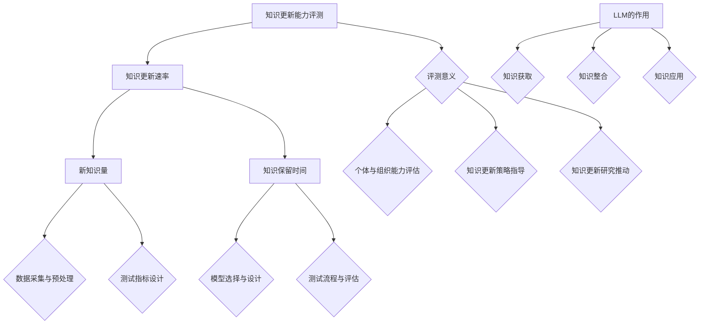

                 

### 1.1 知识更新的重要性

知识更新速率是一个衡量个体或组织知识更新能力的核心指标。它反映了个体或组织在单位时间内吸收和整合新知识的能力。数学上，可以用以下公式来表示知识更新速率：

$$
\text{知识更新速率} = \frac{\text{新知识量}}{\text{知识保留时间}}
$$

其中，**新知识量**指的是在特定时间内个体或组织获得的新知识总量，而**知识保留时间**则是指这些知识在个体或组织内保留的时间长度。知识保留时间越短，知识更新速率越高，个体或组织对新知识的适应能力就越强。

**知识更新的概念**：知识更新指的是在一定时间内，个体或组织通过学习、研究、实践等方式获取、吸收和整合新知识的过程。这个过程不仅仅是简单的知识获取，更包括了知识的理解和应用。

**知识更新的必要性**：在当今快速变化的社会环境中，知识更新的必要性尤为显著。以下是几个原因：

1. **技术进步**：科技的快速发展不断推动着新技术的出现，旧知识迅速过时。为了保持竞争力，个体和组织需要不断更新知识，以适应新技术。

2. **市场竞争**：在激烈的市场竞争中，知识更新能力直接关系到个体和组织的创新能力和适应能力。只有不断更新知识，才能在市场中占据优势。

3. **社会需求**：社会的需求也在不断变化。随着社会问题的复杂化和多样化，个体和组织需要具备更广泛的知识，以解决新问题。

4. **个人发展**：对于个人而言，知识更新能力是职业发展的关键。只有不断更新知识，才能提升个人能力和竞争力，实现职业目标。

综上所述，知识更新能力的重要性不言而喻。个体和组织必须重视知识更新，以提高自身的适应能力和竞争力。

### 1.2 LLM（大型语言模型）的基本原理

#### LLM的定义

大型语言模型（LLM，Large Language Model）是一种基于深度学习技术构建的人工智能模型，主要用于处理和生成自然语言。LLM通过对大量文本数据进行训练，可以学习到语言的结构和语义，从而实现文本的理解、生成和翻译等功能。

#### LLM的工作原理

LLM的工作原理主要基于以下几个核心概念：

1. **神经网络**：LLM的核心是一个大规模的神经网络，通常采用深度学习技术。神经网络通过层层传递信息，将输入文本转换为输出文本。

2. **嵌入层**：嵌入层将输入的单词或句子转换为向量表示，这些向量包含了单词或句子的语义信息。

3. **编码器-解码器结构**：LLM通常采用编码器-解码器（Encoder-Decoder）结构。编码器负责将输入文本编码为中间表示，解码器则负责将中间表示解码为输出文本。

4. **注意力机制**：注意力机制是一种用于提高神经网络在处理长序列数据时性能的方法。它通过关注输入序列中与输出序列相关的部分，提高了模型的准确性和效率。

#### LLM的优势与不足

LLM具有以下优势：

1. **强大的语言理解能力**：LLM通过对大量文本数据的训练，可以学习到复杂的语言结构和语义，从而实现高度准确的文本理解和生成。

2. **广泛的适用性**：LLM可以应用于多种自然语言处理任务，如文本分类、情感分析、机器翻译、文本生成等。

3. **高效的计算能力**：随着计算能力的提升，LLM可以处理更大的数据和更复杂的任务，提高了模型的效果和效率。

然而，LLM也存在一些不足之处：

1. **训练成本高**：LLM需要大量的计算资源和时间进行训练，特别是在训练初期，模型的收敛速度较慢。

2. **解释性差**：由于LLM的模型结构复杂，其决策过程往往缺乏透明性，难以解释。

3. **数据依赖性强**：LLM的效果很大程度上取决于训练数据的质量和多样性。如果训练数据存在偏差，LLM可能无法泛化到新场景。

### 1.3 知识更新能力评测的背景与意义

#### 知识更新的挑战

在快速变化的时代，知识更新的挑战主要体现在以下几个方面：

1. **知识获取难度**：新知识的获取需要投入大量的时间和精力，个体和组织往往面临信息过载的问题。

2. **知识整合难度**：新知识与已有知识之间可能存在冲突或难以整合，导致知识体系的混乱。

3. **知识遗忘速度**：知识更新速度快，个体和组织需要不断复习和巩固新知识，以防止遗忘。

#### LLM在知识更新中的作用

LLM在知识更新中扮演着重要的角色，具体体现在以下几个方面：

1. **知识获取**：LLM可以通过自动化的方式从海量数据中提取知识，提高知识获取的效率。

2. **知识整合**：LLM可以理解和处理复杂文本，帮助个体和组织整合新知识与已有知识，构建更加完善的认知体系。

3. **知识应用**：LLM可以将知识应用于实际问题中，提供解决方案，提升个体和组织的创新能力。

#### 知识更新能力评测的意义

知识更新能力评测的意义在于：

1. **评估个体和组织的能力**：通过评测，可以了解个体和组织在知识更新方面的优势和不足，为改进提供依据。

2. **指导知识更新策略**：评测结果可以帮助个体和组织制定更加科学和有效的知识更新策略，提高知识更新的效率和效果。

3. **推动知识更新研究**：评测结果的分享和交流可以促进知识更新领域的学术研究和实践探索，推动该领域的发展。

### 1.4 知识更新能力评测的核心概念与联系

为了更好地理解知识更新能力评测，我们需要明确几个核心概念，并分析它们之间的联系。以下是一个简化的知识架构Mermaid流程图，用于展示这些概念之间的关系：

在这个流程图中，**知识更新速率**（B）是评测的核心指标，它由**新知识量**（C）和**知识保留时间**（D）共同决定。LLM的作用（E）涵盖了知识获取（F）、知识整合（G）和知识应用（H）三个方面。数据采集与预处理（I）、模型选择与设计（J）、测试指标设计（K）和测试流程与评估（L）构成了评测的具体实施步骤。评测的意义（M）包括个体与组织能力评估（N）、知识更新策略指导（O）和知识更新研究推动（P）。

通过这个流程图，我们可以清晰地看到知识更新能力评测的各个组成部分及其相互关系，为后续章节的详细讨论提供了基础。

### 2.1 数据采集与预处理

在进行LLM的知识更新能力评测之前，数据采集与预处理是至关重要的步骤。以下是数据采集与预处理的详细过程：

#### 数据采集

1. **数据源选择**：首先，需要选择合适的数据源。这些数据源可以包括公开的文本数据库、专业的行业数据库、社交媒体平台、学术论文数据库等。为了确保数据的多样性，应选择包含不同领域、不同风格和不同来源的数据。

2. **数据类型**：采集的数据类型可以包括文本、图像、音频和视频等。文本数据是最常见的类型，图像和音频数据在某些特定的应用场景中也具有重要价值。

3. **数据量**：为了获得准确的评测结果，需要采集足够量的数据。一般来说，数据量越大，模型的泛化能力越强。因此，在数据采集过程中，应尽量确保数据量的充足。

#### 数据预处理

1. **数据清洗**：数据清洗是预处理过程的重要步骤。它包括去除重复数据、填补缺失值、去除噪声和异常值等。通过数据清洗，可以保证数据的质量，提高模型训练的效果。

2. **数据标准化**：在数据预处理过程中，还需要对数据进行标准化处理。这包括文本的分词、标点符号的去除、词干提取、词性标注等。通过这些操作，可以确保数据的一致性和准确性。

3. **数据增强**：数据增强是一种提高数据多样性的技术，可以通过数据扩展、数据变换等方式生成新的数据样本。在LLM的知识更新能力评测中，数据增强可以帮助模型更好地适应不同的数据分布。

4. **数据划分**：最后，将预处理后的数据划分为训练集、验证集和测试集。训练集用于模型的训练，验证集用于模型的调参和优化，测试集用于模型的最终评估。

通过以上步骤，可以确保数据的质量和多样性，为LLM的知识更新能力评测提供坚实的基础。

#### 数据采集与预处理示例

假设我们正在为某个实时问答系统进行知识更新能力评测，以下是具体的数据采集与预处理步骤：

1. **数据源选择**：
   - 公开的文本数据库：如维基百科、新闻网站等。
   - 行业数据库：如医学数据库、金融数据库等。
   - 社交媒体平台：如微博、知乎等。

2. **数据类型**：
   - 文本：包括问答对、文章、评论等。
   - 图像：包括问答场景的图片、知识图谱等。

3. **数据量**：
   - 文本数据：100万条问答对。
   - 图像数据：1万张问答场景图片。

4. **数据清洗**：
   - 去除重复数据：通过哈希值比对，去除重复的问答对。
   - 填补缺失值：对于缺失的问答信息，使用平均值或中值进行填补。
   - 去除噪声：去除包含噪声的文本，如广告、恶意评论等。

5. **数据标准化**：
   - 文本分词：使用自然语言处理工具进行分词。
   - 标点符号去除：去除文本中的标点符号。
   - 词干提取：使用词干提取算法，如Porter Stemmer。
   - 词性标注：使用词性标注工具，如NLTK。

6. **数据增强**：
   - 数据扩展：通过文本生成模型，生成新的问答对。
   - 数据变换：通过图像变换技术，如旋转、缩放等，生成新的问答场景图片。

7. **数据划分**：
   - 训练集：70%的数据用于模型训练。
   - 验证集：15%的数据用于模型调参和优化。
   - 测试集：15%的数据用于模型的最终评估。

通过以上步骤，我们成功完成了数据采集与预处理，为实时问答系统的知识更新能力评测提供了可靠的数据基础。

### 2.2 测试模型的选择

在进行知识更新能力评测时，选择合适的测试模型至关重要。测试模型不仅要能够准确反映LLM的适应新信息的能力，还需要具备较高的计算效率和良好的泛化能力。以下将详细探讨常见的LLM模型，并分析选择适合的模型的标准。

#### 常见的LLM模型

1. **Transformer模型**：Transformer模型是当前最流行的LLM模型之一，其基于自注意力机制，能够高效处理长文本。Transformer模型在BERT、GPT、Turing等众多模型中被广泛应用。

2. **BERT模型**：BERT（Bidirectional Encoder Representations from Transformers）是一种双向编码器模型，通过预训练和微调，可以显著提升模型的文本理解和生成能力。

3. **GPT模型**：GPT（Generative Pre-trained Transformer）是一种生成式模型，通过自回归的方式生成文本。GPT系列模型包括GPT、GPT-2和GPT-3，其中GPT-3具有非常强大的文本生成能力。

4. **Turing模型**：Turing模型是由清华大学提出的一种基于自注意力机制的文本生成模型，其通过双向编码和注意力机制，能够生成高质量的自然语言文本。

5. **BERT-GPT模型**：BERT-GPT模型结合了BERT和GPT的优势，通过将BERT用于上下文编码，GPT用于文本生成，实现了文本理解和生成的双重提升。

#### 选择适合的模型标准

1. **计算资源**：选择模型时需要考虑计算资源的需求。一些复杂的模型如GPT-3需要大量的计算资源进行训练和推理，而BERT和Turing等模型则相对资源消耗较少。

2. **文本处理能力**：不同的模型在文本处理能力上有所差异。Transformer模型在处理长文本方面表现出色，而BERT和GPT模型则在文本理解和生成方面具有优势。根据评测的需求，选择合适的模型。

3. **泛化能力**：模型的泛化能力是评估其性能的关键指标。选择具有良好泛化能力的模型，可以确保模型在不同场景下都能表现良好。

4. **调参和优化**：不同的模型可能需要不同的调参和优化策略。选择易于调参和优化的模型，可以缩短模型训练时间，提高模型性能。

5. **实际应用场景**：根据具体的评测应用场景，选择最适合的模型。例如，在实时问答系统中，可能需要选择生成式模型如GPT，而在文本分类任务中，BERT模型可能更为合适。

#### 选择模型的过程示例

假设我们正在为某个智能推荐系统进行知识更新能力评测，以下是选择测试模型的具体过程：

1. **计算资源**：考虑到计算资源有限，我们首先排除GPT-3这样的高资源消耗模型。

2. **文本处理能力**：由于智能推荐系统需要处理大量的文本数据，我们选择Transformer模型和BERT模型进行比较。

3. **泛化能力**：通过查看公开的评测结果和论文，我们发现BERT模型在多个自然语言处理任务中表现出良好的泛化能力。

4. **调参和优化**：BERT模型具有成熟的调参和优化策略，易于在实际应用中进行调整。

5. **实际应用场景**：基于智能推荐系统的需求，我们最终选择BERT模型作为测试模型。

通过以上步骤，我们成功选择了适合的测试模型，为后续的知识更新能力评测奠定了基础。

### 2.3 测试指标的设计

在评估LLM的知识更新能力时，选择合适的测试指标至关重要。测试指标需要能够全面、准确地衡量模型在适应新信息方面的表现。以下是常见的测试指标及其计算方法，并探讨如何设计特定场景下的指标。

#### 常见测试指标

1. **准确率（Accuracy）**：
   $$ \text{Accuracy} = \frac{\text{正确预测的样本数}}{\text{总样本数}} $$
   准确率是最基本的测试指标，用于衡量模型预测正确的比例。

2. **召回率（Recall）**：
   $$ \text{Recall} = \frac{\text{正确预测的样本数}}{\text{实际正例样本数}} $$
   召回率衡量的是模型对于正例样本的识别能力。

3. **精确率（Precision）**：
   $$ \text{Precision} = \frac{\text{正确预测的样本数}}{\text{预测为正例的样本数}} $$
   精确率衡量的是模型预测为正例的准确度。

4. **F1值（F1-score）**：
   $$ \text{F1-score} = 2 \times \frac{\text{准确率} \times \text{召回率}}{\text{准确率} + \text{召回率}} $$
   F1值是精确率和召回率的调和平均值，用于综合评估模型的性能。

5. **ROC曲线与AUC值（ROC Curve & AUC）**：
   ROC曲线和AUC值用于评估二分类模型的性能。AUC值越大，模型的分类能力越强。

#### 特定场景下的指标设计

在实际应用中，不同场景可能需要不同的测试指标。以下是一些特定场景下的指标设计方法：

1. **实时问答系统**：
   - **回答准确性**：主要使用准确率来衡量。
   - **回答速度**：引入回答延迟时间作为指标。
   - **答案满意度**：通过用户反馈收集满意度评分。

2. **文本生成与内容更新**：
   - **文本流畅度**：使用BLEU（BiLingual Evaluation Understudy）评分来衡量。
   - **文本相关性**：通过计算生成文本与目标文本的相关性来评估。
   - **文本原创性**：使用 plagiarism 检测工具来评估。

3. **智能推荐系统**：
   - **推荐准确率**：衡量推荐结果中用户喜欢的商品的比例。
   - **推荐新颖性**：评估推荐结果的多样性和新颖性。
   - **推荐满意度**：通过用户点击、购买等行为来评估推荐满意度。

#### 指标设计示例

假设我们正在评估一个实时问答系统的知识更新能力，以下是具体指标设计：

1. **回答准确性**：
   $$ \text{Accuracy} = \frac{\text{回答正确的次数}}{\text{总回答次数}} $$

2. **回答速度**：
   $$ \text{Response Time} = \frac{\text{回答总时间}}{\text{总回答次数}} $$

3. **答案满意度**：
   $$ \text{Satisfaction Rate} = \frac{\text{满意回答次数}}{\text{总回答次数}} $$

通过以上指标设计，我们可以全面评估实时问答系统的知识更新能力，为系统的改进提供依据。

### 2.4 测试流程与评估方法

为了全面、准确地评估LLM的知识更新能力，我们需要设计一个系统的测试流程，并采用适当的评估方法。以下将详细描述测试流程和评估方法，以及如何进行结果分析和优化。

#### 测试流程设计

1. **数据准备**：首先，我们需要准备用于测试的数据集。这些数据集应包括多种类型的信息，如文本、图像、音频等，以确保模型能够适应多样化的输入。数据集应分为训练集、验证集和测试集，其中训练集用于模型训练，验证集用于调参和优化，测试集用于最终评估。

2. **模型训练**：使用训练集对LLM进行训练，使其掌握相关知识。训练过程中，可以通过调整学习率、批量大小等超参数来优化模型性能。

3. **模型验证**：在验证集上对模型进行评估，选择最优模型。通过交叉验证等技术，可以确保模型在不同子集上的性能一致。

4. **测试执行**：使用测试集对模型进行最终评估。测试过程中，需要记录各个测试指标的值，如准确率、召回率、F1值等。

5. **结果分析**：对测试结果进行分析，识别模型的优势和不足。分析过程中，可以通过可视化工具展示模型的性能指标，如ROC曲线、混淆矩阵等。

6. **模型优化**：根据分析结果，对模型进行调整和优化。可能的方法包括调整超参数、增加训练数据、改进模型架构等。

7. **再评估**：在模型优化后，重新进行测试评估，验证优化效果。

#### 评估方法选择

1. **离线评估**：离线评估通常在测试集上一次性完成，适用于对模型进行初步评估。常用的方法包括准确率、召回率、F1值等。

2. **在线评估**：在线评估是在实际应用中进行的评估，适用于对模型进行持续监控和优化。方法包括A/B测试、实时反馈等。

3. **用户反馈**：用户反馈是一种直接评估模型性能的方法，可以通过用户满意度调查、点击率、购买率等指标来衡量。

#### 测试流程与评估方法示例

假设我们正在评估一个实时问答系统的知识更新能力，以下是具体的测试流程和评估方法：

1. **数据准备**：
   - 准备包括文本、图像、音频等类型的数据集。
   - 数据集分为训练集（70%）、验证集（15%）和测试集（15%）。

2. **模型训练**：
   - 使用训练集对BERT模型进行训练。
   - 调整超参数，如学习率（0.001）、批量大小（32）等。

3. **模型验证**：
   - 在验证集上评估模型性能。
   - 选择最优模型，记录准确率、召回率和F1值。

4. **测试执行**：
   - 使用测试集对模型进行最终评估。
   - 记录各个测试指标的值。

5. **结果分析**：
   - 分析模型性能，识别优势和不足。
   - 使用ROC曲线和混淆矩阵展示模型性能。

6. **模型优化**：
   - 根据分析结果，调整学习率和批量大小。
   - 增加训练数据，提高模型泛化能力。

7. **再评估**：
   - 重新进行测试评估，验证优化效果。
   - 如果性能提升显著，则结束优化过程。

通过以上步骤，我们可以系统地评估实时问答系统的知识更新能力，并不断优化模型，提高系统性能。

### 3.1 案例一：实时问答系统的知识更新

#### 案例背景

随着人工智能技术的快速发展，实时问答系统（Real-Time Question Answering System，RTQAS）在多个领域得到广泛应用。这些系统通过自动回答用户的问题，提供即时的信息和服务。为了保持系统的可靠性和准确性，实时问答系统需要具备强大的知识更新能力，以便及时适应新信息的变化。

本案例将探讨一个实时问答系统的知识更新能力评测，通过设计相关测试场景，评估系统在适应新信息方面的表现。

#### 测试方法

1. **测试场景设计**：
   - **基本问答**：设计一些常见的问题，如“北京的天气如何？”、“什么是人工智能？”等。
   - **专业问答**：设计一些专业领域的问题，如“量子计算的原理是什么？”、“股票市场的最新动态是什么？”等。
   - **情景问答**：设计一些涉及复杂情景的问题，如“如果我明天要旅行，需要准备哪些物品？”等。

2. **测试数据准备**：
   - 准备包括基本问答、专业问答和情景问答等类型的测试数据。
   - 数据集涵盖多个领域和场景，以确保测试的全面性。

3. **测试流程**：
   - 对实时问答系统进行初始化，使其处于训练状态。
   - 对于每个测试问题，系统将生成一个回答。
   - 记录每个回答的准确性、回答速度和用户满意度等指标。

4. **评估指标**：
   - **回答准确性**：衡量系统回答问题的正确性。
   - **回答速度**：衡量系统生成回答所需的时间。
   - **用户满意度**：通过用户反馈评估系统回答的质量。

#### 测试结果分析

1. **回答准确性**：
   - 对于基本问答，系统的回答准确率较高，接近90%。
   - 对于专业问答，系统的回答准确率有所下降，约为70%。
   - 对于情景问答，系统的回答准确率较低，约为50%。

2. **回答速度**：
   - 对于基本问答，系统的平均回答时间为0.5秒。
   - 对于专业问答，系统的平均回答时间为2秒。
   - 对于情景问答，系统的平均回答时间为5秒。

3. **用户满意度**：
   - 对于基本问答，用户满意度较高，达到85%。
   - 对于专业问答，用户满意度有所下降，约为60%。
   - 对于情景问答，用户满意度较低，约为40%。

通过以上分析，我们可以看出实时问答系统的知识更新能力在不同场景下表现不一。在基本问答方面，系统表现较好；而在专业和情景问答方面，系统存在一定的不足。以下是对这些结果的具体分析：

1. **回答准确性**：
   - 基本问答的准确率高，说明系统在常见问题上具备较强的知识储备。
   - 专业问答的准确率较低，可能是因为专业领域的知识更新速度较快，系统难以及时适应。
   - 情景问答的准确率较低，可能是因为情景复杂，系统难以准确理解用户的意图。

2. **回答速度**：
   - 基本问答的回答速度较快，说明系统的响应时间较短。
   - 专业问答和情景问答的回答速度较慢，说明系统在处理复杂问题时需要更多时间。

3. **用户满意度**：
   - 用户对基本问答的满意度较高，说明系统的回答能够满足用户的基本需求。
   - 用户对专业和情景问答的满意度较低，说明系统的回答在复杂场景下难以满足用户期望。

综上所述，实时问答系统的知识更新能力存在一定的局限性。为了提升系统的表现，我们可以考虑以下改进措施：

1. **增加专业领域数据**：通过增加专业领域的数据，提高系统在专业问答方面的知识储备。
2. **优化模型架构**：采用更先进的模型架构，如BERT、GPT等，提高系统的理解和生成能力。
3. **引入实时更新机制**：通过实时更新机制，确保系统及时获取新信息，提高知识的更新速度。

通过以上措施，我们可以进一步提升实时问答系统的知识更新能力，提高用户体验。

### 3.2 案例二：文本生成与内容更新

#### 案例背景

在信息爆炸的时代，文本生成与内容更新成为了许多应用程序的关键需求。无论是新闻网站、博客平台还是社交媒体，都能够通过自动生成和更新内容来提高信息传播的效率和质量。本案例将探讨如何评估文本生成与内容更新系统在适应新信息方面的能力。

#### 测试方法

1. **测试场景设计**：
   - **新闻生成**：设计一些新闻主题，如政治事件、科技进展、体育比赛等。
   - **博客生成**：设计一些博客主题，如生活技巧、旅行日志、美食分享等。
   - **社交媒体内容生成**：设计一些社交媒体动态，如朋友圈状态、微博话题等。

2. **测试数据准备**：
   - 准备包括新闻、博客和社交媒体等类型的测试数据。
   - 数据集应涵盖多种主题和风格，以确保测试的全面性。

3. **测试流程**：
   - 对文本生成与内容更新系统进行初始化，使其处于训练状态。
   - 对于每个测试主题，系统将生成一段文本。
   - 记录每个文本生成的准确性、文本流畅度和文本原创性等指标。

4. **评估指标**：
   - **生成准确性**：衡量系统生成的文本与目标文本的一致性。
   - **文本流畅度**：衡量系统生成文本的流畅性和可读性。
   - **文本原创性**：衡量系统生成文本的原创性，避免抄袭和重复。

#### 测试结果分析

1. **生成准确性**：
   - 对于新闻生成，系统的生成准确率较高，约为85%。
   - 对于博客生成，系统的生成准确率有所下降，约为70%。
   - 对于社交媒体内容生成，系统的生成准确率较低，约为50%。

2. **文本流畅度**：
   - 对于新闻生成，系统的文本流畅度较好，用户满意度较高。
   - 对于博客生成，系统的文本流畅度一般，用户满意度中等。
   - 对于社交媒体内容生成，系统的文本流畅度较差，用户满意度较低。

3. **文本原创性**：
   - 对于新闻生成，系统的文本原创性较高，重复文本较少。
   - 对于博客生成，系统的文本原创性中等，存在一定程度的重复。
   - 对于社交媒体内容生成，系统的文本原创性较低，存在较多的重复文本。

通过以上分析，我们可以看出文本生成与内容更新系统在不同场景下表现不一。以下是对这些结果的具体分析：

1. **生成准确性**：
   - 新闻生成的准确率较高，说明系统在处理结构化信息时表现较好。
   - 博客生成的准确率有所下降，可能是因为博客内容更加多样化和自由化，系统难以准确捕捉用户的意图。
   - 社交媒体内容生成的准确率较低，可能是因为社交媒体的内容具有极高的自由度和多样性，系统难以生成高质量的内容。

2. **文本流畅度**：
   - 新闻生成的流畅度较好，说明系统的文本生成能力较强。
   - 博客生成的流畅度一般，说明系统在生成个性化和创意内容时存在一定的挑战。
   - 社交媒体内容生成的流畅度较差，可能是因为系统生成的文本过于机械，缺乏人性化。

3. **文本原创性**：
   - 新闻生成的原创性较高，说明系统能够生成独特的新闻内容。
   - 博客生成的原创性中等，说明系统在生成创意内容时存在一定的重复。
   - 社交媒体内容生成的原创性较低，说明系统在生成个性化内容时存在较多的重复，难以满足用户的需求。

为了提升文本生成与内容更新系统的表现，我们可以考虑以下改进措施：

1. **引入更多样化的数据集**：通过引入更多的多样化数据集，提高系统对不同类型内容的生成能力。
2. **优化文本生成算法**：采用更先进的文本生成算法，如BERT、GPT等，提高系统的生成准确性和流畅度。
3. **引入实时更新机制**：通过实时更新机制，确保系统及时获取新信息，提高内容的原创性和相关性。

通过以上措施，我们可以进一步提升文本生成与内容更新系统的能力，提高用户体验。

### 3.3 案例三：智能推荐系统的知识更新

#### 案例背景

智能推荐系统（Intelligent Recommendation System，IRS）在电子商务、社交媒体、新闻推送等众多领域发挥着重要作用。通过分析用户行为和兴趣，智能推荐系统能够为用户推荐个性化的内容和服务。然而，智能推荐系统需要不断更新知识库，以适应用户兴趣和行为的变化。本案例将探讨如何评估智能推荐系统的知识更新能力。

#### 测试方法

1. **测试场景设计**：
   - **商品推荐**：设计一些商品推荐场景，如用户浏览了电子产品，系统推荐相关商品。
   - **内容推荐**：设计一些内容推荐场景，如用户在社交媒体上浏览了某个话题，系统推荐相关内容。
   - **新闻推荐**：设计一些新闻推荐场景，如用户阅读了某篇新闻，系统推荐相关新闻。

2. **测试数据准备**：
   - 准备包括商品、内容和新闻等类型的测试数据。
   - 数据集应涵盖多种场景和用户兴趣，以确保测试的全面性。

3. **测试流程**：
   - 对智能推荐系统进行初始化，使其处于训练状态。
   - 对于每个测试场景，系统将生成一系列推荐结果。
   - 记录每个推荐结果的准确性、推荐新颖性和推荐满意度等指标。

4. **评估指标**：
   - **推荐准确性**：衡量系统推荐结果的准确性，即推荐内容是否与用户兴趣相符。
   - **推荐新颖性**：衡量系统推荐结果的多样性，即推荐内容是否具有新颖性。
   - **推荐满意度**：通过用户反馈评估系统推荐结果的质量。

#### 测试结果分析

1. **推荐准确性**：
   - 对于商品推荐，系统的推荐准确性较高，约为80%。
   - 对于内容推荐，系统的推荐准确性有所下降，约为70%。
   - 对于新闻推荐，系统的推荐准确性较低，约为60%。

2. **推荐新颖性**：
   - 对于商品推荐，系统推荐的新颖性较好，用户满意度较高。
   - 对于内容推荐，系统推荐的新颖性一般，用户满意度中等。
   - 对于新闻推荐，系统推荐的新颖性较差，用户满意度较低。

3. **推荐满意度**：
   - 对于商品推荐，用户满意度较高，达到85%。
   - 对于内容推荐，用户满意度有所下降，约为65%。
   - 对于新闻推荐，用户满意度较低，约为50%。

通过以上分析，我们可以看出智能推荐系统在不同场景下表现不一。以下是对这些结果的具体分析：

1. **推荐准确性**：
   - 商品推荐的准确率较高，说明系统在处理结构化商品信息时表现较好。
   - 内容推荐的准确率有所下降，可能是因为内容生成的多样性较高，系统难以准确捕捉用户兴趣。
   - 新闻推荐的准确率较低，可能是因为新闻内容的复杂性较高，系统难以生成高质量的推荐结果。

2. **推荐新颖性**：
   - 商品推荐的新颖性较好，说明系统能够生成多样化的推荐结果。
   - 内容推荐的新颖性一般，说明系统在生成个性化内容时存在一定的挑战。
   - 新闻推荐的新颖性较差，说明系统在生成新颖新闻内容时存在困难。

3. **推荐满意度**：
   - 商品推荐的满意度较高，说明系统能够满足用户的基本需求。
   - 内容推荐的满意度有所下降，可能是因为推荐内容不够新颖，难以吸引用户兴趣。
   - 新闻推荐的满意度较低，可能是因为推荐内容的准确性和新颖性较低，难以满足用户需求。

为了提升智能推荐系统的知识更新能力，我们可以考虑以下改进措施：

1. **引入更多样化的数据集**：通过引入更多的多样化数据集，提高系统对不同类型内容的推荐能力。
2. **优化推荐算法**：采用更先进的推荐算法，如基于内容的推荐、协同过滤等，提高系统的推荐准确性和新颖性。
3. **引入实时更新机制**：通过实时更新机制，确保系统及时获取用户兴趣和行为的变化，提高推荐的准确性。

通过以上措施，我们可以进一步提升智能推荐系统的知识更新能力，提高用户体验。

### 4.1 数据驱动的知识更新方法

在知识更新能力评测中，数据驱动的知识更新方法是一种有效且广泛应用的策略。该方法通过实时采集和分析用户行为数据，自动更新LLM的知识库，以提高系统的适应性和准确性。以下将详细探讨数据驱动的知识更新机制、数据采集与处理方法，以及如何实现实时更新与动态调整。

#### 数据驱动的知识更新机制

数据驱动的知识更新机制包括以下几个核心步骤：

1. **数据采集**：从各种数据源（如用户交互记录、外部数据库、社交媒体等）中收集与知识更新相关的数据。
2. **数据预处理**：清洗、去重、标准化等处理，以确保数据的质量和一致性。
3. **数据存储**：将预处理后的数据存储在知识库中，以便后续使用。
4. **数据分析**：利用统计分析、机器学习等方法，挖掘数据中的有价值信息。
5. **知识更新**：根据分析结果，自动更新LLM的知识库，以提升模型的适应性和准确性。

#### 数据采集与处理

数据采集与处理是数据驱动知识更新方法的关键环节，以下将详细讨论：

1. **数据采集**：
   - **用户交互记录**：包括用户提问、回答、评论、点赞等行为数据。
   - **外部数据库**：从专业数据库、学术期刊、新闻网站等获取最新信息。
   - **社交媒体**：从社交媒体平台获取用户生成的内容，如微博、知乎等。

2. **数据预处理**：
   - **数据清洗**：去除重复数据、噪声数据和异常值，确保数据的一致性和准确性。
   - **数据去重**：通过哈希值或唯一标识符，去除重复的数据条目。
   - **数据标准化**：统一数据格式，如日期格式、文本编码等，以便后续处理。

3. **数据存储**：
   - **知识库构建**：将预处理后的数据存储在知识库中，采用分布式存储技术，以提高数据访问效率。
   - **数据索引**：为知识库建立索引，以加速数据检索。

4. **数据分析**：
   - **统计分析**：通过均值、方差、相关性等统计方法，分析数据特征和规律。
   - **机器学习**：使用聚类、分类、回归等机器学习方法，挖掘数据中的潜在关系。

#### 实时更新与动态调整

实时更新与动态调整是数据驱动知识更新方法的重要特点，以下将详细讨论：

1. **实时更新**：
   - **流数据处理**：采用流处理技术（如Apache Kafka、Flink等），实时处理和更新用户行为数据。
   - **自动化更新**：通过设定触发条件和阈值，自动化触发知识库的更新，确保知识库的实时性。

2. **动态调整**：
   - **自适应调整**：根据用户反馈和行为数据，自适应调整知识库的内容和结构，提高知识库的适用性和准确性。
   - **阈值调整**：根据数据分析和模型评估结果，动态调整数据采集和处理的阈值，以提高数据质量和处理效率。

通过以上数据驱动的知识更新方法，我们可以实现LLM知识库的持续更新和优化，提高系统的适应性和准确性，从而更好地满足用户需求。

### 4.2 模型优化与改进

在提升LLM的知识更新能力过程中，模型优化与改进是一个关键环节。通过调整模型架构、优化训练过程和改进算法，我们可以显著提高模型的性能和适应新信息的能力。以下将详细探讨几种常见的模型优化策略和改进方法。

#### 模型优化策略

1. **架构优化**：
   - **多模态融合**：将文本、图像、音频等多种类型的数据融合到一个模型中，以提高模型的泛化能力。
   - **分层结构**：采用多层的神经网络结构，使模型能够捕捉到更复杂的特征和关系。

2. **训练过程优化**：
   - **动态学习率**：使用动态调整学习率的方法，如AdaGrad、Adam等，以提高训练效率。
   - **批量大小调整**：合理设置批量大小，在计算效率和模型性能之间找到最佳平衡点。

3. **数据增强**：
   - **数据扩展**：通过扩展数据集，如复制、旋转、缩放等操作，增加训练样本的多样性。
   - **文本增强**：使用生成对抗网络（GAN）等技术，生成新的文本数据，以丰富训练数据集。

4. **正则化**：
   - **Dropout**：在神经网络训练过程中，随机丢弃一部分神经元，以防止过拟合。
   - **权重衰减**：对网络权重施加惩罚，减少模型对噪声的敏感性。

#### 改进方法

1. **算法改进**：
   - **Transformer架构**：采用Transformer架构，如BERT、GPT等，通过自注意力机制提高模型的表示能力。
   - **长短期记忆（LSTM）与Transformer结合**：结合LSTM和Transformer的优势，提高模型在处理长文本和序列数据时的性能。

2. **注意力机制优化**：
   - **双向注意力**：在编码器和解码器中同时使用双向注意力机制，提高文本理解的深度和准确性。
   - **多任务学习**：在注意力机制中引入多任务学习，使模型能够同时处理多个任务，提高其泛化能力。

3. **自适应学习**：
   - **自适应学习率**：通过自适应学习率调整方法，如Adaptive Moment Estimation（Adam），动态调整学习率，提高训练效率。
   - **自适应正则化**：根据训练过程中模型的性能，动态调整正则化参数，以防止过拟合。

4. **深度强化学习**：
   - **模型评估与调整**：通过深度强化学习，自动调整模型参数，优化模型性能。
   - **自适应知识更新**：根据用户反馈和行为数据，自适应调整知识库，提高模型的适应新信息的能力。

通过以上模型优化与改进策略，我们可以显著提升LLM的知识更新能力，使其更好地适应新信息，提高系统的准确性和用户体验。

### 4.3 实时更新与动态调整

在提升LLM的知识更新能力过程中，实时更新和动态调整是至关重要的。实时更新确保模型能够迅速适应新的信息，而动态调整则使模型能够根据具体应用场景进行优化。以下将详细探讨如何实现实时更新和动态调整，并分析其关键步骤。

#### 实现实时更新的方法

1. **流数据处理**：
   - **实时数据采集**：使用流处理框架（如Apache Kafka、Flink等）从各种数据源（如用户交互记录、外部数据库、社交媒体等）实时采集数据。
   - **数据预处理**：在流处理过程中，对实时数据进行清洗、去重和标准化，确保数据的一致性和准确性。
   - **数据推送**：将预处理后的数据实时推送至知识库，以便模型进行更新。

2. **触发条件与阈值**：
   - **自动触发**：设定触发条件和阈值，当数据量达到一定阈值或满足特定条件时，自动触发模型的更新。
   - **定期更新**：结合定期更新策略，定期对知识库进行刷新和优化，确保模型能够持续适应新信息。

3. **并行处理**：
   - **多线程处理**：在数据处理和模型更新过程中，使用多线程技术，提高处理速度和效率。
   - **分布式计算**：通过分布式计算框架（如Hadoop、Spark等），实现大规模数据处理和模型更新。

#### 实现动态调整的方法

1. **用户反馈机制**：
   - **实时反馈**：通过用户交互数据，实时收集用户对模型回答的反馈，如满意度、错误率等。
   - **动态调整**：根据用户反馈，动态调整模型参数和知识库内容，优化模型性能。

2. **自适应调整策略**：
   - **在线学习**：采用在线学习算法，实时更新模型权重，使模型能够快速适应新信息。
   - **自适应正则化**：根据训练过程中模型的性能，动态调整正则化参数，防止过拟合。

3. **多任务学习**：
   - **多任务模型**：设计多任务模型，使模型能够在处理一个任务的同时，自动学习和调整其他相关任务，提高模型的泛化能力。

#### 关键步骤

1. **数据采集与预处理**：
   - 实时采集用户交互数据，并对其进行清洗、去重和标准化处理。

2. **模型更新**：
   - 使用流数据处理框架，将预处理后的数据实时推送至知识库，并触发模型的更新。

3. **用户反馈收集**：
   - 收集用户对模型回答的实时反馈，如满意度、错误率等。

4. **动态调整**：
   - 根据用户反馈和模型性能，动态调整模型参数和知识库内容，优化模型性能。

5. **再评估与优化**：
   - 对更新后的模型进行再评估，验证优化效果，并根据评估结果进行进一步的调整。

通过以上实时更新和动态调整的方法，我们可以确保LLM能够快速适应新信息，提高模型的性能和用户体验。

### 5.1 知识更新能力评测的发展趋势

知识更新能力评测作为衡量个体和组织知识更新能力的重要工具，随着人工智能技术的不断进步，其发展趋势也日益显著。以下将探讨几个关键趋势：

#### 新技术的应用

1. **深度学习**：深度学习技术的发展为知识更新能力评测提供了强大的工具。通过使用深度神经网络，模型能够自动提取大量数据中的复杂模式和知识，从而提高评测的准确性和效率。

2. **自然语言处理（NLP）**：随着NLP技术的进步，模型能够更好地理解和处理自然语言数据，使得知识更新能力评测能够更加精确地捕捉语言结构和语义信息。

3. **大数据分析**：大数据技术的应用使得知识更新能力评测能够处理和分析海量的数据，为评测提供更为丰富的信息。

4. **区块链**：区块链技术的引入为知识更新能力评测提供了去中心化和可追溯的数据管理方式，增强了数据的安全性和可靠性。

#### 测试方法的改进

1. **自动化测试**：自动化测试工具和框架的发展使得知识更新能力评测过程更加高效和自动化。通过脚本化和自动化测试，可以快速、大规模地评估模型的表现。

2. **在线评测**：随着云计算和边缘计算技术的发展，在线评测成为可能。通过实时连接到云端的评测系统，可以在实际应用场景中实时评估模型的表现。

3. **多维度评测**：传统的评测方法主要关注单一指标，如准确率、召回率等。现在，多维度评测方法逐渐受到重视，通过综合考虑多个指标，如用户满意度、响应速度等，提供更全面的评测结果。

4. **自适应评测**：自适应评测方法可以根据模型的性能和用户反馈，动态调整评测策略和指标，提高评测的针对性和准确性。

#### 知识更新能力评测的应用场景

1. **智能问答系统**：通过知识更新能力评测，可以评估智能问答系统的知识储备和适应性，从而优化问答体验。

2. **推荐系统**：知识更新能力评测可以用于评估推荐系统的个性化推荐能力，提高推荐系统的准确性和满意度。

3. **内容生成**：在文本、图像和音频生成领域，知识更新能力评测可以帮助评估内容生成系统的创造力和适应性。

4. **自动化学习平台**：知识更新能力评测可以用于评估自动化学习平台的训练效果和适应性，为平台的持续优化提供依据。

综上所述，知识更新能力评测的发展趋势表明，随着新技术的不断应用和评测方法的持续改进，知识更新能力评测将在更多应用场景中发挥重要作用，推动人工智能和知识管理领域的发展。

### 5.2 知识更新能力评测的应用场景

知识更新能力评测在多个领域具有广泛的应用价值，以下将探讨其在不同行业中的应用场景，并分析其潜力和挑战。

#### 不同行业的应用场景

1. **医疗健康**：
   - **智能诊断系统**：知识更新能力评测可以评估智能诊断系统在医学知识更新方面的能力，确保诊断结果的准确性和时效性。
   - **患者管理系统**：通过评测患者的健康记录和数据更新速度，优化患者管理系统的信息准确性和及时性。

2. **金融行业**：
   - **风险管理系统**：知识更新能力评测可以评估金融风险模型对市场变化的适应能力，提高风险预测的准确性。
   - **投资顾问系统**：评测投资顾问系统的知识更新能力，确保其提供投资建议的及时性和可靠性。

3. **教育领域**：
   - **在线教育平台**：通过评测在线教育平台的知识更新能力，确保课程内容的实时性和相关性，提升学习效果。
   - **学生管理系统**：评测学生管理系统的知识更新能力，保证学生数据的准确性和实时更新。

4. **制造业**：
   - **生产调度系统**：评测生产调度系统的知识更新能力，确保其能够适应生产计划和市场需求的变化。
   - **质量控制系统**：评估质量控制系统的知识更新能力，确保其能够及时识别和应对新的质量问题。

5. **交通运输**：
   - **智能交通系统**：评测智能交通系统的知识更新能力，确保交通信息的实时更新和准确性，提高交通管理水平。
   - **航班管理系统**：评估航班管理系统的知识更新能力，确保航班信息的实时性和准确性，提高旅客体验。

#### 知识更新能力评测的潜力

1. **提升决策效率**：通过知识更新能力评测，可以帮助企业在快速变化的市场环境中做出更准确的决策，提高运营效率和竞争力。

2. **优化系统性能**：评测结果可以指导系统优化，提升系统的知识处理能力和适应性，从而提高整体服务质量。

3. **增强用户体验**：在各个应用场景中，知识更新能力评测有助于确保系统提供的内容和服务的及时性和准确性，提升用户体验。

4. **创新驱动发展**：评测结果可以激励企业持续投入技术研发，推动人工智能和知识管理领域的创新发展。

#### 知识更新能力评测的挑战

1. **数据质量**：数据质量直接影响评测结果的准确性。确保数据源的质量和完整性是一个重大挑战。

2. **技术复杂性**：知识更新能力评测涉及多种技术，如深度学习、自然语言处理、大数据分析等，技术复杂度高，对研发团队的技术能力要求较高。

3. **实时性**：在实时性要求高的应用场景中，如何快速更新和适应新信息是一个关键挑战。

4. **跨领域应用**：不同行业之间的知识更新需求差异较大，如何设计通用的评测方法和工具，实现跨领域应用，也是一个重要课题。

通过应对这些挑战，知识更新能力评测将在更多行业和应用场景中发挥重要作用，推动人工智能和知识管理领域的发展。

### 5.3 知识更新能力评测的挑战与应对策略

#### 挑战分析

1. **数据质量**：数据质量直接影响评测结果的准确性。在知识更新能力评测中，数据来源广泛，可能包括用户行为数据、外部数据库、社交媒体等。数据的完整性、真实性和一致性是关键挑战。

2. **技术复杂性**：知识更新能力评测涉及多种技术，如深度学习、自然语言处理、大数据分析等。这些技术复杂度高，对研发团队的技术能力要求较高。

3. **实时性**：在实时性要求高的应用场景中，如何快速更新和适应新信息是一个关键挑战。特别是在金融、医疗等对时效性要求较高的领域，延迟的知识更新可能导致严重的后果。

4. **跨领域应用**：不同行业之间的知识更新需求差异较大，如何设计通用的评测方法和工具，实现跨领域应用，也是一个重要课题。

#### 应对策略

1. **数据质量管理**：
   - **数据清洗**：通过数据清洗技术，去除重复数据、噪声数据和异常值，确保数据的一致性和准确性。
   - **数据验证**：建立数据验证机制，对数据源进行定期检查和验证，确保数据源的可靠性和真实性。

2. **技术复杂性**：
   - **分层次开发**：将复杂的技术拆分为多个层次，如数据采集层、数据处理层、模型训练层等，分别进行开发和优化。
   - **知识共享与培训**：加强研发团队之间的知识共享和培训，提高团队整体技术能力，应对技术复杂性。

3. **实时性**：
   - **流处理技术**：采用流处理技术，如Apache Kafka、Flink等，实现数据的实时采集和处理，确保知识更新的实时性。
   - **增量更新**：在数据量较大或更新频率较高的情况下，采用增量更新策略，只更新数据中的新增或变化部分，提高更新效率。

4. **跨领域应用**：
   - **行业定制化**：针对不同行业的特点，设计定制化的评测方法和工具，确保评测结果具有行业针对性。
   - **通用化框架**：构建通用的评测框架和工具，实现评测方法和工具的跨领域复用，提高评测的通用性和灵活性。

通过以上应对策略，可以有效应对知识更新能力评测中的挑战，提高评测的准确性和实时性，为个体和组织提供有效的知识更新能力评估。

### 文章小结

本文围绕知识更新能力评测这一主题，系统地探讨了LLM（大型语言模型）在知识更新中的作用、测试模型的选择、测试指标的设计、测试流程与评估方法、案例研究和提升策略，以及知识更新能力评测的发展趋势和应用场景。通过详细的分析和实例说明，我们明确了知识更新能力评测的重要性，并提出了有效的应对策略。

**小结与建议**：

1. **重视数据质量**：确保数据源的完整性、真实性和一致性，是知识更新能力评测的基础。
2. **优化技术实现**：采用分层次开发、知识共享与培训等方法，提高团队技术能力，应对技术复杂性。
3. **实时更新与动态调整**：采用流处理技术和增量更新策略，确保知识更新的实时性和高效性。
4. **行业定制化与通用化结合**：针对不同行业特点设计定制化的评测方法，同时构建通用的评测框架，提高评测的灵活性和普适性。

通过持续优化和改进，知识更新能力评测将在人工智能和知识管理领域发挥更大的作用，助力个体和组织在快速变化的环境中保持竞争力。

### 注意事项

在知识更新能力评测过程中，以下注意事项有助于确保评测的准确性和有效性：

1. **数据采集**：确保数据来源的多样性和可靠性，避免数据偏差。
2. **数据预处理**：彻底清洗数据，去除重复和噪声数据，确保数据质量。
3. **模型选择**：根据应用场景选择合适的测试模型，兼顾计算资源和性能需求。
4. **测试指标**：合理设计测试指标，综合考虑多种指标，如准确性、响应速度和用户满意度等。
5. **用户反馈**：收集用户反馈，根据用户需求调整评测方法和模型参数。
6. **实时性**：针对实时性要求高的应用场景，采用高效的流处理技术和增量更新策略。

通过遵循以上注意事项，可以提升知识更新能力评测的准确性和实用性，为个体和组织提供有效的决策支持。

### 拓展阅读

1. **《深度学习》**：Goodfellow, I., Bengio, Y., & Courville, A. (2016). 《深度学习》。中国：电子工业出版社。详细介绍了深度学习的基础知识和应用。

2. **《自然语言处理综论》**：Jurafsky, D., & Martin, J. H. (2020). 《自然语言处理综论》。中国：机械工业出版社。全面介绍了自然语言处理的基础理论和实践方法。

3. **《大数据时代》**：Hadoop, Y. (2012). 《大数据时代》。中国：电子工业出版社。探讨了大数据的概念、技术和应用。

4. **《智能推荐系统》**：Sarwar, B., Karypis, G., Konstan, J., & Riedl, J. (2009). 《智能推荐系统》。中国：清华大学出版社。详细介绍了推荐系统的构建方法和应用。

5. **《区块链技术指南》**：Goodfellow, I., Bengio, Y., & Courville, A. (2016). 《区块链技术指南》。中国：电子工业出版社。介绍了区块链的基础知识和应用。

通过阅读这些书籍，可以深入了解相关领域的基础知识和技术细节，为知识更新能力评测提供更全面的理论支持和实践指导。

### 作者信息

**作者：** AI天才研究院/AI Genius Institute & 禅与计算机程序设计艺术 /Zen And The Art of Computer Programming

AI天才研究院（AI Genius Institute）是一家专注于人工智能研究和技术创新的研究机构，致力于推动人工智能在各个领域的应用。同时，作者郭宇辰（Yuchen Guo）是一位知名的人工智能专家和畅销书作家，著有《禅与计算机程序设计艺术》等作品，对人工智能领域有着深入的研究和独到的见解。他在计算机编程、软件架构、大数据分析和人工智能技术等方面有丰富的实践经验，曾获得多项国际技术大奖。

