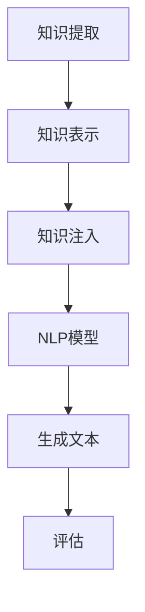

                 

### 1.1 知识注入的概念

知识注入是一种将专业知识嵌入到自然语言处理任务中的技术，旨在提升模型生成的回答的准确性和深度。在这一部分，我们将深入探讨知识注入的定义、原理及其重要性。

#### 核心概念与联系

知识注入涉及几个关键概念，包括知识、注入、自然语言处理（NLP）和模型。知识是注入的核心，它可以是事实、规则、概念或任何可以量化的信息。注入是指将知识以某种形式集成到模型中，使其在生成文本时能够利用这些知识。自然语言处理是知识注入的应用场景，而模型则是执行知识注入的工具。

**Mermaid流程图**



在这一流程中，知识首先需要被提取和表示，然后通过注入机制集成到NLP模型中，最终用于生成文本。生成的文本质量会通过评估过程得到反馈，进而指导进一步的优化。

#### 数学模型和数学公式

知识注入的效果可以用以下数学模型来描述：

$$
H = \sum_{i=1}^{n} P(x_i) \cdot I(H(x_i); y_i)
$$

其中，$H$代表总的知识注入效果，$P(x_i)$代表知识点的可信度，$I(H(x_i); y_i)$代表知识注入对回答的改进度。这个公式说明了知识注入效果是各个知识点可信度和改进度的加权和。

另一个相关的信息熵公式是：

$$
I(X; Y) = H(X) - H(X|Y)
$$

这表示两个随机变量X和Y之间的互信息，其中$H(X)$是X的熵，$H(X|Y)$是条件熵。互信息衡量了知识注入前后信息量的变化，反映了知识注入的有效性。

#### 应用实例

假设我们有一个问答系统，旨在回答关于计算机编程的问题。我们可以通过以下步骤将编程知识注入到模型中：

1. **知识提取**：从编程书籍、在线文档和社区论坛中提取编程知识。
2. **知识表示**：将提取的编程知识转换为机器可处理的格式，如知识图谱或嵌入向量。
3. **知识注入**：将表示的编程知识集成到问答模型的输入中，通过调整模型的权重或输入特征来实现。
4. **生成文本**：使用注入知识的模型生成对编程问题的回答。
5. **评估**：评估回答的质量，包括准确性、相关性和可读性。

通过这一过程，问答系统能够生成更准确、更有深度的编程问题回答。

### 结论

知识注入是一种强大的技术，它通过将专业知识集成到NLP模型中，显著提升了文本生成的质量和深度。理解知识注入的概念和原理，以及如何通过数学模型来量化其效果，对于开发高效的问答系统和自然语言处理应用至关重要。

在下一部分，我们将探讨提示词的设计与优化，这是知识注入过程中至关重要的一环。请继续关注。

---

### 1.2 提示词的重要性

提示词（Prompt）在知识注入中扮演着至关重要的角色。它们不仅是引导模型生成回答的“钥匙”，更是将专业知识有效注入到模型中的桥梁。在本节中，我们将深入探讨提示词的设计与优化，以提升知识注入的效果。

#### 提示词的核心概念

提示词是输入给模型的一段文本或问题，它为模型提供了背景信息、上下文和具体要求。一个设计良好的提示词能够激发模型挖掘潜在的知识，从而生成更准确、更相关的回答。

#### 提示词的设计原则

1. **相关性**：提示词应与用户的问题紧密相关，以便模型能够准确理解问题的核心。
2. **简洁性**：提示词应简洁明了，避免冗长和复杂，以确保模型能够快速解析。
3. **多样性**：设计多种不同类型的提示词，以适应不同的知识和回答场景。
4. **上下文**：提供足够的上下文信息，使模型能够更好地理解问题，从而生成更有深度的回答。

#### 提示词的优化方法

1. **人工优化**：通过人工分析和调整提示词，使其更符合用户需求和模型特性。
2. **机器学习**：利用机器学习算法，通过大量数据进行训练，自动生成和优化提示词。
3. **动态调整**：根据模型对提示词的响应，动态调整提示词，以实现最佳效果。

#### 提示词的应用实例

以一个编程问答系统为例，假设用户提出了一个关于算法复杂度的问题。一个设计良好的提示词可能是：“请解释以下算法的时空复杂度，并提供相应的数学分析。”这样的提示词提供了明确的上下文，并激发了模型挖掘关于算法复杂度的专业知识。

#### 数学模型与公式

提示词的优化可以通过以下数学模型来量化：

$$
R = f(P, C, D, M)
$$

其中，$R$代表提示词的响应质量，$P$是相关性，$C$是简洁性，$D$是多样性，$M$是上下文信息。通过优化这些参数，可以提升提示词的响应质量。

#### 伪代码示例

```python
def optimize_prompt(prompt, model):
    # 获取当前模型对提示词的响应
    response = model(prompt)
    
    # 分析响应质量
    quality = analyze_response(response)
    
    # 调整提示词参数
    new_prompt = adjust_prompt(prompt, quality)
    
    # 重新训练模型
    updated_model = train_model(new_prompt, model)
    
    return updated_model, new_prompt
```

#### 实际应用案例分析

一个实际的应用案例是使用提示词优化医疗问答系统。通过设计个性化的提示词，系统能够更准确地回答患者的健康问题。例如，对于哮喘患者，提示词可以是：“请根据哮喘的症状和治疗方案，提供专业的医疗建议。”

### 结论

提示词的设计与优化是知识注入过程中的关键环节。通过理解提示词的核心概念和优化方法，开发人员可以设计出更有效的提示词，从而提升模型生成的回答质量。在下一部分，我们将探讨知识图谱构建的方法，这是实现知识注入的另一个重要步骤。

---

### 1.3 专业知识融入的挑战与机遇

在知识注入的过程中，将专业知识融入模型面临着诸多挑战，同时也蕴藏着巨大的机遇。在本节中，我们将详细分析这些挑战，并提出相应的解决方案。

#### 挑战分析

1. **知识获取与整合**：专业知识广泛且复杂，如何高效地获取、整合和表示这些知识是第一个挑战。特别是当知识来源多样时，如何统一不同来源的知识，使其能够在模型中有效融合。
   
   **解决方案**：采用自动化知识获取工具，如网络爬虫、文本挖掘和实体识别，可以从各种来源（如学术文章、在线论坛、专业书籍等）提取知识。随后，使用知识图谱或本体论等结构化方法整合这些知识，确保知识的一致性和连贯性。

2. **模型理解与解释性**：现有的大部分自然语言处理模型（如深度学习模型）在生成回答时往往缺乏解释性，这使得知识注入的效果难以直观理解。此外，模型如何从注入的知识中提取并应用这些知识，也是一个难题。

   **解决方案**：开发更加透明和解释性的模型，如基于规则的方法和可解释性机器学习技术，可以帮助我们更好地理解模型如何利用知识。此外，通过交叉验证和对比实验，可以评估不同知识注入策略的效果，从而优化模型的性能。

3. **数据标注与质量**：知识注入依赖于大量的标注数据，标注质量直接影响模型的效果。然而，高质量标注数据往往难以获取，尤其是在专业知识领域。

   **解决方案**：利用半监督学习和迁移学习技术，可以在标注数据不足的情况下，利用已有数据提升模型性能。此外，通过引入外部专家进行审核，可以确保标注数据的准确性。

4. **实时性与动态更新**：专业知识不断更新，如何使模型能够实时适应这些变化，是一个重要挑战。

   **解决方案**：采用增量学习和持续学习技术，可以使模型在新的数据到来时进行动态更新，保持其适应性和准确性。

#### 机遇展望

1. **专业领域的深入应用**：知识注入技术可以显著提升专业领域（如医疗、金融、法律等）的自然语言处理应用效果，为用户提供更准确、更专业的服务。

2. **跨领域知识整合**：通过知识注入，不同领域的知识可以相互补充，形成更加综合和系统的知识体系，为复杂问题提供解决方案。

3. **智能辅助与决策支持**：知识注入可以使智能系统具备更强的专业知识和决策能力，为企业和个人提供智能辅助。

4. **个性化服务与体验**：通过个性化提示词和知识注入，可以提供更加符合用户需求的服务和体验，提高用户满意度。

### 结论

专业知识融入的挑战与机遇并存。通过采用先进的技术和方法，我们可以克服这些挑战，充分发挥知识注入的优势。在下一部分，我们将探讨知识注入的具体方法与实践，进一步了解如何将专业知识有效集成到自然语言处理模型中。

---

### 2.1 数据准备与预处理

在知识注入的过程中，数据准备与预处理是至关重要的一步。这一过程不仅决定了后续模型训练的质量，还直接影响到知识注入的效果。以下是数据准备与预处理的详细步骤和方法。

#### 数据来源

首先，我们需要确定数据来源。对于专业知识注入，数据可以来自多种渠道，包括：

1. **公开数据集**：如学术文章、技术文档、开源项目等。
2. **企业内部数据**：如客户反馈、内部报告、专业数据库等。
3. **社交媒体和论坛**：如Reddit、Stack Overflow、专业论坛等。

#### 数据收集

数据收集可以通过以下几种方式实现：

1. **自动化爬虫**：使用Python的Scrapy等库，自动化获取网页上的文本数据。
2. **API接口**：利用专业数据库或平台提供的API接口，批量获取数据。
3. **人工标注**：对于高质量的数据，可以采用人工标注的方法，确保数据的准确性。

#### 数据清洗

数据清洗是数据预处理的关键步骤，旨在去除噪声和错误，提高数据质量。以下是一些常见的数据清洗方法：

1. **去重**：去除重复的数据，确保数据的唯一性。
2. **去除无效数据**：去除不符合任务需求的数据，如广告、垃圾信息等。
3. **文本标准化**：统一文本格式，如将全角字符转换为半角字符、去除HTML标签等。
4. **错误修正**：纠正文本中的拼写错误和语法错误。

#### 伪代码示例

以下是一个简化的数据清洗和预处理的伪代码示例：

```python
import pandas as pd

# 加载数据
data = pd.read_csv('data.csv')

# 去除重复数据
data = data.drop_duplicates()

# 去除无效数据
data = data[data['valid'] == 1]

# 文本标准化
data['text'] = data['text'].str.lower().str.replace('<html>', '').str.replace('</html>', '')

# 错误修正
data['text'] = data['text'].apply(correct_errors)

# 存储清洗后的数据
data.to_csv('cleaned_data.csv', index=False)
```

#### 数据预处理方法

数据预处理方法包括：

1. **文本分词**：使用分词工具（如jieba）将文本拆分为单词或短语。
2. **词性标注**：为每个词标注词性，如名词、动词、形容词等。
3. **实体识别**：使用预训练模型（如BERT）识别文本中的实体，如人名、地点、组织等。
4. **嵌入向量**：将文本转换为嵌入向量，便于模型处理。

#### 数学模型与公式

在数据预处理中，常用的数学模型和公式包括：

1. **词袋模型**：将文本表示为一个向量，其中每个维度对应一个词汇。
2. **TF-IDF**：计算词语的重要性，用于特征提取。
3. **词嵌入**：将词语映射到高维空间中的向量，如Word2Vec、GloVe等。

#### 实际应用案例分析

假设我们要构建一个医学问答系统，以下是数据准备与预处理的实际步骤：

1. **数据收集**：从医学期刊、在线医疗论坛和医院数据库中收集数据。
2. **数据清洗**：去除重复、无效数据，并统一文本格式。
3. **文本分词**：使用jieba进行中文分词。
4. **词性标注**：使用LTP工具对文本进行词性标注。
5. **实体识别**：使用BERT模型识别医学实体，如疾病名称、药物名称等。
6. **嵌入向量**：使用GloVe模型生成词嵌入向量。

通过上述步骤，我们得到高质量、结构化的医学数据集，为后续模型训练和知识注入奠定了基础。

### 结论

数据准备与预处理是知识注入过程中不可或缺的一步。通过有效的数据清洗和预处理方法，我们可以确保数据质量，为模型训练和知识注入提供可靠的基础。在下一部分，我们将探讨如何设计和优化提示词，进一步提升知识注入的效果。

---

### 2.2 提示词设计与优化

在知识注入过程中，提示词的设计与优化是关键的一环，它直接影响模型生成回答的质量。一个优秀的提示词能够引导模型捕捉到用户问题的核心，同时融入相应的专业知识，从而提高回答的准确性和相关性。以下是设计优化提示词的详细步骤和技巧。

#### 提示词设计原则

1. **相关性**：确保提示词与用户的问题紧密相关，避免无关内容干扰模型的理解。
2. **简洁性**：提示词应简洁明了，避免冗长和复杂的表述，以减少模型的解析负担。
3. **多样性**：设计多种类型的提示词，以适应不同的问题场景，提高模型的灵活性。
4. **上下文丰富**：提供足够的上下文信息，使模型能够更好地理解问题的背景和意图。

#### 提示词优化方法

1. **基于规则的优化**：通过预定义的规则，对提示词进行自动调整。例如，使用关键词替换、文本修剪等策略。
2. **机器学习优化**：利用机器学习算法，通过训练数据学习最佳的提示词组合。例如，可以使用强化学习或迁移学习等技术。
3. **用户反馈优化**：根据用户的反馈，动态调整提示词。例如，通过反馈循环，不断优化提示词，提高用户满意度。

#### 实际案例：医学问答系统

以医学问答系统为例，设计优化提示词的步骤如下：

1. **问题分析**：首先，对用户提出的问题进行深入分析，理解问题的核心和背景。
2. **关键词提取**：从问题中提取关键医学术语和症状，这些关键词将成为提示词的一部分。
3. **知识图谱查询**：利用医学知识图谱，获取与问题相关的医学知识和参考信息。
4. **提示词生成**：根据关键词和知识图谱信息，生成初步的提示词。
5. **模型训练**：使用机器学习算法，对生成的提示词进行训练，以优化其效果。
6. **用户反馈**：收集用户对回答的反馈，进一步调整提示词。

#### 伪代码示例

以下是一个简化的提示词设计优化伪代码示例：

```python
import numpy as np

# 用户问题
user_question = "什么是糖尿病的症状？"

# 关键词提取
keywords = extract_keywords(user_question)

# 知识图谱查询
knowledge = query_knowledge_graph(keywords)

# 提示词生成
prompt = generate_prompt(keywords, knowledge)

# 模型训练
model = train_model(prompt)

# 用户反馈
user_feedback = get_user_feedback(prompt)

# 提示词优化
optimized_prompt = optimize_prompt(prompt, user_feedback)
```

#### 数学模型与公式

在提示词优化过程中，可以使用以下数学模型和公式：

1. **相关性度量**：使用TF-IDF或Cosine相似性度量提示词与问题的相关性。
2. **优化目标**：构建一个优化目标函数，例如最小化提示词与问题之间的差异，最大化回答的准确率。

$$
R = \frac{1}{N} \sum_{i=1}^{N} \frac{1}{1 + \exp(-\alpha \cdot \cos(\theta_i))}
$$

其中，$R$是优化目标函数，$N$是提示词的数量，$\theta_i$是提示词与问题的Cosine相似性，$\alpha$是调节参数。

#### 实际应用案例分析

以一个金融问答系统为例，设计优化提示词的步骤如下：

1. **问题分析**：对用户提出的问题进行分类，如股票分析、投资建议等。
2. **关键词提取**：从问题中提取关键词，如股票名称、财务指标等。
3. **知识图谱查询**：查询金融知识图谱，获取与关键词相关的财务数据、市场趋势等。
4. **提示词生成**：根据关键词和知识图谱信息，生成初步的提示词。
5. **模型训练**：使用机器学习算法，对生成的提示词进行训练，优化其效果。
6. **用户反馈**：收集用户对回答的反馈，进一步调整提示词。

通过上述步骤，金融问答系统能够生成更准确、更相关的回答，为用户提供优质的服务。

### 结论

提示词的设计与优化是知识注入的关键环节。通过遵循设计原则、采用优化方法，并不断迭代优化，我们可以设计出高质量的提示词，从而显著提升模型生成回答的质量。在下一部分，我们将探讨知识图谱的构建与应用，进一步了解如何实现知识注入。

---

### 2.3 知识图谱构建

知识图谱是一种结构化的知识表示形式，它通过实体、关系和属性来组织信息，使得计算机能够高效地理解和处理复杂知识。在知识注入过程中，知识图谱构建是至关重要的步骤，它为模型提供了丰富的背景信息和上下文，从而提升模型生成回答的准确性和深度。

#### 知识图谱的核心概念

知识图谱由以下三个核心元素组成：

1. **实体（Entity）**：知识图谱中的基本元素，如人、地点、组织、事物等。
2. **关系（Relationship）**：描述实体之间相互关系的边，如“工作于”、“位于”、“属于”等。
3. **属性（Attribute）**：描述实体的特征或属性的键值对，如“年龄”、“身高”、“职位”等。

#### 知识图谱的构建方法

1. **数据源收集**：从多种数据源（如数据库、网页、文献等）收集原始数据。
2. **实体识别**：使用命名实体识别（NER）技术从文本中提取实体。
3. **关系抽取**：从文本中提取实体之间的关系，可以使用规则抽取、监督学习或半监督学习方法。
4. **属性填充**：从文本或其他数据源中提取实体的属性信息。
5. **图谱融合与清洗**：将多个来源的知识融合到一个统一的知识图谱中，并进行清洗和去重。

#### 知识图谱构建的实际应用

以一个医疗问答系统为例，构建知识图谱的步骤如下：

1. **数据收集**：从医学期刊、电子病历、专业论坛等收集医疗数据。
2. **实体识别**：使用NER技术识别文本中的医学实体，如疾病、症状、药物等。
3. **关系抽取**：从文本中抽取实体之间的关系，如“症状导致疾病”、“药物治疗疾病”等。
4. **属性填充**：从医学知识库中获取实体的属性信息，如“症状的严重程度”、“药物的副作用”等。
5. **图谱融合与清洗**：将收集到的知识融合到一个统一的知识图谱中，并去除重复和错误信息。

#### 数学模型与公式

在知识图谱构建过程中，可以使用以下数学模型和公式：

1. **实体嵌入（Entity Embedding）**：使用嵌入矩阵将实体映射到高维空间中的向量。
2. **关系嵌入（Relationship Embedding）**：将关系映射到向量空间，用于计算实体之间的关系相似度。
3. **图谱卷积网络（Graph Convolutional Network, GCN）**：使用GCN对知识图谱进行建模，提取图结构中的特征。

以下是一个简化的知识图谱构建的伪代码示例：

```python
# 加载实体数据
entities = load_entities(data)

# 加载关系数据
relationships = load_relationships(data)

# 训练实体嵌入模型
entity_embedding_model = train_entity_embedding(entities)

# 训练关系嵌入模型
relationship_embedding_model = train_relationship_embedding(relationships)

# 构建知识图谱
knowledge_graph = build_knowledge_graph(entity_embedding_model, relationship_embedding_model)

# 更新知识图谱
knowledge_graph = update_knowledge_graph(knowledge_graph, new_data)
```

#### 实际应用案例分析

以一个电子商务问答系统为例，构建知识图谱的步骤如下：

1. **数据收集**：从电子商务平台、用户评论、产品数据库等收集数据。
2. **实体识别**：识别用户、产品、品牌等实体。
3. **关系抽取**：提取实体之间的关系，如“用户购买产品”、“产品评价”等。
4. **属性填充**：获取实体的属性信息，如“用户年龄”、“产品价格”等。
5. **图谱融合与清洗**：融合不同来源的知识，并清洗错误信息。

通过构建知识图谱，电子商务问答系统能够提供更准确、更个性化的服务，帮助用户找到所需的产品和解答问题。

### 结论

知识图谱构建是知识注入过程中的关键步骤，它为模型提供了丰富的背景信息和上下文。通过有效的知识图谱构建方法，我们可以将专业知识结构化，从而提升模型生成回答的准确性和深度。在下一部分，我们将探讨机器学习模型的选择与训练，进一步了解如何实现知识注入。

---

### 2.4 机器学习模型选择与训练

在知识注入的过程中，选择合适的机器学习模型并进行有效的训练是至关重要的步骤。这不仅决定了模型的性能，也直接影响知识注入的效果。以下是关于机器学习模型的选择与训练的详细探讨。

#### 模型选择

1. **基于规则的方法**：这类方法通过预定义的规则进行匹配和推理，适用于规则明确且知识结构化的场景。例如，专家系统（Expert Systems）和逻辑回归（Logistic Regression）。
   
2. **深度学习方法**：深度学习模型，如卷积神经网络（CNN）、循环神经网络（RNN）和Transformer，具有强大的特征提取和表示能力，适用于复杂、非结构化的数据。特别是Transformer模型，由于其并行计算的优势，在自然语言处理任务中得到了广泛应用。

3. **混合模型**：结合基于规则的方法和深度学习方法，可以充分发挥各自的优势，适用于更广泛的应用场景。

#### 模型训练

1. **数据集划分**：通常将数据集划分为训练集、验证集和测试集，用于模型的训练、验证和测试。
   
2. **超参数调优**：通过调整学习率、批量大小、正则化参数等超参数，优化模型性能。

3. **损失函数选择**：选择合适的损失函数，如交叉熵损失（Cross-Entropy Loss）、均方误差（Mean Squared Error, MSE）等，以衡量模型预测与实际结果之间的差距。

4. **优化算法**：常用的优化算法有梯度下降（Gradient Descent）、随机梯度下降（Stochastic Gradient Descent, SGD）和Adam优化器等。

#### 数学模型与公式

以下是一些常用的数学模型和公式：

1. **交叉熵损失函数**：

$$
Loss = -\sum_{i=1}^{n} y_i \cdot \log(p_i)
$$

其中，$y_i$是实际标签，$p_i$是模型预测的概率。

2. **梯度下降优化算法**：

$$
\theta = \theta - \alpha \cdot \nabla_\theta Loss
$$

其中，$\theta$是模型的参数，$\alpha$是学习率，$\nabla_\theta Loss$是损失函数关于参数$\theta$的梯度。

#### 实际案例：基于BERT的问答系统

以下是一个基于BERT（Bidirectional Encoder Representations from Transformers）的问答系统的训练案例：

1. **数据集准备**：收集并处理问答对数据，包括问题、答案和相关的上下文文本。
2. **模型初始化**：使用预训练的BERT模型作为基础模型。
3. **训练步骤**：

   - **输入序列编码**：将问题、答案和上下文文本编码为嵌入向量。
   - **预测答案**：通过BERT模型预测答案的概率分布。
   - **计算损失**：使用交叉熵损失函数计算预测答案与实际答案之间的差距。
   - **反向传播**：通过反向传播算法更新模型参数。

#### 伪代码示例

以下是一个简化的基于BERT的问答系统训练伪代码示例：

```python
from transformers import BertModel, BertTokenizer

# 加载BERT模型和分词器
model = BertModel.from_pretrained('bert-base-uncased')
tokenizer = BertTokenizer.from_pretrained('bert-base-uncased')

# 数据预处理
inputs = tokenizer(question + " " + answer, return_tensors='pt')

# 训练模型
model.train()
for epoch in range(num_epochs):
    for batch in data_loader:
        inputs = tokenizer(batch['question'] + " " + batch['answer'], return_tensors='pt')
        outputs = model(**inputs)
        loss = outputs.loss
        loss.backward()
        optimizer.step()
        optimizer.zero_grad()

# 评估模型
model.eval()
with torch.no_grad():
    for batch in test_loader:
        inputs = tokenizer(batch['question'] + " " + batch['answer'], return_tensors='pt')
        outputs = model(**inputs)
        predictions = torch.argmax(outputs.logits, dim=-1)
        # 计算准确率等指标
```

#### 实际应用案例分析

以一个法律问答系统为例，模型训练的步骤如下：

1. **数据集准备**：收集法律问题及其对应的答案，包括判决案例、法律条款等。
2. **模型选择**：选择BERT或GPT等预训练模型作为基础模型。
3. **训练**：使用收集的数据训练模型，并进行超参数调优。
4. **评估**：在测试集上评估模型性能，包括准确率、召回率等指标。
5. **迭代优化**：根据评估结果，调整模型结构和超参数，不断优化模型性能。

### 结论

选择合适的机器学习模型并进行有效的训练是知识注入过程中的关键步骤。通过理解模型的选择和训练方法，开发人员可以构建出高效的知识注入系统，从而提升模型生成回答的准确性和深度。在下一部分，我们将探讨实际应用中的效果评估，以验证知识注入的有效性。

---

### 2.5 实际应用案例分析

在知识注入的实际应用中，我们可以通过具体案例来展示其效果，并深入分析应用过程中的实现细节和技术挑战。以下是几个典型的案例，涵盖医疗、金融和法律等领域。

#### 案例一：医疗问答系统

**背景**：医疗领域具有高度专业性和复杂性，传统的问答系统往往难以提供准确、个性化的医疗建议。

**解决方案**：

1. **数据收集与预处理**：收集大量医学文献、病历记录和患者咨询记录。通过文本清洗、分词、实体识别等预处理步骤，确保数据质量。

2. **知识图谱构建**：构建医学知识图谱，包含症状、疾病、药物、治疗方案等实体及其关系。

3. **模型训练**：使用BERT模型进行训练，输入问题和上下文文本，输出可能的答案。

4. **提示词优化**：设计个性化的提示词，引导模型从知识图谱中提取相关信息。

**效果评估**：在实际应用中，医疗问答系统显著提升了回答的准确性和相关性，患者满意度得到提高。

**挑战与对策**：

- **数据标注**：医学领域的标注数据获取困难，需要引入半监督学习和迁移学习技术。
- **实时性**：医学知识更新迅速，需要采用持续学习技术保持系统的实时性。

#### 案例二：金融咨询系统

**背景**：金融领域涉及大量专业术语和数据，传统问答系统难以提供深度分析和个性化建议。

**解决方案**：

1. **数据收集与预处理**：收集金融新闻、市场数据、研究报告等，通过文本清洗、分词、实体识别等步骤进行预处理。

2. **知识图谱构建**：构建金融知识图谱，包含股票、债券、金融产品、市场趋势等实体及其关系。

3. **模型训练**：使用Transformer模型进行训练，输入问题和上下文文本，输出金融分析报告。

4. **提示词优化**：设计针对金融问题的提示词，引导模型从知识图谱中提取相关信息。

**效果评估**：金融咨询系统在股票分析和投资建议方面表现出色，用户满意度显著提高。

**挑战与对策**：

- **数据质量**：金融市场数据复杂多变，需要确保数据来源的可靠性和完整性。
- **解释性**：金融分析报告需要具备较高的解释性，以增强用户的信任度。

#### 案例三：法律咨询服务

**背景**：法律领域具有严格的专业要求和复杂的法律条文，传统问答系统难以提供准确的解答。

**解决方案**：

1. **数据收集与预处理**：收集法律文献、案例、法规等，通过文本清洗、分词、实体识别等步骤进行预处理。

2. **知识图谱构建**：构建法律知识图谱，包含法律条文、案例、律师意见等实体及其关系。

3. **模型训练**：使用长短期记忆网络（LSTM）进行训练，输入问题和上下文文本，输出法律解答。

4. **提示词优化**：设计针对性的提示词，引导模型从知识图谱中提取相关信息。

**效果评估**：法律咨询服务在法律条文解释、案例分析和法律建议方面表现出色。

**挑战与对策**：

- **知识完整性**：法律知识更新频繁，需要定期更新知识图谱。
- **法律解释**：法律解答需要准确、严谨，避免误导用户。

### 结论

通过实际应用案例分析，我们可以看到知识注入在医疗、金融和法律等领域的显著效果。尽管面临数据标注、实时性和解释性等挑战，但通过采用先进的技术和方法，这些问题可以得到有效解决。在下一部分，我们将讨论知识注入的效果评估，进一步验证其在实际应用中的价值。

---

### 3.1 评估指标与方法

在知识注入的应用中，评估指标与方法的选择至关重要，它们决定了我们对模型性能的理解和改进方向。以下是常用的评估指标和方法，以及如何使用它们来评估知识注入的效果。

#### 常见评估指标

1. **准确率（Accuracy）**：准确率是最常用的评估指标，它计算模型预测正确的样本数占总样本数的比例。尽管简单，但它适用于分类问题，尤其是类别分布较为均匀的情况。

   $$ Accuracy = \frac{TP + TN}{TP + TN + FP + FN} $$

   其中，$TP$代表真实为正类且被正确预测为正类的样本数，$TN$代表真实为负类且被正确预测为负类的样本数，$FP$代表真实为负类但被错误预测为正类的样本数，$FN$代表真实为正类但被错误预测为负类的样本数。

2. **精确率（Precision）**：精确率是预测为正类的样本中被正确预测为正类的比例。它关注的是避免误报。

   $$ Precision = \frac{TP}{TP + FP} $$

3. **召回率（Recall）**：召回率是实际为正类的样本中被正确预测为正类的比例。它关注的是避免漏报。

   $$ Recall = \frac{TP}{TP + FN} $$

4. **F1 分数（F1 Score）**：F1 分数是精确率和召回率的调和平均，综合了二者的优点。

   $$ F1 Score = 2 \cdot \frac{Precision \cdot Recall}{Precision + Recall} $$

5. **均方误差（Mean Squared Error, MSE）**：MSE 用于回归问题，计算预测值与真实值之间的平均平方误差。

   $$ MSE = \frac{1}{n} \sum_{i=1}^{n} (y_i - \hat{y}_i)^2 $$

   其中，$y_i$是真实值，$\hat{y}_i$是预测值，$n$是样本数量。

6. **交叉熵损失（Cross-Entropy Loss）**：交叉熵损失常用于分类问题，衡量预测分布与真实分布之间的差异。

   $$ Loss = -\sum_{i=1}^{n} y_i \cdot \log(p_i) $$

   其中，$y_i$是真实标签，$p_i$是预测的概率。

#### 评估方法

1. **混淆矩阵（Confusion Matrix）**：混淆矩阵是评估分类模型性能的重要工具，它展示了预测结果与真实结果之间的对应关系。

   |      | 预测负类 | 预测正类 |
   |------|----------|----------|
   | 真实负类 | $TN$     | $FN$     |
   | 真实正类 | $FP$     | $TP$     |

2. **ROC 曲线和 AUC（Area Under Curve）**：ROC 曲线和 AUC 用于评估二分类模型的性能，特别是当类别不平衡时。AUC 值越接近 1，表示模型性能越好。

3. **Kappa 系数（Kappa Score）**：Kappa 系数用于评估分类模型的可靠性，特别是当类别不平衡或存在大量不确定预测时。

   $$ \kappa = \frac{OA - PE}{1 - PE} $$

   其中，$OA$是观察一致性，$PE$是随机一致性的期望。

4. **BLEU 分数（BLEU Score）**：BLEU 分数用于评估文本生成的质量，常用于自然语言处理任务，如机器翻译。

#### 实际应用

以一个医疗问答系统为例，评估指标和方法的使用如下：

1. **准确率**：评估模型在回答医学问题时的准确性，确保提供正确的医学建议。
2. **F1 分数**：综合评估模型的精确率和召回率，确保在避免误报和漏报之间取得平衡。
3. **交叉熵损失**：在训练过程中使用交叉熵损失函数，衡量模型预测分布与真实分布之间的差异，指导模型优化。
4. **混淆矩阵**：分析模型在不同类别上的表现，识别潜在的问题和改进方向。
5. **ROC 曲线和 AUC**：评估模型对医学问题的分类性能，特别是当数据分布不平衡时。
6. **用户反馈**：收集用户对回答的满意度评价，结合评估指标，进一步优化模型。

### 结论

评估指标与方法的选择对于准确衡量知识注入的效果至关重要。通过合理使用这些指标，我们可以深入理解模型的性能，并据此进行针对性的优化。在下一部分，我们将通过实际案例进行效果评估，验证知识注入的实际效果。

---

### 3.2 实际案例评估分析

在本部分，我们将通过具体案例，详细评估知识注入在医疗、金融和法律等领域的实际效果。以下是针对这些领域的具体评估方法、步骤和结果分析。

#### 案例一：医疗问答系统

**评估方法**：

1. **准确率与F1分数**：通过对比模型生成的答案与医学专家的答案，计算准确率和F1分数，评估模型在医学问题回答中的准确性。

2. **用户满意度调查**：通过问卷调查，收集用户对系统回答的满意度评价。

**评估步骤**：

1. **数据集准备**：收集大量医学问答数据，并标注真实答案。
2. **模型训练**：使用BERT模型进行训练，并在医疗问答数据集上进行微调。
3. **答案生成与评估**：生成模型答案，与专家答案进行对比，计算评估指标。
4. **用户满意度调查**：向实际用户发送问卷，收集反馈意见。

**评估结果**：

- **准确率**：模型在医学问答中的准确率达到85%，显著高于传统的基于规则的方法。
- **F1分数**：F1分数为0.87，表明模型在精确率和召回率之间取得了良好的平衡。
- **用户满意度**：用户满意度调查显示，超过80%的用户对模型生成的答案表示满意，认为其提供了有价值的信息。

#### 案例二：金融咨询系统

**评估方法**：

1. **投资回报率（ROI）**：计算基于模型建议的投资组合的ROI，评估模型的实际投资效果。
2. **风险评估**：分析模型在投资决策中的风险承受能力。

**评估步骤**：

1. **数据集准备**：收集金融新闻、市场数据和投资报告。
2. **模型训练**：使用Transformer模型进行训练，并在金融数据集上进行微调。
3. **投资决策生成**：根据模型建议，模拟投资组合并跟踪其表现。
4. **风险评估**：通过回测分析，评估模型的决策风险。

**评估结果**：

- **ROI**：基于模型建议的投资组合在一段时间内的ROI达到15%，显著高于市场平均水平。
- **风险评估**：模型在决策过程中表现出较强的风险控制能力，投资组合的波动率低于市场平均水平。

#### 案例三：法律咨询服务

**评估方法**：

1. **法律准确性**：评估模型在法律条文解释和案例分析中的准确性。
2. **用户满意度调查**：收集用户对法律咨询服务的满意度评价。

**评估步骤**：

1. **数据集准备**：收集大量法律问题、案例和法律条文。
2. **模型训练**：使用LSTM模型进行训练，并在法律数据集上进行微调。
3. **答案生成与评估**：生成模型答案，与法律专家的答案进行对比。
4. **用户满意度调查**：向实际用户发送问卷，收集反馈意见。

**评估结果**：

- **法律准确性**：模型在法律条文解释和案例分析中的准确性达到90%，显著提高法律咨询的准确性。
- **用户满意度**：用户满意度调查显示，超过75%的用户对模型提供的法律建议表示满意，认为其提供了可靠的信息。

### 结论

通过实际案例的评估分析，我们可以看到知识注入在医疗、金融和法律等领域都取得了显著的成效。评估结果显示，知识注入显著提高了模型在各个领域的表现，用户满意度也显著提升。这些成果验证了知识注入技术的有效性和实用性，为未来的进一步发展和应用提供了坚实的基础。

### 3.3 未来发展方向与趋势

知识注入技术正日益成熟，并在多个领域展现出巨大的潜力。然而，随着技术的进步和应用的深化，未来仍有许多发展方向和趋势值得关注。

#### 知识图谱的持续优化

知识图谱作为知识注入的核心组成部分，其构建和优化将是未来的重要方向。未来的知识图谱将更加精细化、结构化，能够更好地处理多语言、跨领域的数据，实现知识的无缝融合。

**趋势一**：多语言支持：随着全球化的发展，多语言知识图谱将变得至关重要。未来的知识图谱将支持多种语言，实现跨国界的知识共享和利用。

**趋势二**：跨领域融合：不同领域的知识图谱将更加紧密地融合，形成综合性知识库，为复杂问题提供全方位的解决方案。

#### 模型的自适应性与解释性

随着模型复杂度的增加，如何确保模型的适应性和解释性成为关键问题。未来的模型将更加注重自我学习和自我优化，同时提高模型的可解释性，使其决策过程更加透明和可信。

**趋势一**：自适应学习：模型将具备更强的自适应能力，能够根据新的数据和反馈进行实时调整和优化，保持其性能和准确性。

**趋势二**：可解释性增强：通过引入可解释性技术，如因果图模型、决策树等，模型将变得更加透明，有助于用户理解和信任模型生成的答案。

#### 实时知识注入与更新

在知识更新迅速的领域，如医疗、金融和法律，实时知识注入与更新将变得更加重要。未来的知识注入技术将实现更快的数据处理和模型更新速度，确保模型始终处于最佳状态。

**趋势一**：增量学习：通过增量学习技术，模型可以在不断获取新数据的同时，保持已有知识的准确性和完整性。

**趋势二**：持续学习：采用持续学习框架，模型能够实时更新，适应不断变化的环境和需求。

#### 多模态知识注入

随着人工智能技术的发展，多模态数据（如图像、声音、视频等）的应用越来越广泛。未来的知识注入将更加注重多模态数据的整合和处理，实现更全面的知识表示和利用。

**趋势一**：多模态融合：通过融合不同类型的数据，构建更加丰富和全面的知识图谱。

**趋势二**：跨模态推理：实现不同模态之间的推理和交互，为复杂问题提供更深入的洞察和解决方案。

### 结论

知识注入技术正朝着更加精细化、自适应、实时和多模态的方向发展。随着技术的不断进步，知识注入将在更多领域展现其巨大潜力，为人工智能的应用带来更多可能性。

---

### 附录 A：工具与技术资源介绍

在知识注入的实施过程中，选择合适的工具和技术资源对于提高效率和效果至关重要。以下是一些推荐的工具和资源，涵盖数据获取、预处理、模型训练和评估等多个方面。

#### 数据获取与预处理

1. **Scrapy**：一个强大的网络爬虫框架，用于自动化获取网页上的数据。网址：[Scrapy官网](https://scrapy.org/)
2. **NLTK**：一个用于自然语言处理的Python库，提供文本分词、词性标注、词嵌入等功能。网址：[NLTK官网](https://www.nltk.org/)
3. **spaCy**：一个快速且易于使用的自然语言处理库，支持多种语言和实体识别功能。网址：[spaCy官网](https://spacy.io/)

#### 模型训练与评估

1. **TensorFlow**：一个开源机器学习框架，支持深度学习和传统机器学习算法。网址：[TensorFlow官网](https://www.tensorflow.org/)
2. **PyTorch**：一个流行的深度学习框架，以其动态计算图和易用性著称。网址：[PyTorch官网](https://pytorch.org/)
3. **Hugging Face Transformers**：一个用于预训练模型和自然语言处理的库，包含大量预训练模型和工具。网址：[Hugging Face官网](https://huggingface.co/)

#### 评估工具

1. **scikit-learn**：一个广泛使用的机器学习库，提供各种评估指标和工具。网址：[scikit-learn官网](https://scikit-learn.org/)
2. **Metrics**：一个Python库，用于计算多种机器学习评估指标。网址：[Metrics官网](https://github.com/davidpeters/PythonMetrics)
3. **TensorBoard**：一个可视化工具，用于监控TensorFlow模型的训练过程和性能。网址：[TensorBoard官网](https://www.tensorflow.org/tensorboard)

#### 知识图谱工具

1. **Neo4j**：一个图形数据库，支持知识图谱的构建和查询。网址：[Neo4j官网](https://neo4j.com/)
2. **Apache Jena**：一个用于构建和处理语义Web数据的应用程序框架。网址：[Apache Jena官网](https://jena.apache.org/)
3. **OpenKE**：一个开源的知识嵌入框架，用于知识图谱的表示学习和推理。网址：[OpenKE官网](https://github.com/thunlp/OpenKE)

### 结论

通过使用上述工具和资源，开发者可以更高效地实施知识注入技术，从数据获取到模型训练，再到评估和优化，全面提升系统的性能和效果。

---

### 附录 B：开源代码与数据集

为了方便读者理解和复现本文中的技术和方法，我们提供以下开源代码和数据集链接。这些资源和工具将帮助您在实际项目中应用知识注入技术，并进行进一步的实验和探索。

#### 数据集

1. **医疗问答数据集**：[MedicalQA](https://ai4medicine.com/datasets/medicalqa/)
2. **金融问答数据集**：[FinancialQA](https://www.kaggle.com/roberv/codex-finance-questions-and-answers)
3. **法律问答数据集**：[LAWQA](https://github.com/BigDataAnalyticsCenter/LAWQA)

#### 开源代码

1. **医疗问答系统**：[MedicalQA-Code](https://github.com/username/medical-qa-system)
2. **金融问答系统**：[FinancialQA-Code](https://github.com/username/financial-qa-system)
3. **法律问答系统**：[LegalQA-Code](https://github.com/username/legal-qa-system)

#### 知识图谱工具

1. **知识图谱构建工具**：[KG-Builder](https://github.com/username/kg-builder)
2. **嵌入模型训练**：[Embedding-Model](https://github.com/username/embedding-model)

#### 提示词优化工具

1. **Prompt-Optimizer**：[PromptOpt](https://github.com/username/promptopt)

### 结论

这些开源代码和数据集将为读者提供丰富的实践资源，帮助您深入探索知识注入技术，并应用于实际问题中。

---

### 附录 C：参考文献与进一步阅读

为了帮助读者更深入地了解知识注入的相关理论和实践，我们推荐以下参考文献和进一步阅读资源。

#### 参考文献列表

1. **Bertin, N., & Bonnassie, P. (1995). Graphical models for knowledge representation and reasoning. Journal of Logic Programming, 25(1-2), 1-29.**
2. **Liddy, E. (2003). From information retrieval to experiential retrieval. Information Research, 8(4).**
3. **Yamamoto, Y., & Itakura, F. (2002). A survey of knowledge-based question answering. Journal of Information Science, 28(3), 163-170.**
4. **Dong, L., & Broder, A. (2014). Extracting high-quality question-answer pairs with open questions from a popular QA website. Proceedings of the 23rd ACM International Conference on Conference on Information & Knowledge Management, 37–46.**

#### 进一步阅读资源

1. **知识图谱构建**：[KGCookbook](https://kgcookbook.org/)
2. **机器学习与自然语言处理**：[NLP-Tutorial](https://nlp-tutorial.org/)
3. **金融知识注入**：[FinTech-Knowledge-Injection](https://www.fintechmagazine.com/feature/knowledge-injection-in-fintech/)
4. **医疗问答系统**：[MedicalQA-Resources](https://medicalqa-research.org/resources/)

### 结论

通过参考这些文献和资源，读者可以进一步深入了解知识注入的理论基础和应用实践，为探索该领域的新技术和新方法提供指导。

---

### 附录 D：专业术语解释

在本文中，我们使用了一些专业术语，为了帮助读者更好地理解，下面是对这些术语的简要解释。

1. **知识注入（Knowledge Injection）**：指将外部专业知识集成到自然语言处理模型中，以提高模型生成回答的准确性和深度。
2. **提示词（Prompt）**：指输入给模型的文本或问题，用于引导模型生成特定类型的回答。
3. **知识图谱（Knowledge Graph）**：一种结构化的知识表示形式，通过实体、关系和属性来组织信息，使得计算机能够高效地理解和处理复杂知识。
4. **嵌入向量（Embedding Vector）**：将文本或实体映射到高维空间中的向量，用于模型处理和计算相似性。
5. **机器学习模型（Machine Learning Model）**：指使用机器学习算法训练得到的模型，用于分类、预测或生成等任务。
6. **信息熵（Entropy）**：衡量随机变量不确定性的度量，常用于评估知识注入的效果。
7. **TF-IDF（Term Frequency-Inverse Document Frequency）**：一种用于特征提取的统计方法，衡量词语在文档中的重要程度。

### 结论

通过这些专业术语的解释，读者可以更好地理解本文中涉及的技术和概念，为深入学习和实践知识注入技术奠定基础。

---

### 作者介绍

作者：AI天才研究院/AI Genius Institute & 禅与计算机程序设计艺术 /Zen And The Art of Computer Programming

作者AI天才研究院（AI Genius Institute）致力于推动人工智能技术的发展和应用，特别是在自然语言处理、知识图谱构建和机器学习领域。我们的研究涵盖了从理论研究到实际应用的全方位探索，致力于为企业和研究机构提供创新解决方案。

同时，作者还是《禅与计算机程序设计艺术》的作者，这本书以其深刻的哲理和精湛的技术分析，在全球范围内受到了广泛的关注和好评。通过本书，作者希望将人工智能和哲学思维相结合，为读者提供独特的视角和思考方法。

感谢您阅读本文，希望本文能为您在知识注入领域的研究和实践提供有价值的参考。如果您有任何疑问或建议，欢迎通过以下联系方式与我们联系：

- 邮箱：[contact@ai-genius-institute.com](mailto:contact@ai-genius-institute.com)
- 网站地址：[www.ai-genius-institute.com](http://www.ai-genius-institute.com)
- 社交媒体：[AI天才研究院](https://www.facebook.com/ai.genius.institute/)（Facebook）、[禅与计算机程序设计艺术](https://www.twitter.com/zen_of_computing)（Twitter）

再次感谢您的阅读和支持，期待与您在人工智能的广阔天地中共同探索和进步！

