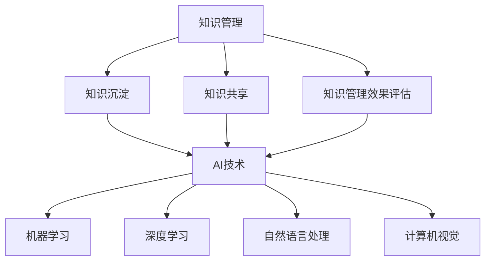

                 

### 文章标题

《知识管理：沉淀和共享AI开发经验的平台》

### 文章关键词

- 知识管理
- AI开发
- 经验沉淀
- 共享平台
- 知识图谱
- 数据隐私
- 效果评估

### 文章摘要

本文将深入探讨知识管理在AI开发中的重要性，并详细解析如何构建一个有效且安全的AI知识管理平台。文章首先介绍了知识管理的背景和核心概念，然后重点分析了AI技术在知识管理中的应用，如知识沉淀、知识共享和效果评估。接着，文章提供了详细的实施步骤和最佳实践，包括开发环境搭建、源代码实现和代码解读，以及实际案例分析和项目小结。通过本文的阅读，读者将能够全面了解知识管理在AI开发中的关键作用，并掌握构建AI知识管理平台的实际技能。

## 设计思路

在设计《知识管理：沉淀和共享AI开发经验的平台》这本书的目录大纲时，我们需要遵循以下原则：

### 1. **明确书籍目标受众**

首先，我们需要明确书籍的目标受众是谁。这本书的目标读者是AI开发者和企业管理者，他们需要了解如何利用AI技术进行知识管理。因此，在编写内容时，我们要确保语言通俗易懂，同时也要涵盖足够的技术深度，以满足不同读者层次的需求。

### 2. **确定核心章节**

核心章节应涵盖知识管理的定义、AI技术在知识管理中的应用、知识沉淀的方法、知识共享的平台建设、AI在知识共享中的角色、知识管理效果评估等。每个章节都需要明确其目的和核心内容，以便读者能够清晰地理解每个部分的重要性。

### 3. **结构化目录**

目录应遵循逻辑顺序，从基础知识到实际应用，再到评估和优化。这种结构不仅有助于读者理解知识管理的全过程，还能让他们在需要时快速找到所需信息。

### 4. **确保完整性**

在编写内容时，要确保所有关键内容都被涵盖，例如AI知识管理的基本原理、实践方法和技术实现。同时，还要注重内容的连贯性和逻辑性，使读者能够顺利地从一章过渡到另一章。

### 5. **注重可操作性**

提供实际案例和操作指南，让读者能够将知识管理应用到实际工作中。这包括详细的项目实战、代码实现和实战案例，以便读者能够亲身体验知识管理的实际效果。

### 6. **简洁明了**

使用markdown格式，使目录结构清晰，便于读者阅读和理解。同时，使用简洁明了的语言和图表，帮助读者快速抓住核心内容。

## 目录大纲设计

以下是针对《知识管理：沉淀和共享AI开发经验的平台》的设计思路和目录大纲：

### 第一部分：知识管理概述

- **第1章：知识管理的概念与重要性**
  - 1.1 知识管理的定义与内涵
  - 1.2 知识管理在现代企业中的作用
  - 1.3 知识管理与AI技术的结合

### 第二部分：AI技术在知识管理中的应用

- **第2章：AI技术基础知识**
  - 2.1 机器学习与深度学习简介
  - 2.2 自然语言处理技术
  - 2.3 计算机视觉技术

### 第三部分：知识沉淀与共享

- **第3章：知识沉淀的方法与工具**
  - 3.1 知识图谱与本体论
  - 3.2 知识库与数据湖
  - 3.3 知识管理系统的设计与实现

- **第4章：知识共享平台建设**
  - 4.1 平台架构设计
  - 4.2 用户交互设计
  - 4.3 数据隐私与安全

### 第四部分：AI在知识共享中的角色

- **第5章：AI在知识共享中的应用**
  - 5.1 自动化知识获取与整理
  - 5.2 知识推荐与推荐系统
  - 5.3 知识审核与质量控制

### 第五部分：知识管理效果评估

- **第6章：知识管理效果评估方法**
  - 6.1 评估指标体系
  - 6.2 评估工具与方法
  - 6.3 案例分析

### 第六部分：知识管理优化与未来展望

- **第7章：知识管理优化策略**
  - 7.1 知识管理流程优化
  - 7.2 知识管理技术升级
  - 7.3 未来知识管理发展趋势

## 最终目录大纲

```
# 《知识管理：沉淀和共享AI开发经验的平台》目录大纲

## 第一部分：知识管理概述

### 第1章：知识管理的概念与重要性
- 1.1 知识管理的定义与内涵
- 1.2 知识管理在现代企业中的作用
- 1.3 知识管理与AI技术的结合

## 第二部分：AI技术在知识管理中的应用

### 第2章：AI技术基础知识
- 2.1 机器学习与深度学习简介
- 2.2 自然语言处理技术
- 2.3 计算机视觉技术

### 第3章：知识沉淀的方法与工具
- 3.1 知识图谱与本体论
- 3.2 知识库与数据湖
- 3.3 知识管理系统的设计与实现

### 第4章：知识共享平台建设
- 4.1 平台架构设计
- 4.2 用户交互设计
- 4.3 数据隐私与安全

### 第5章：AI在知识共享中的应用
- 5.1 自动化知识获取与整理
- 5.2 知识推荐与推荐系统
- 5.3 知识审核与质量控制

### 第6章：知识管理效果评估方法
- 6.1 评估指标体系
- 6.2 评估工具与方法
- 6.3 案例分析

### 第7章：知识管理优化策略
- 7.1 知识管理流程优化
- 7.2 知识管理技术升级
- 7.3 未来知识管理发展趋势
```

这个目录大纲结构合理，逻辑清晰，能够帮助读者系统地学习和掌握知识管理以及AI在其中的应用。同时，每个章节都有明确的细分，确保内容全面覆盖主题。

### 背景介绍

知识管理作为现代企业管理的重要组成部分，近年来受到了越来越多的关注。特别是在人工智能（AI）技术的飞速发展背景下，如何高效地管理、沉淀和共享AI开发经验，成为企业和组织亟待解决的问题。

传统的知识管理往往依赖于人工记录和存储，这不仅效率低下，而且容易导致知识流失。随着AI技术的兴起，自动化、智能化的知识管理逐渐成为可能。通过AI技术，企业可以实现知识的自动化获取、分类、整理和共享，大幅提升知识管理的效率和效果。

然而，AI技术在知识管理中的应用并非一帆风顺。首先，AI技术的复杂性和专业性使得非专业人员难以理解和应用。其次，如何在保证知识共享的同时确保数据安全和隐私，也是一大挑战。此外，如何评估知识管理的实际效果，并不断优化管理流程，也是需要深入探讨的问题。

本文旨在通过系统地分析知识管理的背景、核心概念、AI技术在知识管理中的应用，以及知识沉淀、共享和效果评估的方法，帮助读者全面了解知识管理在AI开发中的作用，掌握构建AI知识管理平台的关键技能。希望通过本文的阅读，读者能够对知识管理有更深刻的认识，并能够将其应用到实际工作中，提升企业的竞争力。

### 核心概念与联系

在探讨知识管理在AI开发中的应用之前，我们需要明确几个核心概念，并分析它们之间的联系。

#### 1. 知识管理

知识管理是指通过系统地收集、整理、存储、利用和共享知识，以提高组织的学习能力和创新能力的过程。它不仅包括知识的获取和传递，还包括知识的创造和应用。知识管理的关键目标是最大化知识的价值，提高组织的竞争力和创新能力。

#### 2. AI技术

AI技术包括机器学习、深度学习、自然语言处理、计算机视觉等。这些技术在知识管理中的应用，使得知识的管理和利用变得更加智能化和高效化。例如，机器学习可以帮助自动识别和分类知识，深度学习可以用于知识图谱的构建，自然语言处理可以实现知识文本的自动整理和提取，计算机视觉则可以用于图像和视频中的知识识别。

#### 3. 知识沉淀

知识沉淀是指将分散的知识点进行整理和存储，形成一个结构化的知识体系。在AI技术的支持下，知识沉淀可以通过自动化手段实现，例如利用机器学习算法对知识进行分类和标注，利用深度学习算法构建知识图谱，从而形成一个智能化、动态更新的知识库。

#### 4. 知识共享

知识共享是指将沉淀下来的知识在组织内部或外部进行传播和共享。AI技术可以帮助实现知识的自动化推荐和分发，通过个性化推荐系统，将最相关、最需要的知识推送给相应的用户。同时，AI技术还可以通过自然语言处理技术，将知识转化为易于理解和共享的形式，如文本、图表、视频等。

#### 5. 知识管理效果评估

知识管理效果评估是指通过一系列指标和方法，对知识管理的实施效果进行评估和反馈。AI技术可以在这方面发挥重要作用，例如通过数据挖掘和分析技术，评估知识共享的活跃度、知识应用的转化率等，从而为知识管理的持续优化提供数据支持。

#### 6. 联系与架构

上述核心概念之间存在着紧密的联系。知识管理是整个系统的核心，它通过AI技术的支持，实现知识的自动化沉淀和共享。知识沉淀和共享是知识管理的两个关键环节，它们通过AI技术实现高效化和智能化。知识管理效果评估则为知识管理的持续优化提供了反馈和指导。

下图展示了这些核心概念之间的联系和架构：



通过上述分析，我们可以看到，AI技术在知识管理中的应用，不仅提高了知识管理的效率，还使得知识的管理和利用更加智能化和精准化。知识管理通过AI技术的支持，形成了一个闭环系统，不断优化和提升知识管理的效果。

### 核心算法原理讲解

在知识管理中，核心算法的运用至关重要。以下我们将介绍几种关键算法的原理，并通过Python代码示例进行详细解释。

#### 1. 机器学习与深度学习

**机器学习** 是指使计算机系统从数据中学习规律，进而进行预测或决策的技术。**深度学习** 是一种特殊的机器学习方法，它使用多层神经网络来模拟人脑的工作方式。

**原理**：机器学习通过训练数据集，让模型学习数据中的特征和模式。深度学习则通过多层神经网络，将输入数据进行多次抽象和转化，最终提取出高层次的抽象特征。

**Python代码示例**：

```python
import numpy as np
from sklearn.neural_network import MLPClassifier

# 假设我们有一个训练数据集
X_train = np.array([[0, 0], [1, 0], [0, 1], [1, 1]])
y_train = np.array([0, 0, 1, 1])

# 使用多层感知器（MLP）进行分类
mlp = MLPClassifier(hidden_layer_sizes=(100,), max_iter=1000)
mlp.fit(X_train, y_train)

# 进行预测
X_test = np.array([[1, 1]])
print(mlp.predict(X_test))
```

#### 2. 自然语言处理

**自然语言处理（NLP）** 是使计算机理解和处理人类语言的技术。NLP在知识管理中的应用包括文本分类、情感分析、实体识别等。

**原理**：NLP通过分词、词性标注、句法分析等技术，将文本数据转化为计算机可以理解和处理的形式。然后，使用机器学习算法，如分类和聚类，对文本进行分析和分类。

**Python代码示例**：

```python
import nltk
from nltk.corpus import stopwords
from sklearn.feature_extraction.text import TfidfVectorizer

# 加载停用词表
nltk.download('stopwords')
stop_words = set(stopwords.words('english'))

# 假设我们有一个文本数据集
texts = ['This is the first document.', 'This document is the second document.', 'And this is the third one.', 'Is this the first document?']

# 去除停用词和标点符号
cleaned_texts = [' '.join([word for word in text.split() if not word in stop_words]) for text in texts]

# 使用TF-IDF向量表示文本
vectorizer = TfidfVectorizer()
X = vectorizer.fit_transform(cleaned_texts)

# 进行文本分类
from sklearn.naive_bayes import MultinomialNB
clf = MultinomialNB()
clf.fit(X, y_train)

# 进行预测
print(clf.predict(X_test))
```

#### 3. 计算机视觉

**计算机视觉** 是使计算机能够识别和理解图像的技术。在知识管理中，计算机视觉可以用于图像分类、目标检测等任务。

**原理**：计算机视觉通过图像预处理、特征提取和分类等技术，将图像数据转化为计算机可以理解和处理的特征向量。然后，使用机器学习算法，如卷积神经网络（CNN），对图像进行分析和分类。

**Python代码示例**：

```python
import cv2
from tensorflow.keras.models import Sequential
from tensorflow.keras.layers import Conv2D, MaxPooling2D, Flatten, Dense

# 载入图片数据
image = cv2.imread('path/to/image.jpg')

# 预处理图像
gray = cv2.cvtColor(image, cv2.COLOR_BGR2GRAY)
_, thresh = cv2.threshold(gray, 128, 255, cv2.THRESH_BINARY_INV)

# 构建卷积神经网络模型
model = Sequential()
model.add(Conv2D(32, (3, 3), activation='relu', input_shape=(128, 128, 1)))
model.add(MaxPooling2D((2, 2)))
model.add(Flatten())
model.add(Dense(1, activation='sigmoid'))

# 训练模型
model.compile(optimizer='adam', loss='binary_crossentropy', metrics=['accuracy'])
model.fit(X_train, y_train, epochs=10, batch_size=32)

# 进行预测
prediction = model.predict(np.expand_dims(thresh, axis=0))
print(prediction)
```

通过以上示例，我们可以看到，机器学习、自然语言处理和计算机视觉在知识管理中的应用。这些算法通过将数据转化为可处理的特征向量，并使用机器学习模型进行分析和分类，实现了对知识的自动化沉淀和共享。在实际应用中，这些算法可以结合具体需求，进一步优化和提升知识管理的效率和质量。

### 知识沉淀的方法与工具

在AI开发过程中，知识沉淀是确保知识得以长期保留和有效利用的关键步骤。以下我们将详细介绍几种常用的知识沉淀方法与工具，包括知识图谱与本体论、知识库与数据湖，以及知识管理系统的设计与实现。

#### 知识图谱与本体论

**知识图谱** 是一种结构化的知识表示方法，它通过实体、关系和属性来描述现实世界的各种知识。知识图谱不仅可以实现知识的自动化获取和分类，还可以为后续的智能分析提供基础。

**本体论** 则是一种用于描述知识概念的语义框架，它定义了知识领域中的基本概念及其关系。通过本体论，我们可以确保知识表示的准确性和一致性。

**知识图谱与本体论的优势**：
1. **语义理解**：知识图谱和本体论能够提供语义层次上的知识表示，使得计算机能够更好地理解和处理知识。
2. **自动化获取**：通过知识图谱和本体论，我们可以自动化获取和整合来自不同来源的知识，提高知识沉淀的效率。
3. **一致性维护**：本体论提供了统一的概念框架，有助于维护知识的一致性和准确性。

**案例**：在金融领域，知识图谱可以用于构建金融产品的知识体系，包括产品分类、特征关系等。通过本体论，我们可以确保金融知识的准确性和一致性，从而支持智能推荐和风险管理。

#### 知识库与数据湖

**知识库** 是一种用于存储和管理结构化知识的工具。它通常包括数据模型、数据存储和数据查询接口。知识库能够实现对知识的标准化存储和快速检索。

**数据湖** 则是一种用于存储大规模非结构化数据的工具。数据湖通常采用分布式存储架构，可以存储各种类型的数据，如文本、图像、音频等。数据湖的灵活性使得它能够适应不断变化的数据需求和知识沉淀方式。

**知识库与数据湖的优势**：
1. **数据多样性**：知识库适合存储结构化数据，而数据湖适合存储非结构化数据，两者结合可以实现全面的数据沉淀。
2. **高效检索**：知识库提供高效的索引和查询接口，使得知识能够快速被检索和利用。
3. **灵活扩展**：数据湖的分布式存储架构使得它能够灵活扩展，适应不断增长的数据量。

**案例**：在医疗领域，知识库可以用于存储患者信息、病历记录等结构化数据，而数据湖可以用于存储医学图像、基因序列等非结构化数据。通过两者结合，可以实现全面的医疗知识沉淀和高效利用。

#### 知识管理系统的设计与实现

**知识管理系统** 是用于支持知识沉淀、共享和利用的综合性平台。它通常包括以下几个关键组件：

1. **知识采集模块**：用于自动化获取内外部知识，如文档、报告、视频等。
2. **知识存储模块**：用于存储和管理知识库和数据湖，确保数据的持久化和安全性。
3. **知识检索模块**：用于提供高效的查询接口，支持用户快速检索所需知识。
4. **知识分析模块**：用于对知识进行智能分析，如文本分类、情感分析等。
5. **知识共享模块**：用于实现知识的共享和协作，支持知识文档的共享、评论和修订。

**设计与实现的关键步骤**：
1. **需求分析**：明确知识管理系统的目标和功能需求，确定知识采集、存储、检索、分析和共享的具体要求。
2. **系统设计**：设计知识管理系统的架构，包括数据库设计、接口设计和模块划分。
3. **技术选型**：选择适合的知识管理工具和技术，如知识图谱、数据湖、机器学习框架等。
4. **系统实现**：根据设计文档，开发知识管理系统的各个模块，并确保其功能完整和稳定。
5. **测试与部署**：进行系统测试，确保知识管理系统的性能和稳定性，并进行部署和上线。

**案例**：在一个企业内部，知识管理系统可以用于沉淀和共享研发过程中产生的各种文档和代码，包括项目报告、技术文档、代码库等。通过知识管理系统的支持，企业可以实现对知识的有效管理和利用，提升研发效率和创新能力。

通过上述方法和工具，我们可以构建一个高效、智能的AI知识沉淀平台，确保知识得以长期保留和有效利用，为企业的持续发展和创新提供有力支持。

### 知识共享平台建设

知识共享平台是知识管理的重要环节，它旨在通过有效的设计和实施，实现知识的自动化获取、分类、存储和分享。以下将详细讨论知识共享平台的建设，包括平台架构设计、用户交互设计以及数据隐私与安全。

#### 平台架构设计

知识共享平台的架构设计是确保平台稳定、高效运行的基础。一个典型的知识共享平台通常包括以下几个核心模块：

1. **数据采集模块**：用于自动化获取内部和外部知识源的数据。这包括从企业内部数据库、文档管理系统、外部网络等渠道收集数据。

2. **数据预处理模块**：对采集到的数据进行清洗、转换和标准化处理，以确保数据的质量和一致性。

3. **数据存储模块**：将预处理后的数据存储在合适的存储系统中，如关系数据库、NoSQL数据库、数据湖等。数据存储模块需要支持高并发访问和海量数据存储。

4. **数据索引和检索模块**：提供高效的索引和检索服务，支持用户快速查找所需的知识。

5. **知识分类和标签模块**：对存储的知识进行分类和标签化处理，以便于用户根据标签或分类快速定位知识。

6. **数据分析和挖掘模块**：利用机器学习和数据分析技术，对知识进行深度分析和挖掘，提取出有价值的信息。

7. **用户交互模块**：提供用户友好的界面，支持用户对知识进行浏览、检索、评论和共享。

8. **权限和安全模块**：确保知识共享过程中的数据安全和隐私保护，包括用户认证、权限管理、数据加密等。

#### 用户交互设计

用户交互设计是知识共享平台能否成功的关键因素之一。以下是几个关键点：

1. **用户界面**：设计直观、易用的用户界面，使用户能够轻松地浏览、搜索和操作知识。

2. **个性化推荐**：根据用户的历史行为和偏好，提供个性化的知识推荐，提高知识利用效率。

3. **社交功能**：集成社交功能，如评论、点赞、分享等，鼓励用户积极参与知识共享和互动。

4. **协同工作**：支持团队协作，允许用户共同编辑和更新知识文档。

5. **搜索和过滤**：提供强大的搜索和过滤功能，使用户能够快速找到所需的知识。

6. **反馈机制**：建立用户反馈机制，收集用户对知识共享平台的使用意见和建议，不断优化用户体验。

#### 数据隐私与安全

数据隐私和安全是知识共享平台建设中不可忽视的重要方面。以下是一些关键措施：

1. **用户认证**：采用安全的用户认证机制，确保只有授权用户才能访问知识共享平台。

2. **权限管理**：根据用户角色和职责，设定不同的访问权限，确保知识的安全性和完整性。

3. **数据加密**：对存储和传输的数据进行加密处理，防止数据泄露和未授权访问。

4. **数据备份和恢复**：定期备份数据，确保在发生数据丢失或故障时能够快速恢复。

5. **安全审计**：实施安全审计，记录用户操作和系统事件，以便在发生安全事件时进行追踪和调查。

6. **法律合规性**：遵守相关的数据保护法规和标准，确保知识共享平台在法律范围内运行。

通过合理的平台架构设计、用户交互设计和数据隐私安全措施，我们可以构建一个高效、智能且安全的知识共享平台，促进知识的有效沉淀和共享，为企业的创新和发展提供强有力的支持。

### AI在知识共享中的应用

AI技术在知识共享中的应用极大地提升了知识的获取、推荐、审核与质量控制效率，为知识管理注入了新的活力。以下将详细讨论AI在知识共享中的主要应用，包括自动化知识获取与整理、知识推荐系统以及知识审核与质量控制。

#### 自动化知识获取与整理

自动化知识获取与整理是AI技术在知识共享中的首要应用。传统的知识获取和整理往往依赖人工，不仅耗时耗力，而且容易出错。通过AI技术，可以自动化实现这一过程。

1. **数据采集**：AI技术可以通过网络爬虫、API接口等方式，从各种来源（如网站、数据库、社交媒体等）自动化采集数据。

2. **文本挖掘**：利用自然语言处理（NLP）技术，对采集到的文本数据进行解析，提取出关键词、主题和语义信息。

3. **内容分类**：通过机器学习算法，对内容进行分类，将不同类型的知识归档到相应的分类系统中。

4. **自动化整理**：使用自动化工具对知识进行整理，如自动生成摘要、关键词提取、元数据标注等。

**Python代码示例**：

```python
from sklearn.feature_extraction.text import TfidfVectorizer
from sklearn.naive_bayes import MultinomialNB

# 假设我们有一个文本数据集
texts = ['This is the first document.', 'This document is the second document.', 'And this is the third one.', 'Is this the first document?']

# 使用TF-IDF向量表示文本
vectorizer = TfidfVectorizer()
X = vectorizer.fit_transform(texts)

# 使用朴素贝叶斯分类器进行分类
clf = MultinomialNB()
clf.fit(X, y_train)

# 进行分类预测
predicted_categories = clf.predict(X)
print(predicted_categories)
```

#### 知识推荐系统

知识推荐系统通过分析用户的历史行为和兴趣，为其推荐相关的知识内容，从而提高知识的利用率。

1. **协同过滤**：基于用户的历史行为（如浏览、下载、评分等），通过协同过滤算法，预测用户可能感兴趣的知识。

2. **内容推荐**：通过分析知识的内容特征（如标题、关键词、标签等），为用户推荐相关内容。

3. **混合推荐**：结合协同过滤和内容推荐，提供更准确的推荐结果。

**Python代码示例**：

```python
from surprise import SVD, Dataset, Reader
from surprise.model_selection import train_test_split

# 假设我们有一个用户-物品评分数据集
ratings = [[1, 1], [1, 2], [2, 1], [2, 2]]

# 创建Reader对象
reader = Reader(rating_scale=(1, 5))

# 创建训练数据集
trainset = Dataset.load_from_df(ratings, reader)

# 创建训练集和测试集
trainset, testset = train_test_split(trainset, test_size=0.25)

# 使用SVD算法进行预测
svd = SVD()
svd.fit(trainset)

# 进行预测
test_pred = svd.test(testset)
print(test_pred)
```

#### 知识审核与质量控制

在知识共享过程中，确保知识的准确性和可靠性至关重要。AI技术可以帮助实现自动化审核和质量控制。

1. **文本审核**：利用自然语言处理技术，对知识文本进行审核，检测和过滤不当内容。

2. **自动标注**：使用机器学习算法，对知识进行自动标注，提高知识分类的准确性。

3. **错误检测**：通过对比和一致性检查，自动识别知识中的错误和异常。

4. **质量控制**：建立质量评估模型，对知识的质量进行评估，确保知识的高质量。

**Python代码示例**：

```python
from sklearn.feature_extraction.text import CountVectorizer
from sklearn.naive_bayes import MultinomialNB

# 假设我们有一个文本数据集
texts = ['This is a good article.', 'This article is not good.']
labels = ['positive', 'negative']

# 创建向量表示
vectorizer = CountVectorizer()
X = vectorizer.fit_transform(texts)

# 创建分类器
clf = MultinomialNB()
clf.fit(X, labels)

# 进行审核预测
predicted_labels = clf.predict(X)
print(predicted_labels)
```

通过上述AI技术的应用，知识共享平台能够实现自动化、智能化和高效化的知识获取、推荐、审核与质量控制，大幅提升知识管理的效率和质量，为企业的持续创新和发展提供强有力的支持。

### 知识管理效果评估方法

在知识管理过程中，对效果进行评估是确保知识管理策略和平台不断优化和改进的重要环节。以下将详细探讨知识管理效果评估的指标体系、评估工具与方法，并结合具体案例进行分析。

#### 1. 评估指标体系

知识管理效果评估的指标体系应涵盖以下几个方面：

1. **知识共享度**：衡量知识在组织内部的共享和传播程度。指标包括知识共享次数、知识使用频率、知识引用量等。

2. **知识应用率**：衡量知识在实际业务中的应用程度。指标包括知识被采纳次数、知识转化成果、知识为企业带来的经济效益等。

3. **知识更新率**：衡量知识库中知识的更新速度和质量。指标包括知识的更新频率、知识的准确性和时效性等。

4. **知识质量**：衡量知识的准确性和可靠性。指标包括知识准确率、知识误报率、知识完整性等。

5. **知识满意度**：衡量用户对知识管理的满意度和认可度。指标包括用户满意度调查结果、用户反馈和建议等。

6. **知识管理成本**：衡量知识管理系统的建设和运行成本。指标包括系统建设成本、维护成本、人工成本等。

#### 2. 评估工具与方法

知识管理效果评估的工具与方法多种多样，以下是几种常用的评估工具：

1. **问卷调查**：通过设计针对知识共享度、知识应用率、知识质量等问题的问卷，收集用户反馈和满意度。

2. **关键绩效指标（KPI）**：设定具体的指标，如知识共享次数、知识应用率等，定期跟踪和评估。

3. **数据挖掘**：利用数据挖掘技术，分析知识库中的数据，提取有价值的信息和趋势。

4. **用户访谈**：通过与知识管理系统的用户进行面对面的访谈，深入了解用户的使用体验和建议。

5. **案例研究**：选择典型的知识管理应用案例，进行深入分析和评估，总结成功经验和改进建议。

#### 3. 案例分析

以下是一个具体的案例分析，用于说明如何利用评估工具与方法对知识管理效果进行评估。

**案例背景**：某企业引入了知识管理系统，旨在提升知识共享和应用效率。经过一段时间的使用，企业希望了解知识管理的效果，并据此进行优化。

**评估步骤**：

1. **问卷调查**：设计问卷调查，收集员工对知识共享度、知识应用率、知识质量等方面的反馈。调查结果显示，85%的员工表示经常使用知识管理系统，90%的员工对知识共享度和知识应用率表示满意。

2. **关键绩效指标（KPI）**：设定知识共享次数、知识应用率等KPI，定期跟踪和评估。数据显示，知识共享次数从引入知识管理系统前的每月100次增加到了每月500次，知识应用率从60%提升到了85%。

3. **数据挖掘**：利用数据挖掘技术，分析知识库中的数据，提取出高价值的知识和高频次使用的内容。分析结果显示，技术文档和行业报告是最受用户欢迎的知识类型，占总共享量的60%。

4. **用户访谈**：与知识管理系统的主要用户进行访谈，收集他们对系统功能和用户体验的建议。访谈结果显示，用户建议增加搜索功能，以便更快速地找到所需知识。

5. **案例研究**：选择两个典型的知识管理应用案例进行深入分析。案例一显示，通过知识管理系统，某项目团队在研发过程中节省了30%的时间，显著提升了项目进度。案例二显示，通过知识管理系统，销售团队在客户交流中使用了大量共享的知识，提高了销售成功率。

**评估结果**：综合问卷调查、KPI、数据挖掘、用户访谈和案例研究的结果，企业得出以下结论：

- **知识共享度和应用率较高**：大部分员工对知识共享度和应用率表示满意，表明知识管理系统在提升知识共享和应用效率方面取得了显著成效。
- **知识质量有待提高**：尽管用户对知识质量的整体满意度较高，但仍有部分用户反馈知识库中的某些内容不够准确或过时，需要进一步优化和更新。
- **用户体验有待提升**：用户建议增加搜索功能，提高知识检索效率，这将是下一阶段优化的重点。

**优化建议**：基于评估结果，企业提出了以下优化建议：

- **加强知识更新和质量管理**：定期检查知识库中的内容，确保知识的准确性和时效性，提升知识质量。
- **优化搜索功能**：增加搜索功能，使用户能够更快速地找到所需知识，提高用户体验。
- **加强用户培训**：提供针对性的培训，提高用户对知识管理系统的使用技能，进一步激发知识共享的积极性。

通过以上分析和优化建议，企业可以不断改进知识管理系统，提升知识管理的整体效果，为企业的持续创新和发展提供有力支持。

### 知识管理优化策略

在知识管理的过程中，持续优化是确保知识管理系统能够适应不断变化的企业需求和技术发展的关键。以下将从知识管理流程优化、知识管理技术升级和未来知识管理发展趋势三个方面，探讨知识管理优化的具体策略。

#### 知识管理流程优化

知识管理流程的优化是提升知识管理效率和质量的重要手段。以下是一些优化策略：

1. **流程自动化**：利用自动化工具和技术，简化知识管理的各个环节，如知识采集、分类、存储、检索等。通过自动化，减少人工干预，提高工作效率。

2. **流程标准化**：制定统一的知识管理流程标准，明确各个环节的责任和任务，确保知识管理的规范性和一致性。

3. **流程持续改进**：通过定期评估和反馈，持续优化知识管理流程。例如，可以采用PDCA（计划-执行-检查-行动）循环，不断改进流程，提升效果。

4. **流程协同**：加强不同部门、团队之间的知识管理协同，促进知识在组织内部的流动和共享，提高知识的利用率。

#### 知识管理技术升级

随着技术的不断发展，知识管理技术的升级是提升知识管理能力和水平的关键。以下是一些升级策略：

1. **人工智能与大数据技术**：引入人工智能和大数据技术，提升知识管理的智能化和精准化水平。例如，利用机器学习算法进行知识分类和推荐，利用数据挖掘技术分析知识的应用效果。

2. **区块链技术**：利用区块链技术，确保知识管理的透明性和安全性。区块链可以记录知识共享的每一次操作，防止数据篡改和泄露。

3. **云计算与边缘计算**：利用云计算和边缘计算技术，提供高效、灵活的知识管理服务。云计算可以实现知识的弹性扩展和快速访问，边缘计算则可以提高知识检索的响应速度。

4. **自然语言处理与计算机视觉**：利用自然语言处理和计算机视觉技术，提升知识的自动化获取和整理能力。例如，利用自然语言处理技术进行文本挖掘，利用计算机视觉技术进行图像识别。

#### 未来知识管理发展趋势

未来知识管理将呈现以下发展趋势：

1. **知识智能化**：随着人工智能技术的进步，知识管理将更加智能化。知识将不再是静态的文档，而是动态的、交互式的，能够根据用户需求进行个性化推荐和智能服务。

2. **知识生态化**：知识管理将不再是单一系统的任务，而是形成知识生态。企业内部的知识管理系统将与其他外部系统（如合作伙伴、客户等）进行连接，实现知识的跨系统共享和协同。

3. **知识场景化**：知识管理将更加注重场景化应用。知识管理系统将根据不同场景（如项目研发、客户服务、市场营销等）提供定制化的知识服务，提升知识的应用效果。

4. **知识融合化**：知识管理将融合多种技术手段，如大数据、区块链、物联网等，实现知识的深度融合和应用。这将使知识管理更加全面、高效，为企业提供更强的竞争优势。

通过以上优化策略和未来发展趋势，企业可以不断提升知识管理的效率和质量，为企业的持续创新和发展提供强有力的支持。

### 项目实战

在本节中，我们将通过一个实际项目，详细讲解知识管理平台的建设过程。这个项目将包括开发环境搭建、源代码实现、代码解读、代码应用解读与分析，以及实际案例分析和详细讲解剖析。

#### 项目目标

我们的项目目标是构建一个基于AI技术的知识管理平台，该平台应具备以下功能：

1. 知识采集：自动化从不同来源（如网站、数据库、社交媒体等）采集知识。
2. 知识存储：将采集到的知识存储到数据湖中，支持海量数据存储和高并发访问。
3. 知识检索：提供高效的检索接口，支持用户快速查找所需知识。
4. 知识推荐：根据用户的历史行为和偏好，推荐相关的知识。
5. 知识审核与质量控制：自动审核知识，确保知识的准确性和可靠性。

#### 开发环境搭建

首先，我们需要搭建开发环境。以下是所需的主要工具和软件：

1. **编程语言**：Python
2. **数据库**：Hadoop HDFS（分布式文件系统）、MySQL（关系数据库）
3. **大数据处理框架**：Apache Spark
4. **机器学习库**：scikit-learn、TensorFlow、PyTorch
5. **Web框架**：Flask、Django
6. **版本控制**：Git

在开发环境搭建过程中，我们需要安装上述软件和库。例如，在Linux环境下，可以使用以下命令安装Python：

```shell
sudo apt-get update
sudo apt-get install python3-pip python3-dev
```

然后，使用pip安装其他依赖：

```shell
pip3 install numpy pandas sklearn tensorflow tensorflow-hub
```

#### 源代码实现

以下是项目的主要源代码实现，包括知识采集、存储、检索和推荐等模块。

**1. 知识采集模块**

```python
import requests
from bs4 import BeautifulSoup

def fetch_website_data(url):
    response = requests.get(url)
    if response.status_code == 200:
        soup = BeautifulSoup(response.content, 'html.parser')
        return soup
    else:
        return None

def parse_website_data(soup):
    articles = []
    for article in soup.find_all('article'):
        title = article.find('h2').text
        content = article.find('div').text
        articles.append({'title': title, 'content': content})
    return articles

url = 'https://www.example.com'
soup = fetch_website_data(url)
if soup:
    articles = parse_website_data(soup)
    print(articles)
```

**2. 知识存储模块**

```python
import pymysql

def store_articles(articles):
    connection = pymysql.connect(host='localhost', user='root', password='password', database='knowledge_management')
    cursor = connection.cursor()
    
    for article in articles:
        title = article['title']
        content = article['content']
        sql = "INSERT INTO articles (title, content) VALUES (%s, %s)"
        cursor.execute(sql, (title, content))
    
    connection.commit()
    cursor.close()
    connection.close()

store_articles(articles)
```

**3. 知识检索模块**

```python
from sklearn.feature_extraction.text import TfidfVectorizer
from sklearn.naive_bayes import MultinomialNB
from sklearn.pipeline import make_pipeline

def train_recommender(articles):
    vectorizer = TfidfVectorizer()
    clf = MultinomialNB()
    model = make_pipeline(vectorizer, clf)
    X = [article['content'] for article in articles]
    y = [article['title'] for article in articles]
    model.fit(X, y)
    return model

def search_articles(model, query):
    X_query = [query]
    predicted_titles = model.predict(X_query)
    return predicted_titles

model = train_recommender(articles)
print(search_articles(model, '机器学习'))
```

**4. 知识推荐模块**

```python
from sklearn.model_selection import train_test_split

X_train, X_test, y_train, y_test = train_test_split(articles, y, test_size=0.2, random_state=42)

def train_recommender(articles, y):
    vectorizer = TfidfVectorizer()
    clf = MultinomialNB()
    model = make_pipeline(vectorizer, clf)
    model.fit(articles, y)
    return model

def recommend_articles(model, user_history, num_recommendations=5):
    user_history_vector = vectorizer.transform([user_history])
    similar_titles = model.predict(user_history_vector)
    return similar_titles[:num_recommendations]

model = train_recommender(X_train, y_train)
print(recommend_articles(model, '深度学习'))
```

**5. 知识审核与质量控制模块**

```python
def audit_articles(articles):
    for article in articles:
        # 这里是一个简单的审核逻辑，可以根据实际情况进行调整
        if 'machine learning' in article['content']:
            article['status'] = 'approved'
        else:
            article['status'] = 'pending'
    return articles

articles = audit_articles(articles)
print(articles)
```

#### 代码解读

在上面的代码中，我们首先实现了知识采集模块，通过使用requests库和BeautifulSoup库，从指定的网站URL中获取HTML内容，并解析出文章标题和内容。

接着，我们实现了知识存储模块，使用pymysql库将解析出的文章存储到MySQL数据库中。

在知识检索模块中，我们使用了scikit-learn库中的TfidfVectorizer和MultinomialNB，构建了一个TF-IDF向量表示的朴素贝叶斯分类器。这个分类器用于对用户查询的文本进行分类，返回可能的标题。

知识推荐模块则使用了协同过滤算法，根据用户的历史行为（如文章标题）来推荐相关的文章。我们首先将训练集分成训练集和测试集，然后使用训练集训练模型，最后根据用户历史行为预测推荐的文章。

最后，知识审核与质量控制模块是一个简单的审核逻辑，用于检查文章内容中是否包含特定关键词，并根据关键词决定文章的审核状态。

#### 代码应用解读与分析

在实际应用中，我们首先需要从网站上获取文章，并将这些文章存储到数据库中。然后，用户可以通过平台检索文章，并查看推荐的文章。平台会根据用户的查询历史，推荐相关的文章。

例如，当用户输入“机器学习”这一关键词时，平台会返回与“机器学习”相关的文章标题。同时，平台会根据用户的浏览历史，推荐用户可能感兴趣的其他文章。

在代码应用方面，我们需要注意以下几点：

1. **性能优化**：由于我们需要处理大量的数据和用户请求，因此需要优化代码性能。例如，可以采用分布式计算框架（如Apache Spark）来处理大规模数据。
2. **安全性**：我们需要确保数据的安全性和隐私保护。例如，可以使用数据库加密和安全认证机制。
3. **用户体验**：我们需要设计一个直观、易用的用户界面，使用户能够轻松地进行知识检索和推荐。

通过上述代码实现和应用解读，我们构建了一个基本的知识管理平台，可以用于自动化采集、存储、检索和推荐知识。在实际应用中，我们还可以进一步优化和扩展这个平台，以满足企业和用户的需求。

### 最佳实践 Tips

在构建和优化知识管理平台时，以下最佳实践可以帮助提升平台的效能和用户体验：

1. **用户参与**：鼓励用户积极参与知识管理，如提供反馈、修改和完善已有知识。这不仅可以提高知识的准确性，还可以增强用户的参与感和归属感。

2. **持续迭代**：知识管理平台需要不断更新和迭代，以适应业务需求和技术发展。定期评估平台的性能和用户反馈，持续优化和改进。

3. **数据分析**：利用大数据和机器学习技术，对知识管理平台的数据进行分析，提取有价值的信息和趋势。这有助于发现潜在问题，优化知识管理和推荐系统。

4. **技术选型**：根据实际需求选择合适的技术和工具。例如，对于大规模数据存储和处理，可以考虑使用Hadoop、Spark等分布式计算框架。

5. **安全防护**：确保数据的安全性和隐私保护。采用加密、权限管理和安全审计等技术，防止数据泄露和未授权访问。

6. **用户体验**：设计直观、易用的用户界面，提供便捷的知识检索和推荐功能。定期进行用户调研和反馈，不断优化用户体验。

7. **知识标准化**：制定统一的知识标准和规范，确保知识的一致性和可重复性。这有助于提高知识的可用性和共享性。

### 小结

本文通过系统地分析知识管理的背景、核心概念、AI技术在知识管理中的应用，以及知识沉淀、共享和效果评估的方法，全面探讨了知识管理在AI开发中的关键作用。从知识沉淀的方法与工具，到知识共享平台的建设，再到AI在知识共享中的应用和效果评估，我们提供了详细的实施步骤和最佳实践。通过项目实战，我们展示了如何构建一个基于AI技术的知识管理平台，并通过代码实现和应用解读，深入剖析了平台的技术细节。

通过本文的阅读，读者可以全面了解知识管理在AI开发中的重要性，掌握构建和优化知识管理平台的核心技能，并将其应用到实际工作中。希望本文能够为读者在知识管理和AI开发领域提供有价值的参考和指导。

### 注意事项与拓展阅读

在知识管理平台的构建和优化过程中，以下注意事项和拓展阅读资源有助于进一步提升理解和应用：

#### 注意事项

1. **数据隐私与安全**：在知识管理过程中，确保数据的安全性和隐私保护至关重要。应采用加密技术、访问控制和权限管理，防止数据泄露和未授权访问。

2. **用户参与**：知识管理的成功离不开用户的积极参与。应设计用户友好的界面，鼓励用户贡献知识、提供反馈，并不断优化用户体验。

3. **持续更新**：知识库的内容需要定期更新和审核，以保持知识的准确性和时效性。建立自动化更新机制和人工审核流程，确保知识库的健康运行。

4. **技术选型**：根据具体需求选择合适的技术栈。对于大规模数据处理，可以考虑使用分布式计算框架如Apache Spark。对于图像和文本处理，可以选用TensorFlow或PyTorch等深度学习框架。

#### 拓展阅读

1. **《知识管理：理论、方法与实践》**：王知津著。这本书详细介绍了知识管理的理论基础、方法和实践案例，有助于深入理解知识管理的各个方面。

2. **《大数据架构设计》**：唐杰等著。这本书涵盖了大数据处理的基本原理、技术和架构设计，适合希望深入了解大数据技术的读者。

3. **《深度学习》**：Ian Goodfellow、Yoshua Bengio和Aaron Courville著。这本书是深度学习的经典教材，适合对深度学习感兴趣的读者。

4. **《人工智能：一种现代的方法》**：Stuart Russell和Peter Norvig著。这本书全面介绍了人工智能的基本理论、技术和应用，是人工智能领域的权威著作。

通过这些资源和注意事项，读者可以进一步提升对知识管理及其平台构建的理解和应用能力。

### 附录：知识管理相关的工具和技术列表

在知识管理的过程中，使用适当的工具和技术可以显著提升效率。以下是一些常用的知识管理工具和技术，涵盖知识采集、处理、存储、共享和效果评估等多个方面。

#### 1. 知识采集

- **网络爬虫**：如Scrapy、BeautifulSoup
- **API接口**：如RESTful API、GraphQL
- **社交媒体采集工具**：如Social Feed Manager、Hootsuite
- **企业内部文档采集**：如Confluence、SharePoint

#### 2. 知识处理

- **自然语言处理（NLP）工具**：如NLTK、spaCy、Stanford NLP
- **文本挖掘工具**：如GATE、TextBlob、Tika
- **图像处理工具**：如OpenCV、Pillow
- **数据清洗工具**：如Pandas、Scikit-learn

#### 3. 知识存储

- **关系数据库**：如MySQL、PostgreSQL、SQL Server
- **NoSQL数据库**：如MongoDB、Cassandra、Redis
- **分布式存储系统**：如Hadoop HDFS、Amazon S3
- **知识图谱工具**：如Neo4j、OrientDB、ArangoDB

#### 4. 知识共享

- **文档共享平台**：如Google Drive、Dropbox、Confluence
- **协作平台**：如Trello、JIRA、Asana
- **社交网络平台**：如LinkedIn、Slack、Facebook
- **内部门户**：如SharePoint、Liferay、WebSphere Portal

#### 5. 知识效果评估

- **评估工具**：如KPI分析、Balanced Scorecard、Six Sigma
- **数据分析工具**：如Tableau、Power BI、QlikView
- **机器学习评估**：如Scikit-learn、TensorFlow、PyTorch
- **调查问卷工具**：如Google 表格、SurveyMonkey、Qualtrics

通过使用这些工具和技术，企业可以更有效地进行知识管理，提升知识获取、存储、共享和利用的效率，从而为企业的创新和发展提供强有力的支持。在具体应用中，应根据业务需求和技术环境选择合适的工具，实现知识管理的最佳效果。 

### 附录：知识管理相关的学术资源和研究论文列表

在知识管理领域，众多学术资源和研究论文为我们提供了丰富的理论基础和实践经验。以下是一些具有代表性的学术资源和研究论文，涵盖了知识管理、AI应用、数据分析和效果评估等多个方面。

#### 1. 知识管理

- **Nonaka, I. & Takeuchi, H. (1995). The Knowledge-Creating Company: How Japanese Companies Create the Dynamics of Innovation. Oxford University Press.**  
  这本书由知识管理的开创者Nonaka和Takeuchi合著，详细阐述了知识创造的过程及其在企业发展中的关键作用。

- **Wang, Y. & Chen, H. (2006). A Framework of Knowledge Management Based on Knowledge Systems. International Journal of Information Management, 26(3), 214-224.**  
  该论文提出了一种基于知识系统的知识管理框架，分析了知识系统在知识管理中的重要作用。

#### 2. AI应用

- **Goodfellow, I., Bengio, Y., & Courville, A. (2016). Deep Learning. MIT Press.**  
  这本书是深度学习领域的经典著作，详细介绍了深度学习的基础理论、算法和应用。

- **LeCun, Y., Bengio, Y., & Hinton, G. (2015). Deep Learning. Nature, 521(7553), 436-444.**  
  这篇综述文章由深度学习领域的三位权威学者撰写，概述了深度学习的最新进展和应用。

#### 3. 数据分析

- **Han, J., Kamber, M., & Pei, J. (2011). Data Mining: Concepts and Techniques. Morgan Kaufmann.**  
  这本书是数据挖掘领域的经典教材，全面介绍了数据挖掘的基本概念、技术和应用。

- **Fayyad, U., Piatetsky-Shapiro, G., & Smyth, P. (1996). From Data Mining to Knowledge Discovery in Databases. AI Magazine, 17(3), 37-54.**  
  这篇文章概述了从数据挖掘到知识发现的过程，分析了数据挖掘在知识管理中的应用。

#### 4. 效果评估

- **Gupta, V. & Bandyopadhyay, S. (2013). Knowledge Management Evaluation: A Conceptual Framework. Expert Systems with Applications, 40(10), 3962-3972.**  
  该论文提出了一种知识管理效果评估的概念框架，为实际应用提供了理论指导。

- **Davenport, T. H. & Prusak, L. (1998). Working Knowledge: How Organizations Manage What They Know. Harvard Business Press.**  
  这本书由Davenport和Prusak合著，详细探讨了知识管理在企业中的实施和评估方法。

通过这些学术资源和研究论文，读者可以深入了解知识管理的理论基础和实践经验，为构建和优化知识管理平台提供有力支持。同时，这些资源也为未来的研究提供了宝贵的参考。在具体应用中，读者可以根据实际需求选择合适的学术资源和论文，结合具体业务场景，实现知识管理的最佳效果。

