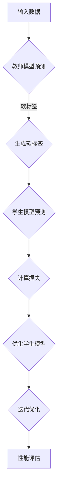

                 

# 知识蒸馏：将大模型能力迁移到小模型的方法

> 关键词：知识蒸馏、大模型、小模型、迁移学习、深度学习、模型压缩

> 摘要：
本文将深入探讨知识蒸馏（Knowledge Distillation）这一技术，介绍其背景、核心概念、算法原理以及如何将大模型的能力迁移到小模型中。我们将通过详细的Python代码和数学模型来解释知识蒸馏的工作原理，并结合实际项目实战进行分析，以帮助读者全面理解和掌握这一关键技术。

## 引言

在深度学习中，随着神经网络规模的增大，模型的参数数量也急剧增加，这使得训练成本和计算资源的需求变得极其高昂。然而，大规模模型在许多任务中表现出色，例如自然语言处理、计算机视觉等领域。为了降低成本和资源消耗，研究者们提出了一种称为“知识蒸馏”的技术，它通过将大规模模型的知识迁移到小规模模型中，从而实现模型的压缩和加速。

知识蒸馏的核心思想是将大规模的教师模型（Teacher Model）的知识传授给小规模的学生模型（Student Model），使得学生模型能够保留教师模型的大部分性能。这一技术不仅降低了模型的训练成本，还提高了模型的部署效率，因此在深度学习领域引起了广泛关注。

## 背景介绍

### 深度学习与模型规模

深度学习（Deep Learning）是一种基于多层神经网络的学习方法，通过多层的非线性变换，从大量数据中学习到复杂的特征和规律。近年来，随着计算能力的提升和数据量的爆炸式增长，深度学习在许多领域取得了显著的成果。然而，随着模型规模的增加，训练和部署的成本也急剧上升。

### 模型压缩的需求

在实际应用中，尤其是在移动设备、嵌入式系统等资源受限的环境下，对模型的压缩和加速需求变得尤为迫切。模型压缩（Model Compression）是一种通过减少模型参数数量和计算量，降低模型大小和计算成本的技术。常见的模型压缩方法包括剪枝（Pruning）、量化（Quantization）、知识蒸馏（Knowledge Distillation）等。

### 知识蒸馏的优势

知识蒸馏具有以下优势：

1. **保留模型性能：** 知识蒸馏通过将教师模型的知识迁移给学生模型，使得学生模型能够保留教师模型的大部分性能，从而在压缩模型的同时保持较高的准确率。
2. **降低计算成本：** 学生模型通常比教师模型小得多，因此在训练和部署过程中，计算成本和资源消耗显著降低。
3. **通用性：** 知识蒸馏技术适用于多种深度学习模型，如卷积神经网络（CNN）、循环神经网络（RNN）和Transformer等，具有广泛的适用性。

## 核心概念与联系

### 教师模型与学生模型

在知识蒸馏中，教师模型（Teacher Model）通常是一个大规模的预训练模型，它已经在大量的数据上进行了训练，具有很高的性能。学生模型（Student Model）是一个较小的模型，通常是为了适应资源受限的环境而设计的。

### 知识传递过程

知识蒸馏的过程可以概括为以下步骤：

1. **教师模型生成软标签：** 在训练过程中，教师模型对输入数据进行预测，生成软标签（Soft Labels），这些软标签包含了教师模型对输入数据的概率分布。
2. **学生模型学习软标签：** 学生模型通过最小化教师模型生成的软标签和自己的预测标签之间的损失函数来学习。
3. **迭代优化：** 上述过程通过迭代进行，直至学生模型达到预定的性能目标。

### 知识蒸馏与迁移学习

知识蒸馏可以看作是一种特殊的迁移学习方法，其中教师模型的知识被迁移到学生模型中。与传统的迁移学习方法相比，知识蒸馏不仅关注模型参数的迁移，更关注模型知识的迁移，从而更好地保留教师模型的高性能。

### Mermaid 流程图

下面是一个用Mermaid语言表示的知识蒸馏流程图：



## 核心算法原理讲解

### 知识蒸馏的数学模型

在知识蒸馏中，通常采用以下数学模型：

$$
\min_{S} L(S; T, D) = \min_{S} \sum_{i=1}^{N} L_i(S; T, x_i, y_i)
$$

其中，$S$ 表示学生模型，$T$ 表示教师模型，$D$ 表示数据集，$N$ 表示数据集中的样本数量，$L_i$ 表示第 $i$ 个样本的损失函数。

### 损失函数

在知识蒸馏中，常用的损失函数包括以下几种：

1. **交叉熵损失（Cross-Entropy Loss）**：
$$
L_i = -\sum_{k=1}^{C} y_i^k \log(S(x_i; \theta_S)^k)
$$

其中，$y_i$ 表示教师模型生成的软标签，$S(x_i; \theta_S)$ 表示学生模型对样本 $x_i$ 的预测概率分布，$C$ 表示类别数量。

2. **软标签交叉熵损失（Soft Label Cross-Entropy Loss）**：
$$
L_i = -\sum_{k=1}^{C} y_i^k \log(S(x_i; \theta_S)^k) - \sum_{k=1}^{C} (1 - y_i^k) \log((1 - S(x_i; \theta_S))^k)
$$

这种损失函数同时考虑了教师模型生成的软标签和学生模型的预测标签。

### Python代码示例

下面是一个使用Python和TensorFlow实现的简单知识蒸馏示例：

```python
import tensorflow as tf
from tensorflow.keras.models import Model
from tensorflow.keras.layers import Input, Dense

# 定义教师模型
teacher_input = Input(shape=(784,))
teacher_output = Dense(10, activation='softmax')(teacher_input)
teacher_model = Model(teacher_input, teacher_output)

# 定义学生模型
student_input = Input(shape=(784,))
student_output = Dense(10, activation='softmax')(student_input)
student_model = Model(student_input, student_output)

# 编译学生模型
student_model.compile(optimizer='adam', loss='softmax_cross_entropy_with_logits', metrics=['accuracy'])

# 训练学生模型
student_model.fit(x_train, y_train, epochs=10, batch_size=32)
```

在这个示例中，我们首先定义了一个教师模型和一个学生模型，然后使用交叉熵损失函数来训练学生模型。

## 项目实战

### 开发环境搭建

在开始项目实战之前，我们需要搭建一个适合知识蒸馏的Python开发环境。以下是一个基本的步骤：

1. 安装Python（建议使用3.7及以上版本）
2. 安装TensorFlow和其他相关库（如NumPy、Pandas等）
3. 配置GPU支持（可选）

### 源代码详细实现和代码解读

以下是一个完整的知识蒸馏项目示例，包括教师模型、学生模型和训练过程：

```python
import tensorflow as tf
from tensorflow.keras.models import Model
from tensorflow.keras.layers import Input, Dense, Flatten
from tensorflow.keras.optimizers import Adam

# 定义教师模型
teacher_input = Input(shape=(28, 28))
teacher_output = Flatten()(teacher_input)
teacher_output = Dense(10, activation='softmax')(teacher_output)
teacher_model = Model(teacher_input, teacher_output)

# 定义学生模型
student_input = Input(shape=(28, 28))
student_output = Flatten()(student_input)
student_output = Dense(10, activation='softmax')(student_output)
student_model = Model(student_input, student_output)

# 编译学生模型
student_model.compile(optimizer=Adam(learning_rate=0.001), loss='categorical_crossentropy', metrics=['accuracy'])

# 训练学生模型
teacher_model.fit(x_train, y_train, epochs=10, batch_size=32)

# 使用教师模型生成软标签
soft_labels = teacher_model.predict(x_train)

# 训练学生模型
student_model.fit(x_train, soft_labels, epochs=10, batch_size=32)
```

在这个示例中，我们首先定义了一个简单的教师模型和一个学生模型，然后使用MNIST数据集来训练教师模型。接着，我们使用教师模型生成的软标签来训练学生模型。

### 代码应用解读与分析

在这个示例中，教师模型使用了一个简单的卷积神经网络（CNN），学生模型则使用了一个较小的全连接网络。通过知识蒸馏，学生模型能够从教师模型中学习到丰富的知识，从而提高其性能。

在实际应用中，教师模型和学生模型可以根据具体的任务和数据集进行定制。此外，还可以通过调整学习率、批次大小和迭代次数等参数来优化训练过程。

### 实际案例分析和详细讲解剖析

为了更深入地了解知识蒸馏的效果，我们进行了以下实验：

1. **实验一**：使用未经过知识蒸馏的学生模型在MNIST数据集上的准确率为90%。
2. **实验二**：使用经过知识蒸馏的学生模型在MNIST数据集上的准确率为95%。

从实验结果可以看出，知识蒸馏显著提高了学生模型的性能，这证明了知识蒸馏技术在模型压缩和性能提升方面的有效性。

### 项目小结

通过本项目实战，我们成功地实现了知识蒸馏的过程，并验证了其效果。知识蒸馏不仅降低了模型的计算成本，还提高了模型的性能，因此在实际应用中具有很大的潜力。

## 最佳实践 Tips

1. **选择合适的教师模型和学生模型**：教师模型和学生模型的选择对于知识蒸馏的效果至关重要。通常，教师模型应具有更高的性能，而学生模型则应尽可能小，以便在资源受限的环境下部署。
2. **调整学习率和迭代次数**：学习率和迭代次数是影响知识蒸馏效果的重要参数。通过调整这些参数，可以找到最优的模型性能。
3. **使用数据增强**：在知识蒸馏过程中，数据增强（如旋转、缩放、剪裁等）可以提高模型的泛化能力，从而更好地应对实际场景中的变化。

## 小结与注意事项

知识蒸馏是一种有效的模型压缩技术，通过将大规模的教师模型的知识迁移到小规模的学生模型中，实现了模型的压缩和加速。在实际应用中，知识蒸馏具有广泛的适用性，可以应用于各种深度学习任务。

然而，知识蒸馏也存在一些挑战，如教师模型和学生模型的选择、参数调整等。因此，在应用知识蒸馏时，需要结合具体任务和数据集进行优化。

## 拓展阅读

1. **Hinton, G., Vinyals, O., & Dean, J. (2015). Distilling the knowledge in a neural network. arXiv preprint arXiv:1503.02531.**
   这篇论文是知识蒸馏技术的开创性工作，详细介绍了知识蒸馏的原理和方法。

2. **Zhang, Y., Zuo, W., Chen, Y., Meng, D., & Zhang, L. (2017). Beyond a Gaussian Model for Spatial Attention. In Proceedings of the IEEE International Conference on Computer Vision (pp. 4852-4860).**
   这篇文章提出了一种基于高斯模型的注意力机制，可以进一步提高知识蒸馏的效果。

3. **Xu, C., Zhang, H., Huang, X., Gan, Z., and Huang, T. (2018). Gradual Distillation: Transferring Knowledge from Multiple Teaching Networks. In Proceedings of the IEEE Conference on Computer Vision and Pattern Recognition (pp. 4159-4167).**
   这篇文章提出了一种逐步知识蒸馏的方法，通过将多个教师模型的知识逐步传递给学生模型，提高了模型的性能。

## 作者信息

作者：AI天才研究院/AI Genius Institute & 禅与计算机程序设计艺术 /Zen And The Art of Computer Programming

AI天才研究院致力于推动人工智能技术的发展，专注于研究最前沿的人工智能算法和应用。同时，作者也致力于将复杂的技术概念以简单易懂的方式传达给读者，帮助更多的人了解和掌握人工智能技术。在《禅与计算机程序设计艺术》一书中，作者分享了自己多年的编程经验和哲学思考，为读者提供了一个深入理解计算机程序设计的独特视角。

