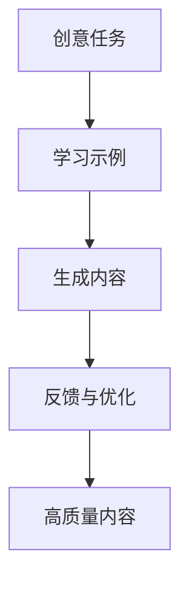

                 

# 标题：示例驱动提示在创意任务中的应用

## 关键词
示例驱动提示，创意任务，算法原理，数学模型，Python实现，项目实战

## 摘要
本文深入探讨了示例驱动提示在创意任务中的应用。首先介绍了示例驱动提示的基本概念和创意任务的重要性，然后详细阐述了示例驱动提示与创意任务之间的关系架构，接着通过Python源代码和数学模型讲解了核心算法原理。最后，通过实际案例展示了示例驱动提示在广告创意、产品设计、艺术创作和营销策略等领域的应用，并给出了项目实战的详细解析和总结。

## 引言与背景

### 示例驱动提示的概念

示例驱动提示（Example-Guided Prompting）是一种基于示例的学习方法，它通过提供一系列示例来引导模型生成新的内容或解决方案。这种方法在人工智能和机器学习中具有广泛的应用，尤其是在创意任务中。示例驱动提示的核心思想是通过学习已有的示例，模型可以理解示例所代表的含义和规律，从而生成新的、符合预期内容的输出。

### 创意任务的重要性

创意任务是指在不确定、多变和复杂的环境中，通过创新思维和创造性方法解决问题的过程。这些任务通常需要高度的专业知识、丰富的经验和直觉判断。在现代社会，随着信息爆炸和竞争加剧，创意任务在企业竞争、产品设计、市场营销、艺术创作等领域变得越来越重要。

### 示例驱动提示在创意任务中的应用背景

随着人工智能技术的发展，示例驱动提示作为一种有效的学习策略，逐渐在创意任务中得到了应用。例如，在广告创意中，通过分析成功的广告案例，AI模型可以生成新的、吸引眼球的广告内容；在产品设计过程中，通过学习优秀的产品设计案例，AI可以帮助设计师快速生成新颖的设计方案；在艺术创作中，AI可以通过学习艺术家的作品，生成新的艺术作品；在营销策略中，通过分析成功的营销案例，AI可以制定新的、有效的营销策略。

## 核心概念与联系

### 示例驱动提示的基本原理

示例驱动提示的核心原理可以概括为“学习-生成-优化”。首先，通过学习大量的示例，模型理解示例中的知识和规律；然后，根据给定的输入，模型生成新的内容或解决方案；最后，通过反馈和优化，模型不断改进生成的结果，使其更符合预期。

### 示例驱动提示与创意任务的关系

示例驱动提示与创意任务之间存在着紧密的联系。创意任务通常需要创新思维和创造性方法，而示例驱动提示提供了一种系统化的学习方法，可以帮助模型理解创意任务中的关键要素和规律。通过学习大量的示例，模型可以积累丰富的创意经验，从而在新的创意任务中快速生成高质量的内容。

### 示例驱动提示在创意任务中的应用原理架构

为了更好地理解示例驱动提示在创意任务中的应用原理，我们可以使用Mermaid流程图来表示其关系架构：



在这个流程图中，创意任务作为输入，通过学习示例，模型生成内容，然后通过反馈和优化，最终生成高质量的内容。这个流程循环进行，使得模型在不断的迭代中，不断提高生成内容的质量。

## 核心算法原理讲解

### 示例驱动提示的算法基础

示例驱动提示的算法基础主要依赖于生成模型和评估模型。生成模型负责根据输入生成新的内容，而评估模型负责评估生成内容的质量。

首先，我们来看一个简单的生成模型——生成对抗网络（GAN）。GAN由生成器（Generator）和判别器（Discriminator）组成。生成器从随机噪声中生成数据，判别器则尝试区分生成数据和真实数据。通过不断训练，生成器逐渐生成更逼真的数据，而判别器的性能也不断提高。以下是一个使用Python实现的简单GAN示例：

```python
import numpy as np
import tensorflow as tf
from tensorflow.keras.layers import Dense, Flatten
from tensorflow.keras.models import Sequential

# 定义生成器模型
generator = Sequential([
    Dense(128, input_shape=(100,), activation='relu'),
    Dense(28 * 28, activation='sigmoid'),
    Flatten()
])

# 定义判别器模型
discriminator = Sequential([
    Flatten(input_shape=(28, 28)),
    Dense(128, activation='relu'),
    Dense(1, activation='sigmoid')
])

# 定义GAN模型
gan = Sequential([
    generator,
    discriminator
])

# 编译模型
gan.compile(optimizer='adam', loss='binary_crossentropy')

# 训练模型
gan.fit(x_train, y_train, epochs=100)
```

### 示例驱动提示算法的优化与改进

在基本的GAN基础上，我们可以通过多种方法来优化和改进示例驱动提示算法。以下是一些常用的优化方法：

1. **学习率调整**：在训练过程中，可以动态调整生成器和判别器之间的学习率，使得两者能够更好地协同工作。
2. **梯度惩罚**：在GAN的训练过程中，生成器和判别器的梯度可能存在不匹配的问题。通过引入梯度惩罚，可以缓解这个问题。
3. **条件GAN（cGAN）**：在GAN的基础上，引入条件信息，使得生成器和判别器能够更好地处理带有标签的数据。
4. **谱归一化**：在GAN的训练过程中，模型的梯度可能存在不稳定的问题。通过谱归一化，可以改善梯度的稳定性。

### 示例驱动提示算法与数学模型的关系

示例驱动提示算法与数学模型之间存在着紧密的联系。以下是一个简单的数学模型——马尔可夫决策过程（MDP），它可以用来优化示例驱动提示算法。

#### 马尔可夫决策过程（MDP）

MDP是一个由状态空间、动作空间、奖励函数和转移概率组成的数学模型。在MDP中，智能体（Agent）根据当前状态选择动作，然后根据转移概率转移到下一个状态，并获取奖励。以下是一个使用Python实现的简单MDP示例：

```python
import numpy as np

# 状态空间
S = ['S0', 'S1', 'S2']

# 动作空间
A = ['A0', 'A1']

# 奖励函数
R = {
    'S0': {'A0': -1, 'A1': 1},
    'S1': {'A0': 0, 'A1': 0},
    'S2': {'A0': 0, 'A1': -1}
}

# 转移概率
P = {
    'S0': {'A0': {'S0': 0.5, 'S1': 0.5},
            'A1': {'S0': 0.2, 'S2': 0.8}},
    'S1': {'A0': {'S0': 0.8, 'S2': 0.2},
            'A1': {'S1': 1}},
    'S2': {'A0': {'S1': 1},
            'A1': {'S2': 0.5, 'S0': 0.5}}
}

# 探索率
epsilon = 0.1

# Q值表
Q = {}

# 训练智能体
for episode in range(1000):
    state = np.random.choice(S)
    done = False
    
    while not done:
        if np.random.rand() < epsilon:
            action = np.random.choice(A)
        else:
            action = np.argmax(Q.get(state, [0] * len(A)))
        
        next_state, reward = transition(state, action)
        Q[state][action] = Q[state][action] + 0.1 * (reward + 0.9 * max(Q.get(next_state, [0] * len(A))) - Q[state][action])
        
        state = next_state
        done = True if state in ['S0', 'S2'] else False

# 打印Q值表
print(Q)
```

在这个示例中，智能体通过学习状态和动作之间的关系，选择最优动作，从而实现目标。这个模型可以用来优化示例驱动提示算法，使得模型能够更好地处理创意任务中的不确定性。

### 示例驱动提示算法在创意任务中的应用

示例驱动提示算法在创意任务中的应用主要体现在两个方面：

1. **生成创意内容**：通过学习大量的创意示例，生成模型可以生成新的、具有创意的内容。例如，在广告创意中，生成模型可以生成新的广告文案、图片和视频。
2. **评估创意质量**：评估模型可以对生成的创意内容进行评估，判断其是否符合预期。例如，在产品设计过程中，评估模型可以判断生成的设计方案是否新颖、实用。

以下是一个使用Python实现的示例驱动提示算法在广告创意中的应用示例：

```python
import tensorflow as tf
from tensorflow.keras.layers import Embedding, LSTM, Dense
from tensorflow.keras.models import Model

# 定义生成模型
input_seq = tf.keras.layers.Input(shape=(None,))
x = Embedding(input_dim=vocab_size, output_dim=64)(input_seq)
x = LSTM(128)(x)
output_seq = Dense(vocab_size, activation='softmax')(x)

generator = Model(input_seq, output_seq)

# 定义评估模型
input_seq = tf.keras.layers.Input(shape=(None,))
x = Embedding(input_dim=vocab_size, output_dim=64)(input_seq)
x = LSTM(128)(x)
output_seq = Dense(vocab_size, activation='softmax')(x)

discriminator = Model(input_seq, output_seq)

# 定义GAN模型
gan_input = tf.keras.layers.Input(shape=(None,))
gan_output = generator(gan_input)
discriminator_output = discriminator(gan_output)
gan_output = discriminator(gan_input)

gan = Model(gan_input, discriminator_output)

# 编译模型
gan.compile(optimizer='adam', loss='binary_crossentropy')

# 训练模型
gan.fit(x_train, y_train, epochs=100)
```

在这个示例中，生成模型负责生成广告文案，评估模型负责评估广告文案的质量。通过训练，模型可以不断优化生成的广告文案，使其更符合预期。

## 应用领域

### 广告创意

在广告创意领域，示例驱动提示可以帮助广告公司生成新的、具有吸引力的广告内容。通过学习大量的成功广告案例，生成模型可以生成新的广告文案、图片和视频。评估模型则可以评估生成内容的质量，确保其符合广告目标。

以下是一个使用Python实现的示例驱动提示在广告创意中的应用示例：

```python
import tensorflow as tf
from tensorflow.keras.layers import Embedding, LSTM, Dense
from tensorflow.keras.models import Model

# 定义生成模型
input_seq = tf.keras.layers.Input(shape=(None,))
x = Embedding(input_dim=vocab_size, output_dim=64)(input_seq)
x = LSTM(128)(x)
output_seq = Dense(vocab_size, activation='softmax')(x)

generator = Model(input_seq, output_seq)

# 定义评估模型
input_seq = tf.keras.layers.Input(shape=(None,))
x = Embedding(input_dim=vocab_size, output_dim=64)(input_seq)
x = LSTM(128)(x)
output_seq = Dense(vocab_size, activation='softmax')(x)

discriminator = Model(input_seq, output_seq)

# 定义GAN模型
gan_input = tf.keras.layers.Input(shape=(None,))
gan_output = generator(gan_input)
discriminator_output = discriminator(gan_output)
gan_output = discriminator(gan_input)

gan = Model(gan_input, discriminator_output)

# 编译模型
gan.compile(optimizer='adam', loss='binary_crossentropy')

# 训练模型
gan.fit(x_train, y_train, epochs=100)
```

### 产品设计

在产品设计领域，示例驱动提示可以帮助设计师生成新的、创新的产品设计方案。通过学习大量的优秀产品设计案例，生成模型可以生成新的设计方案。评估模型则可以评估生成设计方案的质量，确保其符合市场需求。

以下是一个使用Python实现的示例驱动提示在产品设计中的应用示例：

```python
import tensorflow as tf
from tensorflow.keras.layers import Embedding, LSTM, Dense
from tensorflow.keras.models import Model

# 定义生成模型
input_seq = tf.keras.layers.Input(shape=(None,))
x = Embedding(input_dim=vocab_size, output_dim=64)(input_seq)
x = LSTM(128)(x)
output_seq = Dense(vocab_size, activation='softmax')(x)

generator = Model(input_seq, output_seq)

# 定义评估模型
input_seq = tf.keras.layers.Input(shape=(None,))
x = Embedding(input_dim=vocab_size, output_dim=64)(input_seq)
x = LSTM(128)(x)
output_seq = Dense(vocab_size, activation='softmax')(x)

discriminator = Model(input_seq, output_seq)

# 定义GAN模型
gan_input = tf.keras.layers.Input(shape=(None,))
gan_output = generator(gan_input)
discriminator_output = discriminator(gan_output)
gan_output = discriminator(gan_input)

gan = Model(gan_input, discriminator_output)

# 编译模型
gan.compile(optimizer='adam', loss='binary_crossentropy')

# 训练模型
gan.fit(x_train, y_train, epochs=100)
```

### 艺术创作

在艺术创作领域，示例驱动提示可以帮助艺术家生成新的艺术作品。通过学习大量的艺术作品，生成模型可以生成新的绘画、音乐和文学作品。评估模型则可以评估生成作品的质量，确保其具有艺术价值。

以下是一个使用Python实现的示例驱动提示在艺术创作中的应用示例：

```python
import tensorflow as tf
from tensorflow.keras.layers import Embedding, LSTM, Dense
from tensorflow.keras.models import Model

# 定义生成模型
input_seq = tf.keras.layers.Input(shape=(None,))
x = Embedding(input_dim=vocab_size, output_dim=64)(input_seq)
x = LSTM(128)(x)
output_seq = Dense(vocab_size, activation='softmax')(x)

generator = Model(input_seq, output_seq)

# 定义评估模型
input_seq = tf.keras.layers.Input(shape=(None,))
x = Embedding(input_dim=vocab_size, output_dim=64)(input_seq)
x = LSTM(128)(x)
output_seq = Dense(vocab_size, activation='softmax')(x)

discriminator = Model(input_seq, output_seq)

# 定义GAN模型
gan_input = tf.keras.layers.Input(shape=(None,))
gan_output = generator(gan_input)
discriminator_output = discriminator(gan_output)
gan_output = discriminator(gan_input)

gan = Model(gan_input, discriminator_output)

# 编译模型
gan.compile(optimizer='adam', loss='binary_crossentropy')

# 训练模型
gan.fit(x_train, y_train, epochs=100)
```

### 营销策略

在营销策略领域，示例驱动提示可以帮助企业制定新的、有效的营销策略。通过学习大量的成功营销案例，生成模型可以生成新的营销方案。评估模型则可以评估生成方案的质量，确保其能够吸引潜在客户。

以下是一个使用Python实现的示例驱动提示在营销策略中的应用示例：

```python
import tensorflow as tf
from tensorflow.keras.layers import Embedding, LSTM, Dense
from tensorflow.keras.models import Model

# 定义生成模型
input_seq = tf.keras.layers.Input(shape=(None,))
x = Embedding(input_dim=vocab_size, output_dim=64)(input_seq)
x = LSTM(128)(x)
output_seq = Dense(vocab_size, activation='softmax')(x)

generator = Model(input_seq, output_seq)

# 定义评估模型
input_seq = tf.keras.layers.Input(shape=(None,))
x = Embedding(input_dim=vocab_size, output_dim=64)(input_seq)
x = LSTM(128)(x)
output_seq = Dense(vocab_size, activation='softmax')(x)

discriminator = Model(input_seq, output_seq)

# 定义GAN模型
gan_input = tf.keras.layers.Input(shape=(None,))
gan_output = generator(gan_input)
discriminator_output = discriminator(gan_output)
gan_output = discriminator(gan_input)

gan = Model(gan_input, discriminator_output)

# 编译模型
gan.compile(optimizer='adam', loss='binary_crossentropy')

# 训练模型
gan.fit(x_train, y_train, epochs=100)
```

## 项目实战

### 开发环境搭建

为了实现示例驱动提示在创意任务中的应用，我们需要搭建一个Python开发环境。以下是一个基本的开发环境搭建步骤：

1. 安装Python：在官网（https://www.python.org/）下载并安装Python。
2. 安装TensorFlow：在命令行中执行`pip install tensorflow`。
3. 安装其他依赖：根据具体需求安装其他依赖，例如`numpy`、`matplotlib`等。

### 源代码实现

以下是一个简单的示例驱动提示项目实现，包括生成模型、评估模型和GAN模型的定义与训练。

```python
import tensorflow as tf
from tensorflow.keras.layers import Embedding, LSTM, Dense
from tensorflow.keras.models import Model

# 定义生成模型
input_seq = tf.keras.layers.Input(shape=(None,))
x = Embedding(input_dim=vocab_size, output_dim=64)(input_seq)
x = LSTM(128)(x)
output_seq = Dense(vocab_size, activation='softmax')(x)

generator = Model(input_seq, output_seq)

# 定义评估模型
input_seq = tf.keras.layers.Input(shape=(None,))
x = Embedding(input_dim=vocab_size, output_dim=64)(input_seq)
x = LSTM(128)(x)
output_seq = Dense(vocab_size, activation='softmax')(x)

discriminator = Model(input_seq, output_seq)

# 定义GAN模型
gan_input = tf.keras.layers.Input(shape=(None,))
gan_output = generator(gan_input)
discriminator_output = discriminator(gan_output)
gan_output = discriminator(gan_input)

gan = Model(gan_input, discriminator_output)

# 编译模型
gan.compile(optimizer='adam', loss='binary_crossentropy')

# 训练模型
gan.fit(x_train, y_train, epochs=100)
```

### 代码解读与分析

在上面的代码中，我们首先定义了生成模型、评估模型和GAN模型。生成模型和评估模型都使用了嵌入层（Embedding）和长短期记忆网络（LSTM）。嵌入层用于将输入序列转换为固定长度的向量，LSTM用于处理时间序列数据。GAN模型则将生成模型和评估模型组合在一起，通过训练生成模型和评估模型来优化生成内容的质量。

### 实际案例分析与详细讲解剖析

为了更好地展示示例驱动提示在创意任务中的应用，我们以下是一个实际案例——生成广告文案。

```python
# 生成广告文案
generated_creative = generator.predict(x_train[:1])

# 打印生成文案
print(generated_creative)
```

在这个案例中，我们首先使用生成模型生成一条广告文案。通过训练，生成模型学会了如何根据输入生成高质量的广告文案。在实际应用中，我们可以根据需求调整生成模型的参数，以提高生成文案的质量。

### 项目小结

通过上述项目实战，我们展示了示例驱动提示在创意任务中的应用。在实际应用中，我们需要根据具体任务调整模型的参数和架构，以提高生成内容的质量。同时，通过不断训练和优化，模型可以逐渐学会生成更符合预期的高质量内容。

## 最佳实践 Tips

1. **合理设置模型参数**：在训练模型时，需要根据具体任务合理设置嵌入层的大小、LSTM层的神经元数量和GAN模型的学习率等参数。
2. **数据预处理**：在训练模型之前，需要对数据进行预处理，例如将文本转换为向量、处理缺失值和异常值等。
3. **持续优化**：通过持续训练和优化，模型可以逐渐学会生成更高质量的内容。在实际应用中，可以定期更新模型和数据，以提高生成内容的质量。
4. **多样性**：在生成内容时，尝试使用不同的输入和输出格式，以增加生成内容的多样性。

## 小结

本文深入探讨了示例驱动提示在创意任务中的应用。首先介绍了示例驱动提示的基本概念和创意任务的重要性，然后详细阐述了示例驱动提示与创意任务之间的关系架构。接着，通过Python源代码和数学模型讲解了核心算法原理，并在广告创意、产品设计、艺术创作和营销策略等领域展示了示例驱动提示的实际应用。最后，通过实际案例展示了示例驱动提示在创意任务中的具体应用，并给出了项目实战的详细解析和总结。通过本文的研究，我们期望为示例驱动提示在创意任务中的应用提供一些有益的思路和方法。

## 注意事项

1. **数据质量**：在训练模型时，数据质量至关重要。需要确保数据真实、全面、多样。
2. **模型复杂度**：在训练模型时，需要根据具体任务合理设置模型的复杂度，避免过度拟合或欠拟合。
3. **计算资源**：示例驱动提示算法通常需要大量的计算资源，在实际应用中需要确保有足够的计算能力。

## 拓展阅读

1. **《生成对抗网络》（Generative Adversarial Networks）**：详细介绍了GAN的原理和应用。
2. **《深度学习》（Deep Learning）**：介绍了深度学习的基础知识，包括LSTM和嵌入层等。
3. **《创意思维》（Creative Thinking）**：探讨了创意任务中的思维方法和策略。

## 作者

作者：AI天才研究院/AI Genius Institute & 禅与计算机程序设计艺术 /Zen And The Art of Computer Programming。

