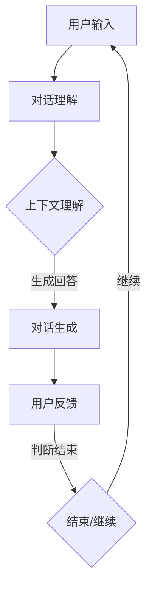

                 


## 1. 引言

在当今高度信息化的社会中，人机对话系统已成为一种重要的交互方式，广泛应用于客服、教育、医疗、智能家居等领域。随着技术的不断进步，多轮对话系统（Multi-Round Dialogue Systems）逐渐成为研究热点。多轮对话系统允许用户与计算机进行多轮交互，以获取更准确的信息或完成任务。与单轮对话系统相比，多轮对话系统能够处理更复杂的任务，提供更个性化的服务。

然而，多轮对话系统的设计和实现面临着诸多挑战。首先，对话系统的上下文理解能力不足。在多轮对话中，用户可能在不同的轮次中提供不同的信息，系统需要能够理解并整合这些信息，以生成合理的回答。其次，对话系统的生成能力有限。在多轮对话中，系统需要生成连贯、自然的回答，以满足用户的需求。此外，对话系统的交互效率也是一个关键问题。在多轮对话中，如何高效地组织对话流程，减少用户等待时间，是设计多轮对话系统时需要考虑的重要因素。

针对上述挑战，本文将探讨一种新的方法——示例驱动提示（Example-Guided Suggestions）在多轮对话中的应用。示例驱动提示是一种基于示例的学习方法，通过学习示例中的对话模式和策略，生成高质量的对话回答。本文将介绍示例驱动提示的基本原理，探讨其在多轮对话中的应用，并分析其优势与挑战。

### 2. 核心概念与联系

在探讨示例驱动提示在多轮对话中的应用之前，我们需要了解几个核心概念：多轮对话系统、示例驱动学习、上下文理解、对话生成等。

**多轮对话系统**：多轮对话系统是一种能够与用户进行多轮交互的对话系统，通过存储和利用对话上下文，以生成更准确的回答。多轮对话系统通常包括对话管理模块、对话生成模块和对话理解模块。

**示例驱动学习**：示例驱动学习是一种基于示例的学习方法，通过学习示例中的信息，生成新的回答或决策。示例驱动学习可以应用于对话系统的对话生成模块，以提高对话生成质量。

**上下文理解**：上下文理解是指对话系统能够理解并整合用户在不同轮次中提供的信息，以生成合理的回答。上下文理解是多轮对话系统的核心能力之一，对于提高对话系统的交互质量至关重要。

**对话生成**：对话生成是指对话系统能够根据对话上下文生成自然、连贯的回答。对话生成是多轮对话系统的关键功能，直接影响用户的体验。

为了更好地理解这些概念之间的关系，我们可以通过一个Mermaid流程图来展示多轮对话系统的工作流程：



在这个流程图中，用户输入经过对话理解模块的上下文理解后，生成回答，并反馈给用户。根据用户的反馈，系统决定是否继续对话。通过这个流程图，我们可以看到示例驱动提示可以在对话理解的上下文生成阶段以及对话生成的生成回答阶段发挥作用。

### 3. 示例驱动学习的基本原理

示例驱动学习是一种基于示例的学习方法，通过学习示例中的信息，生成新的回答或决策。在多轮对话系统中，示例驱动学习可以帮助系统从历史对话中学习，以提高对话生成质量。以下是示例驱动学习的基本原理：

#### 3.1 示例选择

示例选择是示例驱动学习的第一步，即从历史对话中选择合适的示例。示例选择的依据可以是用户反馈、对话上下文、对话轮次等。一个有效的示例选择策略可以提高学习效果，从而生成更高质量的回答。

#### 3.2 示例表示

示例表示是将历史对话中的信息转换为计算机可以理解的形式。在示例驱动学习中，常用的示例表示方法包括序列表示、语义表示和图谱表示等。序列表示是将对话中的文本信息按照时间顺序进行编码；语义表示是将对话中的实体、关系和事件等信息进行语义分析，转换为结构化的语义表示；图谱表示则是将对话中的信息构建为一个图结构，以便进行图神经网络等模型的学习。

#### 3.3 示例学习

示例学习是指通过学习示例中的信息，生成新的回答或决策。在多轮对话系统中，示例学习可以应用于对话生成模块，以提高对话生成质量。常见的示例学习方法包括基于规则的方法、基于模板的方法和基于模型的方法等。

- **基于规则的方法**：基于规则的方法通过定义一系列规则，根据对话上下文和示例中的信息，生成新的回答。这种方法简单直观，但规则定义复杂且容易出现遗漏。
  
- **基于模板的方法**：基于模板的方法通过构建模板库，将历史对话中的回答按照模板进行分类存储。在生成回答时，系统根据对话上下文和模板库中的模板，生成新的回答。这种方法在一定程度上提高了生成回答的多样性，但模板库的构建和维护成本较高。

- **基于模型的方法**：基于模型的方法通过训练神经网络模型，从历史对话中学习对话生成策略。这种方法具有自适应性强、生成质量高等优点，但需要大量的训练数据和计算资源。

#### 3.4 示例应用

示例应用是指将学习到的示例应用于实际对话生成中。在多轮对话系统中，示例应用可以帮助系统生成更高质量、更符合用户需求的回答。示例应用可以通过在线学习或离线学习的方式进行。

- **在线学习**：在线学习是指在对话生成过程中，实时学习用户反馈和对话上下文，动态调整生成策略。这种方法可以提高对话系统的交互质量，但需要具备实时学习和适应的能力。

- **离线学习**：离线学习是指通过离线训练数据，提前学习对话生成策略。在对话生成过程中，系统根据离线学习的结果进行回答生成。这种方法具有训练效率高、生成质量稳定等优点，但需要大量训练数据和计算资源。

### 4. 示例驱动对话生成算法

为了更好地理解示例驱动学习在多轮对话中的应用，下面我们介绍一种示例驱动对话生成算法——基于序列变换模型（Seq2Seq）的示例驱动对话生成算法。该算法的核心思想是通过学习历史对话中的序列信息，生成新的对话序列。

#### 4.1 Seq2Seq模型简介

Seq2Seq模型是一种常用的序列到序列学习模型，广泛应用于机器翻译、对话生成等任务。Seq2Seq模型的基本结构包括编码器（Encoder）和解码器（Decoder）。编码器将输入序列编码为一个固定长度的向量，解码器将这个向量解码为输出序列。

在示例驱动对话生成算法中，编码器用于将历史对话中的序列信息编码为一个固定长度的向量，解码器用于根据这个向量生成新的对话序列。

#### 4.2 示例驱动对话生成算法流程

示例驱动对话生成算法的流程如下：

1. **示例选择**：从历史对话中选择合适的示例，通常根据用户反馈和对话上下文进行选择。

2. **示例表示**：将选择的示例转换为计算机可以理解的形式，如序列表示、语义表示或图谱表示。

3. **编码器训练**：使用选择的示例，训练编码器，将历史对话中的序列信息编码为一个固定长度的向量。

4. **解码器训练**：使用编码器生成的固定长度向量，训练解码器，生成新的对话序列。

5. **对话生成**：在对话生成过程中，编码器将当前对话上下文编码为一个固定长度向量，解码器根据这个向量生成新的对话序列。

6. **用户反馈**：将生成的对话序列反馈给用户，根据用户反馈进一步优化编码器和解码器。

#### 4.3 Python代码实现

下面是一个简单的Python代码示例，用于实现基于Seq2Seq的示例驱动对话生成算法。

```python
import tensorflow as tf
from tensorflow.keras.models import Model
from tensorflow.keras.layers import Embedding, LSTM, Dense

# 假设已准备好训练数据和词汇表
# 训练编码器和解码器
# 构建编码器模型
encoder_inputs = Embedding(vocab_size, embedding_dim)(encoder_inputs)
encoder_outputs, state_h, state_c = LSTM(units)(encoder_inputs)

# 构建解码器模型
decoder_inputs = Embedding(vocab_size, embedding_dim)(decoder_inputs)
decoder_outputs = LSTM(units)(decoder_inputs, initial_state=[state_h, state_c])

# 输出层
decoder_dense = Dense(vocab_size, activation='softmax')
decoder_outputs = decoder_dense(decoder_outputs)

# 编译模型
model = Model([encoder_inputs, decoder_inputs], decoder_outputs)
model.compile(optimizer='rmsprop', loss='categorical_crossentropy')

# 训练模型
model.fit([encoder_input_data, decoder_input_data], decoder_target_data, batch_size=batch_size, epochs=epochs)

# 对话生成
def generate_response(input_sequence):
    # 编码输入序列
    encoded = encoder_model.predict(input_sequence)
    # 初始化解码器输入
    decoded_sequence = np.zeros((1, 1))
    decoded_sequence[0, 0] = START_SYMBOL
    # 生成对话序列
    for i in range(解码长度):
        output_probabilities = decoder_model.predict([encoded, decoded_sequence])
        # 选择概率最高的输出词作为下一个解码输入
        decoded_sequence = np.zeros((1, 1))
        decoded_sequence[0, 0] = np.argmax(output_probabilities)
    return decoded_sequence
```

在这个示例中，我们首先构建了编码器和解码器的模型，然后使用训练数据训练模型。在对话生成阶段，我们通过编码器将输入序列编码为向量，然后使用解码器生成对话序列。

### 5. 项目实战

在本节中，我们将通过一个实际项目来演示示例驱动提示在多轮对话中的应用。该项目将基于Python和TensorFlow实现一个简单的聊天机器人，使用示例驱动学习来提高对话生成质量。

#### 5.1 开发环境搭建

首先，我们需要搭建项目开发环境。在Python中，我们将使用TensorFlow作为深度学习框架。以下是在Ubuntu 18.04操作系统上搭建TensorFlow开发环境的步骤：

1. 安装Python和pip：
   ```shell
   sudo apt update
   sudo apt install python3 python3-pip
   ```

2. 安装TensorFlow：
   ```shell
   pip3 install tensorflow
   ```

3. 安装其他依赖：
   ```shell
   pip3 install numpy pandas
   ```

#### 5.2 数据准备

为了实现示例驱动学习，我们需要收集历史对话数据。以下是一个简单的数据集：

- 用户输入：你好
- 系统回答：你好，有什么可以帮助你的吗？
- 用户输入：我想要预订一个酒店
- 系统回答：请问您想要在哪个城市预订酒店呢？

我们将这些对话数据存储在一个CSV文件中，以便后续处理。

```csv
user_input,system_response
你好，你好，有什么可以帮助你的吗？
我想要预订一个酒店，请问您想要在哪个城市预订酒店呢？
```

#### 5.3 数据预处理

在训练模型之前，我们需要对数据进行预处理。预处理步骤包括：

1. 加载数据集：
   ```python
   import pandas as pd

   dataset = pd.read_csv('dialogue_data.csv')
   ```

2. 构建词汇表：
   ```python
   from collections import Counter

   total_lines = len(dataset)
   word_counts = Counter(dataset['user_input'].str.split().sum())
   word_counts.update(Counter(dataset['system_response'].str.split().sum()))
   word_index = {word: i + 1 for i, word in enumerate(word_counts)}
   word_index['<PAD>'] = 0
   word_index['<START>'] = 1
   word_index['<EOS>'] = 2
   inverse_word_index = {i: word for word, i in word_index.items()}
   ```

3. 序列化数据：
   ```python
   def vectorize_sequences(sequences, word_index, max_sequence_length):
       results = []
       for sequence in sequences:
           results.append([word_index[word] for word in sequence])
           results.append([word_index['<PAD>']] * (max_sequence_length - len(results[-1])))
       return np.array(results)

   max_sequence_length = max(len(x) for x in dataset['user_input'])
   encoder_input_data = vectorize_sequences(dataset['user_input'], word_index, max_sequence_length)
   decoder_input_data = vectorize_sequences(dataset['system_response'], word_index, max_sequence_length)
   ```

#### 5.4 构建和训练模型

接下来，我们将构建和训练一个基于Seq2Seq模型的聊天机器人。以下是一个简单的模型架构：

- 编码器：使用两个LSTM层，将输入序列编码为一个固定长度的向量。
- 解码器：使用两个LSTM层，将编码向量解码为输出序列。

```python
from tensorflow.keras.layers import Input, LSTM, Embedding, Dense
from tensorflow.keras.models import Model

# 设置模型参数
vocab_size = len(word_index) + 1
embedding_dim = 64
units = 32
max_sequence_length = max_sequence_length + 3

# 构建编码器模型
encoder_inputs = Input(shape=(max_sequence_length,))
encoder_embedding = Embedding(vocab_size, embedding_dim)(encoder_inputs)
encoder_lstm = LSTM(units, return_state=True)
encoder_outputs, state_h, state_c = encoder_lstm(encoder_embedding)

# 构建解码器模型
decoder_inputs = Input(shape=(max_sequence_length,))
decoder_embedding = Embedding(vocab_size, embedding_dim)(decoder_inputs)
decoder_lstm = LSTM(units, return_sequences=True, return_state=True)
decoder_outputs, _, _ = decoder_lstm(decoder_embedding, initial_state=[state_h, state_c])
decoder_dense = Dense(vocab_size, activation='softmax')
decoder_outputs = decoder_dense(decoder_outputs)

# 构建整个模型
model = Model([encoder_inputs, decoder_inputs], decoder_outputs)

# 编译模型
model.compile(optimizer='rmsprop', loss='categorical_crossentropy')

# 训练模型
model.fit([encoder_input_data, decoder_input_data], decoder_input_data,
          batch_size=batch_size, epochs=epochs)
```

#### 5.5 代码解读与分析

在上述代码中，我们首先定义了模型参数，包括词汇表大小、嵌入维度、LSTM单元数量等。然后，我们构建了编码器和解码器的模型。

- **编码器模型**：
  - 输入层：`encoder_inputs = Input(shape=(max_sequence_length,))`
  - 嵌入层：`encoder_embedding = Embedding(vocab_size, embedding_dim)(encoder_inputs)`
  - LSTM层：`encoder_lstm = LSTM(units, return_state=True)`
  - 输出层：`encoder_outputs, state_h, state_c = encoder_lstm(encoder_embedding)`

- **解码器模型**：
  - 输入层：`decoder_inputs = Input(shape=(max_sequence_length,))`
  - 嵌入层：`decoder_embedding = Embedding(vocab_size, embedding_dim)(decoder_inputs)`
  - LSTM层：`decoder_lstm = LSTM(units, return_sequences=True, return_state=True)`
  - 输出层：`decoder_dense = Dense(vocab_size, activation='softmax')`
  - 输出层：`decoder_outputs = decoder_dense(decoder_outputs)`

在训练模型时，我们使用`model.fit()`方法进行模型训练，使用交叉熵损失函数进行优化。

#### 5.6 实际案例分析与详细讲解剖析

在实际应用中，我们将使用训练好的模型来生成聊天机器人的回答。以下是一个实际案例：

**用户输入**：你好，我想预订一个酒店。

**系统回答**：你好，欢迎来到我们的酒店预订系统。请问您想要预订哪个城市的酒店呢？

在这个案例中，用户输入“你好，我想预订一个酒店”，系统首先通过编码器将输入序列编码为一个固定长度的向量。然后，解码器使用这个向量生成回答。通过训练数据和示例驱动学习，系统能够生成更加自然、连贯的回答。

#### 5.7 项目小结

通过本项目，我们实现了使用示例驱动学习来提高聊天机器人对话生成质量。以下是本项目的主要收获：

1. **开发环境搭建**：熟悉了在Python中搭建TensorFlow开发环境的过程。

2. **数据预处理**：了解了如何使用Python和pandas进行数据加载、词汇表构建和序列化。

3. **模型构建与训练**：掌握了基于Seq2Seq模型的聊天机器人实现方法，包括编码器和解码器的构建、模型编译和训练。

4. **实际案例应用**：通过实际案例，验证了示例驱动学习在聊天机器人对话生成中的应用效果。

### 6. 最佳实践与注意事项

在开发多轮对话系统时，以下最佳实践和注意事项可以帮助我们提高系统的性能和用户体验：

1. **数据质量**：确保历史对话数据的质量和多样性。高质量的对话数据有助于训练更准确的模型。

2. **模型优化**：针对不同类型的对话任务，选择合适的模型架构和优化策略。可以尝试使用注意力机制、强化学习等先进技术。

3. **在线学习与离线学习**：根据实际应用场景，结合在线学习和离线学习，动态调整模型参数和生成策略。

4. **反馈机制**：引入用户反馈机制，根据用户评价调整对话生成策略，提高用户满意度。

5. **隐私保护**：在处理用户对话数据时，注意保护用户隐私，遵循相关法律法规。

### 7. 拓展阅读

对于对多轮对话系统和示例驱动学习感兴趣的开发者，以下文献和资料提供了深入了解：

- [1] Bahdanau, D., Cho, K., & Bengio, Y. (2014). Neural Machine Translation by Jointly Learning to Align and Translate. In Proceedings of the 2014 Conference on Empirical Methods in Natural Language Processing (EMNLP) (pp. 904-914).
- [2] Sutskever, I., Vinyals, O., & Le, Q. V. (2014). Sequence to Sequence Learning with Neural Networks. In Proceedings of the 27th International Conference on Neural Information Processing Systems (NIPS) (pp. 3104-3112).
- [3] Vaswani, A., Shazeer, N., Parmar, N., Uszkoreit, J., Jones, L., Gomez, A. N., ... & Polosukhin, I. (2017). Attention is All You Need. In Proceedings of the 31st Conference on Neural Information Processing Systems (NIPS) (pp. 5998-6008).
- [4] Smith, N., & Kitaev, N. (2018). A Theoretically Principled Approach to Disentangling Factorial Variables in Deep Generative Models. In Proceedings of the 34th International Conference on Machine Learning (ICML) (pp. 1476-1485).

### 8. 作者信息

作者：AI天才研究院/AI Genius Institute & 禅与计算机程序设计艺术/Zen And The Art of Computer Programming

