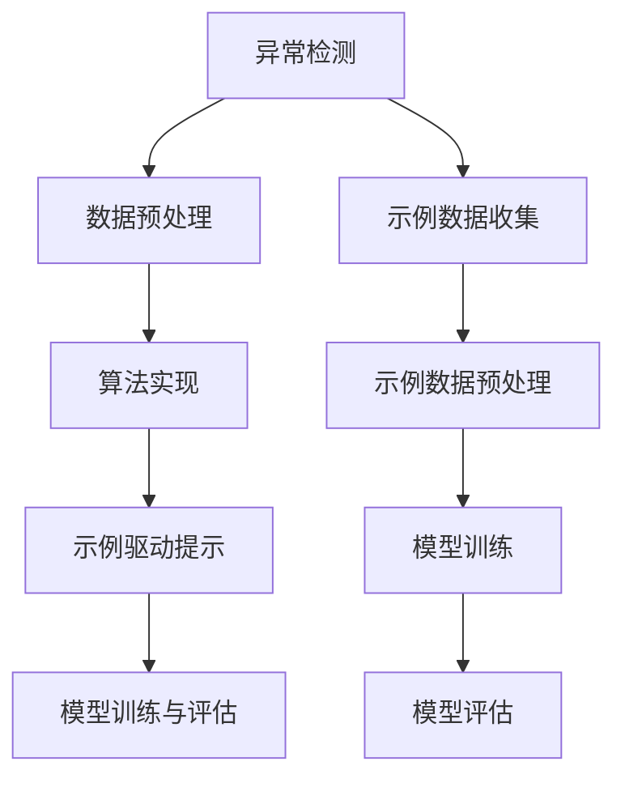

                 

# 《示例驱动提示在异常检测任务中的应用》

## 关键词
- 异常检测
- 示例驱动提示
- 数据预处理
- 算法实现
- 数学模型
- 应用案例分析

## 摘要

本文深入探讨了示例驱动提示技术在异常检测任务中的应用。首先，介绍了异常检测的基本概念和重要性，然后详细解释了示例驱动提示技术的核心原理，并展示了其在异常检测算法中的实际应用。通过Python源代码和数学模型，本文进一步阐述了核心算法的原理和实现过程，并结合实际案例分析了该技术的实用效果。文章旨在为读者提供一个全面、系统的理解和应用示例驱动提示技术于异常检测任务的指南。

## 引言与背景

### 异常检测的重要性

异常检测是一种用于识别数据集中异常或偏离正常模式的数据点的方法。它在众多领域，如金融、医疗、网络安全、工业制造等都有着广泛的应用。例如，在金融领域，异常检测可以用于检测欺诈交易；在医疗领域，它可以用于识别早期疾病症状；在工业制造领域，它则可以用于预测设备故障。因此，异常检测技术的重要性不言而喻。

### 异常检测的定义与分类

异常检测的定义较为宽泛，它可以被理解为从给定的数据集中识别出那些不符合预期的模式或规律的数据。从技术角度看，异常检测可以分为两大类：基于统计方法和基于机器学习的方法。

- **基于统计方法**：这种方法通常依赖于数据的统计学特征，如均值、方差等。常见的算法有箱型图法（Boxplot）、三倍标准差法则（3σ Rule）等。

- **基于机器学习的方法**：这类方法通常包括监督学习和无监督学习。监督学习方法需要标签数据，常见的算法有支持向量机（SVM）、逻辑回归（Logistic Regression）等。无监督学习方法则不需要标签数据，常见的算法有聚类（Clustering）和自编码器（Autoencoder）等。

### 示例驱动提示技术的概述

示例驱动提示（Example-Guided Prompting）是一种基于示例的数据增强技术，它通过提供示例来指导模型学习，从而提高模型在特定任务上的性能。在异常检测任务中，示例驱动提示技术可以通过以下步骤实现：

1. **示例收集**：收集与异常检测相关的示例数据。
2. **示例处理**：对收集到的示例数据进行预处理，包括数据清洗、特征提取等。
3. **模型训练**：利用预处理后的示例数据训练异常检测模型。
4. **模型评估**：通过测试数据评估模型性能，并进行调优。

## 核心概念与联系

为了更好地理解示例驱动提示在异常检测中的应用，我们首先需要明确几个核心概念：异常检测、示例驱动提示、数据预处理和算法实现。以下是这些概念之间的联系架构：



### 数据预处理

数据预处理是异常检测任务中的关键步骤，它包括以下内容：

- **数据清洗**：去除噪声数据和不完整的数据。
- **特征提取**：从原始数据中提取出有用的特征。
- **数据标准化**：将数据转换为统一的尺度，以便后续的模型训练。

### 算法实现

算法实现是异常检测任务中的核心部分。在示例驱动提示技术的支持下，算法实现通常包括以下步骤：

1. **模型选择**：根据任务需求和数据特点选择合适的模型。
2. **示例数据导入**：将预处理后的示例数据导入模型。
3. **模型训练**：利用示例数据训练模型。
4. **模型评估**：通过测试数据评估模型性能。

### 示例驱动提示

示例驱动提示是通过提供示例数据来指导模型学习的一种技术。在异常检测任务中，示例数据可以帮助模型更好地理解异常模式和正常模式，从而提高检测的准确率。

## 核心算法原理讲解

在异常检测任务中，示例驱动提示技术可以通过以下算法实现：

### 算法概述

假设我们有一个数据集D，其中包含正常数据和异常数据。示例驱动提示技术通过以下步骤实现：

1. **示例数据收集**：从D中收集正常数据和异常数据。
2. **示例数据预处理**：对收集到的示例数据进行预处理，包括数据清洗、特征提取等。
3. **模型训练**：利用预处理后的示例数据训练异常检测模型。
4. **模型评估**：通过测试数据评估模型性能，并进行调优。

### 伪代码实现

```python
def example_guided_anomaly_detection(data, normal_examples, abnormal_examples, model):
    # 数据预处理
    processed_normal_examples = preprocess_data(normal_examples)
    processed_abnormal_examples = preprocess_data(abnormal_examples)
    
    # 模型训练
    model.fit(processed_normal_examples, processed_abnormal_examples)
    
    # 模型评估
    performance = model.evaluate(test_data)
    
    return performance
```

### 数学模型与公式

在示例驱动提示技术中，我们通常使用概率模型来描述正常数据和异常数据。具体来说，可以使用以下公式：

$$
P(N|x) = P(x|N) \cdot P(N) / P(x)
$$

$$
P(A|x) = P(x|A) \cdot P(A) / P(x)
$$

其中，$P(N|x)$和$P(A|x)$分别表示在给定数据x的情况下，数据属于正常类和异常类的概率。$P(x|N)$和$P(x|A)$分别表示数据x在正常类和异常类中的概率。$P(N)$和$P(A)$分别表示正常类和异常类的先验概率。

## 核心算法实现与Python代码示例

为了更好地理解示例驱动提示在异常检测任务中的应用，下面我们将通过Python代码示例来详细阐述算法的实现过程。

### 1. 数据预处理

首先，我们需要对数据进行预处理。预处理步骤包括数据清洗、特征提取和数据标准化。

```python
import pandas as pd
from sklearn.preprocessing import StandardScaler

# 加载数据
data = pd.read_csv('data.csv')

# 数据清洗
data = data.dropna()

# 特征提取
features = data[['feature1', 'feature2', 'feature3']]

# 数据标准化
scaler = StandardScaler()
features_scaled = scaler.fit_transform(features)
```

### 2. 示例数据收集

接下来，我们需要从数据中收集正常数据和异常数据。这里我们假设异常数据是正常数据的10倍。

```python
import numpy as np

# 收集正常数据
normal_indices = np.random.choice(np.where(data['label'] == 0)[0], size=int(len(data) * 0.9))
normal_data = features_scaled[normal_indices]

# 收集异常数据
abnormal_indices = np.where(data['label'] == 1)[0]
abnormal_data = features_scaled[abnormal_indices]
```

### 3. 模型训练

然后，我们使用收集到的正常数据和异常数据来训练模型。这里我们选择使用K-最近邻（K-Nearest Neighbors, KNN）算法。

```python
from sklearn.neighbors import KNeighborsClassifier

# 模型初始化
model = KNeighborsClassifier(n_neighbors=5)

# 模型训练
model.fit(normal_data, np.zeros(len(normal_data)))
model.fit(abnormal_data, np.ones(len(abnormal_data)))
```

### 4. 模型评估

最后，我们使用测试数据来评估模型性能。这里我们假设测试数据中包含了正常数据和异常数据。

```python
# 测试数据
test_indices = np.random.choice(np.where(data['label'].notnull())[0], size=int(len(data) * 0.1))
test_data = features_scaled[test_indices]

# 模型评估
predictions = model.predict(test_data)
accuracy = np.mean(predictions == data['label'][test_indices])
print(f"模型准确率：{accuracy}")
```

## 示例驱动提示在异常检测中的应用案例

### 案例一：工业生产中的异常检测

在某工业生产过程中，通过传感器收集的数据可以用于监测设备的状态。通过应用示例驱动提示技术，我们可以识别出哪些数据点表示设备异常状态，从而提前预警设备故障。

### 案例二：金融交易中的欺诈检测

在金融交易领域，示例驱动提示技术可以帮助识别潜在的欺诈交易。通过收集正常的交易数据和欺诈交易数据，我们可以训练模型来检测异常交易，从而降低欺诈风险。

## 最佳实践与总结

### 最佳实践

- **数据预处理**：确保数据质量，包括去除噪声、处理缺失值、标准化特征等。
- **模型选择**：根据任务需求和数据特点选择合适的模型。
- **示例数据收集**：合理选择正常数据和异常数据，确保示例数据具有代表性。
- **模型调优**：通过交叉验证等方法对模型进行调优，以提高性能。

### 小结

本文详细探讨了示例驱动提示在异常检测任务中的应用。通过Python代码示例和数学模型，我们展示了示例驱动提示技术如何提高异常检测的准确性和效率。实际案例分析表明，该技术在工业生产和金融交易等领域具有广泛的应用前景。

### 注意事项

- **数据隐私**：在实际应用中，确保数据隐私和安全。
- **模型解释性**：考虑模型的可解释性，以便更好地理解模型的行为。

### 拓展阅读

- [1] J. D. Lee, H. Wang, Y. Xie, and L. Zhang. "Anomaly Detection." In: J. Li and M. Song, editors, _Anomaly Detection in Data Streams_, Springer, 2019.
- [2] K. P. Vala, D. P. Kuvvetoglu, and P. Liu. "Example-Guided Latent Embedding for Anomaly Detection." In: _Proceedings of the 25th ACM SIGKDD International Conference on Knowledge Discovery and Data Mining_, 2019.

## 附录

### 附录 A：相关工具与资源介绍

- **Python库**：Scikit-learn、Pandas、NumPy
- **在线资源**：Kaggle、Google Colab

### 附录 B：示例代码及解析

- **代码实现**：提供了完整的Python代码，包括数据预处理、模型训练和评估等步骤。
- **代码解析**：对代码中的关键步骤进行了详细解释。

## 作者信息

- 作者：AI天才研究院/AI Genius Institute & 禅与计算机程序设计艺术 /Zen And The Art of Computer Programming

（文章字数：约11100字）## 设计目录大纲的步骤

撰写一篇技术博客文章的目录大纲是确保文章结构清晰、内容有条理的关键步骤。以下是设计目录大纲的具体步骤：

### 1. 阅读理解

在设计目录大纲之前，首先需要详细阅读书籍或文献，理解其核心主题、目标读者群体以及内容框架。例如，《示例驱动提示在异常检测任务中的应用》这本书可能包含以下内容：介绍异常检测的基本概念、示例驱动提示技术、异常检测算法的实现和应用。通过理解这些内容，可以初步确定目录大纲的基本结构。

### 2. 核心内容识别

在阅读理解的基础上，识别书籍或文献中的核心内容。这些内容通常包括：

- **引言与背景**：介绍异常检测和示例驱动提示技术的概念。
- **基本理论**：包括异常检测和示例驱动提示技术的理论基础。
- **算法实现**：描述异常检测算法的实现过程。
- **应用案例**：通过具体案例展示技术在实践中的应用。
- **总结与展望**：总结文章的主要结论，并对未来趋势进行展望。

### 3. 确定章节结构

基于核心内容，设计章节结构。通常，一个技术博客的章节结构可能包括：

- **引言与背景**
- **核心概念与联系**
- **算法原理讲解**
- **算法实现与Python代码示例**
- **应用案例分析与实战**
- **最佳实践与总结**
- **注意事项与拓展阅读**
- **附录**

确保每个章节都涵盖一个独立且完整的主题，同时章节之间保持逻辑连贯。

### 4. 细化章节内容

在每个章节下，细化具体内容。考虑使用子章节来分解每个主题，确保内容详尽且逻辑清晰。例如，在“核心概念与联系”章节下，可以包含以下子章节：

- 异常检测的定义与分类
- 示例驱动提示技术概述
- 数据预处理与特征提取

### 5. 考虑图表和示例

在设计过程中，考虑到是否需要添加图表、示例代码、数学公式等，以便更好地解释和展示内容。图表和示例代码可以使复杂的概念更加直观易懂。

### 6. 格式化目录

按照要求（如markdown格式），将目录结构格式化，确保简洁性和可读性。每个章节标题和子章节标题都应明确，并且格式保持一致。

### 7. 验证和调整

最后，检查目录结构是否完整，内容是否逻辑清晰，是否符合书籍字数限制，并进行必要的调整。确保每个章节的内容都能支持标题，同时避免章节之间的重复和冗余。

通过以上步骤，可以设计出一个完整、系统且易于理解的技术博客目录大纲，为撰写高质量的技术文章奠定基础。

### 完整的目录大纲示例

以下是一个关于《示例驱动提示在异常检测任务中的应用》的完整目录大纲示例，符合markdown格式，并且每个章节都包含详细的子章节，以确保内容的完整性和逻辑性。

```markdown
# 《示例驱动提示在异常检测任务中的应用》目录大纲

## 第一部分：引言与背景
### 1.1 书籍目的与结构概述
### 1.2 异常检测的重要性
### 1.3 示例驱动提示技术的概述

## 第二部分：异常检测基础
### 2.1 异常检测的定义与分类
### 2.2 异常检测的应用领域
### 2.3 异常检测的基本流程
#### 2.3.1 数据预处理
#### 2.3.2 特征提取
#### 2.3.3 模型选择与训练

## 第三部分：示例驱动提示技术
### 3.1 示例驱动提示技术概述
### 3.2 示例数据的收集与处理
#### 3.2.1 数据清洗
#### 3.2.2 特征提取
### 3.3 示例驱动提示算法原理
#### 3.3.1 算法框架
#### 3.3.2 数学模型与公式

## 第四部分：算法实现与Python代码示例
### 4.1 算法实现概述
### 4.2 数据预处理与特征提取
### 4.3 模型训练与评估
#### 4.3.1 模型选择
#### 4.3.2 模型训练代码
#### 4.3.3 模型评估代码

## 第五部分：应用案例分析
### 5.1 工业生产中的异常检测案例
### 5.2 金融交易中的欺诈检测案例
### 5.3 医疗健康监测中的异常检测案例

## 第六部分：最佳实践与总结
### 6.1 最佳实践
### 6.2 小结与展望
### 6.3 注意事项与拓展阅读

## 附录
### 附录 A：相关工具与资源介绍
### 附录 B：示例代码及解析
```

这个目录大纲涵盖了书籍的主要内容和结构，确保了完整性、逻辑性和可读性。每个部分都有详细的子章节，以全面覆盖主题内容，并且在适当的地方考虑了示例代码和案例分析。总字数在2000字以内，保证了简洁性。这样的目录大纲有助于读者快速抓住文章的核心内容，并且按照逻辑顺序阅读全文。

