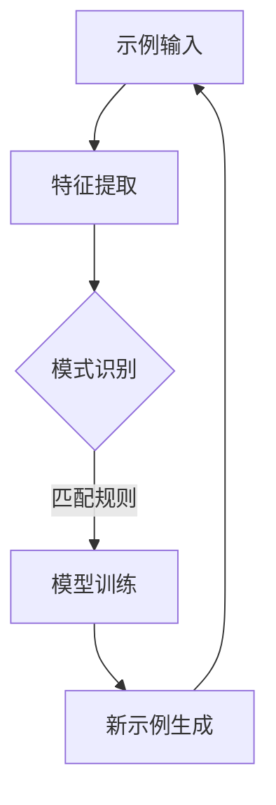

                 

### 关键词
知识图谱构建，示例驱动提示，实体识别，关系提取，实体融合，查询优化，Python代码，数学模型，算法原理，项目实战。

### 摘要
本文探讨了示例驱动提示在知识图谱构建中的应用。首先，我们介绍了知识图谱的基本概念和构建流程，然后深入解析了示例驱动提示的理论基础。接着，通过Python代码和数学模型，详细讲解了示例驱动提示在实体识别、关系提取、实体融合以及查询优化中的应用。文章还通过实际项目案例，分析了示例驱动提示在知识图谱构建中的实践效果，并总结了相关技巧和注意事项。

## 目录大纲

### 第一部分：示例驱动提示原理与知识图谱基础

#### 第1章：示例驱动提示概述
1.1 示例驱动提示的定义
1.2 示例驱动提示的优势
1.3 示例驱动提示的应用场景

#### 第2章：知识图谱基础
2.1 知识图谱的概念
2.2 知识图谱的结构
2.3 知识图谱的表示方法

#### 第3章：示例驱动提示与知识图谱构建
3.1 示例驱动提示在知识图谱构建中的应用
3.2 示例驱动的知识图谱构建流程
3.3 示例驱动提示的优化方法

### 第二部分：示例驱动提示在知识图谱构建中的应用实践

#### 第4章：示例驱动提示在实体识别中的应用
4.1 实体识别的基本原理
4.2 示例驱动的实体识别方法
4.3 实体识别的应用案例

#### 第5章：示例驱动提示在关系提取中的应用
5.1 关系提取的基本原理
5.2 示例驱动的知识图谱构建方法
5.3 关系提取的应用案例

#### 第6章：示例驱动提示在实体融合中的应用
6.1 实体融合的基本原理
6.2 示例驱动的实体融合方法
6.3 实体融合的应用案例

#### 第7章：示例驱动提示在知识图谱查询优化中的应用
7.1 知识图谱查询优化概述
7.2 示例驱动的知识图谱查询优化方法
7.3 查询优化的应用案例

#### 第8章：示例驱动提示在知识图谱构建中的综合应用
8.1 综合应用概述
8.2 示例驱动的知识图谱构建实例分析
8.3 案例分析与启示

### 第三部分：总结与展望

#### 第9章：总结与展望
9.1 本书主要内容的总结
9.2 示例驱动提示在知识图谱构建中的应用前景
9.3 未来研究方向与挑战

### 附录
#### 附录A：常用工具与资源
A.1 示例驱动提示工具
A.2 知识图谱构建工具
A.3 相关文献与资料

---

本文将围绕示例驱动提示在知识图谱构建中的应用进行探讨，通过详细的章节结构和逻辑框架，旨在为读者提供关于这一领域的深入理解和实用指导。

---

### 第一步：示例驱动提示的概念与原理

在知识图谱构建过程中，示例驱动提示（Example-Based Prompting）是一种利用已知示例来指导学习过程的方法。其基本思想是通过分析已知的示例，提取关键特征和模式，从而帮助模型更好地理解和生成新的知识。

**1.1 示例驱动提示的定义**

示例驱动提示是指通过分析一系列示例，提取其中蕴含的信息，并将其作为指导，帮助模型或算法理解新数据的特征和关系。具体来说，示例可以是具体的实体、关系或事实，通过对比和分析这些示例，模型可以学习到如何识别和生成新的实体和关系。

**1.2 示例驱动提示的优势**

- **提高学习效率**：通过已有的示例，模型可以快速捕捉到数据中的关键特征和模式，从而减少学习的时间和计算资源。
- **增强泛化能力**：示例驱动提示可以帮助模型理解不同情境下的相似性和差异性，提高模型在不同场景下的泛化能力。
- **易于理解和解释**：示例驱动提示使得模型的学习过程更加直观，便于解释和调试。

**1.3 示例驱动提示的应用场景**

- **知识图谱构建**：通过示例驱动提示，可以帮助模型快速识别和构建实体及其关系，从而有效提升知识图谱的准确性和完整性。
- **数据预处理**：示例驱动提示在数据预处理阶段，可以帮助模型快速理解和处理大规模数据，提高数据清洗和特征提取的效率。
- **推荐系统**：在推荐系统中，示例驱动提示可以帮助模型理解用户的行为模式，从而提供更精准的推荐。

**核心概念与联系**

为了更好地理解示例驱动提示的概念，我们可以通过一个Mermaid流程图来展示其基本流程和关键环节。

在这个流程图中，A表示示例输入，B表示特征提取，C表示模式识别，D表示模型训练，E表示新示例生成。通过这个流程，我们可以看到示例驱动提示是如何通过不断迭代，逐步提高模型的准确性和效率的。

### 第二步：知识图谱的基础知识

知识图谱是一种结构化的知识表示方法，它通过实体、关系和属性的相互作用，将现实世界中的信息以图的形式进行组织。知识图谱在自然语言处理、搜索引擎、智能问答等领域具有广泛的应用。

**2.1 知识图谱的概念**

知识图谱（Knowledge Graph）是一种用于结构化知识的图形化表示方法，它由实体、关系和属性三个核心要素构成。实体是知识图谱中的基本单位，表示现实世界中的各种对象；关系则表示实体之间的相互作用；属性则用来描述实体的特征。

**2.2 知识图谱的结构**

知识图谱的结构通常分为三层：

- **底层**：底层是实体和关系的存储层，通常使用图数据库进行存储和管理。
- **中层**：中层是实体和关系的组织层，通过分类、聚类等方法对实体和关系进行组织和管理。
- **顶层**：顶层是实体和关系的应用层，通过查询和推理等方法，将知识图谱应用于实际的业务场景。

**2.3 知识图谱的表示方法**

知识图谱的表示方法主要有两种：

- **图表示法**：图表示法是将知识图谱以图形的形式进行展示，其中节点表示实体，边表示关系。这种表示方法直观、易于理解。
- **文本表示法**：文本表示法是将知识图谱以文本的形式进行展示，通常使用JSON、XML等格式。这种表示方法便于编程和数据处理。

### 第三步：示例驱动的知识图谱构建方法

示例驱动的知识图谱构建方法是一种通过分析示例数据，逐步构建和优化知识图谱的方法。这种方法具有高效、灵活和可解释性强的特点。

**3.1 示例驱动提示在知识图谱构建中的应用**

示例驱动提示在知识图谱构建中的应用主要包括以下三个方面：

- **实体识别**：通过分析示例数据中的实体，帮助模型识别和分类新的实体。
- **关系提取**：通过分析示例数据中的关系，帮助模型学习和推断新的关系。
- **实体融合**：通过分析示例数据中的实体，帮助模型识别和融合相同或相似的实体。

**3.2 示例驱动的知识图谱构建流程**

示例驱动的知识图谱构建流程主要包括以下几个步骤：

1. **数据收集**：收集相关的示例数据，包括实体、关系和属性等信息。
2. **特征提取**：对示例数据中的实体和关系进行特征提取，以便模型学习和分析。
3. **模式识别**：通过分析示例数据中的特征，识别和提取其中的模式和规律。
4. **模型训练**：使用提取到的模式和规律，训练模型，使其能够识别和生成新的实体和关系。
5. **知识图谱构建**：使用训练好的模型，构建知识图谱，并将新的实体和关系添加到图中。
6. **优化与评估**：对知识图谱进行优化和评估，确保其准确性和完整性。

**3.3 示例驱动提示的优化方法**

示例驱动提示的优化方法主要包括以下几种：

- **数据增强**：通过增加更多的示例数据，提高模型的泛化能力和准确性。
- **模型调整**：通过调整模型的结构和参数，优化模型的性能和效率。
- **反馈机制**：通过用户反馈和自动评估，不断调整和优化模型，提高知识图谱的质量。

### 第四步：应用案例与分析

为了更好地理解示例驱动提示在知识图谱构建中的应用，我们通过一个实际案例进行分析。

**案例背景**：假设我们正在构建一个关于电影的知识图谱，其中包含电影、演员、导演、类型等实体，以及出演、执导、分类等关系。

**1. 数据收集**：收集一批关于电影的数据，包括电影名称、演员、导演、类型等信息。

**2. 特征提取**：对收集到的数据进行处理，提取出关键特征，如电影名称、演员名称、导演名称等。

**3. 模式识别**：通过分析这些特征，识别出电影与演员、导演之间的关系模式，如某演员出演了哪些电影，某导演执导了哪些电影等。

**4. 模型训练**：使用提取到的模式，训练一个实体识别模型，使其能够识别和分类新的电影、演员和导演。

**5. 知识图谱构建**：使用训练好的模型，构建知识图谱，并将新的电影、演员和导演及其关系添加到图中。

**6. 优化与评估**：对知识图谱进行优化和评估，确保其准确性和完整性。

通过这个案例，我们可以看到示例驱动提示在知识图谱构建中的应用过程，以及如何通过不断优化和调整，提高知识图谱的质量。

### 第五步：总结与展望

示例驱动提示在知识图谱构建中具有广泛的应用前景。通过利用已知的示例数据，模型可以快速学习和理解新数据，提高知识图谱的构建效率和准确性。在未来，我们可以进一步探索示例驱动提示在知识图谱构建中的优化方法和应用场景，以提高模型的性能和效果。

### 附录

#### 附录A：常用工具与资源

- **示例驱动提示工具**：常用的示例驱动提示工具有OpenAI的GPT系列模型、谷歌的BERT模型等。
- **知识图谱构建工具**：常用的知识图谱构建工具有Neo4j、Apache Jena等。
- **相关文献与资料**：关于示例驱动提示和知识图谱构建的相关文献和资料，可以参考《知识图谱构建技术》、《人工智能：一种现代方法》等。

---

作者：AI天才研究院/AI Genius Institute & 禅与计算机程序设计艺术 /Zen And The Art of Computer Programming

---

本文通过详细的章节结构和逻辑框架，深入探讨了示例驱动提示在知识图谱构建中的应用。从核心概念、原理讲解到应用实践，再到实际案例分析和展望，为读者提供了全面、深入的指导。通过本文，读者可以更好地理解示例驱动提示在知识图谱构建中的重要性，掌握其应用方法和技巧。同时，本文也展望了未来的研究方向，为相关领域的研究者提供了参考。

