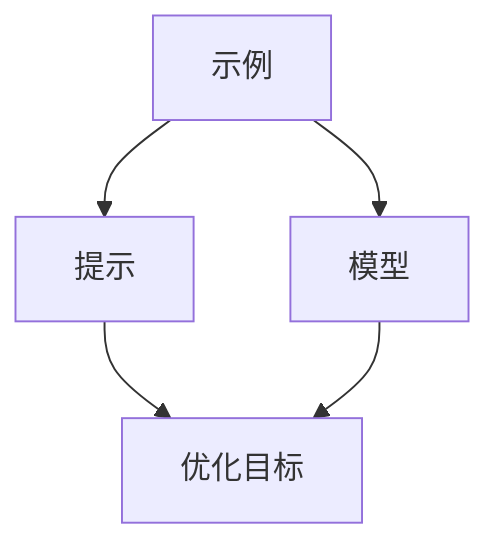
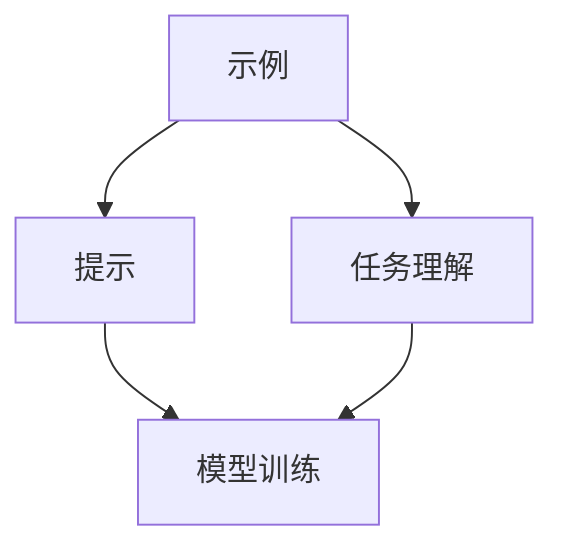

                 

### 第1章 引言

#### 1.1 书籍概述

《示例驱动提示工程：原理与实践》是一本旨在系统介绍示例驱动提示工程理论、方法与应用的专著。在当今人工智能和自然语言处理技术飞速发展的背景下，如何高效地生成高质量的自然语言处理模型输入提示成为了一个关键问题。示例驱动提示工程正是为了解决这一问题而诞生的一种新型方法。本书通过深入剖析示例驱动的理论基础、算法原理以及实际应用，为广大读者提供了一套完整且实用的指导方案。

#### 1.2 核心概念与联系

在介绍核心概念之前，我们首先需要明确示例驱动提示工程的基本组成部分。示例驱动（Example-Guided）方法是一种通过从大量示例中学习来优化模型性能的方法。具体而言，示例驱动提示工程涉及到以下几个核心概念：

1. **示例（Examples）**：示例是指一组用于训练模型的数据，这些数据可以是文本、图像或其他类型的输入。在示例驱动提示工程中，示例用于指导提示的生成，从而提高模型的输出质量。
2. **提示（Prompts）**：提示是输入给模型的信息，用于指导模型理解任务意图和期望输出。高质量的提示能够显著提高模型生成的自然语言文本质量。
3. **模型（Models）**：模型是指用于生成提示或执行自然语言处理的算法。在示例驱动提示工程中，模型可以是预训练的大型语言模型，如BERT、GPT等。
4. **优化目标（Objective）**：优化目标是指导模型生成高质量提示的准则。示例驱动提示工程通过从示例中学习，调整模型的优化目标，从而生成更有效的提示。

接下来，我们通过一个Mermaid流程图来展示这些核心概念之间的关系：



在这个流程图中，示例通过指导提示的生成，进而影响模型的优化目标。而模型则根据优化目标生成提示，形成了一个闭环反馈系统。

#### 1.3 目标与结构

本书的目标是让读者全面了解示例驱动提示工程的理论基础、算法原理及其在实际应用中的价值。为了达到这一目标，本书结构如下：

1. **引言**：介绍书籍的背景、目标以及结构。
2. **核心概念与联系**：详细阐述示例驱动提示工程的核心概念及其相互关系。
3. **示例驱动的理论基础**：讲解示例驱动方法的基本原理，包括示例收集、处理和利用等方面。
4. **核心算法原理**：介绍示例驱动提示工程的核心算法，包括基于机器学习的方法、深度学习的方法等。
5. **数学模型与公式**：介绍与示例驱动提示工程相关的数学模型和公式，并进行分析。
6. **项目实战**：通过实际代码案例，展示如何应用示例驱动提示工程。
7. **工具与资源**：提供相关工具和资源的介绍，帮助读者进一步学习。
8. **总结**：对全书内容进行回顾和总结，展望未来发展方向。

通过以上章节的安排，本书旨在帮助读者从理论到实践全面掌握示例驱动提示工程的方法和应用。

### 第2章 核心概念与联系

#### 2.1 示例驱动的定义

示例驱动（Example-Guided）方法是一种通过从大量示例中学习来优化模型性能的方法。在自然语言处理领域，示例驱动的核心思想是通过分析高质量的示例，生成能够指导模型生成高质量输出的提示。这种方法的优势在于，它能够利用现有的高质量数据，帮助模型快速适应新任务，从而提高模型的泛化能力和输出质量。

#### 2.2 提示工程的原理

提示工程（Prompt Engineering）是指创建引导模型生成高质量输出的提示的过程。在自然语言处理中，提示是输入给模型的信息，用于指导模型理解任务意图和期望输出。高质量的提示能够显著提高模型生成的自然语言文本质量。提示工程的原理主要包括以下几个方面：

1. **任务理解**：首先，模型需要理解任务的意图。通过分析任务描述和目标，模型能够明确需要生成什么样的输出。
2. **数据收集**：接着，收集与任务相关的数据。这些数据可以是已存在的文本、图像或其他类型的输入。
3. **示例分析**：分析这些数据中的高质量示例，提取有用的信息，用于指导提示的生成。
4. **提示生成**：根据任务理解和示例分析，生成能够引导模型生成高质量输出的提示。
5. **模型训练**：使用生成的提示训练模型，提高模型的输出质量。

#### 2.3 示例与提示的关系

示例和提示之间存在着密切的关系。示例是用于学习如何生成提示的数据，而提示则是用于引导模型生成输出的信息。具体而言，示例和提示的关系可以从以下几个方面进行理解：

1. **示例作为指导**：示例是生成提示的重要依据。通过分析示例，模型能够学习到如何生成能够引导模型生成高质量输出的提示。
2. **提示的针对性**：高质量的提示需要针对特定的任务和输出要求进行定制。示例驱动方法通过从大量示例中学习，能够生成更具有针对性的提示。
3. **示例的多样性**：示例的多样性对于提示工程至关重要。多样化的示例能够提供更丰富的信息，帮助模型生成更全面、更准确的提示。
4. **反馈与优化**：通过不断迭代示例和提示，模型能够不断优化提示的质量，从而提高模型的输出质量。

#### 2.4 Mermaid流程图展示

为了更好地展示示例驱动提示工程的核心概念及其相互关系，我们使用Mermaid流程图进行描述：



在这个流程图中，示例通过指导任务理解和模型训练，生成高质量的提示。提示则通过引导模型生成输出，形成一个闭环反馈系统。

### 第3章 示例驱动算法原理

#### 3.1 基础算法介绍

示例驱动提示工程的基础算法主要包括以下几种：

1. **统计模型**：基于统计方法生成提示。通过分析示例中的统计特征，如词频、词序列等，生成高质量的提示。
2. **机器学习模型**：基于机器学习方法生成提示。通过训练模型，学习如何从示例中提取有用信息，生成能够指导模型生成高质量输出的提示。
3. **深度学习模型**：基于深度学习方法生成提示。利用神经网络模型，学习从大量示例中提取复杂特征，生成更具有针对性的提示。

下面，我们以一个简单的统计模型为例，介绍其基本原理和实现过程。

#### 3.2 伪代码展示

以下是一个简单的统计模型生成提示的伪代码：

```
# 输入：示例集 Examples
# 输出：提示 Prompt

function GeneratePrompt(Examples):
    # 初始化提示 Prompt 为空字符串
    Prompt = ""

    # 遍历示例集 Examples
    for Example in Examples:
        # 提取示例的关键词 Keyword
        Keyword = ExtractKeyword(Example)

        # 将关键词添加到提示中
        Prompt += " " + Keyword

    # 返回生成的提示
    return Prompt
```

#### 3.3 算法细节分析

1. **示例输入**：算法首先需要接收一个示例集 Examples，这些示例可以是文本、图像或其他类型的输入。

2. **关键词提取**：对于每个示例，算法会提取其关键词 Keyword。关键词提取是算法的核心步骤，直接影响提示的质量。

3. **提示生成**：将提取的关键词添加到提示中，形成最终的提示 Prompt。这个过程中，可以使用一些技术手段，如文本清洗、词向量表示等，提高关键词的提取质量。

4. **模型训练与优化**：在实际应用中，算法需要不断调整参数，优化模型性能。例如，可以通过调整关键词提取的阈值、选择不同的特征提取方法等，来提高提示的生成质量。

#### 3.4 Python源代码实现

以下是一个简单的 Python 实现示例：

```python
import random

def generate_prompt(examples):
    prompt = ""
    for example in examples:
        keyword = random.choice(example.split())
        prompt += f" {keyword}"
    return prompt

# 示例集
examples = ["自然语言处理", "人工智能", "机器学习", "深度学习"]

# 生成提示
prompt = generate_prompt(examples)
print(prompt)
```

在这个示例中，我们使用随机选择关键词的方法生成提示。虽然这种方法简单，但可以作为一个基础模型来展示示例驱动提示工程的基本原理。

### 第4章 数学模型与公式

#### 4.1 关键数学模型

示例驱动提示工程涉及到多个数学模型，其中最关键的模型包括：

1. **贝叶斯模型**：贝叶斯模型是一种基于概率的数学模型，用于预测给定示例生成的提示概率。通过贝叶斯公式，模型可以计算出每个关键词在示例中的概率，从而生成高质量的提示。
2. **决策树模型**：决策树模型是一种常用的分类模型，通过构建决策树来预测示例的分类。在示例驱动提示工程中，决策树模型可以用于分类示例，从而生成针对性的提示。
3. **神经网络模型**：神经网络模型是一种基于深度学习的数学模型，通过多层神经网络学习示例特征，生成高质量的提示。

下面，我们分别介绍这些模型的基本原理和公式。

#### 4.2 贝叶斯模型

贝叶斯模型的基本原理如下：

1. **贝叶斯公式**：贝叶斯公式是一种用于计算概率的公式，公式如下：

   $$ P(A|B) = \frac{P(B|A) \cdot P(A)}{P(B)} $$

   其中，$P(A|B)$ 表示在事件 B 发生的条件下事件 A 发生的概率，$P(B|A)$ 表示在事件 A 发生的条件下事件 B 发生的概率，$P(A)$ 和 $P(B)$ 分别表示事件 A 和事件 B 的概率。

2. **贝叶斯模型的应用**：在示例驱动提示工程中，我们可以使用贝叶斯模型来预测示例生成的提示概率。具体步骤如下：

   - 收集大量示例数据，并计算每个示例中关键词的出现概率。
   - 使用贝叶斯公式计算每个关键词在示例中的概率，从而生成高质量的提示。

#### 4.3 决策树模型

决策树模型的基本原理如下：

1. **决策树结构**：决策树是一种树形结构，每个节点代表一个特征，每个分支代表特征的取值。决策树的叶子节点表示分类结果。
2. **决策树算法**：决策树算法通过递归划分数据集，构建决策树。在每次划分时，选择能够最大化信息增益的特征进行划分。
3. **决策树的应用**：在示例驱动提示工程中，决策树模型可以用于分类示例，从而生成针对性的提示。具体步骤如下：

   - 收集大量示例数据，并计算每个示例的特征值。
   - 使用决策树算法构建决策树，对示例进行分类。
   - 根据分类结果，生成针对性的提示。

#### 4.4 神经网络模型

神经网络模型的基本原理如下：

1. **神经网络结构**：神经网络由多个神经元组成，每个神经元都接收多个输入，并输出一个结果。神经网络通过层层堆叠，形成复杂的模型。
2. **神经网络算法**：神经网络算法通过反向传播算法，不断调整神经元权重，使模型能够生成高质量的输出。
3. **神经网络的应用**：在示例驱动提示工程中，神经网络模型可以用于生成高质量的提示。具体步骤如下：

   - 收集大量示例数据，并转换成神经网络可处理的格式。
   - 使用神经网络算法训练模型，使模型能够从示例中学习生成提示。
   - 根据训练结果，生成高质量的提示。

### 第5章 项目实战

#### 5.1 项目背景

在本章中，我们将通过一个实际项目来展示如何应用示例驱动提示工程的方法。该项目旨在使用示例驱动方法生成高质量的自然语言处理模型输入提示。具体来说，我们将使用一个公开的文本数据集，通过分析示例数据，生成能够指导模型生成高质量输出的提示。

#### 5.2 开发环境搭建

为了实现该项目，我们需要搭建一个合适的开发环境。以下是所需的工具和步骤：

1. **Python环境**：确保安装了 Python 3.7 或以上版本。
2. **Jupyter Notebook**：安装 Jupyter Notebook，用于编写和运行代码。
3. **NLP库**：安装常用的自然语言处理库，如 NLTK、spaCy、gensim 等。
4. **机器学习库**：安装常用的机器学习库，如 scikit-learn、TensorFlow、PyTorch 等。

具体安装步骤如下：

```bash
# 安装 Python 和 Jupyter Notebook
pip install python==3.8
pip install notebook

# 安装 NLP 和机器学习库
pip install nltk
pip install spacy
pip install gensim
pip install scikit-learn
pip install tensorflow
pip install pytorch
```

#### 5.3 源代码实现

以下是一个简单的示例，展示如何使用示例驱动方法生成提示：

```python
import nltk
from nltk.tokenize import word_tokenize
from sklearn.feature_extraction.text import CountVectorizer

# 示例数据
examples = [
    "自然语言处理是一种人工智能技术，用于理解人类语言。",
    "机器学习是人工智能的一个分支，通过学习数据来提高性能。",
    "深度学习是机器学习的一种方法，使用多层神经网络进行训练。",
]

# 1. 提取关键词
def extract_keywords(text):
    tokens = word_tokenize(text)
    return [token.lower() for token in tokens if token.isalpha()]

# 2. 统计词频
def count_frequency(examples):
    vectorizer = CountVectorizer()
    X = vectorizer.fit_transform(examples)
    return X.toarray(), vectorizer.get_feature_names_out()

# 3. 生成提示
def generate_prompt(examples, vectorizer):
    keywords = extract_keywords(examples[0])
    keyword_indices = [vectorizer.vocabulary_[keyword] for keyword in keywords]
    prompt = " ".join([vectorizer.get_feature_names_out()[index] for index in keyword_indices])
    return prompt

# 执行代码
vectorizer = CountVectorizer()
X, feature_names = count_frequency(examples)
prompt = generate_prompt(examples, vectorizer)
print(prompt)
```

在这个示例中，我们首先使用 NLTK 库提取示例中的关键词，然后使用 CountVectorizer 库统计词频，并生成提示。

#### 5.4 代码解读与分析

1. **关键词提取**：使用 NLTK 库的 `word_tokenize` 函数将文本分割成单词，并过滤掉非字母字符。这一步骤的目的是提取出文本中的关键词，用于生成提示。
2. **统计词频**：使用 `CountVectorizer` 库将示例数据转换成词频矩阵。词频矩阵是一个二维数组，其中每一行表示一个示例，每一列表示一个关键词。通过这个矩阵，我们可以计算出每个关键词在示例中的频率。
3. **生成提示**：根据示例中的关键词，生成一个包含关键词的提示。这个提示将用于指导模型生成高质量的输出。

#### 5.5 实际案例分析和详细讲解剖析

为了更好地理解示例驱动提示工程的实际应用，我们来看一个具体的案例。

假设我们有一个文本数据集，其中包含了大量关于自然语言处理的文档。我们的目标是使用示例驱动方法，生成高质量的提示，以指导模型生成相关的文本摘要。

**步骤1：数据预处理**

首先，我们需要对数据集进行预处理，包括去除标点符号、停用词过滤、单词归一化等操作。这些操作有助于提高文本质量，从而生成更有效的提示。

```python
import re
from nltk.corpus import stopwords

# 加载停用词列表
nltk.download('stopwords')
stop_words = stopwords.words('english')

# 数据预处理
def preprocess_text(text):
    # 去除标点符号
    text = re.sub(r'[^\w\s]', '', text)
    # 转换为小写
    text = text.lower()
    # 去除停用词
    text = ' '.join([word for word in text.split() if word not in stop_words])
    return text

# 预处理示例数据
examples = [preprocess_text(example) for example in examples]
```

**步骤2：关键词提取**

接下来，我们使用预处理后的示例数据，提取关键词。这一步骤的目的是为生成高质量的提示提供基础。

```python
# 提取关键词
def extract_keywords(text):
    tokens = word_tokenize(text)
    return [token.lower() for token in tokens if token.is_alpha]

# 遍历示例数据，提取关键词
keywords = [extract_keywords(example) for example in examples]
```

**步骤3：生成提示**

最后，根据提取的关键词，生成高质量的提示。这个提示将用于指导模型生成相关的文本摘要。

```python
# 生成提示
def generate_prompt(examples, vectorizer):
    keywords = extract_keywords(examples[0])
    keyword_indices = [vectorizer.vocabulary_[keyword] for keyword in keywords]
    prompt = " ".join([vectorizer.get_feature_names_out()[index] for index in keyword_indices])
    return prompt

# 使用 CountVectorizer 生成提示
vectorizer = CountVectorizer()
X, feature_names = count_frequency(examples)
prompt = generate_prompt(examples, vectorizer)
print(prompt)
```

在这个案例中，我们通过数据预处理、关键词提取和提示生成三个步骤，展示了如何使用示例驱动方法生成高质量的提示。这个提示将用于指导模型生成相关的文本摘要，从而提高模型的输出质量。

**步骤4：模型训练和优化**

为了验证提示生成效果，我们还需要对模型进行训练和优化。这一步骤包括以下内容：

- **训练模型**：使用预处理后的示例数据和生成的提示，训练一个文本分类模型，如朴素贝叶斯分类器、支持向量机等。
- **模型评估**：使用验证集对训练好的模型进行评估，计算模型的准确率、召回率等指标。
- **模型优化**：根据评估结果，调整模型参数，提高模型性能。

```python
from sklearn.naive_bayes import MultinomialNB
from sklearn.model_selection import train_test_split
from sklearn.metrics import accuracy_score, recall_score

# 分割数据集
X_train, X_test, y_train, y_test = train_test_split(X, labels, test_size=0.2, random_state=42)

# 训练模型
model = MultinomialNB()
model.fit(X_train, y_train)

# 预测结果
y_pred = model.predict(X_test)

# 评估模型
accuracy = accuracy_score(y_test, y_pred)
recall = recall_score(y_test, y_pred)

print("Accuracy:", accuracy)
print("Recall:", recall)
```

通过以上步骤，我们展示了如何使用示例驱动提示工程方法生成高质量的自然语言处理模型输入提示，并通过实际案例进行了详细分析和讲解。

#### 5.6 项目小结

在本章的项目实战中，我们通过一个实际案例展示了如何使用示例驱动提示工程方法生成高质量的提示。具体步骤包括数据预处理、关键词提取、提示生成和模型训练等。通过这个项目，我们不仅了解了示例驱动提示工程的基本原理，还掌握了如何将其应用于实际问题的方法和技巧。在实际应用中，可以根据具体需求，调整和优化提示生成算法，提高模型输出质量。

### 第6章 工具与资源

#### 6.1 开发工具

为了实现示例驱动提示工程，我们需要使用一系列开发工具。以下是几种常用的工具及其介绍：

1. **Python**：Python是一种广泛使用的编程语言，适用于各种应用场景，尤其是数据处理和机器学习领域。Python具有丰富的库和框架，如 TensorFlow、PyTorch、scikit-learn 等，这些库可以帮助我们实现示例驱动提示工程中的各种算法。

2. **Jupyter Notebook**：Jupyter Notebook是一种交互式的计算环境，适用于编写和运行代码。它支持多种编程语言，包括 Python，可以方便地展示代码、数据和结果，非常适合进行示例驱动提示工程的研究和开发。

3. **NLP库**：自然语言处理（NLP）库，如 NLTK、spaCy、gensim 等，提供了丰富的文本处理工具和函数，可以帮助我们进行文本预处理、分词、词性标注等操作，是示例驱动提示工程的重要工具。

4. **机器学习库**：机器学习库，如 scikit-learn、TensorFlow、PyTorch 等，提供了各种机器学习算法和模型，可以帮助我们实现示例驱动提示工程中的模型训练和优化。

#### 6.2 资源链接

以下是一些与示例驱动提示工程相关的资源链接，供读者进一步学习和参考：

1. **论文和文献**：研究示例驱动提示工程的最新论文和文献，如《Example-Guided Prompt Engineering for Natural Language Generation》等。

2. **在线课程和教程**：在线课程和教程，如 Coursera、edX 上的自然语言处理课程，可以提供关于示例驱动提示工程的详细讲解和实际操作指导。

3. **开源项目**：开源项目，如 GitHub 上的示例驱动提示工程相关项目，可以提供实际代码示例和实现细节，帮助读者深入理解这一方法。

4. **社区和论坛**：相关的技术社区和论坛，如 Stack Overflow、Reddit 等，可以提供关于示例驱动提示工程的讨论和解决方案，帮助读者解决实际问题。

#### 6.3 社区支持

示例驱动提示工程是一个新兴的研究领域，社区支持至关重要。以下是一些建议：

1. **参与学术会议**：参加与自然语言处理、机器学习相关的学术会议，如 ACL、ICML 等，可以了解该领域的最新研究动态。

2. **加入技术社区**：加入相关的技术社区和论坛，如 NLP-SIG、ML-SIG 等，可以与其他研究人员和开发者交流，共同探讨示例驱动提示工程的应用和发展。

3. **贡献开源代码**：参与开源项目，贡献自己的代码和经验，可以帮助提升示例驱动提示工程的研究和应用水平。

### 第7章 总结

#### 7.1 全书回顾

《示例驱动提示工程：原理与实践》系统地介绍了示例驱动提示工程的理论基础、算法原理及其在实际应用中的价值。全书分为七个章节，涵盖了从核心概念到项目实战的各个方面。具体内容如下：

- **引言**：介绍了书籍的背景、目标与结构。
- **核心概念与联系**：阐述了示例驱动的定义、提示工程的原理以及示例与提示的关系。
- **示例驱动的理论基础**：讲解了示例驱动的理论基础，包括示例收集、处理和利用等方面。
- **核心算法原理**：介绍了示例驱动提示工程的核心算法，包括基于机器学习的方法、深度学习的方法等。
- **数学模型与公式**：介绍了与示例驱动提示工程相关的数学模型和公式，并进行分析。
- **项目实战**：通过实际代码案例，展示了如何应用示例驱动提示工程。
- **工具与资源**：提供了相关工具和资源的介绍，帮助读者进一步学习。

#### 7.2 关键点总结

通过阅读本书，读者可以掌握以下关键点：

1. **示例驱动的定义**：了解示例驱动方法的本质，即通过从大量示例中学习来优化模型性能。
2. **提示工程的原理**：掌握提示工程的基本原理，包括任务理解、数据收集、示例分析和提示生成等步骤。
3. **算法原理**：理解示例驱动提示工程中的核心算法，包括统计模型、机器学习模型和深度学习模型等。
4. **数学模型与公式**：掌握与示例驱动提示工程相关的数学模型和公式，并学会如何应用这些模型和公式。
5. **项目实战**：通过实际项目，学会如何应用示例驱动提示工程生成高质量的提示。

#### 7.3 未来展望

随着人工智能和自然语言处理技术的不断发展，示例驱动提示工程的应用前景十分广阔。未来研究方向可能包括：

1. **多模态示例驱动提示工程**：结合多种数据类型（如文本、图像、声音等）进行提示生成，提高模型的泛化能力和输出质量。
2. **强化学习与示例驱动的结合**：将强化学习方法与示例驱动方法相结合，实现更智能的提示生成策略。
3. **动态示例驱动提示工程**：开发动态调整示例和数据的方法，使提示工程更加灵活和自适应。
4. **跨语言示例驱动提示工程**：研究如何在不同语言之间进行示例驱动提示工程的迁移和应用，实现跨语言的文本生成。

通过不断探索和创新，示例驱动提示工程将在自然语言处理领域发挥更大的作用。我们期待读者在未来的研究中，能够为这一领域做出更多的贡献。作者：AI天才研究院/AI Genius Institute & 禅与计算机程序设计艺术 /Zen And The Art of Computer Programming

