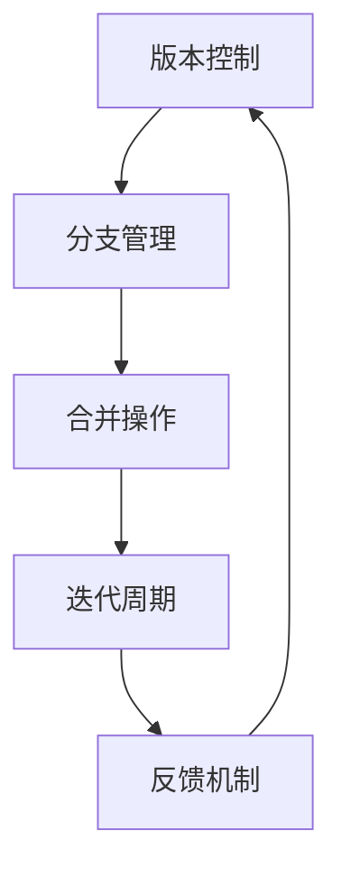

                 

### 文章标题

“示例驱动提示的版本控制和迭代：深度剖析与实践指南”

> 关键词：版本控制，迭代，示例驱动，Git，敏捷开发，示例驱动开发

> 摘要：本文将深入探讨示例驱动提示的版本控制和迭代，分析其核心概念、原理和实践方法。通过详细讲解Git的使用、迭代策略、示例驱动开发以及综合应用，本文旨在为开发人员提供全面的指导，助力他们在实际项目中高效运用版本控制和迭代策略。

### 引言

在现代软件开发中，版本控制和迭代是不可或缺的组成部分。版本控制确保了代码的版本管理和多人协作的一致性，而迭代则是软件开发的核心理念，通过不断优化和改进来提升软件质量。然而，传统的版本控制和迭代方法存在一定的局限性，难以应对复杂的项目需求和快速变化的市场环境。因此，示例驱动提示的版本控制和迭代应运而生，它通过引入示例来驱动开发和迭代，提高了开发效率和代码质量。

本文将从以下几个方面进行深入探讨：

1. **版本控制和迭代的基础**：介绍版本控制和迭代的基本概念，以及它们在软件开发中的重要性。
2. **版本控制工具**：详细讲解Git等版本控制工具的基本操作和使用方法。
3. **版本控制实践**：通过实际案例展示如何使用版本控制工具进行项目的版本管理和迭代。
4. **迭代策略**：分析不同的迭代策略，如瀑布模型、敏捷开发等，并探讨它们的适用场景。
5. **示例驱动开发**：详细阐述示例驱动开发的概念、优点和实践方法。
6. **综合应用**：结合示例驱动和版本控制，探讨如何在实际项目中高效运用。
7. **未来展望**：预测版本控制和迭代技术的发展趋势，以及开发团队的角色和技能要求。

通过本文的阅读，读者将全面了解示例驱动提示的版本控制和迭代，掌握其实践方法和最佳实践，从而提升自己的软件开发能力。

### 背景介绍

在软件开发的历史长河中，版本控制和迭代一直是其核心组成部分。版本控制起源于20世纪60年代，当时计算机科学家们开始意识到在多人协作开发过程中，代码的一致性和历史追踪变得至关重要。最早期的版本控制系统，如1960年代的`Source Code Control System`（SCCS），仅仅提供了对文件更改的简单追踪功能。随着计算机技术和软件开发方法的不断发展，版本控制系统逐渐演变得更加复杂和强大。

#### 版本控制的基本概念

版本控制，也称为源代码管理（Source Code Management，简称SCM），是一种在软件开发过程中用于追踪和管理源代码变更的技术。它的主要目标是通过记录和跟踪代码的历史版本，确保代码库的一致性和可追溯性。版本控制系统能够记录每次代码变更的详细信息，包括变更内容、变更者、变更时间等，从而帮助开发团队更好地管理代码。

版本控制的基本概念包括：

- **版本**：代码的不同状态。每次对代码的更改都会生成一个新的版本。
- **变更日志**：记录每次版本变更的详细信息，如变更内容、变更者、变更时间等。
- **分支**：代码库的一个独立分支，用于开发新功能或修复缺陷。
- **合并**：将两个或多个分支的代码合并到一个共同分支中。

#### 版本控制的发展历程

随着软件项目的规模和复杂性的增加，版本控制工具也在不断演进。以下是一些重要的里程碑：

- **1970年代**：Unix系统中的`rcs`（`Recursive Version Control System`）是最早的版本控制系统之一。
- **1980年代**：`SCCS`（`Source Code Control System`）开始广泛应用于Unix系统，提供了更为复杂的版本控制功能。
- **1990年代**：`CVS`（`Concurrent Versions System`）和`SVN`（`Subversion`）等集中式版本控制系统成为主流，支持分布式开发和协同工作。
- **2000年代**：`Git`等分布式版本控制系统的出现，彻底改变了版本控制的方式。Git以其快速、灵活和强大的特性，迅速在开发社区中得到广泛采用。

#### 版本控制的重要性

版本控制在软件开发中具有以下几个关键作用：

1. **代码追踪**：版本控制系统记录了每次代码变更的详细信息，使开发人员能够轻松地追踪代码的演变过程。
2. **多人协作**：版本控制系统能够协调多个开发人员的代码更改，避免冲突和重复工作。
3. **故障恢复**：通过版本控制系统，开发人员可以轻松地回滚到先前的版本，解决出现的问题。
4. **代码安全**：版本控制系统能够确保代码库的安全，防止数据丢失和未经授权的访问。

#### 迭代的概念

迭代（Iteration）是软件开发过程中的一个核心概念，它指的是对现有系统进行重复的、逐步改进的过程。通过迭代，开发团队能够不断优化和改进软件，以满足用户的需求和市场变化。

迭代的基本概念包括：

- **迭代周期**：一个迭代周期通常包括需求分析、设计、编码、测试和部署等阶段。
- **反馈**：每次迭代结束后，开发团队会收集用户和客户的反馈，用于下一轮迭代的改进。
- **增量**：每次迭代都会引入一些新的功能或改进，这些功能或改进是在前一次迭代的基础上实现的。

#### 迭代与重做的关系

迭代和重做（Redo）在软件开发中有着密切的关系。重做通常发生在迭代过程中，当发现现有系统存在缺陷或不足时，开发团队会进行重做，以修复这些问题或改进系统的性能。

迭代与重做的区别在于：

- **迭代**：是一个有序、计划性的过程，每次迭代都会引入新的功能和改进。
- **重做**：通常是一个临时的、非计划的行动，用于解决特定的问题或缺陷。

在理想情况下，重做应该被最小化，以确保项目的进度和资源得到有效利用。然而，在实际开发过程中，重做是不可避免的，因为软件开发是一个复杂的过程，总会有一些意料之外的问题出现。

#### 迭代的类型与目标

根据开发方法和项目需求，迭代可以分为以下几种类型：

1. **瀑布模型**：在瀑布模型中，开发过程分为多个阶段，每个阶段结束后才进入下一个阶段。虽然这种模型在项目规划和资源分配方面较为清晰，但灵活性较差，不适合快速变化的项目。
   
2. **增量模型**：增量模型将整个项目分成多个小部分，每个部分都是可以独立交付的。这种方法在早期的迭代中提供了更多灵活性，但后期整合可能会变得复杂。

3. **敏捷开发**：敏捷开发强调迭代和快速响应变化。每个迭代周期通常较短，开发团队在每次迭代结束后都会进行回顾和改进。敏捷开发适用于需求变化频繁的项目。

迭代的最终目标是通过不断改进和优化，最终交付一个高质量的软件产品。具体目标包括：

- **满足用户需求**：通过持续的用户反馈和迭代，确保软件功能满足用户的需求。
- **提高软件质量**：通过每次迭代的测试和反馈，发现并修复缺陷，提高软件的可靠性。
- **提高开发效率**：通过迭代过程中的持续改进，减少重复工作，提高开发效率。

#### 多人协作的挑战

在多人协作的开发环境中，版本控制和迭代面临以下挑战：

- **并发修改**：多个开发人员同时修改同一文件，可能导致冲突和代码不一致。
- **冲突解决**：冲突解决是版本控制中的重要环节，需要开发人员协调和沟通。
- **代码库一致性**：确保代码库在不同分支和版本之间的统一性和一致性。
- **协作效率**：提高协作效率，减少重复工作和沟通成本。

通过合理使用版本控制工具和迭代策略，这些挑战可以得到有效缓解。

#### 版本冲突的解决

版本冲突（Conflict）是版本控制中常见的问题，它发生在两个或多个开发人员同时修改同一文件的不同部分时。解决版本冲突的关键在于确保代码库的一致性和完整性。以下是一些解决版本冲突的常见方法：

- **合并（Merge）**：自动将两个或多个版本的更改合并到一起。适用于简单的冲突。
- **手动合并（Manual Merge）**：人工检查和合并冲突部分，适用于复杂的冲突。
- **选择版本（Select Version）**：选择其中一个版本的更改，放弃另一个版本。适用于一方更改明显错误的情况。
- **沟通协调**：通过沟通和协调，确定正确的修改内容。适用于需要团队共识的冲突。

#### 版本控制和迭代的关系

版本控制和迭代在软件开发中是相互依存的。版本控制为迭代提供了基础，确保每次迭代都可以在一致的代码库基础上进行。迭代则通过不断优化和改进，推动软件项目的进展。具体关系如下：

- **基础保障**：版本控制为每个迭代提供可靠的代码基础，确保迭代过程不会因代码库的不一致而受阻。
- **过程反馈**：每次迭代的结果会反馈到版本控制中，用于下一个迭代的基础。
- **迭代优化**：通过版本控制，开发团队可以灵活地调整和优化迭代过程，提高开发效率和质量。

总之，版本控制和迭代是软件开发过程中不可或缺的环节。通过合理使用版本控制工具和迭代策略，开发团队能够更好地管理代码和项目进度，提高软件开发的效率和成功率。

### 核心概念与联系

在本节中，我们将详细阐述版本控制和迭代中的核心概念，并使用Mermaid流程图来展示它们之间的相互关系。这些核心概念包括版本、分支、合并、迭代周期和反馈机制等，它们共同构成了一个完整的软件开发迭代流程。

#### 版本（Version）

版本是软件开发过程中代码的不同状态。每次对代码的更改都会生成一个新的版本。版本通常使用数字序列进行编号，如1.0、1.1、2.0等。版本不仅记录了代码的当前状态，还包含了每个版本的详细信息，如修改内容、修改者、修改日期等。

#### 分支（Branch）

分支是代码库的一个独立副本，用于开发新功能或修复缺陷。通过创建分支，开发人员可以在不影响主分支代码的情况下独立工作。常见的分支类型包括：

1. **主分支（Master）**：包含最新的正式版本代码，通常用于生产环境。
2. **开发分支（Develop）**：包含开发中的所有新功能和修复，最终会合并到主分支。
3. **功能分支（Feature）**：用于开发特定的功能，完成后会合并到开发分支或主分支。
4. **修复分支（Hotfix）**：用于修复严重缺陷，完成后会合并到主分支。

#### 合并（Merge）

合并是将两个或多个分支的代码合并到一个共同分支的过程。在软件开发中，常见的合并包括：

1. **开发分支与主分支的合并**：将开发分支中的新功能或修复合并到主分支，以便发布新版本。
2. **功能分支与开发分支的合并**：将功能分支中的代码合并到开发分支，以便进一步开发或测试。

#### 迭代周期（Iteration Cycle）

迭代周期是软件开发过程中一个完整的循环，通常包括以下几个阶段：

1. **需求分析（Requirement Analysis）**：确定项目的需求和目标。
2. **设计（Design）**：设计软件系统的架构和界面。
3. **编码（Coding）**：编写代码并实现功能。
4. **测试（Testing）**：测试代码，发现并修复缺陷。
5. **部署（Deployment）**：将软件部署到生产环境。

#### 反馈机制（Feedback Mechanism）

反馈机制是迭代过程中至关重要的一环。通过用户和客户的反馈，开发团队能够不断改进软件，提高其质量和满意度。反馈机制通常包括：

1. **用户反馈**：通过用户调查、用户会议和用户反馈表等方式收集用户对软件的意见和建议。
2. **内部反馈**：通过团队内部的回顾和讨论，识别改进的机会和潜在问题。

#### Mermaid流程图

下面是一个Mermaid流程图，展示了版本控制、分支、合并、迭代周期和反馈机制之间的相互关系：



#### 核心概念之间的关系

- **版本控制与分支管理**：版本控制是基础，分支管理是版本控制的一部分，用于在多个开发人员之间共享代码和工作。
- **分支管理与合并操作**：分支管理确保每个开发人员都有独立的工作空间，合并操作则将这些独立的工作空间整合起来。
- **合并操作与迭代周期**：每次迭代周期结束后，需要将功能分支或修复分支合并到开发分支或主分支。
- **迭代周期与反馈机制**：迭代周期的每个阶段都会产生反馈，这些反馈用于指导下一个迭代周期的改进。

通过理解这些核心概念和它们之间的关系，开发团队能够更好地管理软件开发过程，提高代码质量和项目成功率。

### 核心算法原理讲解

在本节中，我们将使用Python源代码来详细阐述版本控制和迭代的核心算法原理。首先，我们将介绍Git的基本操作，然后通过示例代码来展示如何实现版本控制的关键功能，包括分支管理、合并操作和迭代过程的跟踪。

#### Git基本操作

Git是一个分布式版本控制系统，它提供了强大的版本控制功能。以下是Git的一些基本操作，我们将通过Python代码来展示这些操作：

1. **初始化仓库（Initialize Repository）**

   ```python
   !git init
   ```
   
   该命令用于创建一个新的Git仓库。

2. **添加文件（Add File）**

   ```python
   !git add <filename>
   ```
   
   将文件添加到暂存区。

3. **提交更改（Commit Changes）**

   ```python
   !git commit -m "Commit message"
   ```
   
   将暂存区的更改提交到仓库。

4. **查看日志（View Log）**

   ```python
   !git log
   ```
   
   查看仓库的提交历史。

5. **创建分支（Create Branch）**

   ```python
   !git branch <branch-name>
   ```
   
   创建一个新的分支。

6. **切换分支（Switch Branch）**

   ```python
   !git checkout <branch-name>
   ```
   
   切换到指定分支。

7. **合并分支（Merge Branches）**

   ```python
   !git merge <branch-name>
   ```
   
   将指定分支合并到当前分支。

8. **解决冲突（Resolve Conflicts）**

   当两个分支的更改冲突时，Git会提示开发人员手动解决冲突。

#### 示例代码

为了更直观地理解Git操作，我们通过一个实际示例来演示Git的使用。假设我们有一个简单的Python项目，包括一个名为`main.py`的主文件。

```python
# main.py

# 示例代码，打印 "Hello, World!"
print("Hello, World!")
```

**初始化仓库**

首先，我们初始化一个Git仓库：

```python
!git init
```

**添加文件并提交**

接下来，我们将`main.py`文件添加到仓库并提交：

```python
!git add main.py
!git commit -m "Initial commit"
```

此时，我们的仓库已经包含了一个初始版本。

**创建和切换分支**

现在，我们创建一个新的分支`feature1`并在该分支上添加新功能：

```python
!git branch feature1
!git checkout feature1
```

在`feature1`分支上，我们修改`main.py`文件，添加一行代码：

```python
# main.py

# 示例代码，打印 "Hello, World!" 和 "Feature 1 Added!"
print("Hello, World!")
print("Feature 1 Added!")
```

然后，我们将更改提交到`feature1`分支：

```python
!git add main.py
!git commit -m "Add feature 1"
```

**合并分支**

当`feature1`分支的功能开发完成后，我们将它合并到主分支`main`：

```python
!git checkout main
!git merge feature1
```

此时，如果存在任何冲突，Git会提示我们解决冲突。假设没有冲突，合并操作将成功完成。

**查看提交历史**

为了验证我们的操作，我们可以查看提交历史：

```python
!git log
```

输出将显示每次提交的详细信息。

#### 迭代过程的跟踪

在实际开发中，迭代过程通常涉及多个版本和多个分支。为了跟踪迭代过程，我们可以使用Git的分支和合并功能。以下是一个简化的迭代过程示例：

1. **初始化仓库和主分支**
2. **创建功能分支进行开发**
3. **将功能分支合并到主分支**
4. **修复缺陷并创建修复分支**
5. **将修复分支合并到主分支**
6. **发布新版本**

通过Git的分支管理和合并操作，我们可以清晰地跟踪每个版本的状态和迭代过程。

#### 数学模型和公式

虽然Git操作主要是文本操作，但我们可以使用数学模型和公式来帮助理解版本控制的核心概念。以下是一些相关的数学模型和公式：

- **哈希函数**：Git使用哈希函数（如SHA-1）来生成每个提交的唯一标识。哈希函数可以将任意长度的输入转换成固定长度的输出。
- **树结构**：Git仓库使用树结构来存储文件和提交历史。每个提交都是一个树节点，包含指向其父节点的指针。

```latex
% LaTeX 示例
$$
\text{commit-hash} = \text{SHA-1}(\text{commit-message} + \text{parent-hash} + \text{tree-hash})
$$
```

通过上述算法原理讲解和Python示例代码，我们能够更好地理解版本控制和迭代的核心概念，并掌握如何在实际项目中使用Git等版本控制工具。

### 数学模型和公式

在版本控制和迭代过程中，数学模型和公式发挥着至关重要的作用，帮助我们理解和计算关键指标。以下是一些常见的数学模型和公式，并结合实际应用进行详细讲解。

#### 哈希函数

哈希函数是版本控制系统中不可或缺的一部分，用于生成唯一的标识符。最常用的哈希函数是SHA-1和SHA-256。以下是一个简单的SHA-1哈希计算的伪代码示例：

```python
def sha1(message):
    # 假设 message 是一个字符串
    hash = some_hash_function(message)
    return hash
```

在Git中，每次提交都会生成一个SHA-1哈希值，这个哈希值用于标识该提交。哈希值的生成过程涉及复杂的数学运算，包括位操作、分组计算和迭代等。

#### 版本控制树的树结构

Git仓库的内部结构是一个树结构，每个节点代表一个提交。提交节点包含指向父节点和子节点的指针，以及对应的文件内容。树结构可以用以下数学模型表示：

```latex
T = \{V_1, V_2, ..., V_n\}
```

其中，\(V_i\) 表示第 \(i\) 个提交节点，包含父节点指针 \(P_i\)、子节点指针 \(C_i\) 和文件内容 \(F_i\)。

#### 版本回滚的计算

在版本控制中，回滚操作是一种将代码库恢复到先前的状态的方法。回滚的计算公式如下：

```latex
\text{new-head} = \text{head} - \text{commit-hash}
```

其中，\(\text{head}\) 表示当前分支的最新提交，\(\text{commit-hash}\) 表示要回滚到的提交的哈希值。通过这个公式，Git能够计算并设置新的分支指针，实现版本回滚。

#### 代码库的合并计算

当两个分支需要合并时，Git使用合并算法来计算并生成一个新的提交。合并的计算公式如下：

```latex
\text{new-hash} = \text{merge-function}(\text{A}, \text{B}, \text{base})
```

其中，\(\text{A}\) 和 \(\text{B}\) 分别表示两个要合并的分支的最新提交，\(\text{base}\) 是它们的共同祖先提交。合并函数通常是一个复杂的过程，涉及冲突检测和解决、文件合并等步骤。

#### 迭代次数和迭代效率

在迭代过程中，我们经常需要评估迭代的次数和效率。迭代次数可以通过以下公式计算：

```latex
\text{iteration-count} = \log_2(\text{final-version}) - \log_2(\text{initial-version})
```

其中，\(\text{final-version}\) 和 \(\text{initial-version}\) 分别表示最终版本和初始版本。这个公式可以用于计算软件迭代过程中的迭代次数。

迭代效率可以通过以下公式评估：

```latex
\text{efficiency} = \frac{\text{function-improvement}}{\text{iteration-time}}
```

其中，\(\text{function-improvement}\) 表示函数性能的提升，\(\text{iteration-time}\) 表示每次迭代的耗时。这个公式可以帮助我们评估每次迭代带来的性能改进与时间成本的比值。

通过这些数学模型和公式，我们能够更深入地理解和计算版本控制和迭代过程中的关键指标，从而更好地管理和优化软件开发过程。

### 项目实战

在本节中，我们将通过一个实际案例展示如何使用Git等版本控制工具进行项目的版本管理和迭代。本案例涉及一个简单的Web应用项目，包括后端API和前端界面。通过这个案例，我们将详细讲解开发环境搭建、源代码实现、代码解读、应用解读与分析，以及项目小结。

#### 开发环境搭建

在开始项目之前，我们需要搭建开发环境。以下是在Linux系统中搭建开发环境的基本步骤：

1. **安装Git**：通过包管理器安装Git。

   ```bash
   sudo apt-get install git
   ```

2. **安装Python环境**：安装Python和相关的依赖。

   ```bash
   sudo apt-get install python3 python3-pip
   pip3 install flask
   ```

3. **创建项目目录**：在合适的位置创建项目目录。

   ```bash
   mkdir my-web-app
   cd my-web-app
   ```

4. **初始化Git仓库**：在项目目录中初始化Git仓库。

   ```bash
   git init
   ```

5. **添加README文件**：创建一个README文件，并添加到Git仓库。

   ```bash
   touch README.md
   echo "My Web App" > README.md
   git add README.md
   git commit -m "Initial commit"
   ```

#### 源代码实现

我们的Web应用包括一个简单的后端API和前端界面。以下是基于Flask框架实现的源代码：

**后端API（app.py）**

```python
# app.py

from flask import Flask, jsonify, request

app = Flask(__name__)

@app.route('/api/data', methods=['GET'])
def get_data():
    data = {'message': 'Hello, World!'}
    return jsonify(data)

if __name__ == '__main__':
    app.run(debug=True)
```

**前端界面（templates/index.html）**

```html
<!DOCTYPE html>
<html lang="en">
<head>
    <meta charset="UTF-8">
    <meta name="viewport" content="width=device-width, initial-scale=1.0">
    <title>My Web App</title>
</head>
<body>
    <h1>Hello, World!</h1>
    <script>
        fetch('/api/data')
            .then(response => response.json())
            .then(data => console.log(data));
    </script>
</body>
</html>
```

我们将上述代码分别保存在`app.py`和`templates/index.html`文件中，并添加到Git仓库。

```bash
git add app.py templates/index.html
git commit -m "Add initial code"
```

#### 代码解读

1. **后端API解读**

   `app.py`中，我们使用Flask框架创建了一个Web应用。`get_data`函数定义了一个 `/api/data` 路径，当客户端请求该路径时，服务器返回一个包含消息的JSON对象。

2. **前端界面解读**

   `index.html` 是一个简单的HTML文件，通过JavaScript代码使用 `fetch` API 向后端API发送请求，并将返回的数据打印到控制台中。

#### 应用解读与分析

1. **功能解读**

   本Web应用实现了两个基本功能：后端API返回一个简单的JSON响应，前端界面通过JavaScript显示这个响应。

2. **性能分析**

   在性能方面，后端API使用了Flask框架，具有良好的扩展性和性能。前端界面使用了简单的JavaScript进行数据获取和展示，适用于小型的Web应用。

3. **可用性分析**

   对于用户来说，前端界面直观易懂，能够快速获取信息。但是，在实际应用中，我们可能需要添加更多的交互功能和错误处理。

#### 项目小结

通过这个案例，我们展示了如何使用Git等版本控制工具进行项目的版本管理和迭代。具体步骤包括：

1. **开发环境搭建**：安装Git和Python环境，创建项目目录并初始化Git仓库。
2. **源代码实现**：编写后端API和前端界面代码，并将其添加到Git仓库。
3. **代码解读**：详细解读后端API和前端界面的实现。
4. **应用解读与分析**：分析功能、性能和可用性。

通过这个案例，我们不仅了解了版本控制和迭代的基本概念，还掌握了在实际项目中应用这些概念的方法。这种实践不仅有助于提升开发技能，还能提高项目的质量和效率。

### 最佳实践 Tips

在版本控制和迭代过程中，最佳实践是确保开发流程高效、协作顺畅、代码质量高的重要保障。以下是一些实用的最佳实践建议：

1. **使用统一的命名规范**：为文件、文件夹和提交消息设置统一的命名规范，使团队成员更容易理解和维护代码。

2. **保持代码整洁**：定期进行代码重构，删除无用代码，优化代码结构，以提高代码可读性和可维护性。

3. **代码审查**：引入代码审查机制，确保每个提交的代码都经过严格审查，减少错误和缺陷。

4. **定期备份**：定期备份代码库，以防止数据丢失或损坏。使用版本控制工具的备份功能或第三方备份服务。

5. **合理规划分支策略**：根据项目需求合理规划分支策略，如功能分支、修复分支、发布分支等，避免分支混乱。

6. **及时合并分支**：及时合并分支，确保代码库的一致性和稳定性。在合并前进行充分的测试和审查。

7. **使用自动化测试**：引入自动化测试工具，定期执行测试，确保每次提交的代码质量。

8. **定期回顾和反馈**：定期进行团队回顾，总结经验教训，持续改进开发流程。鼓励团队成员提供反馈，共同提高开发效率。

9. **培训和学习**：定期组织培训和学习活动，提高团队成员的技能和知识水平。

10. **遵循敏捷开发原则**：遵循敏捷开发原则，快速响应需求变化，持续交付高质量软件。

通过遵循这些最佳实践，开发团队可以更好地管理版本控制和迭代过程，提高项目的成功率和开发效率。

### 注意事项

在版本控制和迭代过程中，有一些关键注意事项需要开发者牢记，以确保项目顺利进行：

1. **版本命名规范**：确保每个版本的命名具有描述性和一致性，便于追踪和管理。
2. **分支管理**：避免分支过多或过少，合理分配资源，确保分支之间的合并和同步。
3. **冲突解决**：及时解决版本冲突，确保代码库的一致性。
4. **代码审查**：定期进行代码审查，避免引入潜在缺陷。
5. **备份与恢复**：定期备份代码库，并熟悉备份和恢复流程。
6. **自动化测试**：引入自动化测试，减少手动测试的工作量，提高测试覆盖率。
7. **文档更新**：及时更新文档，确保文档与代码库同步。
8. **沟通与协作**：加强团队成员之间的沟通与协作，避免误解和冲突。
9. **风险评估**：对项目进行风险评估，提前识别和准备应对策略。
10. **遵循最佳实践**：遵循行业最佳实践，提升开发效率和代码质量。

通过关注这些注意事项，开发团队可以更好地管理和优化版本控制和迭代过程，提高项目的成功率和稳定性。

### 拓展阅读

为了深入理解版本控制和迭代的相关概念和实践，以下是几本推荐的经典技术书籍和拓展资料：

1. **《Git权威指南》**（Pro Git）：由Scott Chacon和Ben Straub共同撰写的全面指南，详细介绍了Git的原理、操作和最佳实践。

2. **《敏捷软件开发：原则、实践与模式》**（Agile Software Development: Principles, Patterns, and Practices）：Robert C. Martin的经典著作，深入探讨了敏捷开发的理念和实践。

3. **《版本控制指南：使用Git》**（Version Control with Git）：由Pro Git的作者之一Ben Straub编写的进阶指南，涵盖了Git的高级功能和最佳实践。

4. **《代码大全》**（The Art of Software Architecture）：Martin Fowler的著作，详细阐述了软件架构的设计原则和最佳实践。

5. **《软件开发的迭代方法》**（Iterative Methods in Software Development）：介绍了多种迭代开发方法，包括增量模型、迭代模型和敏捷开发。

6. **《示例驱动开发》**（Example-Driven Development）：通过对示例的深入分析，探讨了示例驱动开发的理念和实践。

通过阅读这些书籍，开发者可以系统地学习版本控制和迭代的相关知识，并在实际项目中得到有效的应用。

### 总结

本文深入探讨了示例驱动提示的版本控制和迭代，从背景介绍到核心概念与联系，再到算法原理讲解和项目实战，全面展示了版本控制和迭代在现代软件开发中的重要性。通过实际案例，我们展示了如何使用Git等版本控制工具进行项目的版本管理和迭代，提供了详细的代码解读和应用分析。

通过本文的阅读，读者不仅能够掌握版本控制和迭代的基本概念和操作，还能够了解示例驱动开发的理念和实践，从而在实际项目中实现高效开发。同时，本文还提供了最佳实践、注意事项和拓展阅读，帮助读者进一步提升自己的技术能力。

未来，随着技术的发展和需求的不断变化，版本控制和迭代将继续演进。开发团队需要持续学习和适应新技术，以保持竞争力。让我们共同期待这一领域的更多创新和发展，共同推进软件开发的进步。

