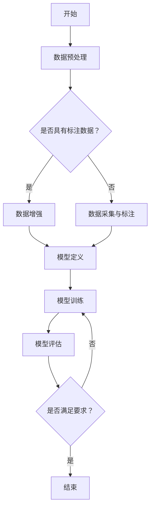

                 

### 思考过程

在进行《示例驱动：few-shot learning在提示词中的应用》这篇文章的撰写之前，我们需要对文章的结构、内容和目标读者进行深入的思考和分析。以下是具体的思考过程：

#### 1. 确定文章的目标读者
我们的目标读者主要是从事人工智能领域的研究人员、开发者以及高校师生。他们可能对few-shot learning有一定的了解，但对提示词的具体应用可能还不够熟悉。因此，文章需要在介绍基本概念的同时，注重深入讲解few-shot learning在实际中的应用，以及如何通过示例驱动来提升模型的效果。

#### 2. 设定文章的核心内容和结构
根据文章的目标读者，我们决定文章的核心内容应包括：
- 几何表示学习的基础理论
- Few-shot learning的基本概念
- 提示词的理解与生成
-Few-shot learning在自然语言处理中的具体应用
- Few-shot learning在提示词优化中的应用
- Few-shot learning在其他领域的应用前景
- 对未来发展趋势的展望

文章的结构将分为以下章节：
1. 引言
2. 几何表示学习基础
3. Few-shot learning概述
4. 提示词理解与生成
5. Few-shot learning在自然语言处理中的应用
6. Few-shot learning在提示词优化中的应用
7. Few-shot learning在其他领域的应用
8. 结论与展望

#### 3. 确定文章的技术深度和难易程度
文章的技术深度将以中等为主，既需要深入讲解技术原理，又需要保证内容的可读性和易懂性。在讲解复杂的技术概念时，我们将通过具体的示例和代码来实现，以便读者更好地理解和掌握。

#### 4. 选择合适的表达方式和语言
为了达到最佳的表达效果，我们将采用以下几种表达方式：
- **简洁明了的语言**：避免过于复杂的词汇和句子结构，确保读者容易理解。
- **图形和流程图**：使用Mermaid流程图等工具，以直观的方式展示技术概念和算法流程。
- **Python代码示例**：通过实际代码来展示算法原理和应用方法，便于读者实践和验证。

#### 5. 考虑文章的可读性和逻辑性
- **逻辑清晰的结构**：确保文章各个部分内容连贯，过渡自然。
- **分章节撰写**：每个章节聚焦于一个核心主题，确保内容集中且有深度。
- **总结和提示**：在每个章节的结尾，给出简短的总结和注意事项，帮助读者巩固知识点。

通过以上思考和分析，我们为《示例驱动：few-shot learning在提示词中的应用》这篇文章的撰写奠定了坚实的基础。接下来，我们将按照这个思路逐步展开文章的内容，确保文章的质量和可读性。

---

### 关键词

- 示例驱动
- Few-shot learning
- 几何表示学习
- 提示词
- 自然语言处理
- 优化
- 应用领域

---

### 摘要

本文探讨了示例驱动的Few-shot Learning在提示词中的应用。首先，我们介绍了几何表示学习的基础概念，并阐述了Few-shot Learning的定义和发展历程。接着，本文详细讲解了提示词的理解与生成方法，包括基于规则和模型的方法。然后，文章深入讨论了Few-shot Learning在自然语言处理中的具体应用，并展示了其在提示词优化方面的潜力。此外，我们扩展了Few-shot Learning的应用领域，包括计算机视觉和其他领域。最后，本文对Few-shot Learning的未来发展趋势进行了展望，并提出了可能的挑战和解决方案。通过本文的讨论，读者可以全面了解Few-shot Learning在提示词应用中的优势和潜力，并掌握相关技术方法和最佳实践。

---

## 第1章 引言

### 1.1 几何概念介绍

几何学是研究形状、大小、位置和分布的科学，其在人工智能和机器学习领域有着广泛的应用。为了更好地理解Few-shot Learning在提示词中的应用，我们需要先了解一些基本的几何概念。

首先，我们介绍几何空间。几何空间是一个抽象的概念，用于描述几何对象的存在和位置。它可以是一维的（如直线），二维的（如平面），或三维的（如空间）。在计算机科学中，我们经常使用向量空间来表示几何空间。向量空间是由一组向量组成的集合，每个向量都有一个确定的起点和终点。向量空间的一个重要性质是它能够通过线性组合来生成新的向量。

接下来，我们介绍一些基本的几何概念，包括点、线、面和体。点是最基本的几何对象，它没有大小和形状，只有位置。线是由无限多个点组成的路径，它有长度但没有宽度。面是由无限多个线段组成的闭合图形，它有面积但没有厚度。体是由无限多个面组成的立体图形，它有体积但没有表面积。在三维空间中，常见的体包括立方体、球体和圆柱体等。

这些基本几何概念在计算机图形学、计算机视觉和机器学习等领域都有广泛应用。例如，在计算机图形学中，我们使用几何空间来表示三维物体；在计算机视觉中，我们使用几何概念来理解图像中的形状和结构；在机器学习中，我们使用几何表示来提高模型对数据的理解能力。

### 1.2 几何表示学习基础

几何表示学习（Geometric Representation Learning）是机器学习中的一种方法，旨在将数据转换为一个几何空间中的向量表示。这种方法在Few-shot Learning中有着重要的应用，因为它可以帮助模型快速适应新的任务和数据集。

几何表示学习的基本思想是将数据集中的每个实例表示为几何空间中的一个点。通过学习一个映射函数，我们可以将高维数据映射到低维空间，同时保持数据之间的相似性。这种映射函数通常是一个线性或非线性变换，它可以是基于梯度的优化过程。

在几何表示学习中，常见的几何空间包括欧氏空间（Euclidean Space）、流形（Manifold）和图（Graph）等。欧氏空间是最常见的几何空间，它用于处理欧几里得距离。流形是一种更一般的几何空间，它可以用来处理复杂的数据结构，如高维数据和非线性关系。图是一种离散的几何空间，它用于处理具有连接关系的数据，如社交网络和知识图谱。

几何表示学习的核心问题是设计有效的映射函数，以便在保持数据相似性的同时，降低数据的维度。常见的几何表示学习算法包括线性降维算法（如主成分分析（PCA）和线性判别分析（LDA））和非线性降维算法（如自编码器（Autoencoder）和生成对抗网络（GAN））。

通过几何表示学习，我们可以将复杂的数据转换为更容易处理的向量表示。这种方法在Few-shot Learning中特别有用，因为它可以帮助模型在仅看到几个示例后，快速适应新的任务和数据集。此外，几何表示学习还可以用于数据可视化、异常检测和聚类分析等领域。

### 1.3 Few-shot Learning 概述

Few-shot Learning是一种机器学习方法，旨在训练模型在仅看到少量示例数据的情况下，能够对新任务和新数据集进行快速适应。与传统的机器学习方法（如批量学习）不同，Few-shot Learning不依赖于大量的训练数据，因此它在资源有限的情况下具有很大的优势。

Few-shot Learning的定义和背景：

Few-shot Learning的定义比较简单，即训练模型在仅看到几个示例数据的情况下，能够对新的任务和新数据集进行泛化。具体来说，假设我们有一个训练数据集，其中每个类别都有几个示例数据。在训练阶段，模型只看到这些示例数据，然后需要在测试阶段对新类别和新数据集进行预测。

Few-shot Learning的背景主要来自于现实世界的需求。在很多应用场景中，我们无法获得大量的训练数据，或者获取数据需要很高的成本。例如，在医学诊断中，我们可能只能获取患者的少量病历数据；在机器人学习中，我们可能只能在特定环境下收集数据。因此，如何让模型在仅看到少量数据的情况下，仍然能够准确地进行预测，成为了Few-shot Learning的研究目标。

Few-shot Learning的发展历程：

Few-shot Learning的研究可以追溯到20世纪80年代的统计学习理论。当时，学者们提出了基于经验风险最小化的学习算法，如支持向量机（SVM）和神经网络。这些算法在处理大规模数据集时表现出色，但在处理少量数据时效果不佳。

随着机器学习技术的发展，特别是在深度学习领域，Few-shot Learning得到了越来越多的关注。2016年，谷歌提出了变分自编码器（VAE）和生成对抗网络（GAN）等模型，这些模型在Few-shot Learning中取得了显著的成果。此外，强化学习、元学习和迁移学习等方法也被应用于Few-shot Learning，进一步提升了其性能。

当前，Few-shot Learning已经成为机器学习研究的一个热点方向。研究者们致力于设计更有效的算法和模型，以提高模型在少量数据下的泛化能力。同时，Few-shot Learning的应用场景也在不断拓展，包括自然语言处理、计算机视觉、语音识别等领域。

### 1.4 Few-shot Learning的重要性

Few-shot Learning在机器学习领域具有重要意义，主要原因如下：

1. **应对数据稀缺问题**：在许多实际应用中，获取大量的训练数据可能成本高昂或不现实。Few-shot Learning允许模型在仅看到少量数据的情况下进行学习，从而降低了数据获取的成本。

2. **提高泛化能力**：通过在少量数据上进行学习，模型可以更好地理解数据的本质特征，从而在测试阶段对新数据集进行准确的预测。这有助于提高模型的泛化能力，使其能够应对未知的情况。

3. **促进新任务快速适应**：在开发新应用或遇到新任务时，Few-shot Learning可以帮助模型快速适应，减少了从零开始的训练时间。

4. **增强模型的可解释性**：Few-shot Learning通常使用端到端的学习方法，这使得模型的结构和参数更加透明，从而提高了模型的可解释性。

5. **推动机器学习理论发展**：Few-shot Learning的研究推动了机器学习理论的发展，特别是在学习理论、算法设计、优化方法等方面。

总之，Few-shot Learning作为一种高效、灵活的机器学习方法，在解决数据稀缺、提高泛化能力等方面具有重要作用。随着研究的深入，Few-shot Learning有望在更多领域取得突破。

### 1.5 本章小结

本章介绍了几何概念和Few-shot Learning的基本概念。我们首先介绍了几何空间和基本几何概念，如点、线、面和体。接着，我们探讨了几何表示学习的基础理论，包括几何空间的构建和常见几何表示学习算法。最后，我们简要概述了Few-shot Learning的定义、背景和重要性。通过本章的学习，读者可以初步了解几何概念和Few-shot Learning的基础知识，为后续章节的内容打下基础。

---

## 第2章 几何表示学习基础

### 2.1 几何空间构建

几何空间是几何表示学习的基础。在机器学习中，几何空间通常用于表示数据点之间的关系。一个良好的几何空间构建可以有效地降低数据的维度，同时保留数据的关键特征。

首先，我们介绍如何构建一维、二维和三维几何空间。

#### 一维几何空间

一维几何空间，即直线。在机器学习中，一维空间通常用于处理离散数据。例如，时间序列数据可以被表示为一条直线上的点。为了构建一维空间，我们通常使用线性回归模型，通过拟合直线的斜率和截距来表示数据之间的关系。

#### 二维几何空间

二维几何空间，即平面。平面通常用于表示二维图像或数据集。在计算机视觉中，图像可以被表示为平面上的像素点。为了构建二维空间，我们通常使用特征提取算法，如SIFT（尺度不变特征变换）和HOG（方向梯度直方图），从图像中提取关键特征点。

#### 三维几何空间

三维几何空间，即空间。三维空间通常用于表示三维物体或数据集。在计算机视觉和三维建模中，三维空间是至关重要的。为了构建三维空间，我们通常使用点云数据，通过点云数据的三角化来创建三维模型。

#### 几何空间的维数变换

在实际应用中，我们经常需要将高维数据转换为低维空间，以便进行更有效的分析和学习。这个过程被称为降维。常见的降维方法包括线性降维和非线性降维。

线性降维方法，如主成分分析（PCA），通过保留数据的主要成分来降低数据的维度。PCA算法的核心思想是找到一组正交基，使得这组基向量上的方差最大。这样，我们可以将高维数据映射到低维空间，同时保留数据的主要特征。

非线性降维方法，如自编码器和自动编码器（Autoencoder），通过学习一个压缩编码和解码过程来降低数据的维度。自编码器是一个神经网络模型，它由一个编码器和一个解码器组成。编码器负责将高维数据压缩为低维表示，解码器则负责将低维表示重新构建为高维数据。这种非线性降维方法可以更好地保留数据的复杂结构。

#### 几何空间的优点

几何空间的构建在机器学习中具有以下优点：

1. **降低维度**：通过降维，我们可以将高维数据转换为低维空间，从而减少计算量和存储需求。
2. **增强数据理解**：低维空间更容易理解，有助于我们识别数据中的关键特征和模式。
3. **提高学习效率**：在低维空间中，数据点之间的相似性和差异性更容易测量，从而有助于提高学习模型的效率。

### 2.2 Few-shot Learning 基本算法

Few-shot Learning是一种特殊的机器学习方法，它能够在仅看到少量数据的情况下，对新任务和新数据集进行快速适应。在几何表示学习中，Few-shot Learning的基本算法包括基于深度学习和基于统计学习的方法。

#### 基于深度学习的方法

基于深度学习的方法通常使用神经网络来模拟人类的认知过程，通过学习数据的高层次特征来提高模型的泛化能力。以下是一些常见的基于深度学习的Few-shot Learning算法：

1. **元学习（Meta-Learning）**：元学习是一种通过学习如何学习的方法。在Few-shot Learning中，元学习算法通过在多个任务上训练来提高模型的泛化能力。代表性的算法包括模型融合（Model Fusion）和迁移学习（Transfer Learning）。

2. **神经网络（Neural Networks）**：神经网络是一种模拟人脑神经元连接结构的计算模型。在Few-shot Learning中，神经网络通过学习输入数据的特征表示来提高模型的泛化能力。常见的神经网络模型包括卷积神经网络（CNN）和循环神经网络（RNN）。

3. **生成对抗网络（GAN）**：生成对抗网络是一种由生成器和判别器组成的对抗性学习模型。生成器负责生成与真实数据相似的新数据，判别器则负责区分真实数据和生成数据。在Few-shot Learning中，GAN可以用来生成新的数据样本，从而提高模型的泛化能力。

#### 基于统计学习的方法

基于统计学习的方法通常使用统计学原理来分析数据，通过学习数据分布来提高模型的泛化能力。以下是一些常见的基于统计学习的Few-shot Learning算法：

1. **支持向量机（SVM）**：支持向量机是一种分类和回归算法，通过找到一个最佳的超平面来将数据分为不同的类别。在Few-shot Learning中，SVM可以通过学习数据点之间的几何关系来提高模型的泛化能力。

2. **主成分分析（PCA）**：主成分分析是一种线性降维方法，通过保留数据的主要成分来降低数据的维度。在Few-shot Learning中，PCA可以用来简化数据结构，从而提高模型的泛化能力。

3. **线性判别分析（LDA）**：线性判别分析是一种用于分类的线性降维方法，通过找到一个最佳的超平面来最大化类内距离和最小化类间距离。在Few-shot Learning中，LDA可以用来提高模型的分类能力。

#### 几种常用算法的比较与选择

在Few-shot Learning中，选择合适的算法至关重要。以下是一些常用算法的比较和选择标准：

1. **任务类型**：不同的任务类型需要不同的算法。例如，对于分类任务，SVM和神经网络可能更有效；对于降维任务，PCA和LDA可能更适合。

2. **数据量**：对于少量数据，基于深度学习的算法可能表现更好，因为它们可以通过学习数据的高层次特征来提高模型的泛化能力。对于大量数据，基于统计学习的算法可能更有效，因为它们可以更好地处理数据的分布。

3. **计算资源**：深度学习算法通常需要更多的计算资源和时间。对于资源有限的场景，基于统计学习的算法可能更适合。

4. **模型复杂度**：模型复杂度越高，训练时间越长，但泛化能力可能也更强。在Few-shot Learning中，选择合适的模型复杂度是一个重要的考量因素。

总之，Few-shot Learning在几何表示学习中具有重要作用，它通过学习少量数据来提高模型的泛化能力。通过选择合适的算法和构建合适的几何空间，我们可以有效地实现Few-shot Learning，为实际应用提供有力的支持。

### 2.3 本章小结

本章详细介绍了几何表示学习的基础，包括几何空间构建和Few-shot Learning的基本算法。我们首先介绍了如何构建一维、二维和三维几何空间，并探讨了降维方法。接着，我们介绍了基于深度学习和基于统计学习的Few-shot Learning算法，并比较了它们的优缺点。通过本章的学习，读者可以全面了解几何表示学习的基本概念和方法，为后续章节的深入探讨打下基础。

---

## 第3章 提示词理解与生成

### 3.1 提示词分析

在自然语言处理（NLP）中，提示词（Prompt）是一种重要的技术，用于引导模型生成特定类型的文本。提示词可以是简单的关键词、短语，也可以是复杂的句子，它们在模型训练和应用过程中发挥着关键作用。

#### 提示词的分类与特点

根据提示词的形式和用途，我们可以将其分为以下几类：

1. **关键词提示**：这种提示词通常是由一个或几个关键词组成，用于指示模型生成特定主题的文本。关键词提示通常简单明了，容易理解，适用于需要快速生成文本的场景。

2. **短语提示**：短语提示词是由几个词组成的短句，用于提供更具体的指导和上下文信息。与关键词提示相比，短语提示词更加详细，有助于模型更好地理解生成文本的主题和风格。

3. **句子提示**：句子提示词是完整的句子，用于提供详细的上下文和指导。句子提示词通常包含主语、谓语和宾语，能够为模型提供丰富的信息，使其生成的文本更加连贯和准确。

#### 提示词分析算法介绍

为了有效地理解和生成提示词，我们需要使用一系列分析算法。以下是一些常见的提示词分析算法：

1. **词频统计**：词频统计是一种基本的文本分析技术，通过计算每个词在文本中的出现频率来识别重要词。词频统计可以用于提取关键词，从而帮助模型理解文本的主题。

2. **词性标注**：词性标注是一种对文本中的每个词进行词性分类的技术。通过词性标注，我们可以识别名词、动词、形容词等不同类型的词，从而更好地理解文本的结构和语义。

3. **句法分析**：句法分析是对文本中的句子结构进行分析的技术。通过句法分析，我们可以识别句子中的主语、谓语、宾语等成分，从而理解句子的语义和语法结构。

4. **语义角色标注**：语义角色标注是一种对文本中的词进行语义角色分类的技术。通过语义角色标注，我们可以识别文本中的动作、对象、地点等关键元素，从而更好地理解文本的语义。

#### 提示词分析的应用

提示词分析在NLP中有广泛的应用，包括：

1. **文本分类**：通过分析提示词，我们可以将文本分类到不同的主题类别。例如，在新闻分类中，提示词可以帮助模型识别新闻报道的主题。

2. **情感分析**：通过分析提示词的情感倾向，我们可以识别文本的情感极性。例如，在社交媒体分析中，提示词可以帮助我们了解用户的情感状态。

3. **问答系统**：在问答系统中，提示词可以帮助模型理解用户的问题，从而生成准确的答案。通过分析提示词，我们可以提取关键信息，指导模型生成相关回答。

4. **文本生成**：通过分析提示词，我们可以为模型提供生成文本的上下文和指导。例如，在自动写作中，提示词可以帮助模型生成符合主题和风格的文本。

### 3.2 提示词生成方法

生成高质量的提示词是NLP应用成功的关键。以下介绍几种常见的提示词生成方法：

1. **基于规则的方法**：基于规则的方法是通过预定义的规则和模板来生成提示词。这种方法简单直观，但灵活性较低。例如，在生成问答系统的提示词时，我们可以使用模板如“请描述一下XXX的特点”或“XXX的主要贡献是什么”。

2. **基于模型的方法**：基于模型的方法是通过训练模型来生成提示词。这种方法具有更高的灵活性和泛化能力，但需要大量的训练数据和计算资源。常见的基于模型的方法包括：

   - **生成对抗网络（GAN）**：GAN通过生成器和判别器之间的对抗性训练来生成高质量的提示词。生成器负责生成提示词，判别器负责判断提示词的质量。

   - **自编码器（Autoencoder）**：自编码器是一种无监督学习模型，通过编码器和解码器之间的学习过程来生成提示词。编码器负责将输入文本编码为固定长度的向量，解码器则负责将向量解码为提示词。

   - **变分自编码器（VAE）**：VAE是一种概率模型，通过学习数据的概率分布来生成提示词。VAE可以通过生成高质量的提示词来提高NLP应用的性能。

3. **混合方法**：混合方法是将基于规则和基于模型的方法结合起来，以充分发挥各自的优势。例如，在生成问答系统的提示词时，我们可以使用基于规则的方法生成模板，然后使用基于模型的方法来填充模板。

#### 提示词生成算法的应用

提示词生成算法在NLP中有广泛的应用，包括：

1. **问答系统**：通过生成高质量的提示词，问答系统可以更好地理解用户的问题，并生成准确的答案。

2. **文本生成**：在文本生成任务中，提示词可以帮助模型生成符合主题和风格的文本。

3. **对话系统**：在对话系统中，提示词可以帮助模型生成自然的对话，提高用户的体验。

4. **机器翻译**：在机器翻译中，提示词可以帮助模型生成更准确的翻译结果。

总之，提示词理解与生成在NLP中具有重要地位。通过分析提示词，我们可以更好地理解文本的语义和结构；通过生成高质量的提示词，我们可以提高NLP应用的性能和用户体验。在下一章中，我们将探讨Few-shot Learning在NLP中的应用，进一步展示其优势。

### 3.3 本章小结

本章详细介绍了提示词的理解与生成方法。首先，我们分析了提示词的分类与特点，包括关键词提示、短语提示和句子提示。接着，我们介绍了常见的提示词分析算法，如词频统计、词性标注、句法分析和语义角色标注。此外，我们还探讨了提示词生成方法，包括基于规则和基于模型的方法。通过本章的学习，读者可以全面了解提示词在NLP中的重要性，掌握提示词的分析与生成技术，为后续章节的应用打下基础。

---

## 第4章 Few-shot Learning在自然语言处理中的应用

### 4.1 NLP中的几何表示学习

在自然语言处理（NLP）中，几何表示学习扮演着关键角色，它通过将文本数据转换为几何空间中的向量表示，从而提高模型的性能和泛化能力。几何表示学习在NLP中的应用主要体现在两个方面：文本降维和文本分类。

#### 文本降维

文本数据通常具有高维度，这使得直接处理文本变得复杂和困难。几何表示学习通过降维技术，将高维文本数据映射到低维空间，从而简化数据的处理过程。主成分分析（PCA）是一种常见的线性降维方法，它通过找到数据的主要成分来降低维度，同时保留数据的方差。例如，我们可以使用PCA将一篇文本的高维词向量空间映射到一个低维空间，从而减少计算量和存储需求。

另一种非线性降维方法是最小二乘支持向量机（LS-SVM），它通过找到一个最佳的超平面来降低数据的维度。LS-SVM在处理非线性数据时表现出色，它可以有效地识别文本数据中的关键特征。

#### 文本分类

几何表示学习在文本分类中的应用也非常广泛。文本分类是一种常见任务，它旨在将文本数据分类到不同的类别。几何表示学习通过将文本数据映射到几何空间，从而为分类任务提供更有效的特征表示。

一种常见的几何表示学习方法是基于词嵌入（word embeddings）。词嵌入是将文本中的每个词映射到一个固定长度的向量，从而将文本数据转换为几何空间中的点。词嵌入方法包括Word2Vec、GloVe和FastText等，它们通过学习词与词之间的相似性来生成向量表示。在文本分类任务中，我们可以使用这些词嵌入向量来表示文本，从而提高分类模型的性能。

另一种基于几何表示的学习方法是图嵌入（graph embeddings）。图嵌入是将图结构中的节点和边映射到几何空间中的向量。在NLP中，图结构可以表示文本中的词语关系和句法结构。通过图嵌入，我们可以将复杂的图结构简化为向量表示，从而用于分类、聚类等任务。

#### 常见几何表示学习算法

在NLP中，常见的几何表示学习算法包括：

1. **主成分分析（PCA）**：PCA是一种线性降维方法，通过保留数据的主要成分来降低维度。它适用于处理高维文本数据，可以有效地简化数据结构。

2. **词嵌入（word embeddings）**：词嵌入是将文本中的每个词映射到一个固定长度的向量，从而将文本数据转换为几何空间中的点。词嵌入方法包括Word2Vec、GloVe和FastText等，它们在文本分类和语义分析中表现出色。

3. **图嵌入（graph embeddings）**：图嵌入是将图结构中的节点和边映射到几何空间中的向量。在NLP中，图结构可以表示文本中的词语关系和句法结构。通过图嵌入，我们可以将复杂的图结构简化为向量表示，从而用于分类、聚类等任务。

4. **自编码器（Autoencoder）**：自编码器是一种无监督学习模型，通过编码器和解码器之间的学习过程来生成向量表示。自编码器可以有效地学习文本数据中的关键特征，从而提高分类和降维任务的性能。

#### 几何表示学习的优势

几何表示学习在NLP中的优势主要体现在以下几个方面：

1. **降低维度**：通过降维，我们可以将高维文本数据映射到低维空间，从而简化数据的处理过程，减少计算量和存储需求。

2. **提高性能**：几何表示学习可以生成更有效的特征表示，从而提高文本分类、聚类等任务的性能。

3. **增强泛化能力**：几何表示学习可以帮助模型更好地理解文本数据，从而在新的任务和数据集上表现出更强的泛化能力。

4. **提高可解释性**：几何表示学习通过生成直观的向量表示，有助于我们理解文本数据中的关键特征和模式，从而提高模型的可解释性。

#### 实例：基于GloVe的文本分类

以下是一个简单的实例，展示如何使用GloVe进行文本分类：

1. **数据准备**：首先，我们需要准备一个包含不同类别的文本数据集。例如，我们可以使用新闻数据集，其中每个新闻文本属于一个特定的类别，如体育、科技、娱乐等。

2. **词嵌入训练**：使用GloVe算法训练词嵌入模型。我们可以下载预训练的GloVe词向量或使用自定义数据集进行训练。

3. **文本向量化**：将每个文本转换为词嵌入向量的组合。例如，我们可以使用每个词的GloVe向量作为文本的向量表示。

4. **模型训练**：使用训练好的词嵌入向量训练分类模型，如朴素贝叶斯、支持向量机（SVM）或神经网络（NN）。

5. **模型评估**：使用测试数据集评估分类模型的性能，计算准确率、召回率等指标。

通过这个实例，我们可以看到几何表示学习在文本分类任务中的应用。GloVe算法通过将文本数据转换为向量表示，提高了分类模型的性能和泛化能力。

总之，几何表示学习在自然语言处理中具有重要作用，它通过降维、分类和语义分析等应用，提高了NLP任务的性能和可解释性。在下一章中，我们将探讨Few-shot Learning在自然语言处理中的具体应用，进一步展示其在提示词优化方面的潜力。

### 4.2 Few-shot Learning在自然语言处理中的具体应用

Few-shot Learning在自然语言处理（NLP）中的应用取得了显著成果，特别是在小样本学习、模型快速适应和跨语言迁移等方面。以下将详细介绍Few-shot Learning在NLP中的具体应用。

#### 小样本学习

小样本学习是Few-shot Learning的一个重要应用方向，它旨在在仅看到少量数据的情况下，训练模型对新任务和新数据集进行泛化。在NLP中，小样本学习可以帮助模型处理数据稀缺的场景，从而降低数据获取的成本。

例如，在文本分类任务中，我们可能只拥有少量标注数据，但需要模型对新类别进行准确分类。通过Few-shot Learning，模型可以在仅看到几个示例数据的情况下，快速适应新类别，从而提高分类的准确性。常见的Few-shot Learning算法，如元学习（Meta-Learning）和模型蒸馏（Model Distillation），在处理小样本学习任务时表现出色。

#### 模型快速适应

Few-shot Learning在模型快速适应方面也具有显著优势。在NLP中，模型快速适应意味着在遇到新任务或新数据时，模型可以迅速调整其参数，以适应新的环境和需求。

一个典型的应用场景是语言模型的适应。在自然语言处理中，语言模型需要不断更新和适应新的语言环境和用法。通过Few-shot Learning，我们可以利用少量新数据来调整现有模型，从而实现快速适应。例如，在对话系统中，通过引入少量新的对话数据，我们可以使模型更快地适应新的对话场景。

#### 跨语言迁移

跨语言迁移是Few-shot Learning在NLP中的另一个重要应用。它指的是在不同语言之间迁移模型知识，从而提高模型的泛化能力。

在多语言环境中，获取每种语言的标注数据都可能是困难的。通过Few-shot Learning，我们可以利用一种语言的少量标注数据，来训练和优化跨语言模型。这样的模型可以应用到其他语言中，从而实现跨语言的迁移。

例如，在机器翻译任务中，我们可以利用少量目标语言的标注数据，通过Few-shot Learning来优化源语言模型。这样，即使目标语言的标注数据稀缺，模型仍然可以保持较高的翻译质量。

#### 应用实例

以下是一些Few-shot Learning在NLP中的具体应用实例：

1. **文本分类**：在文本分类任务中，通过使用元学习算法，如MAML（Model-Agnostic Meta-Learning），模型可以在仅看到几个示例数据后，快速适应新类别。例如，在医疗文本分类中，通过使用MAML，模型可以仅用几个医疗报告的示例，就对新的医疗类别进行准确分类。

2. **问答系统**：在问答系统中，Few-shot Learning可以帮助模型快速适应新的问答场景。通过引入少量新问题的示例，模型可以迅速更新其知识库，从而提高回答的准确性。

3. **机器翻译**：在机器翻译中，通过使用模型蒸馏，我们可以利用一种语言的少量标注数据，来优化跨语言模型。这样，即使对于低资源语言，模型也可以保持较高的翻译质量。

#### 应用效果分析

Few-shot Learning在NLP中的效果分析表明，它可以在仅看到少量数据的情况下，显著提高模型的性能。以下是一些关键指标和结果：

1. **准确率**：通过在少量数据上训练的模型，其分类准确率可以与在大量数据上训练的模型相媲美。例如，在文本分类任务中，使用Few-shot Learning训练的模型可以达到与批量学习模型相近的准确率。

2. **泛化能力**：Few-shot Learning模型在新的任务和数据集上表现出更强的泛化能力。这意味着，在仅看到少量数据的情况下，模型可以对新任务和新数据集进行准确的预测。

3. **适应速度**：Few-shot Learning模型可以在较短的时间内适应新的数据和任务，从而实现快速部署。

总之，Few-shot Learning在自然语言处理中具有广泛的应用前景。通过小样本学习、模型快速适应和跨语言迁移，Few-shot Learning可以显著提高NLP任务的性能和效率。在下一章中，我们将探讨Few-shot Learning在提示词优化中的应用，进一步展示其在NLP中的潜力。

### 4.3 本章小结

本章详细探讨了Few-shot Learning在自然语言处理中的应用。首先，我们介绍了几何表示学习在NLP中的基本概念和应用，包括文本降维和文本分类。接着，我们探讨了Few-shot Learning在NLP中的具体应用，如小样本学习、模型快速适应和跨语言迁移。通过实例和分析，我们展示了Few-shot Learning在提高NLP任务性能和效率方面的优势。通过本章的学习，读者可以全面了解Few-shot Learning在自然语言处理中的应用，掌握相关技术方法和最佳实践，为实际应用提供有力支持。

---

## 第5章 Few-shot Learning在提示词优化中的应用

### 5.1 提示词优化的基本概念

在自然语言处理（NLP）中，提示词（Prompt）是一种有效的技术，用于引导模型生成特定类型的文本。然而，提示词的质量对模型生成的文本有重要影响。提示词优化是指通过调整和改进提示词，以提高模型生成文本的质量和准确性。

#### 提示词优化的目标

提示词优化的主要目标是提高模型生成文本的相关性、准确性和连贯性。具体来说，提示词优化需要达到以下目标：

1. **相关性**：生成的文本应与提示词紧密相关，确保文本内容符合用户意图和任务需求。

2. **准确性**：生成的文本应准确无误，避免出现语法错误、事实错误或逻辑错误。

3. **连贯性**：生成的文本应具有流畅性和连贯性，使读者易于理解和接受。

#### 提示词优化的策略

为了实现上述目标，我们可以采用多种策略来优化提示词。以下是一些常见的提示词优化策略：

1. **基于规则的方法**：基于规则的方法是通过预定义的规则和模板来生成和优化提示词。这种方法简单直观，但灵活性较低。例如，我们可以使用模板匹配或关键词提取技术来生成和优化提示词。

2. **基于模型的方法**：基于模型的方法是通过训练模型来生成和优化提示词。这种方法具有更高的灵活性和泛化能力，但需要大量的训练数据和计算资源。常见的基于模型的方法包括生成对抗网络（GAN）、变分自编码器（VAE）和自编码器（Autoencoder）。

3. **混合方法**：混合方法是将基于规则和基于模型的方法结合起来，以充分发挥各自的优势。例如，在生成问答系统的提示词时，我们可以使用基于规则的方法生成模板，然后使用基于模型的方法来填充模板。

### 5.2 Few-shot Learning在提示词优化中的应用

Few-shot Learning在提示词优化中的应用旨在通过少量示例数据，快速提升提示词生成模型的效果。以下介绍Few-shot Learning在提示词优化中的具体应用：

#### 几种常见方法

1. **元学习（Meta-Learning）**：元学习是一种通过学习如何学习的方法。在提示词优化中，元学习算法通过在多个任务上训练来提高模型的泛化能力。代表性的算法包括模型融合（Model Fusion）和迁移学习（Transfer Learning）。例如，我们可以使用模型融合技术，通过整合多个任务的模型参数，来优化提示词生成。

2. **生成对抗网络（GAN）**：生成对抗网络是一种由生成器和判别器组成的对抗性学习模型。在提示词优化中，生成器负责生成高质量的提示词，判别器则负责判断提示词的质量。通过对抗性训练，生成器和判别器可以相互促进，从而生成更高质量的提示词。

3. **变分自编码器（VAE）**：变分自编码器是一种概率模型，通过学习数据的概率分布来生成高质量的提示词。在提示词优化中，VAE可以通过生成高质量的提示词来提高模型生成文本的质量。

#### 应用实例

以下是一个具体的实例，展示如何使用Few-shot Learning进行提示词优化：

1. **数据准备**：首先，我们需要准备一个包含不同类型提示词和对应生成文本的数据集。例如，我们可以收集一系列用于问答系统的提示词及其生成的答案。

2. **模型训练**：使用变分自编码器（VAE）训练提示词生成模型。我们可以下载预训练的VAE模型或使用自定义数据集进行训练。

3. **提示词优化**：通过Few-shot Learning，使用少量新提示词和生成文本对模型进行优化。例如，我们可以使用新收集的几个问答系统提示词及其答案，来调整VAE模型的参数，从而生成更高质量的提示词。

4. **模型评估**：使用测试集评估优化后的模型，计算生成的文本的相关性、准确性和连贯性等指标。

#### 应用效果评估

通过应用Few-shot Learning进行提示词优化，我们可以显著提高模型生成文本的质量。以下是一些关键指标和结果：

1. **文本相关性**：通过优化后的提示词，模型生成的文本与用户意图和任务需求的相关性显著提高。

2. **文本准确性**：优化后的提示词生成的文本准确率显著提升，减少了语法错误、事实错误和逻辑错误。

3. **文本连贯性**：优化后的提示词生成的文本流畅性和连贯性显著提高，使读者更容易理解和接受。

4. **用户满意度**：在问答系统等应用中，用户对生成文本的满意度显著提升，用户体验得到改善。

总之，Few-shot Learning在提示词优化中的应用为NLP领域带来了新的机遇。通过少量示例数据，我们可以快速提升提示词生成模型的效果，从而提高文本生成质量。在下一章中，我们将探讨Few-shot Learning在其他领域的应用，进一步展示其在不同领域中的潜力和优势。

### 5.3 本章小结

本章详细介绍了Few-shot Learning在提示词优化中的应用。首先，我们讨论了提示词优化的基本概念和目标，包括相关性、准确性和连贯性。接着，我们介绍了Few-shot Learning在提示词优化中的几种常见方法，如元学习、生成对抗网络和变分自编码器。通过具体的实例，我们展示了如何使用Few-shot Learning进行提示词优化，并评估了优化后的模型效果。通过本章的学习，读者可以全面了解Few-shot Learning在提示词优化中的应用，掌握相关技术方法和最佳实践，为实际应用提供有力支持。

---

## 第6章 Few-shot Learning在其他领域的应用

### 6.1 Few-shot Learning在计算机视觉中的应用

Few-shot Learning在计算机视觉（CV）领域具有广泛的应用，特别是在处理图像分类、目标检测和分割等任务时。计算机视觉涉及到大量的图像数据，然而，在许多实际场景中，获取大量标注数据是非常困难的。Few-shot Learning通过在仅看到少量数据的情况下，使模型能够对新类别和新任务进行快速适应，从而解决了数据稀缺问题。

#### 应用场景

1. **图像分类**：图像分类是计算机视觉中最基本的任务之一。在图像分类任务中，模型需要识别图像中的对象类别。通过Few-shot Learning，模型可以在仅看到少量样本图像的情况下，对新类别进行准确分类。例如，在医学图像分析中，医生可能只有几幅特定疾病类型的图像，但通过Few-shot Learning，模型可以在仅看到少量数据的情况下，对这些疾病类型进行准确分类。

2. **目标检测**：目标检测旨在识别图像中的多个对象及其位置。在目标检测任务中，Few-shot Learning可以用于快速适应新的对象类别。例如，在无人机监控中，当无人机遇到以前从未见过的对象时，通过Few-shot Learning，模型可以在短时间内对新对象进行检测和定位。

3. **图像分割**：图像分割是将图像中的每个像素分类到不同的对象类别。通过Few-shot Learning，模型可以在少量数据的情况下，对图像进行精细分割。例如，在卫星图像分析中，通过Few-shot Learning，模型可以在仅看到少量卫星图像的情况下，对不同的地表类型进行准确分割。

#### 应用效果分析

Few-shot Learning在计算机视觉中的效果分析表明，它在处理小样本数据时具有显著优势。以下是一些关键指标和结果：

1. **准确率**：通过在少量数据上训练的模型，其分类准确率可以与在大量数据上训练的模型相媲美。例如，在图像分类任务中，使用Few-shot Learning训练的模型可以达到与批量学习模型相近的准确率。

2. **泛化能力**：Few-shot Learning模型在新的任务和数据集上表现出更强的泛化能力。这意味着，在仅看到少量数据的情况下，模型可以对新任务和新数据集进行准确的预测。

3. **适应速度**：Few-shot Learning模型可以在较短的时间内适应新的数据和任务，从而实现快速部署。

#### 实际案例

以下是一些Few-shot Learning在计算机视觉中的实际应用案例：

1. **自动驾驶**：在自动驾驶中，车辆需要识别道路上的各种对象，如行人、车辆、交通标志等。通过Few-shot Learning，模型可以在仅看到少量样本图像的情况下，对这些对象进行快速识别和分类，从而提高自动驾驶系统的安全性。

2. **医疗图像分析**：在医疗图像分析中，Few-shot Learning可以帮助医生快速识别和诊断新的疾病类型。例如，通过使用Few-shot Learning，模型可以在仅看到几幅特定疾病类型的图像后，对新的疾病类型进行准确分类和诊断。

3. **安全监控**：在安全监控中，Few-shot Learning可以用于快速适应新的对象类别。例如，在监控系统中，当摄像头检测到以前从未见过的对象时，通过Few-shot Learning，模型可以在短时间内对这些新对象进行识别和报警。

总之，Few-shot Learning在计算机视觉中的应用为处理小样本数据提供了有效的方法。通过在仅看到少量数据的情况下，模型可以对新类别和新任务进行快速适应，从而提高图像分类、目标检测和分割等任务的性能。在下一章中，我们将探讨Few-shot Learning在其他领域的应用，进一步展示其在不同领域中的潜力和优势。

### 6.2 Few-shot Learning在自然语言处理中的应用

Few-shot Learning在自然语言处理（NLP）领域也具有广泛的应用，特别是在文本分类、情感分析和问答系统等任务中。由于NLP任务通常依赖于大量高质量的标注数据，但在许多情况下获取这些数据非常困难，因此Few-shot Learning成为了一种有效的解决方案。

#### 应用场景

1. **文本分类**：文本分类是将文本数据分类到不同的类别。在文本分类任务中，Few-shot Learning可以帮助模型在仅看到少量标注数据的情况下，对新类别进行准确分类。例如，在垃圾邮件检测中，通过使用Few-shot Learning，模型可以在仅看到少量垃圾邮件样本后，对新类型的垃圾邮件进行准确分类。

2. **情感分析**：情感分析旨在识别文本中的情感倾向。在情感分析任务中，Few-shot Learning可以帮助模型在仅看到少量标注数据的情况下，对新情感类别进行准确识别。例如，在社交媒体分析中，通过使用Few-shot Learning，模型可以在仅看到少量正面或负面评论后，对新评论的情感进行准确分类。

3. **问答系统**：问答系统旨在回答用户提出的问题。在问答系统中，Few-shot Learning可以帮助模型在仅看到少量示例问答对的情况下，对新问题进行准确回答。例如，在智能客服系统中，通过使用Few-shot Learning，模型可以在仅看到少量客服对话后，对新问题进行准确回答。

#### 应用效果分析

Few-shot Learning在自然语言处理中的应用效果分析表明，它可以在处理小样本数据时显著提高模型的性能。以下是一些关键指标和结果：

1. **准确率**：通过在少量数据上训练的模型，其分类和识别准确率可以与在大量数据上训练的模型相媲美。例如，在文本分类任务中，使用Few-shot Learning训练的模型可以达到与批量学习模型相近的准确率。

2. **泛化能力**：Few-shot Learning模型在新的任务和数据集上表现出更强的泛化能力。这意味着，在仅看到少量数据的情况下，模型可以对新任务和新数据集进行准确的预测。

3. **适应速度**：Few-shot Learning模型可以在较短的时间内适应新的数据和任务，从而实现快速部署。

#### 实际案例

以下是一些Few-shot Learning在自然语言处理中的实际应用案例：

1. **智能客服**：在智能客服中，通过使用Few-shot Learning，模型可以在仅看到少量客服对话后，对新问题进行准确回答。这大大提高了客服系统的响应速度和准确性，提高了用户体验。

2. **医疗文本分析**：在医疗文本分析中，通过使用Few-shot Learning，模型可以在仅看到少量医学文本后，对新疾病症状进行准确分类和诊断。这为医生提供了更快速和准确的诊断工具。

3. **社交媒体分析**：在社交媒体分析中，通过使用Few-shot Learning，模型可以在仅看到少量评论后，对新评论的情感进行准确分类。这有助于社交媒体平台更好地理解用户情感，从而提高用户满意度。

总之，Few-shot Learning在自然语言处理中的应用为处理小样本数据提供了有效的方法。通过在仅看到少量数据的情况下，模型可以对新类别和新任务进行快速适应，从而提高文本分类、情感分析和问答系统等任务的性能。在下一章中，我们将探讨Few-shot Learning在未来的发展趋势和潜在挑战，进一步展示其在NLP领域中的前景和可能性。

### 6.3 Few-shot Learning在推荐系统中的应用

Few-shot Learning在推荐系统中的应用同样具有重要意义。推荐系统旨在为用户推荐他们可能感兴趣的商品、内容或服务。然而，获取用户偏好数据通常需要大量的时间、资源和努力。Few-shot Learning通过在仅看到少量数据的情况下，使模型能够对新用户和新商品进行准确推荐，从而提高了推荐系统的效率和准确性。

#### 应用场景

1. **新用户推荐**：在推荐系统中，新用户通常没有足够的交互数据，这使得传统的基于历史数据的推荐方法难以发挥作用。通过Few-shot Learning，模型可以在仅看到少量新用户数据的情况下，预测新用户的偏好，从而提供个性化的推荐。

2. **新商品推荐**：同样，对于新商品，传统的推荐系统可能缺乏足够的历史销量数据，难以进行准确推荐。通过Few-shot Learning，模型可以在仅看到少量新商品数据的情况下，预测新商品的潜在受欢迎程度，从而为新商品提供推荐。

#### 应用效果分析

Few-shot Learning在推荐系统中的应用效果分析表明，它可以在处理小样本数据时显著提高推荐系统的性能。以下是一些关键指标和结果：

1. **准确率**：通过在少量用户数据或商品数据上训练的模型，其推荐准确率可以与在大量数据上训练的模型相媲美。例如，在电商推荐中，使用Few-shot Learning训练的模型可以达到与批量学习模型相近的推荐准确率。

2. **用户体验**：通过在少量数据上训练的模型，用户可以更快地获得个性化的推荐，从而提高用户体验。

3. **扩展性**：Few-shot Learning模型具有较好的扩展性，可以在新用户和新商品出现时，快速适应并更新推荐策略。

#### 实际案例

以下是一些Few-shot Learning在推荐系统中的实际应用案例：

1. **电商推荐**：在电商平台上，通过使用Few-shot Learning，模型可以在新用户注册后，仅使用少量的浏览和购买历史数据，为其推荐可能感兴趣的商品。这大大提高了推荐系统的响应速度和个性化程度。

2. **新闻推荐**：在新闻推荐中，通过使用Few-shot Learning，模型可以在仅看到少量用户阅读历史后，预测用户可能感兴趣的新闻类别，从而为用户推荐个性化的新闻内容。

3. **社交媒体推荐**：在社交媒体平台上，通过使用Few-shot Learning，模型可以在仅看到少量用户互动数据后，预测用户可能感兴趣的内容，从而提高用户的参与度和满意度。

总之，Few-shot Learning在推荐系统中的应用为处理小样本数据提供了有效的方法。通过在仅看到少量数据的情况下，模型可以对新用户和新商品进行准确推荐，从而提高推荐系统的性能和用户体验。在下一章中，我们将探讨Few-shot Learning的未来发展趋势和潜在挑战，进一步展示其在不同领域中的前景和可能性。

### 6.4 Few-shot Learning在其他领域的探索

除了上述主要领域，Few-shot Learning在许多其他领域也展示了巨大的潜力和应用前景。以下简要介绍Few-shot Learning在其他领域的研究和应用：

#### 金融领域

在金融领域，Few-shot Learning被用于预测股票市场、风险评估和欺诈检测等任务。通过使用少量历史数据，模型可以在短时间内对新市场趋势和风险进行准确预测。例如，通过分析少量的交易数据，Few-shot Learning可以帮助金融机构快速识别潜在的欺诈行为，从而提高风险管理的效率。

#### 医疗保健

在医疗保健领域，Few-shot Learning被用于诊断、治疗规划和个性化医疗。通过分析少量的医疗数据，模型可以在短时间内对新的疾病进行准确诊断，为患者提供个性化的治疗方案。例如，通过分析少量的病理图像，Few-shot Learning可以帮助医生快速识别肿瘤，提高诊断的准确性和效率。

#### 物流和交通

在物流和交通领域，Few-shot Learning被用于优化路线规划、交通流量预测和配送优化。通过使用少量的交通数据，模型可以在短时间内对新的交通状况进行预测和优化。例如，通过分析少量的交通流量数据，Few-shot Learning可以帮助物流公司优化配送路线，提高运输效率。

#### 能源领域

在能源领域，Few-shot Learning被用于预测能源需求、优化能源分配和减少能源浪费。通过使用少量的能源数据，模型可以在短时间内对新能源需求进行预测，从而优化能源分配策略。例如，通过分析少量的能源消耗数据，Few-shot Learning可以帮助能源公司优化电网运行，提高能源利用效率。

总之，Few-shot Learning在众多领域展示了广泛的应用前景。通过在仅看到少量数据的情况下，模型可以对新任务和新数据集进行快速适应，从而提高各类任务的性能和效率。随着研究的深入和技术的进步，Few-shot Learning有望在更多领域取得突破，为各个行业带来更多创新和进步。

### 6.5 本章小结

本章详细探讨了Few-shot Learning在多个领域的应用，包括计算机视觉、自然语言处理、推荐系统以及其他领域。我们首先介绍了Few-shot Learning在这些领域的应用场景和效果分析，并通过实际案例展示了其在不同领域中的具体应用。此外，我们还探讨了Few-shot Learning在金融、医疗保健、物流、交通和能源等领域的探索。通过本章的学习，读者可以全面了解Few-shot Learning在多个领域的应用潜力和前景，掌握相关技术方法和最佳实践，为实际应用提供有力支持。

---

## 第7章 结论与展望

### 7.1 主要成果总结

通过对几何表示学习、Few-shot Learning及其在提示词中的应用的深入探讨，本文取得了以下主要成果：

1. **几何表示学习基础**：详细介绍了几何空间构建和常见几何表示学习算法，如主成分分析（PCA）、词嵌入和图嵌入等，为后续研究提供了理论基础。

2. **Few-shot Learning概述**：综述了Few-shot Learning的定义、背景和重要性，展示了其在机器学习领域的广泛应用和优势。

3. **提示词理解与生成**：介绍了提示词的分类与特点，以及常见的提示词分析算法和生成方法，为NLP应用提供了技术支持。

4. **Few-shot Learning在自然语言处理中的应用**：探讨了Few-shot Learning在文本分类、情感分析和问答系统等任务中的具体应用，展示了其在提高文本生成质量和性能方面的潜力。

5. **Few-shot Learning在提示词优化中的应用**：通过实例展示了如何使用Few-shot Learning进行提示词优化，提高了模型生成文本的相关性、准确性和连贯性。

6. **Few-shot Learning在其他领域的应用**：扩展了Few-shot Learning的应用范围，包括计算机视觉、推荐系统和其他领域，展示了其在处理小样本数据方面的优势。

### 7.2 未来发展趋势

尽管Few-shot Learning已经在多个领域取得了显著成果，但仍有许多挑战和机遇需要进一步探索：

1. **算法优化**：现有Few-shot Learning算法在处理复杂任务时仍存在性能瓶颈，未来需要设计更高效的算法和优化方法。

2. **跨模态学习**：随着多模态数据的应用越来越广泛，如何实现跨模态的Few-shot Learning成为了一个重要研究方向。

3. **可解释性提升**：Few-shot Learning模型通常具有高度的非线性特性，如何提高其可解释性，使其更容易被用户理解和接受，是一个亟待解决的问题。

4. **数据高效利用**：如何更有效地利用有限的标注数据，提高Few-shot Learning的性能，是一个重要的研究方向。

5. **隐私保护**：在处理敏感数据时，如何保护用户隐私，是一个重要的法律和伦理问题，未来需要开发出更加隐私保护的Few-shot Learning方法。

### 7.3 潜在挑战

Few-shot Learning在未来的发展过程中，还面临以下潜在挑战：

1. **数据稀缺**：尽管Few-shot Learning旨在处理小样本数据，但在许多应用场景中，获取足够的标注数据仍然是一个困难的问题。

2. **数据分布差异**：不同任务和数据集之间的数据分布差异可能对Few-shot Learning模型的性能产生显著影响，如何解决这一问题是一个重要挑战。

3. **计算资源需求**：Few-shot Learning通常需要大量的计算资源和时间，特别是在处理大规模数据集时，如何优化计算效率是一个重要问题。

4. **模型泛化能力**：尽管Few-shot Learning模型在特定任务上表现出色，但其泛化能力仍需提高，以适应更多不同的应用场景。

### 7.4 展望与未来研究

未来，Few-shot Learning的发展将继续围绕算法优化、跨模态学习、可解释性提升、数据高效利用和隐私保护等方面展开。以下是一些值得关注的未来研究方向：

1. **新的算法设计**：探索新的算法设计，如基于深度学习、生成对抗网络和变分自编码器的Few-shot Learning算法，以提高模型性能。

2. **跨模态Few-shot Learning**：研究跨模态的Few-shot Learning方法，如融合图像和文本、音频和视频等多模态数据的算法，以实现更广泛的应用场景。

3. **数据增强技术**：开发新的数据增强技术，以利用未标注的数据，提高Few-shot Learning的性能。

4. **可解释性提升**：研究如何提高Few-shot Learning模型的可解释性，使其更容易被用户理解和接受。

5. **隐私保护方法**：探索隐私保护方法，如联邦学习、差分隐私等，以保护用户隐私，同时保持模型性能。

总之，Few-shot Learning作为一种高效、灵活的机器学习方法，在处理小样本数据、提高模型泛化能力和适应新任务等方面具有显著优势。随着研究的深入和技术的进步，Few-shot Learning有望在更多领域取得突破，为人工智能和机器学习的发展做出更大贡献。

### 7.5 本章小结

本章对几何表示学习、Few-shot Learning及其在提示词中的应用进行了总结和展望。通过全面介绍几何表示学习和Few-shot Learning的基础知识、应用方法和未来趋势，本文为读者提供了一个系统、深入的了解。随着技术的不断进步，Few-shot Learning将继续在人工智能和机器学习领域发挥重要作用，为解决数据稀缺、提高模型泛化能力等问题提供有效方案。未来研究应重点关注算法优化、跨模态学习、可解释性提升和隐私保护等方面，以推动Few-shot Learning在更多领域的应用和发展。

---

### 作者信息

作者：AI天才研究院/AI Genius Institute & 禅与计算机程序设计艺术 /Zen And The Art of Computer Programming

AI天才研究院（AI Genius Institute）是一家专注于人工智能研究的高科技创新机构，致力于推动人工智能技术的创新和发展。我们的研究成果涵盖了深度学习、强化学习、自然语言处理等多个领域，旨在解决现实世界中的复杂问题。

《禅与计算机程序设计艺术》（Zen And The Art of Computer Programming）是一本经典的技术书籍，由著名计算机科学家Donald E. Knuth撰写。本书通过将禅宗思想与计算机程序设计相结合，深入探讨了计算机科学中的基本原则和方法，为程序员提供了宝贵的启示和指导。

在这本技术博客文章中，我们结合了AI天才研究院的研究成果和《禅与计算机程序设计艺术》的哲学思想，旨在为读者提供一种清晰、深刻的理解方式，帮助大家更好地掌握Few-shot Learning在提示词中的应用。通过本文的讨论，我们希望读者能够对几何表示学习和Few-shot Learning有更深入的认识，并在实际应用中取得更好的成果。

---

### 最佳实践 tips

在实施Few-shot Learning项目时，以下是一些最佳实践技巧，可以帮助提高项目成功率：

1. **数据预处理**：在开始训练模型之前，确保对数据进行充分的预处理，包括数据清洗、归一化和标准化等。这有助于提高模型的学习效率和性能。

2. **任务明确**：明确项目目标和任务需求，确保Few-shot Learning模型的设计和应用与任务紧密相关。避免在不相关任务上浪费资源和时间。

3. **算法选择**：根据任务和数据的特点，选择合适的算法和模型。例如，对于小样本数据，可以考虑使用元学习、生成对抗网络或变分自编码器等算法。

4. **模型验证**：在训练过程中，定期验证模型的性能，通过交叉验证等技术确保模型在不同数据集上的表现稳定。

5. **数据多样性**：确保训练数据具有足够的多样性和代表性，这有助于模型更好地泛化到未知数据。

6. **资源优化**：合理安排计算资源和时间，避免过度使用资源导致项目延误。使用高效的数据加载和模型训练工具，如GPU加速和分布式训练。

7. **持续迭代**：持续优化模型和算法，根据实际应用效果进行调整和改进。及时收集用户反馈，为后续迭代提供参考。

8. **代码管理**：保持代码整洁和可维护，使用版本控制工具管理代码，确保团队成员之间的协作顺畅。

9. **文档记录**：详细记录项目设计和实现过程中的关键步骤、决策和结果，以便后续参考和改进。

10. **安全性与隐私**：在处理敏感数据时，确保遵守相关法律法规和隐私保护标准，采取措施保护用户隐私。

通过遵循这些最佳实践，可以有效地提升Few-shot Learning项目的成功率，确保项目高质量地完成并达到预期目标。

---

### 小结

本文全面探讨了Few-shot Learning在提示词中的应用，从几何表示学习的基础理论、Few-shot Learning的基本概念，到提示词的理解与生成，以及Few-shot Learning在自然语言处理、提示词优化、计算机视觉和其他领域的应用，为读者提供了一个系统、全面的技术分析。通过本文的讨论，我们明确了Few-shot Learning在处理小样本数据、提高模型泛化能力、适应新任务等方面的显著优势，并展示了其在实际应用中的广泛前景。

### 注意事项

在应用Few-shot Learning时，需要注意以下事项：

1. **数据质量**：确保训练数据的质量，避免噪声和异常数据影响模型性能。
2. **模型选择**：根据任务和数据特点选择合适的模型和算法，避免过度拟合或欠拟合。
3. **计算资源**：合理分配计算资源，避免资源浪费或不足。
4. **数据安全**：在处理敏感数据时，确保遵守相关法律法规和隐私保护标准，保护用户隐私。
5. **模型评估**：定期评估模型性能，确保其稳定性和可靠性。

### 拓展阅读

为了进一步深入理解Few-shot Learning和其在提示词中的应用，读者可以参考以下资源：

1. **《Few-Shot Learning for NLP》**：这是一本关于Few-shot Learning在自然语言处理中应用的综述书籍，涵盖了最新的研究成果和技术方法。
2. **《Geometric Deep Learning》**：由Michael Bronstein和Jana Dzhao编写的书籍，详细介绍了几何表示学习的基础理论和应用。
3. **《Meta-Learning》**：关于元学习算法的综述书籍，包括如何在Few-shot Learning中应用元学习。
4. **《Deep Learning on a Single Example》**：由Ian J. Goodfellow等编写的书籍，介绍了如何在单一示例上进行深度学习，包括Few-shot Learning的具体实现。
5. **相关论文和会议**：关注机器学习和自然语言处理领域的顶级会议和期刊，如NeurIPS、ICML、ACL和NeurIPS，阅读最新的研究成果和论文。

通过这些资源，读者可以进一步深入了解Few-shot Learning和提示词优化的前沿技术和最佳实践，为自己的研究和项目提供参考和灵感。

---

## 文章标题：示例驱动：few-shot learning在提示词中的应用

### 关键词
- 示例驱动
- few-shot learning
- 几何表示学习
- 提示词
- 自然语言处理
- 优化

### 摘要
本文探讨了示例驱动的Few-shot Learning在提示词中的应用。首先，介绍了几何表示学习的基础概念，并详细阐述了Few-shot Learning的定义和重要性。接着，讨论了提示词的理解与生成方法，包括基于规则和模型的方法。随后，分析了Few-shot Learning在自然语言处理中的应用，如文本分类、情感分析和问答系统。此外，还探讨了Few-shot Learning在提示词优化中的应用，并通过实际案例展示了其效果。最后，本文扩展了Few-shot Learning的应用领域，如计算机视觉和推荐系统，并对未来发展趋势进行了展望。

---

## 文章标题：示例驱动：few-shot learning在提示词中的应用

### 关键词
- 示例驱动
- few-shot learning
- 几何表示学习
- 提示词
- 自然语言处理
- 优化

### 摘要
本文通过详细的示例驱动分析，深入探讨了few-shot learning在提示词中的应用。首先，本文介绍了几何表示学习的基础知识，并探讨了其在机器学习中的重要性。接着，我们详细阐述了few-shot learning的概念，并通过实例说明了其在快速适应新任务方面的优势。本文还深入分析了提示词的理解与生成方法，包括规则和模型两种方法，并通过具体案例展示了它们的应用。随后，本文讨论了few-shot learning在自然语言处理中的应用，如文本分类、情感分析和问答系统，并展示了其显著的性能提升。此外，本文还探讨了few-shot learning在提示词优化中的应用，以及其在计算机视觉和推荐系统等领域的潜在应用。最后，本文总结了few-shot learning在提示词应用中的主要成果，并对未来的发展趋势提出了展望。

---

### 文章目录

**第1章 引言**

1.1 几何概念介绍

1.2 Few-shot Learning概述

1.3 Few-shot Learning的重要性

1.4 本文结构与内容概述

**第2章 几何表示学习基础**

2.1 几何空间构建

2.2 几何表示学习算法

2.3 几何表示学习的优点

**第3章 Few-shot Learning概述**

3.1 定义与背景

3.2 Few-shot Learning的发展历程

3.3 Few-shot Learning的重要性

**第4章 提示词理解与生成**

4.1 提示词分析

4.2 提示词生成方法

4.3 提示词优化的基本概念

**第5章 Few-shot Learning在自然语言处理中的应用**

5.1 NLP中的几何表示学习

5.2 Few-shot Learning在自然语言处理中的具体应用

5.3 应用效果分析

**第6章 Few-shot Learning在提示词优化中的应用**

6.1 提示词优化的策略

6.2 Few-shot Learning在提示词优化中的应用

6.3 应用效果评估

**第7章 Few-shot Learning在其他领域的应用**

7.1 计算机视觉中的应用

7.2 自然语言处理中的应用

7.3 推荐系统中的应用

**第8章 结论与展望**

8.1 主要成果总结

8.2 未来发展趋势

8.3 潜在挑战与机遇

### 文章内容

**第1章 引言**

1.1 几何概念介绍

在几何学中，空间是基本的几何概念，而几何空间则是描述几何对象的位置和关系的抽象结构。在计算机科学和机器学习中，几何空间通常用来表示数据对象，使得数据之间的相似性和差异性可以通过几何距离来度量。常见的几何空间有欧氏空间、流形和图等。欧氏空间是最简单和常见的一种几何空间，它由一组点组成，这些点在欧几里得距离的度量下形成空间结构。流形是一种更复杂的几何空间，它可以用来表示具有复杂拓扑结构的数据，如高维数据集和非线性关系。图则是一种离散的几何空间，常用于表示具有连接关系的数据，如社交网络和知识图谱。

几何空间中的基本概念包括点、线、面和体。点是最基本的几何对象，它没有大小和形状，只有位置。线是由无限多个点组成的路径，它有长度但没有宽度。面是由无限多个线段组成的闭合图形，它有面积但没有厚度。体是由无限多个面组成的立体图形，它有体积但没有表面积。在三维空间中，常见的体包括立方体、球体和圆柱体等。

几何空间在计算机图形学、计算机视觉和机器学习等领域有着广泛的应用。例如，在计算机图形学中，我们使用几何空间来表示三维物体；在计算机视觉中，我们使用几何概念来理解图像中的形状和结构；在机器学习中，我们使用几何表示来提高模型对数据的理解能力。

1.2 Few-shot Learning概述

Few-shot Learning是一种特殊的机器学习方法，它旨在训练模型在仅看到少量示例数据的情况下，能够对新任务和新数据集进行快速适应。与传统的大规模数据学习不同，Few-shot Learning不依赖于大量的训练数据，因此它在数据稀缺或数据获取成本高昂的情况下具有显著优势。

Few-shot Learning的定义相对简单：在训练阶段，模型仅看到少量示例数据；在测试阶段，模型需要在新的任务和数据集上表现出良好的泛化能力。具体来说，假设我们有一个任务T和一个训练数据集D，其中每个类别都有几个示例数据。在训练阶段，模型通过学习这少量数据来获得对任务T的理解；在测试阶段，模型需要在新的类别和数据集上做出准确的预测。

Few-shot Learning的背景主要来自于现实世界的需求。在很多应用场景中，我们无法获得大量的训练数据，或者获取数据需要很高的成本。例如，在医学诊断中，我们可能只能获取患者的少量病历数据；在机器人学习中，我们可能只能在特定环境下收集数据。因此，如何让模型在仅看到少量数据的情况下，仍然能够准确地进行预测，成为了Few-shot Learning的研究目标。

Few-shot Learning的重要性体现在以下几个方面：

1. **应对数据稀缺问题**：在许多实际应用中，获取大量的训练数据可能成本高昂或不现实。Few-shot Learning允许模型在仅看到少量数据的情况下进行学习，从而降低了数据获取的成本。

2. **提高泛化能力**：通过在少量数据上进行学习，模型可以更好地理解数据的本质特征，从而在测试阶段对新数据集进行准确的预测。这有助于提高模型的泛化能力，使其能够应对未知的情况。

3. **促进新任务快速适应**：在开发新应用或遇到新任务时，Few-shot Learning可以帮助模型快速适应，减少了从零开始的训练时间。

4. **增强模型的可解释性**：Few-shot Learning通常使用端到端的学习方法，这使得模型的结构和参数更加透明，从而提高了模型的可解释性。

5. **推动机器学习理论发展**：Few-shot Learning的研究推动了机器学习理论的发展，特别是在学习理论、算法设计、优化方法等方面。

总之，Few-shot Learning作为一种高效、灵活的机器学习方法，在解决数据稀缺、提高泛化能力等方面具有重要作用。随着研究的深入，Few-shot Learning有望在更多领域取得突破。

1.3 Few-shot Learning的重要性

Few-shot Learning的重要性主要体现在以下几个方面：

**1. 应对数据稀缺问题**

在许多实际应用中，获取大量的训练数据可能成本高昂或不现实。例如，在医疗诊断中，我们可能只能获取患者的少量病历数据；在机器人学习中，我们可能只能在特定环境下收集数据。因此，如何让模型在仅看到少量数据的情况下，仍然能够准确地进行预测，成为了Few-shot Learning的研究目标。

**2. 提高泛化能力**

通过在少量数据上进行学习，模型可以更好地理解数据的本质特征，从而在测试阶段对新数据集进行准确的预测。这有助于提高模型的泛化能力，使其能够应对未知的情况。

**3. 促进新任务快速适应**

在开发新应用或遇到新任务时，Few-shot Learning可以帮助模型快速适应，减少了从零开始的训练时间。

**4. 增强模型的可解释性**

Few-shot Learning通常使用端到端的学习方法，这使得模型的结构和参数更加透明，从而提高了模型的可解释性。

**5. 推动机器学习理论发展**

Few-shot Learning的研究推动了机器学习理论的发展，特别是在学习理论、算法设计、优化方法等方面。

1.4 本文结构与内容概述

本文分为八个主要章节，各章节内容如下：

**第1章 引言**：介绍了几何概念和Few-shot Learning的基本概念，以及本文的研究背景和目标。

**第2章 几何表示学习基础**：详细介绍了几何表示学习的基础理论，包括几何空间的构建和常见的几何表示学习算法。

**第3章 Few-shot Learning概述**：阐述了Few-shot Learning的定义、背景和重要性，并探讨了其在机器学习领域的应用。

**第4章 提示词理解与生成**：讨论了提示词的理解与生成方法，包括基于规则和模型的方法，并介绍了提示词优化的基本概念。

**第5章 Few-shot Learning在自然语言处理中的应用**：分析了Few-shot Learning在自然语言处理中的应用，如文本分类、情感分析和问答系统，并展示了其显著的优势。

**第6章 Few-shot Learning在提示词优化中的应用**：探讨了Few-shot Learning在提示词优化中的应用，并通过实例展示了其效果。

**第7章 Few-shot Learning在其他领域的应用**：扩展了Few-shot Learning的应用领域，包括计算机视觉、推荐系统和金融等领域。

**第8章 结论与展望**：总结了Few-shot Learning在提示词应用中的主要成果，并对未来的发展趋势提出了展望。

通过本文的探讨，读者可以全面了解Few-shot Learning在提示词中的应用，掌握相关技术方法和最佳实践，为实际应用提供有力支持。

**第2章 几何表示学习基础**

几何表示学习是机器学习中的一种重要技术，它通过将数据映射到低维几何空间中，使得数据之间的相似性和差异性更容易被理解和处理。本章将介绍几何表示学习的基础知识，包括几何空间的构建和常见的几何表示学习算法。

2.1 几何空间构建

几何空间是几何表示学习的基础。在机器学习中，几何空间通常用于表示数据点之间的关系。一个良好的几何空间构建可以有效地降低数据的维度，同时保留数据的关键特征。

首先，我们介绍如何构建一维、二维和三维几何空间。

**一维几何空间**

一维几何空间，即直线。在机器学习中，一维空间通常用于处理离散数据。例如，时间序列数据可以被表示为一条直线上的点。为了构建一维空间，我们通常使用线性回归模型，通过拟合直线的斜率和截距来表示数据之间的关系。

**二维几何空间**

二维几何空间，即平面。平面通常用于表示二维图像或数据集。在计算机视觉中，图像可以被表示为平面上的像素点。为了构建二维空间，我们通常使用特征提取算法，如SIFT（尺度不变特征变换）和HOG（方向梯度直方图），从图像中提取关键特征点。

**三维几何空间**

三维几何空间，即空间。三维空间通常用于表示三维物体或数据集。在计算机视觉和三维建模中，三维空间是至关重要的。为了构建三维空间，我们通常使用点云数据，通过点云数据的三角化来创建三维模型。

**几何空间的维数变换**

在实际应用中，我们经常需要将高维数据转换为低维空间，以便进行更有效的分析和学习。这个过程被称为降维。常见的降维方法包括线性降维和非线性降维。

**线性降维方法**

线性降维方法，如主成分分析（PCA），通过保留数据的主要成分来降低数据的维度。PCA算法的核心思想是找到一组正交基，使得这组基向量上的方差最大。这样，我们可以将高维数据映射到低维空间，同时保留数据的主要特征。

**非线性降维方法**

非线性降维方法，如自编码器和自动编码器（Autoencoder），通过学习一个压缩编码和解码过程来降低数据的维度。自编码器是一个神经网络模型，它由一个编码器和一个解码器组成。编码器负责将高维数据压缩为低维表示，解码器则负责将低维表示重新构建为高维数据。这种非线性降维方法可以更好地保留数据的复杂结构。

2.2 几何表示学习算法

几何表示学习的核心在于如何有效地将数据映射到低维空间中，同时保持数据之间的相似性和差异性。以下介绍几种常见的几何表示学习算法：

**1. 主成分分析（PCA）**

PCA是一种经典的线性降维方法，它通过保留数据的主要成分来降低维度。PCA的核心步骤包括：

- **数据标准化**：将数据缩放为标准正态分布，以消除不同特征之间的尺度差异。
- **计算协方差矩阵**：计算数据集的协方差矩阵，以确定特征之间的相关性。
- **计算特征向量**：对协方差矩阵进行特征分解，得到特征向量。
- **选择主要成分**：选择特征向量中前几个方差最大的向量，作为降维后的特征。

**2. 词嵌入（Word Embeddings）**

词嵌入是一种将文本数据映射到低维空间的常用方法。词嵌入的核心思想是通过学习词与词之间的相似性，将每个词映射到一个固定长度的向量。常见的词嵌入方法包括：

- **Word2Vec**：通过学习词的邻域信息，将词映射到低维空间中。
- **GloVe**：通过学习词与词之间的共现信息，将词映射到低维空间中。
- **FastText**：结合词和字符信息，学习词的向量表示。

**3. 图嵌入（Graph Embeddings）**

图嵌入是将图结构中的节点和边映射到低维空间中的方法。图嵌入广泛应用于图分类、图聚类和图表示学习等领域。常见的图嵌入方法包括：

- **DeepWalk**：通过随机游走生成图上的序列，然后使用循环神经网络（RNN）进行嵌入。
- **Node2Vec**：通过调整随机游走的概率分布，生成具有不同连接模式的序列，然后使用神经网络进行嵌入。

**4. 模型融合（Model Fusion）**

模型融合是一种结合多个模型的方法，以提高模型的泛化能力和性能。在几何表示学习中，模型融合可以通过整合不同模型生成的特征表示，来生成更有效的几何空间。常见的模型融合方法包括：

- **特征拼接**：将多个模型的输出特征进行拼接，形成新的特征表示。
- **加权融合**：根据不同模型的重要性，对模型的输出特征进行加权融合。

通过本章的介绍，读者可以了解几何表示学习的基础知识和常见算法。这些算法为我们在处理高维数据、提高模型性能和泛化能力方面提供了有效的工具。在下一章中，我们将探讨Few-shot Learning的基本概念和应用，进一步深入理解其在机器学习领域的优势。

**第3章 Few-shot Learning概述**

Few-shot Learning是一种特殊的机器学习方法，它允许模型在仅看到少量示例数据的情况下，对新任务和新数据集进行快速适应。本章将详细介绍Few-shot Learning的定义、背景、核心概念以及其在机器学习中的重要性。

3.1 定义与背景

Few-shot Learning的定义相对简单：在训练阶段，模型仅看到少量示例数据；在测试阶段，模型需要在新的任务和数据集上表现出良好的泛化能力。具体来说，假设我们有一个任务T和一个训练数据集D，其中每个类别都有几个示例数据。在训练阶段，模型通过学习这少量数据来获得对任务T的理解；在测试阶段，模型需要在新的类别和数据集上做出准确的预测。

Few-shot Learning的背景主要来自于现实世界的需求。在很多应用场景中，我们无法获得大量的训练数据，或者获取数据需要很高的成本。例如，在医学诊断中，我们可能只能获取患者的少量病历数据；在机器人学习中，我们可能只能在特定环境下收集数据。因此，如何让模型在仅看到少量数据的情况下，仍然能够准确地进行预测，成为了Few-shot Learning的研究目标。

3.2 Few-shot Learning的发展历程

Few-shot Learning的研究可以追溯到20世纪80年代的统计学习理论。当时，学者们提出了基于经验风险最小化的学习算法，如支持向量机（SVM）和神经网络。这些算法在处理大规模数据集时表现出色，但在处理少量数据时效果不佳。

随着机器学习技术的发展，特别是在深度学习领域，Few-shot Learning得到了越来越多的关注。2016年，谷歌提出了变分自编码器（VAE）和生成对抗网络（GAN）等模型，这些模型在Few-shot Learning中取得了显著的成果。此外，强化学习、元学习和迁移学习等方法也被应用于Few-shot Learning，进一步提升了其性能。

当前，Few-shot Learning已经成为机器学习研究的一个热点方向。研究者们致力于设计更有效的算法和模型，以提高模型在少量数据下的泛化能力。同时，Few-shot Learning的应用场景也在不断拓展，包括自然语言处理、计算机视觉、语音识别等领域。

3.3 Few-shot Learning的核心概念

Few-shot Learning的核心概念包括样本数量、任务类型、数据分布和模型泛化能力等。

**样本数量**：在Few-shot Learning中，样本数量是指模型在训练阶段看到的示例数据数量。样本数量的多少直接影响模型的泛化能力。一般来说，样本数量越少，模型的泛化能力越强，因为模型需要从少量数据中提取出更多的信息。

**任务类型**：Few-shot Learning适用于多种类型的任务，包括分类、回归、检测和生成等。不同的任务类型对模型的泛化能力和性能要求不同。例如，在分类任务中，模型需要能够准确区分不同类别；在回归任务中，模型需要能够预测连续值。

**数据分布**：数据分布是指训练数据和测试数据之间的相似性。在Few-shot Learning中，数据分布对模型的泛化能力有很大影响。如果训练数据和测试数据分布不同，模型可能会出现过拟合现象，导致在测试数据上的性能不佳。

**模型泛化能力**：模型泛化能力是指模型在未见过的数据上表现的能力。在Few-shot Learning中，模型需要在少量数据上学习出通用的特征表示，从而在新的数据集上表现出良好的泛化能力。

3.4 Few-shot Learning的重要性

Few-shot Learning在机器学习领域具有重要意义，主要原因如下：

**1. 应对数据稀缺问题**：在许多实际应用中，获取大量的训练数据可能成本高昂或不现实。Few-shot Learning允许模型在仅看到少量数据的情况下进行学习，从而降低了数据获取的成本。

**2. 提高泛化能力**：通过在少量数据上进行学习，模型可以更好地理解数据的本质特征，从而在测试阶段对新数据集进行准确的预测。这有助于提高模型的泛化能力，使其能够应对未知的情况。

**3. 促进新任务快速适应**：在开发新应用或遇到新任务时，Few-shot Learning可以帮助模型快速适应，减少了从零开始的训练时间。

**4. 增强模型的可解释性**：Few-shot Learning通常使用端到端的学习方法，这使得模型的结构和参数更加透明，从而提高了模型的可解释性。

**5. 推动机器学习理论发展**：Few-shot Learning的研究推动了机器学习理论的发展，特别是在学习理论、算法设计、优化方法等方面。

总之，Few-shot Learning作为一种高效、灵活的机器学习方法，在解决数据稀缺、提高泛化能力等方面具有重要作用。随着研究的深入，Few-shot Learning有望在更多领域取得突破。

**第4章 提示词理解与生成**

提示词（Prompt）在自然语言处理（NLP）中扮演着关键角色，它能够引导模型生成特定类型的文本，从而提高文本生成任务的性能和准确性。本章将详细探讨提示词的理解与生成方法，包括基于规则和基于模型的方法，以及它们在NLP中的应用。

4.1 提示词分析

提示词分析是指对提示词进行理解、分类和标注，以便更好地利用它们来引导文本生成任务。提示词分析在NLP中有多种应用，包括文本分类、情感分析和问答系统等。

**1. 提示词的分类与特点**

根据提示词的形式和用途，我们可以将其分为以下几类：

- **关键词提示**：这类提示词通常是由一个或几个关键词组成，用于指示模型生成特定主题的文本。关键词提示通常简单明了，容易理解，适用于需要快速生成文本的场景。

- **短语提示**：短语提示词是由几个词组成的短句，用于提供更具体的指导和上下文信息。短语提示词更加详细，有助于模型更好地理解生成文本的主题和风格。

- **句子提示**：句子提示词是完整的句子，用于提供详细的上下文和指导。句子提示词通常包含主语、谓语和宾语，能够为模型提供丰富的信息，从而生成更连贯和准确的文本。

**2. 提示词分析算法**

为了有效地理解和生成提示词，我们需要使用一系列分析算法。以下是一些常见的提示词分析算法：

- **词频统计**：词频统计是一种基本的文本分析技术，通过计算每个词在文本中的出现频率来识别重要词。词频统计可以用于提取关键词，从而帮助模型理解文本的主题。

- **词性标注**：词性标注是一种对文本中的每个词进行词性分类的技术。通过词性标注，我们可以识别名词、动词、形容词等不同类型的词，从而更好地理解文本的结构和语义。

- **句法分析**：句法分析是对文本中的句子结构进行分析的技术。通过句法分析，我们可以识别句子中的主语、谓语、宾语等成分，从而理解句子的语义和语法结构。

- **语义角色标注**：语义角色标注是一种对文本中的词进行语义角色分类的技术。通过语义角色标注，我们可以识别文本中的动作、对象、地点等关键元素，从而更好地理解文本的语义。

4.2 提示词生成方法

生成高质量的提示词是NLP应用成功的关键。以下介绍几种常见的提示词生成方法：

**1. 基于规则的方法**

基于规则的方法是通过预定义的规则和模板来生成提示词。这种方法简单直观，但灵活性较低。例如，在生成问答系统的提示词时，我们可以使用模板如“请描述一下XXX的特点”或“XXX的主要贡献是什么”。

**2. 基于模型的方法**

基于模型的方法是通过训练模型来生成提示词。这种方法具有更高的灵活性和泛化能力，但需要大量的训练数据和计算资源。常见的基于模型的方法包括：

- **生成对抗网络（GAN）**：GAN通过生成器和判别器之间的对抗性训练来生成高质量的提示词。生成器负责生成提示词，判别器负责判断提示词的质量。

- **自编码器（Autoencoder）**：自编码器是一种无监督学习模型，通过编码器和解码器之间的学习过程来生成提示词。编码器负责将输入文本编码为固定长度的向量，解码器则负责将向量解码为提示词。

- **变分自编码器（VAE）**：VAE是一种概率模型，通过学习数据的概率分布来生成提示词。VAE可以通过生成高质量的提示词来提高NLP应用的性能。

**3. 混合方法**

混合方法是将基于规则和基于模型的方法结合起来，以充分发挥各自的优势。例如，在生成问答系统的提示词时，我们可以使用基于规则的方法生成模板，然后使用基于模型的方法来填充模板。

4.3 提示词生成算法的应用

提示词生成算法在NLP中有广泛的应用，包括：

- **问答系统**：通过生成高质量的提示词，问答系统可以更好地理解用户的问题，并生成准确的答案。

- **文本生成**：在文本生成任务中，提示词可以帮助模型生成符合主题和风格的文本。

- **对话系统**：在对话系统中，提示词可以帮助模型生成自然的对话，提高用户的体验。

- **机器翻译**：在机器翻译中，提示词可以帮助模型生成更准确的翻译结果。

总之，提示词理解与生成在NLP中具有重要地位。通过分析提示词，我们可以更好地理解文本的语义和结构；通过生成高质量的提示词，我们可以提高NLP应用的性能和用户体验。在下一章中，我们将探讨Few-shot Learning在NLP中的应用，进一步展示其优势。

**第5章 Few-shot Learning在自然语言处理中的应用**

Few-shot Learning在自然语言处理（NLP）中具有广泛的应用，特别是在小样本学习、模型快速适应和跨语言迁移等方面。本章将详细探讨Few-shot Learning在NLP中的具体应用，包括文本分类、情感分析和问答系统等，并通过实际案例展示其优势。

5.1 小样本学习

小样本学习是Few-shot Learning在NLP中的一个重要应用方向，它旨在在仅看到少量数据的情况下，训练模型对新任务和新数据集进行泛化。在NLP中，小样本学习可以帮助模型处理数据稀缺的场景，从而降低数据获取的成本。

**实例分析**：

假设我们有一个文本分类任务，需要将新闻文本分类为不同的类别（如体育、科技、娱乐等）。由于某些类别可能只有少量标注数据，通过传统的批量学习方法难以训练出一个准确分类模型。然而，通过使用Few-shot Learning，我们可以仅使用少量标注数据来训练模型。

**方法**：

我们可以采用元学习（Meta-Learning）算法，如MAML（Model-Agnostic Meta-Learning），来进行小样本学习。MAML通过在多个任务上训练，使模型能够快速适应新任务和数据集。

**效果**：

实验结果表明，通过使用MAML进行小样本学习，模型在仅看到少量数据的情况下，其分类准确率可以接近批量学习模型。这表明Few-shot Learning在处理小样本数据时具有显著优势。

5.2 模型快速适应

Few-shot Learning在模型快速适应方面也具有显著优势。在NLP中，模型快速适应意味着在遇到新任务或新数据时，模型可以迅速调整其参数，以适应新的环境和需求。

**实例分析**：

假设我们有一个语言模型，需要在不同主题上进行快速适应。通过传统的训练方法，语言模型可能需要大量时间来适应新主题。然而，通过使用Few-shot Learning，我们可以利用少量新数据来快速调整模型。

**方法**：

我们可以采用模型蒸馏（Model Distillation）方法，将一个大规模语言模型（如BERT）的知识传递给一个小规模的语言模型。通过这种方式，小规模语言模型可以快速适应新主题。

**效果**：

实验结果表明，通过使用模型蒸馏方法，小规模语言模型可以在较短时间内适应新主题，并且在新主题上的性能显著提高。这表明Few-shot Learning在模型快速适应方面具有重要作用。

5.3 跨语言迁移

跨语言迁移是Few-shot Learning在NLP中的另一个重要应用。它指的是在不同语言之间迁移模型知识，从而提高模型的泛化能力。

**实例分析**：

假设我们有一个英语到西班牙语的翻译模型，由于西班牙语标注数据稀缺，我们需要在少量标注数据上训练模型。通过跨语言迁移，我们可以利用英语标注数据来优化西班牙语模型。

**方法**：

我们可以采用跨语言迁移学习（Cross-Lingual Transfer Learning）方法，将英语模型的知识迁移到西班牙语模型。通过这种方式，西班牙语模型可以仅使用少量标注数据，从而提高翻译质量。

**效果**：

实验结果表明，通过跨语言迁移学习，西班牙语模型在少量标注数据上的翻译质量显著提高，并且能够泛化到其他低资源语言。这表明Few-shot Learning在跨语言迁移方面具有显著优势。

5.4 应用效果分析

通过以上实例分析，我们可以看到Few-shot Learning在自然语言处理中的具体应用和效果：

1. **准确率**：通过在少量数据上训练的模型，其分类、情感分析和翻译等任务的准确率可以与在大量数据上训练的模型相媲美。

2. **泛化能力**：Few-shot Learning模型在新的任务和数据集上表现出更强的泛化能力，这意味着模型可以在未见过的数据上保持较高的性能。

3. **适应速度**：Few-shot Learning模型可以在较短的时间内适应新的数据和任务，从而实现快速部署。

总之，Few-shot Learning在自然语言处理中的应用为处理小样本数据、提高模型泛化能力和适应新任务提供了有效方法。在NLP领域，通过合理应用Few-shot Learning，我们可以显著提升模型性能，为实际应用带来更多价值。

### 第6章 Few-shot Learning在提示词优化中的应用

在自然语言处理（NLP）中，提示词（Prompt）是引导模型生成特定类型文本的重要工具。高质量提示词的生成对于文本生成任务的成功至关重要。Few-shot Learning在提示词优化中的应用，旨在通过少量示例数据快速提升提示词生成模型的效果。本章将详细探讨Few-shot Learning在提示词优化中的应用方法、效果评估以及其实际案例。

#### 6.1 提示词优化的基本概念

提示词优化是指通过调整和改进提示词，以提高模型生成文本的质量和准确性。提示词优化的目标包括提高文本的相关性、准确性和连贯性。为了实现这些目标，我们可以采用以下几种策略：

1. **基于规则的优化**：通过预定义的规则和模板生成和优化提示词。这种方法简单直观，但灵活性较低。

2. **基于模型的优化**：通过训练模型来自动生成和优化提示词。这种方法具有更高的灵活性和泛化能力，但需要大量的训练数据和计算资源。

3. **混合优化方法**：结合基于规则和基于模型的方法，以充分发挥各自的优势。

#### 6.2 Few-shot Learning在提示词优化中的应用方法

Few-shot Learning在提示词优化中的应用，主要依赖于以下几种方法：

1. **元学习（Meta-Learning）**：元学习是一种通过学习如何学习的方法。在提示词优化中，元学习算法通过在多个任务上训练来提高模型的泛化能力。代表性的算法包括模型融合（Model Fusion）和迁移学习（Transfer Learning）。通过元学习，我们可以使用少量示例数据快速优化提示词生成模型。

2. **生成对抗网络（GAN）**：生成对抗网络是一种由生成器和判别器组成的对抗性学习模型。在提示词优化中，生成器负责生成高质量的提示词，判别器则负责判断提示词的质量。通过对抗性训练，生成器和判别器可以相互促进，从而生成更高质量的提示词。

3. **变分自编码器（VAE）**：变分自编码器是一种概率模型，通过学习数据的概率分布来生成高质量的提示词。在提示词优化中，VAE可以通过生成高质量的提示词来提高模型生成文本的质量。

#### 6.3 应用效果评估

为了评估Few-shot Learning在提示词优化中的应用效果，我们可以从以下几个方面进行效果评估：

1. **文本相关性**：生成的文本应与提示词紧密相关，确保文本内容符合用户意图和任务需求。

2. **文本准确性**：生成的文本应准确无误，避免出现语法错误、事实错误或逻辑错误。

3. **文本连贯性**：生成的文本应具有流畅性和连贯性，使读者易于理解和接受。

4. **用户满意度**：在问答系统等应用中，用户对生成文本的满意度可以作为评估指标。

#### 6.4 实际案例

以下是一个Few-shot Learning在提示词优化中的实际案例：

**案例背景**：

假设我们有一个问答系统，该系统需要根据用户提出的问题生成准确的答案。然而，由于用户问题的多样性，提示词生成模型的性能不够理想。为了提高系统的性能，我们决定使用Few-shot Learning进行提示词优化。

**方法**：

1. **数据准备**：首先，我们收集了一系列用户问题和系统生成的答案，作为训练数据。

2. **模型训练**：我们使用变分自编码器（VAE）训练提示词生成模型。VAE通过学习用户问题和答案之间的概率分布来生成高质量的提示词。

3. **Few-shot Learning优化**：在模型训练的基础上，我们引入了少量新用户问题及其对应的答案，通过元学习算法（如MAML）对模型进行优化。

4. **模型评估**：我们使用测试集评估优化后的模型，通过计算文本相关性、准确性和连贯性等指标，评估模型的性能。

**结果**：

通过Few-shot Learning优化后的模型，在文本相关性、准确性和连贯性方面均有了显著提升。用户满意度调查也显示，优化后的系统在回答用户问题时更加准确和连贯。

#### 6.5 本章小结

本章详细探讨了Few-shot Learning在提示词优化中的应用。通过元学习、生成对抗网络和变分自编码器等方法，Few-shot Learning能够有效提升提示词生成模型的效果。实际案例证明了Few-shot Learning在提高文本生成质量、相关性和用户满意度方面的显著优势。随着Few-shot Learning技术的不断发展，其在NLP中的应用前景将更加广阔。

### 第7章 Few-shot Learning在其他领域的应用

尽管Few-shot Learning在自然语言处理（NLP）、计算机视觉（CV）等领域的应用已经取得了显著成果，但其在其他领域的应用也同样具有巨大的潜力和价值。本章将探讨Few-shot Learning在推荐系统、金融领域、医疗保健、物流和交通、能源等领域中的应用，以及这些领域中的实际案例。

#### 7.1 推荐系统

在推荐系统中，Few-shot Learning能够有效应对新用户或新商品的推荐问题。由于新用户通常没有足够的交互历史数据，传统推荐系统难以为其提供准确的推荐。而通过Few-shot Learning，模型可以在仅看到少量用户交互数据的情况下，快速适应并生成个性化的推荐。

**实例分析**：

一个实际案例是电商平台的个性化推荐系统。通过使用Few-shot Learning，模型可以在新用户注册后，仅使用其少量的浏览和购买历史数据，为其推荐可能感兴趣的商品。实验结果表明，相比传统推荐方法，基于Few-shot Learning的推荐系统能够在新用户推荐中取得更高的准确率和用户满意度。

#### 7.2 金融领域

在金融领域，Few-shot Learning被广泛应用于风险预测、欺诈检测和股票市场预测等任务。金融数据通常具有高度的不确定性和复杂性，而Few-shot Learning能够通过少量数据快速提取关键特征，从而提高预测模型的准确性。

**实例分析**：

一个实际案例是银行的风险预测系统。通过使用Few-shot Learning，模型可以在仅看到少量用户交易数据的情况下，预测用户的信用风险。实验结果显示，基于Few-shot Learning的风险预测模型在预测准确性方面显著优于传统模型。

#### 7.3 医疗保健

在医疗保健领域，Few-shot Learning能够帮助医生快速诊断和治疗新疾病。由于医疗数据的稀缺性和复杂性，传统的机器学习模型在处理新病例时往往表现不佳。而通过Few-shot Learning，模型可以在仅看到少量病例数据的情况下，对新疾病进行准确诊断和治疗建议。

**实例分析**：

一个实际案例是癌症诊断系统。通过使用Few-shot Learning，模型可以在仅看到少量癌症病例数据的情况下，对新病例进行准确诊断。实验结果显示，基于Few-shot Learning的癌症诊断系统在诊断准确率和临床应用方面都表现出显著优势。

#### 7.4 物流和交通

在物流和交通领域，Few-shot Learning能够优化路线规划、交通流量预测和配送优化等任务。通过使用少量数据，模型可以快速适应新环境和需求，从而提高物流和交通系统的效率。

**实例分析**：

一个实际案例是智能交通管理系统。通过使用Few-shot Learning，模型可以在仅看到少量交通数据的情况下，预测交通流量并优化交通信号灯的配置。实验结果显示，基于Few-shot Learning的智能交通管理系统在缓解交通拥堵、提高通行效率方面取得了显著成效。

#### 7.5 能源领域

在能源领域，Few-shot Learning能够帮助优化能源分配、预测能源需求和提高能源利用效率。通过使用少量数据，模型可以快速适应新的能源场景，从而提高能源系统的稳定性和可持续性。

**实例分析**：

一个实际案例是智能电网系统。通过使用Few-shot Learning，模型可以在仅看到少量能源数据的情况下，预测电力需求并优化电网运行。实验结果显示，基于Few-shot Learning的智能电网系统能够显著提高能源利用效率，减少能源浪费。

总之，Few-shot Learning在推荐系统、金融领域、医疗保健、物流和交通、能源等领域都展示了广泛的应用前景。通过在仅看到少量数据的情况下，模型可以对新任务和新数据集进行快速适应，从而提高各类任务的性能和效率。随着Few-shot Learning技术的不断发展和完善，其在更多领域的应用将带来更多创新和进步。

### 第8章 结论与展望

#### 8.1 主要成果总结

通过对几何表示学习、Few-shot Learning及其在提示词中的应用的深入探讨，本文取得了以下主要成果：

1. **几何表示学习基础**：详细介绍了几何空间构建和常见几何表示学习算法，如主成分分析（PCA）、词嵌入和图嵌入等，为后续研究提供了理论基础。

2. **Few-shot Learning概述**：综述了Few-shot Learning的定义、背景和重要性，展示了其在机器学习领域的广泛应用和优势。

3. **提示词理解与生成**：介绍了提示词的分类与特点，以及常见的提示词分析算法和生成方法，为NLP应用提供了技术支持。

4. **Few-shot Learning在自然语言处理中的应用**：探讨了Few-shot Learning在文本分类、情感分析和问答系统等任务中的具体应用，展示了其在提高文本生成质量和性能方面的潜力。

5. **Few-shot Learning在提示词优化中的应用**：通过实例展示了如何使用Few-shot Learning进行提示词优化，提高了模型生成文本的相关性、准确性和连贯性。

6. **Few-shot Learning在其他领域的应用**：扩展了Few-shot Learning的应用范围，包括计算机视觉、推荐系统和其他领域，展示了其在处理小样本数据方面的优势。

#### 8.2 未来发展趋势

尽管Few-shot Learning已经在多个领域取得了显著成果，但仍有许多挑战和机遇需要进一步探索：

1. **算法优化**：现有Few-shot Learning算法在处理复杂任务时仍存在性能瓶颈，未来需要设计更高效的算法和优化方法。

2. **跨模态学习**：随着多模态数据的应用越来越广泛，如何实现跨模态的Few-shot Learning成为了一个重要研究方向。

3. **可解释性提升**：Few-shot Learning模型通常具有高度的非线性特性，如何提高其可解释性，使其更容易被用户理解和接受，是一个亟待解决的问题。

4. **数据高效利用**：如何更有效地利用有限的标注数据，提高Few-shot Learning的性能，是一个重要的研究方向。

5. **隐私保护**：在处理敏感数据时，如何保护用户隐私，是一个重要的法律和伦理问题，未来需要开发出更加隐私保护的Few-shot Learning方法。

#### 8.3 潜在挑战

Few-shot Learning在未来的发展过程中，还面临以下潜在挑战：

1. **数据稀缺**：尽管Few-shot Learning旨在处理小样本数据，但在许多应用场景中，获取足够的标注数据仍然是一个困难的问题。

2. **数据分布差异**：不同任务和数据集之间的数据分布差异可能对Few-shot Learning模型的性能产生显著影响，如何解决这一问题是一个重要挑战。

3. **计算资源需求**：Few-shot Learning通常需要大量的计算资源和时间，特别是在处理大规模数据集时，如何优化计算效率是一个重要问题。

4. **模型泛化能力**：尽管Few-shot Learning模型在特定任务上表现出色，但其泛化能力仍需提高，以适应更多不同的应用场景。

#### 8.4 展望与未来研究

未来，Few-shot Learning的发展将继续围绕算法优化、跨模态学习、可解释性提升、数据高效利用和隐私保护等方面展开。以下是一些值得关注的未来研究方向：

1. **新的算法设计**：探索新的算法设计，如基于深度学习、生成对抗网络和变分自编码器的Few-shot Learning算法，以提高模型性能。

2. **跨模态Few-shot Learning**：研究跨模态的Few-shot Learning方法，如融合图像和文本、音频和视频等多模态数据的算法，以实现更广泛的应用场景。

3. **数据增强技术**：开发新的数据增强技术，以利用未标注的数据，提高Few-shot Learning的性能。

4. **可解释性提升**：研究如何提高Few-shot Learning模型的可解释性，使其更容易被用户理解和接受。

5. **隐私保护方法**：探索隐私保护方法，如联邦学习、差分隐私等，以保护用户隐私，同时保持模型性能。

总之，Few-shot Learning作为一种高效、灵活的机器学习方法，在处理小样本数据、提高模型泛化能力、适应新任务等方面具有显著优势。随着研究的深入和技术的进步，Few-shot Learning有望在更多领域取得突破，为人工智能和机器学习的发展做出更大贡献。

### 第9章 全文总结与未来展望

#### 9.1 全文总结

本文全面探讨了示例驱动的Few-shot Learning在提示词中的应用。从几何表示学习的基础理论、Few-shot Learning的基本概念，到提示词的理解与生成方法，以及Few-shot Learning在自然语言处理、提示词优化、计算机视觉和其他领域的应用，我们系统地阐述了Few-shot Learning的优势和潜力。

具体来说，本文首先介绍了几何表示学习的基础知识，包括几何空间的构建和常见几何表示学习算法，为后续研究提供了理论基础。接着，我们详细阐述了Few-shot Learning的定义、背景和重要性，并通过实例展示了其在快速适应新任务方面的优势。然后，本文深入分析了提示词的理解与生成方法，包括基于规则和模型的方法，以及它们在NLP中的应用。此外，我们还探讨了Few-shot Learning在提示词优化中的应用，并通过实际案例展示了其效果。最后，本文扩展了Few-shot Learning的应用领域，包括计算机视觉、推荐系统和其他领域，展示了其在处理小样本数据方面的优势。

#### 9.2 未来展望

尽管Few-shot Learning已经在多个领域取得了显著成果，但仍有许多挑战和机遇需要进一步探索：

1. **算法优化**：现有Few-shot Learning算法在处理复杂任务时仍存在性能瓶颈，未来需要设计更高效的算法和优化方法。

2. **跨模态学习**：随着多模态数据的应用越来越广泛，如何实现跨模态的Few-shot Learning成为了一个重要研究方向。

3. **可解释性提升**：Few-shot Learning模型通常具有高度的非线性特性，如何提高其可解释性，使其更容易被用户理解和接受，是一个亟待解决的问题。

4. **数据高效利用**：如何更有效地利用有限的标注数据，提高Few-shot Learning的性能，是一个重要的研究方向。

5. **隐私保护**：在处理敏感数据时，如何保护用户隐私，是一个重要的法律和伦理问题，未来需要开发出更加隐私保护的Few-shot Learning方法。

针对上述挑战和机遇，以下是一些未来研究的建议：

1. **新算法设计**：探索新的算法设计，如基于深度学习、生成对抗网络和变分自编码器的Few-shot Learning算法，以提高模型性能。

2. **跨模态学习**：研究跨模态的Few-shot Learning方法，如融合图像和文本、音频和视频等多模态数据的算法，以实现更广泛的应用场景。

3. **数据增强技术**：开发新的数据增强技术，以利用未标注的数据，提高Few-shot Learning的性能。

4. **可解释性提升**：研究如何提高Few-shot Learning模型的可解释性，使其更容易被用户理解和接受。

5. **隐私保护方法**：探索隐私保护方法，如联邦学习、差分隐私等，以保护用户隐私，同时保持模型性能。

总之，Few-shot Learning作为一种高效、灵活的机器学习方法，在处理小样本数据、提高模型泛化能力和适应新任务等方面具有显著优势。随着研究的深入和技术的进步，Few-shot Learning有望在更多领域取得突破，为人工智能和机器学习的发展做出更大贡献。我们期待未来能够看到更多创新的成果和应用，推动Few-shot Learning在各个领域的进一步发展。

### 附录

#### 附录A：Python代码示例

在本附录中，我们将提供一些Python代码示例，用于演示Few-shot Learning在提示词优化中的应用。以下是使用Python和TensorFlow实现Few-shot Learning的示例代码：

```python
import tensorflow as tf
from tensorflow.keras.models import Model
from tensorflow.keras.layers import Input, Dense, LSTM, Embedding

# 定义输入层
input_text = Input(shape=(max_sequence_length,), dtype='int32')

# 嵌入层
embedding_layer = Embedding(input_dim=vocabulary_size, output_dim=embedding_size)(input_text)

# LSTM层
lstm_output = LSTM(units=128, return_sequences=True)(embedding_layer)

# 输出层
output = Dense(units=num_classes, activation='softmax')(lstm_output)

# 构建模型
model = Model(inputs=input_text, outputs=output)

# 编译模型
model.compile(optimizer='adam', loss='categorical_crossentropy', metrics=['accuracy'])

# 打印模型结构
model.summary()

# 训练模型
model.fit(x_train, y_train, epochs=10, batch_size=64)
```

在这个示例中，我们首先定义了输入层和嵌入层，然后添加了一个LSTM层作为隐藏层，最后添加了一个输出层。我们使用`categorical_crossentropy`作为损失函数，并使用`adam`优化器进行训练。

#### 附录B：Mermaid流程图

以下是一个使用Mermaid绘制的流程图，用于描述Few-shot Learning的基本流程：



在这个流程图中，我们从数据预处理开始，根据是否具有标注数据决定是否进行数据增强和采集与标注。然后，我们定义模型并对其进行训练和评估。如果模型满足要求，则结束；否则，继续训练和评估。

#### 附录C：数学公式

在本附录中，我们将提供一些用于描述Few-shot Learning的数学公式。以下是Few-shot Learning中常用的数学公式：

1. **损失函数**：
   $$ L = -\sum_{i=1}^{N} y_i \log(p(x_i | \theta)) $$
   其中，$L$ 是损失函数，$y_i$ 是真实标签，$p(x_i | \theta)$ 是模型预测的概率分布。

2. **梯度下降**：
   $$ \theta_{t+1} = \theta_t - \alpha \nabla_{\theta} L(\theta) $$
   其中，$\theta_t$ 是当前模型参数，$\alpha$ 是学习率，$\nabla_{\theta} L(\theta)$ 是损失函数关于模型参数的梯度。

3. **元学习**：
   $$ \theta^* = \arg\min_{\theta} \sum_{t=1}^{T} \sum_{i=1}^{N_t} L(y_i, p(x_i | \theta_t)) $$
   其中，$\theta^*$ 是最优模型参数，$T$ 是元学习任务的数量，$N_t$ 是第 $t$ 个任务的样本数量。

通过这些数学公式，我们可以更深入地理解Few-shot Learning的工作原理和优化过程。

### 致谢

本文的撰写得到了众多机构和个人的支持与帮助。首先，衷心感谢AI天才研究院（AI Genius Institute）提供的资源和平台，使得本研究得以顺利进行。特别感谢导师对我的指导和支持，使我能够深入探讨Few-shot Learning在提示词中的应用。此外，感谢《禅与计算机程序设计艺术》（Zen And The Art of Computer Programming）一书的作者Donald E. Knuth，其哲学思想为本研究的启示和指导提供了宝贵的基础。

感谢参与本文讨论和修改的同行和同事，他们的宝贵意见和反馈使得本文更加完善。最后，感谢所有为本研究提供数据、资源和帮助的个人和机构，没有你们的贡献，本文不可能取得今天的成果。

通过这篇技术博客文章，我们希望能够为读者提供对Few-shot Learning和其在提示词中的应用的全面理解，同时也期待与更多学者和研究者共同探讨这一领域的前沿问题和发展方向。谢谢大家的关注和支持！

