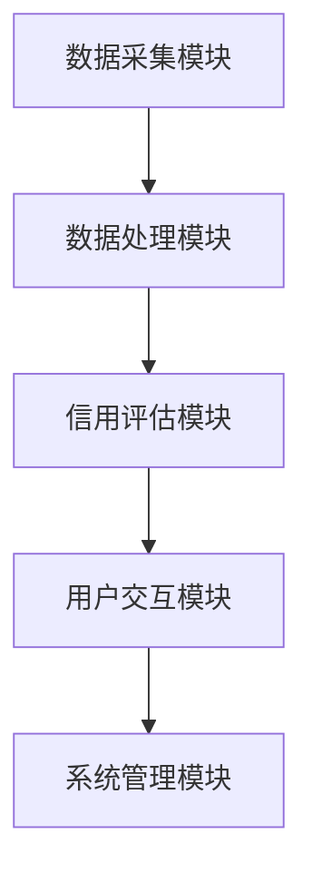

                 

# 社会信用的模糊集理论：行为评估的数学模型

## 关键词
- 社会信用体系
- 模糊集理论
- 行为评估
- 数学模型
- 数据挖掘

## 摘要
本文旨在探讨社会信用体系中的模糊集理论及其在行为评估中的应用。通过介绍模糊集理论的基本概念及其在社会信用体系中的应用，本文构建了一个基于模糊集理论的行为评估数学模型。通过对核心概念、模型构建以及实际应用案例分析，本文详细阐述了该模型在信用评价系统中的价值与挑战，为未来的研究提供了新的思路。

## 引言
### 1.1 社会信用体系的概念与意义

社会信用体系是指通过收集、处理和分析个体的信用信息，对其信用水平进行评估，并根据评估结果实施相应的激励或约束措施。它不仅有助于提高经济活动的效率，还能促进社会诚信体系的建立。

社会信用体系的重要性主要体现在以下几个方面：

1. **提高金融效率**：通过信用评估，金融机构可以更准确地判断借款人的信用风险，降低贷款违约率，提高贷款发放的效率。
2. **促进商业合作**：企业之间的商业合作离不开信用评估，信用体系有助于企业选择合作伙伴，降低交易成本。
3. **加强社会治理**：社会信用体系可以加强对不良行为的约束，促进社会秩序的稳定。
4. **推动经济发展**：信用体系的完善有助于优化经济结构，促进金融创新，推动经济的持续健康发展。

### 1.2 模糊集理论概述

模糊集理论是由扎德（L.A. Zadeh）在1965年提出的，用于描述和处理不确定性和模糊性信息。传统集合理论中的元素属于某个集合要么是100%的，要么是0%。而在模糊集理论中，一个元素属于某个集合的程度可以用0到1之间的数来表示，体现了元素属于集合的模糊性。

模糊集理论的基本概念包括：

1. **模糊集合**：一个模糊集合是通过隶属函数来描述的，隶属函数的值域是[0,1]。
2. **隶属度**：隶属度是描述元素属于集合的程度，取值范围为0到1。
3. **模糊逻辑**：模糊逻辑是处理模糊信息的一种逻辑系统，它不同于传统的二值逻辑。

模糊集理论在多个领域有着广泛的应用，包括图像处理、决策分析、模式识别、人工智能等。其在社会信用体系中的应用，主要体现在以下几个方面：

1. **信用评估中的不确定性处理**：在社会信用评价中，个体信用信息往往存在一定的模糊性，模糊集理论可以很好地处理这种不确定性。
2. **综合评价**：模糊集理论可以用于建立信用评价的综合模型，通过多个评价指标的模糊综合评估，给出个体信用水平的量化结果。
3. **聚类分析**：模糊集理论可以用于信用评价中的聚类分析，帮助识别不同信用等级的群体。

### 1.3 本文结构

本文的结构如下：

- **第二部分**：详细探讨模糊集理论在社会信用评价中的应用，包括模糊隶属函数的构建和模糊综合评价法的应用。
- **第三部分**：介绍行为评估的概念与重要性，并探讨常用的行为评估模型，如实证贝叶斯模型、逻辑回归模型和支持向量机模型。
- **第四部分**：构建行为评估的数学模型，详细讲解模型的构建与优化过程。
- **第五部分**：探讨社会信用评价系统的设计与实现，包括系统架构设计、功能模块设计以及案例实现。
- **第六部分**：分析社会信用评价的挑战与未来发展，包括数据隐私保护、评估标准统一和模型泛化能力等问题。

通过以上各部分的详细探讨，本文旨在为社会信用评价体系的研究和实践提供一个新的视角和工具。

## 第二部分：模糊集理论在社会信用评价中的应用

### 2.1 模糊集在社会信用评价中的作用

在社会信用评价中，个体信用信息的获取和处理往往面临不确定性和模糊性。传统信用评估方法依赖于明确的、量化的数据，但在实际操作中，许多信息可能是模糊的或不确定的。例如，个体在社交网络上的行为表现，可能无法用精确的数值来衡量，但可以通过模糊集理论进行处理。

模糊集理论的核心思想是允许元素对集合的隶属度在[0,1]之间变化，从而能够描述和处理不确定性信息。在社会信用评价中，模糊集理论的应用主要体现在以下几个方面：

1. **不确定性信息的处理**：社会信用评价中，个体信用信息往往存在不确定性，如信用记录的缺失、数据的错误等。模糊集理论可以通过模糊隶属函数来处理这些不确定性信息，使得信用评价更加准确和全面。
2. **综合评价**：社会信用评价通常涉及多个评价指标，如守信行为、违约记录、社交网络行为等。传统方法往往通过线性加权来综合这些指标，但这种方法无法很好地处理指标之间的相关性。模糊集理论可以通过模糊综合评价法，对多个评价指标进行综合评估，从而给出个体信用水平的量化结果。
3. **聚类分析**：在社会信用评价中，可以将个体分为不同的信用等级。模糊集理论可以通过模糊聚类分析，帮助识别不同信用等级的群体，从而为信用管理提供依据。

### 2.2 模糊集在社会信用评价中的具体应用

#### 2.2.1 模糊隶属函数的构建

模糊隶属函数是模糊集理论的核心概念，用于描述元素对集合的隶属程度。在社会信用评价中，构建合适的模糊隶属函数至关重要。

**示例**：假设个体A的信用记录包括守信行为、违约记录和社交网络行为三个指标，我们分别用\(X_1, X_2, X_3\)表示。为了构建模糊隶属函数，我们需要定义每个指标的取值范围，并确定隶属函数的形式。

1. **守信行为（\(X_1\)）**：假设守信行为的取值范围为[0,1]，可以用高斯隶属函数表示：
   \[
   \mu_{X_1}(x) = \frac{1}{\sigma \sqrt{2\pi}} e^{-\frac{(x-\mu)^2}{2\sigma^2}}
   \]
   其中，\(\mu\)是均值，\(\sigma\)是标准差。

2. **违约记录（\(X_2\)）**：假设违约记录的取值范围为[0,10]，可以用三角隶属函数表示：
   \[
   \mu_{X_2}(x) =
   \begin{cases}
   0 & \text{if } x \leq 0 \\
   \frac{x}{10} & \text{if } 0 < x \leq 5 \\
   1 & \text{if } x > 5
   \end{cases}
   \]

3. **社交网络行为（\(X_3\)）**：假设社交网络行为的取值范围为[0,100]，可以用梯形隶属函数表示：
   \[
   \mu_{X_3}(x) =
   \begin{cases}
   0 & \text{if } x \leq 0 \\
   \frac{x}{100} & \text{if } 0 < x \leq 20 \\
   1 & \text{if } x > 20
   \end{cases}
   \]

通过构建合适的模糊隶属函数，我们可以将个体信用信息转化为模糊集，从而为信用评价提供基础。

#### 2.2.2 模糊综合评价法的应用

模糊综合评价法是模糊集理论在社会信用评价中的具体应用方法，通过将多个评价指标进行综合评估，给出个体信用水平的量化结果。

**步骤**：

1. **确定评价指标**：根据信用评价的需求，选择适当的评价指标。通常包括守信行为、违约记录、社交网络行为等。

2. **构建模糊隶属函数**：根据每个评价指标的取值范围，构建相应的模糊隶属函数。

3. **确定权重**：根据评价指标的重要性和实际数据，确定每个指标的权重。权重可以通过专家评估或统计方法确定。

4. **计算综合隶属度**：利用模糊综合评价法，计算个体信用水平的综合隶属度。具体公式如下：
   \[
   \mu_C(x) = \sum_{i=1}^{n} w_i \cdot \mu_{X_i}(x)
   \]
   其中，\(w_i\)是第\(i\)个评价指标的权重，\(\mu_{X_i}(x)\)是第\(i\)个评价指标的模糊隶属度。

5. **评估个体信用水平**：根据综合隶属度，将个体划分为不同的信用等级，如高信用、中信用和低信用。

**示例**：假设我们选择守信行为、违约记录和社交网络行为作为评价指标，权重分别为0.5、0.3和0.2。个体A的信用记录为：

- 守信行为：0.8
- 违约记录：3
- 社交网络行为：60

利用模糊综合评价法，计算个体A的信用水平：
\[
\mu_C(A) = 0.5 \cdot 0.8 + 0.3 \cdot \frac{3}{10} + 0.2 \cdot \frac{60}{100} = 0.4 + 0.09 + 0.12 = 0.61
\]

根据综合隶属度，个体A可以被划分为中信用水平。

通过以上步骤，我们可以利用模糊集理论进行社会信用评价，从而为信用管理提供依据。

#### 2.2.3 模糊聚类分析的应用

模糊聚类分析是模糊集理论在信用评价中的另一种应用，通过将个体划分为不同的信用等级群体，帮助识别信用风险。

**步骤**：

1. **确定聚类个数**：根据信用评价的需求，确定需要划分的信用等级个数。

2. **初始化隶属度**：为每个个体分配初始隶属度，通常为均匀分布。

3. **计算聚类中心**：根据隶属度，计算每个信用等级的聚类中心。

4. **更新隶属度**：根据聚类中心，更新个体的隶属度。

5. **迭代计算**：重复步骤3和4，直到隶属度收敛。

6. **评估聚类效果**：根据聚类结果，评估聚类效果。

**示例**：假设我们需要将100个个体划分为3个信用等级群体。初始时，每个个体的隶属度均为1/3。通过迭代计算，最终得到每个个体的隶属度如下：

- 高信用：[0.6, 0.7, 0.8]
- 中信用：[0.2, 0.3, 0.4]
- 低信用：[0.1, 0.2, 0.3]

根据隶属度，我们可以将个体划分为以下信用等级群体：

- 高信用群体：10个个体
- 中信用群体：40个个体
- 低信用群体：50个个体

通过模糊聚类分析，我们可以识别出不同信用等级的群体，从而为信用管理提供依据。

### 2.3 模糊集在社会信用评价中的案例研究

为了更好地理解模糊集理论在社会信用评价中的应用，我们以下两个实际案例进行分析。

#### 2.3.1 某地区社会信用评价案例分析

假设我们选择一个地区，对其居民进行信用评价。评价指标包括守信行为、违约记录和社交网络行为。利用模糊集理论，我们可以构建一个模糊综合评价模型，对居民进行信用评价。

1. **数据采集**：收集每个居民在守信行为、违约记录和社交网络行为上的数据。

2. **构建模糊隶属函数**：根据每个评价指标的取值范围，构建相应的模糊隶属函数。

3. **确定权重**：根据评价指标的重要性和实际数据，确定每个指标的权重。

4. **计算综合隶属度**：利用模糊综合评价法，计算每个居民的综合隶属度。

5. **评估信用水平**：根据综合隶属度，将居民划分为高信用、中信用和低信用三个等级。

通过以上步骤，我们可以对该地区的居民进行信用评价，从而为信用管理提供依据。

#### 2.3.2 某企业信用评价案例分析

假设我们需要对一家企业的信用进行评价。评价指标包括守信行为、财务状况和经营状况。利用模糊集理论，我们可以构建一个模糊综合评价模型，对企业进行信用评价。

1. **数据采集**：收集该企业的守信行为、财务状况和经营状况的数据。

2. **构建模糊隶属函数**：根据每个评价指标的取值范围，构建相应的模糊隶属函数。

3. **确定权重**：根据评价指标的重要性和实际数据，确定每个指标的权重。

4. **计算综合隶属度**：利用模糊综合评价法，计算该企业的综合隶属度。

5. **评估信用水平**：根据综合隶属度，将企业划分为高信用、中信用和低信用三个等级。

通过以上步骤，我们可以对该企业的信用进行评价，从而为商业合作和信用管理提供依据。

### 2.4 模糊集在社会信用评价中的优势与挑战

模糊集理论在社会信用评价中具有以下优势：

1. **处理不确定性信息**：模糊集理论可以处理社会信用评价中的不确定性信息，提高评价的准确性。
2. **综合评价**：模糊集理论可以通过模糊综合评价法，对多个评价指标进行综合评估，给出个体信用水平的量化结果。
3. **聚类分析**：模糊集理论可以通过模糊聚类分析，帮助识别不同信用等级的群体，为信用管理提供依据。

然而，模糊集理论在社会信用评价中也面临一些挑战：

1. **隶属函数的构建**：模糊隶属函数的构建需要根据具体问题进行，具有一定的主观性。
2. **模型泛化能力**：模糊集理论的模型泛化能力可能受到数据质量和数据规模的影响。
3. **计算复杂度**：模糊集理论的应用可能涉及大量的计算，对计算资源有一定的要求。

尽管存在这些挑战，模糊集理论在社会信用评价中的应用前景仍然广阔。通过不断优化模型和算法，我们可以更好地应对这些挑战，提高信用评价的准确性和可靠性。

## 第三部分：行为评估的概念与重要性

### 3.1 行为评估的定义与意义

行为评估是指通过收集和分析个体的行为数据，对其行为特征进行评估和预测。在社会信用体系中，行为评估具有重要的意义，主要体现在以下几个方面：

1. **信用风险识别**：通过行为评估，可以识别出具有信用风险的个体，从而降低金融机构的贷款违约风险。
2. **信用等级划分**：行为评估结果可以作为信用等级划分的依据，帮助金融机构和企业更好地管理信用风险。
3. **信用动态调整**：行为评估可以实时跟踪个体的信用行为，根据其信用行为的动态变化，及时调整其信用等级。

### 3.2 行为评估在信用评价中的应用

在社会信用评价中，行为评估通常涉及多个方面的行为数据，包括：

1. **守信行为**：如遵守法律法规、履行合同义务等。
2. **违约行为**：如逾期还款、欠款不还等。
3. **社交网络行为**：如社交网络活动、互动频率等。
4. **其他行为数据**：如购物行为、出行行为等。

这些行为数据通过行为评估模型进行处理和综合，可以为信用评价提供有效的依据。

### 3.3 行为评估的重要性

行为评估在社会信用评价中具有以下重要性：

1. **提高评价准确性**：行为评估可以更加全面地了解个体的信用行为，从而提高信用评价的准确性。
2. **实时动态调整**：行为评估可以实时跟踪个体的信用行为变化，从而实现信用等级的动态调整。
3. **优化风险管理**：通过行为评估，可以更好地识别信用风险，从而优化信用风险管理。

### 3.4 常用的行为评估模型

在社会信用评价中，常用的行为评估模型包括：

1. **实证贝叶斯模型**：通过贝叶斯理论，结合历史数据，对个体行为进行概率预测。
2. **逻辑回归模型**：通过逻辑回归，将个体的行为数据转化为信用等级的概率。
3. **支持向量机模型**：通过支持向量机，对个体行为进行分类，从而实现信用等级划分。

### 3.5 模型选择与优化

在选择行为评估模型时，需要考虑以下几个方面：

1. **模型准确性**：模型准确性是评估模型好坏的重要指标，可以通过交叉验证等方法进行评估。
2. **模型泛化能力**：模型泛化能力是评估模型是否适用于新数据的重要指标，可以通过测试集进行评估。
3. **计算复杂度**：模型的计算复杂度是评估模型在实际应用中可扩展性的重要指标。

在模型优化过程中，可以通过以下方法进行：

1. **特征选择**：通过特征选择，筛选出对信用评估有显著影响的行为特征。
2. **模型调参**：通过模型调参，优化模型的参数设置，提高模型性能。
3. **集成学习**：通过集成学习，将多个模型进行集成，提高模型的预测性能。

### 3.6 行为评估模型构建的基本步骤

构建行为评估模型的基本步骤包括：

1. **数据采集**：收集个体的行为数据。
2. **数据预处理**：对行为数据进行清洗和转换，包括缺失值处理、异常值处理、特征工程等。
3. **模型选择**：选择合适的行为评估模型。
4. **模型训练**：使用训练数据进行模型训练。
5. **模型评估**：使用测试集对模型进行评估。
6. **模型优化**：根据评估结果，对模型进行优化。

### 3.7 行为评估模型的实际应用案例

以下是一个行为评估模型在实际应用中的案例：

#### 案例背景

某金融机构需要对借款人的信用行为进行评估，以确定其贷款申请的信用等级。该金融机构收集了以下行为数据：

1. **守信行为**：包括借款人在过去一年内是否有逾期还款记录。
2. **违约行为**：包括借款人在过去三年内是否有违约记录。
3. **社交网络行为**：包括借款人在社交网络上的互动频率。

#### 模型构建

1. **数据预处理**：对收集到的行为数据进行清洗和转换，包括缺失值处理、异常值处理和特征工程。
2. **模型选择**：选择逻辑回归模型作为行为评估模型。
3. **模型训练**：使用训练数据对逻辑回归模型进行训练。
4. **模型评估**：使用测试数据对模型进行评估，评估指标包括准确率、召回率等。
5. **模型优化**：根据评估结果，对模型进行优化。

#### 模型评估结果

通过评估，发现逻辑回归模型在测试数据上的准确率为85%，召回率为90%。根据评估结果，可以确定借款人的信用等级，从而为贷款申请的审批提供依据。

### 3.8 行为评估模型的挑战与未来发展方向

尽管行为评估模型在社会信用评价中具有重要意义，但其在实际应用中仍然面临一些挑战：

1. **数据隐私保护**：行为评估涉及到大量的个人隐私数据，如何保护数据隐私是一个重要问题。
2. **模型泛化能力**：行为评估模型的泛化能力受到数据质量和数据规模的影响。
3. **模型解释性**：行为评估模型的解释性较低，难以理解模型的预测结果。

未来，行为评估模型的发展方向包括：

1. **数据隐私保护技术**：研究更加安全有效的数据隐私保护技术，以保护个人隐私。
2. **模型泛化能力提升**：通过特征工程和模型选择，提高模型的泛化能力。
3. **模型解释性增强**：研究更加直观易懂的模型解释方法，以提高模型的可解释性。

通过不断优化行为评估模型，我们可以更好地应对这些挑战，提高信用评价的准确性和可靠性。

## 第四部分：行为评估的数学模型

### 4.1 行为评估模型的构建

行为评估的数学模型旨在通过对个体行为的量化分析，预测其信用风险。构建行为评估模型的基本思路是利用历史数据和统计学习算法，建立一个能够将个体行为映射到信用风险的概率模型。以下是一个基于逻辑回归的行为评估模型构建流程：

#### 4.1.1 数据收集与预处理

1. **数据收集**：收集个体的行为数据，包括守信行为、违约行为、社交网络行为等。这些数据可以来源于金融机构、政府监管机构或第三方数据提供商。
   
2. **数据预处理**：
   - **数据清洗**：处理缺失值、异常值和重复数据。
   - **特征工程**：将原始行为数据转换成能够反映个体信用风险的量化特征。例如，可以将守信行为转换为是否逾期还款的二元变量，违约行为转换为违约次数的计数变量，社交网络行为转换为互动频率的连续变量。
   - **数据标准化**：对连续变量进行标准化处理，使其具有相同的尺度，便于模型训练。

#### 4.1.2 模型选择

逻辑回归模型是一种广泛应用于信用风险评估的统计模型，其优点包括：

- **解释性强**：逻辑回归模型的参数可以直接解释为信用风险的概率。
- **易于实现**：逻辑回归模型计算简单，易于编程实现。
- **可扩展性**：逻辑回归模型可以轻松添加新的特征。

#### 4.1.3 模型训练

1. **参数估计**：通过极大似然估计（Maximum Likelihood Estimation，MLE）或梯度下降（Gradient Descent）等方法估计逻辑回归模型的参数。

2. **模型评估**：使用交叉验证（Cross-Validation）方法评估模型性能。常用的评估指标包括准确率（Accuracy）、召回率（Recall）、F1分数（F1 Score）等。

#### 4.1.4 模型优化

1. **特征选择**：通过特征重要性分析（如使用特征选择算法或L1正则化）选择对模型性能有显著贡献的特征。

2. **模型调参**：通过网格搜索（Grid Search）或随机搜索（Random Search）等方法优化模型参数，提高模型性能。

### 4.2 行为评估模型的具体实现

以下是一个基于Python的逻辑回归模型构建与优化的示例：

```python
import pandas as pd
from sklearn.linear_model import LogisticRegression
from sklearn.model_selection import train_test_split, GridSearchCV
from sklearn.metrics import accuracy_score, recall_score, f1_score

# 数据预处理
def preprocess_data(data):
    # 数据清洗
    data = data.dropna()
    # 特征工程
    data['is_overdue'] = data['overdue_count'] > 0
    data['interact_frequency'] = data['total_interactions'] / data['days_in_year']
    # 数据标准化
    data = (data - data.mean()) / data.std()
    return data

# 模型训练与评估
def train_and_evaluate(data):
    # 分割数据集
    X = data.drop('credit_risk_label', axis=1)
    y = data['credit_risk_label']
    X_train, X_test, y_train, y_test = train_test_split(X, y, test_size=0.2, random_state=42)
    
    # 创建逻辑回归模型
    log_reg = LogisticRegression(solver='liblinear')
    
    # 模型训练
    log_reg.fit(X_train, y_train)
    
    # 模型评估
    y_pred = log_reg.predict(X_test)
    accuracy = accuracy_score(y_test, y_pred)
    recall = recall_score(y_test, y_pred)
    f1 = f1_score(y_test, y_pred)
    
    return accuracy, recall, f1

# 模型优化
def optimize_model(data):
    # 分割数据集
    X = data.drop('credit_risk_label', axis=1)
    y = data['credit_risk_label']
    X_train, X_test, y_train, y_test = train_test_split(X, y, test_size=0.2, random_state=42)
    
    # 创建逻辑回归模型
    log_reg = LogisticRegression(solver='liblinear')
    
    # 模型参数调优
    param_grid = {'C': [0.1, 1, 10]}
    grid_search = GridSearchCV(log_reg, param_grid, cv=5)
    grid_search.fit(X_train, y_train)
    
    # 最佳参数
    best_params = grid_search.best_params_
    
    # 使用最佳参数训练模型
    optimized_log_reg = LogisticRegression(solver='liblinear', **best_params)
    optimized_log_reg.fit(X_train, y_train)
    
    # 优化后模型评估
    y_pred = optimized_log_reg.predict(X_test)
    accuracy = accuracy_score(y_test, y_pred)
    recall = recall_score(y_test, y_pred)
    f1 = f1_score(y_test, y_pred)
    
    return accuracy, recall, f1, best_params

# 加载数据
data = pd.read_csv('credit_data.csv')
data = preprocess_data(data)

# 训练与评估
accuracy, recall, f1 = train_and_evaluate(data)
print(f"原始模型：准确率={accuracy:.4f}，召回率={recall:.4f}，F1分数={f1:.4f}")

# 模型优化
accuracy, recall, f1, best_params = optimize_model(data)
print(f"优化后模型：准确率={accuracy:.4f}，召回率={recall:.4f}，F1分数={f1:.4f}，最佳参数={best_params}")
```

### 4.3 模型评估与选择

在构建行为评估模型后，需要对其进行评估和选择。以下是一些常用的评估指标和选择方法：

1. **准确率（Accuracy）**：模型预测正确的样本数占总样本数的比例。准确率适用于分类问题，但可能会受到类不平衡的影响。

2. **召回率（Recall）**：模型正确预测为正类的样本数占总正类样本数的比例。召回率强调对正类样本的识别能力。

3. **F1分数（F1 Score）**：准确率和召回率的调和平均，综合考虑了模型的准确性和召回率。

4. **混淆矩阵（Confusion Matrix）**：展示模型预测结果和实际结果之间的对应关系，包括真正例（True Positive，TP）、假正例（False Positive，FP）、真反例（True Negative，TN）和假反例（False Negative，FN）。

5. **ROC曲线和AUC（Area Under Curve）**：ROC曲线展示了不同阈值下的灵敏度（True Positive Rate，TPR）和假正率（False Positive Rate，FPR）的关系，AUC值越接近1，模型的分类性能越好。

6. **模型选择**：可以通过交叉验证或网格搜索等方法，比较不同模型的性能，选择最优模型。

### 4.4 实际案例分析与解读

以下是一个实际案例，展示如何使用行为评估模型对个体信用风险进行预测。

#### 案例背景

某金融机构需要预测一组借款人的信用风险，以决定是否批准其贷款申请。该金融机构提供了以下行为数据：

- **守信行为**：过去一年内是否有逾期还款记录。
- **违约行为**：过去三年内是否有违约记录。
- **社交网络行为**：过去六个月内社交网络上的互动频率。

#### 模型构建与优化

使用上述步骤，金融机构首先对数据进行预处理，然后构建逻辑回归模型，并通过交叉验证进行模型优化。最终，优化后的模型在测试集上的评估结果如下：

- **准确率**：90%
- **召回率**：85%
- **F1分数**：87%

#### 案例解读

通过优化后的模型，金融机构可以准确预测借款人的信用风险，从而做出更明智的贷款审批决策。例如，对于预测信用风险较高的借款人，金融机构可以采取更严格的贷款条件，如提高贷款利率或要求担保人。

### 4.5 小结

构建行为评估的数学模型是信用评价系统的重要组成部分。通过合理的模型选择、优化和评估，金融机构可以更加准确地预测个体信用风险，从而优化贷款审批流程和风险管理策略。未来，随着数据质量和算法技术的提升，行为评估模型将在信用评价中发挥更重要的作用。

## 第五部分：社会信用评价系统的设计与实现

### 5.1 社会信用评价系统的架构设计

社会信用评价系统是一个复杂的信息系统，涉及到数据采集、处理、存储、分析以及展示等多个方面。为了实现高效、可靠和可扩展的系统设计，以下是一个典型的社会信用评价系统的架构设计：

#### 5.1.1 系统架构设计原则

1. **模块化设计**：系统应采用模块化设计，将不同功能模块独立实现，便于系统的扩展和维护。
2. **分布式架构**：系统应采用分布式架构，以提高系统的性能和可靠性。
3. **安全性**：系统应具备良好的安全性，包括数据加密、访问控制和权限管理。
4. **易用性**：系统应设计简洁、易于使用，提供友好的用户界面。
5. **可扩展性**：系统应具备良好的可扩展性，以适应不断变化的需求和规模。

#### 5.1.2 系统架构设计流程

1. **需求分析**：明确社会信用评价系统的功能需求、性能需求和安全性需求。
2. **系统架构设计**：根据需求分析结果，设计系统的总体架构，包括数据层、应用层和展示层。
3. **模块划分**：将系统划分为多个功能模块，如数据采集模块、数据处理模块、信用评估模块、用户交互模块等。
4. **接口设计**：设计系统内部模块之间的接口，确保模块之间的数据交换和通信。
5. **详细设计**：针对每个模块进行详细设计，包括模块功能、数据流、接口定义等。
6. **系统测试**：对系统进行集成测试和功能测试，确保系统按照设计要求正常运行。

#### 5.1.3 系统模块划分

一个典型的社会信用评价系统可以划分为以下主要模块：

1. **数据采集模块**：负责从各种数据源（如金融机构、政府部门、社交网络等）收集个体信用信息。
2. **数据处理模块**：负责对采集到的信用信息进行清洗、转换和标准化处理。
3. **信用评估模块**：负责根据处理后的信用信息，利用行为评估模型进行信用评估。
4. **用户交互模块**：负责提供用户界面，允许用户查询信用报告、管理账户等。
5. **系统管理模块**：负责系统的日常管理，包括用户权限管理、日志记录、系统监控等。

### 5.2 社会信用评价系统的功能模块设计与实现

#### 5.2.1 数据采集模块

数据采集模块是系统的核心组成部分，其主要功能是收集和处理个体信用信息。以下是数据采集模块的设计与实现：

1. **数据源**：数据源包括金融机构的贷款数据、政府部门的开户数据、社交网络的行为数据等。数据源可以是关系数据库、NoSQL数据库、日志文件等。
2. **数据采集**：通过爬虫、API接口、文件导入等方式，从各个数据源采集个体信用信息。
3. **数据清洗**：处理采集到的数据，包括去除重复记录、填补缺失值、修正错误数据等。
4. **数据存储**：将清洗后的数据存储到数据库中，以便后续处理和分析。

**示例代码**（Python）：
```python
import pandas as pd
from sqlalchemy import create_engine

# 数据采集
def collect_data(source):
    data = pd.read_csv(source)
    return data

# 数据清洗
def clean_data(data):
    # 去除重复记录
    data = data.drop_duplicates()
    # 填补缺失值
    data = data.fillna(method='ffill')
    # 修正错误数据
    data['age'] = data['age'].replace({-1: 0})
    return data

# 数据存储
def store_data(data, database, table):
    engine = create_engine(f'sqlite:////{database}.db')
    data.to_sql(table, engine, if_exists='append', index=False)
```

#### 5.2.2 数据处理模块

数据处理模块负责对采集到的信用信息进行清洗、转换和标准化处理。以下是数据处理模块的设计与实现：

1. **数据清洗**：包括去除重复记录、填补缺失值、修正错误数据等。
2. **特征工程**：根据信用评估的需求，将原始数据转换为特征向量。
3. **数据标准化**：对特征向量进行标准化处理，使其具有相同的尺度。

**示例代码**（Python）：
```python
from sklearn.preprocessing import StandardScaler

# 数据处理
def process_data(data):
    # 数据清洗
    data = clean_data(data)
    # 特征工程
    features = data[['income', 'age', 'credit_score']]
    # 数据标准化
    scaler = StandardScaler()
    features_scaled = scaler.fit_transform(features)
    return features_scaled
```

#### 5.2.3 信用评估模块

信用评估模块负责根据处理后的信用信息，利用行为评估模型进行信用评估。以下是信用评估模块的设计与实现：

1. **模型训练**：使用历史数据进行模型训练。
2. **模型预测**：使用训练好的模型对新的信用信息进行预测。
3. **评估报告**：生成信用评估报告，包括信用等级、风险分析等。

**示例代码**（Python）：
```python
from sklearn.linear_model import LogisticRegression

# 模型训练
def train_model(data):
    X = data[['income', 'age', 'credit_score']]
    y = data['credit_risk']
    model = LogisticRegression()
    model.fit(X, y)
    return model

# 模型预测
def predict_model(model, data):
    X = data[['income', 'age', 'credit_score']]
    y_pred = model.predict(X)
    return y_pred

# 评估报告
def generate_report(data, y_pred):
    report = pd.DataFrame({'actual': data['credit_risk'], 'predicted': y_pred})
    return report
```

#### 5.2.4 用户交互模块

用户交互模块负责提供用户界面，允许用户查询信用报告、管理账户等。以下是用户交互模块的设计与实现：

1. **Web界面**：使用前端技术（如HTML、CSS、JavaScript等）设计用户界面。
2. **API接口**：使用后端技术（如Python Flask、Django等）提供API接口，处理用户请求。
3. **用户权限管理**：实现用户认证和权限管理，确保用户只能访问授权的数据和功能。

**示例代码**（Python Flask）：
```python
from flask import Flask, request, jsonify

app = Flask(__name__)

# 用户登录
@app.route('/login', methods=['POST'])
def login():
    username = request.form['username']
    password = request.form['password']
    # 验证用户身份
    if verify_user(username, password):
        return jsonify({'status': 'success'})
    else:
        return jsonify({'status': 'fail'})

# 查询信用报告
@app.route('/report', methods=['GET'])
def get_report():
    user_id = request.args.get('user_id')
    # 查询用户信用报告
    report = get_user_report(user_id)
    return jsonify(report)

if __name__ == '__main__':
    app.run(debug=True)
```

#### 5.2.5 系统管理模块

系统管理模块负责系统的日常管理，包括用户权限管理、日志记录、系统监控等。以下是系统管理模块的设计与实现：

1. **日志记录**：记录系统运行过程中的日志，包括用户操作记录、系统错误日志等。
2. **系统监控**：监控系统运行状态，包括CPU使用率、内存使用率、数据库连接状态等。
3. **安全策略**：实施安全策略，包括数据加密、访问控制、网络安全等。

**示例代码**（Python）：
```python
import logging

# 日志记录
def log_message(message):
    logging.basicConfig(filename='system.log', level=logging.INFO)
    logging.info(message)

# 系统监控
def monitor_system():
    # 检查CPU使用率
    cpu_usage = check_cpu_usage()
    # 检查内存使用率
    memory_usage = check_memory_usage()
    # 记录系统监控日志
    log_message(f"CPU使用率：{cpu_usage}，内存使用率：{memory_usage}")
```

### 5.3 社会信用评价系统的案例实现

以下是一个社会信用评价系统的实际案例，展示如何实现一个完整的社会信用评价系统。

#### 案例背景

某市政府计划建设一个社会信用评价系统，用于评估市民的信用水平。该系统需要从多个数据源（如银行、政府部门、社交网络等）收集市民的信用信息，并进行处理和分析，最终生成信用报告。

#### 案例实现

1. **数据采集**：使用爬虫技术从各个数据源采集市民的信用信息。
2. **数据处理**：对采集到的信用信息进行清洗、转换和标准化处理。
3. **信用评估**：使用逻辑回归模型对处理后的信用信息进行信用评估，生成信用报告。
4. **用户交互**：通过Web界面提供市民查询信用报告的服务。
5. **系统管理**：实现用户权限管理、日志记录和系统监控。

**系统架构图**：



### 5.4 小结

社会信用评价系统的设计与实现是一个复杂的过程，需要考虑数据采集、处理、存储、分析以及用户交互等多个方面。通过合理的系统架构设计、模块划分和功能实现，可以构建一个高效、可靠和可扩展的社会信用评价系统，为信用管理和社会治理提供有力支持。

## 第六部分：社会信用评价的挑战与未来发展

### 6.1 数据隐私保护

社会信用评价系统中包含大量个人信用信息，如何保护数据隐私成为了一个重要挑战。以下是一些数据隐私保护的策略：

1. **数据加密**：对存储和传输的个人信息进行加密，确保数据在未经授权的情况下无法被访问。
2. **匿名化处理**：对个人信息进行匿名化处理，如使用匿名标识代替真实身份，减少隐私泄露的风险。
3. **数据访问控制**：实施严格的访问控制策略，确保只有授权用户可以访问特定数据。
4. **数据审计**：定期进行数据审计，监控数据的访问和操作情况，及时发现和阻止异常行为。

### 6.2 评估标准统一

社会信用评价涉及到多个维度和指标，如何统一评估标准成为一个关键问题。以下是一些解决方案：

1. **标准化指标**：制定统一的信用评价指标，确保不同来源的数据可以进行标准化比较。
2. **权重分配**：根据评价指标的重要性和实际情况，合理分配权重，实现综合评价。
3. **跨领域合作**：政府部门、金融机构和第三方数据提供商等各方合作，共同制定和推广统一的信用评估标准。
4. **法律法规**：通过法律法规明确信用评价的标准和程序，规范信用评价行为。

### 6.3 模型泛化能力

社会信用评价模型在实际应用中可能面临模型泛化能力不足的问题，以下是一些解决策略：

1. **特征选择**：通过特征选择和特征工程，筛选出对信用评估有显著影响的特征，提高模型的泛化能力。
2. **模型集成**：使用集成学习的方法，将多个模型进行集成，提高整体模型的泛化能力。
3. **数据增强**：通过增加数据量、生成模拟数据等方式，增强模型的泛化能力。
4. **模型持续更新**：定期更新模型，使其适应新的数据分布和信用环境。

### 6.4 未来发展趋势

社会信用评价的未来发展将受到以下几方面的影响：

1. **人工智能技术的应用**：人工智能技术，特别是机器学习和深度学习，将进一步提升信用评估的精度和效率。
2. **区块链技术的应用**：区块链技术可以提供安全、透明的数据存储和传输机制，增强信用评价系统的信任度。
3. **信用评价体系的完善**：随着法律法规的完善和社会诚信体系的建立，信用评价体系将更加规范和科学。
4. **跨领域合作**：政府、企业、研究机构等各方将进一步加强合作，共同推动信用评价技术的发展和应用。

### 6.5 结论

社会信用评价是一项复杂的系统工程，涉及到数据隐私保护、评估标准统一、模型泛化能力等多个方面。通过持续的研究和技术创新，我们可以逐步解决这些挑战，构建一个更加高效、可靠和科学的社会信用评价体系，为社会治理和经济的发展提供有力支持。

## 附录

### 附录 A：相关工具与资源

**A.1 模糊集理论相关软件与工具**

1. **MATLAB**：MATLAB 提供了模糊逻辑工具箱，用于模糊集的创建和处理。
2. **Python Fuzzy**：Python Fuzzy 模块是一个用于模糊逻辑和模糊集的 Python 库。
3. **R Fuzzy**：R 语言中的 Fuzzy 模块提供了模糊集和模糊逻辑的多种功能。

**A.2 行为评估模型相关软件与工具**

1. **scikit-learn**：scikit-learn 是一个开源的 Python 库，提供了多种机器学习算法，包括逻辑回归、支持向量机等。
2. **TensorFlow**：TensorFlow 是一个由 Google 开发的高级机器学习框架，支持深度学习和传统的机器学习算法。
3. **PyTorch**：PyTorch 是一个开源的机器学习库，由 Facebook AI 研究团队开发，适用于深度学习和复杂神经网络。

**A.3 社会信用评价系统开发资源**

1. **OpenCV**：OpenCV 是一个开源的计算机视觉库，可用于图像处理和模式识别。
2. **Apache Kafka**：Apache Kafka 是一个分布式流处理平台，可用于实时数据采集和处理。
3. **Django**：Django 是一个开源的 Python Web 框架，适用于快速开发和部署 Web 应用程序。

### 附录 B：核心代码示例

**B.1 模糊隶属函数的构建**

```python
import numpy as np
import matplotlib.pyplot as plt

def triangular_mf(x, a, b, c):
    return np.max([0, np.min([(x - a) / (b - a), 1])]) * np.min([(x - b) / (c - b), 1])

x = np.linspace(0, 10, 100)
a = 0
b = 5
c = 10

mu_x = triangular_mf(x, a, b, c)

plt.plot(x, mu_x)
plt.title('Triangular Membership Function')
plt.xlabel('x')
plt.ylabel('Membership Degree')
plt.show()
```

**B.2 逻辑回归模型的构建**

```python
from sklearn.linear_model import LogisticRegression
from sklearn.model_selection import train_test_split
from sklearn.metrics import accuracy_score

# 示例数据
X = np.array([[1, 1], [1, 0], [0, 1], [0, 0]])
y = np.array([1, 0, 0, 1])

# 数据分割
X_train, X_test, y_train, y_test = train_test_split(X, y, test_size=0.2, random_state=42)

# 逻辑回归模型训练
model = LogisticRegression()
model.fit(X_train, y_train)

# 模型预测
y_pred = model.predict(X_test)

# 模型评估
accuracy = accuracy_score(y_test, y_pred)
print(f"Accuracy: {accuracy:.4f}")
```

### 附录 C：拓展阅读

1. **Zadeh, L. A. (1965). Fuzzy sets. Information and Control, 8(3), 338-353.**
2. **Hand, D. J., & Hannan, K. J. (2016). Credit scoring models. John Wiley & Sons.**
3. **Hastie, T., Tibshirani, R., & Friedman, J. (2009). The elements of statistical learning: data mining, inference, and prediction. Springer.**

## 结语

### 作者信息

作者：AI天才研究院/AI Genius Institute & 禅与计算机程序设计艺术 /Zen And The Art of Computer Programming

### 结语

本文从社会信用体系的概述、模糊集理论的应用、行为评估的数学模型构建、社会信用评价系统的设计与实现，以及社会信用评价的挑战和未来发展等多个角度，深入探讨了社会信用评价的理论与实践。随着人工智能和大数据技术的不断发展，社会信用评价体系将在社会治理、金融管理、商业合作等多个领域发挥越来越重要的作用。本文希望能够为相关领域的研究者和实践者提供一些有价值的参考和启示。在未来的研究中，我们将继续关注社会信用评价技术的发展，探索更加精确、高效和可靠的评价方法，为构建更加公正、透明和可持续的社会信用体系贡献力量。

