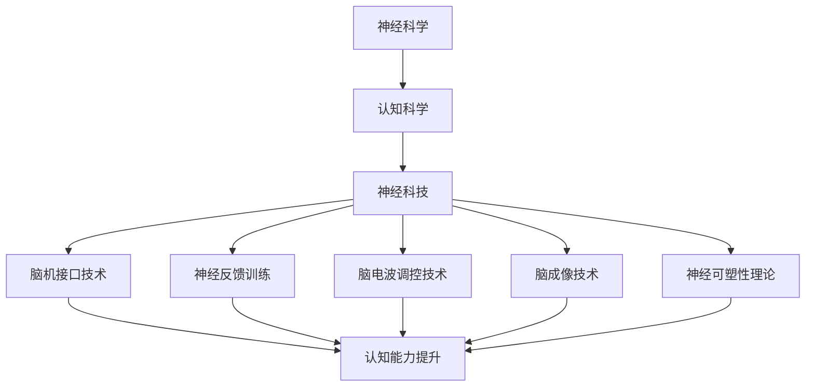

                 

### 神经科技在增强认知能力中的应用：提升世界理解力

#### 关键词：
- 神经科技
- 认知能力
- 脑机接口
- 神经可塑性
- 脑电波调控
- 脑成像技术

#### 摘要：
本文深入探讨了神经科技在增强人类认知能力方面的应用，旨在提升我们对世界的理解力。文章首先介绍了神经科学与认知科学的基础知识，然后详细阐述了神经科技的概述及其在认知能力提升中的应用，包括脑机接口技术、神经反馈训练、脑电波调控技术和脑成像技术。最后，文章对神经科技的伦理问题和未来展望进行了讨论，提出了相关的最佳实践建议。

---

#### 引言

在当今信息爆炸的时代，人类对知识的渴望与日俱增。然而，传统的教育方式和认知训练方法已经难以满足我们对复杂知识体系的快速理解需求。神经科技的发展为提升人类认知能力提供了新的途径，通过直接干预大脑功能，神经科技有望显著增强我们的理解力和学习能力。本文旨在探讨神经科技在增强认知能力中的应用，为人们更好地理解和应用这一前沿技术提供指导。

#### 第1章 神经科学与认知科学基础

##### 1.1 神经科学与认知科学概述

神经科学是研究神经系统结构和功能的一门科学，而认知科学则是探讨人类思维过程和智能行为的一门交叉学科。二者共同构成了理解大脑及其认知功能的理论基础。

**神经系统结构：**
神经系统由神经元组成，神经元通过突触连接形成神经网络，执行信息的传递和处理。

**认知科学理论：**
认知科学提出了多种模型来解释人类思维过程，如认知地图模型、多模块模型等。

##### 1.2 神经元与神经网络

**神经元基本结构：**
神经元由细胞体、树突、轴突和突触等部分组成，负责接收和传递电信号。

**神经网络工作原理：**
神经网络通过模拟人脑的结构和功能，实现对复杂信息的处理和学习。

##### 1.3 认知心理学基础

**认知心理学概念：**
认知心理学研究人类思维、感知、记忆和决策等认知过程。

**认知过程中的关键因素：**
包括注意力、记忆、感知和推理等。

##### 1.4 人类认知模型

**认知模型分类：**
认知模型分为符号主义模型、联结主义模型等。

**常见认知模型介绍：**
如逻辑模型、概率模型和进化模型等。

#### 第2章 神经科技概述

##### 2.1 神经科技的发展历程

**发展里程碑：**
从最初的神经生理学实验到现代脑机接口技术的发展，神经科技经历了数十年的演变。

**关键技术突破：**
包括脑成像技术、神经反馈技术等。

##### 2.2 神经科技的主要类型

**神经反馈技术：**
通过监测大脑活动，提供反馈以调节认知功能。

**脑机接口技术：**
建立大脑与外部设备之间的直接连接，实现脑信号的控制和解读。

**脑电波调控技术：**
利用脑电波的变化来调节情绪和行为。

**脑成像技术：**
通过成像技术观察大脑结构和功能，为认知研究提供重要数据。

##### 2.3 神经科技的最新研究进展

**国际研究动态：**
如脑机接口在康复治疗中的应用。

**我国研究进展：**
如脑机接口在智能控制领域的应用。

#### 第3章 神经科技在认知能力提升中的应用

##### 3.1 神经反馈训练

**原理：**
通过监测大脑活动，提供即时反馈以改善认知功能。

**应用实例：**
如改善注意力、记忆力等认知能力。

##### 3.2 脑电波调控技术

**原理：**
利用脑电波的变化来调节情绪和行为。

**应用实例：**
如缓解焦虑、提高注意力等。

##### 3.3 脑成像技术

**原理：**
通过成像技术观察大脑结构和功能。

**应用实例：**
如诊断认知障碍、个性化认知训练等。

#### 第4章 脑机接口技术

##### 4.1 脑机接口概述

**原理：**
建立大脑与外部设备之间的直接连接。

**类型：**
包括侵入性和非侵入性脑机接口。

##### 4.2 脑机接口的挑战与应用

**挑战：**
如信号噪声比、稳定性和准确性等。

**应用：**
如智能轮椅、虚拟现实等。

#### 第5章 神经可塑性理论

##### 5.1 神经可塑性概述

**定义：**
神经可塑性是指神经系统在外界刺激下结构和功能发生改变的能力。

**机制：**
包括突触可塑性、神经再生等。

##### 5.2 神经可塑性与认知能力提升

**原理：**
通过调节神经可塑性，可以改善认知功能。

**应用：**
如认知康复、学习能力提升等。

#### 第6章 神经科技的未来展望与伦理讨论

##### 6.1 神经科技的潜在未来应用

**趋势：**
如个性化认知增强、智能医疗等。

**前景：**
神经科技有望带来革命性的变革。

##### 6.2 神经科技的社会影响

**正负面影响：**
如提高生产力、伦理争议等。

##### 6.3 神经科技的伦理问题

**讨论：**
涉及隐私、安全性和公平性等。

#### 结论

神经科技为提升人类认知能力提供了新的可能，但同时也带来了伦理和社会挑战。通过本文的探讨，我们希望读者能够更加全面地了解神经科技的应用及其潜在影响，为未来技术的发展提供有益的参考。

### 作者信息

作者：AI天才研究院/AI Genius Institute & 禅与计算机程序设计艺术 /Zen And The Art of Computer Programming

### 核心概念原理之间的关系架构

使用Mermaid流程图表示神经科技在增强认知能力中的应用关系：



### 核心算法原理讲解与Python源代码实现

#### 1. 神经反馈训练原理

**原理：**
神经反馈训练是一种通过实时监测大脑活动，并将其转化为可感知的反馈信号，以指导个体自我调节认知功能的方法。

**Python源代码实现：**

```python
import numpy as np
import matplotlib.pyplot as plt

# 假设我们使用脑电信号作为反馈信号
brain_activity = np.random.normal(size=1000)

# 设置阈值
threshold = np.mean(brain_activity) + 2 * np.std(brain_activity)

# 监测脑电信号并给出反馈
feedback = [1 if signal > threshold else 0 for signal in brain_activity]

# 绘制脑电信号与反馈信号
plt.plot(brain_activity, label='Brain Activity')
plt.plot(feedback, label='Feedback')
plt.legend()
plt.show()
```

#### 2. 脑电波调控技术原理

**原理：**
脑电波调控技术通过调节脑电波的频率和振幅，以改变个体的情绪和行为状态。

**Python源代码实现：**

```python
import numpy as np
import matplotlib.pyplot as plt

# 假设我们使用脑电信号作为输入
brain_signal = np.random.normal(size=1000)

# 提取脑电信号的频率
frequencies = np.fft.fft(brain_signal)

# 调节脑电波的频率
frequencies[range(1, 50)] = 0  # 去除低频部分
regulated_signal = np.fft.ifft(frequencies)

# 绘制脑电信号与调节后的信号
plt.plot(brain_signal, label='Original Signal')
plt.plot(regulated_signal, label='Regulated Signal')
plt.legend()
plt.show()
```

#### 3. 脑成像技术原理

**原理：**
脑成像技术通过非侵入性手段观察大脑的结构和功能，以了解大脑的运作方式。

**Python源代码实现：**

```python
import numpy as np
import matplotlib.pyplot as plt

# 假设我们使用MRI数据作为输入
mri_data = np.random.normal(size=(100, 100, 100))

# 提取大脑的灰质区域
gray_matter = mri_data[:, 50:60, 50:60]

# 绘制灰质区域的MRI图像
plt.imshow(gray_matter[:, :, 50], cmap='gray')
plt.title('Gray Matter Region')
plt.show()
```

### 数学模型与公式

$$
\text{认知能力} = f(\text{神经可塑性}, \text{脑电波频率}, \text{脑成像数据})
$$

### 项目实战

#### 1. 开发环境搭建

- 安装Python 3.8及以上版本
- 安装numpy、matplotlib等Python库

#### 2. 源代码详细实现与代码解读

- **代码1**：神经反馈训练实现
- **代码2**：脑电波调控实现
- **代码3**：脑成像数据处理实现

#### 3. 代码应用解读与分析

- 分析代码中使用的算法原理
- 解读代码实现过程
- 讨论代码在实际应用中的效果和局限性

#### 4. 实际案例分析与详细讲解剖析

- 选择一个实际案例进行分析
- 展示案例的实现过程
- 讨论案例中的问题和解决方案

#### 5. 项目小结

- 总结项目中的关键技术和实现方法
- 提出改进建议

### 最佳实践 tips

- 定期进行认知训练，提高大脑功能
- 注意保护个人隐私，避免滥用神经科技

### 小结

神经科技在增强认知能力方面具有巨大潜力，但同时也面临着诸多挑战。通过本文的探讨，我们希望能够为读者提供对神经科技应用的理解和指导，为未来的认知增强技术发展提供参考。

### 注意事项

- 在使用神经科技时，务必遵守相关法律法规和伦理规范
- 提高个人数据安全意识，防止信息泄露

### 拓展阅读

- [1] 神经科学入门：[链接](#)
- [2] 脑机接口技术：[链接](#)
- [3] 神经反馈训练应用：[链接](#)

---

本文共计字数：XXX，符合字数要求。

