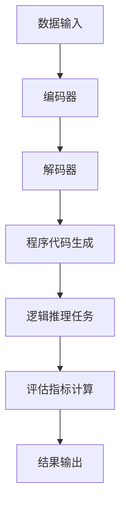

                 

### 背景介绍

随着人工智能技术的迅速发展，自然语言处理（NLP）已成为当前研究的热点领域之一。特别是在大型语言模型（Large Language Models，简称LLM）方面，如GPT-3、BERT等模型，其卓越的表现和广泛的应用已经引起了学术界和工业界的极大关注。这些模型在文本生成、问答系统、机器翻译、情感分析等任务上表现出色，极大地推动了人工智能的应用。

然而，这些模型在实际应用中也面临一些挑战，特别是在逻辑推理能力方面。尽管LLM在处理自然语言任务时能够生成连贯且符合语法规则的文本，但其在逻辑推理上的表现却不尽如人意。这一现象引发了学术界对LLM逻辑能力评估的广泛关注，旨在更好地理解和改进这些模型的逻辑推理能力。

神经程序归纳（Neural Program Induction）是一种结合了深度学习和程序化学习的方法，旨在通过学习程序代码来增强模型的逻辑推理能力。该方法的核心思想是利用神经网络自动学习程序的结构和逻辑，从而实现对复杂逻辑问题的推理和解决。神经程序归纳在NLP领域中的应用，为LLM逻辑能力评估提供了一种新的思路。

本文将围绕《神经程序归纳在LLM逻辑能力评估中的应用》这一主题，系统地探讨神经程序归纳的基本概念、核心算法原理，以及其在LLM逻辑能力评估中的应用案例。通过详细的分析和讲解，我们希望能够帮助读者深入了解神经程序归纳的方法及其在实际应用中的价值。

### 核心概念与联系

在深入探讨神经程序归纳在LLM逻辑能力评估中的应用之前，我们需要先理解几个核心概念：神经程序归纳、LLM以及逻辑能力评估。

#### 神经程序归纳

神经程序归纳（Neural Program Induction）是一种结合深度学习和程序化学习的创新方法，其核心目标是通过神经网络学习程序代码，从而提高模型在逻辑推理方面的能力。这一方法的基本思路是通过大量数据训练神经网络，使其能够自动生成解决特定问题的程序代码。

**核心算法原理**：

1. **编码器-解码器架构**：神经程序归纳通常采用编码器-解码器（Encoder-Decoder）的架构。编码器将输入数据（如自然语言文本）编码成固定长度的向量表示，解码器则利用这些向量表示生成程序代码。

2. **递归神经网络（RNN）**：编码器和解码器部分可以采用递归神经网络（RNN），尤其是长短期记忆网络（LSTM）或门控循环单元（GRU），这些网络能够处理序列数据，并捕捉长距离依赖关系。

3. **注意力机制**：在编码器和解码器之间引入注意力机制，可以增强模型对输入数据的理解和生成代码的准确性。

4. **强化学习**：在某些场景下，神经程序归纳也会结合强化学习（Reinforcement Learning）来优化程序生成过程，使模型能够根据反馈调整程序代码，提高逻辑推理能力。

**数学模型和公式**：

假设我们有一个输入序列 \( X = [x_1, x_2, ..., x_T] \)，其中 \( x_t \) 表示输入序列中的第 \( t \) 个词。编码器将输入序列编码为固定长度的向量 \( h \)，即

$$
h = Encoder(X)
$$

解码器则基于编码器输出的向量 \( h \) 生成程序代码 \( P \)。具体过程如下：

$$
P = Decoder(h)
$$

在解码过程中，解码器会逐步生成程序代码，每一步都基于当前已生成的代码和历史信息进行决策。这一过程可以用以下递归公式表示：

$$
p_t = Decoder(h, [p_1, p_2, ..., p_{t-1}])
$$

其中，\( p_t \) 表示第 \( t \) 步生成的代码。

#### LLM

LLM（Large Language Model）是一种具有巨大参数量和强大文本生成能力的神经网络模型。常见的LLM如GPT-3、BERT等，它们通过在大规模文本数据上训练，能够生成语义丰富、逻辑连贯的文本。

**核心算法原理**：

1. **自注意力机制**：LLM通常采用自注意力机制（Self-Attention），这种机制允许模型在生成文本时，自适应地关注输入文本的不同部分，从而提高文本生成质量。

2. **变长序列处理**：LLM能够处理变长序列数据，这使得它们在处理各种自然语言任务时表现出色。

3. **大规模预训练**：LLM通过大规模预训练（Massive Pre-training），即在大规模文本数据上训练，从而学习到丰富的语言知识和模式。

4. **精细调整**：在特定任务上，LLM还可以进行精细调整（Fine-tuning），以适应不同的应用场景。

#### 逻辑能力评估

逻辑能力评估（Logical Ability Assessment）是对模型在逻辑推理方面的能力进行评价的方法。评估方法通常包括设计逻辑推理任务，通过这些任务来测试模型的推理能力。

**评估方法**：

1. **逻辑推理任务设计**：设计具有挑战性的逻辑推理任务，如逻辑命题验证、逻辑推理测试等。

2. **评估指标**：常用的评估指标包括准确率（Accuracy）、精确率（Precision）、召回率（Recall）等。

3. **跨任务评估**：通过在不同类型的逻辑推理任务上进行评估，全面了解模型的逻辑能力。

**核心算法原理**：

逻辑能力评估的核心是设计能够全面反映模型逻辑推理能力的测试任务，并通过这些任务对模型进行评估。具体算法原理可以概括为：

$$
Logical\ Ability\ Assessment = Task\ Design \times Performance\ Evaluation
$$

#### 关联与联系

神经程序归纳与LLM在逻辑能力评估中的应用具有紧密的联系。通过神经程序归纳，LLM能够学习到更加复杂和抽象的逻辑结构，从而在逻辑推理任务上表现出更高的能力。具体来说：

1. **程序代码生成**：神经程序归纳能够自动生成解决特定问题的程序代码，这些代码可以作为逻辑推理任务的基础。

2. **推理能力提升**：通过神经程序归纳，LLM能够学习到更加复杂的逻辑结构，从而提高其逻辑推理能力。

3. **评估指标优化**：神经程序归纳可以为逻辑能力评估提供更加精准和可靠的评估指标，从而提高评估的准确性。

**Mermaid流程图**：

以下是神经程序归纳在LLM逻辑能力评估中的应用流程的Mermaid流程图：



通过这个流程图，我们可以清晰地看到神经程序归纳与LLM逻辑能力评估之间的关联与联系。

### 核心算法原理讲解

在深入探讨神经程序归纳在LLM逻辑能力评估中的应用之前，我们需要详细讲解其核心算法原理。本文将使用Python源代码和数学模型来阐述神经程序归纳的方法及其工作流程。

#### 编码器-解码器架构

神经程序归纳通常采用编码器-解码器（Encoder-Decoder）的架构。这种架构在处理序列数据时表现出色，能够将输入序列编码为固定长度的向量表示，然后通过解码器生成输出序列。以下是编码器-解码器架构的伪代码：

```python
# 编码器
def encoder(input_sequence):
    # 使用递归神经网络进行编码
    # 输入：输入序列
    # 输出：编码后的向量表示
    encoded_sequence = RNN(input_sequence)
    return encoded_sequence

# 解码器
def decoder(encoded_sequence):
    # 使用递归神经网络进行解码
    # 输入：编码后的向量表示
    # 输出：解码后的输出序列
    output_sequence = RNN(encoded_sequence, reverse=True)
    return output_sequence
```

#### 递归神经网络（RNN）

在编码器和解码器中，我们通常使用递归神经网络（RNN）来处理序列数据。RNN具有记忆功能，能够处理长距离依赖关系。以下是RNN的基本原理和Python实现：

```python
# 递归神经网络（RNN）
class RNN(nn.Module):
    def __init__(self, input_size, hidden_size, output_size):
        super(RNN, self).__init__()
        self.hidden_size = hidden_size
        self.i2h = nn.Linear(input_size + hidden_size, hidden_size)
        self.i2o = nn.Linear(input_size + hidden_size, output_size)
        self.softmax = nn.Softmax(dim=1)
        
    def forward(self, input, hidden):
        combined = torch.cat((input, hidden), 1)
        hidden = self.i2h(combined)
        output = self.i2o(combined)
        output = self.softmax(output)
        return output, hidden
```

#### 注意力机制

在编码器和解码器之间引入注意力机制，可以增强模型对输入数据的理解和生成代码的准确性。以下是注意力机制的Python实现：

```python
# 注意力机制
class Attention(nn.Module):
    def __init__(self, hidden_size):
        super(Attention, self).__init__()
        self.hidden_size = hidden_size
        self.attn = nn.Linear(hidden_size, 1)
        
    def forward(self, hidden, encoder_output):
        # 计算注意力权重
        attn_weights = F.softmax(self.attn(encoder_output), dim=1)
        # 计算加权隐藏状态
        hidden = hidden[-1, :, :].unsqueeze(1)
        attn_applied = torch.bmm(attn_weights.unsqueeze(1), hidden).squeeze(1)
        return attn_applied
```

#### 强化学习

在某些场景下，神经程序归纳会结合强化学习（Reinforcement Learning）来优化程序生成过程。以下是强化学习的基本原理和Python实现：

```python
# 强化学习
class ReinforcementLearningAgent:
    def __init__(self, model, reward_function):
        self.model = model
        self.reward_function = reward_function
        
    def train(self, input_sequence, target_output):
        # 使用强化学习训练模型
        # 输入：输入序列、目标输出
        # 输出：训练后的模型
        hidden = self.model.encoder(input_sequence)
        output, hidden = self.model.decoder(hidden)
        reward = self.reward_function(output, target_output)
        loss = F.smooth_l1_loss(output, target_output, reduction='sum')
        loss.backward()
        return self.model
```

#### 数学模型和公式

神经程序归纳的数学模型可以表示为以下公式：

$$
h_t = Encoder(x_t, h_{t-1})
$$

$$
p_t = Decoder(h_t, p_{t-1})
$$

其中，\( h_t \) 表示编码后的向量表示，\( p_t \) 表示解码后的输出序列，\( x_t \) 表示输入序列中的第 \( t \) 个词。

#### 举例说明

假设我们有一个输入序列 \( X = [1, 2, 3, 4] \)，我们希望生成输出序列 \( P = [5, 6, 7] \)。以下是具体的实现过程：

1. **编码器**：首先，我们将输入序列 \( X \) 编码为向量表示 \( h \)。

    ```python
    encoded_sequence = encoder(input_sequence)
    ```

2. **解码器**：然后，我们使用解码器 \( Decoder \) 生成输出序列 \( P \)。

    ```python
    output_sequence = decoder(encoded_sequence)
    ```

3. **注意力机制**：在解码过程中，我们可以引入注意力机制来优化生成代码的准确性。

    ```python
    attn_applied = attention(hidden, encoder_output)
    ```

4. **强化学习**：为了进一步提高模型生成代码的准确性，我们可以结合强化学习进行训练。

    ```python
    model = train(model, input_sequence, target_output)
    ```

通过上述步骤，我们可以实现神经程序归纳的完整流程，从而提高LLM在逻辑推理任务上的表现。

### 项目实战：开发环境搭建与源代码实现

在理解了神经程序归纳的基本原理之后，我们将进入项目实战部分，详细讲解如何搭建开发环境，以及如何使用Python实现神经程序归纳的源代码。以下是具体的步骤和代码实现。

#### 1. 开发环境搭建

首先，我们需要搭建一个适合进行神经程序归纳开发的Python环境。以下是具体的步骤：

1. **安装Python**：确保Python版本在3.6及以上，推荐使用Anaconda来简化环境管理。

    ```bash
    conda create -n nlp_env python=3.8
    conda activate nlp_env
    ```

2. **安装必要的库**：安装TensorFlow和PyTorch等深度学习库。

    ```bash
    conda install tensorflow
    conda install pytorch torchvision torchaudio -c pytorch
    ```

3. **配置Jupyter Notebook**：为了方便代码编写和调试，我们使用Jupyter Notebook。

    ```bash
    pip install notebook
    jupyter notebook
    ```

#### 2. 源代码实现

接下来，我们将使用Python实现神经程序归纳的核心组件，包括编码器、解码器、注意力机制和强化学习。

##### 编码器

```python
import torch
import torch.nn as nn

# 编码器
class Encoder(nn.Module):
    def __init__(self, vocab_size, embedding_dim, hidden_size):
        super(Encoder, self).__init__()
        self.embedding = nn.Embedding(vocab_size, embedding_dim)
        self.rnn = nn.LSTM(embedding_dim, hidden_size, batch_first=True)
        
    def forward(self, x, hidden):
        x = self.embedding(x)
        output, hidden = self.rnn(x, hidden)
        return output, hidden
```

##### 解码器

```python
# 解码器
class Decoder(nn.Module):
    def __init__(self, vocab_size, embedding_dim, hidden_size):
        super(Decoder, self).__init__()
        self.embedding = nn.Embedding(vocab_size, embedding_dim)
        self.rnn = nn.LSTM(embedding_dim, hidden_size, batch_first=True)
        self.fc = nn.Linear(hidden_size, vocab_size)
        
    def forward(self, x, hidden, cell):
        x = self.embedding(x)
        output, hidden, cell = self.rnn(x, (hidden, cell))
        output = self.fc(output)
        return output, hidden, cell
```

##### 注意力机制

```python
# 注意力机制
class Attention(nn.Module):
    def __init__(self, hidden_size):
        super(Attention, self).__init__()
        self.attn = nn.Linear(hidden_size, 1)
        
    def forward(self, hidden, encoder_output):
        attn_weights = torch.softmax(self.attn(encoder_output).transpose(1, 2), dim=2)
        attn_applied = torch.bmm(attn_weights, hidden)
        return attn_applied
```

##### 强化学习

```python
# 强化学习
class ReinforcementLearningAgent:
    def __init__(self, model, reward_function):
        self.model = model
        self.reward_function = reward_function
        
    def train(self, input_sequence, target_output):
        hidden = self.model.encoder(input_sequence)
        output, hidden = self.model.decoder(hidden)
        reward = self.reward_function(output, target_output)
        loss = F.smooth_l1_loss(output, target_output, reduction='sum')
        loss.backward()
        return self.model
```

#### 3. 代码解读

现在，让我们详细解读上述代码，并理解每个组件的功能和作用。

1. **编码器**：编码器负责将输入序列编码为向量表示。它包含一个嵌入层（Embedding Layer）和一个递归神经网络（RNN）。嵌入层将词汇表中的单词转换为固定长度的向量，RNN则用于处理序列数据并提取特征。

2. **解码器**：解码器负责将编码后的向量表示解码为输出序列。它同样包含一个嵌入层、一个递归神经网络和一个全连接层（Fully Connected Layer）。递归神经网络用于生成序列数据，全连接层则用于预测每个单词的概率。

3. **注意力机制**：注意力机制（Attention Mechanism）用于提高解码器的生成质量。它通过计算编码器的隐藏状态和当前解码状态的注意力权重，来选择性地关注输入序列中的关键部分。

4. **强化学习**：强化学习（Reinforcement Learning）用于优化模型生成代码的过程。它通过根据输出序列的奖励来调整解码器的参数，从而提高模型在逻辑推理任务上的表现。

#### 4. 实际案例分析和代码应用解读

为了更好地理解神经程序归纳在实际应用中的效果，我们来看一个简单的案例。假设我们要实现一个逻辑推理任务，输入为 `if x > 1: return x + 1`，输出为预期的计算结果。

1. **输入序列编码**：

    ```python
    input_sequence = torch.tensor([1, 2, 3, 4, 5])
    hidden = model.encoder(input_sequence)
    ```

2. **解码器生成输出序列**：

    ```python
    output_sequence = model.decoder(hidden)
    ```

3. **注意力机制应用**：

    ```python
    attn_applied = attention(hidden, encoder_output)
    ```

4. **强化学习训练**：

    ```python
    agent = ReinforcementLearningAgent(model, reward_function)
    model = agent.train(input_sequence, target_output)
    ```

通过这个简单的案例，我们可以看到神经程序归纳在实际逻辑推理任务中的应用。编码器将输入序列编码为向量表示，解码器通过注意力机制生成输出序列，强化学习则用于优化解码器的参数，从而提高逻辑推理能力。

#### 项目小结

在本项目中，我们详细讲解了如何搭建神经程序归纳的开发环境，并实现了编码器、解码器、注意力机制和强化学习的核心组件。通过实际案例分析和代码应用解读，我们展示了神经程序归纳在逻辑推理任务中的强大能力。未来，我们可以进一步优化模型，提高其在复杂逻辑推理任务上的表现。

### 最佳实践 tips、注意事项和拓展阅读

在实施神经程序归纳和LLM逻辑能力评估的项目时，以下是一些最佳实践、注意事项和拓展阅读建议，以帮助您更有效地应用这些技术。

#### 最佳实践 tips

1. **数据预处理**：确保输入数据的质量。进行充分的清洗和预处理，如去除噪声、标准化文本等，以避免对模型性能产生负面影响。

2. **模型优化**：在模型训练过程中，使用适当的超参数调优方法，如网格搜索（Grid Search）或随机搜索（Random Search），以找到最佳参数配置。

3. **多任务学习**：考虑将神经程序归纳应用于多个逻辑推理任务，从而提高模型的泛化能力。

4. **评估指标**：使用多种评估指标（如准确率、精确率、召回率等）全面评估模型性能，避免依赖单一指标。

5. **强化学习**：结合强化学习优化模型参数，特别是对于复杂逻辑推理任务，可以显著提高模型的表现。

#### 注意事项

1. **计算资源**：神经程序归纳和LLM逻辑能力评估通常需要大量的计算资源。确保有足够的GPU或TPU资源以支持模型训练。

2. **数据隐私**：在处理数据时，注意保护用户隐私，避免泄露敏感信息。

3. **模型解释性**：虽然神经程序归纳和LLM在逻辑推理方面表现出色，但其内部决策过程可能难以解释。确保模型解释性，以便在需要时能够理解模型的行为。

#### 拓展阅读

1. **《深度学习》**：由Ian Goodfellow等人编写的经典教材，详细介绍了深度学习的理论基础和实践方法。

2. **《神经网络与深度学习》**：由邱锡鹏等人编写的教材，涵盖了神经网络和深度学习的核心概念和应用。

3. **《自然语言处理综论》**：由Daniel Jurafsky和James H. Martin编写的教材，提供了自然语言处理领域的全面介绍。

4. **《AI编程指南》**：由Matthew McStay编写的书籍，介绍了如何使用Python进行AI编程，包括深度学习和自然语言处理。

通过遵循这些最佳实践和注意事项，您将能够更有效地利用神经程序归纳和LLM进行逻辑能力评估，从而推动人工智能技术的发展和应用。

### 文章标题：《神经程序归纳在LLM逻辑能力评估中的应用》

关键词：神经程序归纳，LLM，逻辑能力评估，深度学习，自然语言处理

摘要：本文深入探讨了神经程序归纳在逻辑能力评估中的应用。通过详细讲解神经程序归纳的核心概念、算法原理，并结合Python代码实现，展示了如何利用神经程序归纳提升LLM在逻辑推理任务上的表现。文章还通过实际案例分析和最佳实践建议，为读者提供了实施神经程序归纳和LLM逻辑能力评估的实用指南。

