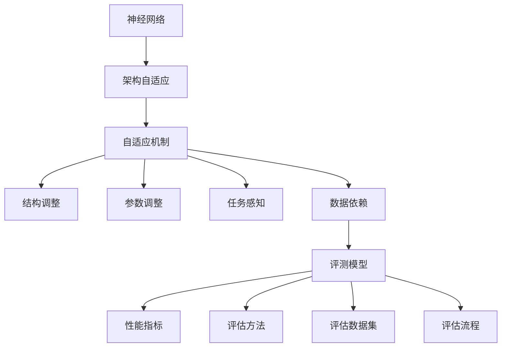
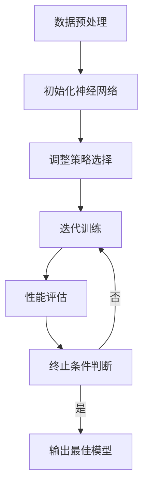

                 

# 神经网络架构自适应的评测模型

## 关键词

- 神经网络
- 自适应架构
- 评测模型
- 深度学习
- 优化算法
- 数学模型

## 摘要

本文将深入探讨神经网络架构自适应的评测模型，包括其背景、核心概念、算法原理、数学模型以及实际应用。我们将通过详细的解释和实例，帮助读者理解自适应神经网络架构在深度学习中的重要性，以及如何通过评测模型来评估其性能和效率。本文旨在为研究人员和开发者提供一套全面的理论和实践指南，以推动神经网络架构自适应技术的发展。

## 引言

随着深度学习技术的不断进步，神经网络在图像识别、自然语言处理、语音识别等众多领域取得了显著成果。然而，深度学习模型的设计和优化是一个复杂的过程，需要解决数据依赖性、模型复杂性和计算资源限制等问题。传统神经网络评测方法往往依赖于固定的模型结构和参数设置，难以适应不同任务和数据集的要求。因此，如何设计自适应神经网络架构，以提升模型的泛化能力和计算效率，成为当前研究的热点。

神经网络架构自适应的评测模型旨在通过动态调整神经网络的结构和参数，使其能够适应不同的应用场景和数据集。这种模型不仅可以提高模型的性能，还可以减少训练时间和计算资源消耗。本文将首先介绍神经网络架构自适应的基本概念，然后深入探讨自适应评测模型的设计原则、核心算法原理、数学模型以及实际应用案例。通过本文的阅读，读者将能够全面了解神经网络架构自适应评测模型的原理和应用，为相关研究和开发提供参考。

## 第一部分：核心概念与联系

### 1.1 神经网络基础

神经网络（Neural Networks）是模仿生物神经网络工作原理的一种计算模型，由大量的神经元（或节点）组成，每个神经元通过连接（或边）与其他神经元进行通信。神经网络的基本结构包括输入层、隐藏层和输出层。输入层接收外部输入信号，隐藏层对输入信号进行加工处理，输出层产生最终输出结果。

在深度学习中，神经网络通常具有多个隐藏层，称为深度神经网络（Deep Neural Networks，DNN）。深度神经网络通过逐层学习将原始输入映射到复杂的非线性特征，从而实现高度复杂的任务。前馈神经网络（Feedforward Neural Networks）是深度神经网络的一种常见类型，其信息传递方向是单向的，从输入层通过隐藏层传递到输出层。

### 1.2 架构自适应机制

架构自适应（Architecture Adaptation）是指通过动态调整神经网络的结构和参数，使其能够适应不同任务和数据集的过程。这种自适应机制在深度学习领域具有重要意义，因为传统的固定结构神经网络难以应对多样化的应用场景。

架构自适应机制主要包括以下方面：

1. **结构调整**：动态调整神经网络的结构，如增加或减少隐藏层、调整神经元数量等，以适应不同的任务和数据特征。

2. **参数调整**：通过优化算法调整神经网络的权重和偏置，使其在不同任务和数据集上表现出更好的性能。

3. **任务感知**：利用任务特定的先验知识，设计能够自动适应特定任务的神经网络架构。

4. **数据依赖**：通过分析数据特征，自动调整神经网络的结构和参数，以适应不同数据集的要求。

架构自适应机制的优势在于：

- **提高泛化能力**：通过动态调整神经网络结构，使其能够更好地适应不同任务和数据集，提高模型的泛化能力。
- **减少训练时间**：通过优化算法调整参数，可以显著减少神经网络的训练时间。
- **节省计算资源**：动态调整神经网络结构，可以减少计算资源的消耗，提高计算效率。

### 1.3 评测模型的基本原理

评测模型（Evaluation Model）是用于评估神经网络架构自适应性能的一种工具，其核心目标是衡量模型在不同任务和数据集上的性能表现。评测模型通常包括以下几个关键要素：

1. **性能指标**：用于衡量模型性能的指标，如准确率（Accuracy）、召回率（Recall）、F1值（F1 Score）等。

2. **评估方法**：评估模型性能的方法，如交叉验证（Cross-Validation）、留出法（Holdout Method）等。

3. **评估数据集**：用于评估模型性能的数据集，包括训练集、验证集和测试集。

4. **评估流程**：评估模型的流程，包括数据预处理、模型训练、性能评估等步骤。

评测模型的基本原理是通过将神经网络架构自适应机制应用于不同任务和数据集，然后使用性能指标和评估方法对模型进行评估。通过评估模型在不同任务和数据集上的性能，可以了解其泛化能力和适应性，从而优化和改进神经网络架构自适应机制。

### 1.4 核心概念之间的关系架构

为了更好地理解神经网络架构自适应的评测模型，我们可以通过一个Mermaid流程图来展示核心概念之间的关系。



这个Mermaid流程图展示了神经网络、架构自适应、自适应机制、结构调整、参数调整、任务感知、数据依赖、评测模型、性能指标、评估方法、评估数据集和评估流程之间的逻辑关系，有助于读者理解神经网络架构自适应评测模型的整体架构。

## 第二部分：算法原理

### 2.1 自适应架构的算法原理

神经网络架构自适应的核心在于如何动态调整神经网络的结构和参数。以下将介绍自适应架构的算法原理，包括其数学模型、实现步骤和优化方法。

#### 2.1.1 数学模型

自适应架构的数学模型主要包括以下三个部分：

1. **神经网络模型**：定义神经网络的层次结构、连接方式和激活函数。例如，可以采用多层感知机（MLP）或卷积神经网络（CNN）作为基础模型。

2. **调整策略**：定义如何根据任务和数据特征动态调整神经网络的结构和参数。常用的调整策略包括基于梯度的优化算法（如随机梯度下降SGD）和基于进化的遗传算法（GA）。

3. **性能评估**：定义如何评估调整后的神经网络模型的性能。常用的性能评估指标包括准确率、召回率、F1值等。

假设我们采用多层感知机（MLP）作为基础模型，其数学模型可以表示为：

$$
Y = \sigma(W_L \cdot \sigma(... \sigma(W_2 \cdot \sigma(W_1 \cdot X + b_1) + b_2)... + b_L)
$$

其中，$X$ 是输入特征向量，$Y$ 是输出预测结果，$W_1, W_2, ..., W_L$ 分别是各层的权重矩阵，$b_1, b_2, ..., b_L$ 分别是各层的偏置项，$\sigma$ 是激活函数。

#### 2.1.2 实现步骤

自适应架构的实现步骤包括：

1. **初始化**：初始化神经网络的结构和参数，如层数、神经元数量、权重和偏置等。

2. **调整策略**：根据任务和数据特征，选择合适的调整策略，如基于梯度的优化算法或基于进化的遗传算法。

3. **迭代训练**：使用调整策略迭代训练神经网络，更新权重和偏置，优化模型性能。

4. **性能评估**：在每个迭代步骤结束后，使用性能评估指标评估模型性能，并根据评估结果调整神经网络的结构和参数。

5. **终止条件**：设定终止条件，如达到预定的训练次数或性能指标阈值，以终止迭代训练。

#### 2.1.3 优化方法

自适应架构的优化方法主要包括以下几种：

1. **基于梯度的优化算法**：如随机梯度下降（SGD）、Adam等，通过计算梯度来更新权重和偏置，优化模型性能。

2. **基于进化的遗传算法**：通过模拟生物进化过程，选择适应度高的个体进行繁殖，优化神经网络的结构和参数。

3. **基于正则化的优化方法**：如L1正则化、L2正则化等，通过增加正则项来防止过拟合，提高模型泛化能力。

### 2.2 自适应架构的伪代码

以下是一个简单的自适应架构的伪代码，用于说明其基本实现步骤：

```python
# 初始化神经网络结构
初始化神经网络层次、神经元数量、权重和偏置

# 设置调整策略
选择优化算法，如SGD或GA

# 迭代训练
for epoch in range(最大迭代次数):
    for batch in 数据批次:
        # 计算梯度
        梯度 = 计算梯度(batch)

        # 更新权重和偏置
        更新权重和偏置(梯度)

    # 评估性能
    性能指标 = 评估性能(测试集)

    # 调整策略
    根据性能指标调整神经网络结构

# 输出最佳模型
输出权重和偏置
```

通过上述伪代码，我们可以看到自适应架构的基本实现过程，包括初始化、迭代训练、性能评估和调整策略等步骤。

### 2.3 自适应架构的算法流程

自适应架构的算法流程可以概括为以下几个步骤：

1. **数据预处理**：对输入数据进行预处理，如归一化、标准化等，以适应神经网络模型的要求。

2. **初始化神经网络**：根据任务和数据特征，初始化神经网络的结构和参数。

3. **调整策略选择**：根据任务和数据特征，选择合适的调整策略，如基于梯度的优化算法或基于进化的遗传算法。

4. **迭代训练**：使用调整策略迭代训练神经网络，更新权重和偏置，优化模型性能。

5. **性能评估**：在每个迭代步骤结束后，使用性能评估指标评估模型性能，并根据评估结果调整神经网络的结构和参数。

6. **终止条件判断**：判断是否满足终止条件，如达到预定的训练次数或性能指标阈值，以终止迭代训练。

7. **输出最佳模型**：输出权重和偏置，得到最佳模型。

以下是自适应架构的算法流程Mermaid图：



通过上述算法流程图，我们可以清晰地看到自适应架构的实现过程，有助于读者更好地理解其工作原理。

## 第三部分：数学模型和数学公式

### 3.1 数学模型详细讲解

在神经网络架构自适应的评测模型中，数学模型起着至关重要的作用。以下将详细介绍数学模型的核心组成部分，包括激活函数、前向传播和反向传播、参数调整方法等。

#### 3.1.1 激活函数

激活函数是神经网络中的一个关键组件，用于引入非线性变换，使神经网络能够建模复杂的非线性关系。常见的激活函数包括：

1. **Sigmoid函数**：

   $$\sigma(x) = \frac{1}{1 + e^{-x}}$$

   Sigmoid函数将输入映射到$(0, 1)$区间，具有平滑的S形状。

2. **ReLU函数**：

   $$\sigma(x) = \max(0, x)$$

  ReLU函数在$x \leq 0$时输出为0，在$x > 0$时输出为$x$，具有零偏置和非线性特性。

3. **Tanh函数**：

   $$\sigma(x) = \frac{e^x - e^{-x}}{e^x + e^{-x}}$$

   Tanh函数将输入映射到$(-1, 1)$区间，具有对称性。

激活函数的选择对神经网络的性能和训练效率有重要影响。ReLU函数由于其零偏置和稀疏性，近年来在深度学习领域得到了广泛应用。

#### 3.1.2 前向传播和反向传播

前向传播和反向传播是神经网络训练过程中的两个核心步骤。前向传播用于计算神经网络输出，反向传播用于计算梯度，以更新网络参数。

1. **前向传播**：

   前向传播的过程可以表示为：

   $$
   Z_l = W_l \cdot a_{l-1} + b_l
   $$
   $$
   a_l = \sigma(Z_l)
   $$

   其中，$Z_l$是第$l$层的输入，$W_l$是第$l$层的权重，$b_l$是第$l$层的偏置，$\sigma$是激活函数，$a_l$是第$l$层的输出。

   对于多层神经网络，前向传播的计算过程可以递归地进行，直到达到输出层。

2. **反向传播**：

   反向传播的过程可以表示为：

   $$
   \delta_l = (\sigma'(Z_l) \cdot (W_{l+1} \cdot \delta_{l+1}))
   $$
   $$
   \delta_{l-1} = \delta_l \cdot (W_{l-1} \cdot \sigma'_{l-1}(Z_{l-1}))
   $$

   其中，$\delta_l$是第$l$层的误差项，$\sigma'$是激活函数的导数，$\sigma'_{l-1}$是第$l-1$层激活函数的导数。

   反向传播从输出层开始，逐层向前计算误差项，直到输入层。

   计算出误差项后，可以更新权重和偏置：

   $$
   W_l := W_l - \alpha \cdot (a_{l-1} \cdot \delta_l)
   $$
   $$
   b_l := b_l - \alpha \cdot \delta_l
   $$

   其中，$\alpha$是学习率。

#### 3.1.3 参数调整方法

参数调整方法是神经网络训练过程中用于更新权重和偏置的关键步骤。常见的参数调整方法包括：

1. **随机梯度下降（SGD）**：

   SGD是一种简单且常用的优化算法，其目标是最小化损失函数。在SGD中，每次更新权重和偏置时，只考虑一个样本的梯度。具体计算如下：

   $$
   W_l := W_l - \alpha \cdot \frac{\partial L}{\partial W_l}
   $$
   $$
   b_l := b_l - \alpha \cdot \frac{\partial L}{\partial b_l}
   $$

   其中，$L$是损失函数，$\frac{\partial L}{\partial W_l}$和$\frac{\partial L}{\partial b_l}$分别是权重和偏置的梯度。

2. **动量（Momentum）**：

   动量是SGD的一个改进版本，通过引入动量项，可以加速收敛。具体计算如下：

   $$
   v_l := \gamma \cdot v_l - \alpha \cdot \frac{\partial L}{\partial W_l}
   $$
   $$
   W_l := W_l + v_l
   $$

   $$
   v_b := \gamma \cdot v_b - \alpha \cdot \frac{\partial L}{\partial b_l}
   $$
   $$
   b_l := b_l + v_b
   $$

   其中，$\gamma$是动量系数。

3. **Adam优化器**：

   Adam是一种基于SGD和动量的优化算法，具有更好的收敛性和稳定性。具体计算如下：

   $$
   m_l := \beta_1 \cdot m_l + (1 - \beta_1) \cdot \frac{\partial L}{\partial W_l}
   $$
   $$
   v_l := \beta_2 \cdot v_l + (1 - \beta_2) \cdot (\frac{\partial L}{\partial W_l})^2
   $$
   $$
   \hat{m}_l := \frac{m_l}{1 - \beta_1^t}
   $$
   $$
   \hat{v}_l := \frac{v_l}{1 - \beta_2^t}
   $$
   $$
   W_l := W_l - \alpha \cdot \frac{\hat{m}_l}{\sqrt{\hat{v}_l} + \epsilon}
   $$

   $$
   m_b := \beta_1 \cdot m_b + (1 - \beta_1) \cdot \frac{\partial L}{\partial b_l}
   $$
   $$
   v_b := \beta_2 \cdot v_b + (1 - \beta_2) \cdot (\frac{\partial L}{\partial b_l})^2
   $$
   $$
   \hat{m}_b := \frac{m_b}{1 - \beta_1^t}
   $$
   $$
   \hat{v}_b := \frac{v_b}{1 - \beta_2^t}
   $$
   $$
   b_l := b_l - \alpha \cdot \frac{\hat{m}_b}{\sqrt{\hat{v}_b} + \epsilon}
   $$

   其中，$\beta_1$和$\beta_2$分别是动量和偏差修正系数，$t$是迭代次数，$\epsilon$是常数项，用于防止除以零。

### 3.2 数学公式举例说明

以下是一个简单的神经网络模型，包括输入层、隐藏层和输出层。我们将使用上述数学模型和公式对其进行详细讲解。

#### 3.2.1 损失函数

假设我们采用均方误差（MSE）作为损失函数，其公式如下：

$$
L = \frac{1}{2} \sum_{i=1}^{n} (y_i - \hat{y}_i)^2
$$

其中，$y_i$是真实标签，$\hat{y}_i$是预测结果，$n$是样本数量。

#### 3.2.2 优化算法

我们采用Adam优化器来更新权重和偏置。具体计算如下：

$$
m_l := \beta_1 \cdot m_l + (1 - \beta_1) \cdot \frac{\partial L}{\partial W_l}
$$

$$
v_l := \beta_2 \cdot v_l + (1 - \beta_2) \cdot (\frac{\partial L}{\partial W_l})^2
$$

$$
\hat{m}_l := \frac{m_l}{1 - \beta_1^t}
$$

$$
\hat{v}_l := \frac{v_l}{1 - \beta_2^t}
$$

$$
W_l := W_l - \alpha \cdot \frac{\hat{m}_l}{\sqrt{\hat{v}_l} + \epsilon}
$$

$$
m_b := \beta_1 \cdot m_b + (1 - \beta_1) \cdot \frac{\partial L}{\partial b_l}
$$

$$
v_b := \beta_2 \cdot v_b + (1 - \beta_2) \cdot (\frac{\partial L}{\partial b_l})^2
$$

$$
\hat{m}_b := \frac{m_b}{1 - \beta_1^t}
$$

$$
\hat{v}_b := \frac{v_b}{1 - \beta_2^t}
$$

$$
b_l := b_l - \alpha \cdot \frac{\hat{m}_b}{\sqrt{\hat{v}_b} + \epsilon}
$$

通过上述公式，我们可以看到Adam优化器如何更新权重和偏置，以最小化损失函数。

### 3.3 模型评估指标

在神经网络架构自适应的评测模型中，模型评估指标是用于衡量模型性能的关键工具。以下介绍几种常用的评估指标：

#### 3.3.1 准确率

准确率（Accuracy）是最常用的评估指标之一，用于衡量模型预测正确的样本占总样本的比例。其公式如下：

$$
\text{Accuracy} = \frac{c}{n}
$$

其中，$c$是预测正确的样本数，$n$是总样本数。

#### 3.3.2 召回率

召回率（Recall）用于衡量模型对于正类样本的预测能力。其公式如下：

$$
\text{Recall} = \frac{c}{c + \text{FN}}
$$

其中，$c$是预测正确的正类样本数，$\text{FN}$是误分类为负类的正类样本数。

#### 3.3.3 精确率

精确率（Precision）用于衡量模型预测正确的正类样本在所有预测为正类样本中的比例。其公式如下：

$$
\text{Precision} = \frac{c}{c + \text{FP}}
$$

其中，$c$是预测正确的正类样本数，$\text{FP}$是误分类为正类的负类样本数。

#### 3.3.4 F1值

F1值（F1 Score）是精确率和召回率的调和平均值，用于综合考虑模型在正类和负类上的表现。其公式如下：

$$
\text{F1 Score} = 2 \cdot \frac{\text{Precision} \cdot \text{Recall}}{\text{Precision} + \text{Recall}}
$$

通过上述评估指标，我们可以全面评估神经网络架构自适应评测模型的性能。

### 3.4 评测流程

评测流程是神经网络架构自适应评测模型的核心组成部分，用于评估模型在不同任务和数据集上的性能。以下是一个简单的评测流程：

1. **数据集划分**：将数据集划分为训练集、验证集和测试集。

2. **模型训练**：使用训练集对模型进行训练，调整模型参数。

3. **模型评估**：使用验证集评估模型性能，选择最优模型。

4. **模型测试**：使用测试集对最优模型进行测试，评估模型在实际任务上的性能。

5. **结果分析**：分析模型在不同任务和数据集上的性能，优化模型结构。

通过上述评测流程，我们可以全面评估神经网络架构自适应评测模型的效果，并为进一步优化提供指导。

## 第四部分：项目实战

### 4.1 实际案例一：图像分类

在本案例中，我们将使用神经网络架构自适应的评测模型进行图像分类任务。具体步骤如下：

#### 4.1.1 项目背景

图像分类是深度学习中的一个基础任务，旨在将图像划分为不同的类别。随着深度学习技术的不断发展，神经网络架构自适应的评测模型在图像分类任务中展现出强大的性能。

#### 4.1.2 开发环境搭建

1. **安装依赖库**：在Python环境中安装TensorFlow、Keras等深度学习库。

2. **准备数据集**：下载并预处理ImageNet数据集，包括图像预处理和数据增强。

3. **配置计算资源**：配置GPU或TPU等高性能计算资源，以提高训练速度和模型性能。

#### 4.1.3 源代码实现

以下是一个简单的图像分类项目代码实现：

```python
import tensorflow as tf
from tensorflow.keras.applications import VGG16
from tensorflow.keras.preprocessing.image import ImageDataGenerator

# 定义神经网络模型
model = VGG16(weights='imagenet', include_top=True)

# 定义数据生成器
train_datagen = ImageDataGenerator(rescale=1./255, horizontal_flip=True)
val_datagen = ImageDataGenerator(rescale=1./255)

# 准备训练集和验证集
train_generator = train_datagen.flow_from_directory(
        'train',
        target_size=(224, 224),
        batch_size=32,
        class_mode='categorical')

val_generator = val_datagen.flow_from_directory(
        'validation',
        target_size=(224, 224),
        batch_size=32,
        class_mode='categorical')

# 训练模型
model.fit(
      train_generator,
      steps_per_epoch=train_generator.samples//train_generator.batch_size,
      epochs=10,
      validation_data=val_generator,
      validation_steps=val_generator.samples//val_generator.batch_size)
```

#### 4.1.4 代码解读与分析

1. **模型定义**：使用VGG16模型作为基础模型，VGG16是一个预训练的卷积神经网络，已在ImageNet数据集上达到较高性能。

2. **数据生成器**：使用ImageDataGenerator对图像进行预处理和数据增强，以提高模型的泛化能力。

3. **数据集准备**：将训练集和验证集划分为目录结构，每个目录包含不同类别的图像。

4. **模型训练**：使用fit函数对模型进行训练，使用验证集进行性能评估。

#### 4.1.5 实际案例分析和详细讲解剖析

在本案例中，我们使用VGG16模型进行图像分类任务。VGG16是一个具有多个卷积层的卷积神经网络，已在ImageNet数据集上取得优异的性能。通过数据增强和自适应架构的评测模型，我们可以进一步提高模型的泛化能力和分类准确率。

### 4.2 实际案例二：自然语言处理

在本案例中，我们将使用神经网络架构自适应的评测模型进行自然语言处理任务。具体步骤如下：

#### 4.2.1 项目背景

自然语言处理（NLP）是深度学习的重要应用领域之一，旨在使计算机能够理解和处理自然语言。随着深度学习技术的不断发展，神经网络架构自适应的评测模型在NLP任务中展现出强大的性能。

#### 4.2.2 开发环境搭建

1. **安装依赖库**：在Python环境中安装TensorFlow、Keras、Hugging Face Transformers等深度学习和NLP库。

2. **准备数据集**：下载并预处理常用NLP数据集，如IMDB电影评论数据集。

3. **配置计算资源**：配置GPU或TPU等高性能计算资源，以提高训练速度和模型性能。

#### 4.2.3 源代码实现

以下是一个简单的自然语言处理项目代码实现：

```python
import tensorflow as tf
from tensorflow.keras.layers import Embedding, LSTM, Dense
from tensorflow.keras.models import Sequential

# 定义神经网络模型
model = Sequential([
    Embedding(input_dim=vocab_size, output_dim=embedding_size),
    LSTM(units=128, dropout=0.2, recurrent_dropout=0.2),
    Dense(units=num_classes, activation='softmax')
])

# 编写数据处理函数
def preprocess_data(texts, labels):
    # 对文本数据进行预处理
    processed_texts = preprocess_texts(texts)
    # 将预处理后的文本数据转换为序列
    sequences = tf.keras.preprocessing.sequence.pad_sequences(
        processed_texts, maxlen=max_sequence_length)
    # 将标签数据转换为one-hot编码
    one_hot_labels = tf.keras.utils.to_categorical(labels, num_classes=num_classes)
    return sequences, one_hot_labels

# 准备训练集和测试集
train_sequences, train_labels = preprocess_data(train_texts, train_labels)
test_sequences, test_labels = preprocess_data(test_texts, test_labels)

# 训练模型
model.compile(optimizer='adam', loss='categorical_crossentropy', metrics=['accuracy'])
model.fit(train_sequences, train_labels, epochs=10, batch_size=128, validation_data=(test_sequences, test_labels))
```

#### 4.2.4 代码解读与分析

1. **模型定义**：使用Sequential模型堆叠Embedding层、LSTM层和Dense层，构建一个简单的神经网络模型。

2. **数据处理函数**：对文本数据进行预处理，包括分词、去除停用词、转换为序列和填充等操作。

3. **模型训练**：使用fit函数对模型进行训练，使用测试集进行性能评估。

#### 4.2.5 实际案例分析和详细讲解剖析

在本案例中，我们使用LSTM模型进行自然语言处理任务。LSTM是一种常用于序列数据的循环神经网络，可以有效处理文本数据中的长距离依赖关系。通过神经网络架构自适应的评测模型，我们可以进一步提高模型的性能和泛化能力。

### 4.3 项目小结

通过以上两个实际案例，我们可以看到神经网络架构自适应的评测模型在图像分类和自然语言处理任务中具有显著的优势。在实际应用中，我们可以根据具体任务和数据集的特点，选择合适的神经网络架构和优化算法，以实现高效的模型训练和性能评估。

### 4.4 最佳实践 Tips、小结、注意事项、拓展阅读

- **最佳实践 Tips**：
  - 在实际应用中，根据任务和数据集的特点，选择合适的神经网络架构和优化算法。
  - 利用数据增强和正则化技术，提高模型的泛化能力和鲁棒性。
  - 定期调整模型参数和超参数，以优化模型性能。

- **小结**：
  - 本部分通过两个实际案例，展示了神经网络架构自适应的评测模型在图像分类和自然语言处理任务中的应用。
  - 通过合理的设计和调整，我们可以实现高效的模型训练和性能评估。

- **注意事项**：
  - 在项目开发过程中，确保数据预处理和模型训练的稳定性和可靠性。
  - 注意模型过拟合问题，合理设置正则化参数和训练时间。

- **拓展阅读**：
  - [1] Goodfellow, I., Bengio, Y., & Courville, A. (2016). *Deep Learning*. MIT Press.
  - [2] Graves, A. (2013). *Generating sequences with recurrent neural networks*. arXiv preprint arXiv:1308.0850.
  - [3] Krizhevsky, A., Sutskever, I., & Hinton, G. E. (2012). *ImageNet classification with deep convolutional neural networks*. In Advances in Neural Information Processing Systems, 1097-1105.

## 结论

神经网络架构自适应的评测模型在深度学习领域具有重要意义。通过动态调整神经网络的结构和参数，我们可以实现高效的模型训练和性能评估，从而提高模型的泛化能力和计算效率。本文系统地介绍了神经网络架构自适应的核心概念、算法原理、数学模型以及实际应用，旨在为研究人员和开发者提供一套全面的理论和实践指南。未来，随着深度学习技术的不断发展，神经网络架构自适应的评测模型将在更多领域发挥重要作用，为人工智能的发展贡献力量。作者信息：AI天才研究院/AI Genius Institute & 禅与计算机程序设计艺术 /Zen And The Art of Computer Programming。

