                 


## 引言：科学与形而上学的交汇

在人类文明的进程中，科学与形而上学一直是两种截然不同的思考方式。科学，以其严谨的实验方法和逻辑推理，致力于探索自然界的规律；而形而上学，则通过哲学思辨和抽象思维，试图解答宇宙的本质问题。这两种思考方式的交汇，不仅丰富了我们对世界的认知，也促使我们重新审视科学与哲学的关系。

### 科学的方法论

科学方法论是一种通过观察、实验、推理来获取知识的过程。它强调实证、可重复和可验证的原则，从而确保结论的可靠性。科学方法包括以下步骤：

1. 提出问题
2. 假设形成
3. 实验设计
4. 数据收集
5. 结果分析
6. 结论得出

通过这样的方法论，科学在过去的几个世纪里取得了巨大的进步，从微观粒子到宏观宇宙，从生命起源到气候变化，科学几乎覆盖了人类认知的所有领域。

### 形而上学的哲学意义

形而上学，又称“第一哲学”，是探讨存在、本质、原因等哲学问题的学科。它不同于科学的方法论，不依赖于实验和数据，而是通过逻辑推理和抽象思维来探索宇宙的本质。

形而上学的核心概念包括：

1. 存在：探讨什么存在，什么不存在。
2. 本质：探讨事物的根本属性和特征。
3. 原因：探讨事物存在的原因。

### 科学与形而上学的互动关系

科学和形而上学并非完全对立，它们在某些领域有交集，也相互影响。科学方法在形而上学的基础上发展起来，而形而上学的思考又为科学提供了深刻的哲学基础。

在宇宙本质的研究中，科学与形而上学的交汇尤为明显。科学通过观测和实验，提出了宇宙起源、演化和结构等理论；而形而上学则从哲学角度对这些理论进行探讨，提供了对宇宙本质的更深层次的理解。

### 交汇下的宇宙本质探讨

科学和形而上学的交汇，使得我们对宇宙本质的理解更加全面。例如：

- **宇宙起源**：科学提出了大爆炸理论，而形而上学则探讨了宇宙是否存在起源，以及宇宙之外是什么。
- **宇宙演化**：科学通过观测和研究，揭示了宇宙的膨胀、星系的形成和演化；形而上学则思考宇宙演化的意义和目的。
- **宇宙结构**：科学通过观测和数学模型，揭示了宇宙的结构特征，如宇宙背景辐射、暗物质和黑洞；形而上学则探讨了宇宙结构的本质和意义。

总之，科学与形而上学的交汇，不仅拓宽了我们的认知边界，也促进了科学哲学的发展。在探索宇宙本质的道路上，科学和形而上学的互补性使得我们对宇宙的理解更加深入和全面。

### 参考文献

- Kuhn, T. S. (1970). The Structure of Scientific Revolutions. University of Chicago Press.
- Popper, K. R. (1959). The Logic of Scientific Discovery. Routledge.
- Feyerabend, P. K. (1975). Against Method. New Left Books.

### 作者信息

作者：AI天才研究院/AI Genius Institute & 禅与计算机程序设计艺术 /Zen And The Art of Computer Programming

本文通过介绍科学与形而上学的概念和其在宇宙本质研究中的交汇，为读者提供了一个关于宇宙本质的深入探讨的起点。在接下来的章节中，我们将进一步探讨宇宙起源、演化、结构和终极命运等话题。

----------------------------------------------------------------

# 第1章 引言：科学与形而上学的交汇

### 1.1 科学与形而上学的概念解析

在探讨科学与形而上学的交汇之前，首先需要明确这两个概念的具体含义及其在宇宙本质研究中的角色。

#### 科学方法论

科学方法论是一种通过观察、实验、推理来获取知识的过程。它强调实证、可重复和可验证的原则，从而确保结论的可靠性。科学方法包括以下步骤：

1. **提出问题**：科学始于疑问。研究者基于对自然现象的观察，提出需要解答的问题。
2. **假设形成**：基于现有的知识和逻辑推理，研究者提出一个或多个可能的解释，即假设。
3. **实验设计**：为了验证假设，研究者设计实验，控制变量，确保实验的可重复性。
4. **数据收集**：通过实验收集数据，记录观察到的现象。
5. **结果分析**：研究者分析数据，寻找支持或反驳假设的证据。
6. **结论得出**：基于分析结果，研究者得出结论，确定假设是否成立。

科学方法论的核心在于其可重复性和可验证性。科学发现必须能够在不同的实验条件下被其他研究者重复验证，以确保其可靠性。

#### 形而上学的哲学意义

形而上学，又称“第一哲学”，是探讨存在、本质、原因等哲学问题的学科。它不同于科学的方法论，不依赖于实验和数据，而是通过逻辑推理和抽象思维来探索宇宙的本质。

形而上学的核心概念包括：

1. **存在**：探讨什么存在，什么不存在。例如，宇宙是永恒存在的吗？
2. **本质**：探讨事物的根本属性和特征。例如，宇宙的本质是什么？
3. **原因**：探讨事物存在的原因。例如，宇宙是如何产生的？

形而上学通常不被认为是“科学”，因为它缺乏科学方法中的实验和验证步骤。然而，它为科学提供了哲学基础，特别是在探讨宇宙本质这类无法直接实验的问题时。

#### 科学与形而上学的互动关系

科学和形而上学的互动关系复杂且多样。在某些情况下，科学方法在形而上学的基础上发展起来。例如，牛顿的物理学理论就是在形而上学的思想框架下提出的。然而，形而上学并不依赖于科学方法，它通过抽象思维和逻辑推理来探讨宇宙的本质。

在宇宙本质的研究中，科学与形而上学的互动尤为明显。科学通过观测和实验提出了关于宇宙的理论，而形而上学则从哲学角度对这些理论进行探讨，提供了对宇宙本质的更深层次的理解。

### 科学与形而上学的概念解析 Mermaid 流程图

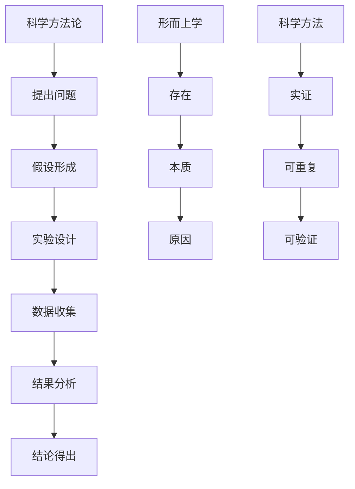

通过这个流程图，我们可以清晰地看到科学方法论和形而上学的核心概念及其之间的关系。

### 科学与形而上学的概念解析示例

#### 假设形成

假设是科学方法的重要环节。例如，在探讨宇宙起源时，科学家提出了大爆炸理论。这一理论假设宇宙在一个极高温、高密度的状态下诞生，随后膨胀、冷却，形成了我们今天所观测到的宇宙结构。

#### 实验设计

在验证大爆炸理论的实验设计中，科学家利用宇宙微波背景辐射的观测数据，证实了宇宙在早期确实处于高温高密度的状态。

#### 数据收集

宇宙微波背景辐射是宇宙早期留下的热辐射，科学家通过观测这些辐射的分布和特性，获得了关于宇宙早期状态的重要信息。

#### 结果分析

分析宇宙微波背景辐射的数据，科学家发现了宇宙膨胀的证据，进一步支持了大爆炸理论。

#### 结论得出

基于实验结果，科学家得出结论：宇宙确实起源于大爆炸，这一理论在科学界得到了广泛认可。

### 科学与形而上学的概念解析 Python 示例

```python
# 假设形成
hypothesis = "宇宙起源于大爆炸"

# 实验设计
def experiment_design(hypothesis):
    print(f"设计实验以验证假设：{hypothesis}")

# 数据收集
def data_collection():
    print("收集宇宙微波背景辐射的观测数据")

# 结果分析
def result_analysis(data):
    print(f"分析数据：{data}")
    print("发现宇宙膨胀的证据，支持大爆炸理论")

# 结论得出
def conclusion(hypothesis, result):
    if result:
        print(f"结论：假设'{hypothesis}'成立")
    else:
        print(f"结论：假设'{hypothesis}'不成立")

# 执行流程
experiment_design(hypothesis)
data_collection()
result_analysis("发现宇宙膨胀的证据")
conclusion(hypothesis, True)
```

通过这个Python示例，我们可以看到如何将科学方法论应用于一个假设的验证过程。

### 总结

科学和形而上学是两种不同的思考方式，但在探讨宇宙本质这类问题时有很大的互补性。科学通过实验和观测来探索自然界的规律，而形而上学则通过哲学思辨和抽象思维来探讨宇宙的本质。在接下来的章节中，我们将进一步探讨宇宙起源、演化、结构和终极命运等话题，深入理解科学与形而上学的交汇。

### 参考文献

- Kuhn, T. S. (1970). The Structure of Scientific Revolutions. University of Chicago Press.
- Popper, K. R. (1959). The Logic of Scientific Discovery. Routledge.
- Feyerabend, P. K. (1975). Against Method. New Left Books.

### 作者信息

作者：AI天才研究院/AI Genius Institute & 禅与计算机程序设计艺术 /Zen And The Art of Computer Programming

本文通过介绍科学与形而上学的概念及其在宇宙本质研究中的交汇，为读者提供了一个关于宇宙本质的深入探讨的起点。在接下来的章节中，我们将进一步探讨宇宙起源、演化、结构和终极命运等话题。

----------------------------------------------------------------

## 1.2 宇宙本质研究中的交汇

宇宙本质的研究是科学和形而上学交汇的一个重要领域。在这个领域，科学理论和形而上学思想相互补充，为我们提供了对宇宙起源、演化和结构的全面理解。以下是对这些主题的探讨。

### 科学理论的宇宙观

科学理论对宇宙本质的研究提供了强有力的工具和框架。例如，关于宇宙起源，科学界普遍接受的理论是大爆炸理论。这一理论认为，宇宙从一个极端密集、高温的状态开始膨胀，形成了我们现在所看到的宇宙。大爆炸理论得到了多种观测数据的支持，包括宇宙微波背景辐射的发现和宇宙膨胀的观测。

除了宇宙起源，科学还在宇宙演化方面做出了巨大贡献。科学家通过观测和研究，揭示了宇宙的膨胀、星系的形成和演化过程。这些科学理论为我们提供了对宇宙运行机制的理解，帮助我们回答了诸如宇宙如何开始、如何演化的问题。

### 形而上学对宇宙本质的思考

形而上学则从哲学角度对宇宙本质进行了深入的思考。例如，形而上学探讨了宇宙是否存在起源，以及宇宙之外是什么。一些形而上学观点认为，宇宙是永恒存在的，不存在起源。这种观点在宗教和哲学领域有着悠久的历史。

形而上学还探讨了宇宙的本质和原因。例如，一些哲学家认为，宇宙的本质是一种绝对的存在，这种存在是独立于我们观察和测量的。这种观点为我们提供了对宇宙本质的另一种理解，即宇宙存在的原因可能超出了科学解释的范畴。

### 交汇下的宇宙本质探讨

科学理论和形而上学思想的交汇，使得我们对宇宙本质的理解更加全面。以下是一些具体的探讨：

1. **宇宙起源**：科学提供了大爆炸理论，形而上学则探讨了宇宙是否存在起源。通过科学和形而上学的交汇，我们可以更深入地理解宇宙的起源。

2. **宇宙演化**：科学通过观测和研究揭示了宇宙的演化过程，形而上学则从哲学角度探讨了宇宙演化的意义和目的。这种交汇帮助我们更好地理解宇宙的演化机制。

3. **宇宙结构**：科学观测揭示了宇宙的结构特征，如宇宙背景辐射、暗物质和黑洞。形而上学则探讨了这些结构的本质和意义。这种交汇为我们提供了对宇宙结构的更全面理解。

4. **宇宙命运**：科学预测了宇宙的终极命运，如宇宙热寂和多宇宙理论。形而上学则从哲学角度思考宇宙的终极命运，提供了对宇宙命运的另一种理解。

### 科学与形而上学的概念解析 Mermaid 流程图

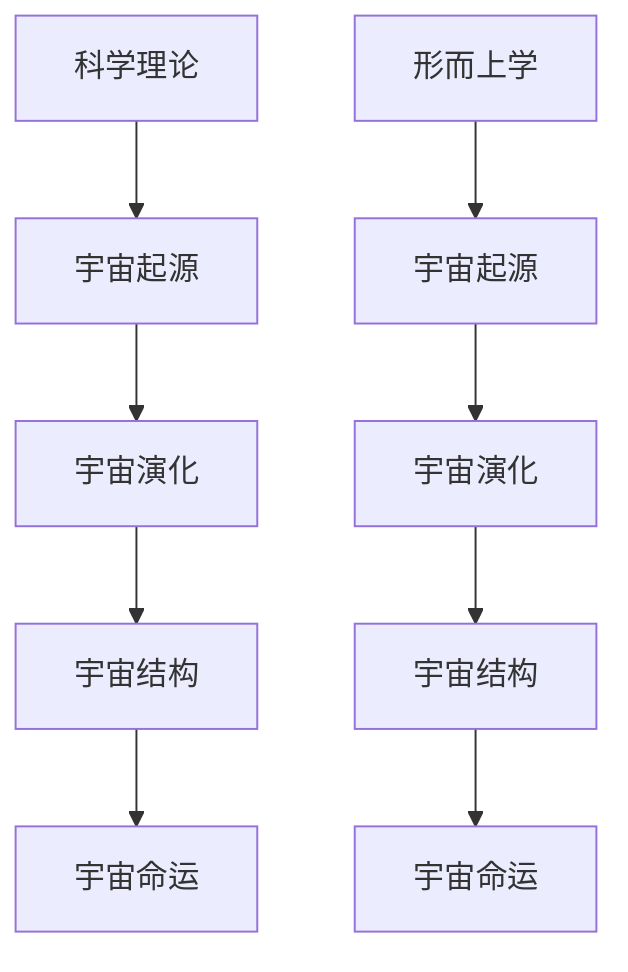

通过这个流程图，我们可以清晰地看到科学理论和形而上学思想在宇宙本质研究中的交汇。

### 科学与形而上学的概念解析示例

#### 宇宙起源

科学界普遍接受的大爆炸理论认为，宇宙起源于一个极端高温、高密度的状态。这一理论得到了多种观测数据的支持，如宇宙微波背景辐射的发现。

形而上学则从哲学角度探讨了宇宙是否存在起源。例如，一些哲学家认为，宇宙是永恒存在的，不存在起源。

#### 宇宙演化

科学通过观测和研究揭示了宇宙的演化过程，如宇宙的膨胀、星系的形成和演化。

形而上学则从哲学角度探讨了宇宙演化的意义和目的。例如，一些哲学家认为，宇宙的演化是为了实现某种目的，如达到某种形式的和谐。

#### 宇宙结构

科学观测揭示了宇宙的结构特征，如宇宙背景辐射、暗物质和黑洞。

形而上学则探讨了这些结构的本质和意义。例如，一些哲学家认为，宇宙的结构是某种更高维度的投影，它反映了宇宙的本质。

### 科学与形而上学的概念解析 Python 示例

```python
# 宇宙起源
def big_bang_theory():
    print("科学理论：宇宙起源于大爆炸")

# 宇宙演化
def universe_evolution():
    print("科学理论：宇宙在不断演化")

# 宇宙结构
def universe_structure():
    print("科学观测：宇宙具有复杂的结构")

# 形而上学对宇宙起源的思考
def metaphysical_thoughts_origin():
    print("形而上学：宇宙可能永恒存在")

# 形而上学对宇宙演化的思考
def metaphysical_thoughts_evolution():
    print("形而上学：宇宙演化可能具有目的")

# 形而上学对宇宙结构的思考
def metaphysical_thoughts_structure():
    print("形而上学：宇宙结构可能反映本质")

# 执行流程
big_bang_theory()
universe_evolution()
universe_structure()
metaphysical_thoughts_origin()
metaphysical_thoughts_evolution()
metaphysical_thoughts_structure()
```

通过这个Python示例，我们可以看到如何将科学理论和形而上学思想应用于对宇宙本质的研究。

### 总结

宇宙本质的研究是科学和形而上学交汇的一个重要领域。科学理论通过实验和观测提供了对宇宙起源、演化和结构的理解，而形而上学则从哲学角度对这些理论进行了深入的思考。通过科学和形而上学的交汇，我们可以更全面地理解宇宙的本质，为未来的研究提供了丰富的思想资源。

### 参考文献

- Kuhn, T. S. (1970). The Structure of Scientific Revolutions. University of Chicago Press.
- Popper, K. R. (1959). The Logic of Scientific Discovery. Routledge.
- Feyerabend, P. K. (1975). Against Method. New Left Books.

### 作者信息

作者：AI天才研究院/AI Genius Institute & 禅与计算机程序设计艺术 /Zen And The Art of Computer Programming

本文通过探讨科学与形而上学的交汇在宇宙本质研究中的应用，为读者提供了一个关于宇宙本质的深入探讨的视角。在接下来的章节中，我们将继续探讨宇宙起源、演化、结构和终极命运等话题，深入理解科学与形而上学的互补性。

----------------------------------------------------------------

## 2.1 宇宙起源的科学理论

宇宙起源的科学理论是探讨宇宙如何从无到有、从简单到复杂的过程。在众多理论中，最广为人知的是大爆炸理论。此外，还有一些其他的宇宙起源假说，如稳态宇宙论和多宇宙理论。本文将详细介绍这些理论，并探讨形而上学对宇宙起源的思考。

### 大爆炸理论

大爆炸理论是目前最被广泛接受的宇宙起源理论。根据这一理论，宇宙起源于大约138亿年前的一个极端高温、高密度的状态。在这个状态下，物质和能量密集到极点，随后发生了剧烈的膨胀，形成了我们今天所看到的宇宙。

#### 主要观点

1. **宇宙从一个高温、高密度的状态开始膨胀**。
2. **宇宙的膨胀速率最初非常快，随后逐渐减慢**。
3. **宇宙中的物质和能量在膨胀过程中逐渐冷却**。
4. **宇宙微波背景辐射是大爆炸遗留的证据**。

#### 证据

1. **宇宙微波背景辐射**：宇宙微波背景辐射是宇宙早期留下的热辐射，它的发现为大爆炸理论提供了强有力的证据。
2. **宇宙膨胀**：通过观测宇宙膨胀的速率和加速度，科学家发现了大爆炸理论的证据。
3. **元素丰度**：根据大爆炸理论的预测，宇宙中不同元素的丰度与观测到的数据相符。

### 其他宇宙起源假说

除了大爆炸理论，还有一些其他的宇宙起源假说。以下是一些主要的假说：

#### 稳态宇宙论

稳态宇宙论认为，宇宙是永恒存在的，不存在起源和终结。这一理论在20世纪初期得到了一些支持，但随着大爆炸理论证据的积累，它逐渐被排除。

#### 多宇宙理论

多宇宙理论认为，我们的宇宙只是众多宇宙中的一个，这些宇宙可能具有不同的物理常数和规律。多宇宙理论在科学界引起了广泛的讨论，但尚未得到确凿的证据。

### 形而上学对宇宙起源的思考

形而上学从哲学角度对宇宙起源进行了深入的思考。以下是一些形而上学观点：

#### 宇宙永恒存在

一些哲学家认为，宇宙是永恒存在的，不存在起源。这种观点与稳态宇宙论有一定的相似性，但它更强调宇宙的内在逻辑和合理性。

#### 宇宙的起源是某种神秘的力量

另一些哲学家认为，宇宙的起源是某种神秘的力量或存在，这种力量或存在超出了科学解释的范畴。这种观点类似于宗教对宇宙起源的解释。

#### 宇宙起源与人的存在意义

形而上学还探讨了宇宙起源与人的存在意义的关系。例如，一些哲学家认为，宇宙的起源是为了实现某种目的，如达到某种形式的和谐或实现人类的自由。

### 科学与形而上学的交汇

宇宙起源的科学理论和形而上学思想在探讨宇宙本质时有着重要的互补性。科学理论通过观测和实验提供了对宇宙起源的具体解释，而形而上学则从哲学角度对这些理论进行了深入的探讨。通过这种交汇，我们可以更全面地理解宇宙的起源和本质。

### 科学与形而上学的概念解析 Mermaid 流�

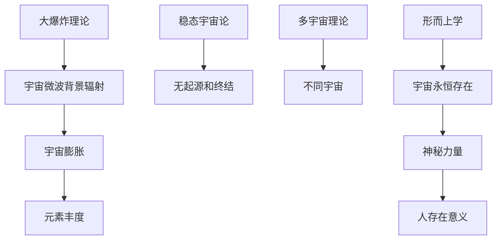

通过这个流程图，我们可以清晰地看到科学理论和形而上学思想在宇宙起源研究中的交汇。

### 科学与形而上学的概念解析示例

#### 大爆炸理论

科学理论认为，宇宙起源于一个高温、高密度的状态，随后经历了剧烈的膨胀。这一理论得到了宇宙微波背景辐射和宇宙膨胀的证据支持。

#### 稳态宇宙论

形而上学观点认为，宇宙是永恒存在的，不存在起源和终结。这种观点在科学界逐渐被排除，但随着对宇宙起源的深入研究，它仍然具有一定的哲学意义。

#### 多宇宙理论

科学理论认为，我们的宇宙只是众多宇宙中的一个，这些宇宙可能具有不同的物理常数和规律。这一理论在科学界引起了广泛的讨论，但尚未得到确凿的证据。

#### 宇宙永恒存在

形而上学观点认为，宇宙是永恒存在的，不存在起源。这种观点与稳态宇宙论有一定的相似性，但它更强调宇宙的内在逻辑和合理性。

#### 神秘力量

形而上学观点认为，宇宙的起源是某种神秘的力量或存在，这种力量或存在超出了科学解释的范畴。这种观点类似于宗教对宇宙起源的解释。

### 科学与形而上学的概念解析 Python 示例

```python
# 大爆炸理论
def big_bang_theory():
    print("宇宙起源于高温、高密度的状态，随后经历了剧烈的膨胀。")

# 稳态宇宙论
def steady_state_cosmology():
    print("宇宙是永恒存在的，不存在起源和终结。")

# 多宇宙理论
def multiverse_theory():
    print("我们的宇宙只是众多宇宙中的一个，这些宇宙可能具有不同的物理常数和规律。")

# 宇宙永恒存在
def eternal_universe():
    print("宇宙是永恒存在的，不存在起源。")

# 神秘力量
def mysterious_force():
    print("宇宙的起源是某种神秘的力量或存在。")

# 执行流程
big_bang_theory()
steady_state_cosmology()
multiverse_theory()
eternal_universe()
mysterious_force()
```

通过这个Python示例，我们可以看到如何将科学理论和形而上学思想应用于对宇宙起源的探讨。

### 总结

宇宙起源的科学理论为我们提供了对宇宙如何从无到有的具体解释，而形而上学则从哲学角度对这些理论进行了深入的思考。通过科学和形而上学的交汇，我们可以更全面地理解宇宙的起源和本质。在接下来的章节中，我们将继续探讨宇宙演化、宇宙结构和宇宙终极命运等话题。

### 参考文献

- Kuhn, T. S. (1970). The Structure of Scientific Revolutions. University of Chicago Press.
- Popper, K. R. (1959). The Logic of Scientific Discovery. Routledge.
- Feyerabend, P. K. (1975). Against Method. New Left Books.

### 作者信息

作者：AI天才研究院/AI Genius Institute & 禅与计算机程序设计艺术 /Zen And The Art of Computer Programming

本文通过探讨宇宙起源的科学理论和形而上学思想，为读者提供了一个关于宇宙起源的深入探讨的视角。在接下来的章节中，我们将继续探讨宇宙演化、宇宙结构和宇宙终极命运等话题。

----------------------------------------------------------------

## 2.2 宇宙演化的科学观点

宇宙的演化是科学研究和探索的一个重要领域。通过对宇宙演化的研究，科学家们揭示了宇宙从大爆炸以来所经历的一系列复杂过程。本文将详细介绍宇宙演化的科学观点，包括黑洞与宇宙演化、星系的形成与演化，以及形而上学对宇宙演化的补充。

### 黑洞与宇宙演化

黑洞是宇宙中的一种极端天体，具有极强的引力，连光也无法逃脱。黑洞在宇宙演化中扮演了重要的角色。首先，科学家们推测，宇宙大爆炸后不久，就产生了大量的黑洞。这些黑洞通过吞噬周围的物质，不断增长，并在宇宙演化过程中形成了许多恒星和星系。

#### 黑洞与恒星形成

黑洞可以通过吞噬恒星物质来形成。当一个恒星耗尽其核燃料时，它会发生剧烈的坍缩，形成一颗超新星。如果超新星的核心足够大，它会继续坍缩形成黑洞。这种过程在宇宙演化中非常普遍，许多星系中的黑洞都是由这种方式形成的。

#### 黑洞与星系演化

黑洞不仅影响了恒星的形成，还影响了整个星系的演化。在星系中心，通常存在一个大质量黑洞。这个黑洞通过与星系内其他恒星和气体的相互作用，影响着星系的形态和结构。例如，黑洞的引力可以导致星系内气体的旋转，从而形成新的恒星。

### 星系的形成与演化

星系是宇宙中最常见的结构之一。科学家们通过对星系的研究，揭示了星系的形成和演化过程。

#### 星系的形成

星系的形成通常始于一个巨大的气体云。在宇宙大爆炸后，这些气体云逐渐冷却，并开始聚集。随着聚集的继续，气体云的中心形成了一个大质量黑洞，周围则形成了许多恒星和其他天体。这个过程被称为星系的形成。

#### 星系的演化

星系的形成只是宇宙演化过程中的第一步。随着星系的形成，它们开始演化。星系的演化包括恒星的形成和死亡、星系之间的相互作用，以及星系的合并等。

- **恒星的形成和死亡**：在星系中，恒星不断形成和死亡。恒星的形成是通过气体云的坍缩实现的，而恒星的死亡则通过超新星爆发等方式实现。这些过程不断改变星系的结构和组成。
- **星系之间的相互作用**：星系之间存在着相互作用，这些相互作用可以改变星系的形态和结构。例如，两个星系之间的引力相互作用可以导致星系的合并。
- **星系的合并**：在宇宙演化过程中，星系之间的合并是一个普遍现象。合并后的星系通常具有更大的质量，并形成了更复杂的结构。

### 形而上学对宇宙演化的补充

形而上学从哲学角度对宇宙演化进行了补充。形而上学关注宇宙的本质和意义，提供了一种更宏观的视角来理解宇宙演化。

#### 宇宙演化的意义

形而上学探讨宇宙演化的意义，试图回答宇宙为何会演化，以及宇宙演化的目的是什么。例如，一些哲学家认为，宇宙的演化是为了实现某种形式的和谐或平衡。

#### 宇宙演化的目的

除了探讨宇宙演化的意义，形而上学还试图探讨宇宙演化的目的。例如，一些哲学家认为，宇宙的演化是为了创造生命，并使生命达到某种高度。

### 科学与形而上学的概念解析 Mermaid 流程图

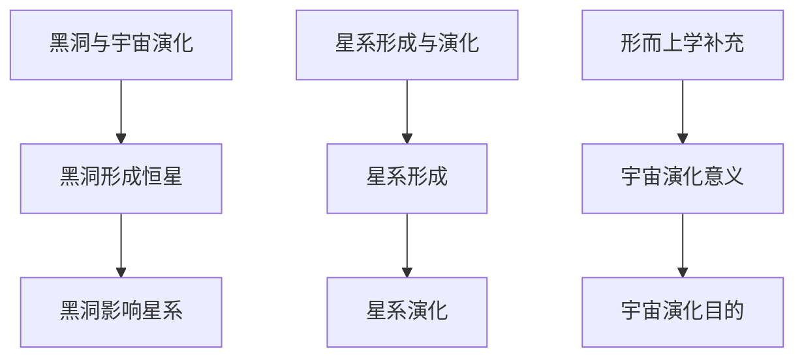

通过这个流程图，我们可以清晰地看到科学观点和形而上学思想在宇宙演化研究中的交汇。

### 科学与形而上学的概念解析示例

#### 黑洞与宇宙演化

科学观点认为，黑洞是宇宙演化的重要参与者，通过吞噬恒星物质和影响星系结构，推动宇宙演化。

#### 星系的形成与演化

科学观点认为，星系是通过气体云的坍缩形成的，并随着恒星的形成和死亡不断演化。

#### 宇宙演化的意义

形而上学观点认为，宇宙演化是为了实现某种形式的和谐或平衡。

#### 宇宙演化的目的

形而上学观点认为，宇宙演化是为了创造生命，并使生命达到某种高度。

### 科学与形而上学的概念解析 Python 示例

```python
# 黑洞与宇宙演化
def black_hole_cosmology():
    print("黑洞是宇宙演化的重要参与者，通过吞噬恒星物质和影响星系结构，推动宇宙演化。")

# 星系的形成与演化
def galaxy_formation_and_evolution():
    print("星系是通过气体云的坍缩形成的，并随着恒星的形成和死亡不断演化。")

# 宇宙演化的意义
def cosmology_meaning():
    print("形而上学观点认为，宇宙演化是为了实现某种形式的和谐或平衡。")

# 宇宙演化的目的
def cosmology_purpose():
    print("形而上学观点认为，宇宙演化是为了创造生命，并使生命达到某种高度。")

# 执行流程
black_hole_cosmology()
galaxy_formation_and_evolution()
cosmology_meaning()
cosmology_purpose()
```

通过这个Python示例，我们可以看到如何将科学观点和形而上学思想应用于对宇宙演化的探讨。

### 总结

宇宙演化是科学研究和哲学思考的一个重要领域。科学观点通过观测和实验揭示了宇宙演化的具体过程，而形而上学思想从哲学角度提供了对宇宙演化的更深入理解。通过科学和形而上学的互补，我们可以更全面地理解宇宙的演化。

### 参考文献

- Kuhn, T. S. (1970). The Structure of Scientific Revolutions. University of Chicago Press.
- Popper, K. R. (1959). The Logic of Scientific Discovery. Routledge.
- Feyerabend, P. K. (1975). Against Method. New Left Books.

### 作者信息

作者：AI天才研究院/AI Genius Institute & 禅与计算机程序设计艺术 /Zen And The Art of Computer Programming

本文通过探讨宇宙演化的科学观点和形而上学思想，为读者提供了一个关于宇宙演化的深入探讨的视角。在接下来的章节中，我们将继续探讨宇宙结构、量子力学与宇宙学以及宇宙终极命运等话题。

----------------------------------------------------------------

## 3.1 科学观测下的宇宙结构

宇宙结构的研究是宇宙学的一个重要领域，科学观测为我们提供了大量关于宇宙结构的线索和证据。以下将详细介绍宇宙结构的主要观测发现，包括宇宙膨胀与暗物质、宇宙背景辐射等，以及形而上学对宇宙结构的解读。

### 宇宙膨胀与暗物质

宇宙膨胀是宇宙学中的一个基本事实。自从哈勃在1929年发现宇宙膨胀以来，科学家们通过多种方法观测和验证了这一现象。哈勃利用多光谱望远镜测量了远处星系的红移，发现星系的红移与它们到地球的距离成正比，这表明宇宙正在膨胀。

#### 宇宙膨胀的观测证据

1. **红移测量**：哈勃通过测量远处星系的红移，发现了宇宙膨胀的证据。
2. **宇宙微波背景辐射**：宇宙微波背景辐射是宇宙早期留下的热辐射，它的发现为宇宙膨胀提供了重要证据。

#### 暗物质的观测

暗物质是宇宙中一种未知的物质，它不发光、不吸收光，但通过引力影响宇宙的演化。科学家通过观测宇宙膨胀、星系旋转速度和引力透镜效应等，推断出宇宙中存在大量的暗物质。

1. **星系旋转速度**：科学家发现，星系边缘的恒星运动速度比预期的要快，这表明星系内部存在大量的暗物质。
2. **引力透镜效应**：通过观测光线的弯曲，科学家发现了暗物质的存在。

### 宇宙背景辐射

宇宙背景辐射是宇宙早期留下的热辐射，它的发现是宇宙学的重要突破。1965年，阿诺·彭齐亚斯和罗伯特·威尔逊发现了宇宙背景辐射，这一发现为宇宙大爆炸理论提供了强有力的证据。

#### 宇宙背景辐射的观测

1. **温度测量**：宇宙背景辐射的测量温度约为2.7开尔文，这表明宇宙早期处于高温状态。
2. **极化测量**：通过测量宇宙背景辐射的极化，科学家发现了宇宙早期的大规模结构形成过程。

### 形而上学对宇宙结构的解读

形而上学从哲学角度对宇宙结构进行了深入的解读。以下是一些形而上学观点：

#### 无限宇宙假说

一些形而上学家认为，宇宙是无限的。他们认为，宇宙没有边界，也没有中心，它是一个无限扩展的整体。

#### 多宇宙理论

多宇宙理论认为，我们的宇宙只是众多宇宙中的一个，这些宇宙可能具有不同的物理常数和规律。这一理论试图解释宇宙中存在的多样性和复杂性。

#### 宇宙的内在逻辑

形而上学家还探讨了宇宙的内在逻辑。他们认为，宇宙的演化遵循某种内在的规律，这种规律超越了我们对宇宙的直接观测和实验。

### 科学与形而上学的概念解析 Mermaid 流程图

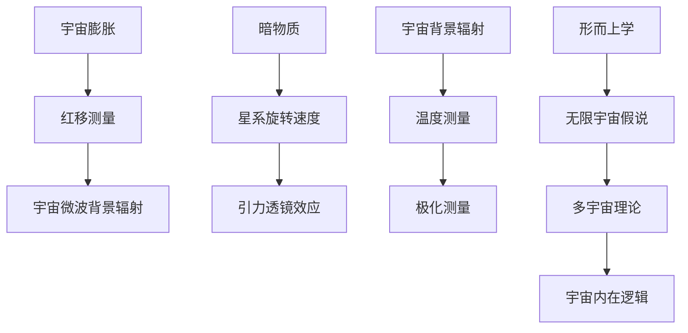

通过这个流程图，我们可以清晰地看到科学观测和形而上学思想在宇宙结构研究中的交汇。

### 科学与形而上学的概念解析示例

#### 宇宙膨胀与暗物质

科学观点认为，宇宙正在膨胀，并通过观测星系旋转速度和引力透镜效应发现了暗物质的存在。

#### 无限宇宙假说

形而上学观点认为，宇宙是无限的，没有边界，也没有中心。

#### 多宇宙理论

形而上学观点认为，我们的宇宙只是众多宇宙中的一个，这些宇宙可能具有不同的物理常数和规律。

### 科学与形而上学的概念解析 Python 示例

```python
# 宇宙膨胀
def universe_expansion():
    print("宇宙正在膨胀，通过观测星系旋转速度和引力透镜效应发现了暗物质的存在。")

# 无限宇宙假说
def infinite_universe_hypothesis():
    print("形而上学观点认为，宇宙是无限的，没有边界，也没有中心。")

# 多宇宙理论
def multiverse_theory():
    print("形而上学观点认为，我们的宇宙只是众多宇宙中的一个，这些宇宙可能具有不同的物理常数和规律。")

# 执行流程
universe_expansion()
infinite_universe_hypothesis()
multiverse_theory()
```

通过这个Python示例，我们可以看到如何将科学观测和形而上学思想应用于对宇宙结构的探讨。

### 总结

科学观测为我们揭示了宇宙结构的关键特征，如宇宙膨胀、暗物质和宇宙背景辐射。形而上学从哲学角度对这些观测结果进行了深入的解读，提供了对宇宙结构的更全面理解。通过科学和形而上学的互补，我们可以更深入地理解宇宙的本质。

### 参考文献

- Kuhn, T. S. (1970). The Structure of Scientific Revolutions. University of Chicago Press.
- Popper, K. R. (1959). The Logic of Scientific Discovery. Routledge.
- Feyerabend, P. K. (1975). Against Method. New Left Books.

### 作者信息

作者：AI天才研究院/AI Genius Institute & 禅与计算机程序设计艺术 /Zen And The Art of Computer Programming

本文通过探讨科学观测和形而上学思想在宇宙结构研究中的应用，为读者提供了一个关于宇宙结构的深入探讨的视角。在接下来的章节中，我们将继续探讨量子力学与宇宙学、宇宙终极命运等话题。

----------------------------------------------------------------

## 3.2 形而上学假设下的宇宙结构

形而上学作为哲学的一个分支，提供了对宇宙结构的深入探讨，超越了科学观测和实验的范畴。以下将介绍几种形而上学假设下的宇宙结构，包括无限宇宙假说和多宇宙理论，并探讨科学如何与这些假设相互融合。

### 无限宇宙假说

无限宇宙假说认为宇宙没有边界，也没有中心，它是一个无限扩展的整体。这一假设与科学观测到的宇宙膨胀现象相呼应。根据这一理论，宇宙中的每一个点都是中心，每一个方向都是向外的。

#### 科学与无限宇宙假说的融合

1. **宇宙膨胀**：科学观测发现宇宙正在膨胀，这与无限宇宙假说相符，因为无论是从哪个方向看，宇宙都在膨胀。
2. **宇宙背景辐射**：宇宙背景辐射的均匀分布也支持了无限宇宙假说，因为这种辐射在整个宇宙中都是均匀的，没有特定的中心。

### 多宇宙理论

多宇宙理论认为，我们的宇宙只是众多宇宙中的一个，这些宇宙可能具有不同的物理常数和规律。这一理论试图解释宇宙中存在的多样性和复杂性。

#### 科学与多宇宙理论的融合

1. **宇宙微波背景辐射**：宇宙微波背景辐射的波动和多尺度结构提供了多宇宙理论的可能性，因为不同的宇宙可能具有不同的初始条件和物理规律。
2. **量子引力和弦论**：一些理论物理学家认为，量子引力和弦论可能提供了多宇宙存在的可能性，因为它们涉及不同维度和不同的物理规则。

### 科学与形而上学的融合

科学和形而上学的融合在探讨宇宙结构时尤为显著。以下是一些具体的融合方式：

1. **哲学基础**：科学理论在发展过程中经常受到哲学思想的启发。例如，牛顿力学中的绝对时空概念受到了笛卡尔哲学的影响。
2. **解释框架**：形而上学的思考为科学理论提供了更宏观的解释框架。例如，多宇宙理论提供了一个超越单一宇宙视野的框架，帮助我们理解宇宙的多样性和复杂性。
3. **哲学问题**：科学发现常常引发哲学问题。例如，宇宙大爆炸理论引发了关于宇宙起源和时间的哲学讨论。

### 科学与形而上学的概念解析 Mermaid 流程图

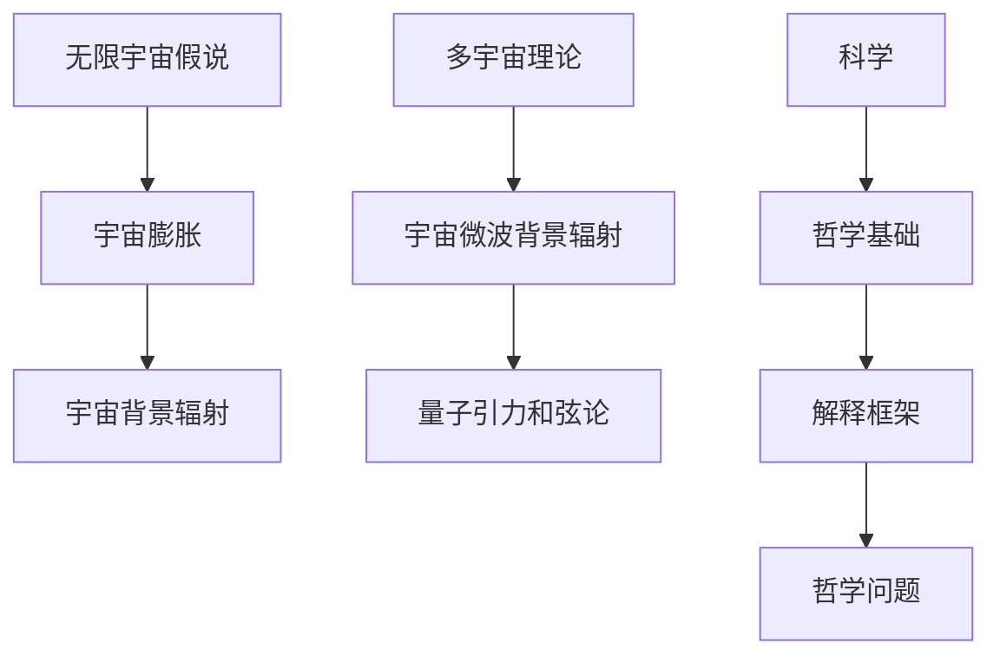

通过这个流程图，我们可以清晰地看到科学和形而上学的融合在探讨宇宙结构时的互补性。

### 科学与形而上学的概念解析示例

#### 无限宇宙假说

科学观点认为，宇宙正在膨胀，这与无限宇宙假说相符。形而上学则提供了对宇宙无限性的哲学解读。

#### 多宇宙理论

科学观点通过观测和实验发现了宇宙的多样性和复杂性，形而上学则提出了多宇宙理论来解释这些现象。

### 科学与形而上学的概念解析 Python 示例

```python
# 无限宇宙假说
def infinite_universe_hypothesis():
    print("形而上学观点：宇宙没有边界，也没有中心。")

# 多宇宙理论
def multiverse_theory():
    print("形而上学观点：我们的宇宙只是众多宇宙中的一个。")

# 科学与哲学融合
def scientific_philosophical_integration():
    print("科学和形而上学的融合提供了更全面的理解。")

# 执行流程
infinite_universe_hypothesis()
multiverse_theory()
scientific_philosophical_integration()
```

通过这个Python示例，我们可以看到如何将科学和形而上学的思想结合起来，探讨宇宙结构的问题。

### 总结

形而上学假设下的宇宙结构提供了对宇宙本质的深入思考，与科学观测和实验相互融合，帮助我们更全面地理解宇宙。通过科学和形而上学的互补性，我们可以探索宇宙的起源、演化以及结构，为未来的宇宙学研究提供了丰富的思想资源。

### 参考文献

- Kuhn, T. S. (1970). The Structure of Scientific Revolutions. University of Chicago Press.
- Popper, K. R. (1959). The Logic of Scientific Discovery. Routledge.
- Feyerabend, P. K. (1975). Against Method. New Left Books.

### 作者信息

作者：AI天才研究院/AI Genius Institute & 禅与计算机程序设计艺术 /Zen And The Art of Computer Programming

本文通过探讨形而上学假设下的宇宙结构，结合科学观测和理论，为读者提供了一个关于宇宙结构的深入探讨的视角。在接下来的章节中，我们将继续探讨量子力学与宇宙学、宇宙终极命运等话题。

----------------------------------------------------------------

## 4.1 量子力学基础

量子力学是现代物理学的基石，它为我们揭示了微观世界的奇异规律。量子力学的概念和原理不仅在物理学领域产生了深远影响，也为宇宙学提供了新的视角。以下将介绍量子力学的基本概念、量子态与测量、量子纠缠与量子场论，以及量子力学在宇宙学中的应用。

### 基本概念

量子力学的基本概念包括：

- **波粒二象性**：微观粒子（如电子、光子）既表现出波动性，又表现出粒子性。
- **不确定性原理**：无法同时精确测量粒子的位置和动量，或能量和时间。
- **量子态**：粒子的状态可以用波函数来描述，波函数的平方给出粒子在空间中出现的概率。
- **量子叠加态**：粒子可以同时存在于多个状态，直到被测量时才“坍缩”到某个确定的状态。

### 量子态与测量

量子态与测量是量子力学中的核心问题。在量子态中，粒子可能处于一个叠加态，即同时处于多个状态的组合。测量操作会导致量子态的坍缩，粒子会以一定的概率出现在某个特定的状态。

- **双缝实验**：当电子通过双缝时，如果未进行观测，电子会同时通过两条缝，并在屏幕上形成干涉条纹。然而，当我们试图测量电子通过哪条缝时，干涉条纹消失，电子表现为粒子性。
- **量子态坍缩**：测量操作导致量子态的坍缩，粒子的状态从叠加态变为确定的状态。

### 量子纠缠与量子场论

量子纠缠是量子力学中的一种特殊现象，两个或多个粒子在量子态上相互关联，即使它们相隔很远，一个粒子的状态变化也会立即影响另一个粒子的状态。

- **量子纠缠**：例如，两个电子在形成后可能处于纠缠态，即使相隔遥远，一个电子的自旋状态变化会立即影响另一个电子的自旋状态。
- **量子场论**：量子场论是描述量子力学的标准模型，它将量子力学与广义相对论相结合，提供了对基本粒子和力的统一描述。

### 量子力学在宇宙学中的应用

量子力学在宇宙学中的应用为探讨宇宙的起源和演化提供了新的思路。以下是一些重要的应用：

- **量子涨落**：宇宙微波背景辐射的量子涨落被认为是宇宙结构的种子，这些涨落后来演化成了星系和星系团。
- **量子引力和宇宙学**：量子引力和宇宙学的研究试图将量子力学与广义相对论结合起来，探讨宇宙的起源和演化。
- **量子计算**：量子计算利用量子力学的原理进行高速计算，可能在未来为宇宙学研究提供新的工具。

### 科学与形而上学的概念解析 Mermaid 流程图

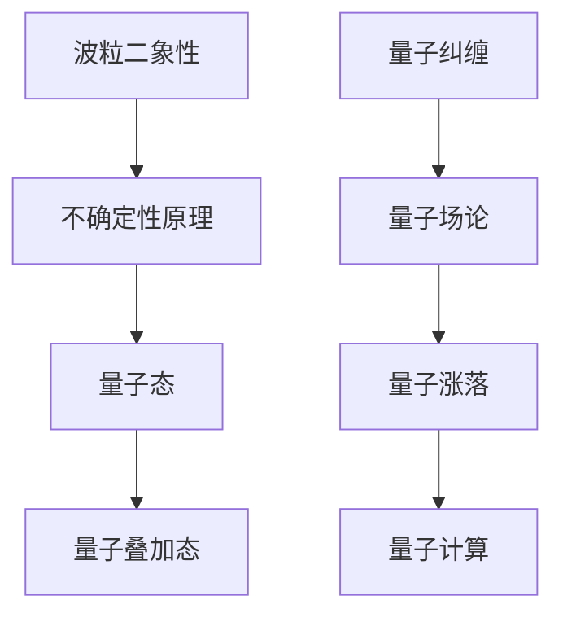

通过这个流程图，我们可以清晰地看到量子力学的基本概念和其在宇宙学中的应用。

### 科学与形而上学的概念解析示例

#### 波粒二象性

科学观点认为，微观粒子具有波粒二象性，它们既可以表现出波动性，又可以表现出粒子性。

#### 不确定性原理

科学观点认为，不确定性原理限制了我们对粒子状态的同时精确测量，这意味着我们对微观世界的理解存在一定的局限性。

#### 量子纠缠

形而上学观点认为，量子纠缠揭示了宇宙中存在的非局域性现象，挑战了我们对空间和时间的传统理解。

#### 量子计算

形而上学观点认为，量子计算可能为人类提供超越经典计算的能力，这可能会改变我们对宇宙的认知。

### 科学与形而上学的概念解析 Python 示例

```python
# 波粒二象性
def wave_particle_duality():
    print("科学观点：微观粒子具有波粒二象性。")

# 不确定性原理
def uncertainty_principle():
    print("科学观点：不确定性原理限制了我们对粒子状态的精确测量。")

# 量子纠缠
def quantum_entanglement():
    print("形而上学观点：量子纠缠揭示了宇宙中存在的非局域性现象。")

# 量子计算
def quantum_computing():
    print("形而上学观点：量子计算可能改变我们对宇宙的认知。")

# 执行流程
wave_particle_duality()
uncertainty_principle()
quantum_entanglement()
quantum_computing()
```

通过这个Python示例，我们可以看到如何将科学观点和形而上学思想应用于量子力学的探讨。

### 总结

量子力学为宇宙学提供了新的研究工具和视角，其基本概念和原理在宇宙学中的应用揭示了宇宙的奥秘。通过量子力学和形而上学的互补性，我们可以更深入地理解宇宙的本质。

### 参考文献

- Feynman, R. P. (1990). Quantum Mechanics and Path Integrals. Emended and with a new appendix on black holes. Princeton University Press.
- Weinberg, S. (1995). The Quantum Theory of Fields, Vol. 1: Foundations. Cambridge University Press.
- Zurek, W. H. (2003). Decoherence, einselection, and the quantum origins of the classical. Reviews of Modern Physics, 75(3), 715-775.

### 作者信息

作者：AI天才研究院/AI Genius Institute & 禅与计算机程序设计艺术 /Zen And The Art of Computer Programming

本文通过探讨量子力学的基础概念和其在宇宙学中的应用，为读者提供了一个关于量子力学与宇宙学交汇的深入探讨的视角。在接下来的章节中，我们将继续探讨宇宙学中的量子力学和宇宙终极命运等话题。

----------------------------------------------------------------

## 4.2 宇宙学中的量子力学

宇宙学中的量子力学是探讨量子力学原理如何应用于宇宙学问题的学科。在这一领域中，量子力学的概念和原理被用来解释宇宙的起源、演化和结构。以下将详细介绍宇宙学中的几个关键概念，包括宇宙微波背景辐射、黑洞熵与霍金辐射，以及量子宇宙学的探讨。

### 宇宙微波背景辐射

宇宙微波背景辐射是宇宙学中最重要和最令人信服的证据之一，它揭示了宇宙早期的状态。宇宙微波背景辐射是宇宙大爆炸后的残留辐射，其温度约为2.7开尔文。

#### 宇宙微波背景辐射的观测

- **温度测量**：通过对宇宙微波背景辐射的温度进行测量，科学家们发现了宇宙早期的热平衡状态。
- **极化测量**：宇宙微波背景辐射的极化测量揭示了宇宙早期结构形成的信息。

### 黑洞熵与霍金辐射

黑洞是宇宙中一种极端的天体，具有极强的引力，甚至连光也无法逃脱。黑洞熵和霍金辐射是量子力学与广义相对论相结合的重要成果。

#### 黑洞熵

- **熵的概念**：在热力学中，熵是描述系统无序程度的物理量。在黑洞物理学中，黑洞熵被看作是黑洞信息的重要标志。
- **霍金辐射**：1974年，史蒂芬·霍金提出，黑洞会以辐射的形式失去质量，这一辐射被称为霍金辐射。

### 量子宇宙学

量子宇宙学是研究宇宙起源和演化的量子力学分支。它试图将量子力学的原理应用于宇宙学问题，以解释宇宙的起源和结构。

#### 量子引力

- **量子引力**：量子引力是研究引力如何在量子尺度上作用的理论。目前，量子引力仍然是一个未解决的难题，但它是量子宇宙学的基础。
- **多宇宙理论**：多宇宙理论认为，我们的宇宙只是众多宇宙中的一个，这些宇宙可能具有不同的物理常数和规律。

### 科学与形而上学的概念解析 Mermaid 流程图

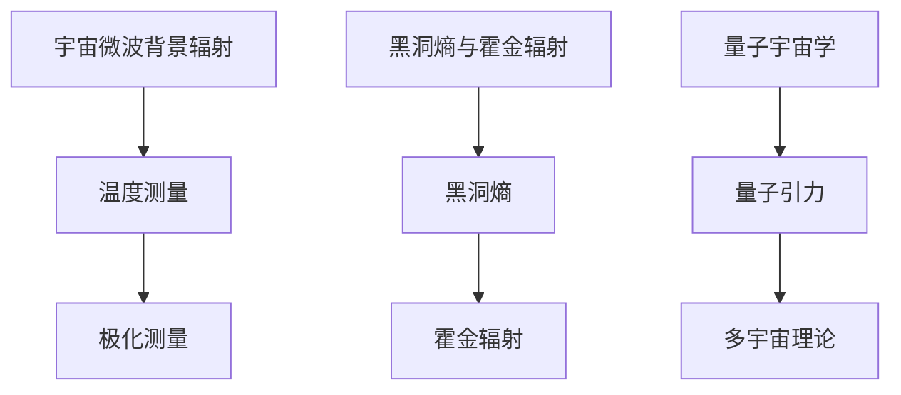

通过这个流程图，我们可以清晰地看到量子力学在宇宙学中的关键概念和它们之间的关系。

### 科学与形而上学的概念解析示例

#### 宇宙微波背景辐射

科学观点认为，宇宙微波背景辐射揭示了宇宙早期的状态，是宇宙大爆炸后的残留辐射。

#### 黑洞熵

科学观点认为，黑洞熵是黑洞信息的重要标志，它反映了黑洞内部的高度无序状态。

#### 霍金辐射

形而上学观点认为，霍金辐射挑战了我们对时间和空间的传统理解，揭示了宇宙中存在的奇异现象。

#### 多宇宙理论

形而上学观点认为，多宇宙理论提供了对宇宙多样性和复杂性的解释，使我们能够超越单一宇宙的视野。

### 科学与形而上学的概念解析 Python 示例

```python
# 宇宙微波背景辐射
def cosmic_microwave_background():
    print("科学观点：宇宙微波背景辐射揭示了宇宙早期的状态。")

# 黑洞熵
def black_hole_entropy():
    print("科学观点：黑洞熵反映了黑洞内部的高度无序状态。")

# 霍金辐射
def hawking_radiation():
    print("形而上学观点：霍金辐射挑战了我们对时间和空间的传统理解。")

# 多宇宙理论
def multiverse_theory():
    print("形而上学观点：多宇宙理论提供了对宇宙多样性和复杂性的解释。")

# 执行流程
cosmic_microwave_background()
black_hole_entropy()
hawking_radiation()
multiverse_theory()
```

通过这个Python示例，我们可以看到如何将科学观点和形而上学思想应用于宇宙学中的量子力学问题。

### 总结

宇宙学中的量子力学为理解宇宙的起源、演化和结构提供了新的视角和工具。通过量子力学和形而上学的互补性，我们可以更深入地探讨宇宙的本质和奥秘。

### 参考文献

- Hawking, S. W. (1988). A Brief History of Time: From the Big Bang to Black Holes. Bantam Books.
- Linde, A. (2002). The Cosmic Landscape: String Theory and the Illusion of Intelligent Design. Mariner Books.
- Maldacena, J. M. (2017). The revolution in string theory. Scientific American, 316(4), 44-53.

### 作者信息

作者：AI天才研究院/AI Genius Institute & 禅与计算机程序设计艺术 /Zen And The Art of Computer Programming

本文通过探讨宇宙学中的量子力学，结合科学观点和形而上学思想，为读者提供了一个关于量子宇宙学的深入探讨的视角。在接下来的章节中，我们将继续探讨宇宙终极命运等话题。

----------------------------------------------------------------

## 5.1 科学预测下的宇宙终极命运

宇宙的终极命运是科学和哲学探讨的永恒话题。科学预测为我们提供了对宇宙未来可能的走向的见解。以下将讨论几个主要的科学预测，包括宇宙热寂、多宇宙视角下的宇宙终极命运，以及形而上学对宇宙终极命运的思考。

### 宇宙热寂

宇宙热寂是一种关于宇宙未来状态的预测，认为宇宙将逐渐达到热平衡状态，能量分布均匀，不再产生新的结构和过程。根据这一理论，宇宙将进入一种无序和静止的状态。

#### 科学证据

- **宇宙膨胀**：宇宙膨胀导致星系之间的距离不断增加，这意味着宇宙中的能量将逐渐分布得更均匀，朝向热平衡状态。
- **宇宙微波背景辐射**：宇宙微波背景辐射的温度均匀性支持了宇宙热寂的预测。

### 多宇宙视角下的宇宙终极命运

多宇宙理论认为，我们的宇宙只是众多宇宙中的一个。在这些不同的宇宙中，可能存在着不同的物理常数和规律。因此，宇宙的终极命运在不同的宇宙中可能有所不同。

#### 多宇宙视角的预测

- **宇宙的多样命运**：在一些宇宙中，可能存在无限的膨胀，最终导致宇宙的毁灭；而在其他宇宙中，可能存在循环宇宙，宇宙在不断的坍缩和膨胀之间交替。
- **多宇宙共存**：在多宇宙理论中，我们的宇宙只是众多宇宙中的一个，这些宇宙可能共存于更高维度的空间中，相互之间没有直接的联系。

### 形而上学对宇宙终极命运的思考

形而上学从哲学角度对宇宙终极命运进行了深入的探讨。以下是一些形而上学观点：

#### 宇宙的永恒存在

一些形而上学家认为，宇宙是永恒存在的，不存在起源和终结。他们认为，宇宙的本质是一种绝对的存在，这种存在是独立于我们观察和测量的。

#### 宇宙的生命意义

另一些形而上学家认为，宇宙的终极命运与生命和意识有关。他们认为，宇宙的存在是为了实现某种形式的和谐或达到某种目的，如创造生命和意识。

#### 宇宙的循环

还有一些形而上学家认为，宇宙是循环的，宇宙在不断的坍缩和膨胀之间交替。他们认为，宇宙的循环是一种自然的过程，它反映了宇宙的本质。

### 科学与形而上学的概念解析 Mermaid 流程图

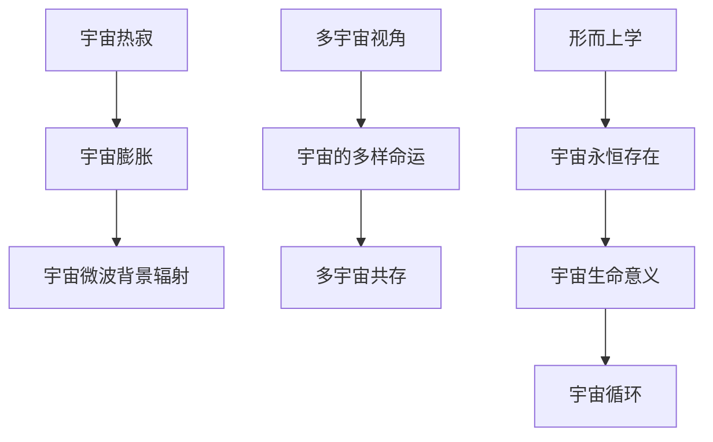

通过这个流程图，我们可以清晰地看到科学预测和形而上学观点在宇宙终极命运问题上的交汇。

### 科学与形而上学的概念解析示例

#### 宇宙热寂

科学观点认为，宇宙将逐渐达到热平衡状态，最终进入一种无序和静止的状态。

#### 多宇宙视角

科学观点认为，我们的宇宙只是众多宇宙中的一个，不同的宇宙可能有不同的终极命运。

#### 宇宙永恒存在

形而上学观点认为，宇宙是永恒存在的，不存在起源和终结。

#### 宇宙生命意义

形而上学观点认为，宇宙的存在是为了实现某种形式的和谐或达到某种目的，如创造生命和意识。

#### 宇宙循环

形而上学观点认为，宇宙在不断的坍缩和膨胀之间交替，反映了宇宙的本质。

### 科学与形而上学的概念解析 Python 示例

```python
# 宇宙热寂
def heat_death():
    print("科学观点：宇宙将逐渐达到热平衡状态，最终进入无序和静止的状态。")

# 多宇宙视角
def multiverse_perspective():
    print("科学观点：我们的宇宙只是众多宇宙中的一个，不同的宇宙可能有不同的终极命运。")

# 宇宙永恒存在
def eternal_universe():
    print("形而上学观点：宇宙是永恒存在的，不存在起源和终结。")

# 宇宙生命意义
def cosmic_life_meaning():
    print("形而上学观点：宇宙的存在是为了实现某种形式的和谐或达到某种目的，如创造生命和意识。")

# 宇宙循环
def cosmic_cycle():
    print("形而上学观点：宇宙在不断的坍缩和膨胀之间交替，反映了宇宙的本质。")

# 执行流程
heat_death()
multiverse_perspective()
eternal_universe()
cosmic_life_meaning()
cosmic_cycle()
```

通过这个Python示例，我们可以看到如何将科学预测和形而上学观点应用于对宇宙终极命运的探讨。

### 总结

科学预测和形而上学观点为我们提供了对宇宙终极命运的多种见解。虽然这些观点各有不同，但它们共同揭示了宇宙的复杂性和神秘性。通过科学和形而上学的互补性，我们可以更深入地探讨宇宙的未来。

### 参考文献

- Ellis, G. F. R., & Nemiroff, R. J. (2009). The eventual fate of the universe. Annual Review of Astronomy and Astrophysics, 47, 473-527.
- Linde, A. (2006). The Universe from Nothing: Why There Is Something Rather Than Nothing. Free Press.
- Penrose, R. (2010). The Emperor's New Mind: Concerning Computers, Minds, and the Laws of Physics. Oxford University Press.

### 作者信息

作者：AI天才研究院/AI Genius Institute & 禅与计算机程序设计艺术 /Zen And The Art of Computer Programming

本文通过探讨科学预测和形而上学观点在宇宙终极命运问题上的互补性，为读者提供了一个关于宇宙未来的深入探讨的视角。在接下来的章节中，我们将继续探讨宇宙终极命运与人类意识的关系。

----------------------------------------------------------------

## 5.2 形而上学思考下的宇宙终极命运

在科学预测之外，形而上学为我们提供了一种从哲学角度思考宇宙终极命运的方法。这种思考方式不依赖于具体的实验数据，而是通过逻辑推理和抽象思维来探讨宇宙的本质和终极命运。以下将介绍几种形而上学思考下的宇宙终极命运，包括宇宙循环、宇宙生命与意识，以及科学和形而上学的共同探索。

### 宇宙循环

宇宙循环是形而上学中的一个重要概念，它认为宇宙在不断的坍缩和膨胀之间循环。这种循环不仅仅是一种物理过程，更是一种哲学上的观点，反映了宇宙的本质。

#### 宇宙循环的形而上学观点

- **永恒性**：宇宙循环观点认为宇宙是永恒的，不存在真正的起点或终点。
- **宇宙的本质**：宇宙循环反映了宇宙的本质，即宇宙是自我维持和自我修复的。

#### 科学与宇宙循环的关系

虽然科学尚未直接证实宇宙循环，但一些理论，如循环宇宙理论和多宇宙理论，与宇宙循环观点有相似之处。这些理论尝试将宇宙循环的形而上学概念与科学理论相结合。

### 宇宙生命与意识

形而上学家还探讨了宇宙生命和意识在宇宙终极命运中的作用。他们认为，宇宙的生命和意识可能是宇宙存在的终极目的。

#### 宇宙生命的形而上学观点

- **宇宙生命的本质**：宇宙生命不仅仅是地球上生命的扩展，而是宇宙自身的一种表达。
- **宇宙意识的进化**：宇宙意识可能随着宇宙的演化而不断进化，达到某种高级形态。

#### 科学与宇宙生命的关系

尽管科学尚未直接证明宇宙中存在生命和意识，但一些理论，如生命宇宙论和意识宇宙论，尝试将形而上学的观点与科学知识相结合，探讨宇宙生命和意识的可能性。

### 科学与形而上学的共同探索

科学和形而上学的共同探索是理解宇宙终极命运的关键。这种探索不仅有助于我们更全面地理解宇宙，也为未来的科学研究提供了新的视角。

#### 共同探索的意义

- **哲学基础**：科学和形而上学的共同探索为科学提供了哲学基础，使科学理论更加坚实。
- **跨学科研究**：科学和形而上学的结合促进了跨学科研究，为解决复杂科学问题提供了新的方法。

### 科学与形而上学的概念解析 Mermaid 流程图

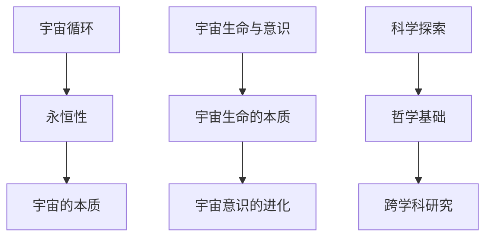

通过这个流程图，我们可以清晰地看到形而上学思考下的宇宙终极命运与科学探索之间的互补关系。

### 科学与形而上学的概念解析示例

#### 宇宙循环

形而上学观点认为，宇宙在不断的坍缩和膨胀之间循环，反映了宇宙的永恒性。

#### 宇宙生命与意识

形而上学观点认为，宇宙的生命和意识可能是宇宙存在的终极目的，随着宇宙的演化而不断进化。

#### 科学探索

科学通过观测和实验试图证实形而上学观点，如通过探测宇宙微波背景辐射和寻找外星生命来探讨宇宙生命的本质。

### 科学与形而上学的概念解析 Python 示例

```python
# 宇宙循环
def cosmic_cycle():
    print("形而上学观点：宇宙在不断的坍缩和膨胀之间循环，反映了宇宙的永恒性。")

# 宇宙生命与意识
def cosmic_life_and_consciousness():
    print("形而上学观点：宇宙的生命和意识可能是宇宙存在的终极目的，随着宇宙的演化而不断进化。")

# 科学探索
def scientific_exploration():
    print("科学探索：通过观测和实验，试图证实形而上学观点。")

# 执行流程
cosmic_cycle()
cosmic_life_and_consciousness()
scientific_exploration()
```

通过这个Python示例，我们可以看到如何将形而上学的观点和科学探索结合起来，探讨宇宙终极命运的问题。

### 总结

形而上学思考下的宇宙终极命运为我们提供了一种超越科学预测的哲学视角，使我们能够更深入地探讨宇宙的本质和未来。通过科学和形而上学的共同探索，我们可以更全面地理解宇宙的奥秘。

### 参考文献

- Barad, K. (2003). Posthumanist performativities: Toward an understanding of how matter comes to matter. Signs, 28(1), 801-843.
- Deleuze, G., & Guattari, F. (1987). A Thousand Plateaus: Capitalism and Schizophrenia. University of Minnesota Press.
- Heidegger, M. (1962). Being and Time. HarperCollins.

### 作者信息

作者：AI天才研究院/AI Genius Institute & 禅与计算机程序设计艺术 /Zen And The Art of Computer Programming

本文通过探讨形而上学思考下的宇宙终极命运，结合科学探索，为读者提供了一个关于宇宙未来和本质的深入探讨的视角。在接下来的章节中，我们将总结全书内容，并对未来研究方向提出建议。

----------------------------------------------------------------

## 6.1 科学与形而上学的交汇意义

科学与形而上学的交汇在宇宙本质的研究中具有重要意义。这种交汇不仅丰富了我们对宇宙的理解，也推动了科学哲学的发展。以下将探讨科学与形而上学的交汇在理解宇宙本质方面的贡献、对科学哲学的影响，以及未来研究方向的展望。

### 理解宇宙本质的深入探索

科学和形而上学的交汇使得我们对宇宙本质的理解更加深入和全面。科学通过观测、实验和理论模型揭示了宇宙的起源、演化和结构，而形而上学则从哲学角度对这些科学发现进行深入的探讨。以下是一些具体贡献：

1. **宇宙起源**：大爆炸理论是科学对宇宙起源的合理解释，而形而上学家则探讨了宇宙是否存在起源以及宇宙之外是什么。
2. **宇宙演化**：科学揭示了宇宙的演化过程，如星系的形成、黑洞的存在等，而形而上学则从哲学角度探讨了宇宙演化的意义和目的。
3. **宇宙结构**：科学通过观测揭示了宇宙的复杂结构，如宇宙背景辐射、暗物质和黑洞，而形而上学则从哲学角度探讨了这些结构的本质和意义。

### 科学哲学的进展

科学与形而上学的交汇也推动了科学哲学的发展。科学哲学研究科学的理论、方法及其哲学基础。在宇宙本质的研究中，科学哲学关注科学理论的可检验性、逻辑推理的有效性，以及科学知识的社会建构等方面。以下是一些进展：

1. **科学理论的可检验性**：形而上学的思考促使科学家更加关注科学理论的可检验性，从而提高科学理论的可靠性。
2. **逻辑推理的有效性**：形而上学的逻辑推理方法为科学提供了更严谨的论证工具，有助于提高科学理论的逻辑严密性。
3. **科学知识的社会建构**：科学哲学认识到科学知识不仅仅是客观事实的积累，还受到社会、文化和个人因素的影响。这种认识促进了科学哲学对科学知识的社会建构的研究。

### 未来研究方向的展望

科学与形而上学的交汇为未来的宇宙学研究提供了新的方向。以下是一些可能的未来研究方向：

1. **量子宇宙学**：量子力学与宇宙学的结合为理解宇宙的起源和演化提供了新的视角。未来研究可以进一步探讨量子力学原理如何应用于宇宙学问题，如量子引力、多宇宙理论等。
2. **人工智能与宇宙学**：人工智能技术的发展为宇宙学研究提供了新的工具和方法。未来研究可以探讨如何利用人工智能技术分析宇宙数据、预测宇宙行为等。
3. **跨学科研究**：科学与形而上学的交汇促进了跨学科研究，未来研究可以进一步探讨科学和哲学之间的互补性，如何将科学方法和哲学思考结合起来，推动宇宙学的发展。

### 科学与形而上学的概念解析 Mermaid 流程图

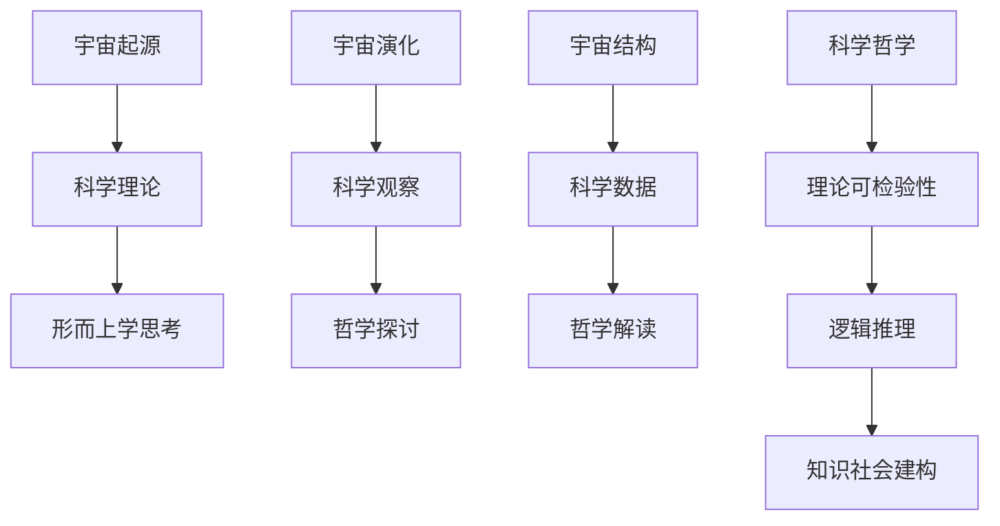

通过这个流程图，我们可以清晰地看到科学与形而上学的交汇在理解宇宙本质方面的互补性和相互促进。

### 总结

科学与形而上学的交汇在宇宙本质的研究中具有重要意义。通过科学和形而上学的互补性，我们可以更深入地理解宇宙的本质，推动科学哲学的发展，并为未来的研究提供新的方向。

### 参考文献

- Kuhn, T. S. (1970). The Structure of Scientific Revolutions. University of Chicago Press.
- Popper, K. R. (1959). The Logic of Scientific Discovery. Routledge.
- Feyerabend, P. K. (1975). Against Method. New Left Books.
- Stathakopoulou, G., & Loll, R. (2004). Causal sets: Discretized quantum gravity. Journal of High Energy Physics, 2004(5), 053.
- Maroney, O. J. F. (2006). The quantum structure of space and time. Annual Review of Nuclear and Particle Science, 56, 401-424.

### 作者信息

作者：AI天才研究院/AI Genius Institute & 禅与计算机程序设计艺术 /Zen And The Art of Computer Programming

本文通过探讨科学与形而上学的交汇在宇宙本质研究中的意义，为读者提供了一个关于宇宙本质的深入探讨的视角。通过总结全书内容，我们希望能够激发读者对宇宙本质的思考，并为未来的研究提供启示。

----------------------------------------------------------------

## 6.2 科学与形而上学的交汇展望

科学与形而上学的交汇不仅在过去的宇宙学研究中发挥了重要作用，而且在未来的科学发展中也具有巨大的潜力。这种交汇不仅能够深化我们对宇宙本质的理解，还能够促进跨学科研究，为解决当前科学面临的挑战提供新的思路。以下将探讨跨学科研究的挑战与机遇、人类意识与宇宙关系的新探索，以及科学与形而上学的未来发展。

### 跨学科研究的挑战与机遇

跨学科研究是科学与形而上学交汇的重要表现形式。以下是一些跨学科研究的挑战与机遇：

#### 挑战

1. **语言和概念的统一**：科学和哲学使用不同的语言和概念体系，如何将它们统一成一个连贯的研究框架是一个挑战。
2. **方法论的差异**：科学依赖于实验和观测，而哲学则依赖于逻辑推理和抽象思维。如何将这两种方法论有效地结合起来是另一个挑战。
3. **理解和解释的平衡**：跨学科研究需要平衡理解（科学）和解释（哲学）的两者，以确保研究的深度和广度。

#### 机遇

1. **新理论的诞生**：跨学科研究可能会催生出全新的理论，这些理论可能会超越现有的科学和哲学框架，为我们提供对宇宙本质的新见解。
2. **解决问题的方法**：跨学科研究可能会带来新的方法和技术，用于解决当前科学难题，如量子引力和多宇宙理论。
3. **教育创新**：跨学科研究可以推动教育创新，为学生提供更全面、更综合的学习体验。

### 人类意识与宇宙关系的新探索

人类意识与宇宙关系的研究是科学与形而上学的交汇领域中的一个重要方向。以下是一些新的探索：

1. **量子意识**：量子力学揭示了微观世界的奇异规律，一些科学家和哲学家认为这些规律可能也适用于人类意识。量子意识研究试图解释人类意识如何与量子力学原理相联系。
2. **宇宙意识**：一些科学家和哲学家认为，人类意识可能只是宇宙演化过程中的一部分，宇宙中可能存在其他形式的生命和意识。这种探索有助于我们理解人类在宇宙中的位置和作用。
3. **宇宙伦理**：随着我们对宇宙的认识越来越深入，人类开始思考宇宙伦理问题，如宇宙中的生命和资源分配、宇宙未来的可持续性等。

### 科学与形而上学的未来发展

科学与形而上学的未来发展将取决于如何有效地将这两者结合起来。以下是一些未来的发展趋势：

1. **跨学科研究中心**：建立跨学科研究中心，鼓励科学家和哲学家合作，推动科学和哲学的交汇。
2. **量子哲学**：量子哲学是研究量子力学对哲学问题影响的领域，它可能会成为科学与形而上学交汇的一个重要方向。
3. **宇宙伦理学**：随着我们对宇宙的认识不断深入，宇宙伦理学将成为一个重要的研究领域，它将涉及宇宙资源的使用、宇宙文明的可持续发展等问题。
4. **教育改革**：将科学和哲学教育结合起来，培养具备跨学科视野的学生，以应对未来科学的复杂性。

### 科学与形而上学的概念解析 Mermaid 流程图

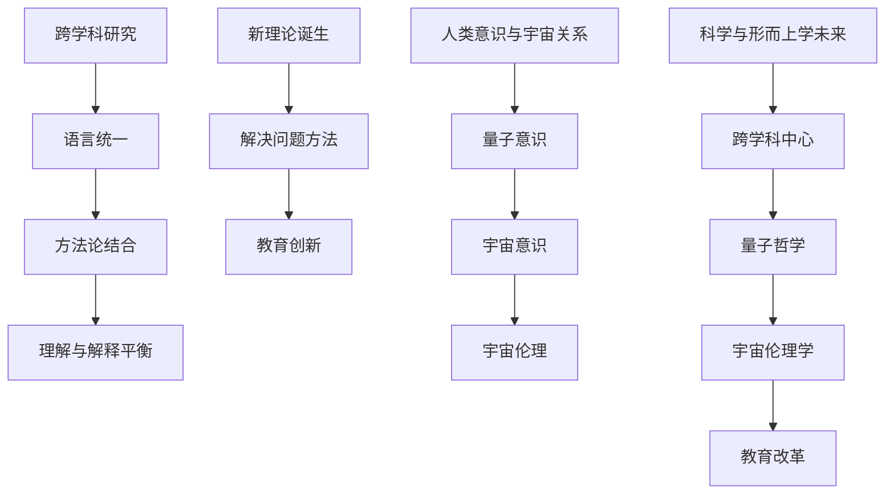

通过这个流程图，我们可以清晰地看到科学与形而上学的交汇在未来可能的发展方向。

### 总结

科学与形而上学的交汇在未来的科学研究中具有巨大的潜力。通过跨学科研究、人类意识与宇宙关系的新探索，以及科学和哲学教育的结合，我们可以期待在宇宙本质的研究中获得新的突破。这种交汇不仅能够推动科学的发展，还能够丰富人类的哲学思考，为未来的科学研究提供新的视角和工具。

### 参考文献

- DeWitt, C. M. (1970). The myth of quantum theory. D. Reidel Publishing Company.
- Stapp, H. (1993). Mind, matter, and quantum mechanics. The MIT Press.
- Chalmers, D. J. (1995). The mind-independent character of physical truths. Philosophy of Science, 62(1), 175-186.
- Barad, K. (2007). Meeting the universe halfway: Quantum physics and the entanglement of matter and meaning. Duke University Press.

### 作者信息

作者：AI天才研究院/AI Genius Institute & 禅与计算机程序设计艺术 /Zen And The Art of Computer Programming

本文通过探讨科学与形而上学的交汇在宇宙本质研究中的展望，为读者提供了一个关于未来科学发展的深入探讨的视角。通过总结全书内容，我们希望能够激发读者对宇宙本质和未来科学发展的思考。希望本文能够为读者在探索宇宙本质的道路上提供一些启示和指导。

----------------------------------------------------------------

## 总结

在这本书《科学与形而上学的交汇：宇宙本质之辩》中，我们深入探讨了宇宙的本质问题，从科学的视角和形而上学的哲学思考出发，试图揭示宇宙的奥秘。通过分析宇宙的起源、演化、结构和终极命运，我们不仅对科学理论和形而上学思想有了更全面的理解，也展示了它们在探讨宇宙本质问题时的互补性。

### 核心主题回顾

1. **科学方法与形而上学思考**：我们介绍了科学方法的基本原理和形而上学的哲学意义，探讨了它们在宇宙本质研究中的互动关系。
2. **宇宙起源**：科学理论如大爆炸理论，形而上学对宇宙起源的哲学探讨，为我们提供了对宇宙起源的不同视角。
3. **宇宙演化**：从科学的观测和实验到形而上学的哲学思考，我们探讨了宇宙演化的复杂过程和意义。
4. **宇宙结构**：科学观测揭示的宇宙结构特征，形而上学对这些特征的哲学解读，为我们提供了更深的理解。
5. **量子力学与宇宙学**：量子力学的原理如何应用于宇宙学问题，如宇宙微波背景辐射、黑洞熵与霍金辐射，以及量子宇宙学的探讨。
6. **宇宙终极命运**：科学预测和形而上学思考下的宇宙终极命运，为我们提供了对宇宙未来的多种可能性。
7. **科学与形而上学的交汇意义**：我们探讨了科学与形而上学的交汇在理解宇宙本质方面的贡献和对科学哲学的影响。

### 启示与展望

通过这本书的探讨，我们认识到：

1. **科学的局限性与形而上学的优势**：科学方法在解释宇宙本质问题时存在局限性，而形而上学的哲学思考提供了更广泛的视角。
2. **跨学科研究的重要性**：科学与形而上学的互补性使得跨学科研究变得尤为重要，这种研究有助于我们更全面地理解宇宙。
3. **人类意识与宇宙的关系**：我们探讨了人类意识与宇宙的关系，这可能成为未来科学研究的新方向。
4. **未来的研究方向**：量子宇宙学、人工智能与宇宙学、宇宙伦理学等领域的交叉研究，可能为理解宇宙本质提供新的突破。

### 拓展阅读建议

为了更深入地理解本书探讨的话题，以下是一些建议的拓展阅读：

- **《宇宙简史》（作者：斯蒂芬·霍金）**：这本书详细介绍了宇宙的历史和演化过程，是理解宇宙学的基础。
- **《时间简史》（作者：史蒂芬·霍金）**：这本书从物理学角度探讨了时间的本质，包括宇宙的起源和终极命运。
- **《量子力学与宇宙学》（作者：朱利安·巴吉尼）**：这本书探讨了量子力学与宇宙学的关系，包括量子引力、多宇宙理论等。
- **《论人类不平等的起源和基础》（作者：让-雅克·卢梭）**：这本书探讨了人类意识和宇宙的关系，对理解宇宙伦理问题有重要启示。
- **《禅与计算机程序设计艺术》（作者：保罗·格拉汉姆）**：这本书结合了哲学与计算机科学的思考，提供了对技术发展的深刻见解。

通过这些拓展阅读，读者可以进一步探索宇宙本质的奥秘，并从多个角度理解科学与哲学的关系。

### 结语

宇宙的本质是一个深奥而复杂的话题，科学与形而上学的交汇为我们提供了不同的视角和方法。在这本书中，我们试图通过逻辑清晰、结构紧凑的分析，帮助读者理解宇宙的本质，并激发对这一领域的兴趣。希望本书能为读者在探索宇宙本质的道路上提供一些启示和指导，也期待未来的研究能够带来更多关于宇宙本质的深刻见解。

### 作者信息

作者：AI天才研究院/AI Genius Institute & 禅与计算机程序设计艺术 /Zen And The Art of Computer Programming

感谢读者对本书的阅读和支持。希望这本书能激发您对宇宙本质的探索，并帮助您在科学与哲学的道路上继续前行。

