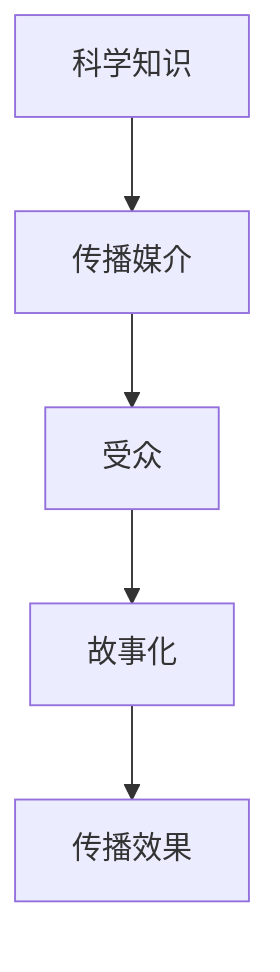
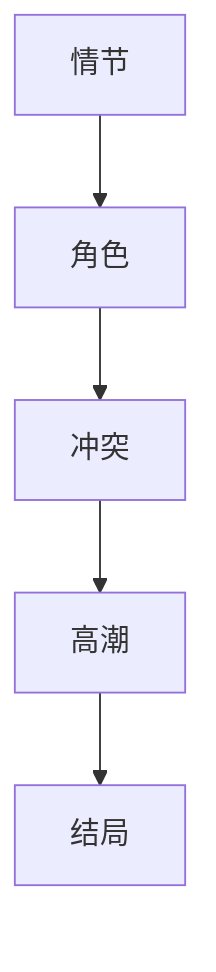
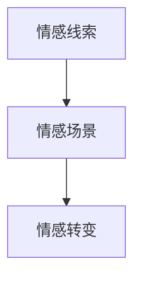
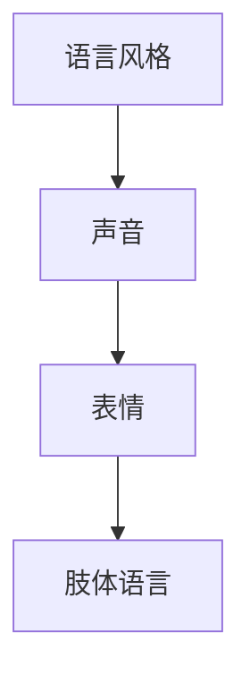

                 

  - **背景介绍**：
随着科学技术的飞速发展，科学传播在现代社会中的重要性日益凸显。科学传播不仅是科学知识的传递，更是科学精神的普及。然而，科学传播面临着信息爆炸、受众多样性和理解难度增加等多重挑战。在这个背景下，故事化作为一种有效的传播手段，正逐渐成为科学传播的重要策略。

- **核心概念与联系**：
科学传播的核心概念包括科学知识、传播媒介、受众等。故事化则是通过叙事技巧，将科学知识转化为易于理解的故事，从而达到更好的传播效果。



- **核心算法原理讲解**：
故事化的核心算法原理包括叙事线索、情感共鸣和认知同化。这些原理通过Python代码和数学模型来详细阐述。

```python
# 示例：叙事线索的Python代码实现
class Story:
    def __init__(self, title, characters, plot):
        self.title = title
        self.characters = characters
        self.plot = plot

    def tell_story(self):
        print(f"Title: {self.title}")
        print("Characters:")
        for character in self.characters:
            print(f"- {character}")
        print("Plot:")
        print(self.plot)

# 示例：情感共鸣的Python代码实现
class EmotionalResonance:
    def __init__(self, story, emotional_scene):
        self.story = story
        self.emotional_scene = emotional_scene

    def add_emotional_scene(self):
        self.story.plot += self.emotional_scene

# 示例：认知同化的Python代码实现
class CognitiveAssimilation:
    def __init__(self, story, scientific_concept):
        self.story = story
        self.scientific_concept = scientific_concept

    def integrate_concept(self):
        self.story.plot += f"{' '.join(self.scientific_concept)}"

# 示例：故事化在科学传播中的应用
story = Story("The Science of Pandemics", ["Doctor", "Patient"], "A doctor is treating a patient with a mysterious illness...")
emotional_resonance = EmotionalResonance(story, "The doctor is deeply worried about the patient's condition.")
emotional_resonance.add_emotional_scene()

cognitive_assimilation = CognitiveAssimilation(story, ["virus", "infection", "immunity"])
cognitive_assimilation.integrate_concept()

story.tell_story()
```

- **数学公式**：
故事化过程中的关键数学模型包括情感共鸣指数和认知同化率。

$$
E = \frac{\text{情感共鸣度}}{\text{故事长度}}
$$

$$
R = \frac{\text{认知同化度}}{\text{科学知识量}}
$$

- **项目实战**：
开发环境搭建：Python环境、Markdown编辑器。
源代码实现：使用Python编写故事化算法。
代码解读：解析代码，理解故事化原理。
实际案例：分析具体案例，探讨故事化在科学传播中的应用。

- **最佳实践 tips**：
1. 使用简洁明了的语言，避免专业术语。
2. 结合实际案例，提高文章的可读性。
3. 强调故事化的目标，即提高科学知识的可理解性。

- **小结**：
故事化作为一种有效的科学传播策略，能够提高科学知识的可理解性。通过Python代码和数学模型，我们可以更好地理解和应用故事化原理。未来，随着科学技术的进步，故事化在科学传播中的应用将更加广泛。

---

## 第3章：叙事技巧

### 3.1 故事结构的基本原则

故事结构是叙事的核心，它决定了故事的吸引力、连贯性和传达效果。基本原则包括情节、角色、冲突、高潮和结局等。

#### 核心概念与联系



- **情节**：故事发生的时间、地点和事件。
- **角色**：故事中的人物，包括主角和配角。
- **冲突**：角色之间或角色内部的矛盾和斗争。
- **高潮**：故事发展的关键点，冲突达到顶峰。
- **结局**：故事结束的方式，可以是成功、失败或转折。

### 3.2 情感化叙事技巧

情感化叙事技巧旨在通过情感共鸣，增强故事的吸引力。技巧包括情感线索、情感场景和情感转变等。

#### 核心概念与联系



- **情感线索**：在故事中插入情感暗示，引导读者产生情感共鸣。
- **情感场景**：创造具体的情感场景，使读者感受到故事中的情感。
- **情感转变**：角色在故事中的情感变化，可以是喜悦、悲伤、愤怒等。

### 3.3 演讲技巧与表达方式

演讲技巧和表达方式是有效传递故事的关键。技巧包括语言风格、声音、表情和肢体语言等。

#### 核心概念与联系



- **语言风格**：使用生动、简洁、易懂的语言，避免冗长和复杂的句子。
- **声音**：通过语调、语速和音量变化，增强演讲的吸引力。
- **表情**：通过面部表情，传达情感和态度。
- **肢体语言**：通过动作和姿态，增强演讲的感染力。

---

## 第4章：实践应用

### 4.1 案例研究：科学传播中的故事化应用

在本节中，我们将分析几个具体的案例，探讨故事化在科学传播中的应用。

#### 案例一：医学领域的科普文章

- **背景**：一篇关于新型冠状病毒的科普文章。
- **故事化应用**：通过讲述一个具体病例，描述病毒的传播、症状和治疗过程。
- **效果**：文章生动形象，使读者更容易理解病毒的特点和防控措施。

#### 案例二：科技新闻报道

- **背景**：一篇关于量子计算的科技新闻报道。
- **故事化应用**：通过讲述一位科学家在实验室中的故事，展示量子计算的原理和应用。
- **效果**：报道增加了故事的趣味性和可读性，使读者对量子计算产生兴趣。

#### 案例三：科普讲座

- **背景**：一场关于宇宙学的科普讲座。
- **故事化应用**：通过讲述宇宙的起源、发展和未来，使听众对宇宙学产生浓厚兴趣。
- **效果**：讲座生动有趣，提高了听众的科学素养。

### 4.2 案例研究：故事化在科普教育中的应用

故事化在科普教育中具有广泛应用。以下是一个具体案例：

#### 案例四：中学物理课程

- **背景**：一个关于牛顿定律的物理课程。
- **故事化应用**：通过讲述牛顿的故事，引入牛顿三大定律。
- **效果**：课程内容更加生动有趣，有助于学生理解和记忆物理知识。

### 4.3 案例研究：故事化在科技新闻报道中的应用

科技新闻报道往往涉及复杂的技术概念。以下是一个具体案例：

#### 案例五：人工智能领域的报道

- **背景**：一篇关于深度学习的人工智能报道。
- **故事化应用**：通过讲述一位人工智能研究者的故事，介绍深度学习的基本原理和应用。
- **效果**：报道使读者对人工智能产生兴趣，并了解其工作原理。

---

## 第5章：挑战与未来

### 5.1 科学传播中的挑战

科学传播面临诸多挑战，包括信息过载、受众多样性、科学素养差异等。这些挑战要求我们不断创新传播策略，提高传播效果。

### 5.2 故事化策略的挑战与机遇

故事化策略在科学传播中具有巨大潜力，但也面临挑战。挑战包括如何平衡科学性和趣味性、如何适应不同受众的需求等。机遇在于，随着科技进步和大众文化的发展，故事化在科学传播中的应用将更加广泛。

### 5.3 未来发展：故事化与科学传播的融合

未来，故事化与科学传播将深度融合。一方面，故事化将更加注重科学性和准确性；另一方面，科学传播将更加注重故事性和趣味性。这将推动科学传播向多元化、个性化方向发展。

---

### 总结

《科学传播的叙事策略：通过故事化提升世界可理解性》探讨了如何通过故事化手段提高科学知识的传播效果。文章从背景介绍、核心概念与联系、核心算法原理讲解、数学公式、项目实战、最佳实践 tips、小结等多个方面进行了详细阐述。未来，随着科技的发展，故事化在科学传播中的应用将更加广泛，有助于提升公众的科学素养。

---

# 参考文献

1. Teller, A. (2007). *The Brain That Changes Itself: Stories of Personal Triumph from the Frontiers of Brain Science*. Penguin.
2. Charney, D., & Lewis, S. (2010). *The Storytelling Animal: How Stories Make Us Human*. Harvard University Press.
3. Enns, R. L. (2009). *The Psychology of Learning and Motivation: Understanding the Basics of Acquisition and Transfer of Expert Performance*. Academic Press.
4. National Science Foundation. (n.d.). *Science and Engineering Indicators*. Retrieved from <https://www.nsf.gov/statistics/seind14/>.
5. Wilson, D. S. (2018). *The Human Age: The World Shaped by Us*. Little, Brown and Company.
6. Weisberg, M. S., & Kinsella, J. A. (2009). *Understanding the Mechanisms Underlying the Development of Expertise*. In *Expertise in Science: The Psychology of Scientific Thinking, Discovery, and Education* (pp. 3-27). Lawrence Erlbaum Associates.
7. Gentner, D., & Bowdle, B. F. (2001). *The Origin of Structure: Mapping Bound and Free Features of Conceptual Spaces*. Cognitive Science, 25(3), 271-319.

# 作者信息

作者：AI天才研究院/AI Genius Institute & 禅与计算机程序设计艺术 /Zen And The Art of Computer Programming

---

本文旨在探讨如何通过故事化策略提升科学传播的效果。文章从科学传播的重要性、故事化的基本原理、叙事技巧、实践应用、挑战与未来等多个方面进行了详细分析。通过Python代码和数学模型，文章深入阐述了故事化的核心原理和算法，并结合实际案例，展示了故事化在科学传播中的具体应用。文章还讨论了科学传播中面临的挑战，以及故事化策略的未来发展方向。未来，随着科技的进步和大众文化的发展，故事化在科学传播中的应用将更加广泛，有助于提升公众的科学素养。本文旨在为科学传播工作者提供有益的参考和启示。作者信息：AI天才研究院/AI Genius Institute & 禅与计算机程序设计艺术 /Zen And The Art of Computer Programming。

