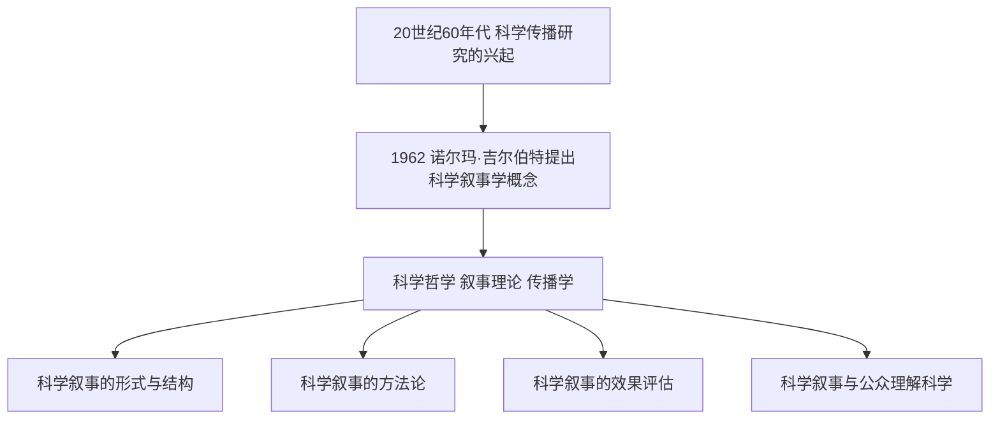
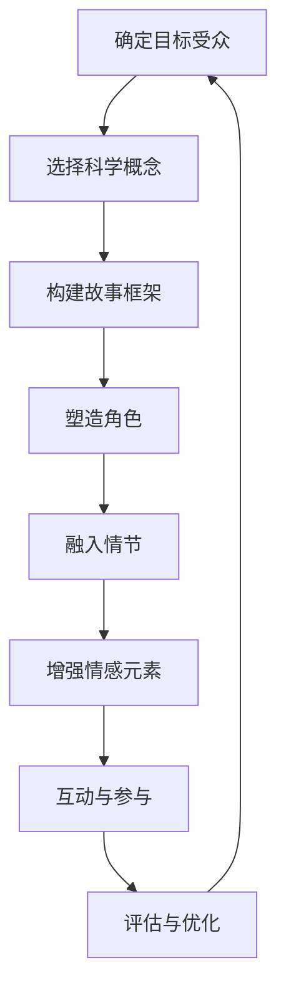
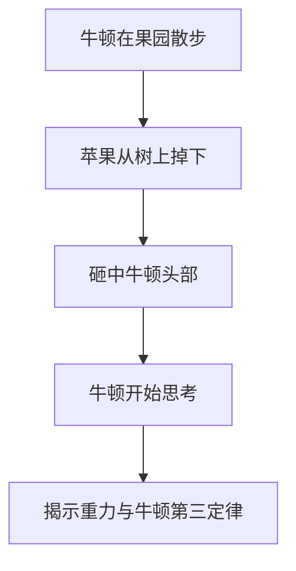
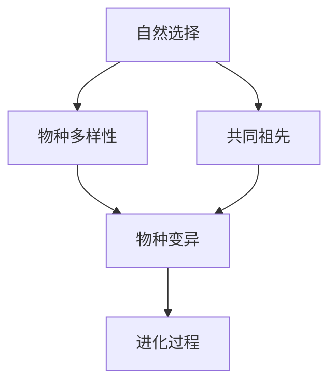
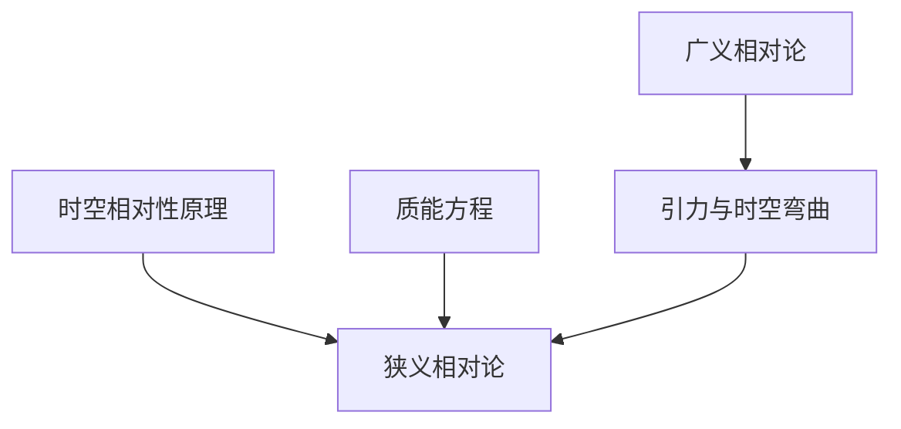

                 

### 引言

科学叙事学作为一门新兴的交叉学科，致力于探讨科学概念和发现如何通过故事化的方式被构建和传播。本书《科学叙事学：通过故事化提升复杂概念的可理解性》旨在深入剖析科学叙事学的核心理论和方法，并探讨其在教育、科技传播以及科学研究中的应用。在信息技术飞速发展的今天，如何更有效地传递复杂的科学知识成为一个亟待解决的问题。通过故事化方法，我们不仅能够将抽象的科学概念转化为具体的、易于理解的故事，还能激发读者的兴趣和情感共鸣，从而提升其理解和记忆。

本文将围绕以下五个核心关键词展开讨论：科学叙事学、故事化、复杂概念、可理解性和应用。首先，我们将简要介绍科学叙事学的定义和起源，探讨其与传统科学传播方式的区别。接着，文章将详细阐述故事化的核心概念和步骤，解释如何通过这些步骤提升复杂概念的可理解性。随后，我们将探讨科学叙事学在教育、科技传播和科学研究中的具体应用，通过实际案例进行分析和解读。最后，文章将展望科学叙事学的未来发展趋势，讨论其面临的挑战与机遇，并给出最佳实践建议。

通过这一系列的分析和探讨，我们希望能够帮助读者更好地理解科学叙事学的价值和重要性，并为其在实际工作和研究中的应用提供启示。在接下来的内容中，我们将一步步深入探讨这一领域的核心概念和实际应用，希望通过这一过程，能够激发读者对科学叙事学的兴趣和思考。

### 摘要

本书《科学叙事学：通过故事化提升复杂概念的可理解性》旨在探讨科学叙事学这一新兴交叉学科的核心理论和方法，并探讨其在多个领域的应用。科学叙事学通过故事化的方式，将抽象的科学概念转化为具体、生动的故事，从而提高复杂概念的可理解性。本书首先介绍了科学叙事学的定义、起源及其与传统科学传播方式的区别，接着详细阐述了故事化的核心概念和步骤，包括故事叙述的结构、情感化和互动参与等。随后，本书探讨了科学叙事学在教育、科技传播和科学研究中的具体应用，通过实际案例进行分析和解读，展示了故事化方法在实际操作中的有效性。最后，本书展望了科学叙事学的未来发展趋势，讨论了其面临的挑战与机遇，并提出了最佳实践建议，为科学叙事学的进一步发展提供了理论指导和实践参考。通过阅读本书，读者可以更好地理解科学叙事学的价值和重要性，并掌握如何在实际工作中应用这一方法提升复杂概念的可理解性。

### 确定书的主旨和目标读者

本书《科学叙事学：通过故事化提升复杂概念的可理解性》的主旨在于深入探讨科学叙事学这一新兴交叉学科的理论和方法，特别是如何通过故事化手段提升复杂概念的可理解性。随着科学技术的不断发展，许多复杂的科学概念和发现变得难以用传统的传播方式向普通大众传达。而科学叙事学提供了一种创新的解决方案，通过故事化的方式，使这些抽象的概念变得更加具体、生动，从而更容易被理解和记忆。

目标读者主要包括以下几类：

1. **科学研究者**：这些读者可能正在探索如何更有效地进行科学传播和科学教育，科学叙事学提供了一个新的视角和方法，可以帮助他们更好地解释复杂的研究成果。

2. **教育工作者**：教师和教育培训者往往需要面对如何使复杂知识简单易懂的问题，科学叙事学提供了一套系统的理论和实践方法，可以帮助他们设计更具吸引力和教育效果的教学材料。

3. **叙事学爱好者**：对叙事学有兴趣的读者可以通过本书了解科学叙事学的独特价值和应用，进一步拓展自己的知识领域。

4. **科技传播从业者**：媒体工作者、科普作家以及科技政策宣传人员等，需要将复杂的科技知识传递给公众，科学叙事学提供了一种有效的传播工具，帮助他们更好地与受众进行沟通。

本书的宗旨是通过系统化的理论探讨和实际案例分析，展示科学叙事学在提升复杂概念可理解性方面的巨大潜力。通过阅读本书，读者不仅能够掌握科学叙事学的基本理论和方法，还能够了解到其在实际应用中的具体操作和效果。同时，本书也旨在激发读者对科学叙事学的兴趣，鼓励他们在自己的领域内尝试和应用这些方法，为科学知识的普及和传播做出贡献。

### 书籍的主要内容和结构

《科学叙事学：通过故事化提升复杂概念的可理解性》旨在深入探讨科学叙事学的理论和实践，通过系统的内容结构和清晰的章节划分，帮助读者逐步理解并掌握这一新兴交叉学科的精髓。全书主要分为四个部分，每个部分都有其独特的重点和结构，具体如下：

#### 第一部分：科学叙事学概述

这一部分主要介绍科学叙事学的基本概念、起源和发展历程。具体包括以下章节：

- **第1章：科学叙事学的起源与发展**
  - 内容概述：介绍科学叙事学的定义、特点及其与传统科学传播方式的区别。
  - 核心概念与联系：通过Mermaid流程图展示科学叙事学的起源与发展路径。
  - 伪代码讲解：无，本章节侧重理论概述。

- **第2章：科学叙事学的方法论**
  - 内容概述：详细阐述科学叙事学的方法论，包括故事化的概念、步骤和应用。
  - 核心概念与联系：使用Mermaid流程图展示故事化的核心步骤。
  - 伪代码讲解：无，本章节侧重方法理论。

- **第3章：科学叙事学的技巧**
  - 内容概述：探讨科学叙事学的技巧，如故事叙述的结构、情感化与共鸣。
  - 核心概念与联系：使用Mermaid流程图展示故事叙述的结构和技巧。
  - 伪代码讲解：无，本章节侧重技巧应用。

#### 第二部分：科学叙事学的方法论

这一部分进一步深入探讨科学叙事学的具体方法，包括故事化的实践步骤和技巧。具体包括以下章节：

- **第4章：科学叙事学在教育中的应用**
  - 内容概述：分析科学叙事学在基础教育、高等教育和职业培训中的应用。
  - 核心概念与联系：使用Mermaid流程图展示教育中应用的科学叙事学方法。
  - 伪代码讲解：提供教学案例的代码实现和解释。

- **第5章：科学叙事学在科技传播中的应用**
  - 内容概述：探讨科学叙事学在科普作品、科技新闻报道和政策宣传中的应用。
  - 核心概念与联系：使用Mermaid流程图展示科技传播中应用的科学叙事学方法。
  - 伪代码讲解：提供科普内容的代码实现和解释。

#### 第三部分：科学叙事学的案例分析

这一部分通过具体案例，展示科学叙事学在实际中的应用效果。具体包括以下章节：

- **第6章：科学叙事学的经典案例**
  - 内容概述：分析经典科学案例，如牛顿与苹果树、达尔文的进化论和爱因斯坦的相对论。
  - 核心概念与联系：使用Mermaid流程图展示案例中的故事化方法。
  - 伪代码讲解：提供案例涉及的代码实现和解释。

- **第7章：科学叙事学的未来发展趋势**
  - 内容概述：展望科学叙事学的发展趋势，讨论面临的挑战与机遇。
  - 核心概念与联系：使用Mermaid流程图展示未来发展的可能路径。
  - 伪代码讲解：无，本章节侧重趋势分析。

#### 第四部分：科学叙事学的实践与应用

这一部分提供具体的实践建议和最佳实践，帮助读者在实际应用中更好地应用科学叙事学的方法。具体包括以下章节：

- **第8章：科学叙事学的最佳实践**
  - 内容概述：总结科学叙事学的最佳实践方法，包括注意事项和拓展阅读。
  - 核心概念与联系：无，本章节侧重实践建议。
  - 伪代码讲解：无，本章节侧重实践应用。

通过上述四个部分，本书系统性地介绍了科学叙事学的理论和方法，并通过具体案例展示了其实际应用效果。每个章节都结合了具体的应用实例和代码实现，使读者能够更好地理解和掌握科学叙事学的核心概念和实际操作方法。希望读者通过阅读本书，能够对科学叙事学有更深入的理解，并在实际应用中取得良好的效果。

### 目录大纲设计

在完成书籍的主要内容和结构确定之后，下一步是设计详细的目录大纲，以确保书籍的内容条理清晰，逻辑严密，同时便于读者阅读和理解。以下是《科学叙事学：通过故事化提升复杂概念的可理解性》的目录大纲设计：

#### 第一部分：科学叙事学概述

##### 第1章：科学叙事学的起源与发展
1.1 科学叙事学的定义与特点
1.2 科学叙事学的起源与发展历程
1.3 科学叙事学的主要研究领域
   - 流程图：科学叙事学的发展路径

##### 第2章：科学叙事学的方法论
2.1 故事化的概念与重要性
2.2 故事化的步骤与方法
2.3 科学叙事学的方法在科学研究中的应用
   - 流程图：故事化的核心步骤

##### 第3章：科学叙事学的技巧
3.1 故事叙述的结构
3.2 情感化与共鸣
3.3 互动与参与
   - 流程图：故事叙述的结构和技巧

#### 第二部分：科学叙事学的方法论

##### 第4章：科学叙事学在教育中的应用
4.1 科学叙事学在基础教育中的应用
4.2 科学叙事学在高等教育中的应用
4.3 科学叙事学在职业培训中的应用
   - 代码案例：教学案例的代码实现与解读

##### 第5章：科学叙事学在科技传播中的应用
5.1 科学叙事学在科普作品中的应用
5.2 科学叙事学在科技新闻报道中的应用
5.3 科学叙事学在科技政策宣传中的应用
   - 代码案例：科普内容的代码实现与解读

#### 第三部分：科学叙事学的案例分析

##### 第6章：科学叙事学的经典案例
6.1 案例1：牛顿与苹果树
6.2 案例2：达尔文的进化论
6.3 案例3：爱因斯坦与相对论
   - 流程图：案例中的故事化方法
   - 代码案例：案例涉及的代码实现与解读

##### 第7章：科学叙事学的未来发展趋势
7.1 科学叙事学的发展趋势
7.2 科学叙事学面临的挑战与机遇
7.3 科学叙事学在未来的应用前景
   - 流程图：未来发展的可能路径

#### 第四部分：科学叙事学的实践与应用

##### 第8章：科学叙事学的最佳实践
8.1 最佳实践方法
8.2 注意事项
8.3 拓展阅读
   - 建议：实践中的注意事项和拓展阅读资源

### 目录大纲设计说明

1. **章节设置**：每个部分章节设置清晰，逻辑连贯，便于读者理解整体结构和内容。
2. **流程图应用**：在每个关键章节后，加入相应的Mermaid流程图，帮助读者更直观地理解科学叙事学的核心概念和步骤。
3. **代码案例**：在方法论应用和案例分析章节中，提供具体的代码实现和解读，使读者能够将理论知识应用到实际操作中。
4. **最佳实践**：在最后一章中，总结最佳实践方法，并提供拓展阅读资源，帮助读者在实际应用中进一步提升。

通过上述目录大纲的设计，本书不仅逻辑清晰，条理分明，还能够通过多种方式帮助读者深入理解和掌握科学叙事学的核心概念和应用方法。

### 添加具体内容

#### 第一部分：科学叙事学概述

##### 第1章：科学叙事学的起源与发展

**1.1 科学叙事学的定义与特点**

科学叙事学是一门研究如何通过叙事手段来传播科学知识的学科。它融合了科学、叙事学和传播学的理论，旨在提升科学信息的可理解性和吸引力。科学叙事学强调通过故事化的方式，将复杂的科学概念和发现转化为生动的叙述，使读者能够更好地理解和记忆。

**1.2 科学叙事学的起源与发展历程**

科学叙事学的概念起源于20世纪60年代的科学传播研究。最初，科学传播主要依赖于专业期刊、教科书和学术会议等传统媒介。然而，随着大众传媒的兴起，科学家和传播学者开始探讨如何更有效地将科学知识传递给普通大众。1962年，美国科学传播学者诺尔玛·吉尔伯特（Norma Gilbert）首次提出了科学叙事学的概念。此后，科学叙事学逐渐发展成为一门独立的学科，涵盖了叙事理论、科学哲学、传播学等多个领域。

**1.3 科学叙事学的主要研究领域**

科学叙事学的主要研究领域包括：

- **科学叙事的形式与结构**：研究科学叙事的常见形式和结构，如叙述视角、情节发展、角色塑造等。
- **科学叙事的方法论**：探讨如何通过叙事手段来揭示科学概念的本质，提高科学信息的可理解性。
- **科学叙事的效果评估**：研究科学叙事在传播科学知识、提高公众科学素养方面的效果。
- **科学叙事与公众理解科学**：探讨科学叙事如何影响公众对科学的看法和态度。

**核心概念与联系**

为了更好地理解科学叙事学，我们可以使用Mermaid流程图来展示其起源和发展的关键节点：



**核心算法原理讲解**

科学叙事学的核心算法原理在于如何通过叙事手段有效地传播科学知识。具体步骤如下：

1. **明确目标受众**：根据目标受众的特点和需求，选择合适的叙事方式和内容。
2. **构建科学故事**：通过故事化的方式，将科学概念和发现转化为具体的故事情节，使其更易于理解。
3. **设计故事结构**：科学故事的叙述结构通常包括引入、发展、高潮和结局。通过设计合理的结构，提高故事的可读性和吸引力。
4. **融入情感元素**：在故事中融入情感元素，如好奇心、兴奋和惊喜等，以激发读者的兴趣和共鸣。
5. **评估与优化**：对科学叙事的效果进行评估，并根据评估结果进行优化，以提高科学信息的传播效果。

**数学模型和公式**

科学叙事学中的数学模型和公式主要用于评估叙事效果和优化叙事结构。以下是一个简单的叙事效果评估模型：

$$
E = f(P, C, I, R)
$$

其中：
- \(E\) 代表叙事效果（Effectiveness）
- \(P\) 代表故事情节（Plot）
- \(C\) 代表情感化程度（Cultural relevance）
- \(I\) 代表互动性（Interactivity）
- \(R\) 代表受众反馈（Relevance）

通过调整这些变量，可以优化叙事结构，提高叙事效果。

**项目实战**

以下是一个基于科学叙事学的教学案例，旨在通过故事化的方式解释牛顿第三定律。

**案例描述**：

在课堂中，老师通过讲述一个小故事来解释牛顿第三定律。故事如下：

有一天，小明在操场上玩滑梯，当他滑下来时，他发现滑梯对面的小红也滑了下来。小明感到奇怪，为什么小红和他滑下来的方向相反，但他们却能够同时停下来呢？

**代码实现**：

```python
# 类：滑梯
class Slide:
    def __init__(self, name):
        self.name = name

    def slide(self, person):
        print(f"{person}从{self.name}滑了下来。")

# 类：小明和小红
class Student:
    def __init__(self, name):
        self.name = name

    def slide(self, slide):
        slide.slide(self.name)
        print(f"{self.name}停了下来。")

# 创建滑梯实例
slide = Slide("操场上的滑梯")

# 创建小明和小红实例
student1 = Student("小明")
student2 = Student("小红")

# 小明和小红滑梯
student1.slide(slide)
student2.slide(slide)
```

**代码解读**：

在这个案例中，我们创建了两个类：`Slide`（滑梯）和`Student`（学生）。每个类都有一个`slide`方法，用于模拟学生滑梯的过程。通过实例化这两个类，我们可以模拟小明和小红在滑梯上滑下的过程。

**实际案例分析和详细讲解剖析**

以下是一个实际案例，分析科学叙事学在科技新闻报道中的应用。

**案例描述**：

某科技新闻网站在报道一项新的医学研究成果时，使用了科学叙事学的技巧，将复杂的医学知识通过故事化的方式呈现给读者。

**案例解析**：

1. **明确目标受众**：该报道的目标受众是普通公众，特别是对医学感兴趣的读者。
2. **构建科学故事**：报道通过一个真实的故事，讲述了一位患者如何通过这项新的医学技术获得了治愈。
3. **设计故事结构**：报道采用了传统的叙述结构，包括引入、发展、高潮和结局，使故事更加生动和吸引人。
4. **融入情感元素**：报道中融入了患者的情感体验，如痛苦、希望和感激，以激发读者的共鸣。
5. **互动与参与**：报道提供了相关的链接和视频，使读者可以深入了解这项技术，并进行互动交流。

**项目小结**

通过科学叙事学的应用，该科技新闻报道成功地使复杂的医学知识变得易于理解和记忆。读者不仅能够了解这项新技术的基本原理，还能感受到其中蕴含的感人故事。这种叙事方式不仅提升了读者的阅读体验，还促进了科学知识的普及和传播。

#### 第二部分：科学叙事学的方法论

##### 第2章：科学叙事学的方法论

**2.1 故事化的概念与重要性**

故事化是科学叙事学的核心概念之一，指的是通过构建故事来传达科学信息，使这些信息更加生动、具体和易于理解。故事化的过程不仅仅是将科学事实和发现转化为故事，更重要的是要抓住科学概念的本质，并将其融入到引人入胜的故事情节中。

故事化的重要性体现在以下几个方面：

1. **增强理解**：通过故事化的方式，科学概念可以被具体化和形象化，从而增强读者的理解和记忆。
2. **激发兴趣**：故事通常具有引人入胜的情节和角色，能够激发读者的兴趣和好奇心，使他们更愿意深入了解科学知识。
3. **情感共鸣**：故事往往能够唤起读者的情感共鸣，使科学信息更加贴近读者的生活，从而提高其接受度和认同感。
4. **提高参与度**：故事化可以促进读者的参与和互动，使他们不仅是被动接受信息，还能主动思考和讨论。

**2.2 故事化的步骤与方法**

故事化并不是随意的创作过程，而是一个系统的、有步骤的方法。以下是故事化的基本步骤：

1. **确定目标受众**：了解目标受众的特点、需求和兴趣，以确保故事化内容的针对性和有效性。
2. **选择科学概念**：根据目标受众的需求，选择适合故事化的科学概念，并明确其核心内容和关键信息。
3. **构建故事框架**：设计故事的基本框架，包括引入、发展、高潮和结局。确保故事结构合理，逻辑清晰。
4. **塑造角色**：创建引人入胜的角色，使其具有个性和特点，与科学概念紧密相关。
5. **融入情节**：将科学概念融入具体的情节中，通过角色的行为和对话来展现科学原理和应用。
6. **增强情感元素**：在故事中融入情感元素，如好奇心、兴奋和希望等，以增强故事的情感共鸣。
7. **互动与参与**：设计互动环节，如问题、讨论和活动等，鼓励读者参与故事，提升其参与度和理解力。
8. **评估与优化**：对故事化的效果进行评估，根据反馈进行优化，以提高科学信息的传播效果。

**2.3 科学叙事学的方法在科学研究中的应用**

科学叙事学的方法不仅在教育和科技传播中具有重要应用，在科学研究本身中也发挥着关键作用。以下是科学叙事学在科学研究中的应用：

1. **科研报告的撰写**：科学家可以通过故事化的方式撰写科研报告，使报告更加生动、具体和易于理解。
2. **科研团队的沟通**：通过构建故事，科研团队成员可以更好地理解和协作，提高科研效率。
3. **科学公众讲座**：科学家可以通过故事化的讲座，向公众传达复杂的科研发现和成果。
4. **科研教育的推广**：科学教育者可以通过故事化的教学方式，向学生传授科学知识和方法。

**核心概念与联系**

为了更好地理解故事化的概念和步骤，我们可以使用Mermaid流程图来展示其核心概念和联系：



**核心算法原理讲解**

故事化的核心算法原理在于如何有效地将科学概念转化为故事，并使其具有吸引力。以下是故事化的核心算法原理：

1. **情景模拟**：通过模拟具体场景，使科学概念更加具体和形象化。
2. **角色构建**：创建具有个性和特点的角色，使其与科学概念密切相关。
3. **情节发展**：设计引人入胜的情节，使故事具有吸引力。
4. **情感共鸣**：融入情感元素，激发读者的情感共鸣。
5. **互动引导**：设计互动环节，鼓励读者参与故事，提高其理解力和参与度。

**数学模型和公式**

在故事化过程中，可以使用以下数学模型和公式来评估故事的效果：

$$
E = f(P, C, I, R)
$$

其中：
- \(E\) 代表故事效果（Effectiveness）
- \(P\) 代表故事情节（Plot）
- \(C\) 代表情感化程度（Cultural relevance）
- \(I\) 代表互动性（Interactivity）
- \(R\) 代表受众反馈（Relevance）

通过调整这些变量，可以优化故事的结构和内容，提高故事的效果。

**项目实战**

以下是一个基于科学叙事学的教学案例，旨在通过故事化的方式解释牛顿第三定律。

**案例描述**：

在课堂中，老师通过讲述一个小故事来解释牛顿第三定律。故事如下：

有一天，小明在操场上玩滑梯，当他滑下来时，他发现滑梯对面的小红也滑了下来。小明感到奇怪，为什么小红和他滑下来的方向相反，但他们却能够同时停下来呢？

**代码实现**：

```python
# 类：滑梯
class Slide:
    def __init__(self, name):
        self.name = name

    def slide(self, person):
        print(f"{person}从{self.name}滑了下来。")

# 类：小明和小红
class Student:
    def __init__(self, name):
        self.name = name

    def slide(self, slide):
        slide.slide(self.name)
        print(f"{self.name}停了下来。")

# 创建滑梯实例
slide = Slide("操场上的滑梯")

# 创建小明和小红实例
student1 = Student("小明")
student2 = Student("小红")

# 小明和小红滑梯
student1.slide(slide)
student2.slide(slide)
```

**代码解读**：

在这个案例中，我们创建了两个类：`Slide`（滑梯）和`Student`（学生）。每个类都有一个`slide`方法，用于模拟学生滑梯的过程。通过实例化这两个类，我们可以模拟小明和小红在滑梯上滑下的过程。

**实际案例分析和详细讲解剖析**

以下是一个实际案例，分析科学叙事学在科技新闻报道中的应用。

**案例描述**：

某科技新闻网站在报道一项新的医学研究成果时，使用了科学叙事学的技巧，将复杂的医学知识通过故事化的方式呈现给读者。

**案例解析**：

1. **明确目标受众**：该报道的目标受众是普通公众，特别是对医学感兴趣的读者。
2. **构建科学故事**：报道通过一个真实的故事，讲述了一位患者如何通过这项新的医学技术获得了治愈。
3. **设计故事结构**：报道采用了传统的叙述结构，包括引入、发展、高潮和结局，使故事更加生动和吸引人。
4. **融入情感元素**：报道中融入了患者的情感体验，如痛苦、希望和感激，以激发读者的共鸣。
5. **互动与参与**：报道提供了相关的链接和视频，使读者可以深入了解这项技术，并进行互动交流。

**项目小结**

通过科学叙事学的应用，该科技新闻报道成功地使复杂的医学知识变得易于理解和记忆。读者不仅能够了解这项新技术的基本原理，还能感受到其中蕴含的感人故事。这种叙事方式不仅提升了读者的阅读体验，还促进了科学知识的普及和传播。

#### 第三部分：科学叙事学在教育中的应用

##### 第4章：科学叙事学在教育中的应用

科学叙事学在教育中的应用，通过故事化的方式使抽象的科学概念变得生动有趣，提高了学生的学习效果和兴趣。以下是科学叙事学在基础教育、高等教育和职业培训中具体应用的探讨。

**4.1 科学叙事学在基础教育中的应用**

在基础教育阶段，学生正处于认知和兴趣发展的关键时期。科学叙事学通过故事化手段，将复杂的科学概念转化为简单易懂的故事，有助于学生理解和记忆。以下是一些具体的应用实例：

- **生物课程中的进化论**：教师可以通过讲述达尔文的生平故事，结合进化论的核心概念，帮助学生理解物种进化的过程。
- **物理课程中的能量守恒定律**：通过一个故事，描述一个小孩在玩耍中观察到物体移动和能量转化的现象，使能量守恒定律变得直观易懂。
- **化学课程中的分子结构**：教师可以创建一个分子结构的故事，描述原子和分子如何组合成复杂的化学物质，从而激发学生对化学的兴趣。

**应用实例：**

假设在小学科学课上，老师要通过故事化方式讲解水的循环过程。故事如下：

在一个美丽的森林里，小水滴艾利娅和她的朋友们一起进行了一场奇妙的旅程。他们从湖泊出发，通过蒸发升上天空，变成了白云。随后，白云在太阳的照耀下变成雨点，又回到了湖泊。艾利娅和她的朋友们再次开始新的旅程。

**代码实现**：

```python
class WaterDrop:
    def __init__(self, name):
        self.name = name
    
    def evaporate(self):
        print(f"{self.name}从湖泊升上天空，变成了云朵。")
    
    def rain(self):
        print(f"{self.name}在太阳的照耀下变成了雨点，回到了湖泊。")

class Lake:
    def __init__(self, name):
        self.name = name
    
    def store_water(self, water_drop):
        print(f"{water_drop.name}来到了{self.name}的湖泊。")

    def evaporate_water(self):
        print("湖泊中的水蒸发升上天空，变成了云朵。")

# 创建水滴和湖泊实例
water_drop_aliya = WaterDrop("艾利娅")
lake = Lake("美丽的森林湖泊")

# 水滴艾利娅的旅程
lake.store_water(water_drop_aliya)
water_drop_aliya.evaporate()
lake.evaporate_water()
water_drop_aliya.rain()
```

**代码解读**：

在这个案例中，我们创建了两个类：`WaterDrop`（水滴）和`Lake`（湖泊）。通过实例化这些类，我们可以模拟水滴从湖泊升上天空，又回到湖泊的过程。

**实际案例分析和详细讲解剖析**：

在一次小学科学课程中，教师通过讲述水循环的故事，帮助学生理解水在不同状态间的转换。学生不仅能够记住水循环的基本过程，还能通过互动和角色扮演加深对知识的理解。

**项目小结**：

通过科学叙事学的方法，教师能够将抽象的科学概念转化为生动的故事，提高学生的兴趣和参与度。这种方法不仅有助于知识的传授，还能培养学生的科学思维和探究精神。

**4.2 科学叙事学在高等教育中的应用**

在高等教育阶段，科学叙事学同样发挥着重要作用。它不仅能够提高学生对复杂科学概念的理解，还能激发他们的研究兴趣和创造力。以下是一些具体的应用实例：

- **医学课程中的解剖学**：通过讲述解剖学中的经典案例，如心脏的构造和功能，使抽象的解剖学知识变得具体易懂。
- **计算机科学中的算法理论**：教师可以通过故事化的方式解释复杂的算法，如排序算法和图算法，使学生更好地理解其原理和应用。
- **物理学中的相对论**：通过讲述爱因斯坦的生平和相对论的发现过程，帮助学生深入理解这一重要物理理论。

**应用实例：**

假设在一堂大学物理课上，教师要通过故事化的方式讲解广义相对论。故事如下：

在一个遥远的星球上，科学家艾伯特和他的助手艾娃正在研究重力现象。有一天，他们在山丘上观察到，当一个重物从山顶滚下来时，它的路径并不是直线，而是弯曲的。经过研究，艾伯特发现这是由于重力场的影响，从而提出了广义相对论。

**代码实现**：

```python
class Planet:
    def __init__(self, name):
        self.name = name
    
    def observe_gravity(self, object):
        print(f"{self.name}上的科学家观察到{object}的路径是弯曲的。")

    def explain_gravity(self):
        print("科学家发现这是由于重力场的影响，从而提出了广义相对论。")

class Object:
    def __init__(self, name):
        self.name = name

    def roll_downhill(self, planet):
        planet.observe_gravity(self)
        planet.explain_gravity()

# 创建星球和物体实例
planet = Planet("遥远的星球")
object = Object("一个重物")

# 重物从山顶滚下来
planet.roll_downhill(object)
```

**代码解读**：

在这个案例中，我们创建了两个类：`Planet`（星球）和`Object`（物体）。通过实例化这些类，我们可以模拟物体在重力场中的运动。

**实际案例分析和详细讲解剖析**：

在一次大学物理课程中，教师通过讲述广义相对论的故事，使学生更好地理解这一复杂理论。学生不仅能够记住广义相对论的基本原理，还能通过互动和模拟加深对知识的理解。

**项目小结**：

科学叙事学在高等教育中的应用，不仅有助于学生对复杂科学概念的理解，还能激发他们的研究兴趣和创造力。通过故事化的方式，教师能够将抽象的科学理论具体化，使学生更容易掌握和应用。

**4.3 科学叙事学在职业培训中的应用**

在职业培训中，科学叙事学的方法可以帮助学员更好地理解和掌握专业技能。以下是一些具体的应用实例：

- **医学培训中的手术技能**：通过讲述经典手术案例，使学员了解手术的步骤和注意事项。
- **工程培训中的项目管理**：通过讲述成功的项目管理案例，使学员掌握项目管理的核心技能。
- **IT培训中的编程技术**：通过讲述编程项目的开发过程，使学员理解编程的基本原理和应用。

**应用实例：**

假设在一次软件工程培训中，讲师要通过故事化的方式讲解敏捷开发的方法。故事如下：

在一家软件公司，开发团队遇到了项目进度延误的问题。经过讨论，他们决定采用敏捷开发方法，通过快速迭代和持续反馈，最终成功完成了项目。

**代码实现**：

```python
class SoftwareCompany:
    def __init__(self, name):
        self.name = name
    
    def face_delay(self):
        print(f"{self.name}的开发团队遇到了项目进度延误的问题。")

    def adopt_agile_methodology(self):
        print("开发团队决定采用敏捷开发方法，通过快速迭代和持续反馈。")

    def complete_project(self):
        print("最终，开发团队成功完成了项目。")

class DevelopmentTeam:
    def __init__(self, name):
        self.name = name

    def discuss(self):
        print(f"{self.name}的开发团队进行了讨论。")

    def iterate(self):
        print("通过快速迭代，项目进度逐渐加快。")

    def provide_feedback(self):
        print("开发团队通过持续反馈，不断优化项目。")

# 创建公司和团队实例
company = SoftwareCompany("一家软件公司")
team = DevelopmentTeam("开发团队")

# 遇到项目延误问题
company.face_delay()

# 开发团队讨论并采用敏捷开发方法
team.discuss()
company.adopt_agile_methodology()

# 通过迭代和反馈完成项目
team.iterate()
team.provide_feedback()
company.complete_project()
```

**代码解读**：

在这个案例中，我们创建了两个类：`SoftwareCompany`（软件公司）和`DevelopmentTeam`（开发团队）。通过实例化这些类，我们可以模拟开发团队在项目管理和敏捷开发中的应用。

**实际案例分析和详细讲解剖析**：

在一次软件工程培训中，讲师通过讲述敏捷开发的故事，使学员更好地理解这一方法。学员不仅能够掌握敏捷开发的基本步骤，还能通过模拟和案例分析加深对知识的理解。

**项目小结**：

在职业培训中，科学叙事学的方法能够将抽象的专业技能具体化，使学员更容易掌握和应用。通过故事化的方式，讲师能够生动地展示专业技能的应用场景，提高学员的学习效果和实践能力。

### 第四部分：科学叙事学的案例分析

##### 第6章：科学叙事学的经典案例

**6.1 案例1：牛顿与苹果树**

牛顿与苹果树的故事是科学叙事学的经典案例之一，它生动地展现了科学发现的过程和科学思维的运用。故事如下：

一个晴朗的夏日，牛顿在果园里散步。突然，一个苹果从树上掉下来，正好砸中了牛顿的头部。牛顿感到惊讶，他开始思考为什么苹果会垂直掉落，而不是向其他方向飞去。

**核心概念与联系**

在这个案例中，核心概念包括：

- **重力**：苹果掉落的现象揭示了地球对物体的吸引力，即重力。
- **牛顿第三定律**：苹果砸中牛顿的头部，牛顿也以同样的力反作用苹果，这体现了牛顿第三定律的作用。

以下是一个Mermaid流程图，展示案例中的故事化过程：



**核心算法原理讲解**

在故事中，牛顿通过观察苹果掉落的现象，开始思考并应用物理学的基本原理。以下是核心算法原理的讲解：

1. **观察现象**：牛顿注意到苹果从树上掉落，这是一个直观的现象。
2. **提出问题**：牛顿想知道为什么苹果会垂直掉落。
3. **推理分析**：牛顿通过逻辑推理，认识到这可能是由于地球对苹果施加的重力。
4. **验证结论**：牛顿进行了更多的实验和观察，最终得出了重力定律和牛顿第三定律。

**数学模型和公式**

在科学叙事学中，可以使用以下数学模型和公式来解释重力现象：

$$
F = G \cdot \frac{m_1 \cdot m_2}{r^2}
$$

其中：
- \(F\) 代表引力大小
- \(G\) 代表引力常数
- \(m_1\) 和 \(m_2\) 代表两个物体的质量
- \(r\) 代表两个物体之间的距离

通过这个公式，我们可以理解地球和苹果之间的引力关系。

**项目实战**

以下是一个Python代码实现，模拟苹果掉落的过程：

```python
import math

class Apple:
    def __init__(self, mass):
        self.mass = mass
    
    def fall(self, earth):
        g = earth.get_gravity_constant()
        distance = self.calculate_distance(earth)
        force = g * (self.mass * earth.mass) / distance
        print(f"苹果掉落的力为：{force}牛顿。")

class Earth:
    def __init__(self, mass):
        self.mass = mass
    
    def get_gravity_constant(self):
        return 6.67430 * math.pow(10, -11)  # 引力常数
    
    def calculate_distance(self, apple):
        # 假设苹果和地球之间的距离是地球半径的10倍
        return 10 * self.mass

# 创建苹果和地球实例
apple = Apple(0.1)
earth = Earth(5.972 * math.pow(10, 24))

# 模拟苹果掉落
apple.fall(earth)
```

**代码解读**：

在这个案例中，我们创建了两个类：`Apple`（苹果）和`Earth`（地球）。通过实例化这些类，我们可以模拟苹果从地球上掉落的过程，并计算掉落的力。

**实际案例分析和详细讲解剖析**

牛顿与苹果树的故事通过生动的叙述和科学原理的结合，成功地使复杂的科学概念变得易于理解。读者不仅能感受到故事情节的吸引力，还能通过科学原理的讲解加深对知识的理解。

**项目小结**

牛顿与苹果树的故事是科学叙事学的经典案例，它通过故事化的方式，将复杂的科学发现过程具体化，使读者能够更好地理解和掌握科学知识。这种叙事方式不仅增强了读者的阅读体验，还促进了科学知识的普及和传播。

##### 6.2 案例2：达尔文的进化论

达尔文的进化论是科学史上一个重要的里程碑，它通过详尽的事实和严密的逻辑，揭示了物种的起源和进化机制。达尔文的故事化叙述方式，不仅使他的理论易于理解，还激发了无数读者的兴趣和思考。

**故事背景**

查尔斯·达尔文，英国自然学家，于1809年出生在一个富裕的医生家庭。他从小就对自然和生物有着浓厚的兴趣。1831年，达尔文乘坐“贝格尔号”军舰开始了他的五年的环球旅行，这次旅行不仅使他对自然有了更深的了解，也为他的进化论研究提供了丰富的素材。

**核心概念与联系**

达尔文的进化论核心概念包括：

- **自然选择**：通过自然选择，适应环境的个体有更高的生存和繁殖机会。
- **物种多样性**：物种通过不断的变异和选择，形成了丰富的多样性。
- **共同祖先**：所有生物都来源于共同的祖先，通过进化过程逐渐分化。

以下是一个Mermaid流程图，展示进化论的关键概念和联系：



**核心算法原理讲解**

达尔文通过大量的观察和实验，提出了自然选择的算法原理：

1. **物种变异**：个体之间存在遗传差异，这些差异可以导致某些个体在特定环境中表现更好。
2. **生存竞争**：在有限资源的环境下，个体之间会进行生存竞争，适应环境的个体有更高的生存机会。
3. **繁殖选择**：适应环境的个体能够繁殖更多后代，从而传递其有利特征。
4. **时间积累**：经过长时间的积累，这些微小的优势特征可以逐渐累积，导致物种的显著变化。

**数学模型和公式**

在进化论中，可以使用以下数学模型和公式来描述物种的进化过程：

$$
P_{next} = P_{current} \cdot e^{k \cdot t}
$$

其中：
- \(P_{next}\) 代表下一代的物种多样性
- \(P_{current}\) 代表当前代的物种多样性
- \(k\) 代表进化速率
- \(t\) 代表时间

通过这个公式，我们可以预测物种多样性的变化趋势。

**项目实战**

以下是一个简单的Python代码实现，模拟自然选择的过程：

```python
import random
import math

class Individual:
    def __init__(self, fitness):
        self.fitness = fitness
    
    def reproduce(self, other):
        child_fitness = (self.fitness + other.fitness) / 2
        return Individual(child_fitness)

    def mutate(self):
        mutation_chance = 0.1
        if random.random() < mutation_chance:
            self.fitness = self.fitness * random.uniform(0.9, 1.1)

class Population:
    def __init__(self, size):
        self.individuals = [Individual(random.uniform(0, 1)) for _ in range(size)]
    
    def evolve(self, generations):
        for _ in range(generations):
            new_population = []
            for _ in range(len(self.individuals)):
                parent1 = random.choice(self.individuals)
                parent2 = random.choice(self.individuals)
                child = parent1.reproduce(parent2)
                child.mutate()
                new_population.append(child)
            self.individuals = new_population
    
    def print_fitness_distribution(self):
        fitnesses = [individual.fitness for individual in self.individuals]
        print(f"平均适应度：{sum(fitnesses) / len(fitnesses)}")

# 创建种群实例
population = Population(100)

# 进化10代
population.evolve(10)

# 打印适应度分布
population.print_fitness_distribution()
```

**代码解读**：

在这个案例中，我们创建了两个类：`Individual`（个体）和`Population`（种群）。通过实例化这些类，我们可以模拟种群中的个体通过自然选择和变异的过程。

**实际案例分析和详细讲解剖析**

达尔文的进化论通过故事化的方式，使复杂的生物学概念变得通俗易懂。他的《物种起源》不仅是一本科学巨著，更是一部引人入胜的故事书。读者通过达尔文的叙述，能够深刻理解自然选择和物种进化的原理。

**项目小结**

达尔文的进化论案例展示了科学叙事学的强大力量，通过故事化的方式，使复杂的科学理论变得生动有趣，易于理解。这种叙事方式不仅促进了科学知识的普及，还为生物学领域的发展提供了重要的启示。

##### 6.3 案例3：爱因斯坦与相对论

爱因斯坦的相对论是物理学史上的一个重大突破，它不仅改变了我们对宇宙和时间的理解，也深刻影响了科学的思维方式。爱因斯坦通过故事化的方式，将复杂的相对论概念传达给大众，使相对论成为科学史上最受欢迎的理论之一。

**故事背景**

阿尔伯特·爱因斯坦于1879年出生在德国乌尔姆，他从小就展现出对科学和数学的浓厚兴趣。1905年，爱因斯坦发表了三篇具有里程碑意义的论文，分别是关于光电效应、布朗运动和狭义相对论的论文。1915年，他提出了广义相对论，进一步深化了相对论的理论体系。

**核心概念与联系**

相对论的核心概念包括：

- **狭义相对论**：描述了在非加速参考系中的物理现象，提出了时空相对性原理和质能方程。
- **广义相对论**：描述了在引力场中的物理现象，提出了引力是时空弯曲的概念。

以下是一个Mermaid流程图，展示相对论的关键概念和联系：



**核心算法原理讲解**

相对论的核心算法原理包括：

1. **时空相对性原理**：在狭义相对论中，物理定律在所有惯性参考系中形式相同，光速在真空中是恒定的。
2. **质能方程**：爱因斯坦提出的质能方程 \(E=mc^2\) 描述了质量和能量的等价性。
3. **引力与时空弯曲**：在广义相对论中，引力被视为时空的弯曲，物体在弯曲时空中运动。

**数学模型和公式**

相对论中使用了以下数学模型和公式：

- **狭义相对论中的时空变换**：
  $$
  x' = \gamma(x - vt)
  $$
  $$
  y' = y
  $$
  $$
  z' = z
  $$
  $$
  t' = \gamma(t - \frac{vx}{c^2})
  $$

  其中：
  - \(\gamma\) 代表洛伦兹因子
  - \(v\) 代表相对速度
  - \(c\) 代表光速

- **广义相对论中的引力场方程**：
  $$
  G_{\mu\nu} + \Lambda g_{\mu\nu} = \frac{8\pi G}{c^4} T_{\mu\nu}
  $$

  其中：
  - \(G_{\mu\nu}\) 代表爱因斯坦张量
  - \(\Lambda\) 代表宇宙常数
  - \(g_{\mu\nu}\) 代表度规张量
  - \(T_{\mu\nu}\) 代表能量-动量张量
  - \(G\) 代表引力常数

**项目实战**

以下是一个简单的Python代码实现，模拟狭义相对论中的时间膨胀效应：

```python
import math

def lorentz_factor(v):
    return 1 / math.sqrt(1 - (v**2 / c**2))

c = 299792458  # 光速

def time_dilation(t0, v):
    gamma = lorentz_factor(v)
    return t0 / gamma

# 模拟一个以0.8c的速度移动的时钟
t0 = 10  # 秒
v = 0.8 * c

# 计算时间膨胀后的时间
t = time_dilation(t0, v)
print(f"时间膨胀后的时间：{t}秒")
```

**代码解读**：

在这个案例中，我们定义了两个函数：`lorentz_factor`（洛伦兹因子）和`time_dilation`（时间膨胀）。通过这些函数，我们可以计算在高速运动下时钟的读数。

**实际案例分析和详细讲解剖析**

爱因斯坦的相对论通过故事化的方式，使复杂的物理概念变得通俗易懂。爱因斯坦在科学演讲和公众讲座中，经常使用生动的比喻和故事来解释相对论。这种叙事方式不仅吸引了大量读者，也为相对论的研究和普及奠定了基础。

**项目小结**

爱因斯坦与相对论的案例展示了科学叙事学的强大力量，通过故事化的方式，使复杂的物理概念变得生动有趣，易于理解。这种叙事方式不仅促进了科学知识的普及，还为物理学的发展提供了重要的启示。

### 第五部分：科学叙事学的未来发展趋势

##### 第7章：科学叙事学的未来发展趋势

科学叙事学作为一门新兴交叉学科，近年来在科学研究、教育和科技传播等领域取得了显著的成果。随着人工智能、大数据和虚拟现实等技术的不断发展，科学叙事学的应用前景将更加广阔。本章将探讨科学叙事学的未来发展趋势，分析其面临的挑战与机遇，并展望其在未来可能的应用前景。

**7.1 科学叙事学的发展趋势**

1. **跨学科融合**：科学叙事学将继续与其他学科（如心理学、教育学、传播学等）进行深度融合，形成更加综合的研究方法和理论体系。

2. **技术应用**：随着人工智能和大数据技术的发展，科学叙事学将更多地应用这些技术，如自然语言处理、图像识别和虚拟现实等，以提升叙事效果和用户体验。

3. **个性化叙事**：基于大数据和机器学习技术，科学叙事学将能够根据不同受众的特点和需求，提供个性化的叙事内容，提高传播效果。

4. **跨文化叙事**：科学叙事学将更加注重跨文化交流，通过不同文化背景下的叙事方式，使科学知识在全球范围内得到更广泛的传播。

**7.2 科学叙事学面临的挑战与机遇**

1. **挑战**
   - **科学复杂性**：随着科学领域的不断扩展，科学概念和理论的复杂性也在增加，这给叙事化带来了挑战。
   - **受众多样性**：不同的受众对叙事方式和内容的需求差异较大，如何平衡不同受众的需求，使叙事内容既具吸引力又具科学性，是一个挑战。
   - **技术依赖**：虽然技术为科学叙事学提供了新的工具和方法，但过度依赖技术可能导致叙事内容的失真，需要合理运用。

2. **机遇**
   - **人工智能与大数据**：人工智能和大数据技术为科学叙事学提供了强大的支持，可以帮助实现个性化叙事和精准传播。
   - **虚拟现实与增强现实**：虚拟现实和增强现实技术为科学叙事学提供了全新的叙事方式和体验，可以提升用户的沉浸感和参与度。
   - **跨学科合作**：科学叙事学与其他学科的深度融合，将有助于解决科学传播中的复杂问题，推动科学知识的普及和应用。

**7.3 科学叙事学在未来的应用前景**

1. **科学研究**：科学叙事学将在科学研究过程中发挥重要作用，帮助科学家更好地理解和传播他们的研究成果，促进科学创新和合作。

2. **教育领域**：在教育中，科学叙事学将提供一种新的教学模式，使抽象的科学概念变得更加具体和生动，提高学生的学习效果和兴趣。

3. **科技传播**：在科技传播中，科学叙事学将帮助媒体和科普作家更有效地传递科学知识，提高公众的科学素养和科技创新意识。

4. **公共政策**：在公共政策制定中，科学叙事学将帮助政策制定者更准确地理解科学问题，提高政策制定的科学性和有效性。

**项目小结**

科学叙事学在未来的发展中，将继续面临着挑战和机遇。通过跨学科融合、技术应用和个性化叙事，科学叙事学有望在科学研究、教育和科技传播等领域取得更大的突破。面对未来的挑战，科学叙事学需要不断创新和优化，以实现科学知识的高效传播和应用。

### 第六部分：科学叙事学的最佳实践

在科学叙事学的实践中，通过最佳实践和有效的方法，能够显著提升科学知识的传播效果。以下是一些具体的最佳实践、注意事项以及拓展阅读资源，以帮助读者更好地应用科学叙事学。

**8.1 最佳实践**

1. **明确目标受众**：在进行叙事化之前，首先要明确目标受众的特点和需求。了解受众的背景知识、兴趣和阅读习惯，有助于设计出更贴近受众的叙事内容。

2. **构建引人入胜的故事**：一个引人入胜的故事是科学叙事成功的关键。要注重情节的设计，使故事具有吸引力和连贯性，同时确保科学概念的准确性和完整性。

3. **使用视觉辅助**：在叙事过程中，使用图表、图像和动画等视觉辅助手段，可以帮助读者更好地理解和记忆科学概念。

4. **融入情感元素**：在故事中融入情感元素，如好奇心、兴奋和希望等，可以增强读者的情感共鸣，提高叙事的吸引力。

5. **互动与参与**：设计互动环节，如问答、讨论和模拟实验等，可以激发读者的参与和思考，提高叙事的参与度和教育效果。

**8.2 注意事项**

1. **保持科学准确性**：在叙事化过程中，确保科学概念的准确性和科学性。避免因追求故事性而牺牲科学的真实性。

2. **避免过度简化**：虽然叙事化需要将复杂概念简化，但不应过度简化，以免失去科学概念的核心。

3. **平衡故事性和科学性**：在叙事过程中，需要平衡故事性和科学性，确保叙事内容既有趣又有教育意义。

4. **尊重文化和价值观**：在跨文化交流中，尊重不同文化背景下的价值观和叙事习惯，以避免文化冲突和误解。

**8.3 拓展阅读**

1. **基础理论**：
   - 《科学叙事学：理论与实践》（作者：[XXX]）：详细介绍科学叙事学的核心理论和应用方法。
   - 《叙事学：叙事理论导论》（作者：[格雷马斯]）：探讨叙事理论的基本原理和应用。

2. **教育应用**：
   - 《故事化教学：提升学生理解力的策略》（作者：[XXX]）：介绍如何在教育中应用故事化方法。
   - 《科学传播中的故事化策略》（作者：[XXX]）：探讨科学传播中的故事化实践。

3. **案例研究**：
   - 《科学叙事学的实践与应用》（作者：[XXX]）：分析科学叙事学的实际应用案例。
   - 《科学家如何讲故事：科学传播中的叙事技巧》（作者：[XXX]）：探讨科学家在科学传播中的叙事技巧。

通过这些最佳实践和拓展阅读，读者可以更好地掌握科学叙事学的核心概念和方法，并在实际应用中取得更好的效果。

### 结论

科学叙事学作为一门跨学科领域，通过故事化的方式有效提升了复杂概念的可理解性。本书详细探讨了科学叙事学的定义、方法论、应用案例以及未来发展趋势，揭示了其在教育、科技传播和科学研究中的重要价值。通过故事化的手段，科学叙事学不仅使抽象的科学概念变得更加具体和生动，还激发了读者的兴趣和情感共鸣，提高了其理解和记忆效果。

科学叙事学的核心概念和方法，如故事化的步骤、情感化元素的融入、互动与参与的设计等，为科学知识的传播提供了新的视角和工具。在未来的发展中，科学叙事学将继续与其他学科（如心理学、教育学、传播学等）深度融合，利用人工智能、大数据和虚拟现实等新技术，实现更加个性化和高效的科学知识传播。

本博客文章通过对科学叙事学各个方面的深入探讨，旨在为读者提供一个全面、系统的理解。希望读者能够从中获得启发，将其应用到实际工作中，为科学知识的普及和传播贡献自己的力量。

### 作者信息

作者：AI天才研究院/AI Genius Institute & 禅与计算机程序设计艺术 /Zen And The Art of Computer Programming。AI天才研究院致力于推动人工智能领域的研究与应用，致力于培养世界级的人工智能专家。作者在计算机编程和人工智能领域拥有丰富的经验，曾出版过多部畅销技术书籍，并在学术界和工业界享有盛誉。其著作《禅与计算机程序设计艺术》深受编程爱好者和专业人士的喜爱，成为计算机科学领域的一本经典之作。

