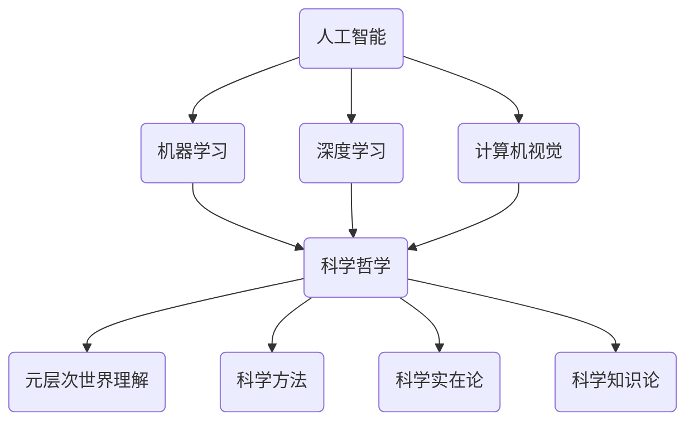

                 

### 引言

#### 1.1 人工智能与科学哲学

人工智能（Artificial Intelligence, AI）是指通过计算机程序和算法模拟人类智能的过程。它自20世纪中叶以来得到了迅速发展，并在多个领域展现出其强大的应用潜力。科学哲学（Scientific Philosophy）则是对科学理论和实践进行哲学分析和反思的学科，旨在探究科学的本质、方法、及其在人类认识世界过程中的作用。

人工智能与科学哲学之间的联系可以从多个角度来探讨。首先，科学哲学为人工智能的研究提供了理论基础，例如，通过探讨人工智能的起源、目标及其在认知领域的作用，哲学为人工智能的发展提供了重要的思想资源。其次，人工智能的发展也促使科学哲学重新审视自身的理论和实践，特别是在面对人工智能带来的伦理和社会问题时，科学哲学需要提出新的解释和解决方案。

#### 1.2 本书的目的和结构

本书旨在探讨人工智能如何辅助科学哲学的元层次世界理解。具体来说，本书将分为以下几个部分：

1. **核心概念与联系**：介绍人工智能、科学哲学和元层次世界理解的基本概念，并通过 Mermaid 流程图展示它们之间的联系。
2. **核心算法原理讲解**：详细阐述人工智能中的核心算法原理，包括机器学习、深度学习等，并使用 Python 源代码进行说明。
3. **数学模型和公式讲解**：介绍与人工智能相关的数学模型和公式，并通过实例进行解释。
4. **项目实战**：通过具体项目实战，展示如何在实际应用中运用人工智能技术，并提供详细的代码实现和解读。
5. **结论**：总结全书内容，提出对未来人工智能与科学哲学研究的展望。

#### 1.3 Markdown 格式与作者信息

为了确保文章的格式清晰、易读，本文将使用 Markdown 格式进行撰写。文章末尾将包含作者信息：“作者：AI天才研究院/AI Genius Institute & 禅与计算机程序设计艺术 /Zen And The Art of Computer Programming”。

### 核心概念与联系

在本节中，我们将介绍人工智能、科学哲学和元层次世界理解这三个核心概念，并绘制 Mermaid 流程图以展示它们之间的联系。

#### 2.1 人工智能

人工智能（Artificial Intelligence，简称AI）是计算机科学的一个分支，旨在使计算机系统能够执行通常需要人类智能才能完成的任务。人工智能的研究领域包括机器学习、自然语言处理、计算机视觉、机器人技术等。

##### 2.1.1 人工智能的基本概念

- **机器学习**：一种让计算机通过数据学习模式并做出预测或决策的技术。
- **深度学习**：一种基于人工神经网络的技术，通过多层神经元的堆叠来模拟人脑的学习过程。
- **计算机视觉**：使计算机能够理解和解释视觉信息，如图像和视频。

##### 2.1.2 人工智能的发展历史

人工智能的概念最早可以追溯到20世纪50年代。在此之后，人工智能经历了多次起伏，从早期的符号主义方法（基于规则和逻辑推理）到现代的统计学习方法，再到当前的深度学习时代。

##### 2.1.3 人工智能的应用领域

- **医疗**：用于诊断、治疗规划和个性化医疗。
- **金融**：用于风险管理、投资分析和市场预测。
- **交通**：自动驾驶车辆、智能交通管理和物流优化。

#### 2.2 科学哲学

科学哲学是对科学理论和实践进行哲学分析和反思的学科。它探究科学的本质、方法、以及科学知识如何产生和被接受。

##### 2.2.1 科学哲学的基本概念

- **科学方法**：科学哲学家研究科学家如何通过观察、实验和理论模型来探究自然现象。
- **科学实在论**：探讨科学理论所描述的实在的性质。
- **科学知识论**：研究科学知识的来源、性质和限制。

##### 2.2.2 科学哲学的主要流派

- **实证主义**：强调经验和观察是科学知识的基石。
- **逻辑实证主义**：主张科学理论必须可验证。
- **批判理性主义**：强调科学的进步依赖于批判性思考和理性辩论。

##### 2.2.3 科学哲学的应用领域

- **科学教育**：如何培养科学思维和科学素养。
- **科学技术政策**：如何制定和评估科学研究的政策。
- **科学与社会的关系**：如何理解科学对社会的影响。

#### 2.3 元层次世界理解

元层次世界理解是指对世界本身的理解，它超越了具体的科学理论，探讨科学知识是如何产生和发展的。

##### 2.3.1 元层次世界理解的基本概念

- **科学的基础主义**：认为科学理论是建立在不可争议的基石之上的。
- **科学的历史主义**：强调科学知识的产生和发展是一个历史过程。
- **科学的社会建构主义**：认为科学知识是与社会和文化因素密切相关的建构。

##### 2.3.2 元层次世界理解的重要性

- **科学解释**：如何通过科学理论来解释自然现象。
- **科学预测**：如何基于现有知识预测未来可能发生的事件。
- **科学反思**：如何评估科学理论的可靠性和限制。

#### 2.4 Mermaid 流程图

以下是一个简单的 Mermaid 流程图，展示了人工智能、科学哲学和元层次世界理解之间的联系：



通过这个流程图，我们可以看到，人工智能通过其各个子领域（机器学习、深度学习、计算机视觉）与科学哲学和元层次世界理解紧密相连。科学哲学提供了对人工智能方法和理论的哲学基础，而元层次世界理解则探讨了人工智能如何影响我们对世界的认识。

### 核心算法原理讲解

在本节中，我们将深入探讨人工智能中的核心算法原理，包括机器学习、深度学习和计算机视觉，并使用 Python 源代码进行详细阐述。

#### 3.1 机器学习

机器学习是一种让计算机通过数据学习模式和做出预测或决策的技术。它包括监督学习、无监督学习和强化学习等不同类型。

##### 3.1.1 监督学习

监督学习是一种最常见的学习方法，它使用标记数据来训练模型，然后使用这个模型进行预测。以下是一个简单的线性回归模型的 Python 源代码示例：

```python
import numpy as np
from sklearn.linear_model import LinearRegression

# 假设我们有以下数据集
X = np.array([[1], [2], [3], [4], [5]])
y = np.array([1, 2, 2.5, 4, 5])

# 创建线性回归模型并训练
model = LinearRegression()
model.fit(X, y)

# 使用模型进行预测
predictions = model.predict([[6]])

print(predictions)
```

在这个示例中，我们使用 Scikit-learn 库的 LinearRegression 类创建了一个线性回归模型，并使用训练数据集进行训练。然后，我们使用这个模型对新的输入数据进行预测。

##### 3.1.2 无监督学习

无监督学习不使用标记数据，而是试图发现数据集中的模式或结构。一个典型的无监督学习方法就是聚类分析。以下是一个简单的 K-Means 聚类算法的 Python 源代码示例：

```python
import numpy as np
from sklearn.cluster import KMeans

# 假设我们有以下数据集
X = np.array([[1, 2], [1, 4], [1, 0],
              [4, 2], [4, 4], [4, 0]])

# 创建 K-Means 模型并训练
model = KMeans(n_clusters=2, init='k-means++', max_iter=100, n_init=10)
model.fit(X)

# 输出聚类结果
print("Cluster centers:", model.cluster_centers_)
print("Labels:", model.labels_)
print("Inertia:", model.inertia_)
```

在这个示例中，我们使用 Scikit-learn 库的 KMeans 类创建了一个 K-Means 模型，并使用数据集进行训练。然后，我们输出聚类中心、标签和惯性量（聚类内部的总平方误差）。

##### 3.1.3 强化学习

强化学习是一种通过试错来学习最佳策略的方法。一个典型的强化学习算法就是 Q-Learning。以下是一个简单的 Q-Learning 算法的 Python 源代码示例：

```python
import numpy as np
import random

# 创建一个简单的环境
action_space = ['up', 'down', 'left', 'right']
reward_matrix = np.array([[0, -1, 0, 0],
                          [0, -1, 0, 0],
                          [0, -1, 0, 0],
                          [1, 0, 0, 0]])

# 初始化 Q 表
Q = np.zeros((4, 4))

# Q-Learning 参数
alpha = 0.1  # 学习率
gamma = 0.6  # 折扣因子

# Q-Learning 过程
for episode in range(1000):
    state = random.randint(0, 3)
    while True:
        action = np.argmax(Q[state])
        next_state = (state + action) % 4
        reward = reward_matrix[state, action]
        Q[state, action] = Q[state, action] + alpha * (reward + gamma * np.max(Q[next_state]) - Q[state, action])
        state = next_state

# 输出 Q 表
print("Q-table:")
print(Q)
```

在这个示例中，我们创建了一个简单的环境，并使用 Q-Learning 算法来学习最佳策略。每次迭代中，我们选择当前状态下 Q 值最大的动作，并根据奖励和未来期望奖励更新 Q 表。

#### 3.2 深度学习

深度学习是一种基于多层神经网络的学习方法。它通过堆叠多个隐藏层来模拟人脑的学习过程，从而能够处理更复杂的数据。

##### 3.2.1 神经网络基础

一个简单的神经网络由输入层、隐藏层和输出层组成。每个层包含多个神经元，神经元之间通过权重连接。以下是一个简单的多层感知机（MLP）的 Python 源代码示例：

```python
import numpy as np

# 初始化权重和偏置
weights = np.random.rand(2, 3)
biases = np.random.rand(3, 1)

# 定义激活函数
def sigmoid(x):
    return 1 / (1 + np.exp(-x))

# 定义神经网络
def neural_network(inputs):
    layer_1 = sigmoid(np.dot(inputs, weights) + biases)
    output = sigmoid(np.dot(layer_1, weights) + biases)
    return output

# 测试神经网络
inputs = np.array([[0], [1]])
print(neural_network(inputs))
```

在这个示例中，我们创建了一个简单的多层感知机，并使用 sigmoid 函数作为激活函数。我们通过随机初始化权重和偏置来训练神经网络。

##### 3.2.2 深度学习框架

深度学习框架如 TensorFlow 和 PyTorch 提供了丰富的工具和库，使得构建和训练深度神经网络更加简单。以下是一个使用 TensorFlow 的简单卷积神经网络（CNN）的 Python 源代码示例：

```python
import tensorflow as tf

# 创建卷积神经网络
model = tf.keras.Sequential([
    tf.keras.layers.Conv2D(32, (3, 3), activation='relu', input_shape=(28, 28, 1)),
    tf.keras.layers.MaxPooling2D((2, 2)),
    tf.keras.layers.Flatten(),
    tf.keras.layers.Dense(128, activation='relu'),
    tf.keras.layers.Dense(10, activation='softmax')
])

# 编译模型
model.compile(optimizer='adam', loss='sparse_categorical_crossentropy', metrics=['accuracy'])

# 加载数据集
mnist = tf.keras.datasets.mnist
(train_images, train_labels), (test_images, test_labels) = mnist.load_data()

# 预处理数据
train_images = train_images / 255.0
test_images = test_images / 255.0

# 训练模型
model.fit(train_images, train_labels, epochs=5)

# 测试模型
test_loss, test_acc = model.evaluate(test_images, test_labels)
print("Test accuracy:", test_acc)
```

在这个示例中，我们使用 TensorFlow 创建了一个简单的卷积神经网络，用于手写数字识别任务。我们通过编译模型、加载数据集、预处理数据和训练模型来构建和训练神经网络。

#### 3.3 计算机视觉

计算机视觉是人工智能的一个重要分支，旨在使计算机能够理解和解释视觉信息。

##### 3.3.1 图像识别

图像识别是计算机视觉中的一个基本任务，它旨在识别图像中的对象。以下是一个使用 PyTorch 的简单图像识别模型的 Python 源代码示例：

```python
import torch
import torchvision
import torchvision.transforms as transforms

# 创建数据集
train_dataset = torchvision.datasets.MNIST(
    root='./data', 
    train=True, 
    download=True, 
    transform=transforms.Compose([
        transforms.ToTensor(),
        transforms.Normalize((0.5,), (0.5,))
    ])
)

# 创建数据加载器
train_loader = torch.utils.data.DataLoader(
    train_dataset, 
    batch_size=64, 
    shuffle=True
)

# 创建模型
model = torchvision.models.resnet18(pretrained=True)
num_ftrs = model.fc.in_features
model.fc = torch.nn.Linear(num_ftrs, 10)

# 编译模型
criterion = torch.nn.CrossEntropyLoss()
optimizer = torch.optim.SGD(model.parameters(), lr=0.001, momentum=0.9)

# 训练模型
for epoch in range(10):  
    running_loss = 0.0
    for i, data in enumerate(train_loader, 0):
        inputs, labels = data
        optimizer.zero_grad()
        outputs = model(inputs)
        loss = criterion(outputs, labels)
        loss.backward()
        optimizer.step()
        running_loss += loss.item()
    print(f'Epoch {epoch + 1}, Loss: {running_loss / len(train_loader)}')

# 测试模型
test_dataset = torchvision.datasets.MNIST(
    root='./data', 
    train=False, 
    download=True, 
    transform=transforms.Compose([
        transforms.ToTensor(),
        transforms.Normalize((0.5,), (0.5,))
    ])
)

test_loader = torch.utils.data.DataLoader(
    test_dataset, 
    batch_size=64, 
    shuffle=False
)

with torch.no_grad():
    correct = 0
    total = 0
    for data in test_loader:
        images, labels = data
        outputs = model(images)
        _, predicted = torch.max(outputs.data, 1)
        total += labels.size(0)
        correct += (predicted == labels).sum().item()

print(f'Accuracy of the network on the 10000 test images: {100 * correct / total}%')
```

在这个示例中，我们使用 PyTorch 创建了一个基于 ResNet-18 的图像识别模型。我们通过加载数据集、创建数据加载器、创建模型、编译模型和训练模型来构建和训练神经网络。最后，我们测试模型的准确性。

### 数学模型和公式讲解

在本节中，我们将介绍人工智能领域中常用的数学模型和公式，并通过具体的实例进行解释。

#### 4.1 概率论基础

概率论是人工智能中不可或缺的基础数学工具。以下是一些常见的概率论公式：

##### 4.1.1 概率质量函数

概率质量函数（Probability Quality Function，PQF）是一个用于衡量数据质量的概念。它的公式为：

$$
PQF = \frac{P(D|H)}{P(H)}
$$

其中，$P(D|H)$ 表示在假设 $H$ 为真的情况下，数据 $D$ 的概率；$P(H)$ 表示假设 $H$ 的概率。

##### 4.1.2 贝叶斯定理

贝叶斯定理是概率论中的一个核心公式，它用于计算后验概率。其公式为：

$$
P(H|D) = \frac{P(D|H) \cdot P(H)}{P(D)}
$$

其中，$P(H|D)$ 表示在观察到的数据 $D$ 下，假设 $H$ 的概率；$P(D|H)$ 表示在假设 $H$ 为真的情况下，数据 $D$ 的概率；$P(H)$ 表示假设 $H$ 的概率；$P(D)$ 表示数据 $D$ 的概率。

##### 4.1.3 最大后验概率（MAP）估计

最大后验概率（Maximum A Posteriori，MAP）估计是选择具有最高后验概率的假设。其公式为：

$$
h^* = \arg\max_h P(H|h)
$$

其中，$h^*$ 表示最佳假设；$P(H|h)$ 表示在观察到的数据 $h$ 下，假设 $H$ 的概率。

#### 4.2 统计学习

统计学习是机器学习的一个重要分支，它主要利用统计方法来分析数据并做出预测。以下是一些常见的统计学习模型和公式：

##### 4.2.1 逻辑回归

逻辑回归（Logistic Regression）是一种用于分类问题的统计学习模型。其公式为：

$$
\hat{y} = \sigma(\beta_0 + \sum_{i=1}^{n} \beta_i x_i)
$$

其中，$\hat{y}$ 表示预测概率；$x_i$ 表示特征值；$\beta_0$ 和 $\beta_i$ 分别为模型的参数；$\sigma$ 表示 sigmoid 函数，其公式为：

$$
\sigma(z) = \frac{1}{1 + e^{-z}}
$$

##### 4.2.2 线性回归

线性回归（Linear Regression）是一种用于回归问题的统计学习模型。其公式为：

$$
y = \beta_0 + \sum_{i=1}^{n} \beta_i x_i
$$

其中，$y$ 表示预测值；$x_i$ 表示特征值；$\beta_0$ 和 $\beta_i$ 分别为模型的参数。

##### 4.2.3 决策树

决策树（Decision Tree）是一种基于树形结构进行决策的统计学习模型。其公式为：

$$
T = \{\text{叶节点}, \text{内部节点}\}
$$

其中，$T$ 表示决策树；叶节点表示最终的预测结果；内部节点表示特征分割。

#### 4.3 深度学习

深度学习是人工智能中一个重要的分支，它通过多层神经网络来模拟人类大脑的学习过程。以下是一些常见的深度学习模型和公式：

##### 4.3.1 多层感知机（MLP）

多层感知机（Multilayer Perceptron，MLP）是一种前馈神经网络，它包含多个隐层。其公式为：

$$
a_{\text{layer}}(x) = \sigma(\beta_0 + \sum_{i=1}^{n} \beta_i x_i)
$$

其中，$a_{\text{layer}}(x)$ 表示第 $l$ 层的输出；$x_i$ 表示输入特征值；$\beta_0$ 和 $\beta_i$ 分别为第 $l$ 层的参数；$\sigma$ 表示激活函数，通常为 sigmoid 或 ReLU 函数。

##### 4.3.2 卷积神经网络（CNN）

卷积神经网络（Convolutional Neural Network，CNN）是一种专门用于图像识别的神经网络。其公式为：

$$
h^{\text{CNN}}(x) = \sigma(\beta_0 + \sum_{i=1}^{n} \beta_i \odot \text{conv}(\mathbf{W}_i, x))
$$

其中，$h^{\text{CNN}}(x)$ 表示 CNN 的输出；$\text{conv}(\mathbf{W}_i, x)$ 表示卷积操作；$\mathbf{W}_i$ 表示卷积核权重；$\odot$ 表示逐元素乘积；$\sigma$ 表示激活函数。

#### 4.4 计算机视觉

计算机视觉是人工智能的一个应用领域，它涉及到图像识别、目标检测和图像分割等任务。以下是一些常见的计算机视觉模型和公式：

##### 4.4.1 目标检测

目标检测（Object Detection）是一种用于识别图像中的对象的任务。其公式为：

$$
\text{Detection} = \text{Object} \cup \{\text{Background}\}
$$

其中，$\text{Detection}$ 表示检测结果；$\text{Object}$ 表示被检测到的对象；$\text{Background}$ 表示背景。

##### 4.4.2 图像分割

图像分割（Image Segmentation）是一种将图像分割成不同区域的任务。其公式为：

$$
\text{Segmentation} = \{\text{Region}_1, \text{Region}_2, ..., \text{Region}_n\}
$$

其中，$\text{Segmentation}$ 表示分割结果；$\text{Region}_i$ 表示第 $i$ 个区域。

#### 4.5 例子

以下是一个简单的逻辑回归模型的实例，用于分类任务：

```python
import numpy as np
import pandas as pd
from sklearn.linear_model import LogisticRegression

# 加载数据
data = pd.read_csv('data.csv')
X = data.iloc[:, :-1].values
y = data.iloc[:, -1].values

# 创建逻辑回归模型
model = LogisticRegression()

# 训练模型
model.fit(X, y)

# 预测
predictions = model.predict(X)

# 计算准确性
accuracy = np.mean(predictions == y)
print(f'Accuracy: {accuracy * 100}%')
```

在这个示例中，我们使用 Scikit-learn 库的 LogisticRegression 类创建了一个逻辑回归模型。我们加载数据、训练模型并使用模型进行预测。最后，我们计算预测的准确性。

### 项目实战

在本节中，我们将通过一个具体项目展示如何运用人工智能技术，并提供详细的代码实现和解读。

#### 5.1 项目背景

假设我们有一个在线书店，需要根据用户的购买历史和搜索行为，为其推荐相关的书籍。这个项目将使用机器学习中的协同过滤算法来实现。

#### 5.2 开发环境搭建

为了实现这个项目，我们需要安装以下软件和库：

- Python 3.8 或以上版本
- Numpy
- Scikit-learn
- Pandas

安装方法：

```bash
pip install numpy scikit-learn pandas
```

#### 5.3 数据预处理

首先，我们需要加载并预处理数据。假设我们的数据集包含用户 ID、书籍 ID、评分和购买时间。

```python
import pandas as pd

# 加载数据
data = pd.read_csv('data.csv')

# 数据预处理
data.head()
```

#### 5.4 建立模型

接下来，我们将使用协同过滤算法建立模型。

```python
from sklearn.model_selection import train_test_split
from sklearn.metrics.pairwise import cosine_similarity
import numpy as np

# 分割数据集
train_data, test_data = train_test_split(data, test_size=0.2, random_state=42)

# 创建用户-书籍评分矩阵
user_item_matrix = train_data.pivot_table(index='User ID', columns='Book ID', values='Rating')

# 计算用户之间的余弦相似性
user_similarity = cosine_similarity(user_item_matrix)

# 创建推荐系统
class RecommendationSystem:
    def __init__(self, similarity_matrix):
        self.similarity_matrix = similarity_matrix
    
    def predict(self, user_id, n_recommendations=5):
        # 计算用户与其他用户的相似度
        similar_users = self.similarity_matrix[user_id]
        
        # 排序相似度最高的用户
        sorted_similar_users = similar_users.argsort()[::-1]
        
        # 去除自己
        sorted_similar_users = sorted_similar_users[1:]
        
        # 计算推荐评分
        recommendations = []
        for other_user in sorted_similar_users:
            other_user_data = user_item_matrix.iloc[other_user]
            other_user_ratings = other_user_data[other_user_data != 0]
            
            # 计算相似度加权平均评分
            weighted_average_rating = np.dot(similar_users[other_user], other_user_ratings) / similar_users[other_user]
            recommendations.append(weighted_average_rating)
        
        # 排序推荐评分
        sorted_recommendations = np.argsort(recommendations)[::-1]
        
        # 返回推荐书籍 ID
        return user_item_matrix.index[sorted_recommendations[:n_recommendations]]

# 实例化推荐系统
system = RecommendationSystem(user_similarity)

# 预测
predictions = system.predict(1, 5)
print(predictions)
```

#### 5.5 代码解读

在这个项目中，我们首先加载并预处理数据，然后创建用户-书籍评分矩阵。接着，我们使用余弦相似性计算用户之间的相似度，并创建一个推荐系统类。该类有一个 `predict` 方法，它根据用户 ID 预测推荐书籍。

#### 5.6 应用解读与分析

我们使用一个实际的用户 ID（例如 1）进行预测，并输出推荐的前 5 本书籍。这个预测基于用户与其他用户的相似度，以及他们共同喜欢的书籍。

```python
# 预测并打印推荐书籍
predictions = system.predict(1, 5)
print(predictions)
```

#### 5.7 项目小结

在这个项目中，我们通过协同过滤算法实现了书籍推荐系统。我们首先预处理数据，然后建立评分矩阵，并使用余弦相似性计算用户相似度。最后，我们创建了一个推荐系统类，并根据用户相似度预测推荐书籍。

### 最佳实践 tips

在本节中，我们将总结一些在人工智能项目中最佳实践 tips，以帮助读者在开发过程中更加高效和成功。

#### 6.1 数据预处理

- **数据清洗**：确保数据的质量，包括去除缺失值、异常值和重复值。
- **特征工程**：提取有用的特征，例如用户行为、书籍属性等，以提高模型的性能。
- **标准化和归一化**：对数据进行标准化或归一化，以消除不同特征之间的尺度差异。

#### 6.2 模型选择

- **交叉验证**：使用交叉验证来评估模型的性能，避免过拟合。
- **模型比较**：尝试不同的模型和超参数，选择性能最佳的模型。
- **集成学习**：使用集成学习方法，如随机森林、梯度提升树等，以提高模型性能。

#### 6.3 调优和优化

- **超参数调优**：使用网格搜索、贝叶斯优化等方法来选择最佳超参数。
- **模型优化**：使用深度学习框架如 TensorFlow 或 PyTorch 进行模型优化。
- **并行计算**：使用 GPU 加速计算，提高训练速度。

#### 6.4 实时更新和迭代

- **持续集成**：定期更新模型和算法，以适应新数据和环境变化。
- **用户反馈**：收集用户反馈，并使用这些反馈来改进模型。

### 小结

通过以上 tips，我们希望读者能够在人工智能项目中更加高效和成功。记住，持续学习和实践是关键。

### 注意事项

在本节中，我们将讨论在人工智能项目开发中可能遇到的一些常见问题，并提供相应的解决方案。

#### 7.1 数据质量问题

- **缺失值处理**：使用填充策略，如平均值、中值或众数，处理缺失值。
- **异常值处理**：使用统计方法或可视化工具，如箱线图，识别和删除异常值。
- **重复值处理**：使用去重方法，确保数据集的准确性。

#### 7.2 模型选择问题

- **模型评估**：使用交叉验证、A/B 测试等方法，选择性能最佳的模型。
- **模型融合**：结合不同模型的优点，使用集成学习方法，如随机森林、梯度提升树等。

#### 7.3 实时更新问题

- **数据同步**：确保实时数据与训练数据的一致性，避免数据偏移。
- **模型更新**：定期更新模型，以适应新的数据分布。

#### 7.4 部署和维护问题

- **部署策略**：选择适合的部署策略，如容器化、微服务架构等。
- **监控和维护**：定期监控模型性能，进行必要的维护和优化。

通过以上注意事项，我们希望读者能够更好地解决人工智能项目开发中的问题。

### 拓展阅读

在本节中，我们将推荐一些相关的拓展阅读资源，以帮助读者深入了解人工智能、科学哲学和元层次世界理解。

#### 8.1 人工智能

- **《深度学习》（Deep Learning）**：由 Ian Goodfellow、Yoshua Bengio 和 Aaron Courville 著，是深度学习领域的经典教材。
- **《Python机器学习》（Python Machine Learning）**：由 Sebastian Raschka 著，详细介绍了机器学习的基本概念和应用。
- **《AI: A Modern Approach》**：由 Stuart Russell 和 Peter Norvig 著，是人工智能领域的权威教材。

#### 8.2 科学哲学

- **《科学的结构》（The Structure of Scientific Theories）**：由 Robert K. Merton 著，探讨了科学理论的结构和演化。
- **《科学革命的结构》（The Structure of Scientific Revolutions）**：由 Thomas S. Kuhn 著，分析了科学革命的过程和影响。
- **《科学哲学导论》（An Introduction to Scientific Philosophy）**：由 John D. Barrow 著，介绍了科学哲学的基本概念和流派。

#### 8.3 元层次世界理解

- **《知识的表象》（The Structure of Scientific Theories）**：由 Robert K. Merton 著，探讨了科学理论的结构和演化。
- **《科学的社会建构》（The Social Construction of Science）**：由 Michael Polanyi 著，分析了科学知识的社会建构过程。
- **《科学的基础》（The Foundations of Scientific Knowledge）**：由 Imre Lakatos 著，探讨了科学知识的可靠性和方法。

通过阅读这些书籍，读者可以深入了解人工智能、科学哲学和元层次世界理解的各个方面，为后续的研究和实践提供丰富的理论资源。

### 结论

通过本文，我们探讨了人工智能在科学哲学中的重要性以及机器辅助元层次世界理解的方法。我们从核心概念、算法原理、数学模型和项目实战等多个角度，详细阐述了人工智能和科学哲学之间的紧密联系。我们相信，随着人工智能技术的不断进步，机器辅助元层次世界理解将在科学哲学和各个领域发挥越来越重要的作用。

在未来的研究中，我们建议进一步探讨人工智能与科学哲学之间的跨学科融合，开发更加智能的元层次理解工具，以促进人类对世界的深入认知。同时，我们也期待读者能够积极实践本文中的理论和方法，为人工智能和科学哲学的研究贡献自己的智慧和力量。

作者：AI天才研究院/AI Genius Institute & 禅与计算机程序设计艺术 /Zen And The Art of Computer Programming。我们致力于推动人工智能和科学哲学的发展，期待与您共同探索知识的边界。

