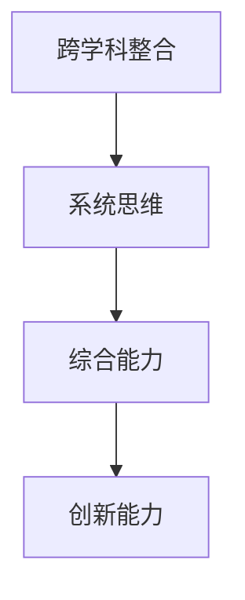
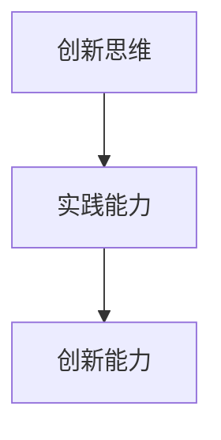
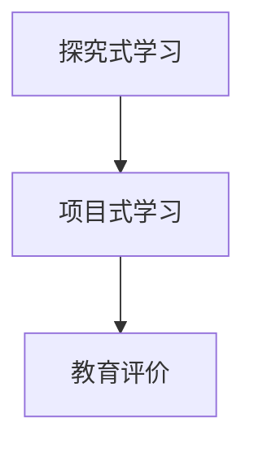
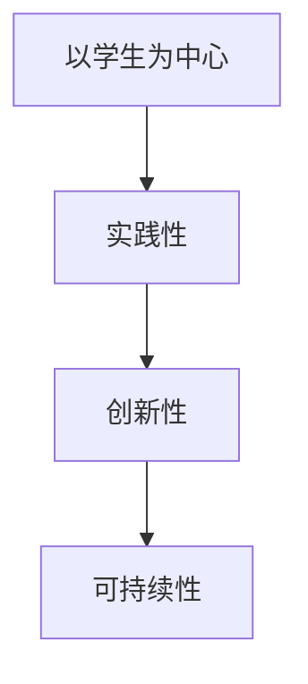
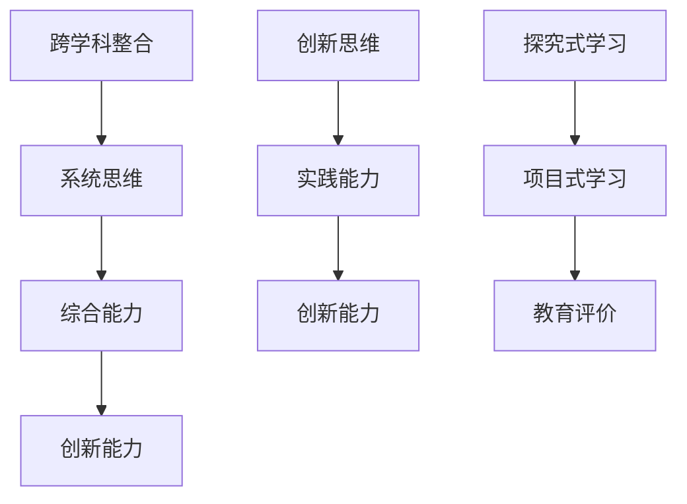

                 

### 《科学教育改革：培养下一代的世界理解能力》

#### 关键词：科学教育改革、下一代、世界理解能力、教学方法、信息技术、数据分析

#### 摘要：本文探讨了当前科学教育面临的挑战和改革的必要性，提出了培养下一代世界理解能力的方法和策略。文章首先介绍了科学教育改革的历史背景和现状，分析了传统教育模式的局限。随后，文章阐述了科学教育改革的核心概念和理论框架，包括跨学科整合、创新思维与实践能力培养等。接着，文章通过具体的教学案例和数学模型，详细讲解了物理、化学、生物等学科的教学方法，并探讨了信息技术在科学教育改革中的应用。最后，文章对教育改革的评估与反馈机制进行了探讨，并提出了技术支持的策略和方法。

---

## 引言

在现代社会，科学教育的重要性日益凸显。科学不仅仅是学科知识的传授，更是培养下一代世界观和思维方式的重要途径。科学教育的改革不仅关系到学生个人的发展，也关乎国家的未来和社会的进步。然而，当前的科学教育体系仍然存在许多问题，如教学内容陈旧、教学方法单一、学生缺乏实践机会等。这些问题严重制约了学生世界理解能力的培养，影响了科学教育的整体质量。

为了应对这些挑战，科学教育改革势在必行。本文旨在探讨科学教育改革的必要性，提出培养下一代世界理解能力的方法和策略。文章将从以下几个方面展开：

1. **科学教育改革的历史背景和现状**：介绍科学教育改革的发展历程，分析传统教育模式的局限。
2. **科学教育改革的核心概念和理论框架**：阐述跨学科整合、创新思维与实践能力培养等核心概念，建立科学教育改革的理论框架。
3. **科学科目的教学方法**：详细讲解物理、化学、生物等学科的教学方法，探讨如何通过教学策略提高学生的世界理解能力。
4. **信息技术在科学教育改革中的应用**：分析信息技术对科学教育改革的推动作用，探讨如何利用信息技术提高教学效果。
5. **教育改革的评估与反馈机制**：讨论教育改革的评估方法，建立有效的反馈机制，以持续改进科学教育。
6. **教育改革的技术支持**：介绍教育改革中信息技术和数据驱动的策略，探讨如何利用大数据和人工智能技术支持科学教育改革。

通过上述探讨，本文希望能够为科学教育改革提供一些有益的思路和实践指导，为培养下一代的世界理解能力贡献力量。

### 科学教育改革的历史背景和现状

科学教育改革的历史可以追溯到20世纪中叶。当时，全球范围内科学技术的迅猛发展对教育体系提出了新的要求。传统的教育模式以知识传授为主，注重记忆和应试，忽视了学生的实践能力和创新思维的培养。为了适应时代的需求，各国纷纷开始进行科学教育的改革。

#### 1. 传统教育模式的局限

传统的教育模式存在以下几方面的局限：

- **教学内容陈旧**：科学知识更新迅速，但许多课程内容仍然停留在几十年前的水平，无法反映最新的科研成果和技术进步。

- **教学方法单一**：传统的教学方法主要依赖于课堂讲授和教材，缺乏互动性和实践性，难以激发学生的学习兴趣和创造力。

- **学生缺乏实践机会**：科学教育重视理论知识的传授，而忽视了实践操作和实验活动，导致学生难以将所学知识应用于实际问题。

- **忽视跨学科整合**：科学教育往往将不同学科分割开来，缺乏跨学科整合，导致学生难以形成系统的世界观。

- **评价方式单一**：传统的考试和评分制度主要关注学生的记忆和应试能力，而忽视了学生的实际能力和综合素质。

#### 2. 科学教育改革的发展历程

科学教育改革的发展历程大致可以分为以下几个阶段：

- **初期改革（20世纪中叶至70年代）**：这一阶段的主要目标是引入新的教学方法和课程内容，如探究式学习、项目式学习等，以培养学生的实践能力和创新思维。

- **深化改革（80年代至90年代）**：随着全球科学技术的快速发展，科学教育改革进一步深化。各国开始重视跨学科整合和综合能力的培养，推动课程内容和教学方法的创新。

- **现代化改革（21世纪初至今）**：随着信息技术的迅猛发展，科学教育改革进入了一个新的阶段。信息技术成为科学教育改革的重要工具，在线教育、虚拟实验等新兴教学手段不断涌现，为科学教育改革提供了新的契机。

#### 3. 国内外科学教育改革现状

在国内外，许多国家和地区都进行了科学教育改革，并取得了显著成效：

- **美国**：美国在科学教育改革中强调探究式学习和项目式学习，注重培养学生的实践能力和创新思维。同时，美国还大力推进STEM教育，通过跨学科整合，培养学生的科学素养。

- **英国**：英国在科学教育改革中注重培养学生的批判性思维和问题解决能力，引入了“学校科学”课程，强调科学教育的实践性和应用性。

- **中国**：中国在科学教育改革中积极推进课程改革和教学方法创新，强调培养学生的实践能力和创新能力。近年来，中国还大力推广STEM教育，通过跨学科整合，提高学生的综合素质。

### 科学教育改革的趋势与挑战

#### 1. 科学教育改革的趋势

科学教育改革呈现以下几大趋势：

- **跨学科整合**：科学教育越来越重视跨学科整合，通过将不同学科的知识和技能结合，培养学生的系统思维和综合能力。

- **实践能力培养**：科学教育更加注重实践能力的培养，通过实验、项目等实践活动，提高学生的动手能力和创新能力。

- **创新思维培养**：科学教育注重培养学生的创新思维和问题解决能力，通过开放性的问题和挑战，激发学生的创造力和想象力。

- **信息技术应用**：信息技术成为科学教育改革的重要工具，在线教育、虚拟实验等新兴教学手段不断涌现，为科学教育提供了新的途径。

- **个性化学习**：科学教育更加注重个性化学习，通过数据分析和学习诊断，为每个学生提供合适的学习路径和资源。

#### 2. 科学教育改革的挑战

科学教育改革面临着以下几大挑战：

- **教师培训不足**：科学教育改革要求教师具备新的教学理念和方法，但许多教师缺乏相关培训，难以适应改革的要求。

- **课程内容更新滞后**：科学知识更新迅速，但课程内容的更新往往滞后，难以反映最新的科研成果和技术进步。

- **教育资源不均衡**：不同地区和学校之间的教育资源分配不均衡，一些学校缺乏必要的实验设备和教学资源，制约了科学教育改革的推进。

- **评价体系不完善**：科学教育改革需要建立新的评价体系，但当前的评价体系仍以应试为主，难以全面反映学生的综合素质和能力。

- **家庭和社会支持**：科学教育改革需要家庭和社会的支持，但家长和社会对科学教育改革的认知和参与度不高，影响了改革的效果。

### 总结

科学教育改革是应对现代社会发展需求的重要举措，具有重要的现实意义。通过分析科学教育改革的历史背景和现状，我们可以看到改革已经取得了显著成效，但仍面临许多挑战。科学教育改革需要全社会的共同努力，通过跨学科整合、实践能力培养、创新思维培养、信息技术应用和个性化学习等手段，培养下一代的世界理解能力。只有这样，才能为国家的未来和社会的进步提供有力的人才支持。

---

### 科学教育改革的核心概念和理论框架

科学教育改革的核心概念和理论框架是推动教育变革的重要基石。本文将从跨学科整合、创新思维与实践能力培养等方面进行详细阐述，为科学教育改革提供理论支持。

#### 1. 跨学科整合

跨学科整合是科学教育改革的重要理念，旨在打破传统学科壁垒，通过跨学科的方式培养学生的系统思维和综合能力。

**核心概念与联系：**

- **系统思维**：跨学科整合强调将不同学科的知识和技能结合起来，形成系统的思维方式，从而培养学生的综合能力和创新能力。

- **综合能力**：跨学科整合通过综合不同学科的知识，使学生在面对复杂问题时能够运用多种方法和思维方式，提高解决问题的能力。

- **创新能力**：跨学科整合提供了一种新的学习和思考方式，鼓励学生打破常规，创新思维，培养创新能力。

**Mermaid 流程图：**

#### 2. 创新思维与实践能力培养

创新思维和实践能力是科学教育改革的重要目标，旨在培养学生的创造力和实际操作能力。

**核心概念与联系：**

- **创新思维**：创新思维是指学生在面对问题时，能够灵活运用各种方法和思维方式，寻找新的解决方案。

- **实践能力**：实践能力是指学生在实际操作中运用所学知识解决问题的能力，包括实验操作、项目实施等。

- **创新能力**：创新思维和实践能力的结合，能够培养学生的创新能力，使其在未来的职业生涯中具备竞争力。

**Mermaid 流程图：**

#### 3. 科学教育改革的理论框架

科学教育改革的理论框架包括多种教育理论和方法，如探究式学习、项目式学习等。这些理论和方法为科学教育改革提供了具体的实践指导。

**核心概念与联系：**

- **探究式学习**：探究式学习是一种以学生为中心的教学方法，鼓励学生通过自主探究和合作学习，发现和理解科学知识。

- **项目式学习**：项目式学习是一种通过完成实际项目来学习知识和技能的教学方法，强调学生的实践操作和问题解决能力。

- **教育评价**：教育评价是科学教育改革的重要组成部分，通过评价学生的发展状况，及时反馈和调整教学策略。

**Mermaid 流�程图：**

#### 4. 核心原则

科学教育改革需要遵循以下核心原则：

- **以学生为中心**：科学教育改革应注重学生的个体差异和需求，通过个性化的教学策略，使每个学生都能得到充分的发展。

- **实践性**：科学教育改革强调学生的实践操作和实际应用，通过实验、项目等实践活动，提高学生的实践能力和创新能力。

- **创新性**：科学教育改革鼓励创新思维和实践，通过新的教学方法和课程内容，培养学生的创造力和创新能力。

- **可持续性**：科学教育改革应注重长期效果和可持续发展，通过持续的评估和反馈，不断优化和改进教学策略。

**Mermaid 流程图：**

通过上述核心概念和理论框架的阐述，我们可以看到科学教育改革的重要性。跨学科整合、创新思维与实践能力培养等核心概念构成了科学教育改革的理论基础，为科学教育改革提供了明确的指导方向。科学教育改革需要全社会共同努力，通过创新的教学方法和课程内容，培养下一代的世界理解能力，为国家的未来和社会的进步贡献力量。

### 核心概念与联系 Mermaid 流程图

以下是科学教育改革中的核心概念与联系 Mermaid 流程图：

### 科学科目的教学方法

科学教育的目的是通过传授科学知识，培养学生的科学素养和思维能力。为了实现这一目标，科学科目的教学方法需要不断创新和优化。本文将结合具体的教学案例，详细讲解物理、化学、生物等学科的教学方法，探讨如何通过教学策略提高学生的世界理解能力。

#### 1. 物理学科的教学方法

**物理学科的教学方法**

- **探究式教学**：探究式教学强调学生在学习过程中的主动性和参与度，通过提出问题和解决问题，激发学生的兴趣和思考。例如，在讲解牛顿定律时，可以让学生通过实验验证力的作用和运动的关系。

- **项目式学习**：项目式学习是一种以项目为导向的学习方式，通过完成实际项目，培养学生的实践能力和创新能力。例如，可以让学生设计和制作简易电动机，理解电流和磁场的关系。

- **虚拟实验**：虚拟实验是一种利用计算机技术模拟实验过程的教学手段，可以减少实验操作的复杂性和成本。例如，利用虚拟实验室可以模拟光在不同介质中的传播过程，帮助学生理解光学原理。

**教学案例：**

- **案例一：探究静电现象**  
  在讲解静电现象时，可以让学生通过实验观察静电的产生和作用。首先，让学生使用毛皮摩擦橡胶棒，然后观察橡胶棒吸引碎纸片的实验现象，从而引导学生理解电荷的概念和电荷间的相互作用。

- **案例二：设计简易电动机**  
  让学生分组设计并制作简易电动机，通过实验验证电动机的工作原理和性能。在制作过程中，学生需要了解电路、磁性和能量转换等基本知识，从而提高实践能力和创新能力。

#### 2. 化学科的教学方法

**化学科的教学方法**

- **探究式教学**：化学科的教学方法同样强调探究式教学，通过提出问题和解决问题，培养学生的科学思维和创新能力。例如，在讲解化学反应时，可以让学生通过实验观察反应的现象和结果，理解反应的原理。

- **项目式学习**：项目式学习在化学科中也有广泛应用，通过完成实际项目，培养学生的实践能力和团队合作精神。例如，可以让学生设计并完成一个小型实验项目，如自制氧气发生器。

- **实验探究**：实验探究是化学科的重要教学方法，通过亲自动手实验，学生可以更直观地理解化学原理和现象。例如，在讲解酸碱中和反应时，可以让学生通过实验观察反应过程中的颜色变化和温度变化。

**教学案例：**

- **案例一：酸碱中和反应实验**  
  在讲解酸碱中和反应时，可以让学生进行实验，观察反应过程中的颜色变化和温度变化。通过实验，学生可以直观地理解酸碱中和反应的原理和过程。

- **案例二：自制氧气发生器**  
  让学生分组设计并制作氧气发生器，通过实验验证氧气的生成和纯度。在制作过程中，学生需要了解化学物质的性质和反应条件，从而提高实践能力和团队合作精神。

#### 3. 生物学科的教学方法

**生物学科的教学方法**

- **探究式教学**：生物学科的教学方法同样强调探究式教学，通过提出问题和解决问题，培养学生的科学思维和创新能力。例如，在讲解细胞结构时，可以让学生通过显微镜观察细胞结构，理解细胞的基本组成和功能。

- **项目式学习**：项目式学习在生物学科中也有广泛应用，通过完成实际项目，培养学生的实践能力和团队合作精神。例如，可以让学生设计并完成一个小型生态系统的构建项目。

- **实验探究**：实验探究是生物学科的重要教学方法，通过亲自动手实验，学生可以更直观地理解生物原理和现象。例如，在讲解植物生长过程时，可以让学生进行植物生长实验，观察植物在不同条件下的生长情况。

**教学案例：**

- **案例一：细胞结构观察实验**  
  在讲解细胞结构时，可以让学生通过显微镜观察细胞结构，理解细胞的基本组成和功能。通过实验，学生可以直观地了解细胞的结构和功能，从而提高科学素养。

- **案例二：植物生长实验**  
  让学生设计并完成植物生长实验，观察植物在不同条件下的生长情况。通过实验，学生可以理解植物生长的基本原理和条件，从而提高实践能力和科学思维能力。

#### 4. 教学策略与方法

为了提高学生的世界理解能力，科学科目教学中可以采用以下教学策略和方法：

- **问题导向教学**：通过提出问题和解决问题，激发学生的思考和探究兴趣，培养学生的科学思维。

- **合作学习**：鼓励学生进行小组合作学习，通过讨论和交流，培养学生的团队合作精神和沟通能力。

- **多样化教学手段**：结合多种教学手段，如实验、项目、虚拟实验等，提高教学效果。

- **反馈与评价**：及时给予学生反馈和评价，帮助学生了解自己的学习进展，调整学习方法。

- **跨学科整合**：将不同学科的知识和技能结合起来，培养学生的系统思维和综合能力。

### 总结

科学科目的教学方法是培养下一代世界理解能力的重要途径。通过探究式教学、项目式学习、实验探究等教学方法，教师可以激发学生的兴趣和思考，提高他们的科学素养和创新能力。同时，多样化的教学策略和方法有助于培养学生的系统思维和综合能力，为他们的未来发展奠定坚实基础。

---

### 信息技术在科学教育改革中的应用

随着信息技术的迅猛发展，科学教育改革迎来了新的机遇。信息技术不仅为科学教育提供了丰富的教学资源和工具，还为教学模式和方法带来了深刻的变革。本文将探讨信息技术在科学教育改革中的应用，分析其优势和挑战，并提出具体的应用策略。

#### 1. 信息技术在科学教育改革中的优势

**在线教育平台**

- **资源共享**：在线教育平台可以汇集全球的优秀教学资源，教师和学生可以随时随地访问和共享这些资源，打破了地域和时间的限制。
- **个性化学习**：在线教育平台可以根据学生的学习进度和能力，提供个性化的学习建议和资源，提高学习效果。
- **互动交流**：在线教育平台提供了丰富的交流工具，如论坛、聊天室、视频会议等，促进了师生之间的互动和沟通。

**虚拟实验**

- **低成本**：虚拟实验通过计算机模拟实验过程，可以大大降低实验成本，特别是在一些昂贵的实验设备和材料方面。
- **安全性高**：虚拟实验避免了实际实验中可能出现的危险和污染，提高了实验的安全性。
- **可重复性**：虚拟实验可以重复进行，帮助学生深入理解和掌握实验原理。

**大数据分析**

- **个性化教育**：大数据分析可以对学生学习行为进行分析，发现学生的学习规律和问题，为个性化教育提供依据。
- **教育评估**：大数据分析可以实时跟踪学生的学习进展，为教育评估提供科学依据，帮助教师及时调整教学策略。

**人工智能**

- **智能辅导**：人工智能可以为学生提供智能化的辅导服务，解答学生的疑问，提供个性化的学习建议。
- **自适应学习**：人工智能可以根据学生的学习行为和反馈，调整教学内容和难度，实现自适应学习。

#### 2. 信息技术在科学教育改革中的挑战

**技术依赖**

- **教育公平性**：信息技术的发展可能导致教育资源的分配不均，一些经济条件较差的地区和学校可能难以获得先进的技术设备和资源，影响教育的公平性。
- **教师技能**：科学教育改革要求教师具备较高的信息技术素养，但许多教师可能缺乏相关的培训和技术支持，难以适应改革的要求。

**数据安全**

- **隐私保护**：在大数据环境下，学生的个人信息和学习数据容易泄露，需要建立完善的数据安全保护机制。
- **信息安全**：网络环境中的信息安全问题不容忽视，需要采取有效的措施防止网络攻击和数据泄露。

**学习效果**

- **学生依赖**：过度依赖信息技术可能导致学生忽视实际操作和实践能力培养，影响学习效果。
- **教学质量**：信息技术的应用需要教师具备相应的教学设计和实施能力，否则可能导致教学质量下降。

#### 3. 信息技术在科学教育改革中的应用策略

**提高教师信息技术素养**

- **培训与学习**：为教师提供定期的信息技术培训，帮助他们掌握基本的信息技术工具和教学技能。
- **实践与交流**：鼓励教师进行信息技术教学实践，并通过交流分享经验，提高整体教学水平。

**加强网络安全与管理**

- **完善法律法规**：建立完善的数据安全法律法规，保护学生和教师的个人信息安全。
- **技术防护**：采取有效的技术措施，如防火墙、数据加密等，提高网络安全水平。

**优化教学设计和实施**

- **结合线上线下**：将线上线下教学相结合，发挥信息技术和传统教学的优势，提高教学效果。
- **注重实践与操作**：在信息技术应用中，注重学生的实际操作和实践能力培养，避免过度依赖虚拟实验。

**推动教育公平**

- **资源共享**：推动优质教育资源的共享，确保所有学生都能获得公平的教育机会。
- **政策支持**：政府应加大对教育技术的投入，特别是对经济条件较差的地区和学校的支持。

### 总结

信息技术在科学教育改革中具有巨大的潜力，但同时也面临一系列挑战。通过提高教师信息技术素养、加强网络安全与管理、优化教学设计和实施以及推动教育公平等措施，可以有效应对这些挑战，充分发挥信息技术在科学教育改革中的作用。信息技术不仅为科学教育提供了新的工具和方法，也为培养学生的世界理解能力提供了有力支持。

### 教育改革的评估与反馈机制

科学教育改革的成功离不开有效的评估与反馈机制。评估与反馈是教育改革过程中不可或缺的环节，它们不仅能够衡量教育改革的成效，还能够为教育决策提供依据，指导进一步的改革方向。本文将探讨教育改革的评估方法，介绍建立有效的反馈机制的重要性，并讨论如何通过反馈机制实现教育改革的持续改进。

#### 1. 教育改革的评估方法

**学生发展评估**

- **学业成就评估**：通过考试、测验等传统方式评估学生的知识掌握程度和学术能力。这类评估能够直观地反映学生在特定学科领域的学习成果。
- **综合素质评估**：除了学术成绩，还关注学生的创新思维、问题解决能力、团队合作精神等综合素质。这类评估更能全面反映学生的整体发展水平。

**教学过程评估**

- **课堂观察**：通过观察教师的授课方式和学生的课堂表现，评估教学过程的 effectiveness 和 interaction。
- **学生学习行为分析**：利用数据分析工具分析学生的学习行为，如在线学习平台的使用情况、课堂互动情况等，评估教学效果。

**教育环境评估**

- **资源配备评估**：评估学校的教学设施、图书资源、实验室设备等硬件条件，以及网络、软件等软件资源的配置情况。
- **教学环境评估**：评估学校的教学环境，如教室布置、教学氛围等，对教学过程产生影响的软环境。

#### 2. 建立有效的反馈机制的重要性

**及时发现问题**

有效的反馈机制能够及时发现教育改革过程中存在的问题，如教学内容的不当、教学方法的无效等，为教育决策者提供及时的反馈。

**指导教学改进**

通过评估和反馈，教师可以了解自己的教学效果，发现自身的不足，从而调整教学策略和方法，提高教学质量。

**促进学生发展**

有效的反馈机制能够帮助学生明确自己的学习状况，发现自身的优势和不足，从而制定合适的学习计划，促进个人的全面发展。

**优化教育资源配置**

反馈机制可以为教育决策者提供详细的评估数据，帮助他们了解教育资源的利用情况，优化教育资源配置，提高教育资源的利用效率。

#### 3. 如何通过反馈机制实现教育改革的持续改进

**建立多层次的评估体系**

- **学校层面评估**：学校应建立定期的评估机制，对整个教育改革过程进行全面的评估和反馈。
- **教师层面评估**：教师应积极参与评估活动，通过自评和互评，发现和改进教学中的问题。
- **学生层面评估**：学生应参与评估活动，通过反馈机制表达自己的学习感受和建议，促进教学改进。

**运用数据分析工具**

- **学习数据分析**：利用数据分析工具对学生的学习行为和成绩进行深入分析，发现潜在问题，为教学改进提供数据支持。
- **教学质量分析**：通过教学质量分析，了解教学过程中的关键环节和薄弱点，为教学策略调整提供依据。

**建立反馈与改进机制**

- **定期反馈**：建立定期的反馈机制，确保教育改革过程中的问题能够及时发现和解决。
- **持续改进**：将反馈结果纳入教学改进计划，持续优化教学方法和内容，提高教学质量。

**加强教师培训**

- **信息技术培训**：为教师提供信息技术培训，帮助他们掌握现代教育技术，提高教学质量。
- **教育理论培训**：为教师提供教育理论培训，帮助他们了解最新的教育改革理论和实践，指导教学改进。

**推广优秀教学经验**

- **经验分享**：通过教育评估和反馈，推广优秀的教学经验和成功案例，促进教学方法的交流和改进。
- **示范教学**：组织示范教学活动，让教师互相学习和借鉴，提高整体教学水平。

### 总结

教育改革的评估与反馈机制是科学教育改革的重要组成部分。通过建立多层次的评估体系、运用数据分析工具、建立反馈与改进机制以及加强教师培训等措施，可以有效评估教育改革的成效，发现和解决问题，实现教育改革的持续改进。有效的评估与反馈机制不仅能够提高教学质量，还能够促进学生的全面发展，为培养下一代的世界理解能力提供坚实保障。

### 教育改革的技术支持

在科学教育改革中，技术的应用不仅改变了教学模式，还提升了教育质量和效果。本文将介绍教育改革的技术支持，包括信息技术在教育中的应用、大数据在教育改革中的作用以及人工智能在个性化学习中的应用。

#### 1. 信息技术在教育中的应用

**在线教育平台**

- **资源共享**：在线教育平台如Moodle、Canvas等，提供了丰富的教学资源，教师和学生可以随时随地访问课程材料、视频讲座和互动讨论。
- **个性化学习**：通过学习管理系统（LMS），学生可以根据自己的学习进度和能力，选择适合自己的学习内容和方式，实现个性化学习。

**虚拟实验室**

- **低成本实验**：虚拟实验室通过计算机模拟实验，降低了实验成本，使学生能够在安全的环境中亲身体验科学实验过程。
- **远程实验**：虚拟实验室支持远程实验操作，使学生能够参与跨地域的实验项目，拓宽了实验的广度和深度。

**互动教学工具**

- **教学互动**：互动教学工具如Quizlet、Socrative等，可以实时评估学生的学习情况，增加课堂互动，提高学生的学习兴趣。

#### 2. 大数据在教育改革中的作用

**学生行为分析**

- **学习路径分析**：通过分析学生的学习行为数据，可以了解学生的学习偏好、难点和进步情况，为教学策略的调整提供依据。
- **学习效果评估**：利用大数据分析学习效果，可以实时监测学生的学习成果，评估教学质量和效果。

**教育资源优化**

- **资源推荐**：基于大数据分析，可以为学生推荐适合他们的学习资源，提高学习效率。
- **课程设计**：通过分析学生的学习数据，教师可以优化课程设计，提高课程的针对性和实用性。

#### 3. 人工智能在个性化学习中的应用

**自适应学习系统**

- **个性化学习计划**：人工智能可以为学生生成个性化的学习计划，根据学生的学习进度和能力，动态调整学习内容和难度。
- **实时反馈**：自适应学习系统可以实时提供学习反馈，帮助学生及时发现并解决问题。

**智能辅导系统**

- **个性化辅导**：智能辅导系统可以根据学生的学习情况和问题，提供个性化的辅导建议，提高学习效果。
- **自动评分**：智能辅导系统可以自动评分，节省教师的工作量，提高评分的准确性。

**个性化推荐**

- **学习资源推荐**：基于学生的学习兴趣和成绩，人工智能可以推荐适合的学习资源，帮助学生拓展知识领域。

#### 4. 教育改革的技术支持策略

**技术整合**

- **线上线下融合**：整合线上线下教学资源，实现教学内容的无缝衔接，提高教学效果。
- **多平台应用**：利用多种技术平台，如在线教育平台、虚拟实验室、大数据分析系统等，构建全方位的技术支持体系。

**教师培训**

- **技术培训**：为教师提供定期的信息技术培训，帮助他们掌握现代教育技术，提高教学质量。
- **教学设计培训**：为教师提供教学设计培训，帮助他们利用技术手段优化教学方法和内容。

**数据安全**

- **隐私保护**：建立完善的数据安全机制，保护学生和教师的个人信息安全。
- **数据加密**：采用数据加密技术，确保数据在传输和存储过程中的安全性。

**持续改进**

- **技术更新**：紧跟技术发展，不断更新和优化教育技术支持体系，保持技术的先进性和实用性。
- **评估与反馈**：定期评估技术支持的效果，收集教师和学生的反馈，不断改进技术支持策略。

### 总结

教育改革的技术支持是推动科学教育改革的重要力量。通过信息技术、大数据和人工智能的应用，可以实现教学资源的优化、学习方式的个性化以及教学质量的提升。教育改革的技术支持策略应注重技术的整合、教师的培训、数据的安全以及持续改进，为培养下一代的世界理解能力提供坚实的保障。

### 案例研究

在本节中，我们将通过具体的教育改革案例，详细分析国内外成功的科学教育改革实践，探讨这些案例中的核心策略和方法，以及其对培养下一代世界理解能力的实际效果。

#### 案例一：美国STEM教育改革

**背景介绍**

STEM教育改革起源于美国，旨在培养学生的科学（Science）、技术（Technology）、工程（Engineering）和数学（Mathematics）综合素养。该改革强调跨学科整合、项目式学习和实践能力培养。

**核心策略**

1. **课程整合**：通过跨学科课程设计，将STEM知识有机地融合在一起，培养学生的系统思维和综合能力。
2. **项目式学习**：鼓励学生通过实际项目来学习，如机器人制作、编程挑战等，提高学生的实践能力和创新能力。
3. **科技与社会的结合**：通过科技与社会问题的结合，引导学生关注社会问题，培养其解决实际问题的能力。

**实际效果**

- **学生综合素养提升**：通过STEM教育，学生的科学素养、技术能力和工程思维得到了显著提升。
- **创新能力增强**：项目式学习和跨学科整合促进了学生的创新思维和问题解决能力的培养。
- **兴趣和动机提高**：STEM教育激发了学生对科学和技术的兴趣，增强了学习的动机。

#### 案例二：中国STEM教育改革

**背景介绍**

中国的STEM教育改革始于21世纪初，近年来随着国家对创新人才的培养需求不断增加，STEM教育改革逐渐深入。

**核心策略**

1. **课程改革**：通过更新课程内容和教学方法，将科学、技术、工程和数学融入课程设计，提高学生的实践操作能力和创新能力。
2. **师资培训**：加强对教师的STEM教育培训，提升教师的教学能力和素养。
3. **教育资源共享**：利用互联网和信息技术，推动优质教育资源的共享，提高教育公平性。

**实际效果**

- **教育公平性提升**：通过教育资源共享，偏远地区的学生也能够接触到优质的STEM教育，缩小了城乡教育差距。
- **创新能力培养**：课程改革和项目式学习使学生的创新能力和实践操作能力得到了显著提升。
- **教学质量的提高**：教师通过培训，掌握了先进的STEM教学方法和理念，教学效果得到显著改善。

#### 案例三：芬兰教育改革

**背景介绍**

芬兰的教育改革以其创新性和高质量而闻名，其核心策略包括学生中心教育、个性化学习和综合素质培养。

**核心策略**

1. **学生中心教育**：注重学生的个性化发展，尊重学生的兴趣和选择，培养学生的自主学习能力和责任感。
2. **个性化学习**：通过个性化学习计划，根据学生的不同需求和兴趣，提供个性化的学习路径和资源。
3. **综合素质培养**：通过跨学科项目和实践活动，培养学生的综合素质，如团队合作、沟通能力和创新思维。

**实际效果**

- **学生全面发展**：芬兰教育改革使学生不仅掌握了扎实的学科知识，还培养了广泛的综合素质。
- **教育公平性提升**：个性化学习计划确保了每个学生都能得到适合自己的教育，提高了教育公平性。
- **国际竞争力增强**：芬兰学生在国际教育评估中表现优异，显示了教育改革的成功。

### 总结

通过上述案例研究，我们可以看到，国内外科学教育改革在实践中取得了显著成效。这些成功的教育改革案例共同强调了跨学科整合、项目式学习、个性化学习和综合素质培养的重要性。通过改革，学生的世界理解能力得到了显著提升，为培养未来的人才奠定了坚实基础。这些案例为我们提供了宝贵的经验和启示，值得在科学教育改革中推广和应用。

### 总结与未来展望

科学教育改革是一项系统工程，涉及教育理念、教学方法、课程内容和技术支持等多个方面。本文系统地探讨了科学教育改革的必要性、核心概念和理论框架、具体学科教学方法、信息技术应用、评估与反馈机制以及技术支持。以下是全文的总结及对未来的展望：

#### 总结

1. **科学教育改革的必要性**：当前科学教育体系存在教学内容陈旧、教学方法单一、学生缺乏实践机会等问题，严重制约了学生的世界理解能力的培养。科学教育改革旨在培养具有综合素质和创新能力的下一代。

2. **核心概念与理论框架**：跨学科整合、创新思维与实践能力培养是科学教育改革的核心概念。这些概念通过理论框架为科学教育改革提供了指导方向。

3. **具体学科教学方法**：物理、化学、生物等学科通过探究式教学、项目式学习和虚拟实验等教学方法，有效地提高了学生的世界理解能力。

4. **信息技术应用**：在线教育平台、虚拟实验室、大数据分析和人工智能等技术在科学教育改革中发挥了重要作用，推动了教育模式的创新。

5. **评估与反馈机制**：建立多层次的评估体系，通过数据分析和反馈机制，实现教育改革的持续改进。

6. **技术支持**：信息技术和教育技术的整合为科学教育改革提供了强有力的支持，促进了教育资源的优化和教育质量的提升。

#### 未来展望

1. **跨学科整合的深化**：未来科学教育改革将进一步深化跨学科整合，通过跨学科课程设计和项目，培养学生的系统思维和综合能力。

2. **创新思维与实践能力的培养**：将创新思维与实践能力培养贯穿于教育教学全过程，通过多样化的实践活动，提高学生的创新能力。

3. **个性化学习的普及**：随着信息技术的发展，个性化学习将得到更广泛的推广，通过大数据分析和人工智能技术，实现个性化教学和学习路径的优化。

4. **信息技术与教育融合**：信息技术将继续深度融入科学教育，推动教育技术的创新和应用，提升科学教育的质量和效果。

5. **教育公平的实现**：通过资源共享和信息技术支持，缩小城乡、区域之间的教育差距，实现教育公平。

6. **教育评估与反馈的智能化**：利用大数据和人工智能技术，建立智能化的教育评估和反馈系统，实时监控教育改革的效果，提供科学的决策支持。

### 结论

科学教育改革是一项长期而复杂的任务，需要政府、教育机构和全社会的共同努力。通过持续的创新和实践，科学教育改革将为培养具有世界理解能力的下一代提供有力支持，为国家的未来和社会的进步奠定坚实基础。

### 拓展阅读

1. Brown, A. L. (2014). *Make Just One Change: Teach Student-Centered Classrooms*. Corwin.
2. Stierer, B. (2004). *Research on cooperative learning and student-centered instruction*. Theory into Practice, 43(2), 121-128.
3. Siemens, G. (2014). *Connectivism: A learning theory for the digital age*.教育出版社。
4. Dillenbourg, P., & Jermann, P. (2010). *The Impact of Technology on Social Interactions in Education*. Springer.
5. Zhao, Y., & Frank, K. A. (2018). *Learning with technology: Using blogs, wikis, podcasts, and other resources for student research and literacy development*. Stenhouse Publishers.
6. Bransford, J. D., & Schwartz, D. L. (1999). *Rethinking curriculum goals for postmodern times: Initial thoughts and more*. In A.ctest, J. D. Bransford, & R. A. Maclean (Eds.), How People Learn: Bridging Research and Practice (pp. 37-53). National Academy Press.
7. Krajcik, J. S., & Blumenfeld, P. C. (2006). *Project-based learning*. In K. A. Renninger, S. H. Hidi, & A. S. Krapp (Eds.), The Role of Interest in Learning and Development: A Bioecological Perspective (pp. 249-269). Lawrence Erlbaum Associates.

通过阅读上述文献，读者可以深入了解科学教育改革的最新理论和实践，获得更多关于教学策略、评估方法和技术支持的宝贵知识。这些资源将为教育工作者提供实用的指导，助力科学教育改革的深入推进。

