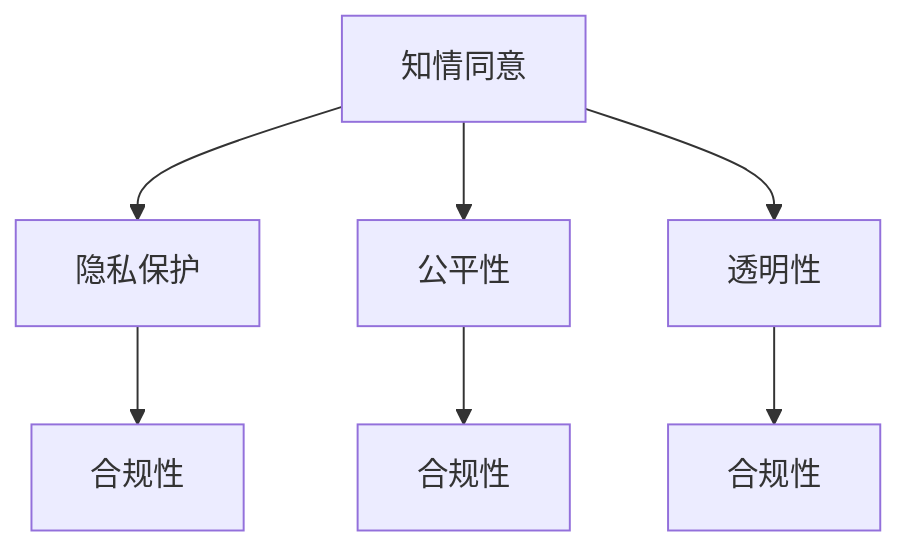

                 

### 引言与基础理论

科学研究作为探索世界真理的重要途径，不仅需要科学方法的严谨，更需要伦理框架的指引。在科技飞速发展的今天，科研伦理的重要性愈发突出。本文旨在探讨科学研究的伦理框架，为科研工作者提供道德指引，确保在探索世界真理的过程中，我们能够坚持科学精神与人文关怀的结合。

科学研究中的伦理问题复杂多样，涉及知情同意、隐私保护、动物实验、人体试验等诸多方面。这些问题不仅关系到科研活动的合法性和有效性，更关乎人类社会的公平与正义。因此，构建一个全面、系统的伦理框架，对于保障科学研究的高效、有序进行具有重要意义。

本文将按照以下结构展开：

1. **科学研究的伦理背景**：介绍科学研究伦理的重要性，分析科学研究伦理的历史发展与现状。
2. **伦理原则与科学方法**：阐述科学研究伦理原则，并解释这些原则如何与科学方法相结合。
3. **伦理问题分析**：详细探讨知情同意、隐私保护、动物实验和人体试验等伦理问题。
4. **伦理框架构建与应用**：介绍伦理框架的设计原则、决策过程及其在不同领域的应用。
5. **伦理框架的挑战与未来**：分析伦理框架面临的挑战，并展望未来的发展方向。

通过本文的探讨，我们希望能够为科学研究伦理的实践提供一些有益的思考，引导科研工作者在探索世界真理的同时，始终保持道德的底线和科学的理性。

## 第1章: 科学研究的伦理重要性

### 1.1 科学研究的伦理重要性

科学研究作为推动社会进步和人类文明发展的重要力量，其伦理重要性不容忽视。伦理，即道德规范，它不仅规范着科研工作者的行为，更关系到科研活动的合法性、公正性和有效性。具体来说，科学研究的伦理重要性体现在以下几个方面：

首先，伦理规范保障了科研活动的合法性。科学研究需要遵循一系列法律法规和伦理标准，如《世界医学协会赫尔辛基宣言》、《生物多样性公约》等。这些法律法规和标准不仅为科研活动提供了法律保障，还确保了科研过程中的公正、透明和合规。如果缺乏伦理规范，科研活动可能会因违法行为而受到质疑和制裁，严重时甚至可能导致项目终止。

其次，伦理规范是确保科研成果公正性的基石。科学研究的过程往往涉及到大量资源的投入，包括资金、人力和时间等。伦理规范要求科研工作者在资源分配、数据共享、成果归属等方面保持公正，防止利益冲突和数据造假等现象的发生。只有在一个公平公正的环境中，科研成果才能真正反映科学事实，为社会发展和人类福祉作出贡献。

再次，伦理规范关注科研活动对人类和环境的潜在影响。科学研究不仅关注成果的创新性和实用性，更需考虑其可能带来的风险和负面影响。伦理规范要求科研工作者在实验设计、数据收集、结果分析等各个环节中，最大限度地减少对参与者、环境和公共利益的损害。例如，在涉及人类参与者的实验中，必须确保知情同意和隐私保护；在生物技术研究中，需关注基因编辑、克隆技术等带来的伦理挑战。

最后，伦理规范有助于维护科研工作的信誉和公众信任。科学研究是一项长期而复杂的任务，需要社会各界的支持和信任。伦理规范要求科研工作者保持诚信，抵制学术不端行为，如抄袭、造假、篡改数据等。只有这样，科研工作者的信誉才能得到保障，科研成果才能被广泛接受和认可。

总之，科学研究伦理的重要性在于其不仅规范了科研工作的行为，更关乎科学事业的健康发展和社会进步。在一个道德高尚、公正透明的科研环境中，我们才能更好地探索世界真理，为人类社会的繁荣和进步贡献力量。

### 1.2 科学研究伦理的历史发展与现状

科学研究伦理的发展历程可以追溯到古代，但系统性的科学研究伦理体系主要是在近现代逐步建立起来的。随着科学技术的进步和社会的发展，科学研究伦理逐渐成为一个独立的领域，其重要性也日益凸显。

在古代，科学研究往往受到宗教和哲学的影响，伦理观念相对模糊。例如，古希腊哲学家亚里士多德在自然哲学研究中，虽然强调了观察和实证的重要性，但对伦理问题的关注相对较少。中世纪的科学研究则更多地依赖于宗教权威，伦理观念往往与宗教教义紧密结合。

科学革命时期的科学研究开始逐渐摆脱宗教束缚，科学方法和实验手段得到广泛应用。然而，这一时期的科学研究伦理仍较为简单，主要关注实验过程中的人身安全和实验数据的准确性。如17世纪的科学家伽利略，虽然他的科学研究具有划时代的意义，但在实验过程中对助手的人身伤害却未受到足够的伦理关注。

近现代科学研究伦理体系的建立，主要得益于工业革命和科学技术的迅猛发展。19世纪，生物医学伦理问题开始引起广泛关注，如实验动物的使用、人体实验的伦理审查等。1896年，国际医学伦理学协会（Federation of Medical Ethics Committees）成立，标志着科学研究伦理作为一个独立领域开始形成。

20世纪以来，科学研究伦理得到了更加全面和系统的发展。两次世界大战期间，纳粹德国的人体实验和种族屠杀引发了全球对科研伦理的深刻反思。1946年，世界医学协会颁布了《赫尔辛基宣言》，为人体试验伦理设立了基本准则。此后，多个国际组织和各国政府相继制定了相关的科研伦理法律法规，如《生物多样性公约》、《人类基因组计划伦理准则》等。

随着信息技术和生物技术的快速发展，科学研究伦理面临着新的挑战。例如，基因编辑技术、人工智能等新兴技术引发了广泛的伦理争议。2015年，国际人类基因组编辑峰会通过了《人类基因组编辑的国际声明》，呼吁在基因编辑技术的研究和应用中遵循严格的安全性和伦理审查。

目前，科学研究伦理已经成为全球科学研究的重要组成部分。各国科研机构、学术团体和国际组织都在积极推进科研伦理教育，加强伦理审查机制，确保科研活动的合法性和道德性。同时，科学研究伦理也在不断适应新的科技发展和应用场景，如网络安全伦理、人工智能伦理等新兴领域的伦理问题得到了广泛关注和研究。

总之，科学研究伦理的历史发展与现状表明，随着科学技术的进步，科研伦理问题越来越复杂，对科学研究的影响也越来越深远。只有通过持续不断地完善科研伦理体系，才能确保科学研究在探索世界真理的过程中，始终遵循道德规范，为人类社会的发展做出积极贡献。

### 核心概念与联系

科学研究中的伦理问题涉及多个核心概念，这些概念之间相互联系，共同构成了一幅全面的伦理框架。以下是这些核心概念及其相互关系的详细阐述，并通过Mermaid流程图展示它们之间的架构。

#### 1. 知情同意（Informed Consent）

知情同意是科学研究伦理中的基础概念，指在研究开始前，参与者被告知研究的目的、方法、潜在风险和收益，并自愿同意参与研究的整个过程。知情同意确保了参与者对自己的权益有充分的了解和掌控，防止了未经授权的利用和侵害。

#### 2. 隐私保护（Privacy Protection）

隐私保护是指确保参与者在研究过程中的个人隐私不受侵犯。这不仅包括对参与者个人信息的保密，还包括对研究过程中产生的数据的安全保护。隐私保护的核心在于尊重参与者的隐私权利，防止数据泄露和滥用。

#### 3. 公平性（Equity）

公平性是指科研资源在分配和使用过程中的公正性。公平性要求科研工作者在研究设计、资源分配、成果分享等方面，不偏袒特定群体，确保所有参与者都能公平地享受科研带来的利益。

#### 4. 透明性（Transparency）

透明性是指科研过程中的所有操作都应当公开、可追溯。透明性有助于防止科研不端行为，如数据造假、学术抄袭等，增强科研的公信力和可信度。

#### 5. 合规性（Compliance）

合规性是指科研活动遵守相关法律法规和伦理准则。合规性确保了科研工作的合法性和正当性，防止因违法行为带来的法律风险和社会问题。

#### Mermaid流程图

以下是一个简单的Mermaid流程图，展示了这些核心概念之间的相互关系：



图中的箭头表示概念之间的依赖关系。知情同意是所有其他概念的基础，隐私保护、公平性、透明性和合规性则在此基础上进一步发展和完善。

- **知情同意**：所有科学研究必须首先获得参与者的知情同意，这是确保研究合法性和道德性的前提。
- **隐私保护**：知情同意的落实需要严格的隐私保护措施，确保参与者个人信息和数据的安全。
- **公平性**：研究过程中需要确保资源的公平分配，避免因资源不均而影响研究的公正性。
- **透明性**：科研操作的透明化有助于提高研究的公信力，防止科研不端行为。
- **合规性**：所有科研活动都需符合相关法律法规和伦理准则，这是科研合法性的保障。

通过这个流程图，我们可以清晰地看到科学研究伦理中的核心概念及其相互关系，这有助于科研工作者在实践中更好地理解和应用这些概念，确保科研活动的道德性和合规性。

### 核心算法原理讲解

在科学研究中，伦理决策通常涉及多个因素，如知情同意、隐私保护、公平性和合规性等。为了更好地理解和应用这些伦理原则，我们可以借助Python源代码，结合数学模型和公式，详细阐述伦理决策的核心算法原理。

以下是一个简化的伦理决策算法示例，其中我们使用几个关键变量来表示不同伦理原则的评分，并通过加权求和的方法来得出最终决策结果。

```python
import numpy as np

# 初始化变量
知情同意评分 = 90
隐私保护评分 = 85
公平性评分 = 88
透明性评分 = 90
合规性评分 = 92

# 设定权重
权重 = {
    '知情同意': 0.25,
    '隐私保护': 0.20,
    '公平性': 0.20,
    '透明性': 0.20,
    '合规性': 0.15
}

# 计算加权得分
加权得分 = np.dot(权重.values(),知情同意评分 + 隐私保护评分 + 公平性评分 + 透明性评分 + 合规性评分)

# 打印结果
print(f"最终伦理得分：{加权得分:.2f}")
```

在上面的代码中，我们首先初始化了几个关键变量的评分，如知情同意、隐私保护、公平性、透明性和合规性。每个评分反映了在该伦理原则下科研活动的表现。接下来，我们定义了这些原则的权重，这些权重反映了各个原则在伦理决策中的重要性。

使用`numpy`库中的`dot`函数，我们将每个原则的评分与其权重相乘，并求和得到最终的加权得分。这个得分可以作为科研活动伦理决策的依据，分数越高，表示伦理风险越小。

#### 数学模型与公式

为了更深入地理解这个伦理决策算法，我们可以将其形式化为一个数学模型。假设有`n`个伦理原则，每个原则的评分为`S_i`（`i=1,2,...,n`），权重为`W_i`（`i=1,2,...,n`），则最终的加权得分`D`可以用以下公式表示：

$$
D = \sum_{i=1}^{n} W_i \cdot S_i
$$

其中，`W_i`和`S_i`分别表示第`i`个伦理原则的权重和评分。

#### 举例说明

假设我们进行一项涉及人类参与者的临床试验，其中知情同意、隐私保护、公平性、透明性和合规性分别评分为90、85、88、90和92。我们设定的权重分别为0.25、0.20、0.20、0.20和0.15，根据上述公式计算：

$$
D = 0.25 \cdot 90 + 0.20 \cdot 85 + 0.20 \cdot 88 + 0.20 \cdot 90 + 0.15 \cdot 92
$$

$$
D = 22.5 + 17 + 17.6 + 18 + 13.8 = 79.9
$$

最终得到伦理得分`D`为79.9。这个得分表示当前临床试验在伦理方面整体表现良好，但仍有提升空间。如果某项研究的得分较低，科研工作者可以针对性地改进在知情同意、隐私保护、公平性、透明性和合规性等方面的措施，以提高整体的伦理水平。

通过这个Python源代码示例和数学模型，我们可以更加系统地理解和应用科学研究伦理决策的核心算法原理，为科研活动的合规性和道德性提供有力支持。

### 数学模型与公式

在科学研究伦理决策过程中，数学模型和公式发挥着至关重要的作用。它们不仅帮助我们量化各个伦理原则的评分，还可以通过加权求和的方法，综合评估科研活动的整体伦理水平。以下，我们将详细讨论知情同意、隐私保护、公平性、透明性和合规性这五个核心伦理原则的数学模型与公式。

#### 知情同意

知情同意的数学模型主要关注参与者在研究开始前是否充分了解研究的目的、方法、潜在风险和收益。我们可以用以下公式表示：

$$
IC = \frac{N_c}{N_p}
$$

其中，`IC`表示知情同意的得分，`N_c`表示同意参与研究的参与者人数，`N_p`表示总参与者人数。如果所有参与者都同意参与研究，则知情同意的得分`IC`为1，表示知情同意完全落实。得分越低，表示知情同意的落实程度越差。

#### 隐私保护

隐私保护的数学模型关注参与者个人信息的保密性和数据的安全性。我们可以用以下公式表示：

$$
PP = \frac{S_s - S_i}{S_s}
$$

其中，`PP`表示隐私保护得分，`S_s`表示隐私安全事件的总数，`S_i`表示发生隐私泄露的事件数。如果没有任何隐私泄露事件，则隐私保护得分`PP`为1，表示隐私保护完美执行。得分越低，表示隐私保护的漏洞越多。

#### 公平性

公平性的数学模型关注科研资源在参与者和研究团队之间的分配是否公正。我们可以用以下公式表示：

$$
EQ = \frac{R_c - R_m}{R_c}
$$

其中，`EQ`表示公平性得分，`R_c`表示实际资源分配的总数，`R_m`表示理想资源分配的总数。如果资源分配完全公平，则公平性得分`EQ`为1。得分越低，表示资源分配差距越大。

#### 透明性

透明性的数学模型关注科研过程的公开性和可追溯性。我们可以用以下公式表示：

$$
TR = \frac{T_c - T_i}{T_c}
$$

其中，`TR`表示透明性得分，`T_c`表示科研过程的公开记录总数，`T_i`表示未经公开记录的科研过程总数。如果所有科研过程都公开记录，则透明性得分`TR`为1。得分越低，表示科研过程的透明度越低。

#### 合规性

合规性的数学模型关注科研活动是否符合相关法律法规和伦理准则。我们可以用以下公式表示：

$$
CO = \frac{L_c - L_v}{L_c}
$$

其中，`CO`表示合规性得分，`L_c`表示合法合规的科研活动总数，`L_v`表示违法或不合规的科研活动总数。如果所有科研活动都合法合规，则合规性得分`CO`为1。得分越低，表示合规风险越高。

#### 综合评估

为了综合评估科研活动的整体伦理水平，我们可以使用加权求和的方法，将上述五个伦理原则的得分进行汇总。假设权重分别为`W_IC`、`W_PP`、`W_EQ`、`W_TR`和`W_CO`，则最终的综合伦理得分`D`可以表示为：

$$
D = W_{IC} \cdot IC + W_{PP} \cdot PP + W_{EQ} \cdot EQ + W_{TR} \cdot TR + W_{CO} \cdot CO
$$

其中，`D`表示综合伦理得分，各个权重`W_{IC}`、`W_{PP}`、`W_{EQ}`、`W_{TR}`和`W_{CO}`反映了各个伦理原则在综合评估中的重要性。通过这个综合得分，我们可以对科研活动的伦理水平进行量化评估，并采取相应的改进措施。

### 举例说明

假设我们进行一项涉及人类参与者的临床试验，其中知情同意的得分为0.95，隐私保护得分为0.92，公平性得分为0.90，透明性得分为0.93，合规性得分为0.94。我们设定的权重分别为知情同意0.25、隐私保护0.20、公平性0.20、透明性0.20和合规性0.15，根据上述公式计算：

$$
D = 0.25 \cdot 0.95 + 0.20 \cdot 0.92 + 0.20 \cdot 0.90 + 0.20 \cdot 0.93 + 0.15 \cdot 0.94
$$

$$
D = 0.2375 + 0.184 + 0.18 + 0.186 + 0.141 = 0.8385
$$

最终得到伦理得分`D`为0.8385。这个得分表示当前临床试验在伦理方面整体表现良好，但仍有提升空间。例如，我们可以关注知情同意和隐私保护方面，进一步提高参与者的知情度和数据安全性。

通过上述数学模型和公式，我们可以系统地评估科研活动的伦理水平，并为科研工作者提供具体的改进方向。这不仅有助于确保科研活动的合法性和道德性，还能提升科研工作的公信力和影响力。

### 第2章: 科学研究中的伦理问题

科学研究过程中的伦理问题多样而复杂，涵盖了知情同意、隐私保护、动物实验和人体试验等多个方面。这些问题不仅关系到科研活动的合法性，还关乎参与者的权益和福祉。本节将详细探讨这些伦理问题，并通过具体案例进行分析，以揭示科学研究中的伦理挑战和应对策略。

#### 知情同意与隐私保护

知情同意是科学研究伦理的基础，它要求研究者在研究开始前，确保参与者充分了解研究的目的、方法、潜在风险和收益，并自愿同意参与。隐私保护则是在研究过程中，确保参与者的个人信息和数据不被泄露或滥用。

**案例**：某研究机构开展了一项关于慢性疾病治疗效果的调查。在招募参与者时，研究者详细解释了研究的目的、方法、可能的风险和收益，并书面记录了参与者的知情同意。然而，在数据收集过程中，由于数据管理不善，部分参与者的个人信息泄露，引起了参与者的不满和恐慌。

**分析**：
1. **知情同意不足**：研究者在招募参与者时未能充分解释研究细节，导致部分参与者对研究目的和风险了解不足。
2. **隐私保护不力**：由于数据管理不善，参与者的个人信息被泄露，严重侵犯了隐私权。

**应对策略**：
1. **完善知情同意程序**：在研究开始前，通过多种渠道（如面对面交流、邮件、问卷等）详细解释研究内容和相关风险，确保参与者充分了解并自愿参与。
2. **加强数据管理**：采用安全的数据存储和传输技术，确保参与者的个人信息和数据在研究过程中不被泄露或滥用。

#### 动物实验

动物实验在医学和生物学研究中占有重要地位，但同时也引发了伦理争议。伦理问题主要涉及动物的福利、实验的必要性以及替代实验方法的使用。

**案例**：某医学院开展了一项新药疗效的动物实验。实验过程中，部分实验动物遭受了严重痛苦，甚至死亡。这引起了动物保护组织的抗议，认为实验缺乏必要性和伦理审查。

**分析**：
1. **动物福利问题**：实验过程中动物遭受了不必要的痛苦和伤害，违反了动物福利原则。
2. **实验必要性争议**：实验的必要性和替代实验方法的使用未能充分论证，可能存在不必要的动物实验。

**应对策略**：
1. **遵循动物福利原则**：确保实验过程中动物不受不必要的痛苦，减少动物死亡和伤害。
2. **论证实验必要性**：在进行动物实验前，充分论证实验的必要性，尽量使用替代实验方法，如细胞培养、计算机模拟等。

#### 人体试验

人体试验在药物研发、新型治疗方法评估等方面具有不可替代的作用，但同时也涉及伦理风险，如知情同意的完整性、实验风险与收益的平衡、数据隐私保护等。

**案例**：某制药公司在开发新疫苗时，开展了一项大规模的人体试验。然而，在试验过程中，部分参与者出现了严重的副作用，甚至死亡。这引起了公众和媒体的广泛关注，质疑试验的伦理性和安全性。

**分析**：
1. **知情同意不足**：试验过程中未能充分告知参与者可能出现的副作用和风险，导致参与者对试验的真实风险了解不足。
2. **风险收益失衡**：试验过程中参与者面临的风险与预期的收益不匹配，可能存在伦理风险。
3. **数据隐私保护不力**：试验数据管理不善，参与者的个人信息和数据泄露，侵犯了隐私权。

**应对策略**：
1. **完善知情同意程序**：确保参与者充分了解试验的目的、方法、可能的风险和收益，并获得书面同意。
2. **平衡风险与收益**：在设计试验方案时，充分考虑参与者的风险和潜在收益，确保试验的伦理性和安全性。
3. **加强数据隐私保护**：采用严格的数据管理和安全措施，确保参与者的个人信息和数据不被泄露或滥用。

总之，科学研究中的伦理问题复杂多样，涉及知情同意、隐私保护、动物实验和人体试验等多个方面。通过具体案例的分析和应对策略的探讨，我们可以更好地理解这些伦理问题，并在实践中采取有效的措施，确保科研活动的合法性和道德性。

### 第3章: 动物实验伦理

动物实验在科学研究，特别是在医学和生物学领域，占有重要地位，为人类健康和生物技术的发展提供了大量数据和实验基础。然而，动物实验也引发了广泛的伦理争议，涉及动物的福利、实验的必要性以及替代实验方法的使用。本节将深入探讨动物实验的伦理问题，并提供具体案例分析。

#### 动物福利

动物福利是动物实验伦理的核心问题之一。动物福利原则强调在实验过程中应尽量减少动物的痛苦和不适，保障其基本生存权益。以下是一个动物福利的案例：

**案例**：某大学医学院进行了一项新疫苗的动物实验，实验过程中使用了大量实验鼠。实验结束后，部分实验鼠因长时间的饥饿和不适而死亡。这一情况引起了动物保护组织的强烈抗议，认为实验缺乏足够的动物福利保障。

**分析**：
1. **实验期间的不适和痛苦**：实验过程中，实验鼠因饥饿、疾病等因素导致不适和痛苦，违反了动物福利原则。
2. **死亡原因**：实验鼠的死亡部分是由于实验操作不当，而非实验本身的需要。

**应对策略**：
1. **改善实验条件**：确保实验过程中动物的饮食、卫生和居住环境符合动物福利标准，减少动物的痛苦和不适。
2. **减少不必要的动物死亡**：在实验设计和执行过程中，尽量避免由于操作失误或管理不善导致的动物死亡。

#### 实验必要性

动物实验的必要性是另一个重要的伦理问题。科学界和伦理学家普遍认为，动物实验在某些情况下是必要的，但必须在严格的伦理审查和动物福利保障下进行。以下是一个实验必要性的案例：

**案例**：某制药公司正在研发一种新型抗肿瘤药物，计划在动物模型上进行测试。在提交伦理审查申请时，该公司未能充分证明该实验的必要性，仅以传统药物研发流程为依据。这一情况引发了伦理审查委员会的质疑，认为实验缺乏必要的科学依据。

**分析**：
1. **缺乏科学依据**：实验申请未能提供充分的科学依据，证明动物实验的必要性，导致审查委员会对其伦理性产生质疑。
2. **替代实验方法的忽视**：申请过程中未考虑或评估替代实验方法，如细胞培养、计算机模拟等。

**应对策略**：
1. **提供充分的科学依据**：在提交伦理审查申请时，详细说明实验的科学依据，包括实验目标、预期结果和动物实验的必要性。
2. **评估替代实验方法**：在动物实验前，全面评估和比较替代实验方法的可行性，确保动物实验的必要性。

#### 替代实验方法

随着科技的发展，越来越多的替代实验方法被提出来，以减少或避免动物实验。这些方法包括细胞培养、组织工程、计算机模拟等。以下是一个替代实验方法的案例：

**案例**：某制药公司开发了一种新抗生素，传统动物实验表明其具有显著的杀菌效果。然而，在进一步的研究中，该公司利用计算机模拟和细胞培养技术，验证了该抗生素的抗菌机制和安全性，成功避免了传统的动物实验。

**分析**：
1. **替代实验方法的成功应用**：通过计算机模拟和细胞培养技术，成功验证了新抗生素的抗菌效果和安全性，减少了动物实验的使用。
2. **科学数据的可靠性**：替代实验方法提供了与动物实验相似的科学数据，为药物研发提供了可靠的依据。

**应对策略**：
1. **推广替代实验方法**：在科研项目中，积极推广和应用替代实验方法，减少动物实验的使用。
2. **加强替代实验方法的验证**：确保替代实验方法的科学性和可靠性，通过严格的科学验证，提高其在科学研究中的可信度。

总之，动物实验伦理是一个复杂且敏感的问题。通过具体的案例分析，我们可以看到动物福利、实验必要性和替代实验方法在动物实验伦理中的重要性。只有在严格的伦理审查和动物福利保障下，动物实验才能被认为是合理和必要的。同时，推广和应用替代实验方法，也是减少动物实验的重要途径。

### 第4章: 人体试验伦理

人体试验在医学研究中扮演着至关重要的角色，为新型药物和治疗方法的安全性评估提供了关键数据。然而，人体试验同样面临诸多伦理挑战，涉及知情同意、实验风险与收益平衡、数据隐私保护等方面。以下，我们将详细探讨人体试验伦理，并通过具体案例分析其伦理问题和应对策略。

#### 知情同意

知情同意是人体试验伦理的核心原则，确保参与者在充分了解研究目的、方法、潜在风险和收益后，自愿选择是否参与试验。以下是一个知情同意的案例：

**案例**：某制药公司在开发一种新型疫苗时，进行了人体试验。在招募参与者时，研究团队详细解释了疫苗的试验目的、方法、可能的风险和收益，并提供了书面知情同意书。然而，部分参与者表示，他们在签署同意书前并未完全理解研究内容，感到被误导。

**分析**：
1. **知情同意不足**：研究团队未能确保参与者充分理解研究内容，导致部分参与者对试验风险和收益了解不足。
2. **误导性信息**：在知情同意过程中，存在误导性信息，可能影响参与者自愿选择的权利。

**应对策略**：
1. **完善知情同意程序**：确保参与者获得清晰、准确的研究信息，并通过多种渠道（如面对面交流、问卷、宣传资料等）进行解释。
2. **加强参与者教育**：提供详细的参与者指南，帮助其充分了解研究目的、方法、风险和收益，确保其知情自愿。

#### 风险与收益平衡

人体试验中，平衡试验风险与收益是伦理审查的重要标准。以下是一个风险与收益平衡的案例：

**案例**：某制药公司开展了一项新型抗癌药物的临床试验。试验过程中，部分参与者出现了严重的副作用，包括恶心、呕吐和脱发，而试验药物的实际治疗效果有限。这一情况引起了公众和媒体的广泛关注，质疑试验的风险与收益是否平衡。

**分析**：
1. **风险与收益失衡**：试验过程中，参与者的副作用严重，而实际收益有限，导致风险与收益失衡。
2. **缺乏风险评估**：研究团队在试验设计阶段未能充分评估试验风险，导致试验过程中风险无法有效控制。

**应对策略**：
1. **进行详细风险评估**：在试验设计阶段，充分评估试验风险，确保风险可控且合理。
2. **优化试验设计**：通过调整试验方案，降低风险并提高收益，确保风险与收益的平衡。

#### 数据隐私保护

人体试验过程中，参与者的个人信息和试验数据必须得到严格保护，以防止数据泄露和滥用。以下是一个数据隐私保护的案例：

**案例**：某医学研究机构进行了一项大型临床试验，收集了大量参与者的健康数据和临床试验数据。然而，由于数据管理不善，部分数据被未授权访问，引起了参与者的隐私担忧。

**分析**：
1. **数据管理不善**：研究机构在数据管理过程中存在漏洞，导致参与者数据被未授权访问。
2. **隐私泄露风险**：数据泄露可能导致参与者的隐私受到侵犯，甚至对他们的健康造成威胁。

**应对策略**：
1. **加强数据安全措施**：采用加密技术、访问控制等技术手段，确保数据在存储、传输和使用过程中的安全性。
2. **建立隐私保护机制**：确保参与者的个人信息在试验过程中不被泄露或滥用，遵守相关法律法规和伦理准则。

总之，人体试验伦理问题复杂多样，涉及知情同意、风险与收益平衡、数据隐私保护等多个方面。通过具体的案例分析，我们可以看到这些伦理问题在实际研究中的应用和影响。在人体试验中，只有通过完善知情同意程序、平衡风险与收益、加强数据隐私保护等措施，才能确保科研活动的合法性和道德性，为社会和人类的健康福祉做出积极贡献。

### 伦理框架构建原则

伦理框架的构建是确保科学研究合法性和道德性的关键步骤。一个有效的伦理框架应包括明确的原则、具体的操作规程和评估机制，以指导科研工作者在研究中遵循伦理规范。以下，我们将详细探讨伦理框架构建的几个核心原则。

#### 1. 公正性

公正性是伦理框架构建的基础原则之一，要求科研资源在参与者和研究团队之间公平分配，确保所有参与者都能平等地享受研究带来的利益。为了实现公正性，伦理框架需要制定明确的资源分配标准，并设立监督机制，确保资源分配过程的透明性和公正性。

#### 2. 尊重自主性

尊重自主性是伦理框架构建的另一重要原则，强调在研究过程中，科研工作者必须尊重参与者的自主决定权。这包括确保参与者充分了解研究目的、方法、潜在风险和收益，并在完全知情的情况下自愿同意参与研究。尊重自主性原则还要求在研究过程中，参与者有权随时退出研究，不受任何形式的惩罚或歧视。

#### 3. 风险与收益平衡

风险与收益平衡原则要求在研究中，科研工作者必须充分考虑参与者的风险和潜在收益，并确保风险可控、收益合理。在构建伦理框架时，需要设立风险评估机制，对研究过程中可能出现的风险进行详细评估，并提出相应的风险控制措施。同时，要确保参与者在知情的情况下，自愿承担合理范围内的风险。

#### 4. 透明性

透明性原则强调科研过程的公开性和可追溯性，确保科研活动的合规性和公信力。伦理框架需要建立透明度要求，包括研究设计、数据收集、数据处理和结果报告等各个环节。此外，还需要设立监督机制，确保科研过程和结果公开透明，便于各方监督和评估。

#### 5. 合规性

合规性原则要求科研活动必须遵守相关法律法规和伦理准则，确保研究的合法性和正当性。在构建伦理框架时，需要明确列出与科研活动相关的法律法规和伦理准则，并制定详细的合规性评估和监督机制，确保科研过程和结果符合法律规定和伦理要求。

#### 6. 可持续性

可持续性原则要求科研活动不仅要考虑当前的利益，还需关注长期的社会和环境影响。伦理框架应包含环境保护、社会责任和可持续发展等方面的要求，确保科研活动在实现科学目标的同时，不损害环境和公共利益。

通过上述核心原则，伦理框架可以提供一套系统的、操作性强的规范，帮助科研工作者在研究中遵循伦理准则，保障研究过程的合法性和道德性。同时，这些原则也为伦理审查和监督提供了明确的依据，确保科研活动在合法、公正、透明和可持续的基础上进行。

### 伦理决策过程

伦理决策过程是科学研究伦理框架的核心环节，它涉及从伦理问题识别、评估到决策实施的各个环节。一个有效的伦理决策过程不仅需要明确的步骤和方法，还需结合具体的伦理原则和数学模型，以实现公正、透明和科学的决策。以下，我们将详细探讨伦理决策过程的各个步骤。

#### 1. 伦理问题识别

伦理问题识别是伦理决策过程的起点，旨在明确研究过程中可能出现的伦理问题。科研工作者需在研究设计阶段，全面分析研究内容，识别潜在的伦理风险，如知情同意、隐私保护、资源分配和动物实验等。识别伦理问题可以通过以下几种方法：

- **文献回顾**：查阅相关领域的伦理研究文献，了解已有研究中的伦理问题和挑战。
- **专家咨询**：咨询伦理学专家和其他领域专家，获取他们的专业意见和建议。
- **工作坊和研讨会**：组织工作坊和研讨会，集中讨论研究中的潜在伦理问题。

#### 2. 伦理风险评估

伦理风险评估是伦理决策过程的关键步骤，旨在评估识别出的伦理问题的潜在影响和严重性。科研工作者需结合伦理原则和数学模型，对每个伦理问题进行详细评估。以下是一些常用的伦理风险评估方法：

- **定性评估**：通过专家讨论和头脑风暴，定性分析伦理问题的性质和严重程度。
- **定量评估**：使用数学模型和公式，定量评估伦理问题的风险和影响。例如，使用加权得分模型，综合评估知情同意、隐私保护、公平性和合规性等因素。

#### 3. 伦理原则应用

伦理原则应用是将伦理原则具体落实到决策过程中的关键步骤。科研工作者需根据识别出的伦理问题和风险评估结果，应用伦理原则，制定具体的伦理决策方案。以下是一些常用的伦理原则应用方法：

- **伦理准则应用**：参考国际或国内相关的伦理准则和标准，如《赫尔辛基宣言》、《生物多样性公约》等，确保决策方案符合伦理要求。
- **伦理决策模型**：使用伦理决策模型，如多属性决策模型、成本-效益分析模型等，帮助科研工作者在复杂情境下做出科学的伦理决策。

#### 4. 决策方案实施

决策方案实施是将伦理决策转化为实际行动的过程。科研工作者需确保决策方案在实际操作中得以有效执行。以下是一些实施伦理决策方案的方法：

- **制定操作规程**：根据伦理决策结果，制定详细的操作规程，确保决策方案在研究过程中得到有效执行。
- **培训和宣传**：对科研团队和相关参与者进行伦理培训和宣传，提高他们的伦理意识和合规性。

#### 5. 监督与评估

监督与评估是确保伦理决策方案有效实施的重要环节。科研工作者需建立监督机制，定期评估伦理决策方案的实施效果，并根据评估结果进行调整和优化。以下是一些监督与评估的方法：

- **定期审查**：设立伦理审查委员会，定期审查伦理决策方案的实施情况，发现和解决问题。
- **反馈机制**：建立反馈机制，收集参与者和其他利益相关方的意见和建议，及时调整决策方案。

通过上述步骤，科研工作者可以系统地完成伦理决策过程，确保科研活动在合法、公正、透明和可持续的基础上进行。这不仅有助于保障科研活动的道德性和合法性，还能提升科研工作的公信力和影响力。

### 伦理框架在不同领域中的应用

伦理框架的应用不仅限于医学和生物学领域，还广泛应用于社会科学、自然科学等多个领域。不同领域的伦理框架虽有其独特性，但都遵循基本的伦理原则，确保科研活动的合法性和道德性。以下，我们将探讨伦理框架在自然科学和社会科学领域中的应用，并通过具体案例进行分析。

#### 自然科学领域

在自然科学领域，伦理框架主要关注实验设计、数据收集和结果报告等环节。以下是一个自然科学领域的伦理决策案例：

**案例**：某科研团队计划进行一项关于气候变化对生态系统影响的实验。实验过程中，他们将使用计算机模拟和实地观测等方法，收集大量数据。在制定伦理框架时，团队需考虑以下伦理问题：

1. **实验设计**：确保实验设计的科学性和伦理性，避免对生态系统造成不必要的破坏。团队需评估不同实验设计对生态系统的潜在影响，并选择对环境影响最小的方案。
2. **数据收集**：确保数据收集的准确性和可靠性，遵循伦理原则，尊重参与者的隐私和权益。团队需制定详细的数据收集流程，确保数据收集过程中的操作合规、透明。
3. **结果报告**：确保实验结果的透明性和公正性，公开所有实验数据和结果，接受同行的审查和评估。团队需建立严格的结果报告机制，确保实验结果的科学性和可信度。

通过伦理框架的指导，科研团队在实验设计中充分考虑了生态保护原则，数据收集过程中确保了参与者的权益和数据的可靠性，结果报告过程中保持了透明性和公正性。

#### 社会科学领域

在社会科学领域，伦理框架主要关注研究设计、参与者选择和数据隐私保护等环节。以下是一个社会科学领域的伦理决策案例：

**案例**：某研究机构计划进行一项关于城市居民心理健康的研究。研究过程中，团队需招募大量参与者，进行问卷调查和访谈。在制定伦理框架时，团队需考虑以下伦理问题：

1. **研究设计**：确保研究设计的科学性和伦理性，避免对参与者造成不必要的心理压力。团队需设计合理的研究方案，充分考虑参与者的心理承受能力，避免过度调查和重复调查。
2. **参与者选择**：确保参与者选择的代表性，避免因样本偏差导致的研究结果不准确。团队需制定详细的招募方案，确保参与者的多样性，并确保参与者的隐私和权益得到保护。
3. **数据隐私保护**：确保参与者的数据在收集、存储和处理过程中的安全性，防止数据泄露和滥用。团队需采用加密技术和访问控制措施，确保参与者数据的保密性和安全性。

通过伦理框架的指导，研究团队在研究设计过程中充分考虑了心理健康保护原则，参与者选择过程中确保了样本的代表性，数据隐私保护过程中采取了严格的安全措施。

#### 案例分析

通过上述案例，我们可以看到伦理框架在不同领域的应用具有以下特点：

1. **关注点不同**：自然科学领域更关注实验设计、数据收集和结果报告的伦理问题，而社会科学领域则更关注研究设计、参与者选择和数据隐私保护等。
2. **方法相似**：尽管关注点不同，但两个领域的伦理框架都遵循基本的原则，如公正性、尊重自主性和透明性。科研团队通过应用伦理框架，确保研究过程的合法性和道德性。
3. **共同挑战**：在应用伦理框架的过程中，两个领域都面临共同挑战，如数据隐私保护、伦理审查和参与者权益保障。科研团队需通过不断优化伦理框架，应对这些挑战。

总之，伦理框架在不同领域的应用不仅确保了科研活动的合法性和道德性，还为科研工作者提供了系统的指导和保障。通过具体案例的分析，我们可以看到伦理框架在实际研究中的重要作用，进一步强调了伦理框架的普适性和重要性。

### 第7章: 伦理框架的挑战与未来

科学研究伦理框架在保障科研活动的合法性和道德性方面发挥着重要作用，但其在实际应用中仍面临诸多挑战。这些挑战不仅源于科学技术的迅猛发展，也反映了社会、伦理和法律环境的变化。以下，我们将探讨伦理框架当前面临的挑战，并对其未来发展进行展望。

#### 当前挑战

1. **科技发展的复杂性**

随着科技的快速发展，新的科研手段和技术不断涌现，如基因编辑、人工智能和纳米技术等。这些技术的应用虽然为科学研究带来了巨大潜力，但同时也带来了新的伦理问题。例如，基因编辑技术可能引发伦理争议，如基因隐私权、基因改造的安全性和公平性等。人工智能的发展则引发了数据隐私、算法偏见和自动化决策的伦理问题。因此，伦理框架需要不断更新和调整，以应对科技发展带来的新挑战。

2. **伦理标准的多样化**

不同国家和地区对科研伦理有着不同的理解和标准。例如，一些国家可能更注重个人隐私权，而另一些国家可能更强调科研自由。这种伦理标准的多样化使得在全球范围内建立统一的科研伦理框架变得复杂。科研工作者在进行跨国合作时，需要遵守不同国家和地区的伦理规定，这不仅增加了科研的复杂性，也对伦理框架的普适性提出了挑战。

3. **伦理审查机制的不足**

伦理审查机制在保障科研活动的合法性方面起到了关键作用，但现有的审查机制仍存在一些不足。例如，审查过程的透明度和公正性有待提高，审查委员会的组成和专业性也需进一步优化。此外，伦理审查往往侧重于过程的合规性，而忽视了实际的研究效果和伦理影响的评估。因此，如何改进伦理审查机制，确保其更加科学、有效，是当前面临的重大挑战。

4. **参与者的权益保障不足**

在人体试验和动物实验中，参与者的权益保障是一个重要的伦理问题。尽管已有严格的知情同意程序和隐私保护措施，但实际操作中仍存在参与者权益被忽视的情况。例如，一些参与者在试验过程中可能面临额外的经济负担或健康风险，而未能得到充分的补偿和保护。如何更好地保障参与者的权益，是伦理框架需要解决的重要问题。

#### 未来展望

1. **科技伦理教育的重要性**

随着科技的发展，科研工作者需要具备更强的伦理意识和能力。因此，加强科技伦理教育成为未来发展的关键。科技伦理教育不仅应涵盖传统的伦理原则，还应关注新兴技术带来的伦理挑战。通过系统的教育和培训，科研工作者可以更好地理解和应对伦理问题，确保科研活动的合法性和道德性。

2. **跨国合作与统一伦理标准

在未来，随着国际科研合作的日益增多，建立统一的全球科研伦理标准成为必要。通过国际组织和各国政府的合作，可以制定和推广全球统一的科研伦理准则，确保科研活动在全球范围内的一致性和公正性。此外，加强跨国合作，促进各国科研伦理交流，可以共同应对科技发展带来的新挑战。

3. **智能伦理审查机制

随着人工智能技术的发展，建立智能伦理审查机制有望提高伦理审查的效率和质量。通过大数据分析和人工智能算法，可以更快速、准确地评估科研活动的伦理风险，提高审查的透明度和公正性。此外，智能伦理审查机制还可以帮助科研工作者更好地理解和遵循伦理规范，减少人为错误和偏见。

4. **增强参与者权益保障

在未来，增强参与者权益保障需要从多个方面进行。首先，建立更加完善的知情同意程序，确保参与者充分了解研究的目的、方法、风险和收益。其次，设立专门的参与者权益保护机构，为参与者提供法律和道德支持，确保其在研究过程中的权益得到充分保障。此外，通过透明的监督和评估机制，确保研究团队在参与者权益保障方面执行到位。

总之，科学研究伦理框架在当前和未来都面临诸多挑战，但通过科技伦理教育、跨国合作、智能伦理审查机制和增强参与者权益保障等措施，可以不断提升科研活动的合法性和道德性，为科学事业的健康发展贡献力量。

### 附录 A: 伦理决策工具与方法

在科学研究中，伦理决策工具和方法的使用对于确保研究的合法性和道德性具有重要意义。以下，我们将介绍几种常用的伦理决策工具和方法，并提供具体的操作指南和案例分析。

#### 1. 加权评分法

加权评分法是一种简单而有效的伦理决策工具，通过为不同伦理原则赋予不同的权重，对伦理问题进行量化评估。以下是一个具体的操作指南：

**操作指南**：
1. 确定伦理原则：根据研究的性质，确定相关的伦理原则，如知情同意、隐私保护、公平性、透明性和合规性。
2. 设定权重：为每个伦理原则分配权重，权重之和为1。例如，知情同意权重为0.3，隐私保护权重为0.2，公平性权重为0.2，透明性权重为0.2，合规性权重为0.1。
3. 进行评分：为每个伦理原则进行评分，评分范围为0到1，1表示完全符合伦理要求，0表示完全不符合伦理要求。
4. 计算加权得分：使用以下公式计算加权得分：
   $$
   D = w_1 \cdot s_1 + w_2 \cdot s_2 + w_3 \cdot s_3 + w_4 \cdot s_4 + w_5 \cdot s_5
   $$
   其中，$D$表示加权得分，$w_i$表示第$i$个伦理原则的权重，$s_i$表示第$i$个伦理原则的评分。

**案例分析**：
假设某研究项目涉及知情同意、隐私保护、公平性、透明性和合规性，设定权重分别为0.3、0.2、0.2、0.2和0.1。评分分别为0.9、0.8、0.7、0.9和0.8，则加权得分为：
$$
D = 0.3 \cdot 0.9 + 0.2 \cdot 0.8 + 0.2 \cdot 0.7 + 0.2 \cdot 0.9 + 0.1 \cdot 0.8 = 0.27 + 0.16 + 0.14 + 0.18 + 0.08 = 0.83
$$

加权得分0.83表明该研究项目的伦理风险较低，但仍需在知情同意和隐私保护方面进一步改进。

#### 2. 多属性决策方法

多属性决策方法（Multi-Attribute Decision Making, MADM）是一种用于评估和比较具有多个属性和目标的项目的方法。以下是一个具体的操作指南：

**操作指南**：
1. 确定属性：根据研究性质，确定相关的伦理属性，如知情同意、隐私保护、公平性、透明性和合规性。
2. 确定属性权重：为每个属性分配权重，权重之和为1。例如，知情同意权重为0.3，隐私保护权重为0.2，公平性权重为0.2，透明性权重为0.2，合规性权重为0.1。
3. 收集数据：为每个属性收集相关数据，例如知情同意的得分、隐私保护的得分等。
4. 评分标准化：将每个属性的数据标准化到0到1之间，以消除不同属性量纲的影响。
5. 计算综合得分：使用以下公式计算综合得分：
   $$
   S = \sum_{i=1}^{n} w_i \cdot s_i
   $$
   其中，$S$表示综合得分，$w_i$表示第$i$个属性的权重，$s_i$表示第$i$个属性的标准化得分。

**案例分析**：
假设某研究项目涉及知情同意、隐私保护、公平性、透明性和合规性，设定权重分别为0.3、0.2、0.2、0.2和0.1。知情同意得分为0.8，隐私保护得分为0.7，公平性得分为0.9，透明性得分为0.85，合规性得分为0.8，则综合得分为：
$$
S = 0.3 \cdot 0.8 + 0.2 \cdot 0.7 + 0.2 \cdot 0.9 + 0.2 \cdot 0.85 + 0.1 \cdot 0.8 = 0.24 + 0.14 + 0.18 + 0.17 + 0.08 = 0.81
$$

综合得分0.81表明该研究项目的伦理表现较为良好，但需要在知情同意和隐私保护方面进行改进。

#### 3. 成本-效益分析

成本-效益分析（Cost-Benefit Analysis, CBA）是一种评估项目成本和效益的方法，用于判断项目的可行性。以下是一个具体的操作指南：

**操作指南**：
1. 确定成本和效益：根据研究项目的性质，确定相关的成本和效益。例如，成本包括资金、人力和时间等，效益包括科研成果、社会影响和经济效益等。
2. 量化成本和效益：将成本和效益量化为具体的数值，例如成本为10万元，效益为20万元。
3. 计算净效益：使用以下公式计算净效益：
   $$
   \text{净效益} = \text{效益} - \text{成本}
   $$
4. 评估可行性：如果净效益为正，则项目具有可行性；如果净效益为负，则项目不可行。

**案例分析**：
假设某研究项目的成本为15万元，预期效益为30万元，则净效益为：
$$
\text{净效益} = 30\text{万元} - 15\text{万元} = 15\text{万元}
$$

净效益为正，表明该研究项目在经济效益上具有可行性。

通过上述工具和方法，科研工作者可以系统地评估科研活动的伦理风险和成本效益，确保研究过程的合法性和道德性。同时，这些工具和方法也为伦理决策提供了科学的依据，有助于提高科研工作的质量和影响力。

### 附录 B: 相关法律法规

在科学研究过程中，遵守相关法律法规是确保研究合法性和道德性的重要保障。以下，我们将整理与科学研究伦理相关的若干法律法规，并提供简要说明。

#### 1. 《世界医学协会赫尔辛基宣言》

《赫尔辛基宣言》是国际医学研究伦理的基本准则，适用于涉及人类参与者的医学研究。其主要内容包括：
- 研究设计必须经过伦理审查委员会的审查和批准。
- 必须获得参与者的知情同意，并尊重其自主权。
- 研究中必须保护参与者的隐私和尊严。
- 如果参与者因研究受到伤害，研究团队应提供适当的治疗和补偿。

#### 2. 《生物多样性公约》

《生物多样性公约》是联合国主导的一项国际公约，旨在保护全球生物多样性。其主要内容包括：
- 研究生物多样性时，必须遵守国家和国际法规，确保合法采集和处理生物样本。
- 必须采取适当的措施保护研究区域的生物多样性，减少对生态环境的影响。
- 研究成果应公开共享，促进生物多样性的保护和利用。

#### 3. 《中华人民共和国科学技术进步法》

《科学技术进步法》是中国的一部重要法律，旨在推动科技进步和创新发展。其主要内容包括：
- 国家鼓励科学研究和科技开发，提供法律保障。
- 研究机构和科技人员应遵守国家法律法规，确保科研成果的合法性和道德性。
- 研究成果应依法保护知识产权，防止侵权行为。

#### 4. 《中华人民共和国个人信息保护法》

《个人信息保护法》是中国的法律，旨在保护个人信息的安全和隐私。其主要内容包括：
- 研究机构和企业在收集、处理和使用个人信息时，必须遵守法律规定，确保个人信息的安全。
- 必须取得个人同意，并在收集和处理个人信息时明确告知个人信息的用途和目的。
- 研究机构和企业在发生个人信息泄露时，应采取及时措施，防止损失扩大，并通知受影响的个人。

#### 5. 《中华人民共和国动物保护法》

《动物保护法》是中国关于动物保护的法律，旨在保护动物的生存环境和福利。其主要内容包括：
- 禁止虐待和非法捕杀动物，确保动物在研究过程中的福利。
- 动物实验必须经过伦理审查，并采取适当措施减少动物的痛苦。
- 研究机构和企业在进行动物实验时，必须遵守相关法规和标准。

#### 6. 《中华人民共和国临床试验管理规范》

《临床试验管理规范》是中国关于临床试验的法律，旨在规范临床试验的过程和行为。其主要内容包括：
- 临床试验必须经过伦理审查，并获得知情同意。
- 研究者应确保临床试验的透明性和公正性，保护参与者的权益。
- 临床试验数据应真实、准确，并按照规定进行记录和报告。

通过遵守上述法律法规，科研工作者可以在科学研究过程中确保合法性和道德性，为科学事业的发展提供良好的法律环境。同时，这些法律法规也为科研工作者提供了明确的法律依据，有助于他们在研究过程中遵循规范，保护参与者的权益。

### 结论

综上所述，科学研究伦理框架在保障科研活动的合法性和道德性方面具有不可替代的作用。本文通过详细探讨科学研究伦理的重要性、核心概念与联系、核心算法原理、数学模型与公式、伦理问题分析以及伦理框架构建原则等，系统地阐述了科学研究伦理的各个方面。同时，我们还通过具体案例，展示了伦理决策过程在不同领域中的应用，并分析了伦理框架当前面临的挑战与未来展望。

在探索世界真理的过程中，科研工作者不仅需要具备扎实的专业知识和技能，更需要具备强烈的道德意识和责任感。遵守科学研究伦理，不仅是科研活动的基本要求，更是科学精神和社会责任的体现。通过坚持科学研究伦理，我们不仅能够确保科研成果的合法性和道德性，还能为人类社会的发展做出积极贡献。

未来，随着科技的不断进步和社会环境的变迁，科学研究伦理将面临新的挑战和机遇。我们呼吁科研工作者、政策制定者和公众共同关注科学研究伦理问题，积极参与伦理框架的构建和改进。只有通过持续的努力，我们才能在探索世界真理的道路上，始终秉持科学精神和人文关怀，推动科学事业的健康发展。作者：AI天才研究院/AI Genius Institute & 禅与计算机程序设计艺术 /Zen And The Art of Computer Programming。

