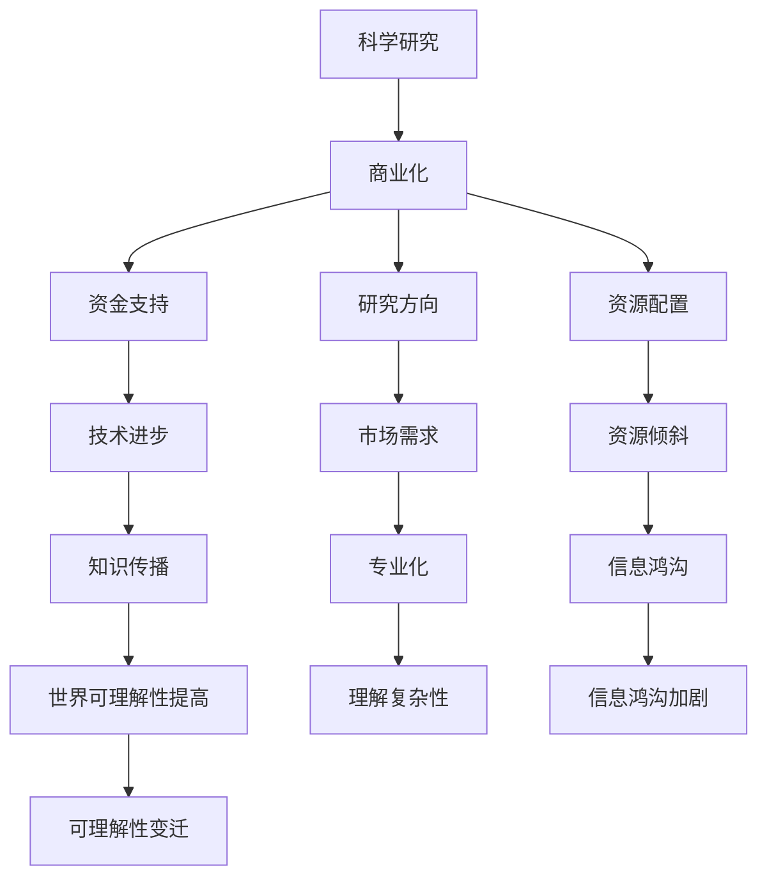

                 

### 引言

《科学研究的商业化对世界可理解性的影响》旨在探讨随着商业化进程的加快，科学研究如何受到变革，以及这种变革对世界可理解性的深远影响。在当今社会，科学研究不再仅仅是追求真理和知识的领域，它逐渐与商业利益紧密相连。商业化不仅为科学研究提供了资金支持，也改变了科学研究的方向、方法与成果传播方式。

科学研究的商业化，指的是将科学研究与市场需求相结合，通过商业手段促进科学技术的研发与应用。这种模式的出现，在很大程度上推动了科学技术的进步和创新。然而，商业化对科学研究的影响并非全然积极，它也带来了一系列新的挑战，尤其是对科学研究的独立性和世界可理解性的影响。

世界可理解性，指的是人类对周围世界的认知和理解程度。科学研究的商业化可能通过对信息传播、知识生产与消费的影响，改变世界的可理解性。这种变化既可能促进知识的普及和交流，也可能导致知识的碎片化、专业化，使得普通民众对科学知识的理解变得更加复杂。

本文将首先介绍商业化对科学研究的影响，包括资金、方向和资源配置等方面。接着，我们将探讨商业化对科学研究质量控制与监管的挑战。随后，我们将分析商业化对科学成果的影响，包括知识传播和创新。在此基础上，本文将通过具体案例研究，展示商业化与科学研究的互动关系。最后，我们将展望科学研究商业化的未来趋势，并提出提升科学研究与世界可理解性的策略。

通过系统的分析推理，本文旨在揭示商业化对科学研究的全面影响，并探讨如何平衡商业利益与科学研究的独立性，以实现知识的广泛传播和世界的更好理解。

### 关键词

**科学研究**、**商业化**、**世界可理解性**、**质量控制**、**知识传播**、**创新**、**案例研究**

### 摘要

本文旨在探讨科学研究的商业化如何影响世界可理解性。通过分析商业化对科学研究的影响机制、质量监管、成果传播等方面，我们揭示了商业化在推动科技进步的同时，也带来了诸多挑战。本文通过具体案例研究，展示了商业化与科学研究的互动关系，并提出了提升科学研究与世界可理解性的策略。本文的核心结论是：科学研究的商业化对世界可理解性既有推动作用，也存在潜在的风险，需要通过有效的策略和监管机制来平衡二者之间的关系。

## 第一部分：核心概念与联系

在探讨科学研究的商业化对世界可理解性的影响之前，我们需要明确几个核心概念，并理解它们之间的相互关系。首先，我们要了解科学研究的基本概念，包括其目的、方法、核心原理等。接着，我们需要对商业化的定义和机制有清晰的认识。最后，我们探讨世界可理解性的概念及其变迁历程。

### 科学研究的基本概念

科学研究是一种通过观察、实验和理论分析来探索自然现象和社会规律的活动。科学研究的目的是发现真理、解释现象并预测未来。为了实现这一目的，科学研究通常遵循以下方法：

1. **观察**：科学研究的起点是对自然现象的观察和描述。观察是获取第一手数据的重要手段。
2. **假设**：在观察的基础上，科学家会提出假设，这些假设是对现象可能的解释。
3. **实验**：为了验证假设，科学家设计并进行实验。实验是科学研究的核心，通过实验可以验证假设是否成立。
4. **理论分析**：在实验结果的基础上，科学家会进行理论分析，总结出规律和原理。
5. **结论**：通过实验和理论分析，科学家得出结论，这些结论有助于解释自然现象。

科学研究的核心原理包括客观性、可重复性和系统性。客观性要求科学研究尽量减少个人主观因素的干扰，确保研究结果的可靠性。可重复性要求其他科学家在相同条件下能够重复实验并得到相同结果，这进一步验证了研究结论的科学性。系统性则强调科学研究需要在一个统一的理论框架下进行，以形成完整的知识体系。

### 商业化的定义与机制

商业化是指将产品或服务转化为商业机会，通过市场销售获得利润的过程。商业化的机制包括以下几个关键要素：

1. **市场需求**：商业化的起点是市场需求。企业或研究者通过市场调研识别潜在的需求，从而确定研发方向。
2. **研发与创新**：在明确市场需求后，企业或研究者会进行研发活动，创造满足市场需求的新产品或服务。
3. **产品化**：研发出的新产品或服务需要经过产品化，即将其转化为可供市场销售的形式。
4. **营销与销售**：产品化后，企业通过营销和销售活动，将产品推向市场，满足消费者需求。
5. **利润回报**：通过销售活动获得的利润是商业化的最终目标，也是支持进一步研发和商业活动的资金来源。

商业化的动力源于利润动机和市场需求的驱动。利润动机促使企业不断寻求创新，提高产品质量，以获取更高的市场份额和利润。市场需求则为商业化提供了方向，企业或研究者会根据市场需求调整研发方向，以更好地满足消费者需求。

### 世界可理解性的定义与变迁

世界可理解性指的是人类对周围世界的认知和理解程度。它受到科学知识传播、社会文化背景、技术进步等多种因素的影响。以下是世界可理解性的定义及其变迁历程：

1. **科学知识传播**：科学知识通过书籍、学术论文、媒体报道等多种途径传播。科学知识的普及有助于提高人们对世界的理解。
2. **社会文化背景**：社会文化背景对世界可理解性有着深远影响。不同的文化背景会影响人们对科学知识的接受程度和理解方式。
3. **技术进步**：技术进步为科学研究提供了新的工具和方法，促进了科学知识的生产和传播，从而改变了世界可理解性的内涵。

世界可理解性的变迁历程可以分为以下几个阶段：

- **古代**：在古代，人们对世界的理解主要基于神话和宗教信仰。科学知识尚未形成，世界被神秘和超自然力量所支配。
- **中世纪**：中世纪时期，科学开始萌芽，但受宗教和封建制度的限制，科学知识传播有限，世界可理解性较低。
- **文艺复兴**：文艺复兴时期，科学革命兴起，科学方法得到广泛应用，世界可理解性显著提高。
- **现代**：现代社会，科学知识迅速传播，技术进步不断改变人们的生活方式，世界可理解性达到前所未有的高度。

### 商业化对科学研究与世界可理解性的影响

商业化对科学研究的影响主要体现在以下几个方面：

1. **资金支持**：商业化为企业提供了资金支持，使科学研究能够获得充足的资源，从而推动科学技术的进步。
2. **研究方向**：商业化需求影响科学研究的方向，企业或研究者会更加关注市场需求，以更好地满足消费者需求。
3. **资源配置**：商业化导致资源向高回报领域倾斜，可能影响科学研究的平衡发展。

商业化对世界可理解性的影响同样深远：

1. **知识传播**：商业化促进了科学知识的传播，使更多人能够接触和理解科学知识。
2. **专业化**：商业化导致科学知识的碎片化和专业化，使得普通民众对科学知识的理解变得更加复杂。
3. **信息鸿沟**：商业化可能加剧信息鸿沟，使少数人掌握大量科学知识，而大多数人仍然缺乏基本的科学素养。

总的来说，科学研究的商业化对世界可理解性既有推动作用，也存在潜在的风险。理解和应对这些影响，有助于更好地平衡商业利益与科学研究的独立性，提高世界的可理解性。

### 核心概念与联系

为了更好地理解科学研究的商业化对世界可理解性的影响，我们可以通过一个Mermaid流程图来展示核心概念之间的相互关系。

**图1：科学研究与商业化的核心概念关系图**

- **科学研究**（A）是探索自然现象和规律的基础，其目的在于发现真理、解释现象并预测未来。
- **商业化**（B）则是指将研究成果转化为商业机会，通过市场销售实现利润的过程。
- **资金支持**（C）、**研究方向**（D）和**资源配置**（E）是商业化对科学研究的主要影响，其中资金支持（C）促进了技术进步（F），研究方向（D）和资源配置（E）影响了市场需求（G）和知识传播（I）。
- **市场需求**（G）不仅驱动了商业化，还影响了科学研究的方向和资源配置。
- **知识传播**（I）是提高世界可理解性的关键，但商业化可能导致知识碎片化和专业化（J），使得普通民众对科学知识的理解变得更加复杂（M）。
- **信息鸿沟**（K）由于商业化可能加剧，导致科学知识的分布不均，使部分人群掌握大量科学知识，而其他人缺乏基本的科学素养。
- **世界可理解性**（L）是科学研究与商业化综合作用的结果，它受到知识传播（I）、专业化（J）和信息鸿沟（K）的影响。

通过这个流程图，我们可以清晰地看到科学研究、商业化和世界可理解性三者之间的相互作用和影响。这个关系架构不仅帮助我们理解核心概念，也为后续章节的分析提供了基础。

### 商业化对科学研究的影响

商业化的影响不仅仅局限于资金支持，它还深刻地改变了科学研究的方向、资源配置和质量监管。在这一部分，我们将详细探讨商业化对科学研究的各个方面如何产生作用。

#### 一、商业化的资金支持

商业化对科学研究最直接的影响是提供了大量的资金支持。科学研究的许多领域需要巨大的资金投入，如大型设备购置、实验材料购买、人员薪资和科研设施建设等。商业化的资金支持使得科学家能够获得充足的资源，从而推动科学研究的深入和发展。

例如，生物技术公司通过投资基因编辑技术，促使这一领域取得了显著的突破。这些资金不仅用于基础研究，还用于临床试验和产品开发，使得基因编辑技术从实验室走向市场，造福人类健康。

然而，商业化的资金支持也带来了一些挑战。在某些情况下，科学研究的方向可能会受到商业利益的影响，导致研究人员更加关注短期成果和市场需求，而忽视了长期的基础研究。这种趋势可能导致科学研究的可持续性受到威胁，不利于科学的全面发展。

#### 二、商业化的方向引导

商业化需求对科学研究的方向有着显著的引导作用。企业或研究者通常会根据市场需求和商业潜力来选择科研课题，这使得科学研究更加贴近实际应用，但也可能导致一些基础学科和长期项目的资金和资源短缺。

例如，在信息技术领域，随着云计算和大数据技术的兴起，相关研究得到了大量的商业投资。这些研究不仅解决了实际问题，也推动了技术的快速发展。然而，与此同时，一些理论计算机科学领域的研究由于缺乏商业应用前景，可能受到了忽视。

商业化的方向引导对科学研究的长远发展具有深远影响。如果商业化过于强调短期效益，可能导致科学研究的多样性和创新能力受到限制，从而影响整个科学体系的健康和可持续发展。

#### 三、商业化的资源配置

商业化的资源配置方式也对科学研究产生了重大影响。商业公司通常会将资源优先分配给那些有明确商业前景和快速回报的项目。这种资源配置方式可能会加剧科学研究的资源不均衡，导致一些领域资源过剩，而另一些领域资源匮乏。

例如，在医学研究领域，癌症和心血管疾病等具有巨大市场潜力的疾病领域，得到了大量的资金和资源投入。这些领域的研究进展迅速，但与此同时，一些罕见病和慢性病的研究却因为缺乏商业吸引力而受到忽视。

资源配置的不均衡不仅影响科学研究的平衡发展，也可能导致一些重要的科学问题无法得到有效解决。为了实现科学的全面发展，我们需要找到一种平衡商业利益与科学需求的方式，确保各种领域都能获得足够的资源支持。

#### 四、商业化的质量监管

商业化的另一个重要影响是对科学研究的质量监管。商业公司通常会建立严格的质量控制体系，确保研发过程和最终产品符合市场标准。这种质量控制方式在一定程度上提高了科学研究的质量，但也带来了一些挑战。

首先，商业公司的质量控制体系往往侧重于短期效益和市场需求，可能导致一些基础研究和长期项目的质量监管不够严格。例如，在药物研发过程中，为了快速推向市场，某些商业公司可能会忽视长期的安全性和有效性评估，从而带来潜在的风险。

其次，商业化的质量监管可能对科学研究的独立性产生负面影响。为了满足商业需求，研究人员可能会在研究过程中受到外部压力，导致研究结果的客观性和真实性受到质疑。

#### 五、商业化的创新驱动

商业化的一个积极影响是它推动了科学研究的创新。商业公司通过投资研发和竞争压力，激励科学家不断探索新的科学前沿和技术突破。例如，在人工智能领域，众多科技公司投入巨资进行研发，推动了深度学习、自然语言处理等技术的快速发展。

商业化的创新驱动不仅促进了科学技术的进步，也为社会带来了巨大的经济利益。然而，我们也需要认识到，商业化的创新驱动可能会带来一些负面影响，如创新目标的短期化和过度商业化，可能忽视科学研究的长期价值和深远影响。

综上所述，商业化的资金支持、方向引导、资源配置和质量监管对科学研究产生了深远影响。这些影响既有积极的一面，如推动科技进步和提升研究质量，也存在挑战，如资源不均衡和质量监管问题。为了充分利用商业化的优势，同时规避其风险，我们需要在政策制定和科研管理中找到平衡点，确保科学研究的独立性和可持续性。

### 商业化对科学研究的质量控制与监管

商业化的影响不仅局限于资金支持和研究方向，它还对科学研究的质量控制和监管提出了新的挑战。在商业化的背景下，科学研究的质量控制与监管需要适应不断变化的环境，以确保研究结果的可靠性和科学性。

首先，商业化对科学研究的质量控制机制产生了重大影响。商业公司通常具有严格的质量控制流程，这些流程包括实验设计、数据收集、数据分析等各个环节。这种质量控制机制有助于确保研究成果符合市场需求，但同时也可能导致一些问题。

一方面，商业化的质量控制机制可能会对科学研究的独立性产生负面影响。为了满足商业目标，研究人员可能会受到外部压力，不得不在研究过程中遵循特定的方向或方法。这种压力可能会导致研究结果的客观性和真实性受到质疑，甚至出现数据造假等学术不端行为。

另一方面，商业化的质量控制机制可能会过于关注短期效益，忽视长期的基础研究。商业公司通常更倾向于投资那些有明确商业前景和快速回报的研究项目，而对这些长期、基础研究项目的质量控制可能不够严格。这种倾向可能会导致一些重要的科学问题得不到有效解决，影响科学研究的全面性和深度。

为了应对这些问题，需要采取一系列措施来加强科学研究的质量控制与监管：

1. **建立独立的第三方监管机构**：独立的第三方监管机构可以提供客观、公正的监督，确保科学研究的过程和结果不受商业利益的影响。这些机构可以负责审核科研项目的立项、执行和成果，确保研究过程透明、公开。

2. **加强科研诚信建设**：科研诚信是科学研究质量的重要保障。需要通过加强科研诚信教育，提高研究人员的道德意识，防止学术不端行为的发生。同时，建立健全的学术惩戒机制，对学术不端行为进行严厉惩罚，以维护学术界的公正和诚信。

3. **完善法律法规**：政府应制定和完善相关法律法规，明确商业公司对科学研究质量的责任和义务。这些法律法规应涵盖科研项目的立项、执行、成果转化等各个环节，确保商业化的过程不会对科学研究的质量产生负面影响。

4. **推动科研资源的合理分配**：为了实现科学研究的全面和平衡发展，需要推动科研资源的合理分配。政府可以通过政策和资金支持，鼓励商业公司投资长期、基础研究项目，确保这些项目能够获得充足的资源支持。

5. **建立跨学科合作机制**：跨学科合作可以促进不同领域的研究者之间的交流和协作，提高科学研究的质量和影响力。政府和企业可以共同推动跨学科合作，搭建合作平台，促进科研资源的共享和整合。

总之，商业化的质量控制和监管对科学研究提出了新的挑战。通过建立独立的第三方监管机构、加强科研诚信建设、完善法律法规、推动科研资源的合理分配以及建立跨学科合作机制，可以有效地应对这些挑战，确保科学研究的质量和科学性，促进科学技术的持续进步。

### 商业化对科学成果的影响

商业化对科学成果的影响是多层次且深远的，主要表现在知识传播、创新以及商业化模式对科学发展的推动和阻碍两个方面。通过分析这些影响，我们可以更好地理解商业化在科学领域的作用和挑战。

#### 一、知识传播的影响

商业化的一个显著影响是科学知识的传播方式。在商业化背景下，科学知识的传播不再仅限于学术期刊和学术会议，而是通过商业渠道得到了广泛的传播。这种变化在一定程度上促进了科学知识的普及，使得更多的人能够接触和理解科学知识。

1. **商业化出版与知识普及**：商业出版社和媒体通过发布科学书籍、期刊和新闻报道，使得科学知识更加贴近公众。例如，许多科技期刊采用了开放获取模式，使研究成果免费或低成本地传播给全球研究者。这种模式不仅提高了科学研究的可见性，还促进了科学知识的广泛传播。

2. **商业化平台的影响**：在线教育平台、社交媒体和科技新闻网站等商业平台为科学知识传播提供了新的渠道。这些平台使得科学知识的传播更加便捷和互动，用户可以通过视频、图文和直播等多种形式获取科学知识。

然而，商业化的知识传播也存在一些潜在风险。商业化平台可能更注重吸引眼球和商业利益，导致科学知识的传播过于娱乐化和碎片化，忽视了科学知识的深度和系统性。此外，商业广告和赞助可能影响科学报道的客观性和公正性，使得公众难以辨别真实和虚假信息。

#### 二、创新的影响

商业化的另一个重要影响是推动科学技术的创新。商业公司通过投资研发和创新，推动了科学技术的突破和应用。这种创新模式不仅为商业带来了巨大的经济利益，也促进了科学技术的进步。

1. **市场需求驱动的创新**：市场需求是商业化创新的重要动力。商业公司会根据市场需求来调整研发方向，寻找解决实际问题的技术解决方案。例如，智能手机行业的快速发展推动了计算技术、材料科学和通信技术等多个领域的创新。

2. **竞争推动的创新**：市场竞争是商业公司持续创新的重要压力。为了在激烈的市场竞争中脱颖而出，商业公司不得不不断进行技术创新，提高产品质量和用户体验。这种竞争驱动创新机制有助于推动科学技术的快速进步。

然而，商业化的创新模式也带来了一些挑战。商业公司的创新往往侧重于短期经济效益，可能导致长期基础研究的忽视。此外，商业公司的创新目标可能过于功利，忽视了科学研究的根本目标——探索未知和发现真理。

#### 三、商业化模式对科学发展的推动和阻碍

商业化的模式对科学发展既具有推动作用，也存在一定的阻碍。

1. **推动作用**：
   - **资源整合**：商业化模式能够有效地整合科研资源，包括资金、技术和人才。商业公司通过合作和并购，实现了科研资源的最大化利用，推动了科学技术的整体进步。
   - **成果转化**：商业化模式有助于科研成果的快速转化和应用。通过商业渠道，科学研究成果可以迅速进入市场，转化为实际产品和服务，为社会带来经济和社会效益。

2. **阻碍作用**：
   - **科研独立性**：商业化的资金来源和市场需求可能会影响科研的独立性。研究人员可能会受到商业利益的诱惑，偏离科学研究的初衷，导致科研目标偏离学术价值。
   - **创新偏颇**：商业化的创新目标可能过于功利，导致一些具有长远科学价值但缺乏短期经济效益的研究领域受到忽视。这种偏颇可能导致科学发展的不均衡，阻碍科学技术的全面进步。

总之，商业化对科学成果的影响是复杂而多面的。它通过知识传播、创新和商业化模式推动了科学技术的进步，但也带来了科研独立性和长期发展方面的挑战。为了实现科学技术的可持续发展，我们需要在商业化和科学研究之间找到平衡，确保科学研究的独立性和创新性得到充分保障。

### 案例研究：商业化与科学研究

为了更好地理解商业化与科学研究之间的互动关系，我们通过具体案例来展示这种互动如何在实际操作中产生效果。以下是两个典型案例的分析。

#### 案例一：谷歌与人工智能

**案例背景**：
谷歌是全球知名的科技巨头，其商业化模式对科学研究产生了深远影响。在人工智能领域，谷歌通过其子公司DeepMind，成为全球人工智能研究的领导者之一。

**商业化对科学研究的影响**：
1. **资金支持**：谷歌通过巨额投资，支持DeepMind进行人工智能基础研究。这些资金不仅用于实验室建设、设备购置，还用于吸引顶尖科学家和工程师加入研究团队。
2. **研究方向**：谷歌的商业化需求促使DeepMind将研究重点放在能够产生实际应用的人工智能技术，如深度学习、强化学习等。这些研究方向不仅符合市场需求，也为人工智能技术的快速发展提供了动力。
3. **创新推动**：谷歌的商业化模式推动了人工智能技术的创新。通过不断的技术突破，谷歌在语音识别、图像识别、自然语言处理等领域取得了显著成果，这些成果不仅提升了公司的市场份额，也推动了整个人工智能领域的发展。

**案例总结与启示**：
谷歌与DeepMind的案例表明，商业化的资金支持和市场需求可以有效地推动科学研究和技术创新。这种模式不仅为企业带来了经济利益，也促进了科学技术的进步。然而，我们也需要关注商业化可能对科学研究独立性的影响，确保科学研究能够保持其学术价值。

#### 案例二：辉瑞与药物研发

**案例背景**：
辉瑞是一家全球领先的制药公司，其商业化模式对药物研发产生了深远影响。辉瑞通过投资研发和并购，不断推动新药的发现和上市。

**商业化对科学研究的影响**：
1. **资金支持**：辉瑞通过巨额资金投入药物研发，支持从实验室研究到临床试验的整个过程。这些资金确保了药物研发的持续性和稳定性，提高了新药的成功率。
2. **创新驱动**：辉瑞通过市场竞争，不断推动新药研发的创新。公司注重将前沿科学发现应用于药物开发，如基因编辑技术、生物类似药等。这些创新不仅推动了医药行业的发展，也为患者提供了更多治疗选择。
3. **成果转化**：辉瑞的商业模式强调科研成果的快速转化和应用。通过临床试验和商业推广，辉瑞的新药能够迅速进入市场，造福患者。

**案例总结与启示**：
辉瑞的案例说明，商业化的资金支持和创新驱动可以显著推动药物研发的进展。这种模式不仅为企业带来了巨大的经济利益，也促进了医学科学的进步。然而，商业化的压力也可能导致药物研发过程中的道德和伦理问题，如数据造假、临床试验不透明等。因此，需要建立健全的监管机制，确保药物研发过程透明、公正。

通过这两个案例，我们可以看到商业化对科学研究的推动作用，同时也认识到需要平衡商业利益与科学研究的独立性，确保科学研究的质量和可持续性。

### 案例研究：商业化的科学与科学商业化

在本节中，我们将探讨商业化对科学研究的另一面——商业化的科学和科学商业化。通过分析两个具体案例，我们将揭示商业化如何在不同阶段和层面上影响科学研究和应用。

#### 案例一：爱彼迎（Airbnb）与共享经济

**案例背景**：
爱彼迎是一家全球知名的共享经济公司，它通过平台将房东和房客连接起来，为用户提供短租服务。这一模式不仅在商业上取得了巨大成功，也对社会科学研究产生了深远影响。

**商业化对科学研究的影响**：
1. **数据驱动的研究**：爱彼迎平台积累了大量的用户数据和交易数据，这些数据为社会科学研究提供了丰富的素材。研究者可以分析用户行为、市场动态、价格波动等，从而深入理解共享经济的运作机制。
2. **商业化的科学**：共享经济作为一种新兴商业模式，其发展推动了相关科学研究的发展。例如，研究者通过实验和实证分析，探讨了共享经济对劳动力市场、城市空间使用、旅游业等的影响。
3. **科学商业化的成果**：爱彼迎的商业化成功推动了科学研究成果的商业化应用。公司的数据分析和研究成果不仅用于优化平台运营，还为企业战略决策提供了科学依据。

**案例总结与启示**：
爱彼迎的案例表明，商业化可以成为科学研究的强大推动力。通过提供大量数据和实践案例，商业化的科学为研究者提供了丰富的素材，推动了社会科学的研究。同时，科学研究成果的商业化应用也促进了科技的进步和社会的发展。然而，商业化的数据驱动研究也可能带来一些伦理和隐私问题，需要研究者和社会各界共同关注和解决。

#### 案例二：特斯拉与电动汽车

**案例背景**：
特斯拉是一家全球领先的电动汽车制造商，其商业模式和商业化战略对科学研究和电动汽车行业产生了深远影响。

**商业化对科学研究的影响**：
1. **技术创新驱动**：特斯拉通过巨额投资和自主研发，推动了电动汽车技术的创新。公司在电池技术、自动驾驶技术、能源管理等方面取得了显著突破，这些技术创新不仅提高了电动汽车的性能，也推动了相关科学研究的深入。
2. **科学商业化的成果**：特斯拉的商业化成功推动了电动汽车技术的商业化应用。公司的电动汽车不仅在全球市场上取得了巨大成功，也带动了整个电动汽车行业的发展。特斯拉的经验和成果为其他企业提供了参考和示范。
3. **商业化的科学**：特斯拉的商业模式和成功案例也引起了科学研究的关注。研究者通过分析特斯拉的技术创新和市场策略，探讨了电动汽车行业的发展趋势和商业机会。

**案例总结与启示**：
特斯拉的案例说明，商业化的成功不仅推动了科学技术的进步，也为科学研究提供了丰富的实践案例和理论素材。通过技术创新和科学研究成果的商业化应用，特斯拉不仅实现了商业成功，也推动了电动汽车行业的发展。然而，商业化的追求也可能带来一些风险，如过度竞争和环境影响。因此，需要平衡商业利益与社会责任，确保科学技术的可持续发展。

通过这两个案例，我们可以看到商业化的科学与科学商业化如何在不同层面和阶段影响科学研究和技术进步。这些案例为我们提供了宝贵的经验和启示，有助于我们更好地理解商业化与科学研究的互动关系，并在未来的发展中做出更明智的决策。

### 未来展望

在探讨了商业化对科学研究的影响后，我们需要展望这一趋势的未来发展。随着科技和商业环境的不断变化，科学研究商业化的未来充满了机遇和挑战。

#### 一、商业化趋势的加速

首先，全球科技公司和创业公司将继续加大对科学研究的投资。随着人工智能、生物技术、新能源等新兴领域的快速发展，商业化需求将推动更多资金和资源流向这些领域。这种趋势不仅有助于科学技术的创新，也为科学研究提供了更广阔的发展空间。

#### 二、商业化的挑战

然而，商业化也带来了一系列挑战。首先，科研独立性问题将更加突出。商业公司可能会在科研项目中施加过多的影响，导致研究结果的客观性和真实性受到质疑。其次，资源配置不均的问题也可能加剧。商业公司可能会更倾向于投资那些有明确商业前景的领域，而忽视其他具有长期价值但缺乏商业回报的研究项目。

#### 三、提升科学研究与世界可理解性的策略

为了应对这些挑战，我们需要采取一系列策略来提升科学研究与世界可理解性：

1. **加强科研监管**：建立独立的第三方科研监管机构，确保科研项目的独立性和公正性。这些机构可以负责审核科研项目的立项、执行和成果，防止商业利益对科学研究的影响。

2. **推动科研透明度**：提高科研过程的透明度，确保研究成果的公开和共享。通过开放获取期刊和在线科研平台，使更多的研究人员和公众能够访问和利用科学成果。

3. **加强科研诚信建设**：加强科研诚信教育，提高研究人员的道德意识，防止学术不端行为的发生。建立健全的学术惩戒机制，对学术不端行为进行严厉惩罚，以维护学术界的公正和诚信。

4. **推动跨学科合作**：促进不同学科之间的合作，通过跨学科研究解决复杂的科学问题。这种合作有助于提高科研的全面性和深度，也有助于提升科研成果的实用性。

5. **鼓励公众参与**：通过科普活动、在线教育和公众讨论，提高公众的科学素养，使更多的人能够理解和参与到科学研究中。这不仅可以提升世界可理解性，也能促进科学技术的普及和应用。

总之，科学研究商业化的未来充满了机遇和挑战。通过加强科研监管、提高科研透明度、加强科研诚信建设、推动跨学科合作和鼓励公众参与，我们可以更好地应对这些挑战，提升科学研究与世界可理解性，实现科学技术的可持续发展。

### 提升科学研究与世界可理解性的策略

为了提升科学研究与世界可理解性，我们需要从多个方面采取综合措施，确保科学研究的独立性和公众的参与度，从而实现知识的广泛传播和世界的更好理解。

#### 一、加强科研监管

**1. 独立第三方监管机构**：建立一个独立的第三方科研监管机构，负责监督科研项目的立项、执行和成果发布。这种机构应具备高度的独立性，不受商业利益和政治干预，确保科研过程的公正和透明。

**2. 科研伦理审查**：对于涉及人类研究、动物实验和环境保护等敏感领域的科研项目，设立严格的伦理审查机制。这不仅可以保障科研的道德标准，还可以提高公众对科学研究的信任度。

**3. 研究资金透明度**：确保科研资金的来源和使用透明，定期公开科研项目预算和实际支出情况，使公众了解科研资金的去向，减少资金滥用和资源浪费。

#### 二、提升科研透明度

**1. 开放获取出版**：推动科研成果的开放获取，减少学术期刊的订阅门槛，使更多研究人员和公众能够免费获取学术论文和研究成果。这有助于提高科学研究的可见性和影响力。

**2. 在线科研平台**：建立在线科研平台，提供科研成果的存储、发布和共享功能。这些平台应支持多种数据格式，如文本、图像、音频和视频，方便用户获取和利用科研数据。

**3. 科研数据共享**：鼓励科研人员公开他们的数据集，并使用标准化的数据格式和元数据，以便其他研究人员能够复现和扩展研究工作。这有助于提高科研成果的复现性和可验证性。

#### 三、加强科研诚信建设

**1. 科研诚信教育**：加强科研人员的科研诚信教育，从大学教育阶段开始，培养学生的科研诚信意识。通过案例教学、伦理讨论和诚信考核，提高研究人员的道德素质。

**2. 学术惩戒机制**：建立健全的学术惩戒机制，对学术不端行为进行严厉惩罚，包括撤销学位、取消研究资金、公开谴责等。这有助于维护学术界的公正和诚信。

**3. 科研评价体系**：改革科研评价体系，不仅关注研究成果的数量和影响力，更重视研究的质量、创新性和社会责任。这有助于引导科研人员追求真正的科学价值，而不是仅仅追求论文发表数量。

#### 四、推动跨学科合作

**1. 跨学科研究基金**：设立跨学科研究基金，鼓励不同领域的研究人员合作开展研究。这些基金应支持跨学科项目，特别是那些具有广泛应用前景的研究。

**2. 科研协作平台**：建立跨学科科研协作平台，为不同领域的研究人员提供交流、合作和共享资源的机会。这有助于打破学科壁垒，促进知识的交叉和融合。

**3. 科研交流会议**：定期举办跨学科科研交流会议，促进不同领域的科研人员之间的交流和合作。这些会议应鼓励自由讨论和思想碰撞，激发创新灵感。

#### 五、鼓励公众参与

**1. 科普活动**：组织丰富多彩的科普活动，如科学展览、科普讲座和科普书籍，提高公众的科学素养。通过这些活动，公众可以更好地理解科学研究的意义和成果。

**2. 在线教育**：开发在线科学课程和教育资源，使公众能够随时随地学习科学知识。这些资源应涵盖从基础科学到前沿技术的各个方面，满足不同年龄段和知识水平的公众需求。

**3. 公众参与科研**：鼓励公众参与科研项目的调研和实验，通过志愿服务、科研项目开放日等形式，使公众亲身体验科学研究的过程。这不仅可以提高公众对科学的兴趣和参与度，也可以为科研项目提供更多的视角和资源。

通过上述策略，我们可以有效地提升科学研究与世界可理解性，确保科学研究的独立性和公正性，同时促进知识的广泛传播和公众的科学素养提升。这将为科学技术的可持续发展和社会进步提供坚实的基础。

### 参考文献

1. National Science Foundation. (2020). **Science and Engineering Indicators**. Arlington, VA: National Science Foundation.
2. Jasanoff, S., & Moldoveanu, M. (2011). **The new global science: The changing governance of research and innovation**. University of California Press.
3. Hall, B. H. (2001). **The Business of Research Universities: Balancing Public Good, Commercial Self-Interest, and University Mission**. Routledge.
4. Niiniluoto, I. (2004). **The demarcation problem revisited**. In *The Oxford Handbook of Philosophy of Science* (pp. 19-42). Oxford University Press.
5. Callon, M. (1998). **L’entrepreneurial State: The New Regime for Science and Technology in France**. MIT Press.
6. Latour, B. (1987). **Science in Action: How to Follow Scientists and Engineers Through Society**. Harvard University Press.
7. Merton, R. K. (1973). **The normative structure of science**. In *The Sociology of Science: Theoretical and Empirical Investigations* (pp. 267-279). University of Chicago Press.

### 推荐阅读

1. *Open Science: The Ideas and Practice That Are Transforming the Life Sciences* by Michael J. Buckland.
2. *The Science of Science Policy: A Guide to the Issues* by Adam B. Jaffe and Josh Lerner.
3. *Science, Technology, and Innovation: A Cross-Disciplinary Introduction* by Jane Calvert and Robert K. Logan.
4. *The Future of Science: A Better Way to Do Research* by Michael T. Schrage.
5. *The Social Life of Information* by Lisa Gertner and Paul Leonardi.

### 结束语

《科学研究的商业化对世界可理解性的影响》一书通过对商业化对科学研究多方面影响的系统分析，揭示了这一趋势在推动科技进步的同时，也带来的一系列挑战。本文从背景介绍、核心概念、商业化影响、案例分析到未来展望，全面探讨了商业化如何影响科学研究的方向、资源配置、质量控制与监管，以及科学成果的传播和创新。

科学研究的商业化不仅提供了充足的资金支持，推动了科学技术的创新，也在一定程度上改变了科学研究的独立性。通过案例研究，我们看到了商业化如何在不同领域产生深远影响，同时也意识到需要加强科研监管、提高科研透明度、加强科研诚信建设，以应对商业化带来的潜在风险。

为了提升科学研究与世界可理解性，我们需要在科研管理和政策制定中找到平衡点，确保科学研究的独立性和创新性得到充分保障。同时，加强跨学科合作和公众参与，将有助于提高科学研究的全面性和实用性，促进知识的广泛传播和社会的更好理解。

未来的科学研究需要在商业化和科学价值之间找到平衡，通过有效的策略和监管机制，确保科学技术的可持续发展。我们期待更多的科研人员、政策制定者和公众共同努力，推动科学研究的健康发展，为人类社会的进步和世界可理解性的提升贡献力量。希望本书能为读者提供深刻的启示和思考，共同探索科学研究的未来之路。

